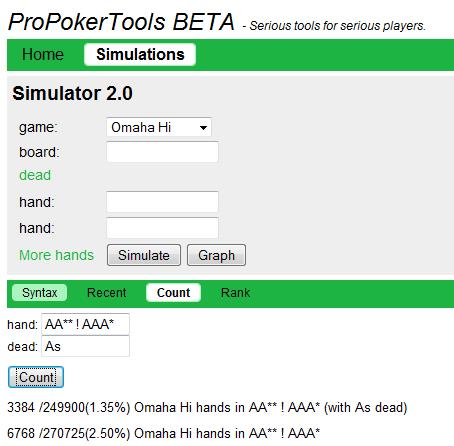

## 第 6 部分：4-bet 和防御 4-bet

### 6.1 简介

第 6 部分是一篇相当技术性的文章，我们将在其中彻底研究一个狭窄的主题：
- 4-bet
- 对抗 4-bet

当我们说“技术性”时，我们的意思是讨论将围绕数学、翻牌权益分布和对手范围的简单假设展开。原因是，在 100 BB 起始筹码的情况下，我们在 4-bet 后还剩下 1 个底池大小的下注（假设到目前为止的所有加注都是底池大小）。因此翻牌后的玩法（如果有的话）归结为范围 / 底池赔率的决定。

这对我们来说意味着两件事：

1. 100 BB 筹码的 4-bet 底池是大底池，大底池是重要的底池。
2. 100 BB 筹码的 4-bet 底池的正确玩法可以用（相对）简单的数学很好地描述。

技术性和一成不变的策略很容易学习。因此，4-bet / 对抗 4-bet 的主题为我们提供了大量“唾手可得的成果”，并且该领域的漏洞（例如，在单挑 4-bet 底池中翻牌时太容易弃牌）通常很容易修复。

我们已经拥有必要的工具（翻牌权益分布、底池赔率 / 权益、ProPokerTools），并且我们在本文中所做的一切都已在之前的文章中讨论过。那些需要复习翻牌权益分布的人可以重读第 3 部分。

为了使讨论简单并集中于最重要的概念，我们将假设我们在整篇文章中都使用 100 BB 筹码进行游戏，并且我们将研究不是盲注对抗的单挑游戏。换句话说，我们将研究单挑场景，其中：
- 我们加注并被有位置的玩家 3-bet
- 我们对有位置的加注者 3-bet，而他 4-bet 我们

我们首先讨论 4-bet，然后对抗 4-bet。我们将在整个过程中用示例说明该理论。

### 6.2 4-bet

作为本主题的介绍，让我们看一个示例场景：

#### 6.2.1 松散范围的 3-bet 示例

6-max $10PLO

您（$10）     在 CO 位置加注到 3.5 BB，按钮（$15.20）3-bet 到 12 BB，对手弃牌。您只与按钮玩家打了 60 手牌，但您已经看到他有位置地用投机牌 3-bet 4 次，并打到摊牌。您怀疑他有投机 3-bet 和诈唬 3-bet 的广泛范围。您的计划是什么？

首先，让我们想想如果对手只 3-bet AAxx，这种情况会如何发生：

面对只 3-bet AAxx 的对手，我们最多有 34% 的翻牌前权益来对抗随机 AAxx（ProPokerTools 计算），手牌中有一对和一张 A。因此 4-bet 是不可行的，因为我们将被 5-bet，并被迫以大劣势跟注剩余的筹码（我们必须跟注，因为我们将获得 > 2 : 1 的底池赔率，而劣势则低于 2 : 1）

如果对手 3-bet 所有 AAxx，然后在翻牌后过度玩它们，从数学上讲，通过跟注并在翻牌后玩“不中就弃牌”来玩这个优质对子是可能的（我们可以使用翻牌权益分布建模来展示这一点），在这种情况下，我们可以考虑跟注。但如果对手只用好的 AAxx 进行 3-bet，并且在翻牌后玩得很好，他就会将我们的隐含赔率保持在最低水平，而我们将很难让这笔跟注对我们有利可图。

因此，无论我们的手牌看起来有多好，如果另一种选择是跟注并在不利位置打“不中就弃牌”，那么我们都有充分的理由在面对只对好 AAxx 进行 3-bet 的优秀玩家时弃牌。无论如何，如果我们被 AAxx 3-bet，无论对手的倾向如何，我们都必须用我们的优质手牌做出一个接近且棘手的决定。但是当对手 3 -bet 范围很广时会发生什么？

面对利用其位置优势对非 AAxx 手牌进行 3-bet 范围很广的对手，我们显然不能弃牌。我们的手牌在对手的大部分手牌中占据主导地位，我们经常会翻牌出最好的手牌、最好的抽牌或两者兼而有之。所以我们至少应该跟注。

跟注是最好的选择吗？不一定，因为跟注使我们在不利位置打翻牌后几乎 90% 的剩余筹码。这给了对手更多机会在翻牌后利用他的位置优势。

但是如果我们 4-本土 底池到 $3.75 怎么样？现在我们消除了对手的隐含赔率，因为如果我们的筹码中只剩下不到一个底池大小的下注，他的跟注将使我们至少翻牌获得一对高对。请注意，如果他 5-bet 全压，我们必须跟注，因为我们将获得底池赔率 $13.9 ：$6.25 = 2.22 : 1（我们需要 31% 的权益，而我们有 34%）。但是由于对手的 3-bet 范围很广，而且我们手中有一张 A（这使对手拥有 AAxx 的可能性降低了一半），他通常不会拥有 AAxx。在这种情况下，他会弃牌或跟注。如果他弃牌，那太好了！如果他跟注，我们在翻牌前拥有最好的手牌，我们可以像拥有 AAxx 一样玩剩下的手牌。换句话说，我们可以有利可图地推任何翻牌，而对手对此无能为力。

因此，最重要的因素是：

- 对手很少有 AAxx，因为他 3-bet 范围很广，而我们手里有一张 A
- 我们的 KKxx 在对抗反派的非 AAxx 牌时几乎和 AAxx 一样好。

**结论：**

我们 4-bet 底池到 $3.75。对手跟注。

**Flop:**   （$7.50）

您的筹码剩下 $6.25。您的计划是什么？

您已经做好了有利可图地全压任何翻牌的准备，而对手无法利用这一点，这是对您来说更好的翻牌之一。它不协调，您有一对高牌 + 唯一更好的对子的出牌 + 两个后门同花听牌和一个后门顺子听牌。

**Flop:**   （$7.50）

您（$6.25）全压，按钮（$11.45）跟注。

**Turn:**    （$20.15）

**River:**     （$20.15）

您凭借坚果同花获胜。按钮是     。他翻牌拿到两对，在转牌时改进为顺子，但
输给了我们的后门同花。

哇哦！看起来我们在这里很幸运，但真的是这样吗？我们在翻牌前有 65% 的权益（ProPokerTools 计算），并且作为大热门压上了大部分筹码。

然后对手以两对的翻牌领先了我们，其余筹码在翻牌压上时有 34% 的权益（ProPokerTools 计算）。但我们的翻牌玩法在数学上是正确的，即使我们看到反派的手牌，我们也会全压，因为我们的底池赔率 > 2 : 1，劣势小于 2 : 1。

请注意，我们翻牌权益的很大一部分（3 张后门抽牌 = 3 张出路）来自我们以优质协调手牌开始的结果。这次，正是后门抽牌之一拯救了我们。对于某些人来说，这看起来像是运气，但这是我们在以优质手牌开始时经常期望发生的事情。优质起手牌通常会在翻牌时除了手牌的主要强度成分外，还带来额外的权益，这让我们有更多的翻牌，我们可以从中获利并实现所有权益。

我们将从这个例子中汲取见解，并更深入地研究轻度 4-bet（即用非 AAxx 手牌进行 4-bet）对抗松散的 3-bet 对手。

### 6.2.2 什么是松散的 3-bet 范围？

在我们决定用哪些牌对松散的 3-bet 进行 4-bet 之前，让我们首先就什么是松散的 3-bet 范围达成一致。

我们首先分析我们自己的 3-bet 单挑范围，然后将百分比分配给此范围内的不同类型的牌。对于此任务，我们使用 ProPokerTools Beta 版中的“Count”功能。

从第 4 部分我们记得我们核心策略 3-bet 范围的价值部分是：

- 优质 AAxx，至少是单同花，有一对、2 张百老汇牌或一个连牌
- 优质百老汇包牌，至少是单同花，最好是一张 A
- 优质 KKxx、QQxx、JJxx，至少是单同花，有连牌边牌或另一对高牌

例如：

   

   

   

   

   

   

   

   

   

而投机性的 3-bet 范围是：

- 好的同花连牌
- A 同花带好的连牌 

例如：

   

   

   

   

   

   

   

   

   

让我们非常具体地定义一个总的 3-bet 范围，并根据这些定义用 ProPokerTools 符号表示。我们首先将总范围分成不重叠的子范围（不重叠 = 每手牌都位于一个且只有一个子范围内）。

对于每个子范围，我们计算组合数以及它们占所有起手牌的百分比（通过除以奥马哈牌总数，即 270725）。最后，我们通过将所有子范围的百分比相加来计算总的 3-bet 百分比（我们可以进行此求和，因为子范围不重叠）。

#### 6.2.2.1 优质 AAxx 牌

我们的起点是所有 AAxx 牌（但不包括 AAAx）的范围：

AA** ! AAA*
= 6768 / 270725 (2.50%)

然后我们将优质 AAxx 牌的范围定义为所有双同花 AAxx 的范围，加上所有单同花 AAxx 的范围，其中有两张百老汇牌、一对或一个连张（两张相连的牌，3 张或以上称为连牌）带一个缺口（gap），范围低至 76 / 86：

(AA** & (\*s\*s\*h\*h,\*s\*s\*d\*d,\*s\*s\*c\*c,\*h\*h\*d\*d,\*h\*h\*c\*c,\*d\*d\*c\*c)),
((AABB,AABT,AATT,AA99,AA88,AA77,AA66,AA55,AA44,AA33,AA22,AAT9,AAJ9,AA98,AAT8,AA87,AA97,AA76,AA86) & (\*s\*s\*\*,\*h\*h\*\*,\*d\*d\*\*,\*c\*c\*\*))
! AAA*

= 2160 / 270725 (0.80%)

根据此定义，2160 / 6768 = 0.32 = 32% 的 AAxx 手牌为优质手牌。

##### 6.2.2.2 高级百老汇牌

我们将其定义为任意 4 张 T 或更高牌，或任意 4 张 9 或更高牌（带有一张 A）的范围（但不包括 AAxx、TTxx、99xx 或三条）。我们将此范围写为两个子范围：

四张 T 或更高点数的牌：

(BBBB,BBBT) & (\*s\*s\*\*,\*h\*h\*\*,\*d\*d\*\*,\*c\*c\*\*) ! (AA\*\*,KKK\*,QQQ\*,JJJ\*,TT\*\*)

= 2762 / 270725 (1.02%)

四张 9 或更高点数且带有一张 A 的牌：

(A9BB,A9BT) & (\*s\*s\*\*,\*h\*h\*\*,\*d\*d\*\*,\*c\*c\*\*) ! (AA\*\*,TT\*\*)

= 1644 / 270725 (0.61%)

请注意，这些范围不重叠，并且它们也不与先前定义的 AAxx 范围重叠。您可以通过合并范围来检查这一点。然后，您将看到合并范围包含的手牌数量与子范围中手牌数量的总和完全相同。

无论如何，优质百老汇手牌的子范围构成了 2762 + 1644 = 4406 种组合，占所有奥马哈手牌的 1.02% + 0.61% = 1.63%。

#### 6.2.2.3投机牌

我们将好牌的子范围定义为所有从 xxx9 到 xxx5 的牌的范围，至少是单同花并且结构中最多只有一个间隙：

(QJT9,KJT9,KQT9,KQJ9,JT98,QT98,QJ98,QJT8,T987,J987,JT87,JT97,9876,T876,T976,T986,8765,9765,9865,9875) & (\*s\*s\*\*,\*h\*h\*\*,\*d\*d\*\*,\*c\*c\*\*) 

= 4640 / 270725 (1.71%)

具有好牌的同花 A 的范围定义为从 Axx8 到 Axx5 的同花 A 的范围，最多有一个缺口的连牌：

(AT98,AJ98,AJT8,A987,AT87,AT97,A876,A976,A986,A765,A865,A875) & (As\*s\*\*,Ah\*h\*\*,Ad\*d\*\*,Ac\*c\*\*)

= 1776 / 270725 (0.66%)

根据这些定义，投机性 3-bet 牌型的子范围总共构成 4640 + 1776 = 6416 种组合，占所有奥马哈牌型的 1.71% + 0.66% = 2.37%。

#### 6.2.2.4 总范围

- 优质 AAxx 牌：2160 / 270725 (0.80%)
- 优质百老汇牌：4406 / 270725 (1.63%)
- 投机牌：6416 / 270725 (2.37%)
- 总计：12982 / 270725 (4.80%)

因此，我们最终得出 3-bet 百分比为 4.80%。我们将此数字四舍五入为 5%，并将其用作在位置上用优质高牌牌和优质投机牌进行 3-bet 单挑的基准。

此 3-bet 范围中的 AAxx / 百老汇牌部分占所有牌的 0.80% + 1.63% = 2.43%。这些牌占总 3-bet 范围的 2160 / 12982 + 4406 / 12982 = 0.166 + 0.339 = 16.6% + 33.9% = 50.5%。因此，3-bet 范围大约在优质高牌牌和优质投机牌之间各占一半（我们选择以此方式定义这些类别），并且范围的 1/6 是 AAxx 牌。

请注意，优质 AAxx + 优质百老汇牌的数量（占所有奥马哈牌的 2.43%）几乎等于所有 AAxx 牌的百分比（占所有奥马哈牌的 2.50%）。因此，如果您被 3-bet% 约为 2.5% 的玩家 3-bet，这并不一定意味着他只用 AAxx 牌 3-bet。这也可能意味着用范围很紧的优质 AAxx 和优质百老汇牌。无论如何，这种紧的 3-bet 范围不是您想用轻度 4-bet 攻击的，即使对手并不总是有 AAxx。

还有一点需要评论：我们在这里整理的 3-bet 范围大约是我们在有位置上进行 3-bet 单挑时使用的核心策略范围。但这并不意味着每次出现这种情况时，我们都会用所有这些投机牌 3-bet（我们还必须评估情况，而不仅仅是我们的牌）。这意味着我们 3-bet 后范围内的牌型分布不一定与可能的 3-bet 牌型范围内的牌型分布相同。

无论如何，这个范围包括优质同花和协调的高牌手牌和投机牌，它们在与加注者的 3-bet 底池单挑中都发挥良好。我们将使用相关的 3-bet 百分比 ~5% 作为基准来评估其他 3-bet 范围。

现在我们问：

*3-bet% 必须有多大才能对抗对手较宽范围的投机牌 3-bet？*

我们首先假设一个激进的 3-bet 者在对我们有位置时会用较松的 AAxx 牌 3-bet。所以让我们将所有 AAxx 牌都纳入范围，看看我们得到什么：

- 所有 AAxx 牌：6768 / 270725 (2.50%)
- 优质百老汇牌：4406 / 270725 (1.63%)
- 投机牌：6416 / 270725 (2.37%)
- 总计：17590 / 270725 (6.50%)
- 
3-bet% 增加到 6.5%。请注意，AAxx 牌在范围内的相对百分比增加到 6768/17590 = 0.385 = 38.5%，因此这不一定是我们想要用轻度 4-bet 攻击的范围。
  
但我们可以得出这样的结论：当我们计算了所有 AAxx 牌加上其他牌类中剩余的最佳牌时，3-bet 百分比仍然 < 7%。

现在，假设我们遇到一个非常松散激进的玩家，按钮位置的 3-bet 百分比为 12%。根据上述范围分析，我们知道他的范围必须包含大量中 / 低质量的牌。例如，质量一般的连牌     。

因此，您可以从范围分析工作中得出的结论是，价值 3-bet 和用好的投机手牌 3-bet 的阈值在 5 - 7% 左右（取决于我们包括了多少 AAxx 手牌）。我们还看到，仅用优质 AAxx 手牌和优质百老汇手牌进行 3-bet 的阈值约为 2.5%。最后，对所有 AAxx 手牌和仅对 AAxx 手牌进行 3-bet 的玩家的 3-bet 百分比为 2.5%。

有了这些百分比，您现在可以使用玩家统计数据 + 阅读 + 摊牌时看到的手牌来决定是否应该用轻度 4-bet 来对抗 3-bet 者。

“轻度 4-bet”在这里意味着对所有 AAxx + 选定的优质非 AAxx 手牌进行 4-bet。确定我们可以 4-bet 哪些非 AAxx 手牌是该过程的下一步。

### 6.2.3 面对松散的 3-bet 者，合理的核心策略 4-bet 范围是什么？

当我们从只用 AAxx 牌 4-bet 转变为在单挑 3-bet 场景中用 AAxx 牌和优质非 AAxx 牌 4-bet 范围时，我们基于对手用很宽的范围 3-bet 这一事实。因此，他很少有 AAxx，而且他的许多非 AAxx 牌质量都令人生疑。

在这种情况下，优质高牌牌（例如     、    、    ）的权益将增加，原因有两个：

- 我们很少对抗 AAxx
- 我们对付对手的非 AAxx 牌有很好的权益

后者基于这样一个事实：当对手持有一些中/低手牌（例如     ）时，我们的高对子的表现几乎与 AAxx 一样好。

例如，对手持有     对抗 AAxx 的权益为 40.32%（ProPokerTools 计算），对抗 KKxx 的权益为 39.84%（ProPokerTools 计算），因此当我们 4-bet 时，持有哪手牌并不重要。

为了进一步降低对手持有 AAxx 的概率，我们还可以要求自己持有一张 A。这将对手持有 AAxx 的概率降低到 50%，如下所示：

我们首先计算所有 AAxx 组合，然后从牌堆中移除一张 A 牌后计算所有 AAxx。可能的 AAxx 牌数从 6768 减少到 3384，正好是原来的一半。

现在我们将优质核心策略 4-bet 范围定义为：
- AKKx + AQQx，至少带 A 牌的单同花，并带有百老汇踢脚牌
- AKxx，至少带 A 牌的单同花，并带有两张百老汇踢脚牌

换句话说，像这样的牌：

-    
-    
-     

这个范围当然不是一成不变的，如果我们愿意，我们可以包含更多优质 AKKx / AQQx / AKxx 牌。例如，我们可以取消关于与 A 牌同花色标准，并接受任何同花的组合。我们还可以通过包括最佳的顺子牌来给范围增加一些欺骗性，例如双同花的 KQJT、QJT9 和 JT98（这些牌在松散的 3-bet 者范围内对抗诸如 J976 之类的各种粗糙顺子牌时表现良好）。

因此，随着经验的积累，您可以尝试使用更广泛的 4 次下注范围来对抗非常松散的 3 次下注者。但是，

使用我们在此处定义的范围作为核心策略组件，以便在有疑问时可以依靠。

画一个德州扑克的类比，这个 4-bet 范围大致相当于 4-bet KK、QQ 和 AK，而不仅仅是 AA。为了找到非 AAxx 4-bet 牌组合的数量，我们用 ProPokerTools 符号表示范围并计算：

(AKKQ,AKKJ,AKKT,AKQQ,AQQJ,AQQT,AKQJ,AKQT,AKJT) & (As\*s\*\*,Ah\*h\*\*,Ad\*d\*\*,Ac\*c\*\*)

= 804 / 270725 (0.30%)
由任何 AAxx 牌加上上面的 AKKx / AQQx 牌组成的总 4-bet 范围变为：

(AA** ! AAA*), ((AKKQ,AKKJ,AKKT,AKQQ,AQQJ,AQQT,AKQJ,AKQT,AKJT) & (As\*s\*\*,Ah\*h\*\*,Ad\*d\*\*,Ac\*c\*\*))

= 7572 / 270725 (2.80%)
这给了我们一个占所有牌 2.80% 的 4-bet 范围。该范围主要偏向 AAxx，但有 804 / 7572 = 0.11 = 11% 的优质非 AAxx 牌。然而，在我们开始使用这个范围之前，我们需要回答最后一个问题：

*我们如何用非 AAxx 牌对抗 5-bet？*

这是一个简单的底池赔率问题（记住：我们讨论的是使用 100 BB 筹码的玩法）。假设我们从 CO 位置加注到 3.5 BB，对手从按钮位置 3-bet 到 12 BB，我们 4-bet 到 37.5 BB，对手全压。底池现在为 139 BB，而我们有 62.55 BB。底池赔率是 139 : 62.5 = 2.22 : 1，我们需要 1 / (2.22 + 1) = 0.31 = 31% 的权益才能有利可图地全压跟注。

以下是我们 4-bet 范围中的 3 个双同花版本的 AKKx、AQQx 和 AKxx 对抗随机 AAxx 的权益。单同花版本的权益（我们将最后一张牌变成梅花）在括号中：

-     ：33.99% (29.80%) 
-     ：35.69% (31.62%) 
-     ：34.49% (30.64%)

我们得出结论，单同花的牌是盈亏平衡或略微 -EV，而双同花的牌是略微 +EV。在这种情况下，如果对手只用 AAxx 5-bet，无论我们做什么，我们都不会犯大错误。

但请注意，面对只用优质 AAxx 牌下注 3-bet 的对手，我们更有理由在他 5-bet 时弃牌。原因是我们现在面对的是一系列更好的 AAxx 牌，这些牌也是花色的且协调性很好。为确保万无一失，我们通过重复上述计算来测试一下，其中我们用之前定义的优质 AAxx 范围替换任何 AAxx：

(AA** & (\*s\*s\*h\*h,\*s\*s\*d\*d,\*s\*s\*c\*c,\*h\*h\*d\*d,\*h\*h\*c\*c,\*d\*d\*c\*c)), ((AABB,AABT,AATT,AA99,AA88,AA77,AA66,AA55,AA44,AA33,AA22,AAT9, AAJ9,AA98,AAT8,AA87,AA97,AA76,AA86) 
& (\*s\*s**,\*h\*h**,\*d\*d**,\*c\*c**))!AAA*

= 2160 / 270725 (0.80%)

-     ：32.36% (28.87%) 
-     ：33.81% (30.37%) 
-     ：32.24% (29.00%)

影响不大，但现在所有单同花牌都是 -EV，而双同花牌则更加边缘化（接近平手牌）。

但无论我们选择什么，在面对 AAxx 的 5-bet 时仍然不可能犯下大错误。因此，如果您有理由相信对手可以 5-bet 非 AAxx 牌，请务必用所有这些牌跟注。做出略微 -EV 的跟注也可以对您的牌桌形象产生积极影响。我们告诉对手，我们愿意为我们已经投入大量资金的底池而努力奋斗，这可能会让他们更直接地与我们对抗（这对我们有好处）。

### 6.2.4 轻度 4-bet 的效果

为了说明轻度 4-bet 对我们有什么作用，让我们通过一个示例来说明，在这个示例中，我们向一个松散的 3-bet 者进行 4-bet。我们知道对手牌，而我们的牌未知（但我们有一个已知范围）。

6-max $10PLO

您 ($10) 在 CO 的宽范围开牌加注加注到 $0.35，按钮 ($10) 用     3-bet 到 $1.20。您 4-bet 到 $3.75。对手现在认为他面对的是 AAxx，他可以轻松跟注，手牌是一手不错的同花连牌（在本文后面我们将看到为什么这是自动跟注）。

**Flop:**    ($7.50) 

您 ($6.25) 将其余筹码推入。对手 ($6.25) 应该怎么做？

对手现在需要决定底池赔率。他得到 13.75 : 6.25 = 2.2 : 1，因此他需要 1 / (2.2 + 1) = 0.31 = 31% 的权益。

他翻牌得到第二对 + 后门同花听牌 + 后门顺子听牌。如果您有 AAxx（他假设），他现在有：
- 2 张三条的干净补牌
- 9 张两对的脏补牌（不保证能领先）
- 2 张后门同花或后门顺子几乎干净的补牌

对手决定将三条和后门补牌算作干净的补牌。两对的 9 张补牌并非全部干净，应该稍微打折。当对手在转牌圈拿到两对时，我们推测的 AAxx 牌有 8 张补牌（2 张 A、3 张 K、3 张 2）可以拿到顶三条或更好的两对。

转牌圈有 8 张补牌的概率大约是 1/5，因此对手将他的 9 张两对补牌减少到 9(4/5) = 7.2 = 7 张补牌。然后他保守地再去掉 1 张补牌，以说明我们的 AAxx 牌也能从边牌中获得一些权益。

对手现在估计他有：

- 2 张干净的三条补牌
- 6 张干净的两对补牌
- 2 张干净的后门同花或后门顺子补牌

总共有 10 张干净的牌，因此翻牌圈的权益为 3 x 10 + 9 = 39%。因此，他的权益超过了所需的 31%，他很高兴跟注我们的全压 c-bet。为了检查他的计算，我们进行了 ProPokerTools 计算，我们发现 Villain 在翻牌圈有 38.91% 的权益。因此，他的权益估计与我们推测的牌完全一致。

但是对手在我们实际的 4-bet 范围（由 AAxx + 优质 AKKx、AQQx 和 AKxx 组成）中表现如何？不太好，因为他现在有 37.71% 的权益（ProPokerTools 计算）。

虽然没有太大差别，但我们确实成功降低了他跟注我们 4-bet 的盈利能力。我们还通过展示愿意 4-bet 非 AAxx 牌来“蒙蔽”对手。很难说这种做法在未来的牌局中会产生什么结果（如果有的话），但无论对手做出什么调整，都可能对我们有利。例如，如果他们开始轻度 5-bet ，他们将受到严厉惩罚，因为我们 4-bet 时 9 次中有 8 次是 AAxx（请记住：我们 4-bet 的牌中只有 11% 是非 AAxx 牌）。或者如果他们调整为减少 3-bet（因为我们现在更频繁地 4-bet），这也对我们有利。我们从 4-bet 中获得的另一个优势是使牌局更容易玩。我们不必跟注并坐在没有位置的位置，而筹码中还剩下 $8.80，需要做出重要的翻牌后决定，而是可以自动推注任何翻牌，从而使翻牌后玩牌成为一种定式。这大大降低了对手的位置优势，这是一个不容小觑的因素。

让我们通过打出这手牌来结束这个例子。转牌和河牌并不重要，因为我们在翻牌圈全压，拥有巨大的 +EV，但让我们来下点狠手，让转牌和河牌如下：

**Turn:**     ($20.15) 

**River:**      ($20.15) 

对手     在看到转牌和河牌后欣喜若狂，直到他看到你的强牌。对手现在痛苦地尖叫，并愤怒地 3-bet 接下来的 7 手牌。

