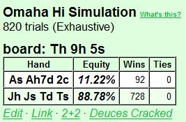

## 第 8 部分：翻牌后玩法 I

### 8.1 简介

从第 8 部分开始，该系列文章将全部涉及翻牌后策略。结构化思维和规划一直是整个系列的主题，现在我们将使用相同的方法进行翻牌后玩法。PLO 首先是翻牌后游戏，并且大部分钱都是在那里赢或输的。

翻牌前玩法也是一个重要的组成部分，但并不是因为在那里输或赢了很多底池（一旦你参与其中，你通常会看到翻牌）或因为在那里犯了大错误（PLO 起手牌很接近，所以单独来看，翻牌前的错误通常很小）。 PLO 翻牌前打法的作用是让我们为有利可图的翻牌后场景做好准备，这一点再怎么强调也不为过。

如果您经常面临困难的翻牌后决策（例如，当您在大底池中拿着边缘牌坐在不利位置时），这通常可以追溯到系统性的翻牌前错误。因此，尽管能够在困难的翻牌后场景中打好牌很有价值，但通常最好从一开始就避免让自己陷入许多困难的场景。

因此，即使我们将在本系列文章的其余部分主要讨论翻牌后打法，我们也不会忘记翻牌前打法。我们将有机会重新审视重要的翻牌前概念，以及它们如何导致各种翻牌后场景。例如，我们经常会看到，许多常见的翻牌后问题都可以在翻牌前找到解决办法。

第 8 部分和未来文章（可能是本系列的另外 3 篇文章）的计划是从一般到具体。我们从翻牌后规划的一些一般原则开始，包括准确计算补牌数和估计权益。

第 8 部分的主题是：

- 翻牌后规划的一般原则
- 评估翻牌后情况

我们将在此过程中使用大量示例。本文中的大多数示例都很简单，以便使用我们正在讨论的概念进行训练。然后，我们将在未来的文章中讨论更具体的“现实生活”翻牌后场景。

### 8.2 翻牌后计划的一般原则

人们可以写厚厚的书籍来介绍 PLO 翻牌后玩法，但不可能在像本文这样的文章系列中涵盖所有内容。但我们可以谈论很多关于合理的 PLO 思维过程以及哪些原则对于翻牌后玩法最重要。

我们将从两个非常重要的概念开始，这两个概念完全是通用的。它们可用于各种决策和所有形式的扑克：

- 好扑克模型
- 灰色区域

好扑克描述了如何做出扑克决策，而灰色区域告诉我们，我们的决策准确度是有限的：

#### 8.2.1 好扑克

“好扑克”是高额有限注德州扑克玩家 Bryce “Freedom25” Paradis 在其早期为 Stoxpoker.com 制作的视频之一中提出的扑克决策模型。好扑克模型将扑克决策过程描述为一个两步过程：

1. 制定一组准确的假设
2. 根据这些假设找到最佳玩法

步骤 2 是该过程中最简单的部分。第一步可能非常困难，我们必须结合使用广义的假设、特定的对手信息和逻辑。这个过程很难系统地学习，经验非常重要。我们玩得越多，我们就越能感知周围发生的事情。

但是，当存在一组假设时（无论它们是好的还是坏的），原则上很容易根据这些假设推断出最佳打法。从假设到关于最佳行动方案的结论是一个由数学和逻辑控制的过程。因此，原则上可以精确地完成良好扑克决策过程中的第 2 步。在实践中，我们很少找到数学上最好的打法，但我们可以训练自己至少在大多数时候找到一条好的打法。

由于改进第 1 步是一个困难而缓慢的过程，因此当我们想要改进我们的扑克决策过程时，我们希望将大部分精力投入到第 2 步。我们的目标是始终根据我们所知道的或我们认为我们知道的内容找到最佳打法（或至少是一条不错的打法）。如果我们能够正确完成第 2 步，我们将始终能够充分利用我们拥有的任何信息和假设。我们积累的经验越多，我们的假设就会越准确，我们的扑克决策也会越准确。

以下是“好扑克”决策过程的一个例子：

**示例 2.1.1**

6-max $10PLO

**Preflop：**  
Hero ($10) 在按钮位置     加注到 $0.35，大盲注 ($10) 跟注。大盲注的 HEM 统计数据为松散 - 被动，VP$IP / PFR% / AF = 50 / 6 /1.2。

> Hero 指我们以第一视角回顾牌局的玩家，可以称为牌手 A，本书的翻译中直接称呼“英雄”或者用原来的英文 Hero，Villain 原意坏人通常用来指对手。

**Flop：**    （$0.75）

大盲注（$9.65）过牌，我们（$9.65）下注 $0.75，大盲注跟注。

**Turn：**     （$2.25）

大盲注（$9.65）过牌，我们需要做出决定。

对于一名有能力的玩家来说，这是一个典型的好扑克思维过程：

*我的翻牌下注是自动持续下注，带有顶两对。大盲注的翻牌跟注与广泛的听牌和边缘成手牌一致。他可以有许多顺子和同花听牌的组合，可能还有一对与之搭配。他还可以用任何顶对牌过牌跟注。我有顶两对，我应该对他的范围有相当的胜率。但我没有强牌，我不得不对过牌加注弃牌。*

*但我认为对手不会对我击败的任何牌过牌加注，所以我不担心被诈唬。而且由于我也相信我有很好的权益，所以我应该下注。我想给对手一个机会放弃他的第二好牌，或者为抽到更好牌的机会付出代价。我只有两对，而且牌面协调，所以我更希望他弃牌。但是当他跟注时，我可能处于有利地位。如果他跟注并在河牌圈过牌，我将可以选择免费摊牌或价值下注。我会在到那里时做出决定。*

因此我们下注 $2.25，大盲注再次跟注。

**River：**      （6.75）

大盲注（$7.40）过牌，我们需要做出决定。

*一张可怕的河牌，但我认为他没有拿到同花，因为我预计他经常会用同花下注以获得价值（如果他过牌，他不能指望我会用更差的牌下注）。我认为我在这里通常领先，所以我应该下注以获得价值吗？不，这不是一个好主意因为对手可能不会在像这样的可怕牌面用更差的牌跟注。*

*如果河牌是空白，他可能会用顶对和更差的两对牌跟注河牌下注，但当同花出现时，我假设他会过牌 - 弃牌他所有的一对牌和大部分两对牌，即使他很松。他的范围中可能还有许多破灭的顺子听牌，但我无法从中获得价值。所以总的来说，我认为我应该过牌，因为我认为下注的价值不够（我需要在他跟注时有 50% 以上的胜算）。*

所以我们过牌。对手拿到翻牌的两头顺子抽牌 + 对子。我们以两对获胜。

注意我们在此过程中做出的假设。这些假设基于两件事：

- 我们根据大盲注的 HEM 统计数据判断其为松手。
- 我们根据松手 - 被动玩家的一般玩法，对大盲注的范围和倾向做出了一般性的假设。

鉴于这些假设，我们认为他应该在转牌圈下注他脆弱的两对牌。在河牌圈，我们认为他不会被更差的牌跟注，因此他进行了免费摊牌。大盲注的实际牌是我们预期经常看到的牌，即破产的顺子听牌（在河牌圈跌跌撞撞地拿到两对）。

所有玩家在玩牌时都会使用某种形式的“好扑克”流程，即使他们没有意识到这一点。我们假设各种事情，然后尝试找出该怎么做。但是通过意识到这个过程并将我们的思维过程口头化，我们将更好地控制我们的决策方式。

区分做出假设和从假设中得出结论非常重要。将这两个过程分开可以更容易地识别和纠正我们思维中的缺陷。一旦您意识到了第 2 步中的错误，通常很容易纠正。第一步中的错误和缺点很难系统地解决。但如果问题是缺乏信息，我们至少可以从知道问题所在这一事实中找到安慰（我们只是没有足够的信息来得出准确的结论）。

但无论我们多么擅长根据假设得出合乎逻辑的结论，无论我们在牌桌上做出准确假设的能力有多强：总有一条我们不能跨越的界限。这是因为我们永远无法获得有关牌桌上发生的事情的完整和完美的信息。换句话说：有时我们会发现自己处于*灰色区域*。

#### 8.2.2 灰色区域

“灰色区域”是扑克玩家 / 教练 Tommy Angelo 在他的文章《互惠：扑克获利的原因》（我强烈推荐的一篇文章）中提出的扑克概念。Angelo 首先指出，有些扑克决策要么完全正确，要么完全错误。例如，     在按钮位置加注是完全正确的。而在大盲注位置     跟注按钮加注是完全错误的。

完全正确或完全错误的决策处于黑 / 白区域。黑 / 白决策很简单，只有一个正确答案。当然，这并不意味着所有黑 / 白决策对初学者来说都很容易。但扑克改进过程的很大一部分是关于学习本质上是黑 / 白的概念。我们学习它们，使用它们，很快它们就会根深蒂固地融入我们的思维中。

但并非所有决策都是黑 / 白的。在黑白之间有一个区域，我们发现许多决策既不完全正确，也不完全错误。在这种情况下，我们做什么并不重要，因为一种选择似乎与其他选择一样好（至少在我们看来是这样）。例如，对于初学者 PLO 玩家来说，从 UTG 开始加注一个破烂的     可能无利可图。但这也不是一个大错误，如果桌面动态被动，一个好的玩家可能可以从 UTG 中有利可图地玩这手牌。

当我们开始玩扑克时，我们的灰色区域很大（事实上，当我们开始时，一切都在灰色区域）。原因是我们还没有学会大多数黑白决策。所以我们有一个巨大的灰色区域，充满了我们觉得困难的决定，仅仅是因为我们不知道更好的选择。

接下来是最重要的部分：

随着我们提高扑克技巧，我们的灰色区域会缩小，而黑白区域会扩大（因为我们越来越善于识别决策是完全正确还是完全错误）。*但灰色区域永远不会完全消失！* 无论您的名字是 Phil Ivey、Tom Dwan 还是 Skjervøy，每个人都有自己有时会走进的灰色区域。原因是灰色区域不仅是我们的一部分；它也是游戏的一部分。

与国际象棋不同，国际象棋中我们始终拥有有关游戏状态的完美信息，但在扑克牌桌上我们无法获得完整和完美的信息。因此，即使我们完美地完成了良好扑克决策流程中的第 2 步，并始终根据我们的假设找到最佳路线，也总会有一个我们无法超越的边界，因为我们没有完整和完美的信息。

例如：

您在按钮位置持有手边缘牌     ，CO 已加注。您不了解 CO 或盲注位置的玩家。此时，3-bet、跟注或弃牌都是可行的选择。如果您知道 CO 的开注范围很广，而且他在不利位置打法直接，并且盲注很紧，那么您可能想要用这手投机牌 3-bet 或松跟注。但如果 CO 牌力好/激进且/或盲注很松，那么您应该更加保守，更倾向于弃牌。

现在您没有信息，因此您只需选择一个动作。这绝不是一个困难的决定，但您肯定处于灰色地带。如果您想稳妥行事，只需弃牌这手投机牌。如果您想试探对手，请在有利位置松跟注或 3-bet，然后看看他们如何反应。您在这里的选择更多地取决于您的默认风格，而不是“正确”风格。

在这种情况下，在您更好地了解对手之前，您会玩一种有点“无效”的扑克游戏。您可以根据一般信息对他们使用合理的默认策略，但此时您将无法最大限度地利用他们的个人弱点。

意识到灰色地带将帮助你专注于重要的事情。始终尝试提出准确的假设，并始终尝试根据这些假设推断出好的打法。但是如果你发现自己陷入了困境，无法解读对手的行动，你必须接受我们有时会在没有良好计划的情况下陷入灰色地带。

受这一点，不要让它在玩游戏时让你感到沮丧。继续下一手牌，利用两节之间的时间来缩小你的灰色地带。在每节课后分析困难的手牌是一种很好的改进方法。只需在会话期间在 HEM 中标记困难的手牌，然后稍后查看它们。

牌局结束后，你可以返回这些手牌，看看你是否错过了一些重要的信息，或者这手牌是否根本无法解决（至少以你目前的技能）。你也可以与其他人讨论手牌。有时另一个玩家会给你一个令人大开眼界的建议。我把这些顿悟时刻称为“学会观察”。有时，你对游戏的理解会有一个质的飞跃，你现在能够看到桌上以前隐藏的东西。

最后：请记住，接近的决定（很难做出明确的决定）的定义是，我们做什么并不重要。根据定义，这些决定对我们的胜率没有太大影响，除非有很多（如果有很多，我们可能会在游戏的其他部分出现漏洞，通常是翻牌前）。

所以，刚开始时不要纠结于接近的决定。先把大事做好。堵住你的大漏洞，然后再解决小漏洞，这是系统改进的良好工作模式。

#### 8.2.3 玩游戏是为了赢钱，而不是为了赢得底池

一些玩家似乎对这个概念免疫。他们玩游戏是为了赢得底池，无论大小，他们很少关注风险与回报。原因显然是他们的自尊心。放弃我们已经投资的底池会导致心理不适，我们有时会做一些愚蠢的事情来赢得底池，这样我们就可以避免这种不适。特别是在单挑底池中，当对手从我们手中夺走一个底池时，我们很容易感到“羞辱”。

但无论我们的自尊心告诉我们什么：如果参与其中不会赚到钱，我们都会优雅地撤退并保存我们的筹码。

以下是您在最低 PLO 级别中经常看到的非常糟糕的翻牌后打法示例：

**示例 2.3.1：翻牌圈过度玩 AAxx**

6-max $10PLO

Hero ($10)      从 UTG 加注到 $0.35，CO ($10) 跟注，按钮 ($10) 跟注，小盲注 ($10) 跟注，大盲注弃牌。

**Flop：**    （$1.50）

小盲注（$9.65）过牌，Hero（$9.65）下注 $1.50，CO 弃牌，按钮（$9.65）加注到 $6，小盲注弃牌，Hero（现在很沮丧）思考了 2 秒并全压，按钮跟注。
Turn：    （$20.80）

River：     （$20.80）

按钮     凭借翻牌三条 + 后门同花听牌 + 后门顺子听牌获胜。

使用 ProPokerTools 我们发现 Hero 在翻牌上有 11% 的权益：

这里发生了什么？
Hero 一开始就正确地进行了翻牌前加注。我们拿到了最差的 AAxx 牌，但足以进行开牌加注，而且如果我们使用合理的默认策略，我们就不会陷入困境。如果我们被 3-bet，我们可以 4-bet，并准备好在被跟注时在任何翻牌中全压。如果我们的开牌加注被跟注，我们有时会在翻牌中持续下注（我们更喜欢干牌和少数对手），有时我们会过牌并放弃（在协调的翻牌和/或面对许多对手时）。

关键是我们在被跟注后不会承诺在任何翻牌中持续下注。因此，在我们认为继续这手牌没有利润的时候，我们会以小额损失（翻牌前加注 3.5 bb）逃脱。这是可以接受的代价，可以有机会偷盲注、获得 4-bet 获利的机会，或者看到有机会击中顶三条的翻牌（这是我们在多人底池中用糟糕的 AAxx 玩牌的主要目的）。

Hero 被跟注，而翻牌是他未改进的 AAxx 可能出现的最糟糕的翻牌之一。他有一对裸高对，3 个对手，并且被这种翻牌上能采取行动的牌击败。因此，Hero 的翻牌后计划应该是最简单的：过牌并立即放弃。

但 Hero 选择下注。这告诉我们，他在这里考虑的不是 EV，而是在翻牌前加注 AAxx 后赢得他认为“有权”获得的底池。他愿意冒着筹码的风险来实现这一点。他持续下注，被加注，并与加注者单挑。 Hero 现在有最后一次机会弃牌并带着大部分筹码逃脱。但他却出于怨恨而加注，并作为绝对劣势全压。

从德州扑克转到 PLO 时，我们首先要摆脱的就是在翻牌前加注后，我们有权用持续下注赢得大量底池的感觉。在 PLO 中，总有相当大的几率有人翻牌（任何翻牌）击中大牌，而且我们通常必须玩“中牌或放弃”，尤其是在面对许多对手、在协调的翻牌中以及在位置不佳时。

如果您有许多对手和协调的翻牌并且您位置不佳，那么使用“中牌或放弃”的翻牌后策略是唯一有意义的事情。这正是上例中 Hero 所处的境地，但他任由自尊心左右自己的打法，最终在完全处于黑 / 白区域的情况下捐出了满满一筹码（所有有能力的 PLO 玩家都会站在 Hero 的角度自动过牌并放弃）。

#### 8.2.4 不要让牌决定你的玩法

这个原则是前一个原则的变体。新手 PLO 玩家中常见的一个“弊病”是他们过于看重他们看到的牌，而没有足够注意其他因素。他们也没有足够地适应他们的情况在每条街上的变化，尤其是当他们以一手好牌开始的时候。我们在示例 2.3.1 中看到了一个典型的例子，我们的英雄拒绝接受他的 AAxx（在翻牌前对抗任何其他非 AAxx 牌时表现良好）在翻牌时被淘汰。

对于初学者 PLO 玩家来说，他手上的牌和牌桌上的牌是两个最重要的因素，其他因素都远远不够。但经验丰富的玩家会通过除了牌之外的一系列因素来评估每一种情况。有时牌不会排在最重要的因素之列。

经验丰富的玩家明白手牌价值是相对的，而不是绝对的。例如，我们不需要“强牌”来下注以获得价值，我们需要一手比 50% 跟注我们的牌（无论它们是什么）更好的牌。经验丰富的玩家也明白，有时他可以从某种情况下获取的价值与他的牌无关（例如，当他在有利位置攻击他认为较弱的玩家时）。

下面是两个例子来说明我们正在谈论的内容：

#### 示例 2.4.1：弱 AAxx 有利位置上单挑对战松散被动的对手
$10PLO 6-max

**Preflop**

UTG ($10) 溜入，Hero ($10)      按钮位置加注到 $0.45，盲注弃牌，UTG 跟注。UTG 是松散被动的，我们还没有看到他在有其他玩家主动权的底池中诈唬。

**Flop：**    （$1.05）
UTG（$9.55）过牌，Hero（$9.55）下注（$0.80），UTG 跟注。

**Turn：**     （$2.65）
UTG（$8.75）过牌，Hero（$8.75）下注（$2），UTG 弃牌。

Hero 拿着一张马马虎虎的 AAxx（一套同花，其他的都很少）在有利位置上加注，后面是松散被动（并且假定是弱手）的玩家。我们成功隔离了弱手，并在一个协调性较好的翻牌（同花听牌和内包顺子听牌都有可能）中翻出一对裸牌。对手跟注翻牌，因此我们认为他的范围很弱，包括各种听牌、一对牌，也许还有一些没有备用听牌的弱两对牌。

转牌是一张空白牌，UTG 再次过牌。Hero 现在意识到他那平庸的一对牌可能仍然领先于对手所拥有的任何牌。我们并不期望在这里获得很高的权益，但我们可能在对抗都是的范围时表现不错。因此我们再次下注，主要是为了让对手有机会放弃他（可能不错的）的权益。我们不希望被我们击败的牌加注，如果发生这种情况，我们可以轻松弃牌。

UTG 弃牌，以应对我们的转牌下注，这证实了他的翻牌过牌跟注范围很弱。但如果他在翻牌时有一些公共牌，如果他知道我们只有一对裸高对，他可能应该再次跟注。如果是这样的话，我们从他的弃牌中获得的收益比被跟注的收益更多。在这种情况下，许多新的 PLO 玩家在处于英雄的位置时会在转牌时僵住。他们下注一次边缘牌，然后被跟注。然后他们自动假设对手有一手牌，他要把这手牌带到河牌圈，他们担心如果他们再次下注，他们会再次被跟注。这些玩家也永远害怕被过牌加注，害怕如果他们用边缘牌建立一个大底池，他们会被诈唬（现在或在下一条街）。

但是想想我们在转牌圈拿到边缘牌的情况：

- 对手是松散被动的
- 因此我们预计他会用宽而弱的范围来剥翻牌
- 他在空白的转牌圈第二次过牌
- 我们预计他不会过牌加注、诈唬我们，也不会诈唬河牌

因此对手给我们传递的信息是：

- 他在翻牌圈前很弱（跟注并跟注加注）
- 他在翻牌圈仍然很弱（过牌并跟注下注）
- 他在转牌圈仍然很弱（转牌圈是空白的，现在他再次过牌）

那么为什么不简单地相信他并再次下注以获得价值 / 保护呢？我们没有什么可担心的。如果他加注，我们会毫不后悔地弃牌。如果他跟注并在河牌下注，我们也会这样做。如果他跟注，在河牌上过牌，我们随后过牌，而他以两对牌获胜，我们耸耸肩说“哦，好吧”。

请注意，在转牌圈用边缘牌随后过牌以诱使对手诈唬对我们在 PLO 中没有多大帮助。首先，我们经常诱使对手进行薄价值下注，而不是诈唬。而且，当河牌完成对手很容易获得的抽牌时，我们通常无法跟注河牌下注。最后，对我们来说，对手在转牌圈放弃他的边缘牌比免费看到河牌更好。

这是因为他通常对我们的边缘牌有相当好的权益（PLO 中的领先 / 落后情况比德州扑克少）。通过用我们的边际牌在转牌圈下注并迫使他弃牌，我们经常会让他犯错误（如果他知道我们有什么牌，他应该跟注或过牌加注）。边缘第二好牌通常在 PLO 中对抗边缘最佳牌时具有不错的胜率，而最佳牌几乎总是希望第二好牌在翻牌圈或转牌圈弃牌。

请注意，位置在这里非常重要。当对手第二次过牌时，我们从他那里得到的信息使我们能够满怀信心地在转牌圈下注。但是如果我们的位置不利，我们就会陷入困境（在做出决定之前，我们无法看到对手对转牌的反应）。

**示例 2.4.2：弱 AAxx 在不利位置的多人溜入底池**

$10PLO 6-max

**Preflop**

UTG ($10) 跟注，CO ($10) 跟注，SB ($10) 跟注，Hero ($10)     在大盲注位置过牌。UTG 是示例 2.4.1 中的松散被动玩家，其他人未知。

**Flop：**    （$0.40）

小盲注（$9.90）过牌。我们的计划是什么？

我们的起手牌和翻牌与上例相同，但翻牌后的情形不同。在示例 2.4.1 中，我们有一手好牌，可以加注以隔离位置较弱的跛入者。翻牌后我们有一手平庸的牌，但它足够强，可以在位置上与一个弱手单挑，而这个弱手一直通过过牌向我们示弱。因此，在相对手牌价值尺度上，我们的手牌足够强，可以在翻牌前加注，然后在翻牌后下注两次。

在这里，我们没有足够的手牌来翻牌前加注，因为我们在多人底池中处于不利位置。因此，我们从翻牌前过牌开始。翻牌后我们拥有与上例相同的绝对手牌价值（我们的牌相同，翻牌也相同），但在相对手牌价值尺度上，我们的手牌下降了很多。我们既没有单挑，也没有位置，在多路底池中我们处于劣势，而且我们对对手的牌一无所知。我们可以假设小盲注玩家在过牌后很弱，但其他一切都被掩盖了。

下注以保护我们弱但可能是最好的牌免受抽牌的影响，在这里对我们没有任何帮助。底池很小，没有什么可保护的。而且我们的牌对其他 3 手我们知之甚少的牌很弱，而且在落后时我们几乎没有出路（在最坏的情况下我们只抽牌  ）。即使我们在翻牌圈下注并被较弱的牌跟注，转牌圈也会很难玩，因为我们必须先行动。我们是否应该假设我们仍然领先并在空白转牌圈再次下注？我们是否应该担心被抽牌，然后过牌并放弃？如果我们在转牌圈下注并被跟注，我们会在河牌圈面临同样的问题，只是这次底池要大得多（这使得我们在河牌圈用弱牌做出不利位置的决定更加困难）。

花点时间考虑一下，如果我们决定在翻牌圈下注，这手牌在未来几轮中会如何发展。你应该明白，在翻牌圈下注只会让我们赢得一个非常小的底池，或者在底池越来越大的底池中用平庸的牌面临不利位置的艰难转牌圈/河牌决定。这通常是 PLO 中最糟糕的情况之一。所以我们向前看，看到威胁迫在眉睫，然后我们检查翻牌圈以避免它：

**Flop：**    （$0.40）

小盲注 ($9.90) 过牌，Hero ($9.90) 过牌，UTG ($9.90) 过牌，CO ($9.90) 下注 $0.40，SB 弃牌。Hero现在做什么？

Hero弃牌。我们有时会在翻牌时弃掉最好的牌，但“翻牌时最好的牌”在 PLO 中意义不大。唯一重要的是我们是否有足够强的牌可以在翻牌时继续获利，而我们没有。CO 代表着一手不错的牌或不错的听牌，而我们只有一手平庸的成手，几乎没有改进的潜力。如果 CO 继续下注，我们就无法摊牌，而我们的翻牌过牌跟注会告诉他，他确实应该继续下注以迫使我们弃牌（就像我们在示例 2.4.1 中对 UTG 所做的那样）。所以我们只需在翻牌圈弃牌，让他赢得这个小底池。

在示例 2.4.1 中的翻牌后场景中，我们的手牌     很弱，但有利可图。但在示例 2.4.2 中，这手牌在翻牌后很弱，毫无价值。在第一个示例中，我们通过隔离弱玩家来为自己设置一个有利可图的翻牌后场景，然后我们利用位置、手牌阅读和逻辑来提取翻牌后的价值。

在第二个示例中，我们通过翻牌前过牌并看到一个免费翻牌来为自己设置一个有利可图的翻牌后场景（三张牌挖掘）。我们没有得到我们希望的翻牌，我们的手牌大部分都变成了垃圾。我们优雅地退出，没有浪费筹码试图以一手平庸的手牌和没有出局的劣势赢得一个微小的底池。

在前两个示例中，我们讨论了在规划翻牌后游戏时必须考虑的一些情境因素。现在我们将更详细地研究这些因素：
