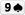
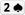
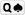
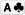
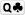
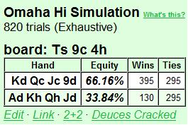
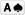
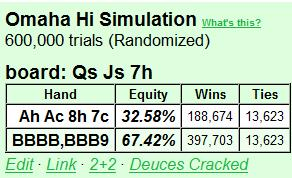
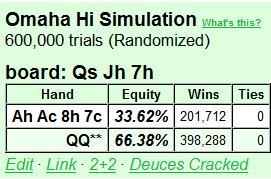
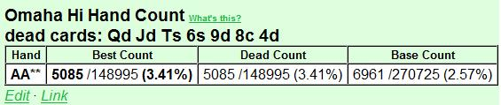

## 第 9 部分：翻牌后玩法 II

### 9.1 简介

在第 9 部分中，我们将继续讨论基于 4 个重要因素的翻牌后规划简单模型：

1. 对手数量
2. 位置
3. SPR
4. 权益（由我们手中的牌、桌上的牌以及我们对对手范围的假设决定）

>equity，中文含义为期望赢率，本书中直接翻译为权益，代表长期平均下来可能的收益。

在第 8 部分中，我们讨论了与牌无关的因素（1 - 3），现在到了第 4 个因素，即权益。

能够快速准确地估计翻牌时的权益绝对是一门手艺，而不是一门神秘的艺术。我们的估计是基于我们看到的牌 + 对手范围的假设。其余部分来自数学。我们首先计算补牌数，然后通过考虑击中补牌数但仍然输掉的概率来估计“干净”补牌数。最后，我们使用“4 x”和“3 x + 9”规则将补牌数转换为权益（稍后会详细介绍）。

在本文中，我们将彻底介绍此过程。估计权益是游戏中非常重要的一部分，而且也相对容易学习。在估计权益时马虎的玩家通常会侥幸逃脱惩罚，尤其是在 SPR 较低的情况下，因为这种情况下有犯错的余地。但在 SPR 较高的情况下，拥有良好的控制力更为重要。在 SPR 较高的情况下，马虎的玩法会导致我们比应有的次数更多地以 55-45 硬币翻牌失败告终。

因此，即使处理补牌数和权益有点乏味，甚至有点无聊，我们也必须学会如何去做。当你学会了这种方法，就像骑自行车一样，过一段时间你就会开始或多或少地自动地做这件事。那些在激烈的战斗中很难计算大包顺子补牌数的人会在这里找到有用的东西，因为我们将为这些补牌数定义一个容易记住的符号。

当所有的技术工作都完成后，我们的翻牌后模型就可以使用了，我们将从第 10 部分开始使用它。我们将从第 10 部分开始，使用一系列示例进行翻牌后分析和规划，使用我们的模型框架（对手数量 / 位置 / SPR / 权益）。我们将选择一些典型的翻牌后场景，并讨论我们在处理这些场景时应该如何评估、规划和思考。我们还将有机会重复以前文章中的一些重要概念。 

PLO 是一种在每种可能情况下都有无限变化的游戏，因此在分析手牌时我们不会过于纠结于细节。我们首先将尝试使用合理的 PLO 思维过程正确处理大问题。如果我们从 PLO 游戏的合理总体框架开始，并且我们还了解底池赔率和出局背后的数学原理，那么我们就拥有了在出现特定翻牌后情况时处理它们所需的一切。

当一般翻牌后规划的讨论结束时（在第 10 部分的开头），我们将转到一些特定的翻牌后情况，并将我们的模型用作分析它们的工具。例如，我们将在第 10 部分结束时彻底讨论 c-bet，我们将看到我们的 c-bet 决策如何根据对手数量、我们的位置、SPR 和我们估计的权益而变化。

### 9.2 我们估算翻牌后权益的方法

现在我们将系统地处理 PLO 中的补牌 / 权益估算，我们将主要关注我们正在抽牌并且我们知道必须打出出局才能获胜的情况。我们首先定义流程，然后介绍各种抽牌类型，并在此过程中举例说明。

要学习这些技巧，需要做一些记忆，但这是值得的。这里没有什么神秘的东西，这是一个简单的过程。但是有一些 PLO 特定的“怪癖”使这个过程与德州扑克中的权益估算略有不同，这就是我们专门写这篇文章来学习它的原因。

#### 9.2.1 估计抽牌权益的一般程序

我们使用 3 步流程：

1. 计算所有补牌
2. 估计“干净”补牌的数量
3. 将干净出牌转换为权益

第一步就是计算我们拥有的获胜牌的所有补牌。这当然取决于我们认为我们必须击败什么。例如，如果您有一对低牌，而翻牌中没有其他牌，那么您对抗顶对时会有一些补牌，但对抗顶三条时您就没戏了。

在第二步中，我们减少补牌数量，以考虑以下情况：

1. 我们可以击中补牌，但仍然落后。
2. 我们可以击中补牌并提升到最佳牌型，但下一张牌我们的对手会拿到更好的牌。

例如，如果对手有 K 高同花听牌，而没有其他牌，我们有 9 个补牌可以形成同花。但是如果对手有坚果同花听牌，我们就快要输了。因此，我们通常不能将所有补牌都算作干净的，我们必须估计击中和输掉的可能性。正如我们将在本文后面看到的那样，我们是否应该抽到“脏”补牌与 SPR 密切相关。

在 SPR 极低的底池中，抽到脏补牌很少会成为问题，因为我们通常会从底池中获得很大的覆盖。但在 SPR 较高的情况下，我们必须小心谨慎，因为我们的许多补牌都是肮脏的，因为我们现在有负隐含赔率和糟糕的风险 / 回报率。因此，在 SPR 较高的情况下，我们通常会避免用非疯狂的抽牌玩大底池。

另一种击中并输掉的情况是，在翻牌圈有获胜的补牌，但在我们击中后，我们的对手可以在河牌圈抽出更好的牌。例如，如果您在非对子翻牌圈（例如     在翻牌圈    ）上有同花听牌，而对手有顶三条，则您有 8 张干净的补牌（除  外的所有红心）。但如果您在转牌圈击中同花，对手有 10 张牌面配对的补牌，可以抽出葫芦或四条。因此，您在翻牌圈的干净补牌实际上少于 8 张。我们将学习使用简单的数学 + 关于对手手牌的假设，将补牌减少为干净补牌。

当我们估计出干净补牌的数量时，我们将其转换为权益。在翻牌圈，我们有两张牌要发，我们使用两个简单的数值近似值（请注意，当 x = 9 张补牌时，它们给出的答案相同）：

- 当 x < 9 张出牌时：权益 = 4 x
- 当 x = 9 张或更多出牌时：权益 = 3 x + 9
例如，当 x = 4 张出牌时，我们在翻牌圈有 4 x 4 = 16% 的权益。当 x = 14 张出牌时，我们在翻牌圈有 3 x 14 + 9 = 51% 的权益。这些规则是对确切权益的数值近似，但正如我们从下面的精确计算中看到的那样，它们效果很好：

**翻牌圈有 4 张出牌的准确权益**

我们知道 7 张牌（手牌中的 4 张 + 翻牌圈的 3 张牌），因此有 52 - 7 = 45 张未知牌，其中 4 张是我们的补牌。在转牌圈或河牌圈击中的机会等于 1 减去在转牌圈和河牌圈都未击中的机会：

P = 1 - (41 / 45)(40 / 44) = 0.17 = 17%

接近 4 x 规则给出的估计值（16%）。

**翻牌圈有 14 张出牌的准确权益**

我们使用与上述相同的逻辑，得到：

P = 1-(31 / 45)(30 / 44) = 0.53 = 53%

接近 3 x + 9 规则给出的估计值（51%）。

我们经常会得到一到两个百分点的误差，但重要的是要意识到整个过程都是近似的。我们经常会在估计出牌数时引入错误，然后在出牌到权益转换中多出的几个百分点很少是有意义的。例如，如果我们多算了 1 个出牌或少算了 1 个出牌，我们已经在权益估计中引入了约 4% 的误差，这比 4 x 和 3 x + 9 规则中的数值误差还要大。

最后，如果我们想估计转牌的权益，这只是最后一张牌击中的概率。我们通过将出牌数除以未见牌数来计算这个数字。例如，如果有 4 张出牌，我们在转牌上有 4 / 44 = 0.09 = 9% 的权益。如果有 14 张出牌，我们在转牌上有 14 / 44 = 0.32 = 32 = 32% 的权益。

现在我们已经定义了我们的程序，我们继续计算各种类型的抽牌。对于每种类型的抽牌我们还将简要讨论抽牌的价值如何根据 SPR 而变化。

请注意，在 PLO 中，成手牌和抽牌之间的区别比在德州扑克中更“模糊”，并且通常将成手牌和抽牌牌视为没有意义。在本文中，我们将松散地使用符号“抽牌”来表示需要改进才能获胜的手牌。这包括也具有成手牌的价值，但不足以在遇到攻击时不改进就进入摊牌的手牌。

### 9.3 翻牌对子听牌两对 / 三条

当您翻牌对子时，例如     在翻牌    时，您也有两对 / 三条的听牌。在高 SPR 场景中，这是一种弱抽牌（例如跟注和加注底池），但在低 SPR 场景中（例如 3-bet 和 4-bet 底池）可能是一种强听牌。

两对 / 三条听牌的强度在很大程度上取决于对手的数量、SPR 和翻牌结构。您必须考虑您面对的牌、您的即时底池赔率、改进和输掉的机会以及未来的下注（如果筹码很深，这可能会给您带来严重的负面隐含赔率）。

将两对 / 三条听牌作为主要听牌的经典例子是在 4-bet 底池中与 AAxx 单挑。在干翻牌圈，很容易估计出牌的数量，如下例所示：

**示例 3.1：在 4-bet 底池中，两对 / 三条牌听牌对抗假定的 AAxx**

$10PLO 6-max

CO（$10）加注到 $0.35，您（$10）用     在按钮位置的 3-bet 到 $1.20，盲注弃牌，CO 4-bet 到 $3.75，您跟注。您假设 CO 有 AAxx，因此您的计划是全压所有您有足够权益对抗 AAxx 的翻牌。

让我们看看两个不同的翻牌：

**Flop 1：**    （$7.65）

CO（$6.25）全压，您会怎么做？

您的底池赔率为 13.9 : 6.25 = 2.22 : 1，并且您需要 1 / (2.22 + 1) = 31% 的权益才能有利可图地跟注。您翻牌时拿到了一对，但您假设对手有 AAxx，因此您将所有翻牌对视为两对/三条抽牌。因此，您有 9 + 2 = 11 个两对 / 三条补牌。这很好，但如果 CO 有 AAxx，您在这个特定的翻牌中面对顶三条就毫无胜算。因此，您被迫在这个假设下弃牌。

**Flop 2：**    （$7.65）

CO ($6.25) 全压，您怎么做？

您需要像以前一样拥有 31% 的权益，而现在您在干翻牌圈中翻出一对，AAxx 通常不会获得任何额外的权益。因此，您可以假设一对未改进的 AA 是您必须击败的牌。您首先计算 9 + 2 = 11 张两对/三条的补牌。三条几乎总是能为您赢得底池，因此您将这 2 张出牌算作干净的。

但是，两对的出牌需要稍微打折，以考虑到 AAxx 在我们击中后重新听到顶三条或更好的两对。当我们在转牌圈击中 9 张两对出牌中的一张时，CO 有 8 张出牌（2 张 A、3 张 4、3 张 2）可以在河牌圈击中顶套或 A。在转牌圈，我们知道 10 张牌（我们手上的 4 张牌、CO 手上的 2 张 A 牌和公共牌上的 4 张牌），所以有 42 张未知牌。这让 CO 有 8 / 42 的机会对抗我们的转牌两对，我们可以将其四舍五入为 1 / 5。

因此，我们减去两对补牌的 1 / 5，得到 9(4/5) = 7.2 干净的两对补牌，我们将其四舍五入为 7。然后，我们保守地再减去 1 张补牌，以说明 CO 从他的 2 张未知边牌中获得的权益。所以我们的最终估计是 6 张干净的两对补牌。

这让我们在这个干翻牌圈上得到 6 + 2 = 8 张干净的两对 / 三条补牌，我们将其转换为 4 x 8 = 32% 的翻牌权益。这仅略高于 31% 的门槛，我们有边缘跟注。但是，如果我们想降低方差，并且调整佣金的影响（可以将略微 + EV 的跟注变成收支平衡或略微 - EV 的跟注），那么弃牌是完全没问题的。但是，如果我们有几张后门牌，配合我们的两对 / 三条牌，那么这将会是自动跟注。

从下面的 ProPokerTools 计算中，我们看到，在干翻牌上，我们对 AAxx 的 32% 权益估计接近：

在 SPR 高和 / 或对手多的情况下，我们很少玩两对 / 三条听牌，除非它可以作为另一个主要听牌的备用。主要原因是，在这些情况下，两对 / 三条听牌并不是我们击中并面对攻击时必须摊牌的听牌。在 SPR 高的情况下，如果我们固执地使用边缘牌，则会产生很大的负隐含赔率，因此我们必须小心。因此，在我们能够轻松地用高 SPR 玩大底池之前，我们需要更多的东西。以下是您在高 SPR 的多路底池中拥有裸露的两对 / 三条抽牌的示例：

**示例 3.2：在多人溜入底池中的两对 / 三条听牌**

$10PLO 6-max

按钮（$10）率先溜入，小盲注（$10）跛入，您（$10）     在大盲注位置过牌。

**Flop：**    （$0.30）

小盲注（$9.90）下注 $0.20。您怎么做？

您弃牌。您几乎从来都没有翻牌时最好的牌，而这是多路底池中 SPR 较高的情况，这意味着在玩大底池之前，您需要拿到坚果牌 / 听牌。您的风险 / 回报比很差，您几乎没有出牌（甚至更少的干净出牌），您只剩下一名玩家可以行动，而小盲注在向两个对手下注时代表了一手强牌，因此弃牌、弃牌、弃牌。

在结束对两对 / 三条抽牌的讨论之前，我们将看看我们翻牌后得到一对作为另一个主要听牌的备用牌的情况。如果我们用一副强听牌加一对单挑，这通常对我们来说是个好情况，因为我们现在可以处于一场压倒性的听牌对听牌的对决中。如果我们用另一张与我们类似但没有一对的听牌发生冲突，我们就有较大的优势。原因很简单，当两张听牌都失败时，我们的一对通常会获胜。下面是一个例子：

**示例 3.3：一对 + 听牌对抗没有一对的听牌**

$10PLO 6-max

您（$10）     在按钮位置加注到 $0.35，小盲注（$10）3-bet 到 $1.15，您跟注。小盲注是众所周知的 TAG，其 3-bet 范围主要由 AAxx、好的百老汇牌和一些优质投机牌组成。

**Flop：**    （$2.40）

小盲注（$8.85）下注 $2.40。您怎么做？

您被 TAG 3-bet，他在翻牌上下注，这给了您一个强听牌。您翻牌时拿到了一个非常好的包牌顺子抽牌（本文后面会详细介绍），并且您有 13 张坚果牌（4 张 8、3 张 J、3 张 Q、3 张 K）来凑成顺子。我们将所有这些都视为干净的，因为我们在干燥翻牌上听到坚果牌，并且我们估计对手 3-bet 的牌在这个翻牌上不会有很多暗三条。

您还有一对和后门同花听牌。击中您的一个踢脚牌会让您获得顺子，因此您不会从获得两对的出牌中获得任何额外的收益。但是您有 2 张额外的三条补牌，以及 1 张额外的后门同花补牌。您保守估计，这两个弱听牌会给您带来 2 张干净的补牌，以配合您的包牌。因此，您估计翻牌上有 13 + 2 = 15 张干净的补牌。这使我们在翻牌时对抗一手在我们击中后没有再听牌的更好的牌（例如 AAxx 带有无用的边牌）时有 3 x 15 + 9 = 54% 的权益。下面的 ProPokerTools 计算证实了我们的估计：

因此，我们绝对可以用我们的对子 + 包牌来对抗对手范围中的 AAxx 部分，以获得价值。由于他也用其他牌 3-bet，因此他也可能翻牌时抓到听牌，或者他可能完全错过了翻牌。如果他有听牌，那不可能比我们的听牌更好，除非他有相同的包牌 + 更好的对子。这种情况很少发生，因此我们也可以对他的听牌加注以获得价值。如果他用空气牌持续下注，我们当然是大幅领先，因此我们加注（我们不介意他在大底池中弃掉他的空气牌）。

我们得出结论，对对手范围中的所有牌型加注似乎都是正确的，因此我们只需在翻牌时全压：

**Flop：**    （$2.40）

小盲注（$8.85）下注 $2.40，我们（$8.85）全压加注，小盲注跟注。

**Turn：**     （$20.10）

**River：**      （$20.10）

小盲注玩家     的牌型与我们相同，但没有对子。翻牌时我们的胜算为 66%，如下所示：

在 PLO 中，翻牌圈 66% 的优势是巨大的。但如果我们有相同的包牌但没有一对（例如     ），对手将大幅领先。他现在拥有与我们相同的包牌，并且拥有翻牌圈 A 高牌的最佳手牌：

因此，我们看到，除了强大的抽牌外，拥有一对的效果可能非常巨大。请注意，当我们拥有一对 + 包牌组合时，这对牌很少会给我们额外的补牌机会，因为踢脚牌是补牌牌的一部分。我们获得了一些额外的三条补牌机会，但最大的效果是我们的对子是翻牌时最好的成手牌。如果对手没有一对，但有听牌，我们现在可以赢得大量转牌和河牌都是空白的底池。一对还可以作为阻止对手在翻牌时再听牌的手段，当他翻出一组或两对时（我们在转牌听牌后，河牌上可以让他拿到葫芦的牌就少了一张）。

我们得出结论，一对可以成为强大的主要听牌（如包牌或坚果同花听牌）的非常有价值的补充。正是拥有这些额外的权益，让我们能够在翻牌圈以 55-45 的抛硬币结果获胜，或者它们可以将边缘 + EV 转变为强 + EV。

### 9.4 同花听牌

翻牌出现彩虹的概率为：

P(彩虹翻牌) = (52 / 52)(39 / 51)(26 / 50) = 0.40 = 40%

因此，在 60% 的翻牌中，存在翻牌同花听牌的可能性。这使得同花性成为 PLO 起手牌的极其重要的属性。每次您玩没有同花的起手牌时，您都会在翻牌后做出棘手的决定，这就是为什么我们在将起手牌标记为“优质”之前要求有同花。在从头开始学 PLO - 第 2 部分中关于起手牌的讨论中，我们将非花色同花牌归类为最多“边缘”，这就是原因。

当您翻牌时，手牌类型不错但不是很好，没有太多改进潜力，当翻牌可能出现同花听牌时，您通常必须在翻牌后采取防守策略。但是，如果您有同花听牌作为成手牌的备用牌，那么您可以玩得更激进，尤其是坚果同花听牌（它可以让您的手牌变成真正的怪物）。

在 PLO 中估计同花听牌的补牌比在德州扑克中更复杂，因为坚果同花听牌和低同花听牌之间的差异更大（当您有低同花听牌时，在 PLO 中其他人有更大的同花听牌的可能性比在德州扑克中更大）。因此，我们不会计算同花补牌，而是更“全面”地考虑手牌，并根据我们拥有的其他东西、对手数量和 SPR 来评估同花听牌的强度。

无论如何，一把坚果同花听牌在翻牌圈给了我们 8 张坚果牌（有 8 张同花牌没有配对牌面），但有时如果我们怀疑还有其他同花听牌和 / 或我们怀疑有人有三条（= 一张对抗我们坚果同花的好牌），我们就必须稍微打折扣。这些考虑在多人底池的高 SPR 下尤其重要，因为在大底池中犯错的代价会上升。

非坚果同花听牌的价值远低于坚果同花听牌，因为当我们在翻牌圈采取行动时，我们总是冒着对抗坚果听牌的风险。非坚果同花听牌的价值也极大地取决于 SPR 和对手的数量。在高 SPR 的多人底池中，只听非坚果同花和听其他牌是自杀行为。但是，非坚果同花听牌在 SPR 较低的情况下，可以成为单挑中强大的权益组成部分，例如在 4 次下注底池中，SPR 约为 1 的情况下的单挑。

我们还可以利用后门同花听牌获得有价值的额外权益，例如     在    翻牌中，我们有 13 张补牌加上 2 张后门同花听牌。我们通常将后门同花听牌算作 1 张补牌，但
当我们有很多对手和 / 或听牌较低时，我们可以稍微减少一点（例如减少到 1/2 张补牌）。

以下是一个热身示例，说明坚果同花听牌对翻牌上手牌价值的巨大影响：

**示例 4.1 裸高对与高对 + 坚果同花听牌的比较**

$10PLO 6-max

按钮（$10）加注到 $0.35，您（$10）    在小盲注位置 3-bet 到 $1.15，按钮跟注。按钮是一个稳健的 TAG。

**Flop 1：**    （2.40）

您还剩下 $8.85。您的计划是什么？

如果您在这种类型的翻牌上 c-bet 并被加注，您显然会完蛋。因此，如果您下注，您就是在下注-弃牌。翻牌非常“湿”，有大量可能的听牌。这也是我们期望与按钮范围很好地协调的翻牌，用于开牌加注然后跟注 3-bet（他的范围应该包含很多同花高/中牌）。

例如，如果按钮手上有 4 张从 A 到 9 的随机百老汇牌，那么即使他并不总是有同花听牌，我们也几乎被击败了：

而面对坚果，我们完全完蛋了：

因此，我们预计翻牌与对手的范围有很好的联系，而当他的联系很好时，我们的权益就很差。因此，你的选择是过牌并放弃，或者下注并弃牌以应对加注（如果你被跟注，大多数转牌都会输）。现在让我们看看当你翻牌拿到坚果同花听牌时，情况会如何变化：

**Flop 1：**    （2.40）

您还剩下 $8.85。您的计划是什么？

在这里，如果我们被加注，下注并全压筹码是显而易见的。有了坚果同花听牌，我们的权益就会大幅增加，而且面对一手随机的百老汇牌，有 4 张 A 到 9 之间的牌，我们现在是领先的：

我们甚至在对抗坚果牌时也有不错的胜率：

在 PLO 中，有同花听牌或没有同花听牌就像是两个不同的世界。在两张同色翻牌中没有同花听牌时，我们经常被迫过牌并放弃或用我们的边缘牌下注弃牌。SPR 越高，当其他人完全有可能拥有同花听牌时，越难从没有同花听牌的牌中获利。但是有了同花听牌，尤其是坚果同花听牌，我们可以下注更多，而 SPR 较低时，我们的决定通常会变得自动（例如，我们很高兴地用一对高牌 + 坚果同花听牌在 3-bet 底池中用 100 BB 筹码投入我们的筹码）。

但是初学者很容易在 PLO 中高估裸同花听牌。因此，这里有一些指导原则：

- 坚果同花听牌与另一张听牌或一手不错的成手牌组合时具有巨大价值
- 裸坚果同花听牌的价值有限
- 非坚果同花听牌与另一张好听牌或一手不错的成手牌组合时可以具有不错的价值
- 裸非坚果同花听牌几乎毫无价值（例外是 SPR 极低的单挑）

我们首先来看看裸坚果同花听牌。在翻牌圈继续使用这种听牌总是很诱人，这可能是正确的。但我们始终要考虑到：

- 当两张同色色翻牌圈有很多动作时，我们的几张同花补牌很可能在其他对手手里。
- 当我们击中坚果同花时，很难从中获得很多价值，尤其是在位置不佳时。

因此，裸坚果同花听牌不是一手足够强到可以带到河牌圈的牌，而且它通常不是我们在翻牌圈下注的听牌（除非我们预计有很好的弃牌权益）。如果你被动地玩裸坚果同花听牌以获得隐含赔率，那么准确评估我们击中时预期能赚多少钱就很重要了。

我们已经在示例 4.1 中研究了成手牌 + 坚果同花听牌的组合。下面是另外 4 个使用不同 SPR 组合和对手数量玩同花听牌的例子。前 3 个例子是裸坚果同花听牌，然后是一个将非坚果同花听牌作为强组合听牌的一部分来玩的例子：

**示例 4.2：在溜入的多人底池中拿到裸坚果同花听牌**

$10PLO 6-max

CO（$10）溜入，按钮（$10）溜入，SB（$10）溜入，您（$10）     在大盲注位置过牌。

**Flop：**    （$0.40）

小盲注（$9.90）下注 $0.40，你的计划是什么？

由于以下不利情况的组合，你不得不弃牌：

- 你只有一手裸同花听牌，最多有 9 张补牌（请注意，我们不希望 A 成为我们在这个翻牌上的补牌）

- 你只获得 2 : 1 的即时底池赔率，而你需要 \> 4 : 1

- 你的隐含赔率很低（对手不会给你太多行动，因为当你击中并开始下注以争取价值时，你的手牌很明显）

- 你没有结束行动，如果你跟注，你可能会被加注。

- 小盲注在翻牌时面对 3 个对手时领先下注，他自己通常有同花听牌作为手牌 / 听牌的一部分。如果是这种情况，你的补牌比你想象的要少。
  
所以弃牌，简单明了。

**示例 4.3：在加注、多人底池中裸同花听牌**

$10PLO 6-max

CO（$10）溜入，您（$10）在按钮位置用     加注到 $0.45，SB（$10）跟注，BB（$10）跟注，CO 跟注。

**Flop：**    （$1.80）

小盲注（$9.55）下注 $0.50，BB（$9.55）跟注，CO 弃牌，您的计划是什么？

我们首先注意到，如果每个人都向您过牌，您应该在 4 人底池中用裸同花听牌过牌翻牌。您有一些同花听牌的补牌，但您的实力不足以下注以获得价值，并且在有 3 个对手和一个协调良好的翻牌的情况下，用弱听牌半诈唬下注通常不是一个好主意。

在实战中，在这里您可以用裸同花听牌跟注，因为：

- 您获得的即时底池赔率是 2.80 : 0.50 = 5.6 : 1（而您需要 4 : 1）
- 您正在结束行动
- 您有位置，击中后您将更容易赚钱

因此，即使您的一些补牌有时在对手手中，您也可以在这里有利可图地跟注。与示例 4.2 不同您在这里有足够的即时底池赔率，而且由于您的位置，您还拥有更好的隐含赔率。

假设您在转牌圈击中，两个对手都过牌。您当然会下注，他们不得不坐在那里怀疑您是否在诈唬（与示例 4.2 不同，在示例 4.2 中，您必须从不利位置下注并暴露您的实力）。每当有人怀疑诈唬时，他都会更频繁地支付。而当你没有被过牌时，这意味着有人在向你下注，并以这种方式捐出隐含赔率。

所以，以底池赔率 + 隐含赔率跟注。当然，如果双方都过牌给你，你也有机会在转牌上偷走底池。小翻牌下注和你面前的跟注看起来很弱，而且两个对手都很可能计划在转牌上放弃没有改进的牌。从理论上讲，当你拿到 A 时，你也可以用顶对赢得摊牌。

顶对显然不是一手你可以下注获得价值的牌，但如果两个对手都足够被动，让你过牌，你有时会用它赢得摊牌。作为替代方案，如果他们过牌给你，你可以把顶对变成诈唬，因为你现在可以下大注并代表坚果顺子。无论如何，在手牌后期偷走底池或用顶对赢得摊牌的可能性都可以添加到坚果同花抽牌的摊牌权益中。

请注意，当我们在有利位置结束行动时，做出这种跟注是多么容易。我们可以坐下来悠闲地思考我们的替代方案，对底池赔率和隐含赔率进行出色的控制，并且有比击中坚果更多的方法来赢得底池。

**示例 4.4：在 3-bet 单挑底池中拿到裸同花听牌**

$10PLO 6-max

CO（$10）加注到 $0.25，您（$10）用     在按钮位置的 3-bet 到 $1.20，盲注弃牌，CO 跟注。CO 看起来谨慎而直接。

**Flop：**    （$2.55）

CO（$8.80）过牌，您的计划是什么？

您的 3-bet 为您设置了一个非常有利可图的场景，即在位置上与一个直截了当的玩家单挑，而该玩家告诉您他没有 AAxx（因为他没有 4-bet）。在这种情况下，您应该在几乎任何翻牌上持续下注，尤其是这样的翻牌，因为：

- 翻牌牌面低且干燥，CO 通常没有中翻牌。
- 您可以可靠地代表 AAxx，而 CO 的范围对此的权益较差。
- 如果您被跟注，您可以依靠同花听牌。
- 如果您被跟注并且 CO 在转牌上过牌，您可以再次在各种转牌惊险牌上下注（例如翻牌上的高牌），并对他的边缘牌施加很大压力。

就像在示例 4.3 中一样，我们有位置，因此有更多的选择。但与前面的例子不同，我们的玩法主要不是基于听牌的价值，而是基于在单挑底池中与直接对手对抗时的位置 + 主动性的价值。您可以在这里下注任何随机手牌并从中获利，因为我们预计 CO 通常会过牌 - 弃牌。拥有同花听牌作为后备只会让 c-bet 更加有利可图。

因此，在这种情况下，听牌的价值不如我们正在考虑的其他一些因素重要。请注意我们在多人底池和单挑底池中使用的不同心态。即使我们拥有相同的牌，坐在有位置和主动性的单挑与坐在多人底池中没有位置相比完全是两个世界。

**示例 4.5：在 3-bet 单挑底池中组合听牌和非坚果同花听牌**

$10PLO 6-max

您（$10）     在按钮位置加注到 $0.35，SB（$10）3-bet 到 $1.15，BB 弃牌，您跟注。SB 在不利位置 3-bet 范围很紧，并且您假设 AAxx 占其范围的很大一部分。

**Flop：**    （$2.40）

SB（$8.85）下注 $2.40，您的计划是什么？

自动全压。您有强大的 13 补牌坚果包牌加上第三个坚果同花听牌，对手很难将您击败。如果他有随机 AAxx，您是遥遥领先：

然而，如果他有 AA + 坚果同花听牌，我们就会有点挣扎：

但这只是他的 AAxx 牌的一小部分，我们可以使用 ProPokerTools 的“计数”功能来确认这一点。根据我们手中和翻牌中已知的牌，AAxx 有 5085 种组合：

但其中只有 921 手牌具有更高的同花听牌（为了完整起见，我们还计算了具有 K 高同花听牌的 AAxx 牌）：

因此，对手用 AAxx 牌获得更好的同花听牌的机会只有 921 / 5085 = 18%，而我们在这种情况下仍有大约 36% 的权益，所以这对我们来说不是一场灾难。

对手可能还拥有各种其他优质高牌组合，但我们平均对抗这些牌还算不错，因为都是需要更好的同花听牌才能在对抗我们时获得良好的权益。因此，根据我们对小盲注的解读和对我们翻牌权益的估计，在 3-bet 底池中，这是一个直接的全压。

在有多个对手且 SPR 较高的情况下，我们必须对具有非坚果同花成分的强组合听牌更加谨慎。例如，如果在翻牌时我们面前有一个下注 + 加注，则上述示例中的听牌价值将在单次加注的 3 人底池中大幅降低。现在，我们很有可能遇到更好的同花听牌和 / 或与我们类似的包牌。我们的风险 / 回报率也会更差（因为 SPR 更高），并且翻牌时不再自动跟注。

这种在翻牌时灵活思考的方式，即根据对手数量、位置、SPR 和权益估计来评估我们的手牌强度，正是我们翻牌后规划模型的全部内容。当我们讨论完权益后，我们将在第 10 部分中通过一系列详尽的示例将所有部分放在一起，我们将重点关注整体。

现在我们转到我们将在这里考虑的最后一种听牌类型，即顺子听牌，重点关注强包牌顺子听牌：

### 9.5 顺子听牌

当翻牌后建立大底池时，权益对决经常围绕顺子听牌展开。这意味着当 2 个或更多玩家愿意在翻牌后建立大底池时，这通常涉及至少一个大顺子听牌。要了解为什么会出现这种情况，请查看下面的两个翻牌，并假设底池从小开始：

**Flop 1：**     
**Flop 2：**   

为了在翻牌 1 上建立大底池，我们需要两个玩家都有三条，而这种情况很少发生。即使发生了这种情况，持有最低三条的玩家也会（或应该）明白，当他在这个非常干燥的翻牌上做出大量动作时，另一个玩家也有三条，这会（或应该）减慢行动。

在翻牌 2 上，坚果同花会从较低的同花中获得一些行动，但持有低同花的有能力的玩家在看到他面对另一个同花时会放慢速度。如果坚果同花在所有街上都下大注，他并不总是愿意拿着他的低同花到摊牌。

现在考虑下面的翻牌结构：

**Flop 3：**   

这是一个动作翻牌，有大量可能的顺子听牌，其中许多都是强听牌：

- 9 7 x x / 8 7 x x = 4 张卡顺补牌
- K Q x x / Q 9 x x / 9 8 x x = 8 张两头顺子补牌
- A K Q x / 9 8 7 x = 13 张包牌补牌
- A K Q 9 = 16 张包牌补牌（全是坚果补牌）
- K Q 9 x / Q 9 8 x = 17 张包牌补牌
- K Q 9 8 = 20 张包牌补牌

我们可以得出 3 个重要结论：

1. 翻牌 3 是一个动作翻牌，有很多顺子听牌。
2. 这些听牌有些很坚果，有些则不是。
3. 因此，翻牌 3 为差劲的玩家提供了大量犯大错的机会！

带有顺子听牌的动作翻牌会引发激进的听牌玩法。当两手牌发生冲突时，优秀的玩家有机会利用自己对翻牌前起手牌强度 / 可玩性和翻牌后权益的出色理解击败差劲的玩家。在可能出现同花听牌的翻牌圈（差劲的玩家犯错的机会更多）和 SPR 较高（深筹码会放大错误的影响）时，优秀的玩家的优势会更大。

顺子听牌在 PLO 中的重要性在我们对起手牌强度的分类中得到了清晰的体现（从头开始学习 PLO - 第 3 部分）。例如：

      
      
      

都是优质 / 接近优质起手牌，而

      
      

都是边缘牌，不适合玩翻牌前大底池（我们更喜欢在翻牌前保持较小的底池，等到在翻牌时击中大牌时再建立大底池）。前三手牌除了各种其他强度成分（分别是一对高、 A 同花和高牌强度）外，都具有出色的顺子潜力。最后两手牌只有一个单一（但非常坚果潜力）的强度成分，并且没有或几乎没有顺子潜力。

我们将把对顺子听牌的讨论分为两部分：

- 弱顺子听牌（内顺听牌、双顺听牌）
- 包牌（定义为有 \> 8 张补牌的顺子听牌）

我认为有必要分别处理弱顺子听牌（例如，德州扑克中也有的标准顺子听牌），因为高估它们是 PLO 初学者的常见错误。我们将看到为什么这些听牌在 PLO 中比在德州扑克中弱得多，当我们获得看似非常好的底池赔率时也是如此。但我们还将看到，当条件合适时，它们可以成为有价值的权益组成部分，例如，当它们在中 / 低 SPR 场景中作为另一手主要手牌/听牌的备用牌时。

然后我们将进入有趣的部分，即大包牌顺子听牌。我们将学习如何快速计算它们的补牌数，并学习如何区分坚果补牌和非坚果补牌。当我们在高 SPR 场景中建立大底池时，这种区别很重要，而差劲的玩家在这方面会犯很多大错误。

#### 9.5.1 弱顺子听牌

对于许多 PLO 新手来说，他们很容易就写下以下内容，然后就完事了：

卡顺听牌

- 4 张补牌
- 例如：     翻牌   

两头顺听牌

- 8 张补牌
- 例如：     翻牌   

但这会非常具有误导性。其理由与我们讨论的非坚果同花抽牌类似。抽牌的价值在很大程度上取决于具体情况（对手数量、位置、SPR），我们不能简单地计算出 4 张补牌或 8 张补牌，然后就完事了。我们必须仔细考虑我们面对的是哪些牌，我们是否会被占优势的顺子抽牌免费抽到，击中和输掉的几率，以及发生这种情况时我们的反向隐含赔率。

换句话说：4 张补牌或 8 张补牌的顺子抽牌很少会有 4 或 8 张干净的补牌，即使我们在翻牌时有 4 或 8 个立即补牌。请记住，干净的补牌总是能为我们赢得整个底池，当我们在翻牌时有很多动作时，我们很少会用弱顺子听牌获得很多干净的补牌。以下是两个示例，说明弱顺子听牌的强度如何随情况而变化，以及它们在哪些情况下表现良好：

