## 第3部分：翻牌前打法 II

### 3.1 简介
这是“从头开始学PLO”系列文章的第3部分。目标受众是具有一些有限注或无限注德州扑克经验但几乎没有PLO经验的微额和低限额玩家。我写这个系列的目的是以系统和结构化的方式教授基本的PLO策略。

在第3部分中，我们将继续讨论PL 翻牌前打法的原则。我最初的计划是让这篇文章成为理论和实践指南的结合，重点关注3-bet、加注以隔离和跟着溜入。但随着工作的进展，很明显一篇文章的内容太多了。

因此，我决定让第3部分成为一篇纯理论文章，我们将深入探讨PLO起手牌的可玩性概念，既作为手牌结构的函数，也作为我们在翻牌前投入底池的金额的函数。
然后，我们将在第4部分中继续讨论更实用的指南，并使用第3部分中的理论作为工具。

我们之前已经讨论过PLO翻牌前和翻牌后玩法是如何紧密结合在一起的，以及我们的翻牌前玩法的目标是如何为有利可图的翻牌后情况做好准备。将翻牌前玩法和翻牌后玩法联系在一起的一个极其重要的概念是翻牌权益分布。这对我们来说将是一个有用的工具，我们将彻底研究翻牌权益分布，以便在讨论翻牌前玩法（以及稍后的翻牌后玩法）时使用它。

要定量使用翻牌权益分布，我们需要一些数学知识，除其他外，我们需要学习如何使用数值积分从翻牌权益分布曲线中提取有用的数据。但如果这对你来说听起来像天书，不要惊慌！

理解数学细节对于理解正在发生的事情并不是必要的，数学技术已经放在附录中。对数学感兴趣的人可以阅读附录；其他人可以跳过该部分并直接使用数值结果。

### 3.2 翻牌权益分布简介
首先，让我们了解一下翻牌权益分布。我们进入ProPokerTools.com并输入KKxx vs AAxx，如下所示（KKxx在顶部）。

首先，我们通过单击“模拟”以通常的方式计算KKxx vs AAxx的权益：

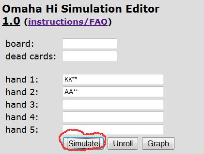

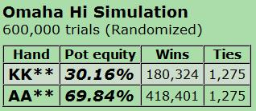

然后我们返回开始并单击“图表”，如下所示。这将生成KKxx vs AAxx的翻牌权益分布曲线：

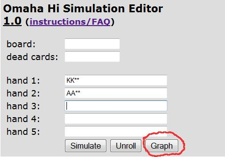

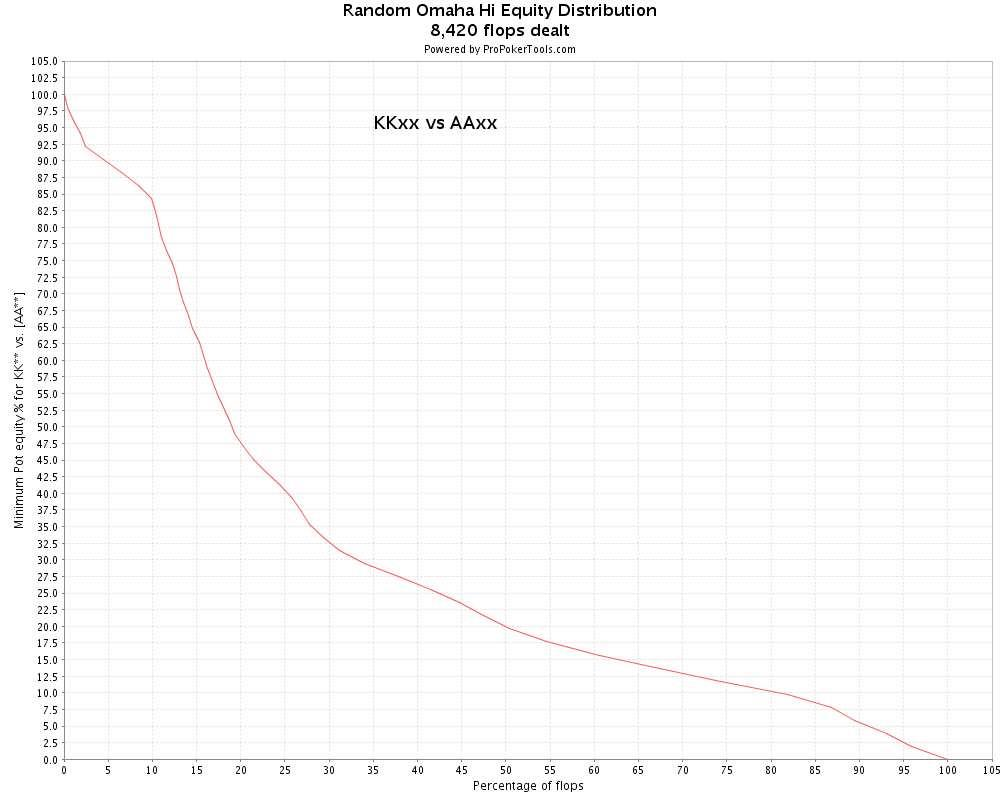

（本文的其余部分：单击所有图表以在单独的浏览器窗口中以全尺寸打开它们，以便您可以查看所有详细信息。）

那么这张图表告诉我们什么？简而言之，它告诉我们KKxx对抗AAxx的最低翻牌权益的频率（稍后会详细介绍）。此外，KKxx对AAxx的总权益等于曲线下0到 100%之间的总面积，如下所示：

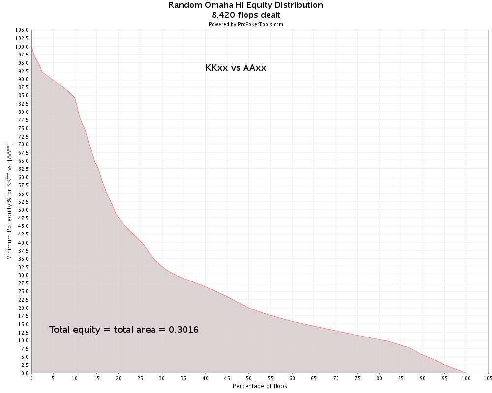

我们现在将提出一系列问题并找到它们的答案，以说明我们将如何在本文中使用翻牌权益分布。

#### 3.2.1 我们在翻牌时拥有至少 x% 权益的频率是多少？
例如，我们可以问：KKxx对抗AAxx时拥有至少50%权益的频率是多少？我们通过查看图表并找到图表中值为50%的点来找到答案，如下所示：

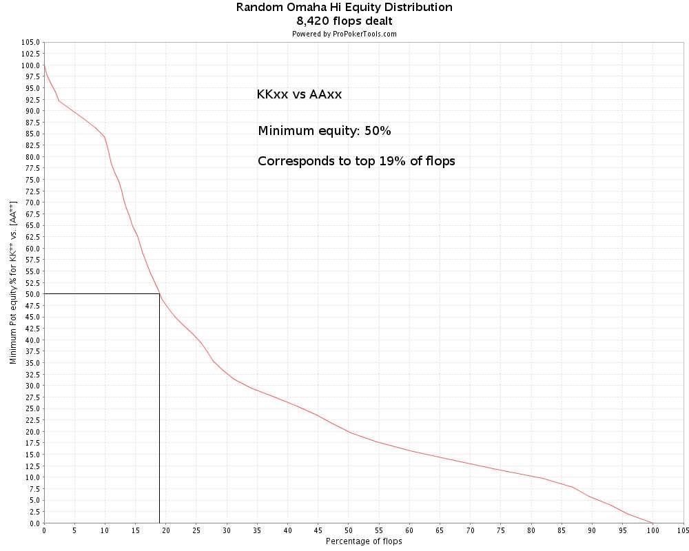

我们看到KKxx在前19%的翻牌中拥有至少50%的权益。

#### 3.2.2 前x%的翻牌的总权益是多少？
例如，KKxx对AAxx的总权益中有多少可以在0到前19%的翻牌中找到？这相当于在图表下方找到0到前19%翻牌之间的区域，如下所示（曲线下方的彩色区域）：

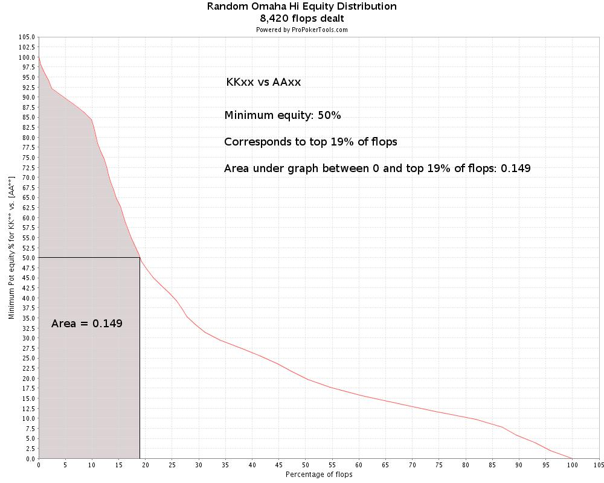

答案是，在前19%的翻牌中，我们有0.149 = 14.9%的总权益，这大约是我们总权益30.16%的一半（我们可以通过识别彩色区域占图表下方总面积的一半来手动验证这一点）。

我们很快就会明白为什么这个数字对我们有用，但首先：我们如何计算这个面积？ProPokerTools不会直接给我们这个数字，要计算它，我们必须求助于一种称为数值积分的数学技术。

我假设数值积分的细节对大多数读者来说有点太技术性了，所以我把这个材料放在附录中。那些想看看如何计算的人可以阅读附录，然后返回这里。剩下的人可以继续讨论最后一个问题：

#### 3.2.3 我们在前x%翻牌中的平均权益是多少？

我们已经确定KKxx在前19% 翻牌中对AAxx至少有50%的权益，而前19%的翻牌总共包含14.9%的权益。接下来我们想知道的是：我们在前19%翻牌中的平均权益是多少？此区域中的所有翻牌都为我们提供至少50%的权益，但是当我们击中其中一个时，我们平均有多少权益？

答案很简单：

在前x%翻牌中的平均权益等于此区域内的总权益（等于此区域内曲线下方的面积）除以区域宽度（即x）。

因此，KKxx与AAxx前19%的翻牌平均权益等于0到前19%的翻牌之间的曲线下面积（即 0.149）除以区域宽度（即0.19 - 0 = 0.19）：

19%的翻牌（即0.149）除以区域宽度（即0.19 - 0 = 0.19）：
平均权益
= 0.149/0.190
= 0.784
= 78.4%

下图也对此进行了总结，从现在开始，我们将在所有未来的图表中使用此图上的符号来计算前x%的失败的平均权益。

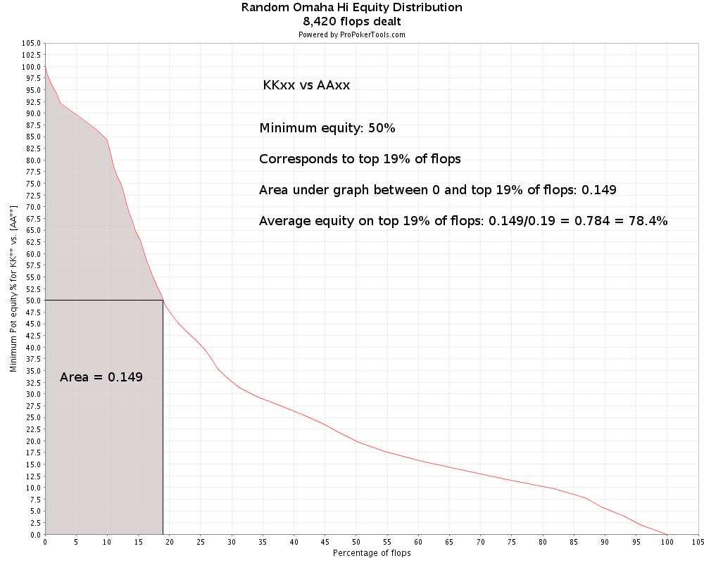

#### 3.2.4 翻牌权益分布数据解释总结
我们从一个例子开始，KKxx vs AAxx，并学习如何从图表中读取我们拥有最低权益的前x%翻牌。例如，KKxx在前19%的翻牌中对AAxx的权益最低为50%。
然后我们询问前x%翻牌的总权益是多少。我们了解到，这相当于找到0到x%翻牌之间的翻牌权益分布曲线下的面积。例如，我们发现KKxx vs AAxx在前 19%的翻牌中总权益为14.9%。

最后，我们询问前x%翻牌的平均权益是多少。例如，我们发现KKxx在前19%的翻牌中对AAxx的平均权益为 78.4%。

因此，在前19%的翻牌中，KKxx对 AAxx的胜率至少为50%，前19%的翻牌中的平均胜率为78.4%。

在研究各种起手牌的可玩性时，我们将在本文中反复使用这个计算方法。因此，在继续阅读之前，请确保您知道这些数字的含义。在本文的其余部分，我将仅展示这些结果，而不进行详细计算，但我会附上所有数值数据都记录下来的图表，以便您可以根据需要验证计算结果。

### 3.3 模拟对抗AAxx的各种起手牌的可玩性

为了练习在战略建模中使用翻牌权益分布数据，我们现在将对3种不同类型的PLO起手牌对抗AAxx的可玩性进行简单研究。我们将使用一个简单的模型，假设我们的对手完全投入AAxx，并且他会抓住任何机会下注和加注，直到我们全押。

本研究的目的是：

- 了解各种 PLO 起手牌作为底池大小的函数的可玩性
- 了解翻牌权益分布与可玩性之间的关系
- 具体了解如何玩 AAxx 和对抗 AAxx
- 学习如何在战略建模中使用翻牌权益分布

#### 3.3.1 模型描述
我们将研究以下3种起手牌对抗AAxx的可玩性：

-     （双花完美包牌）
-      （单花百老汇包牌）
-      （KK带没有价值的边牌）

我们将让这些牌在加注底池、3-bet底池和4-bet底池中与AAxx相遇，起始筹码为100BB。我们的对手将用AAxx全力投入，并且他会抓住一切机会下注和加注，直到我们全押。对于每种情况我们将计算从翻牌前将第一枚筹码放入底池那一刻起玩我们手牌的EV。

**对手的策略**
对手的策略是抓住一切机会下注和加注他的AAxx牌，直到我们全押。

**我们的策略**
我们在翻牌前将1、2 或3个底池大小的下注放入底池。翻牌后，只要我们有这样做所需的最低权益，我们就会翻牌时跟注到底（commit）。最低必要权益是我们在翻牌时跟注到底的有效底池赔率的函数，在下面每个场景的描述中给出。

请注意，当翻牌前底池较小时，我们的模型不太有意义。我们的策略是等待翻牌好到足以完全投入，然后在翻牌上投入所有筹码（这意味着永远不会有任何转牌或河牌游戏）。严格地说，这种策略只有在翻牌时只剩下1或2个下注时才有意义，这样我们就处于一个投入或弃牌的场景。但本研究的目的是在简单模型的框架内调查不同类型的起手牌如何对抗AAxx，我们并不是试图模拟最佳翻牌后游戏。因此，即使我们的模型对于小底池来说并不完全现实，但它足以满足我们的目的。

我们将为每手牌研究3种场景：

**加注底池**
- 对手加注底池（3.5BB），我们跟注。
- 翻牌底池：8.5BB
- 翻牌筹码：96.5BB
- 翻牌跟注到底的有效底池赔率：(8.5 + 96.5) : 96.5 = 1.09 : 1
- 翻牌跟注到底的最低权益：1/(1.09 + 1) = 0.48 = 48%

**3-bet底池**
- 我们加注底池（3.5BB），对手3-bet底池（12BB），我们跟注
- 翻牌底池：25.5BB
- 翻牌筹码：88BB
- 翻牌跟注到底的有效底池赔率：(25.5 + 88) : 88 = 1.29 : 1
- 翻牌跟注到底的最低权益：1/(1.29 + 1) = 0.44 = 44%

**4-bet底池**
- 对手加注底池（3.5BB），我们3-bet底池（12BB），对手4-bet底池（37.5BB），我们跟注
- 翻牌底池：76.5BB
- 翻牌筹码：62.5BB
- 翻牌时跟注到底的有效底池赔率：（76.5 + 62.5）: 62.5 = 2.22 : 1
- 翻牌时跟注到底的最低权益：1/（2.22 + 1）= 0.31 = 31%

**计算EV**
我们将使用本文前面讨论翻牌权益分布时介绍的数学技巧。我们首先访问ProPokerTools.com来计算每手牌的翻牌权益分布图：

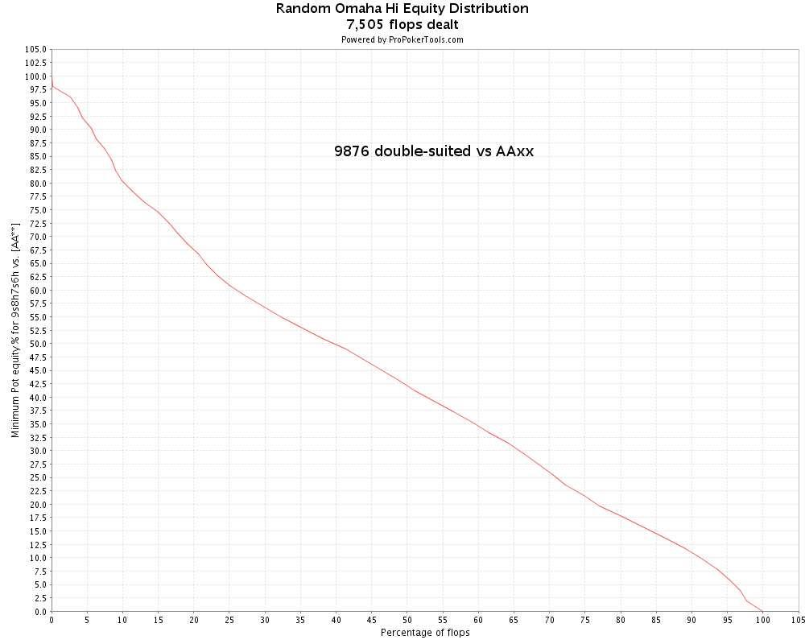

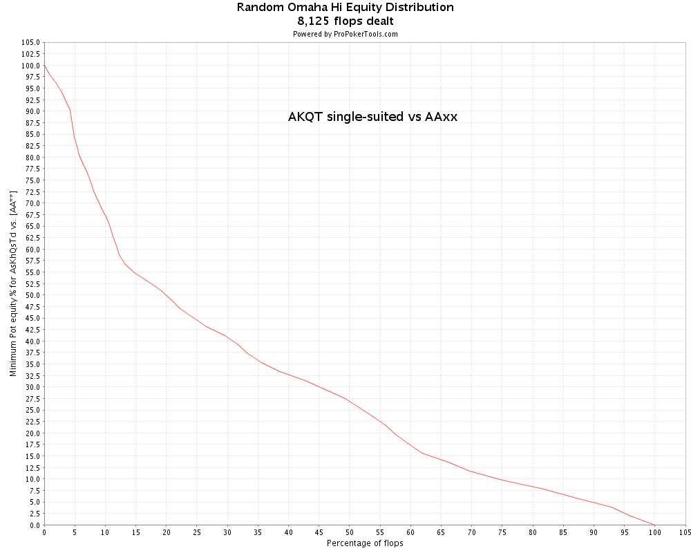

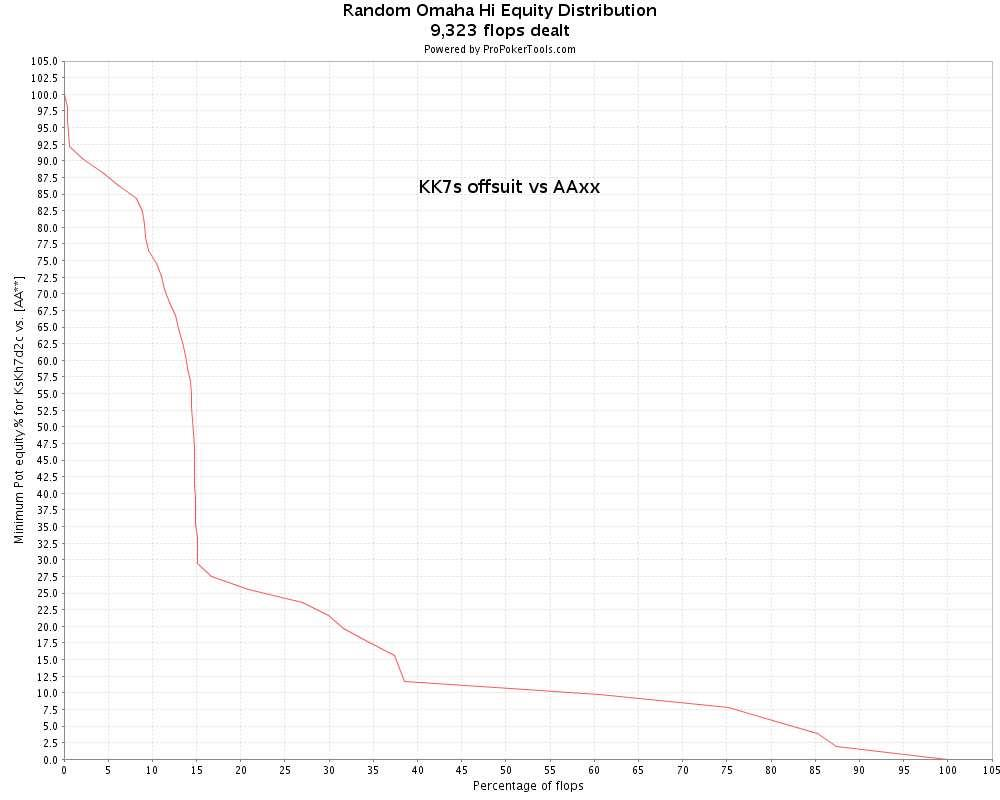

对于每种情况，我们都知道我们需要在翻牌圈投入的最低翻牌权益（我们在上面每种情况的描述中计算了这些），所以我们首先问：在前x%的翻牌圈中，我们的权益最低或更高？答案是前x%的翻牌圈，我们从图中读取了某个x值。

然后我们问：在前x%的翻牌圈中，我们手牌的总权益是多少（例如曲线下的面积）？我们使用附录中描述的数值积分来计算这个数字。

最后，我们问：在前x%的翻牌圈中，我们的平均权益是多少？我们按照前面描述的方法计算这个数字（前x%的翻牌圈的总权益除以x）。

现在，我们拥有计算我们在场景中发挥的EV所需的所有数据。EV方程为：

*EV = (1 - top_x)(-pf_bb) + top_x(av_equity(201.5) - 100)*

其中
- top_x = 具有最低权益的翻牌前x%
- pf_bb = 翻牌前进入底池的大盲注数量
- av_equity = 翻牌前 x% 的平均权益

EV 方程的解释如下：

我们有(1 - top_x)的概率必须在翻牌圈过牌并放弃翻牌前的投资pf_bb。击中翻牌圈并投入资金的概率是top_x，在这种情况下，我们在201.5 BB 底池（我们的筹码 + 对手的筹码 + 盲注）中拥有平均权益av_equity，我们总共冒着100 BB 的风险。

现在开始模拟。对于每种情况，我们都包含一个图表，其中记录了所有必要的数值数据（单击图表可在单独的浏览器窗口中以全尺寸打开），然后我们将这些数字代入EV方程并计算该情况的EV。对于每手牌，我们都会在加注、3-bet和4-bet底池中找到我们的EV。最后，我们进行总结，根据底池大小得出结论，该手牌如何对抗AAxx。

#### 3.3.2 9s8h7s6h vs AAxx

**单次加注底池**

*top_x = 42%
pf_bb = 3.5
av_equity = 68.9%
EV = (1 - 0.42)(-3.5) + 0.42(0.689(201.5) - 100) = +14.28BB*

**3-bet底池**

*top_x = 48%
pf_bb = 12
av_equity = 66.1%
EV = (1 - 0.48)(-12) + 0.48（0.661(201.5) - 100） = +9.66BB*

**4-bet底池**

*top_x = 65%
pf_bb = 37.5
av_equity = 58.5%
EV = (1 - 0.65)(-37.5) + 0.65（0.585(201.5) - 100） = -1.46BB*

**    vs AAxx的总结**

EV（单次加注底池）：+14.28BB
EV（3-bet底池）：+9.66BB
EV（4-bet底池）：-1.46BB
在查看EV结果之前，我们可以注意到     ，翻牌权益分布曲线非常平滑，权益均匀分布在各种翻牌上。

这种曲线表示一手牌经常能很好地击中翻牌，这就是双花色优质顺子牌     所做的。我们经常会翻牌一些成手牌 + 抽牌的组合，这些组合足以继续下去。

    的平滑权益分布意味着这手牌在对抗AAxx的大底池中表现良好，只是
因为我们经常击中翻牌，足以在翻牌时投入并获得翻牌前投资的回报。

    在单次加注和3-bet底池中表现良好，我们必须一直到4-bet底池，其中 37.5%的筹码都投入翻牌前，否则这手牌在我们的模型框架内就无利可图了（即使在这种情况下，我们也几乎不低于盈亏平衡）。

我们将在第4部分中回到对抗AAxx的优质顺子牌的话题，但此时我们清楚地看到为什么优质顺子牌是好的3-bet牌。他们在大底池玩得很好，即使我们遇到 AAxx，也不算世界末日。
