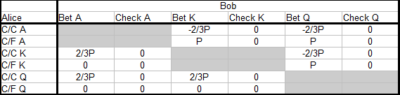
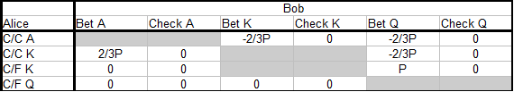

[link](https://web.archive.org/web/20180922153948/http://en.donkr.com/forum/plo-from-scratch---part-13a-541166)

### 13.1 Introduction

This is Part 13 of the article series "PLO From Scratch". The target audience is micro and low limit players with some experience from limit or no-limit Hold'em, but little or no PLO experience. My goal with this series is to teach basic PLO strategy in a systematic and structured manner.

There was a long pause after Part 12, but we continue where we left off. The main theme for Part 13 and the next few articles is postflop betting in heads-up pots. We'll use a top-down approach where we first discuss principles for sound play, sometimes based on theory and sometimes based on good poker sense and logic. Then we illustrate the concepts with examples, and talk about how to deviate from default play against players we have reads on.

We'll discuss play both in and out of position. In both cases we want good default strategies that protect us against being exploited by god and aggressive opponents. In other words, we want to play in a balanced manner so that a good opponent can't easily spot and exploit weaknesses in our game. When we have trained such solid defaults strategies, we can use them against good players and against unknowns.

This is a good way to think about poker strategy. Against good opponents that quickly identify and exploit leaks, we have to think about defending ourselves against their attacks. If we can't spot leaks in another player's game, the only thing that makes sense is to protect ourselves against getting exploited by him, while we try to make money from the weaker players at the table.

When playing unknowns, it's fine to assume they play poorly at the lowest limits, but not at the mid-limits and higher where strong players abound. It's therefore prudent to start out with balanced strategies against unknowns, and then we can adjust later in order to exploit the leaks we identify through reads.

So we will benefit from training solid and balanced default strategies that are partly based on defense, instead of always trying to exploit weaknesses that may or may not exits (for example by bluffing a lot, assuming our opponents fold too much). We should keep in mind that when we adjust in order to exploit another players mistakes, we are moving away from balanced play and thereby creating openings (leaks) in our own strategies. An observant and thinking opponent can then attack us through these openings. Knowing approximately what a balanced strategy looks like enables us to switch between exploitive and balanced play when the situation calls for one or the other.

Part 13 will be about c-bet decisions heads-up and in position. Since we will cover a lot of material, we'll split Part 13 into multiple parts (13a, 13b, 13c, etc). Part 13a will discuss some fundamental theory that we'll use to structure our thinking about c-betting heads-up and in position. Then we'll apply that theory in future articles and gradually build our understanding of ranges for valuebetting, bluffing and checking back in this scenario. When we have developed a good understanding of c-betting the flop in in position, we also have a foundation to build on when we move on to barreling (c-betting with a plan of continuing to bet on further streets. God barreling begins with good c-betting!

Since a good player will play most of his raising hands in position, this is an important scenario to play well. C-betting to much and/or with the wrong types of hands on the flop is a common leak that sets us up for problems either on the flop on later streets. In Part 12 we talked about how bet-folding medium strong hands in PLO (for example, a hand like Q♥Q♦7♠5♦ on a T♦6♣2♠ flop) and how this is generally better for us than checking back and playing turns. But there are different types of medium strong hands, and in this article we'll use a more nuanced view. Some medium PLO hands are best played as bet-fold hands, while others plays better when we check them behind on the flop.

Below are two examples that illustrate the kinds of problems we can run into if we use unbalanced and static c-betting strategies without paying attention to how the opposition adjusts to us:

**Example 13.1.1 Aggressive c-betting against a presumed tight opponent**  
\$50PLO 6-max

**Preflop**  
You (\$50) raise to \$1.50 with Q♣9♥7♣3♦ on the BTN, the big blind ($50) calls.

You haven't gathered specific reads on any of your opponents, but the table has played pretty tight so far with lots of folding both preflop and on the flop. You have therefore decided to openraise a very wide range on the BTN. You fold the worst garbage like 7♦3♥2♣2♠, but open around 80% when it's folded to you. You also c-bet very liberally after getting called, and you have picked up lots of pots where your opponents have check-folded the flop.

**Flop:** 4♥4♦2♣ (\$3)  
Big blind (\$48.50) checks and you have a c-bet decision. You missed the flop completely, but your opponent probably did as well, and you are assuming he will play tight and straightforward against your c-bet. So you make a \$1-50 c-bet bluff, big blind check-raises to \$4.50, and you fold.

If you now don't pause to evaluate the hand, you might be setting yourself for problems in future hands. You c-bet a garbage hand on an extremely dry/low flop that mostly misses both your range and your opponents range. It's on these flops that we expect our bluffs to be most successful, so it's standard to c-bet bluff a lot when checked to, especially against tight opponents.

But this time the big blind check-raised. This should trigger an alert, both because he plays tight preflop (he is unlikely to have a 4 or 22xx) and because he has played tight postflop so far). We should now consider the possibility that he is getting fed up with our loose-aggressive BTN play, and that he has decided to fight back. Check-raising hard-to-hit flops like this one is one way to do that.

If big blind has made this and other reasonable adjustments against our aggressive raise-a-lot-and-c-bet-a-lot strategy on the BTN, continuing this way will make us exploitable. Our problem is now that when we open a wide range preflop and then c-bet most of it postflop, we end up with a wide and weak c-betting range that big blind can exploit in various ways. For example:

- Bluff-checkraise a lot (possibly with any four cards on dry flops)
- Check-call flops with a wide range, planning to bluff some turn scare cards, bluff some rivers when we check behind the turn, and win some showdowns unimproved when the hand gets checked down on the turn and river

If we based on this hand and future hands conclude that big blind has indeed made adjustments against us, we should switch gears and tighten up. We should openraise tighter and also c-bet bluff less. First and foremost we don't want to put ourselves in spots where we have a very wide, unbalanced and weak range with a large excess of bluffs. Because this is a situation that our opponent can exploit, and he has now decided to do so.

So let's say we take these considerations into account and switch gears. But since we are feeling a bit vulnerable, we adjust too far. We only c-bet our best hands, and then we check back all hands that can't be played against a check-raise, i.e. our medium strong hand and all our air. What are the consequences against an opponent that pays attention to what we are doing?

**Example 13.1.2 Tight c-betting against a presumed loose-aggressive player**  
\$50PLO 6-max

**Preflop**  
You (\$50) raise to \$1.50 with Q♠Q♥6♣3♦ on the BTN, the big blind (\$50) calls. Big blind is the player from the previous example, and we're assuming he has adjusted to counter our previous loose-aggressive play. We counter-adjust by playing tighter both preflop and on the flop as discussed above. This because we fear getting bluff-checkraised and called a lot when we bluff or bet marginal hands.

**Flop:** J♠7♦2♣ (\$3)  
Big blind (\$48.50) checks, and and you have a c-bet decision. You have flopped a mediocre overpair on a pretty dry flop, and you should often have the best hand here. But since you fear a checkraise, you decide to check back this and similar hands. You're mainly hoping to get the hand checked down and win a showdown in a small pot.

**Turn:** J♠7♦2♣9♦ (\$3)  
Big blind (\$48.50) bets \$2, what do you do now?

The turn card is bad for us, since it makes a straight, various plausible two pair combos, flush draws and straight draws possible. With only an overpair and no outs we can't call here, and you fold.

But again you should think about the consequences of continuing with the strategy you have chosen. Tightening up against a big blind player that has started to play back against you is sound. But if you now start checking back every flop you miss, life won't be any easier for you.

An observant opponent quickly learns that a flop check from you means you are weak. And when you bet, you are strong. So he doesn't have to play back against your c-bets. He can sit comfortably and only defend against your strong c-bets with his best hands, and then he folds all his air. And the times you check back the flop, he can bluff a lot of turns, especially the scary ones, with his air hands and steal a lot of pots. His strong hands will also be easy to play against your weak range.

Again we see that an extreme and static strategy creates "holes" that an observant and thinking opponents can attack through. So now we can ask:

*If neither an extreme loose-aggressive nor an extreme tight-passive c-betting strategy works well against an opponent that quickly adjusts to us, how should we then think about our c-bet decisions heads-up in position? Can we find a strong strategy that works well regardless of our opponent, and that we can use as a default against good or unknown opponents.*

It turns out that these strong strategies do indeed exist, and in the remainder of this article we'll talk about how to approach such a strategy for the scenario where we c-bet heads-up and in position.

So far we have narrowed the problem of finding a strong c-betting strategy down to the following through sound poker sense and logic:

- We can't c-bet 100% against an opponent that adjusts well
- So we need to check some flops
- But of we only check our weakest hands, we be easy to read and easy to exploit
- So what does a strong default strategy for c-betting and checking look like?

Our next step is to turn to the AKQ game, which is a simple 1-street poker model, and then we solve a pot-limit variation of the game in order to shed light on the general shape of a strong c-bet/check strategy heads-up and in position. Then we'll use the general form of the strategy in future articles and use it to design our ranges in PLO c-betting.

The following section is included for completeness and future reference. You can skip to the solution at the end of the section (subsection 2.3) unless you are interested in the mathematical details.

### 13.2 The AKQ game with pot-limit betting as a model for PLO c-betting heads-up and in position

MISS PIC

- We have two players: Alice (out of position) and Bob (in position)  
- The pot-size is P  
- Both players are dealt a card from the AKQ deck  
- Alice checks in the dark  
- Bob can now check and take a showdown, or he c-bets 2/3 pot  
- if Bob bets, Alice can fold, or she can call and see a showdown  
- When the betting round is over, and nobody has folded, the highest card wins a showdown  

We're only looking at the EV for Bob's c-bet decision, and we don't care about who contributed to the starting pot. We set Bob's c-bet size to 2/3 x pot in order to make it representative for a c-bet/check decision in PLO. In practice we sometimes bet less and sometimes more, but 2/3 x pot is a good estimate of an average c-bet size heads-up and in position.

If Bob never bets, no money switches hands postflop, and EV becomes zero for both. But when Bob sometimes bets, this will change. We saw in Part 12 (where we looked at a fixed-limit variation of this model) that Bob had a +EV situation because of his position and the rule that forced Alice to start with a check. We will see the same thing here, but with a different solution for the game because of the bet size we have chosen.  

We now solve this model game, based on our chosen rules. Solving the game means finding the complete strategies for both players, as well as their EV's. We calculate EV relative to Bob, and since the game is zero-sum (there is no rake), Alice's EV has to be the opposite of Bob's (EV(Alice) =-EV(Bob)).

#### 13.2.1 Constructing a reduced payout matrix

We begin by constructing a payout matrix for the game. This is a table that contains all possible outcomes and the players' wins and losses for each outcome. We look at ex-showdown value only (only chips that change hands as a result of betting), and we calculate EV relative to Bob.

The full payout matrix is:

Where we use these abbreviations for Alice's strategies

- C/C =Check-Call
- C/F =Check-Fold

For example, when Bob bluffs Q, he can either lose his c-bet of 2/3 x pot (when Alice calls with A or K) or he wins a pot P (when Alice folds A or K) that he could not have won by checking. The complete payout matrix is simply a complete list of values for Bob for all possible outcomes in the game, regardless of whether the strategies involved are good or bad. The next step is to eliminate dominated strategies that the players have no reason to choose. Then we reduce the payout matrix.

If we have two strategies S1 and S2 where S1 is never worse than S2 and sometimes better, we say that S1 dominates S2. We simplify the payout matrix by eliminating dominated strategies that are never used by players who are trying to maximize their profits. We begin with Alice and eliminate her check-folding with A and check-calling with Q. These strategies are dominated by check-calling A and check-folding Q, respectively.

Then we eliminate Bob's dominated strategies, which are betting K and checking A:

MISS PIC

Finally we make one last simplification by removing strategies that are both automatic and don't influence EV. These are Alice's check-folding with Q and Bob's checking with K. So when we solve the game for Alice's and Bob's optimal strategies, we only have to take into consideration the following subset:

MISS PIC

#### 13.2.2 Solving the AKQ game

We now solve the game by deriving the optimal strategies for Alice and Bob from mathematical equations. Bob always bets A and Alice always check-calls A, so what we need to find out in order to specify both players' strategies completely are:

- How often does Bob bluff with Q?
- How often does Alice call with the bluffcatcher K?

We also need a definition:

**Optimal strategy**  
We say that a strategy is optimal if our opponent can's change her EV by changing her strategy against us. She then becomes indifferent to her strategic choices, since they all result in the same EV, and she's at a strategic indifference point.

**Bob's optimal bluffing frequency with Q**  
When Bob bluffs with Q, Alice of course always check-calls with A, but she has a choice to make with the bluffcatcher K. She can have the best hand or she could be beat, so should she call or fold? When Bob's c-betting strategy is optimal, Alice should be indifferent towards calling or folding, and we have:

EV_Alice (call K) =EV_Alice (fold K)

Bob always bets A. Additionally, he bluffs some of the time with Q. Let b be the probability of Bob bluffing those times he has a Q. Alice's EV for calling with K is then:

EV_Alice (call K) =EV (Bob bets A) + EV (Bob bluffs Q)

Bob has A half the time and when Alice runs into A, she loses a -2/3P (note that this notation is to be read as (-2/3)P and not -2(/3P)) bet. Bob has Q half the time, but only bets b% of times he has Q. So the probability of Bob bluffing Q is 1/2 x b =b/2, and Alice wins +2/3P when she calls.

The EV expression for Alice's calling with K is then:

EV_Alice (call K)  
=EV (Bob bets A) + EV (Bob bluffs Q)  
=(1/2)(-2/3P) + (b/2)(+2/3P)  
=-P/3 + bP/3

The same line of reasoning tells us that the EV expression for Alice's folding with K (where she loses the pot P when she lets herself get bluffed out of a pot she would have won if Bob had checked) is:

EV_Alice (fold K) =(b/2)(-P) =-bP/2

We now find Bob's optimal bluffing frequency by setting Alice's EV for calling with K equal to her EV for folding (so that she is at an indifference point):

EV_Alice (call K) =EV_Alice (fold K)  
-P/3 + bP/3 =-bP/2  
-1/3 + b/3 =-b/2  
-1 + b =-3b/2  
b + 3b/2 =1  
b(1 + 3/2) =1  
b(5/2) =1  
b =1/(5/2)  
b =2/5

We conclude that Alice should bluff 2/5 =40% of the time when he has Q

**Alice's optimal calling frequency with K**  
We use a similar approach for Alice. When Alice plays optimally, she calls so often that Bob becomes indifferent towards checking behind or bluffing with Q. This defines an indifference point for Bob, and we have:

EV_Bob (bluff Q) =EV_Bob (check Q)

Bob's EV for checking behind with Q is 0, so we only need to find the expression for Bob's EV when he bluffs Q:

EV_Bob (bluff Q)  
=EV (Alice calls A) + EV (Alice calls K) + EV (Alice folds K)

The first term in this expression is simply the probability that Alice has A (50%) multiplied with Bob's loss when he gets called (-2/3P).

EV (Alice calls A) =(1/2)(-2/3P)

For the two terms that involve Alice's calling and folding with K, we let c be the probability that she calls. Then the probability that she folds is (1-c). When Alice calls with K, Bob loses-2/3P. When Alice folds K, Bob wins a P pot with his bluff. The two last terms in the EV expression become:

EV (Alice calls K) =(1/2)(c)(-2/3P)

EV (Alice folds K) =(1/2)(1 - c)(P)

And we get:

EV_Bob (bluff Q)  
=EV (Alice calls A) + EV (Alice calls K) + EV (Alice folds K)  
=(1/2)(-2/3P) + (1/2)(c)(-2/3P) + (1/2)(1 - c)(P)  
=-P/3 - Pc/3 + P/2 - Pc/2  
=-2P/6 - 2Pc/6 + 3P/6 -3Pc/6  
=-2P/6 + 3P/6 -2Pc/6 - 3Pc/6  
=P/6 -5Pc/6  
=(1/6){P - 5Pc}

Finally, we find Alice's optimal calling frequency by setting Bob's EV for bluffing equal to his EV for checking (which is 0):

EV_Bob (bluff Q) =EV_Bob (check Q)  
(1/6){P - 5Pc} =0  
P - 5Pc =0  
1 - 5c =0  
5c =1  
c =1/5

We conclude that Alice should call 1/5 =20% of the times she has K.

#### 13.2.3 The complete solution to the AKQ game

**Alice**  

- Always check-calls A
- Check-calls K 1/5 =20% of the time
- Always check-folds Q

**Bob**  

- Always bets A for value
- Always checks behind with K
- Bluffs Q 2/5 =40% of the time

The final step is to calculate Bob's EV for the optimal strategy pair we just found:

#### 13.2.4 The value of the AKQ game (Bob's EV)

We now let Alice and Bob use their optimal strategies against each other, and then we calculate the EV for Bob. The problem can be split into six parts where we calculate Bob's ex-showdown value for each of the following scenarios:

- Alice has A and Bob has K
- Alice has A and Bob has Q
- Alice has K and Bob has A
- Alice has K and Bob has Q
- Alice has Q and Bob has A
- Alice has Q and Bob has K

All scenarios are equally probable with probability 1/6. We first calculate each scenario's contribution to Bob's EV, and then we find his total EV by summing all contributions:

**Scenario 1: Alice has A and Bob has K**  

EV1 =(1/6)(0) =0

Bob always checks behind and there is no betting.

**Scenario 2: Alice has A and Bob has Q**  

EV2  
=(1/6){EV (Bob bluffs) + EV (Bob checks)}  
=(1/6){(2/5)(-2/3P) + (3/5)(0)}  
=(1/6){-4P/15}

Bob bluffs 2/5 of the time and checks behind the remaining 3/5 of the time. When he bluffs against A, he always loses -2/3P. When he checks behind, he loses nothing.

**Scenario 3: Alice has K and Bob has A**  

EV3  
=(1/6){EV (Alice calls) + EV (Alice folds)}  
=(1/6){(1/5)(2/3P) + (4/5)(0)}  
=(1/6){2P/15}

Bob always bets. Alice calls 1/5 of the time and Bob then wins 2/3 P. She folds the remaining 4/5 of the time, and Bob wins nothing.

**Scenario 4: Alice has K and Bob has Q**  

EV4  
=(1/6){EV (Bob bluffs) + EV (Bob checks)}  
=(1/6){(2/5){(1/5)(-2/3P) + (4/5)(P)} + (3/5)(0)}  
=(1/6){-4P/75 + 4P/5}  
=(1/6){-4P/75 + 60P/75}  
=(1/6){56P/75}

Bob bluffs 2/5 of the time and checks behind the remaining 3/5 of the time. Those times he bluffs, Alice calls 1/5 of the time and Bob loses -2/3P. She folds the remaining 4/5 of the time, and Bob wins the pot P. When Bob checks he wins/loses nothing.

**Scenario 5: Alice has Q and Bob has A**  

EV5 =(1/6)(0) =0

Bob always bets his, Alice folds her Q and no money changes hands.

**Scenario 6: Alice has Q and Bob has K**  

EV6 =(1/6)(0) =0

Bob always checks back his K and no money changes hands.

**Bob's total EV for the game**  

We sum the six EV contributions and find Bob's total EV:

Bob's EV  
=EV1 + EV2 + EV3 + EV4 + EV5 + EV6  
=0 (1/6){-4P/15} + (1/6){2P/15} + (1/6){56P/75} + 0 + 0  
=(1/6){-4P/15 + 2P/15 + 56P/75}  
=(1/6){-2P/15 + 56P/75}  
=(1/6){-10P/75 + 56P/75}  
=(1/6){46P/75}  
=23P/225

Bob earns 23P/225 =0.102P from his optimal c-betting strategy. His EV grows linearly with the pot size P, so the bigger the starting pot, the better for Bob.

An obvious analogy for this scenario is what happens when weak and passive players play lots of big pots out of position, for example by flatting lots of 3-bets. Playing a weak flatting range out of position against a good player is very hard, and the bigger the pot, the worse it becomes (if the stacks are still reasonably deep postflop). Especially if the player out of position habitually checks to the preflop aggressor and lets him dictate play.

Then the player in position can comfortably build a c-bet range with a balanced ratio of valuebets (corresponds to A in the AKQ game) and bluffs (corresponds to Q in the AKQ game), and then he checks back and takes a free cards with medium strong hands (corresponds to K in the AKQ game) that are too weak to valuebet, but too strong to turn into bluffs.

we'll see in a future article that the player out of position can make it easier for himself by sometimes betting the flop, but it's still hard to play well out of position.

#### 13.2.3 A PLO interpretation of the AKQ game

We have introduced a model for c-betting the flop heads-up and in position when checked to, and the optimal solution of the model is

**Alice**  

- Always check-calls A
- Check-calls K 1/5 =20% of the time
- Always check-folds Q

**Bob**  

- Always bets A for value
- Always checks behind with K
- Bluffs Q 2/5 =40% of the time

EV(Bob) =23P/225

Note that in our model Alice is forced to start the betting round with a check. When we apply this model to real poker, it will work best when the player out of position usually checks. And since Alice is not allowed to check-raise, the model will work best when the player out of position rarely checkraises.

Another limitation in the model is that there is only one street of betting (or rather 1/2 street, since Alice can't bet) with static hand values. In real poker we also have to worry about getting checkraised and we have to think about play on future streets where hand values change.

But we can extract some fundamental concepts from this simple model:

- Bob operates with three ranges: A strong valuebet range, a medium strong range of check-back hands, and a weak range of air hands from which he picks his bluffs
- Bob uses a valuebet/bluff ratio that is a function of bet size vs. pot size. To be exact, the value/bluff ratio for Bob's c-bet is identical to the pot-odds Alice is getting to call, namely 5 : 2. He bets 100% of his value hands and 40% of his air hands for a 100 : 40 =5 : 2 ratio. The probability that he is bluffing is then identical to the pot odds Alice is getting for snapping off a bluff, and she becomes indifferent towards calling or folding with her bluffcatchers (K).
- Alice calls enough with her bluffcatchers to prevent Bob from profitably c-betting all his air hands as a bluff, and Bob becomes indifferent to bluffing or not bluffing (since his bluffs break exactly even). But she folds enough bluffcatchers to avoid getting valuebet to death by Bob's value hands

Bob's betting strategy follows the well-known strength principle in poker:

- Bet your best hands for value
- Check hands that are a little too weak to bet for value
- Sometimes bluff, and otherwise check, your weakest hands

So when we play PLO and want to use a balanced c-betting strategy against a good or unknown player, we can begin by splitting our total range in three pares, from top to bottom:

- Value hands
- Check-back hands
- Air

**Value hands**  
Our best hands that we bet for value, expecting to profit from getting checkraised or called. When you try to build a strong default c-betting strategy, let most value hands be hands you plan to 3-bet or call against a c-bet. Simply pot: Your value hands are the hands you are happy playing a big pot with.

Here are some obvious value hands heads-up in a singly raised with 100 bb stacks:

J♠J♣7♠2♦ on a J♥9♥6♦ flop (top set)
A♥K♦Q♠T♦ on a A♠K♦J♠ flop (nut straight + top two pair)
K♠T♦9♦8♠ on a K♦7♥6♦ flop (par + 13 out nut wrap + non-nut flush draw)

All these hands are easy to play against a checkraise. Top set can always be happy about going all-in, and the same goes for the nut straight with a redraw (even if we will sometimes run into the same straight with a better redraw). And a combo draw with pair + straight draw + flush draw will also have god equity against everything Villain ships our way, including some draws that we dominate hard.

**Check-back hands**  
You will often sit on the flop with medium strong hands/draws that can be best, or at the very least have a handful of good outs when behind, but they are not strong enough to get all-in on the flop or calling a checkraise. Since there is value to be had by seeing the turn with these hands, these are good hands to check behind. We have better candidates for bluffing (weaker hands that don't give up much equity when bet-folding to a checkraise). and we have better hands for getting all-in or bet calling against checkraises.

However, we need to draw an important distinction within the group of medium strong hands. Some medium strong hands work better as betting hands where we bet mainly to get our opponent to fold (we bet to protect our hand). Other medium strong hands play better when we check behind and play turns with them.

Here are some candidates for checking behind on the flop:

T♠9♥8♦3♠ on a J♠7♦2♣ flop (inside nut wrap + backdoor flush)
J♣9♦7♦4♥ on a Q♠8♦4♣ flop (nut gutshot + pair)
6♥5♥4♦3♦ on a Q♥9♥8♥ flop (low flush)

The two straight draws are hands that will struggle against the hands Villain is willing to play a big pot with. The best draw (the inside nut wrap) could be bet with a plan of calling a checkraise and playing turns (if the stacks are reasonably deep and we also play to bluff a bit on future streets), while the weak gutshot + pair combo should be folded to a checkraise as a default.

What's important for these types of hands (hand/draw combos with a handful of good outs) is that when we bet-fold them, we fold away a significant chunk of equity. We don't want to continue against a checkraise, but a lot of turn cards will help us, either by improving us to the best hand, or by giving us good bluffing opportunities (typically when a scare card comes and Villain checks again). We want to see these turn cards with this type of hand, and checking the flop gets us there.

For the flush it might be tempting to bet for value, but before we do this we have to think about what Villain can give us action with when he is willing to play a big pot. This will mostly be bigger flushes. Even if we almost always have the best hand now, this is not good enough reason to bet for value, planning to ship stacks in. We also have to think about who has the best hand when the stacks do go in, and unfortunately this will mostly be Villain.

Instead of betting for value, we can check back our flush, planning to call turn bets. If Villain doesn't bet, we have the choice between betting for value or employing the check-back line once again, planning to call river bets. Sitting in position behind a player that checks gives us all good options.

Note that the hands we check back are hands that can continue on many turn cards, should Villain come out betting. This is an important point that we will talk more about later. When we check back flops, we are telling Villain that we have a weak range. An aggressive and opportunistic player will often use this information against us and bluff many turns, expecting to succeed often.

We can't allow such valuable information to be given away just like that, and therefore it's important that we think about checking hands that can play turns. Per definition these hands are hands with many outs (if we have a hand/draw that's rarely best on the flop) or hands that don't fear many turn cards (if we have a probable best hand on the flop that we don't necessarily want to play a big pot with).

**Air**  
Hands that can't be bet for value and that don't profit much from seeing turns are air hands. Air hands are candidates for bluffing. Everything that makes you go "bleh" when you look at it can be used as bluffs, but it's important that we don't bluff all candidates as a default (although some players let us get away with it on some flops). When we are using a balanced default strategy, We want to bluff just enough to keep Villain aware that we could be bluffing any time we bet, but not so much that he will immediately profit from calling a lot or playing back a lot.

If he now tries to escape our value hands by folding a lot of bluffcatchers, he loses more pots to our bluffs. If he tries to punish our bluffing by calling or re-bluffing a lot, he loses more value to our value hands. Since our valuebetting and bluffing ranges are balanced there is little Villain can do to prevent us from making a profit by betting. All he can do is to defend himself with a reasonably balanced range of his own to keep his losses to a minimum.

Here are some candidates for bluffing:

Q♣J♥T♦9♦ on a K♠ 7♦ 5♣ flop (air on a dry flop)
A♦K♥J♣9♣ on a T♦6♦2♦ flop (nut flush blocker on a monotone flop)
6♠6♦5♠5♣（原书笔误） on a 9♦7♦2♠ flop (non-nut gutshot + backdoor flush)

When we bluff, we can in principle use any worthless hand, but it never hurts to use the best of the worst hands. It also helps to keep an eye on flop texture and how Villain's range is likely to have hit the flop.

On the first flop we have nothing with a draw to more nothing, but the flop is dry and hard to hit. On the second flop we have the nut flush blocker, which gives us some interesting opportunities. For starters, Villain can't have the nut flush now, so the probability of getting checkraised has decreased (even with a low flush, Villain should be wary about checkraising). If he calls, we can then consider our options on future streets. We could keep bluffing and hope he folds his low flushes and anything weaker, or we can check and give up. If Villain keeps checking to us, which would be prudent of him without the nuts or a nut draw, we have all good options in position.

On the last flop we have a weak draw. When we looked at medium strong hands we checked back many draws, so should we think along the same lines here? No, since the draw we have here is too weak to play turns with. When we hit our straight, we don't have the nuts, and besides we could make the straight with a flush card (or a flush could come on the river).

When you have a draw so weak that you don't want to call a turn bet even after hitting, you don't have a hand suitable for checking back the flop for value. On the other hand, even the weakest draw will win some pots when called on the flop. So if you have the choice between bluffing 6♠6♦5♠5♣ and a complete garbage hand like T♣5♣3♠3♥ on the flop 9♦7♦2♠, you'd prefer the former. This gives you some escape hatches when called, and you will win a few more pots. Another way of saying this is that bluffing with very weak draws dominates bluffing with total garbage.

If Villain folds or checkraises, it doesn't matter what you have, and you are not unhappy about folding such weak draws to a checkraise anyway. With a very weak draw that can't call bets or valuebet when you improve, you are not sacrificing much value when bet-folding, since it's hard to make money from going to showdown even when you hit what you hope for. But you will win some small pots when you improve, so the hand as a little bit of value when you get called.

### 13.3 An important concept concerning medium strong hands in PLO

Lastly we'll expand a bit on a concept that concerns the definition of medium strong hand in PLO, and how that differs from the corresponding definition in NLHE.

We talked about this in Part 12 where we used modeling to illustrate that checking behind way ahead/way behind type of hands did less for us in PLO than in NLHE. For example, checking back K♠K♥4♣3♦ on a A♠9♥2♥ flop.

In NLHE we can check back KK on such flops, planning to get to showdown in a small pot (check down or call at least once if Villain bets turn and river). This plan is called "the WA/WB line".

In PLO this works less well for several reasons:

- With 4-card starting hands, there's a significant probability that Villain is ahead already, so a call-down line after a flop check is less tempting
- If he doesn't have us beat, there's a significant probability that he will draw out on us or pick up a good draw if we give him a free card on the flop
- Even if we should have the best hand, there are many 2nd best hands in Villain's range that he should call with if we bet and he knew what we had. But since he doesn't know what we have, he will often fold them. This is a fundamental-theorem-of-poker mistake, and we profit from it. For example 6♠5♦4♦2♠ on the flop A♠9♥2♥ where he has 11 outs to trips/two pair plus some backdoor possibilities. So if he had known that we only have a mediocre underpair, he would have had sufficient pot-odds to call and draw to a better hand.

The same goes for our slightly better hands like A♠7♦6♦4♣（原书笔误） on a A♠9♥2♥ flop. In NLHE we will check some with hands like A3 on these dry flops, since we are WA/WB with little risk of getting drawn out on. A flop check in NLHE controls the pot size and sets us up for comfortably winning small/moderate pots, which is what this type of flopped hand does best.

But with A♠7♦6♦4♣ on a A♠9♥2♥ flop in PLO, the hand is too weak to check back and play turns, even if it's often best on the flop. This seems a bit paradoxical with top pair on a dry flop, so let's apply logic:

If we check back the flop, planning to play turns (including calling when we get bet into), which cards are we happy to see? Any seven, six or four for two pair improves us, but only slightly. We are still behind sets and top two pair, and all our two pair outs put straight draws on the board, and sometimes also a flush draw that we don't have. so we can't be happy with playing a big pot after improving to two pair. We can improve to trips, but we're still behind full houses and better trips, so we have the same problem there. And most other turn cards that don't improve us will either put draws out there or let a weaker hand pull ahead.

So if we check the flop and Villain bets the turn, we are almost never happy. And when we can't happily play a big pot on at least some urns with our check-back hand, we have little reason to check it in the first place. It will generally be better for us to treat the hand as "PLO air". We then view the A♠ more as a blocker against other top pair/two pair hands than as a card that has value against the range Villain gives us action with.

So we can bet our A♠7♦6♦4♣ on a A♠9♥2♥ flop to protect our hand and get Villain to fold some hands he should have continued with, had he known what we have. This is a typical bet-fold-marginal-hand spot that we see a lot PLO. If you want to check back top pair hands on this flop, you have many better candidates with outs to choose from.

You can think along similar lines with hands like K♠Q♠Q♥2♦ on a J♦8♦4♣ flop, and also mediocre two pair hands like A♣8♣7♥4♥ on a 9♦7♦4♣ flop. bet and hope Villain folds. If he checkraises, fold without regret, and if he calls, you have to play good poker on future streets.

### 13.4 Summary

In Part 13a we have laid a theoretical foundation for understanding balanced c-betting strategy heads-up in position on the flop. We discussed c-betting principles based both on good poker sense + logic, and on a mathematical model of the situation. we also talked briefly about how to design ranges for valuebetting, checking and bluffing in practice.

In Part 13b we'll look at c-betting from a more practical viewpoint, and we'll define a procedure for training our ability to build sound ranges on various flop textures.
