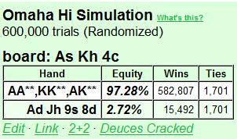
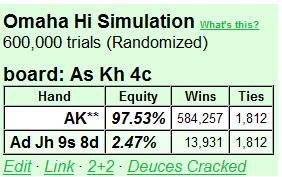
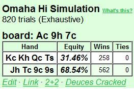
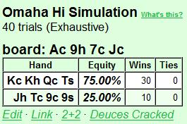
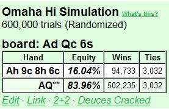

## 第 10 部分：翻牌后打法 III

### 10.1 简介

第 10 部分将围绕两个主题：

1. 讨论翻牌时的持续下注
2. 说明整个过程中的系统性翻牌后规划

第 10 部分的原始计划是从一系列翻牌后规划示例开始，但我决定将其与持续下注的讨论合并。我们记得，我们在第 8 部分和第 9 部分中定义了一个简单的翻牌后规划模型。使用此模型，我们通过评估以下因素来开始每个翻牌后决策过程：

- 对手的数量
- 位置
- SPR
- 权益（根据我们看到的牌 + 对对手范围的假设进行估计）

在翻牌圈做出第一个决定之前，先浏览一下这个列表的意义在于，通过思考这些重要的情境因素，我们可以避免许多明显的错误。我们还可以说出很多关于我们需要从翻牌圈继续玩什么牌的方法，甚至不需要看牌。例如：

- 我是否有偷牌权益，还是应该主要根据摊牌权益来做决定？
- 如果我实现摊牌权益，我需要从翻牌圈继续玩什么牌？
- 鉴于我的实际牌，我下注以求价值，还是因为底池赔率 + 隐含赔率而继续？
- 鉴于我的实际牌，我想玩大底池还是小底池？

我们现在将开始使用翻牌后规划模型来帮助我们进行翻牌后决策过程，在本文中，我们将看到 c-bet 决策如何根据 4 个因素而变化。为简单起见，我们将持续下注的讨论分为三个主要场景：

1. 单次加注底池
2. 3-bet 底池
3. 4-bet 底池（形式上如此，但是为了完整性而包括）

对于每种情况，我们将讨论在做出持续下注决定时要考虑什么，我们将清楚地看到底池大小（例如 SPR 值）如何影响我们的手牌强度要求（翻牌前底池越大，我们在翻牌后继续下注所需的手牌强度就越小）。除了翻牌后规划模型中的 4 个因素外，我们还将研究不同类型的对手（松散 / 紧、被动 / 激进）如何影响我们的决策。

第 10 部分将讨论单次加注底池中的持续下注。然后，我们将在第 11 部分继续讨论 3-bet 和 4-bet 底池。第 11 部分的其余部分还将讨论持续下注和与持续下注相关的主题。例如，翻牌圈盲注（例如，向翻牌圈加注者下注）、对抗持续下注以及双次下注（翻牌圈和转牌圈都持续下注）。

我们将尝试将 c-bet 决策视为综合策略的一部分。换句话说，我们不会过于关注我们持有的具体牌，而是讨论如何在各种情况下思考和玩各种类型的牌。我们还将考虑剥削策略（我们试图最大限度地利用对手的错误）与平衡策略（我们试图避免为对手创造利用我们的机会）。

本文中的所有示例均取自我在文章系列的资金构建项目中玩过的牌（\$5PLO --> \$200PLO）。在每个决策点，我都会描述玩牌时的想法。除了翻牌后规划模型外，我们还将频繁使用 “好扑克” 概念（第 8 部分中描述）：

1. 做出明确的假设
2. 根据这些假设找到最佳路线

我希望这些例子能够表明，根据现有信息，我们总是能够做出理性的决策。当然，桌上的分析不可能像会议结束后的纸上分析那样有条理和彻底，但有条理和完全理性的思维过程仍然是我们在做出扑克决策时一直追求的理想。

### 10.2 翻牌 c-bet 的原则

c-bet 决策是 PLO 中最重要的决策之一。这是因为：

- 它们经常发生
- 良好的翻牌圈 c-bet 策略可使后续回合的决策更简单
- 翻牌圈 c-bet 错误可能导致后续回合代价高昂的错误

每当您在翻牌圈需要做出 c-bet 或过牌决策时，重要的是要考虑在您选择其中一个或另一个后，手牌在后续回合中可能如何游戏。过于激进的 c-bet 是新手常犯的错误，并且可能会发展成重大漏洞。例如，如果你：

- 用低弃牌率的牌频繁地进行 c-bet 诈唬（我们在翻牌时浪费筹码）
- 用边缘 / 非坚果牌在不利位置频繁地进行 c-bet（我们在不利位置拿着弱牌在大底池中，这会使我们在后面的几轮中面临艰难的决定）
- 用边缘牌在有利位置频繁地进行 c-bet，而这些牌本可以从免费牌中获益（我们在翻牌时浪费筹码，或用有一定权益的牌被过牌加注，而这些牌本可以从看到转牌中获益）.

一个好的翻牌 c-bet 策略是从评估翻牌结构开始的。因此，我们将从学习一种结构化分析翻牌结构的 “语言” 开始讨论 c-bet。然后，我们将讨论单挑底池中的 c-bet，并分别研究单挑底池和多人底池。我们将使用大量示例来说明重要原则及其细微差别。

在第 11 部分讨论了 3-bet 底池和 4-bet 底池的情况后，我们将以最重要的原则总结来结束 c-bet 主题。

#### 10.2.1 评估翻牌结构

我假设每个人都熟悉 “干燥翻牌” 和 “湿润翻牌”的概念，我们分别用它们来描述可能听牌很少或很多的翻牌。在这里，我们将完善这些描述，并使用 Tom “LearnedFromTV” Chambers 在他最近的 Cardrunners PLO 视频系列 “PLO 翻牌后理论”（我强烈推荐的系列）中定义的翻牌结构表征系统。

Chambers 使用双轴系统来描述翻牌结构：

1. 湿 / 干 = 有多少可能的听牌
2. 重 / 轻 = 翻牌击中玩家范围有多大

使用这两个描述，我们试图了解：

3. 静态 / 动态 = 玩家之间的相对强度从翻牌 --> 转牌 --> 河牌变化的可能性有多大（静态 = 不可能，动态 = 可能）

“湿 / 干” 和 “重 / 轻” 这两个概念乍一看似乎描述的是同一件事，但它们是不同的。要了解这一点，请考虑以下两个翻牌：

**Flop 1:** J♥ T♥ 6♠  
**Flop 2:** 7♥ 6♥ 2♠

两个翻牌的结构相同（一个连牌 + 一个与连牌有一定关联的低牌 + 一个 2 张同花），但翻牌 1 比翻牌 2 更击中玩家的范围。原因是玩家的范围将更倾向于高牌组合 A K Q J T 9 8，而不是低牌组合 9 8 7 6 5 4（因为人们玩高牌的频率高于低牌）。

因此，即使两个翻牌都有大致相同数量的可能听牌，人们在翻牌 2 上实际上不太可能拥有这些听牌。因此，在翻牌 2 上玩边缘牌（例如，在没有强大后备听牌的情况下在 3-bet 底池中单挑 AAxx）会更容易，因为没有理由认为某人翻牌时拥有强大的听牌。

我们可以将翻牌 1 分类为湿 / 重（协调性强，可能击中玩家的范围），将翻牌 2 分类为湿 / 中重（协调性强，但不太可能击中玩家的范围）。我们使用的湿 / 干 / 重 / 轻的精确细微差别并不那么重要。我们追求的不是非常精确的分类，而是定性评估，这可以帮助我们在评估不同翻牌结构上的选择时正确思考。

以下是如何对翻牌结构进行分类的几个示例：

- A♠ K♥ 2♣

非常干 / 非常重的翻牌。不可能有超强的听牌（Q J T 是最强的有 9 张补牌的内嵌包牌听牌），但这是一张会严重影响玩家范围的翻牌，因为 AAxx、KKxx、Axxx 是经常玩的牌。

- 7♠ 7♥ 2♦

极其干 / 极其轻的翻牌。不可能有听牌，而且不太可能有人有 77xx / 72xx / 22xx / 7xxx。

- 8♥ 6♥ 2♠

中度湿润 / 中度轻的翻转。可能出现许多听牌，但不如极度湿润 / 重的翻牌 J♥ T♥ 6♠ 那么多，而且有人有这些听牌的可能性也较小。

- K♠ Q♥ 7♣

中等干 / 重的翻牌。两张高牌通常击中玩家的范围，因此翻牌很重。但由于没有同花听牌，因此强听牌较少，而且这个翻牌不是很湿。

- K♦ 8♠ 5♠

中等湿 / 中等轻的翻牌。一张 K 牌 + 两张低牌且大部分不协调的牌不会击中玩家的范围，因此这不是重的翻牌。有一些可能的听牌，但很少有非常强的听牌，因此这也不是非常湿的翻牌。

- Q♥ 6♥ 2♥

干 / 轻翻牌。要强力击中这种结构，您需要两张红心。这种情况并不常见（但某人拿到同花的可能性当然取决于看到翻牌的玩家数量），因此翻牌并不重。这里没有听牌，除了葫芦或四条，而且人们不太可能在他们的范围内有很多  66 22 Q6 Q2 62 组合，所以这也是一个非常干的翻牌。

- Q♣ J♣ 8 ♠

非常湿 / 非常重的翻牌。可能出现顺子和大量强听牌，而且人们也很可能真的有这些。

当我们根据湿 / 干 + 重 / 轻系统对翻牌进行分类时，我们最感兴趣的是*玩家之间的相对实力从翻牌到河牌变化的可能性有多大？*

换句话说：

翻牌有多静态 / 动态？

在静态翻牌中，第二好牌很难听牌超过当前最好的牌（或代表听更好的牌）。在动态翻牌中，我们预计坚果牌会经常从翻牌 --> 转牌 --> 河牌变化。动态结构提供了很多用更好的牌听牌的机会，或者可信地代表已经这样做了（并试图通过诈唬赢得底池）。

以下是一些翻牌，分为静态或动态：

- A♣ K♦ 2 ♠

这是一个非常静态的翻牌（我们之前将其标记为 “干 / 重”）。如果有人有 AAxx / KKxx / AKxx（这些是经常玩的牌），那么更差的牌不可能有强听牌来对抗它。因此，如果您手中有 AKxx 或更好的牌，您估计在翻牌时拥有最好的牌，并且您还估计在河牌时经常拥有最好的牌。

- K♥ 7♥ 2♥

非常静态的翻牌（我们之前将其标记为 “干 / 轻”）。如果任何人有坚果同花，其他所有牌都会被击败。只有
三条 / 两对牌有一些机会听牌反超，而且人们的范围中 KK 77 22 K7 K2 72 的组合并不多。

- J♣ T♣ 6♥

非常动态的翻牌。当前的坚果牌（在湿翻牌）很容易被听牌反超，而且很可能许多可能的听牌实际上都在人们手中（在重翻牌上），因为人们玩很多与牌面的牌联系紧密的起手牌。

**翻牌分类静态 / 动态对翻牌后规划意味着什么**  
静态翻牌让我们有更多机会拥有或代表对手很少有良好权益的牌，当底池是多人时也是如此。因此，在静态翻牌上下注具有很大的杠杆作用，我们的对手会很早就意识到，用第二好的牌参与其中会付出高昂的代价。

例如，假设您在单挑底池中翻牌 A♠ K♥ 4♣ 时 c-bet，而对手有 A♦ J♥ 9♠ 8♦。如果您有 AAxx / KKxx / AKxx 范围（您通过 c-bet 可靠地代表了该范围），对手几乎已经死定了，如下所示：

事实上，即使你只有 AK 顶两对，他的牌也一样没戏：

因此，在这种翻牌结构上进行 c-bet 具有很大的分量，因为它迫使对手要么弃牌，要么在可能听到死牌（没有补牌）的情况下投入筹码。如果他决定跟注我们，他将面临严重的负面隐含赔率，因为我们可以随时停止下注更差的牌，但他需要决定是否在我们领先他的时候跟注到底。这意味着我们可以确保在我们拥有好牌时投入比诈唬时投入更多的筹码。

如果对手跟注翻牌下注，计划在转牌时重新评估，而我们继续转牌下大注，我们将拥有极大的杠杆作用。转牌下注相当于对对手说：*我假设你在跟注翻牌时通常至少有顶对，而无论如何我都会在转牌下注。你愿意用筹码冒险用顶对，当落后的情况下听死牌，来看看我是否在诈唬吗？*

我们将在第 11 部分中进一步讨论杠杆的概念，届时我们将更详细地介绍开两枪（2 次 c-bet）。在此之前，要知道静态翻牌结构，翻牌的强牌通常会在转牌和河牌上保持领先，这会产生翻牌后的动态，我们可以通过 c-bet 并有时继续在转牌上下注来对边缘牌（如顶对）施加很大压力。

动态翻牌会产生不同的翻牌后动态。由于许多转牌和河牌可以改变玩家之间的相对实力，因此翻牌的强牌很难存活到河牌仍然保持相对实力情况。因此，在翻牌下注后很难一直表现出实力，而其他人很容易随时跳进来并表现出强牌。

在动态翻牌结构中畅游的艺术在于选择我们在翻牌后拿的牌。当我们很弱时，我们开始减少持续下注。我们还确保翻牌后继续使用的范围包含所有类型的成手牌和听牌（这样无论转牌和河牌是什么，我们都有改进的可能性）。

例如，假设我们从盲注位置跟注加注。我们翻牌拿到顶三条，然后对翻牌过牌加注。单独来看，用顶三条过牌加注翻牌当然是好的，但如果我们从不使用非常强的牌下注，我们的下注范围就会不平衡。假设我们已经养成了用各种听牌作为廉价半诈唬领先加注者的习惯，并且我们用最强的牌过牌加注以获得价值。如果我们在下注时永远不能拿到三条和其他强牌，这将使我们的翻牌下注范围严重偏向听牌。因此，当牌面是对子时，我们将更难可靠地展现实力（对抗观察敏锐的对手）。

我们现在学习了描述和思考翻牌结构的概念，所以让我们继续讨论单次加注、3-bet 和 4-bet 底池中的 c-bet 决策。除非另有说明，我们假设起始筹码为 100 BB，我们将通过一些来自微级别 PLO 实际游戏的完整示例来说明 c-bet 和翻牌后规划。

#### 10.2.2 关于单次加注底池的 c-bet 的一般情况

单次加注底池通常具有中高 SPR（即 > 4），因此，在翻牌后建立一个大底池以获得价值之前，必须满足某些最低手牌强度要求。

例如，假设我们在溜入者后面有利位置加注底池（4.5 BB），盲注者弃牌，溜入者跟注。我们看到翻牌单挑时底池中有 10.5 BB，后手有 95.5 BB。SPR 为 95.5 / 10.5 = 9.1（中 / 高）。

或者假设我们开池加注（3.5 BB），按钮玩家跟注，盲注者弃牌。单挑我们看到翻牌时底池中有 8.5 BB，后手有 96.5 BB。 SPR 为 11.3（高）。

或者假设我们在跟注者后面在按钮位置加注底池（4.5 BB），大盲注和跟注者跟注。我们看到翻牌圈 3 人底池中有 14 BB，后手有 95.5 BB。SPR 为 6.8（中 / 低）。

因此，我们通常在 SPR 区域 6 - 11 操作，筹码为 100 BB。这意味着我们需要超过 2 个底池大小的下注才能
全押（因为 SPR > 4），这意味着翻牌圈的风险 / 回报率并不是那么好。因此，翻牌后在单次加注底池中建立的大底池围绕着人们范围中最强的部分（坚果、近坚果和强坚果听牌）。

这意味着在单次加注底池中，激进的 c-bet 策略必须包括一定数量的弃牌，这些牌虽然不错但不是很好（例如，两对）。否则，我们将被坚果牌和坚果听牌的价值加注打死。

在单次加注底池中以高 SPR 玩牌的另一个后果是，位置比在 3-bet 和 4-bet 底池中更重要。筹码越深，我们做出的翻牌后决定就越多，我们利用位置的机会就越多。高 SPR 使得避免在不利位置使用非坚果牌 / 听牌变得更加重要，因为这些牌会让我们做出艰难的决定，这可能会导致在筹码很深时犯下大错误。

在翻牌圈，如果位置不利，并且 SPR 较高，那么在翻牌圈过牌并弃牌通常是正确的做法，即使我们在看到转牌和河牌的情况下很有可能赢得摊牌。而且，我们的对手越多，过牌并弃牌就越正确。如果在位置不利的情况下用深筹码玩边缘 / 非坚果牌，我们会陷入以下情况：

- 我们通常会向对手提供更多关于我们范围的信息，而不是他们向我们提供的信息。
- 我们对底池大小的控制较差
- 我们有负隐含赔率（因为我们的对手比我们更能控制底池大小）
- 当危险的牌发出来时，我们很容易被诈唬。

换句话说，我们后面的几条街会遇到麻烦。挑剔翻牌圈后要拿哪些牌，是许多 PLO 新手挣扎的地方，我们将在本文后面看到此类决策的示例。

我们从单挑单次加注底池的 c-bet 决策开始：

#### 10.2.3 单次加注底池中单挑的 c-bet

单挑时，我们可以进行大量的 c-bet，尤其是对被动对手。无论翻牌的协调性如何，你的范围对对手的威胁通常与他的范围对你的威胁一样大，而且你可以可靠地代表几乎任何东西（因为你会在翻牌前加注各种牌）。因此，你可以用你的所有范围对几乎任何翻牌结构进行 c-bet，对抗一个 “不中就弃牌” 的玩家，他从不在没有好牌的情况下加注（或过牌加注）你。特别是当你有位置并且对手过牌给你（这表明你很弱）时。

但是面对一个激进而有能力的玩家，我们必须更加谨慎。这种类型的玩家不会让我们在翻牌时打败他，如果你 c-bet 太多，当他怀疑你的范围很弱时，他会反击你。这取决于翻牌结构以及他如何阅读你的范围。

以下举几个例子来说明我们在与被动和激进的对手进行 c-bet 单挑时的不同思维和计划方式：

**示例 10.2.3.1：在干燥翻牌圈单挑对抗被动的对手的 c-bet 决策**  
\$10PLO 6-max

您（\$10）A♣ A♠ J♥ 7♣ 在 UTG 处开池加注到 \$0.35，BTN（\$7.65）跟注。BTN 是松散被动的，您估计他在没有好牌的情况下在翻牌后不会做出任何动作。

**Flop：** K♠ 8♦ 2♥（\$0.85）  
您的筹码为 \$9.65，BTN 有 \$7.30。您的计划是什么？

我们从翻牌后参数列表开始：

- 单挑
- 位置不利
- SPR = 7.30 / 0.75 = 8.6（中 / 高）
- 权益：我们没有超强牌，但我们对抗对手的范围还行。我们通常在翻牌圈领先，并且对抗跟注我们的范围时可能拥有不错的权益。对手是松散被动的，所以我们预计他会用宽范围跟注，而且在这个干燥 / 轻的翻牌上没有太多强牌。

很明显，在对付松散被动的玩家时，我们会在这个干燥 / 轻的翻牌上 c-bet，而且我们会在很多转牌上再次下注。如果我们在任何时候被加注，我们可以放弃我们的边缘牌。对手是被动的，所以估计当我们有良好权益的时候他不会加注我们。

**Flop：** K♠ 8♦ 2♥（\$0.85）  
我们（\$9.65）下注 \$0.50，对手（\S7.30）跟注。

注意下注大小。我们不必在这里下注底池，因为这个翻牌上没有任何强听牌。此外，这是一个非此即彼的翻牌类型，对手通常要么翻出足够好的牌继续游戏（例如顶对），要么一无所有。如果他在这个翻牌上对一个大注弃牌，他可能也会对一个中等注弃牌。如果他跟注一个中等注，他可能也会跟注一个大注。

另一方面，当我们手持边缘牌处于不利位置时，我们非常希望对手弃牌，这是一个下注比我们在有利位置时下注多一点的理由。当我们处于有利位置且有主动权时，对手手持边缘牌时会面临压力。如果他的边缘牌跟注我们的边缘牌，这不是什么大问题，因为当我们有位置时，未来的几轮很容易打。但如果位置不好，我们必须在转牌和河牌上先行动，这意味着我们经常必须先暴露弱点。所以在位置不好时，如果对手在翻牌上弃牌对我们来说会特别好，因为那时我们有一手边缘牌。

不管怎样，在这里我选择在这个翻牌结构上下注略多于 1/2 底池的金额：

**Turn：** K♠ 8♦ 2♥ K♣（\$1.85）  
我们（\$9.15）过牌，BTN（\$6.80）过牌。

当出现这种非此即彼的牌时，标准的转牌过牌。如果对手翻牌拿到顶对，我们几乎就没戏了。如果他翻牌拿到更弱的牌，我们有很好的胜率，也有很大的机会赢得摊牌，但对手没有更差的牌可以（合理地）跟注我们。所以我们过牌并希望过牌。

如果对手在转牌下了一个相当大的注码，我们会过牌 - 弃牌。是的，他可能在诈唬，但他很被动，所以可能性不大。不管怎样，我们没有足够的牌来过牌 - 跟注两街来摊牌。所以最好马上放弃，避免在大底池的河牌上猜测。不管怎样，按钮跟着过牌，我们不用做决定。

**River：** K♠ 8♦ 2♥ K♣ Q♣（\$1.85）  
我们（\$9.15）过牌，BTN（\$6.80）过牌并用 K♦ 7♦ 6♦ 4♣ 获胜。

我没有看到河牌下注有什么价值，而且我不需要诈唬就能获胜，所以我过牌并很高兴能免费摊牌。在按钮玩家转牌过牌后估计我们的牌大多数时候都会表现不错，但这并不是在空白河牌下注的充分理由。要下注以获得价值，我们必须在对手跟注我们下注的 50% 以上时候领先，在这里我估计对手会放弃我们击败的大多数牌。

我对对手的牌有点惊讶，但让我们试着理解他的逻辑：

- 翻牌前：他的牌看起来不错（对他而言），所以他跟注。
- 翻牌：他有顶对 + 几个后门听牌，所以他绝对不会在翻牌时弃牌。
- 转牌：他有三条，但他可能担心我慢打更好的牌。如果他一开始就拿到一手协调的手牌，他就会拿到更好的踢脚牌，但这里他拿到了一手他不太愿意下注以获得价值的手牌（或者他想慢打，希望陷害我，谁知道呢）
- 河牌：他现在知道他几乎总是有最好的手牌，但他还是过牌。我把这解释为害怕被一手更好的慢打的手牌过牌加注，因为我不认为他在下注和被跟注时会考虑他是否有 50% 以上的优势。

不管怎样，对手赢得了底池，但他在听到牌后没有让我们做出任何决定，所以我们对事情的进展感到高兴。这手牌说明了松散被动玩家的一个大问题。他们在翻牌前用弱手牌四处挥霍（松散的跟注），因此他们在翻牌后最终会有很多弱手牌。这使得他们在领先时难以实现利润最大化（他们不敢用中等的牌下注以获得价值），而当他们落后时则会损失惨重（因为他们要为更好的牌付出很多代价）。

**示例 10.2.3.2：在干燥翻牌圈单挑对抗被动的对手的 c-bet 决策**  
\$10PLO 6-max

您（\$17.30）J♦ J♣ 9♥ 9♠ 在按钮位置开池加注到 \$0.35，BB（\$11.15）跟注。BB 是一个松散的被动玩家，他对后位翻前偷牌加注弃牌 50%，并且您估计他在翻牌圈后没有好牌的情况下不会表现出侵略性。

**Flop：** 8♠ 3♥ 8♣（\$0.75）  
BB（\$10.80）过牌，您的计划是什么？

我们从翻牌圈后参数列表开始：

- 单挑
- 有利位置
- SPR = 10.80 / 0.75 = 14（高）
- 权益：通常在翻牌圈领先，但我们被对手过牌加注的牌击败，而且对手很容易听牌反超。

因此，我们在非常干燥 / 轻的翻牌上有一手边缘牌，而对手通常什么都没有（他的翻牌过牌也与此一致）。在这里，重要的是要意识到以下几点：

即使我们有一对高牌，在这种情况下我们也不应该用边缘的可摊牌的牌过牌来控制底池 / 诱导诈唬。我们在这里并没有领先 / 落后太多，而且许多转牌都可以打败我们。此外，一个松散被动的玩家很少会在转牌下注我们可以有利可图跟注的牌。如果我们有 AAxx 来对抗一个激进的对手，我们可能会考虑翻牌过牌，计划在对手下注转牌时跟注至少一次下注，但这个计划在这里对我们没有任何作用。

因此，我们当前的场景，无论我们的牌是什么，c-bet 似乎立即有利可图，因为这是一个我们有良好弃牌权益的翻牌结构。而且由于过牌似乎并不比下注更有利可图，我们应该直接下注。请注意，通过下注，我们基本上是将手牌变成了诈唬，因为如果对手跟注，我们不打算跟注过牌加注或继续下注（如果他跟注，我们希望他让我们过牌到摊牌）。另外，请注意，我们的牌真的不重要。

我们 c-bet，因为这是一个非常干燥和轻的翻牌，我们希望大多数时候都能用 c-bet 赢得底池。面对被动玩家，这是一个我们可以下注整个范围的翻牌，并且永远不会在后面过牌，因为我们预计他会玩 “不中牌就弃牌“（这个翻牌很难中），并且永远不会过牌加注诈唬。

**Flop：** 8♠ 3♥ 8♣（\$0.75）  
BB（\$10.80）过牌，你（\$16.95）下注 \$0.40，BB 弃牌。

正如预期的那样。注意下注大小。这是一个静态翻牌，我们有极好的弃牌权益，我们想在这里下注我们的整个范围，只是因为这是一个极好的可以诈唬的翻牌。所以我们在诈唬和下注价值时都下小注（例如，我们会用三条或更好的牌下注相同的金额）。如果我们在诈唬（我们通常会这样做），我们的诈唬会得到很好的价格。而且，通过在价值下注时使用相同的下注大小，对手不可能知道我们什么时候有牌，什么时候没有。

请注意，更大的下注可能根本不会增加我们的成功率，但当对手有好牌时，下注会变得更昂贵。因此，当他一无所有时，我们赢得的金额相同（我们偷走了底池），但当他有东西时，我们输得更多，而我们的 c-bet 变得不那么有利可图。而且，当我们和对手都翻牌出大牌时，无论我们在翻牌上的下注大小如何，通常都很容易打到全押。所以我们不必担心通过小额 c-bet 失去我们怪兽牌的价值。

这是一个翻牌，我们也会诈唬对抗激进的玩家。但正如我们稍后会看到的那样，我们必须对这种类型的翻牌结构进行一些调整，以对抗激进且有能力的玩家，他们会反击在干燥翻牌上激进的 c-bet。

**示例 10.2.3.3：在湿润翻牌圈单挑对抗被动的对手 c-bet 决策**  
\$10PLO 6-max

您（\$10）A♣ T♣ 9♥ 7♦ 在按钮位置开池加注到 \$0.35，BB（\$11.45）跟注。BB 是松散被动的。

**Flop：** Q♣ 8♥ 7♠（\$0.75）  
BB（\$11.10）过牌，您的计划是什么？

我们从翻牌后参数列表开始：

- 单挑
- 有利位置
- SPR = 9.65 / 0.75 = 13（高）
- 权益：我们在这里从未有过很大的权益来对抗对手跟注我们加注的范围，但我们拥有低对 + 两头顺听牌 + 后门坚果同花听牌的权益不错。我们也有一些权益来对抗过牌加注，如果发生这种情况，应该不足以继续下去。

这是一个翻牌的例子，其中过牌和 c-bet 都是可选的，而对手的攻击性水平成为一个重要因素。我们在中等干燥 / 中等轻的翻牌上获得了不错但不是很好的权益。翻牌是彩虹，但有一些可能的顺子听牌，我们预计它会很好地击中对手的范围。

这里有一个重要的原则：

由于我们的权益不错但不是很好，因此在这种情况下我们不愿意被过牌加注而不得不弃牌。请注意我们没有足够的实力跟注过牌加注，因为我们面对一系列好牌和好听牌的权益很差。因此，面对我们预计会在这种翻牌上过牌加注的激进玩家，我们通常应该拿一张免费牌并保留我们的权益。请注意，我们有一对 + 8 张坚果牌补牌 + 一个坚果后门听牌，因此，如果对手在我们翻牌过牌后试图在转牌圈下注将我们赶出底池，我们将能够继续玩很多转牌。

我写的最后一句话非常重要。在激进的玩家后面过牌，我们揭示了他经常试图剥削利用的弱点。但是，如果我们确保我们的跟注范围包含许多中等强度的手牌，这些手牌可以在一些转牌上发展成大牌，那么他就不会太多剥削利用这些弱点。这里的重要一点是，我们给自己的免费牌通常会给我们带来坚果牌或强听牌。因此，如果对手试图通过下注任何转牌来剥削利用我们，他有时会下注遇到我们的坚果牌，有时当我们获得额外的权益（例如同花听牌或三条牌）时，他会被我们跟注。

因此，面对一个激进的玩家，他不会让我们在不受惩罚的情况下 c-bet 整个范围，我们必须用无法继续对抗加注的手牌来过牌更多翻牌。这种中等强度并且有坚果潜力听牌是一手不错的牌随后过牌。我们保住了我们的权益，并确保我们的翻牌过牌范围保持平衡，这样对手就不能在我们过牌后的任何转牌中诈唬。那么，面对被动玩家，我们该怎么做呢？

嗯，被动玩家很少过牌加注，而且他绝对不会轻度（不是很强的牌）过牌加注，所以我们不会因为 c-bet 而失去权益。因此，如果不得不下注 - 弃牌而失去可观权益的风险很低，那么主要取决于我们被跟注的频率，以及我们对跟注我们的牌的权益。这是一个我们会被跟注相当多的翻牌，因为它与高 / 中牌（经常打出）有相当好的联系。但被被动玩家跟注也并不那么糟糕。他经常会在转牌时过牌，我们可以选择拿一张免费牌还是再次下注。

如果我们 c-bet 下注，并且被跟注，如果我们转牌中了坚果当然会再次下注，我们也可以下注三条以获得价值。如果我们拿到了坚果同花听牌，我们可以下注作为强的半诈唬。如果出现 A，我们可以下注我们的边缘两对 + 边缘抽牌手牌以获得价值 / 保护，并弃牌给过牌加注。

但是，在对抗被动玩家时，c-bet 和过牌都是可以的。所以你可以随意混合使用。我选择这次过牌，计划在对手再次过牌时，在很多转牌上进行延迟 c-bet（所有能改善我们的牌，也许还有更多）。

**Flop：** Q♣ 8♥ 7♠（\$0.75）  
BB（\$9.65）过牌，你（\$9.65）随后过牌。

**Turn：** Q♣ 8♥ 7♠ 4♣（\$0.75）  
BB（\$9.65）过牌，你的计划是什么？

我们获得了额外的权益，现在我们有 15 张补牌可以拿到坚果同花或坚果顺子。转牌使得顺子成为可能，而对手再次过牌。我们可以假设他在这里没有坚果牌，因为即使是被动的玩家也会用顺子下注来保护脆弱的牌。

因此对手可能什么都没有，我们可以在转牌下注作为强的半诈唬。如果我们被跟注，我们当然会用我们所有的坚果牌在河牌下注，但如果他再次过牌，我们可以用三条和两对过牌。在这种情况下，对手通常会是破产的听牌，他很难用我们击败的牌跟注我们。因此，即使我们经常用河牌三条 / 两对拿到最好的牌，但我们在对手跟注河牌下注时是否拥有最好的牌的概率超过 50% 还是值得怀疑的。无论如何，这是一个判断问题，也是一个 “奢侈问题”（因为我们总是可以在对手过牌后免费摊牌）。

如果河牌是空白牌，而对手再次过牌，我们可以选择过牌我们的低对（并且经常输掉摊牌）或诈唬。我们经常应该在对手表现出没有牌力和很弱的情况下诈唬破产牌，并且我们非常确定他没有强牌（但我们很可能有一手强牌）。我们不会在这里继续这个想法，但我们将在以后的文章中更多地讨论河牌诈唬。

无论如何，我们在转牌半诈唬：

**Turn：** Q♣ 8♥ 7♠ 4♣（\$0.75）  
BB（\$9.65）过牌，你（\$9.65）下注$0.75，对手弃牌。

正如预期的那样。在这里​​我们下注底池来表示我们想要保护的顺子，以防听牌。我们想给对手所有弃牌的理由，所以不需要太隐晦。

**示例 10.2.3.4：在干燥翻牌圈单挑对抗激进的对手的 c-bet 决策（第 1 部分）**  
$10PLO 6-max

您（\$12.75）8♦ 8♥ 7♠ 5♦ 在按钮位置开池加注到 \$0.35，BB（\$23.60）跟注。BB 很紧且激进（TAG 紧凶），但他似乎非常努力地在翻牌后偷走单挑底池。他似乎了解翻牌面，以及它们如何与范围相关联。您之前已经看到他单挑一些 A 高翻牌牌面过牌加注，并在没有摊牌的情况下赢得所有这些牌。这与他知道这些是诈唬的好牌面是一致的。但他可能有点过度了（因为我们注意到了这一点）。

**Flop：** A♠ 4♣ 2♦（\$0.75）  
BB（\$23.25）过牌，你的计划是什么？

我们从翻牌后参数列表开始：

- 单挑
- 有利位置
- SPR = 12.40 / 0.75 = 17（高）
- 权益：差。我们经常用低对子拿到最好的牌（但仍然是一手差牌），但在翻牌时开始下注过程相当于诈唬。我们对所有跟注或过牌加注以获得价值的牌的权益都很差，许多转牌都可以击败我们。

这是一张干燥 / 中等轻的翻牌，我们的牌几乎毫无价值，所以我们的选择很简单：c-bet 诈唬，或者过牌并放弃。

面对被动玩家，这将是一个可以 c-bet 我们整个范围的好时机。我们经常赢得底池，并且我们估计他不会反诈唬我们，即使他知道我们经常诈唬。但是面对激进的玩家，我们必须更加谨慎。

我们怀疑对手能够在干牌翻牌上轻度加注，但我们不知道他这样做是为了获得价值（例如，如果他认为他应该在这些翻牌上对任何顶对 / 高对进行加注以获得价值），还是在诈唬。但我们确实知道的是，他似乎并不只在这些翻牌上玩 “不中就弃牌”。他似乎愿意在自己认为较弱的范围内稍微花点钱。

当然，他是对的。我们在按钮位置的开牌加注范围很广，因此当翻牌是干燥 / 轻的牌时，我们通常不可能很强。因此，机会主义的诈唬过牌加注是对手的明智之举，除非他经常这样做，以至于我们可以通过再诈唬反击他。

在玩这手牌的时候，我意识到被过牌加注的风险，但我还是选择 c-bet，打算如果有人跟注或加注，我就放弃。

**Flop：** A♠ 4♣ 2♦（\$0.75）  
BB（\$23.25）过牌，我们下注 \$0.40，BB 过牌加注到 \$1.50，我们弃牌。

还算公平，但现在我们再次确认了我们的读牌（read 阅读，观察对手的打法）。对手似乎在干燥翻牌上过牌加注远超过合理数量，我们将此信息保存起来以备将来使用。在稍后的会话中，这手牌发生了：

**示例 10.2.3.5：在干燥翻牌圈单挑对抗激进的对手的 c-bet 决策（第 2 部分）**  
$10PLO 6-max

你（\$15.05）J♠ 8♠ 7♥ 6♣ 在按钮位置开牌加注到 \$0.35，BB（\$19.30）跟注。BB 是上例中的激进玩家。根据那里发生的情况，加上我们观察到的其他牌，我们现在确信他在干燥翻牌上的过牌加注通常是诈唬。

**Flop：** Q♣ Q♠ 7♣（\$0.75）  
BB（\$18.95）过牌，你的计划是什么？

我们从翻牌后参数列表开始：

- 单挑
- 有利位置
- SPR = 14.7 / 0.75 = 20（高）
- 权益：差。我们有一对小对子，在翻牌上毫无意义，我们几乎没有机会提高。

又是一个干燥 / 轻的翻牌，而我们手中的牌没有摊牌权益。因此，我们的选择是 c-bet 以诈唬，或过牌并放弃。

但是，由于我们现在知道（或至少坚信）这是一个对手经常用诈唬过牌加注来反诈唬我们的翻牌，因此，在下注之前仔细考虑风险 / 回报非常重要。面对经常攻击弱范围（我们的范围）的对手，诈唬变得不那么有利可图，尤其是如果我们从不针对对手的反诈唬进行再诈唬。

让我们用更简单的术语来表达：

如果我们经常用 “空气” 在干燥翻牌上 c-bet，那么一个细心的对手就会知道我们的大多数下注都是诈唬。因此，他可以通过有时在没有牌的情况下再加注我们来反击。这是他的适当调整。但是，假设他经常这样做，我们想要适应他的调整。我们现在有两个选择：

- 减少 “空气牌” 的 c-bet
- 更愿意再反诈唬以对抗对手的反诈唬

这应该是显而易见的。如果我们继续在这些翻牌上进行激进的 c-bet（就像我们对抗被动玩家一样），我们就会被一个有思想、有攻击性的对手利用，而这个对手愿意反诈唬。所以即使我们的自尊心让我们继续，我们也必须理性思考，并意识到如果我们继续，我们就会受到剥削利用。所以我们无价值的牌必须投入更少的钱，或者更愿意反击对手的过牌加注诈唬。在实践中，我们通常结合使用这两种调整。

我对这些情况的理念（我从 LHE 带到了 PLO）是：尽早行动，稍后做出正确的决定。这意味着我喜欢在比赛早期测试我的对手，以了解他们和他们的作风。如果我对玩家的倾向有怀疑，我会尽早测试我的假设，特别是当这样做成本较低时。

在会议（sesion 打牌的一段时间，通常指一场游戏）早期 “购买” 的信息可以多次获得回报。这在面对那些能够快速适应你的游戏（或者更准确地说，他们对你游戏的看法）的对手时尤其如此，但在你适应他们之后，他们不愿意或没有能力进一步调整。

关于一个决定的讨论很多，但重要的是，你要了解如何对抗能够在干燥翻牌上诈唬的对手，因为随着你从微级别上升，这种情况变得越来越常见。在这里，我假设对手的翻牌诈唬频率足够高，可以被剥削利用，我 c-bet 作为诈唬，计划如果我被加注，就诈唬 3-bet：

**Flop：** Q♣ Q♠ 7♣（\$0.75）  
BB（\$18.95）过牌，我们（\$14.70）下注 \$0.40，BB 过牌加注到 \$1.50，我们 3-bet 到 \$3.50（略多于 1/2 底池），对手迅速弃牌。

成功了（Bingo 中了）。注意下注大小。如果我们认为对手通常会对我们诈唬的 c-bet 范围进行反诈唬，我们不必再次进行大额反诈唬。请注意，拥有低对和梅花 6 会有所帮助，因为这些牌可以起到阻断作用（对手不太可能击中牌面）。

在这手牌之后，对手明显变得不那么活跃了，在我们的按钮对盲注的战斗中，弃牌和跟注更多，而过牌加注更少。成功完成高级动作后，不应太过骄傲，但让激进的玩家被动总是好的（这会让生活更轻松）。

注意！为了使此策略长期有效，重要的是您有时也需要用三条或更好的牌进行 3-bet，即使面对激进的对手，总是慢打是诱人的。用强牌混合您的玩法，不要退回到标准线路。如果你这样做，你的武器库中可能会出现完全没有坚果牌的线路，而这是观察敏锐的对手可以剥削利用的。

在我们完成这个例子之前，我想提一下，在这种情况下，如果我们选择 c-bet，我们也应该更频繁地用中等强牌（例如 AA 或 KK）跟注过牌加注。让我们回到翻牌，但这次我们有 AAxx：

**Flop：** Q♣ Q♠ 7♣（\$0.75）  
BB（\$18.95）过牌，我们（\$14.70）是 A♣ A♦ 4♥ 4♠。我们应该如何思考？

如果我们假设对手是同样激进的玩家，我们必须向前看，思考如何应对后面的过牌加注。在这里，在两种选择之间进行选择似乎是合理的：

- 我们可以跟注更多的过牌加注
- 我们可以通过过牌避免被过牌加注并在后面的街上诱导对手诈唬

因此，我们可以在以下两者之间进行选择：

- c-bet 并跟注过牌加注，计划对进一步的下注弃牌。
- 在翻牌圈过牌，计划跟注转牌下注（但不一定跟注河牌圈的第二次下注）。

我们知道对手经常是过牌加注诈唬，因此自动对过牌加注弃牌太紧了。但我们也不一定承诺跟注到底。因此，让我们做出一些合理的假设：

- 翻牌圈过牌可能会诱使对手诈唬，但如果他在转牌圈和河牌圈都下大注，我们很可能会被击败。
- 如果我们跟注过牌加注，对手很少会在转牌圈继续诈唬。

我们不能确定这些假设是否正确，但它们是合理的。如果你不喜欢它们，请根据自己的喜好进行更改。因此，我们将这些假设加入我们的 “好的扑克” 决策模型中，并得出结论两条线路都是是可行的。

在我们继续讨论多路单次加注底池之前，这里有一个在协调翻牌圈上对抗激进对手的单挑示例：

**示例 10.2.3.6：在湿 / 重的翻牌上对抗激进的对手的 c-bet 决策**  
\$10PLO 6-max

你（\$10）A♥ T♦ 7♥ 6♣ 在按钮位置加注到 \$0.35，BB（\$14）跟注。他是一个松散激进的玩家，在翻牌前跟注很多，但他在不利位置时表现出克制。他在翻牌后打法松散激进，并不害怕对有争议的权益投入筹码。

**Flop：** K♥ Q♠ 9♠（\$0.75）  
BB（\$18.95）过牌，你的计划是什么？

我们从翻牌后参数列表开始：

- 单挑
- 有利位置
- SPR = 9.65 / 0.75 = 13（高）
- 权益：差。不过，我们有一张卡顺子 + 后门同花听牌。

我们必须假设这张非常湿 / 非常重的翻牌很好的击中对手的范围。在这种情况下，最好的办法似乎是放弃所有偷牌权益，直接拿一张免费牌。我们的权益很差，偷牌权益也很差，所以下注不会对我们有多大帮助，尤其是面对一个激进的对手时，他可能会惩罚过于激进的持续下注。面对一个被动的玩家，即使我们持续下注，我们也经常会看到转牌，但是由于权益很差，而且假定弃牌权益也很差，所以在面对被动的对手时拿一张免费牌也是完全没问题的。我们不必试图在翻牌时偷走每一个底池。

因此，我们随后过牌并希望手牌得到提升，可能再次被过牌（在这种情况下，我们可能会选择延迟持续下注）：

**Flop：** K♥ Q♠ 9♠（\$0.75）  
BB（\$13.65）过牌，我们（\$9.65）过牌。

**Turn：** K♥ Q♠ 9♠ Q♥（\$0.75）  
BB（\$13.65）下注 \$0.75，我们（\$9.65）弃牌。

我们拿到了坚果同花听牌，但牌面是一对，对手下注底池，所以我们干脆弃牌。无论如何，我们无法继续坚果同花 + 卡顺听牌，因为底池赔率只有 2 : 1，而且在一对牌面上我们可能已经没戏了。对手可能在诈唬，但我们甚至没有一个抓诈的牌，所以没有必要玩花招。不可能赢得每一手牌。

现在转到多人单次加注底池的 c-bet：

#### 10.2.4 在单次加注底池多人底池的 c-bet

在本文前面，我们说过，我们可以在单挑中积极地持续下注，但对协调的翻牌或对激进的对手要有所克制。如果在单次加注底池中持续下注是一个错误，那也很少是一个大错误。毕竟，我们总是有不错的弃牌权益。

但在多人游戏中，我们必须对我们持续下注的翻牌结构更加挑剔，现在在错过翻牌后，持续下注我们的整个范围（意思是：翻牌前加注后我们可能持有的所有牌）很少是正确的，即使翻牌结构既干燥又轻盈。也有例外，例如，如果我们有阻断牌，或者我们有位置并且每个人都至少向我们过牌一次。但我们将严格遵守以下经验法则：

- 无论翻牌结构如何，不要在多人底池中以非常低的权益和很少的补牌进行持续下注。
- 但如果您有大量的补牌 / 阻断牌 / 信息表明持续下注有利可图，您可以考虑在没有中牌的情况下进行持续下注（作为诈唬 / 半诈唬）。您也非常希望在有利位置。

因此，简单地说：

当您一无所有时，通常不要在多人底池的翻牌上进行下注。过牌并放弃，然后继续下一手牌。但如果您有一些牌力，例如位置或有理由相信每个人都很弱或有一些补牌，那么持续下注可能是正确的。但我们避免在预期对手会回应的湿 / 重的翻牌上诈唬，我们更喜欢在干燥 / 轻的翻牌上诈唬。因此，在多人底池中，我们的持续下注范围将主要偏向价值牌，偶尔也会诈唬、适时偷牌。不会有太多纯粹的诈唬。

当我们为了价值下注时，我们会记住，不利位置是坚持玩坚果牌的理由。因为持有坚果牌对抗多个对手更重要，而且不利位置时很难打好非坚果牌。

我们首先从多人底池中不利位置的非坚果牌示例开始。然后我们看一个不利位置时持续下注决策的示例，然后我们以一个边缘牌的直接下注 - 弃牌场景结束本文。

**示例 10.2.4.1：非坚果牌在多人底池不位置利 c-bet 决策**  
\$10PLO 6-max

您（\$10）J♠ T♦ 6♠ 5♦ 在 MP 中加注到 \$0.35，CO（\$7.55）跟注，BTN（\$11.80）跟注，BB（\$13.15）跟注。CO 非常松散被动，BTN 适度松散且适度激进，BB 未知。

请注意，当我身后有两个松散的玩家时，这个公开加注在 MP 中有点松。这手牌的结构非常松散且非坚果潜力，当我经常在翻牌后坐在不利位置时，这种情况很糟糕。但我有双同花，所以我选择玩。正如我们将看到的，我得到了我应得的：

**Flop：** J♥ 8♣ 7♦（\$1.45）  
BB（\$12.80）过牌，你的筹码中有 \$9.65。现在怎么办？

我们先从翻牌后的参数列表开始：

- 4 人
- 不利位置
- SPR：从 5.0（对抗 CO）到 8.8（对抗 BTN），因此中等。
- 权益：难以估计。我们有很多补牌，但没有一个是坚果牌，而且我们有一个在不利位置很难打的听牌。

嗯...我们在多个方向上都击中了还算不错的牌，而且在翻牌圈相当湿润 / 厚重的情况下，我们有顶对 + 两头顺子听牌 + 后门同花听牌。我们有很多可以改善我们牌力的补牌，但完全没有补牌成坚果牌。这手牌是否足够好来 c-bet？

我说不行，因为我们在面对两个松散的玩家时处于不利位置。首先，我们对跟注我们的牌没有很好的权益。这个翻牌应该与他们的范围有很好的联系，而且我们没有任何坚果补牌。即使他们没有很好的击中翻牌，他们也经常会跟注翻牌下注。

因此，将这手非坚果牌面向两个松散的玩家 c-bet，我们只是在建立一个大底池，而我们的权益不足并且不清楚在大多数转牌上该怎么做。请注意，无论是我们击中还是错过转牌，对于我们来说都是一个问题，因为我们没有任何补牌牌能让我们拥有足够好的牌来自信地下注以获得价值。

因此，我们回到一般原则，即在不利位置时，我们想要建立坚果范围。这意味着我们将在翻牌圈放弃很多非坚果牌，以避免不利位置在后面的街上处于的困境，即使我们有一些权益。这手牌正是我们从翻牌后范围中移除非坚果牌的场景之一。

**Flop：** J♥ 8♣ 7♦（\$1.45）  
BB（\$12.80）过牌，我们（\$9.65）过牌，CO（\$7.20）过牌，BTN（\$11.45）过牌。

**Turn：** J♥ 8♣ 7♦ K♠（\$1.45）  
BB（\$12.80）过牌，我们（\$9.65）过牌，CO（\$7.20）过牌，BTN（\$11.45）下注 \$1，每个人都弃牌。

转牌没有改善，我们坚持计划并放弃底池。你不仅不能通过战斗赢得战争，而且还要避免你无法赢得的战斗。

**示例 10.2.4.2：中等强听牌在多人底池 c-bet 决策**  
\$10PLO 6-max

UTG（\$4.40）跟注，MP（\$8.10）跟注，您（\$37.90）K♣ K♥ Q♣ T♠ 在按钮位置加注到 \$0.55，SB（\$11）跟注，BB（\$7.80）跟注，UTG 跟注，MP 跟注。UTG、MP 和 SB 是松散被动的，BB 未知。

在两个跟注者后面为了获得价值的标准翻牌前加注。我们最终进入了 4 人底池，因此我们必须对持续下注的翻牌很挑剔。

**Flop：** A♣ 9♥ 7♣（\$1.50）  
SB（\$10.45）过牌，UTG（\$3.85）过牌，MP（\$7.55）过牌，您的计划是什么？

我们首先列出翻牌后的参数：

- 4 人
- 有利位置
- SPR：从 2.9（对抗 UTG）到 7.0（对抗按钮），因此从低到中。
- 权益：属于好但不出色的类型。我们有一手坚果同花听牌 + 两张三条补牌，但这还不足以让我们在翻牌时全押。例如，我们对抗随机顶对只有 43% 的胜率，我们需要更好的赔率。除非我们和最小筹码的对手全押（当底池中有 \$1.50，我们需要 42% 的胜率才能在对抗 UTG 时全押获利）

**Flop：** A♣ 9♥ 7♣（\$1.50）  
SB（\$10.45）过牌，UTG（\$3.85）过牌，MP（\$7.55）过牌，我们（\$37.35）过牌。

**Turn：** A♣ 9♥ 7♣ J♣（\$1.50）  
SB（\$10.45）下注 \$1.50，UTG弃牌，MP弃牌，我们（\$37.35）加注到 \$6，UTG 全押，我们跟注。

标准加注以获得价值。UTG 应该有一手强牌可以向 3 个对手下注底池，趁他仍然热情高涨时，我们加注以抢走他的筹码。在下注大小方面也不需要精打细算，我们只是下注底池并希望他高估他的非坚果牌。如果您的反应告诉您要慢玩，请记住，当一个松散被动的玩家在多人底池下注时，他很强。而且他的松散通常会阻止他在遇到更好的牌时弃牌。

**River：** A♣ 9♥ 7♣ J♣ A♥（\$22.40）  
UTG J♥ T♣ 9♣ 9♠ 凭借河牌葫芦获胜。他翻牌拿到了中三条 + 同花听牌 + 卡顺听牌，因此他在翻牌时拥有很大的权益（68%）：

而当筹码全押时，我们有 75% 的权益：

结果运气不好，但我们打得很好，这里也有一些值得学习的东西。我们谨慎的翻牌过牌破坏了对手的计划，对手计划在翻牌时给我们设下陷阱，然后用巨大的权益进行过牌加注。他毫无疑问地认为我们（或其他人）会为他下注翻牌，但我们却拿到了一张有价值的免费牌，扭转了局面，迫使他用落后的牌在转牌时全押。

对手不应该自动过牌翻牌，因为他不能指望任何人在 4 人底池中下注翻牌。在这么多玩家的情况下，翻牌前加注的人和翻牌下注的人之间几乎没有（或应该没有）相关性。在一个非常多人参与的底池中，翻牌前的优先顺序已经过时，在翻牌圈下注的责任属于那些在翻牌圈获得良好权益的人。

因此，对手在翻牌圈做出了一个有疑问的决策，即过牌，而我们做出了一个正确的决定，即过牌。他的选择让他在转牌圈陷入了棘手的局面，而我们的选择则为我们带来了美好的局面。这手牌很好地说明了良好的持续下注策略如何避免棘手的局面并使未来的决策更容易。

**示例 10.2.4.3：边缘成手牌在多人底池干燥翻牌 c-bet 决策**  
\$10PLO 6-max

您（\$10）A♥ 9♣ 8♥ 6♣ 从 UTG 加注到 \$0.35，MP（\$6.75）跟注，BTN（\$10）跟注，盲注弃牌。MP 是松散被动的，BTN 是 TAG（紧凶）。

**Flop：** A♦ Q♣ 6♠（\$1.20）  
您的筹码为 \$9.65，您的计划是什么？

我们从翻牌后参数列表开始：

- 3 人
- 不利位置
- SPR：从 5.3（对抗 MP）到 8.0（对抗按钮），因此中等 / 低。
- 权益：属于不错但不是很好。我们在干燥 / 重的彩虹翻牌上拥有顶 + 底两对，没有强听牌的可能性。我们经常拥有最好的牌，但是如果我们落后，那么我们就落后很远了。

一个明显的 c-bet 情形，面对加注计划弃牌。我们通常在翻牌时拥有最好的牌，但许多转牌可以击败我们。拥有顶对 + 高踢脚的对手最多可以有 12 张补牌增强为更好的两对（9 张踢脚补牌 + 3 张 Q，可以让我们的两对无效），而且还有百老汇牌卡顺的可能性。

因此，我们应该下注以获得价值 / 保护，并且我们不介意更差的牌在翻牌时弃牌。在不利位置有许多转牌（首先是 K、Q、J、T）会使后面的街难以进行游戏，我们非常希望在翻牌时结束牌局。

**Flop：** A♦ Q♣ 6♠（\$1.20）  
您（\$9.65）下注 \$1，MP（\$6.40）弃牌，BTN（\$9.65）加注到 \$4.20，现在怎么办？

在这里，我们下注 - 弃牌，没有太多遗憾。c-bet 是显而易见的，而当我们在非常干 / 重 = 静态的翻牌上被假定理性的玩家加注时，弃牌也是显而易见的。如果他至少有顶两对，而这正是他所代表的，我们就被击败了：

在 PLO 中，这种边缘牌通常必须下注 - 弃牌。当我们认为我们领先时，下注通常是正确的，因为当许多牌可以击败我们时，我们不想给出免费的牌。此外，当我们下注边缘牌时，如果人们知道我们有什么，他们通常会放弃他们本应该跟注的牌。但是当我们被告知我们落后时，并且我们没有理由怀疑有诡计，这是一个直接的弃牌。因为我们对抗现在面对的牌的权益很差，即使在翻牌圈下注之前我们对人们的范围有不错的权益。

请注意，当我们弃牌时，我们并没有放弃太多权益。与我们有好的但不是很好听牌的情况（例如，多人底池中的裸同花听牌）不同，在那种情况下，我们太弱而无法跟注加注，但我们不愿意被迫放弃一大笔权益。

因此，下注 - 弃牌没有补牌的边缘牌和尝试看更多有补牌的边缘牌的转牌是完全合理的。当被加注的风险很大时，这就是在按钮位置用弱 / 中等坚果听牌过牌背后的逻辑。对于这些牌，免费牌通常会对我们有所帮助，但免费牌很少会改善没有补牌的边缘牌。上面的情况相反，免费牌对对手的帮助比对我们更大，而且通常只会让牌面对我们更不利。

### 10.3 总结

我们已经讨论了单次加注底池中的 c-bet，并且通过详尽的示例说明了重要原则。我们将在第 11 部分继续讨论这个主题，然后继续讨论 3-bet 和 4-bet 底池。第 11 部分的其余部分将讨论与翻牌 c-bet 相关的主题，例如 donk（反主动）下注、对抗 c-bet 和 c-bet 两次（开两枪）。
