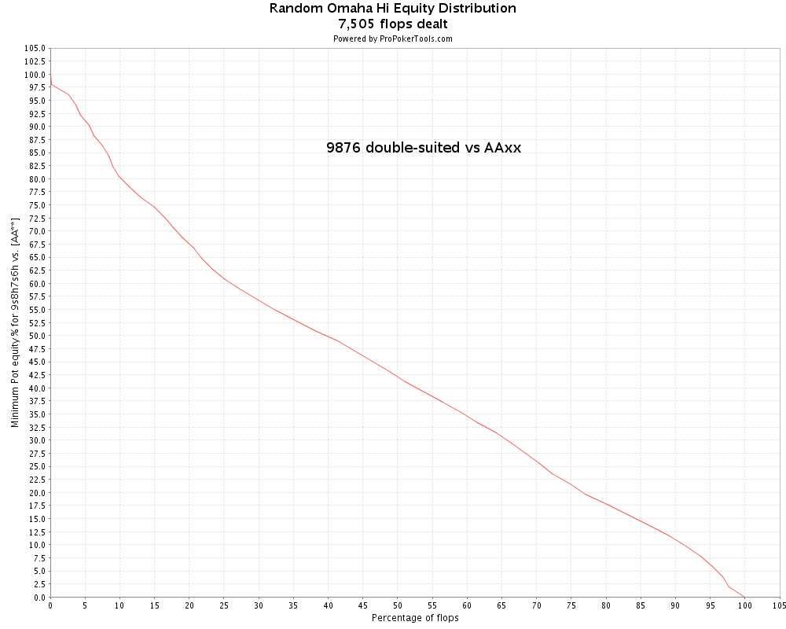

## 第 3 部分：翻牌前打法 II

### 3.1 简介

在第 3 部分中，我们将继续讨论 PLO 翻牌前打法的原则。我最初的计划是让这篇文章成为理论和实践指南的结合，重点关注 3-bet、加注以隔离和跟着溜入。但随着工作的进展，很明显一篇文章的内容太多了。

因此，我决定让第 3 部分成为一篇纯理论文章，我们将深入探讨 PLO 起手牌的可玩性概念，既作为手牌结构的函数，也作为我们在翻牌前投入底池的金额的函数。然后，我们将在第 4 部分中继续讨论更实用的指南，并使用第 3 部分中的理论作为工具。

我们之前已经讨论过 PLO 翻牌前和翻牌后玩法是如何紧密结合在一起的，以及我们的翻牌前玩法的目标是如何为有利可图的翻牌后情况做好准备。将翻牌前玩法和翻牌后玩法联系在一起的一个极其重要的概念是翻牌权益分布。这对我们来说将是一个有用的工具，我们将彻底研究翻牌权益分布，以便在讨论翻牌前玩法（以及稍后的翻牌后玩法）时使用它。

要定量使用翻牌权益分布，我们需要一些数学知识，其中我们需要学习如何使用数值积分从翻牌权益分布曲线中提取有用的数据。但如果这对你来说听起来像天书，不要惊慌！

理解数学细节对于理解正在发生的事情并不是必要的，数学技术已经放在附录中。对数学感兴趣的人可以阅读附录，其他人可以跳过该部分并直接使用数值结果。

### 3.2 翻牌权益分布简介

首先，让我们了解一下翻牌权益分布。我们进入 ProPokerTools.com 并输入 KKxx vs AAxx，如下所示（KKxx 在顶部）。

首先，我们通过单击 “模拟” 以通常的方式计算 KKxx vs AAxx 的权益：

然后我们返回开始并单击 “图表”，如下所示。这将生成 KKxx vs AAxx 的翻牌权益分布曲线：

（本文的其余部分：单击所有图表以在单独的浏览器窗口中以全尺寸打开它们，以便您可以查看所有详细信息。）

那么这张图表告诉我们什么？简而言之，它告诉我们 KKxx 对抗 AAxx 的最低翻牌权益的频率（稍后会详细介绍）。此外，KKxx 对 AAxx 的总权益等于曲线下 0 到 100% 之间的总面积，如下所示：

我们现在将提出一系列问题并找到它们的答案，以说明我们将如何在本文中使用翻牌权益分布。

#### 3.2.1 我们在翻牌时拥有至少 x% 权益的频率是多少？

例如，我们可以问：KKxx 对抗 AAxx 时拥有至少 50% 权益的频率是多少？我们通过查看图表并找到图表中值为 50% 的点来找到答案，如下所示：

我们看到 KKxx 在前 19% 的翻牌中拥有至少 50% 的权益。

#### 3.2.2 前 x% 的翻牌的总权益是多少？

例如，KKxx 对 AAxx 的总权益中有多少可以在 0 到前 19% 的翻牌中找到？这相当于在图表下方找到 0 到前 19% 翻牌之间的区域，如下所示（曲线下方的彩色区域）：

答案是，在前 19% 的翻牌中，我们有 0.149 = 14.9% 的总权益，这大约是我们总权益 30.16% 的一半（我们可以通过识别彩色区域占图表下方总面积的一半来手动验证这一点）。

我们很快就会明白为什么这个数字对我们有用，但首先我们如何计算这个面积？ProPokerTools 不会直接给我们这个数字，要计算它，我们必须求助于一种称为数值积分的数学技术。

我假设数值积分的细节对大多数读者来说有点太技术性了，所以我把这个材料放在附录中。那些想看看如何计算的人可以阅读附录，然后返回这里。剩下的人可以继续讨论最后一个问题：

#### 3.2.3 我们在前 x% 翻牌中的平均权益是多少？

我们已经确定 KKxx 在前 19% 翻牌中对 AAxx 至少有 50% 的权益，而前 19% 的翻牌总共包含 14.9% 的权益。接下来我们想知道的是：我们在前 19% 翻牌中的平均权益是多少？此区域中的所有翻牌都为我们提供至少 50% 的权益，但是当我们击中其中一个时，我们平均有多少权益？

答案很简单：

在前 x% 翻牌中的平均权益等于此区域内的总权益（等于此区域内曲线下方的面积）除以区域宽度（即 x）。

因此，KKxx 与 AAxx 前 19% 的翻牌平均权益等于 0 到前 19% 的翻牌之间的曲线下面积（即 0.149）除以区域宽度（即 0.19 - 0 = 0.19）：

19% 的翻牌（即 0.149）除以区域宽度（即 0.19 - 0 = 0.19）：
平均权益
= 0.149 / 0.190
= 0.784
= 78.4%

下图也对此进行了总结，从现在开始，我们将在所有未来的图表中使用此图上的符号来计算前 x% 的平均权益。

#### 3.2.4 翻牌权益分布数据解释总结

我们从一个例子开始，KKxx vs AAxx，并学习如何从图表中读取我们拥有最低权益的前 x% 翻牌。例如，KKxx 在前 19% 的翻牌中对 AAxx 的权益最低为 50%。
然后我们询问前 x% 翻牌的总权益是多少。我们了解到，这相当于找到 0 到 x% 翻牌之间的翻牌权益分布曲线下的面积。例如，我们发现 KKxx vs AAxx 在前 19% 的翻牌中总权益为 14.9%。

最后，我们询问前 x% 翻牌的平均权益是多少。例如，我们发现 KKxx 在前 19% 的翻牌中对 AAxx 的平均权益为 78.4%。

因此，在前 19% 的翻牌中，KKxx 对 AAxx 的胜率至少为 50%，前 19% 的翻牌中的平均胜率为 78.4%。

在研究各种起手牌的可玩性时，我们将在本文中反复使用这个计算方法。因此，在继续阅读之前，请确保您知道这些数字的含义。在本文的其余部分，我将仅展示这些结果，而不进行详细计算，但我会附上所有数值数据都记录下来的图表，以便您可以根据需要验证计算结果。

### 3.3 模拟对抗 AAxx 的各种起手牌的可玩性

为了练习在战略建模中使用翻牌权益分布数据，我们现在将对 3 种不同类型的 PLO 起手牌对抗 AAxx 的可玩性进行简单研究。我们将使用一个简单的模型，假设我们的对手完全投入 AAxx，并且他会抓住任何机会下注和加注，直到我们全押。

本研究的目的是：

- 了解各种 PLO 起手牌作为底池大小的函数的可玩性
- 了解翻牌权益分布与可玩性之间的关系
- 具体了解如何玩 AAxx 和对抗 AAxx
- 学习如何在战略建模中使用翻牌权益分布

#### 3.3.1 模型描述

我们将研究以下 3 种起手牌对抗 AAxx 的可玩性：

- 9♠ 8♥ 7♠ 6♥（完美双同花连牌）
- A♠ K♥ Q♠ T♦（单同花百老汇包牌）
- K♠ K♥ 7♦ 2♣（KK 带没有价值的边牌）

我们将让这些牌在单次加注底池、3-bet 底池和 4-bet 底池中与 AAxx 相遇，起始筹码为 100 BB。我们的对手将用 AAxx 全力投入，并且他会抓住一切机会下注和加注，直到我们全押。对于每种情况我们将计算从翻牌前将第一枚筹码放入底池那一刻起玩我们手牌的 EV。

**对手的策略**  
对手的策略是抓住一切机会下注和加注他的 AAxx 牌，直到我们全押。

**我们的策略**  
我们在翻牌前将 1、2 或 3 个底池大小的下注放入底池。翻牌后，只要我们有这样做所需的最低权益，我们就会翻牌时跟注到底（commit）。最低必要权益是我们在翻牌时跟注到底的有效底池赔率的函数，在下面每个场景的描述中给出。

请注意，当翻牌前底池较小时，我们的模型不太有意义。我们的策略是等待翻牌好到足以完全投入，然后在翻牌上投入所有筹码（这意味着永远不会有任何转牌或河牌游戏）。严格地说，这种策略只有在翻牌时只剩下 1 或 2 个下注时才有意义，这样我们就处于一个全押或弃牌的场景。但本研究的目的是在简单模型的框架内调查不同类型的起手牌如何对抗 AAxx，我们并不是试图模拟最佳翻牌后游戏。因此，即使我们的模型对于小底池来说并不完全现实，但它足以满足我们的目的。

我们将为每手牌研究 3 种场景：

**单次加注底池**  

- 对手加注底池（3.5 BB），我们跟注。
- 翻牌底池：8.5 BB
- 翻牌筹码：96.5 BB
- 翻牌跟注到底的有效底池赔率：(8.5 + 96.5) : 96.5 = 1.09 : 1
- 翻牌跟注到底的最低权益：1 / (1.09 + 1) = 0.48 = 48%

**3-bet 底池**  

- 我们加注底池（3.5 BB），对手 3-bet 底池（12 BB），我们跟注
- 翻牌底池：25.5 BB
- 翻牌筹码：88 BB
- 翻牌跟注到底的有效底池赔率：(25.5 + 88) : 88 = 1.29 : 1
- 翻牌跟注到底的最低权益：1 / (1.29 + 1) = 0.44 = 44%

**4-bet 底池**  

- 对手加注底池（3.5 BB），我们 3-bet 底池（12 BB），对手 4-bet 底池（37.5 BB），我们跟注
- 翻牌底池：76.5 BB
- 翻牌筹码：62.5 BB
- 翻牌时跟注到底的有效底池赔率：(76.5 + 62.5) : 62.5 = 2.22 : 1
- 翻牌时跟注到底的最低权益：1 / (2.22 + 1) = 0.31 = 31%

**计算 EV**  

我们将使用本文前面讨论翻牌权益分布时介绍的数学技巧。我们首先访问 ProPokerTools.com 来计算每手牌的翻牌权益分布图：

对于每种情况，我们都知道我们需要在翻牌圈投入的最低翻牌权益（我们在上面每种情况的描述中计算了这些），所以我们首先问：在前 x% 的翻牌圈中，我们的权益最低或更高？答案是前 x% 的翻牌圈，我们从图中读取了某个 x 值。

然后我们问：在前 x% 的翻牌圈中，我们手牌的总权益是多少（例如曲线下的面积）？我们使用附录中描述的数值积分来计算这个数字。

最后，我们问：在前 x% 的翻牌圈中，我们的平均权益是多少？我们按照前面描述的方法计算这个数字（前 x% 的翻牌圈的总权益除以 x）。

现在，我们拥有计算我们在场景中发挥的 EV 所需的所有数据。EV 方程为：

EV = (1 - top_x)(-pf_bb) + top_x(av_equity(201.5) - 100)

其中

- top_x = 具有最低权益的翻牌前 x%
- pf_bb = 翻牌前进入底池的大盲注数量
- av_equity = 翻牌前 x% 的平均权益

EV 方程的解释如下：

我们有（1 - top_x）的概率必须在翻牌圈过牌并放弃翻牌前的投资 pf_bb。击中翻牌圈并跟注到底的概率是 top_x，在这种情况下，我们在 201.5 BB 底池（我们的筹码 + 对手的筹码 + 盲注）中拥有平均权益 av_equity，我们总共冒着 100 BB 的风险。

现在开始模拟。对于每种情况，我们都包含一个图表，其中记录了所有必要的数值数据（单击图表可在单独的浏览器窗口中以全尺寸打开），然后我们将这些数字代入 EV 方程并计算该情况的 EV。对于每手牌，我们都会在加注、3-bet 和 4-bet 底池中找到我们的 EV。最后，我们进行总结，根据底池大小得出结论，该手牌如何对抗 AAxx。

#### 3.3.2 9♠ 8♥ 7♠ 6♥ vs AAxx

**单次加注底池**  

top_x = 42%  
pf_bb = 3.5  
av_equity = 68.9%

EV = (1 - 0.42)(-3.5) + 0.42(0.689(201.5) - 100) = +14.28 BB

**3-bet 底池**  

top_x = 48%  
pf_bb = 12  
av_equity = 66.1%

EV = (1 - 0.48)(-12) + 0.48(0.661(201.5) - 100) = +9.66 BB

**4-bet 底池**  

top_x = 65%  
pf_bb = 37.5  
av_equity = 58.5%

EV = (1 - 0.65)(-37.5) + 0.65(0.585(201.5) - 100) = -1.46 BB

**9♠ 8♥ 7♠ 6♥ vs AAxx 的总结**

EV（单次加注底池）：+14.28 BB  
EV（3-bet 底池）：+9.66 BB  
EV（4-bet 底池）：-1.46 BB

在查看 EV 结果之前，我们可以注意到 9♠ 8♥ 7♠ 6♥，翻牌权益分布曲线非常平滑，权益均匀分布在各种翻牌上。

这种曲线表示一手牌经常能很好地击中翻牌，这就是双同花优质顺子牌 9♠ 8♥ 7♠ 6♥ 所做的。我们经常会翻牌一些成手牌 + 抽牌的组合，这些组合足以继续下去。

9♠ 8♥ 7♠ 6♥ 的平滑权益分布意味着这手牌在对抗 AAxx 的大底池中表现良好，只是因为我们经常击中翻牌，足以在翻牌时投入并获得翻牌前投资的回报。

9♠ 8♥ 7♠ 6♥ 在单次加注和 3-bet 底池中表现良好，我们一直到 4-bet 底池，其中 37.5% 的筹码都投入翻牌前，这手牌在我们的模型框架内就无利可图了（即使在这种情况下，我们也几乎不低于盈亏平衡）。

我们将在第 4 部分中回到对抗 AAxx 的优质连牌的话题，但此时我们清楚地看到为什么优质连牌是好的 3-bet 牌。他们在大底池玩得很好，即使我们遇到 AAxx，也不算世界末日。

#### 3.3.3 A♠ K♥ Q♠ T♦ vs AAxx

**单次加注底池**  

top_x = 22%  
pf_bb = 3.5  
av_equity = 68.6%

EV = (1 - 0.22)(-3.5) + 0.22(0.686(201.5) - 100) = +5.67 BB

**3-bet 底池**  

top_x = 26%  
pf_bb = 12  
av_equity = 64.9%

EV = (1 - 0.26)(-12) + 0.26(0.649(201.5) - 100) = -0.90 BB

**4-bet 底池**  

top_x = 43%  
pf_bb = 37.5  
av_equity = 53.7%

EV = (1 - 0.43)(-37.5) + 0.43(0.537(201.5) - 100) = -17.88 BB

**A♠ K♥ Q♠ T♦ vs AAxx 的总结**  

EV（单次加注底池）：+5.67 BB  
EV（3-bet 底池）：-0.90 BB  
EV（4-bet 底池）：-17.88 BB

A♠ K♥ Q♠ T♦ 拥有相当平滑的翻牌权益分布曲线，但相比之下，9♠ 8♥ 7♠ 6♥ 更多的权益 “挤在一起” 在较少的翻牌上（在曲线左侧）。因此，A♠ K♥ Q♠ T♦ 它更像是一手 “非此即彼” 的牌。

这手牌在单次加注底池中对抗 AAxx 时表现相当不错，但当底池变大时，我们会遇到问题。原因是，当我们对抗 AAxx 时，我们实际上是在玩一手只有 3 张可玩牌加上一张 “悬垂牌”（闲牌），因为在这种情况下，我们手中的 A 牌对我们没什么用。

手中的 “悬垂牌” 使我们更难击中翻牌以继续翻牌后游戏，而这在翻牌前底池变大时会产生后果。我们在翻牌前投入底池的筹码越多，击中大量翻牌就越重要，这样我们就不必经常过牌 - 弃牌并失去翻牌前的投入。这个问题在 4-bet 底池中变得非常明显，我们输掉了 18 BB。

由此我们可以得出一个重要的结论：当我们玩 A 高百老汇牌（4 张百老汇牌，以 A 为首）并在翻牌前被 4-bet 时，如果我们怀疑我们面对的是 AAxx，我们必须用 100 BB 筹码弃牌。要跟注，我们需要玩更深的筹码，这样 AAxx 手牌就不能简单地在任何翻牌上全押最后一注底池大小的赌注，然后就此结束。我们的手牌根本无法击中足够多的翻牌，以至于在对手会在任何翻牌上全押的情况下，让我们跟注 AAxx 的 4-bet 是有利可图的。

#### 3.3.4 K♠ K♥ 7♦ 2♣ vs AAxx

**单次加注底池**  

top_x = 15%  
pf_bb = 3.5  
av_equity = 80.2%

EV = (1 - 0.15)(-3.5) + 0.15(0.802(201.5) - 100) = +6.26 BB

**3-bet 底池**  

top_x = 15%  
pf_bb = 12  
av_equity = 80.2%

EV = (1 - 0.15)(-12) + 0.15(0.802(201.5) - 100) = -1.04 BB

**4-bet 底池**  

top_x = 15%  
pf_bb = 37.5  
av_equity = 80.2%

EV = (1 - 0.15)(-37.5) + 0.15(0.802(201.5) - 100) = -22.93 BB

**K♠ K♥ 7♦ 2♣ vs AAxx 的总结**  

EV（单次加注底池）：+6.26 BB  
EV（3-bet 底池）：-1.04 BB  
EV（4-bet 底池）：-22.93 BB

K♠ K♥ 7♦ 2♣ 翻牌权益分布曲线非常 “两极分化”，大部分权益 “挤在一起” 出现在少数翻牌中。这些翻牌大多是我们击中顶三条的翻牌，以及我们击中两对、三条或更好的边牌的翻牌。这有两个直接后果：

- 我们能够跟注全押的翻牌很少。
- 但当我们能够跟注全押时，我们将拥有非常好的权益。

K♠ K♥ 7♦ 2♣ 在小底池中，我们有很好的隐含赔率，所以这是一手好牌。当底池变大时，我们的问题是，我们找不到足够的翻牌来押注，而不得不在大多数翻牌上弃牌会越来越伤害我们（如果你研究一下图表，你会发现，在所有情况下，我们都押注了前 15% 的翻牌，这意味着当我们从加注底池转移到 4-bet 底池时，我们找不到任何可以押注的翻牌）。

在 4-bet 底池中，问题变得非常明显，我们输了 23 BB。我们也在 3-bet 底池中输了，但输得很少（请注意，在我们的模型框架内，我们在对抗 AAxx 的三条牌挖掘方面有极好的隐含赔率，因为当我们翻牌得到顶三条牌时，对手总会给我们支付）。

#### 3.3.5 我们对对抗 AAxx 的起手牌可玩性的模型研究总结

我们从模型研究中得出的主要结论是：

- 9♠ 8♥ 7♠ 6♥ 在单次加注和 3-bet 底池中对抗 AAxx 时表现良好，在 4-bet 底池中略输。
- A♠ K♥ Q♠ T♦ 和 K♠ K♥ 7♦ 2♣ 在单次加注底池中对抗 AAxx 时表现良好，在 3-bet 底池中略输，在 4-bet 底池中大输。

在得出结论时，重要的是要记住我们一直在使用现实模型，而不是现实本身。特别是，重要的是要记住我们从翻牌前第一个筹码投入底池的那一刻开始计算 EV。我们首先假设我们将对抗 AAxx，因此我们的 EV 是当我们知道我们将在单次加注、3-bet 或 4-bet 底池中对抗 AAxx 时选择玩这手牌的 EV。

但实际上，我们在牌局开始时并不知道这一点。例如，如果我们用 9♠ 8♥ 7♠ 6♥ 3-bet 加注，并且我们被 4-bet，这并不一定意味着我们跟注会赔钱，即使我们假设我们总是面对 AAxx。因为现在我们必须从我们跟注 4-bet 的点来估计我们的 EV，假设我们面对 AAxx，而不是从我们将第一个筹码放入底池的点（我们的对手将拥有更广泛的范围）。

然后我们有一个有利可图的跟注，底池中已经有很多筹码，并且这手牌很容易在翻牌后大底池中玩好。我们的模型告诉我们，选择用 9♠ 8♥ 7♠ 6♥ 玩 4-bet 底池对抗 AAxx 是一种略微失败的玩法，但在实践中，我们将从跟注 4-bet 中获利，计划在我们击中足够好时在翻牌上投入。我们将在第 4 部分中更详细地讨论这种情况。

但是，如果我们用 A♠ K♥ Q♠ T♦ 或 K♠ K♥ 7♦ 2♣ 被 4-bet，我们应该用 100 BB 筹码弃牌。在我们的模型中，这些牌是 4-bet 底池中的大输家，如果我们从 4-bet 的点计算 EV，它们也将是输家。

从本模型研究中完成的工作中，我们可以得出结论，当我们参与大型单挑底池时，我们更喜欢那些相当好地击中大量翻牌的牌，而不是那些很难击中少量翻牌的牌。后一类是隐含赔率牌，当我们保持翻牌前底池较小并保留隐含赔率时，它们的发挥会更好。

#### 3.3.6 关于 AAxx 玩法的重要观察

我们将以关于 AAxx 在大底池中玩法的观察来结束我们的模型研究，这个主题非常重要，值得单独写一个章节：

*如果您在单挑底池中玩 100 BB 筹码，并且在底池大小的加注和底池大小的 3-bet 后有机会 4-bet，那么您可以在任何翻牌上盲目地全押剩余筹码，而您的对手无法剥削获利。*

我们模型中的对手使用了这种策略，我们看到在 4-bet 底池中，我们所有的牌都输给了这种策略，即使我们与他玩得很完美（请记住，我们正确的在任何翻牌上都完美地全押了）。

在我们的模型框架内，即使是 9♠ 8♥ 7♠ 6♥ 优质牌在 4-bet 底池中也会输掉，而这是对抗 AAxx 时表现最好的牌之一！（对抗 AAxx 时表现最好的牌是没有缺口的双同花优质连牌）。

因此，我们测试了 “4-bet 并全押任何翻牌” 策略，以对抗 AAxx 可能遇到的最差牌之一，并且拥有完美的玩法，而对手仍然可以用他的 AAxx 盲目全押任何翻牌而不会输钱。

基于这项模型研究，我们可以得出结论：

*如果您可以在单挑的情况下将至少 1/3 的起始筹码放入翻牌前底池（这样您在翻牌时最多剩下 1 个底池大小的下注），您可以在任何翻牌时全押，如果您愿意，您的对手无法剥削获利。*

例如，假设您以 100 BB 开始并在不利位置 A♥ A♦ 7♣ 2♥ 加注底池。您的对手 3-bet 底池，您 4-bet 底池，对手跟注。翻牌 T♠ 9♠ 8♣ 非常可怕且协调一致，您不确定是否要全押。

您无论如何都可以全押。我们已经证明，在任何翻牌上全押最后一次下注都不会对您造成伤害。可能有更好的玩牌方式，但在 4-bet 底池中盲目全押，起始筹码为 100 BB，对手无法剥削获利。

这是大多数 PLO 玩家早期学习的策略（主要是通过听说，然后开始使用它），但现在我们已经使用硬方法来证明为什么这是一个可行的策略，通过这样做，我们将该策略变成了 “我们自己的”。

这对于我们在第 3 部分中所做的建模工作来说是一个重要点。我们的重点是开发使用翻牌权益分布进行有趣理论工作的方法，我们并没有尝试立即进行新的有趣的理论研究。从我们的建模工作中得出的结论为大多数经验丰富的 PLO 玩家所熟知，但重要的是要注意，我们是通过采用一种方法而不是通过猜测、使用直觉或依赖经验得出这些结论的。它的要点是，如果我们有一种可以确认已知结果的方法，那么我们有理由相信，当我们进入未知领域并探索未知领域时，该方法也将是可靠的。因此，本文中的理论工作为我们提供了一套可用于未来工作的工具，我们将带着这些工具继续进行第 4 部分。

### 3.4 总结

在本文中，我们首先对翻牌权益分布曲线进行了深入研究，并学习了如何从中提取有用的数据。

然后，我们进行了建模研究，利用翻牌权益分布得出各种起手牌类型对抗 AAxx 的可玩性结论。因此，我们还得出了一个有用且有趣的结论，即 AAxx 在 4-bet 单挑底池中的玩法。

本文所做的工作纯属理论性的，而且相当 “繁重”，但我希望您觉得它很有趣，并且看到了构建这些理论工具用于战略建模的价值。我们将在第 4 部分中使用 “更轻松” 的方法，我的计划是讨论翻牌前 3-bet 和 4-bet 的具体指导方针，以及隔离加注和跟着溜入。我们在第 3 部分中构建的理论工具将纳入我们的武器库中以供将来使用，我们可能会在第 4 部分中使用其中的一些。
