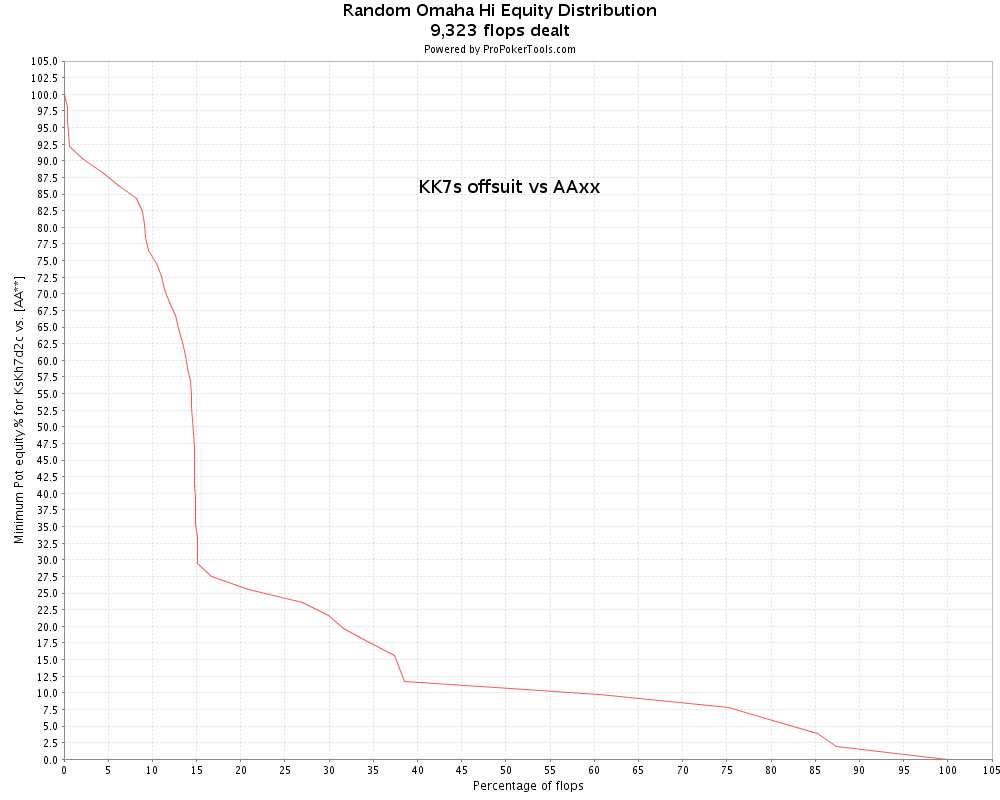

## 第4部分：翻牌前打法 III

### 4.1 简介

在第 4 部分中，我们将继续讨论 PLO 翻牌前打法的原则。现在，我们将深入探讨一些迄今为止几乎没有提到的主题：

- 在有利位置松散地开池加注
- 有利位置在溜入者之后玩投机牌（跟着溜入或加注以隔离？）
- 3-bet

在第 2 部分中，我们首先根据结构将奥马哈起手牌按照 6 个类别的系统进行分类。从这 6 个类别中，我们根据牌力和可玩性构建了另一个分类方案，其中包含 4 个起手牌类别（3 个可玩类别和 1 个不可玩类别）：

- 优质牌
- 投机牌
- 边缘牌
- 垃圾牌

我们还提供了如何在翻牌前玩这 4 种起手牌类别的简单指南。

在第 4 部分中，我们将扩展我们的翻牌前核心策略，在我们的后期位置开池加注范围中加入更多投机牌，并引入 3-bet。我们还将更多地讨论跟着溜入与在跟注者后面的隔离加注。贯穿本次讨论的一个共同主题是翻牌前玩法和翻牌后玩法之间的联系。不同的手牌类型适合不同的翻牌后场景，这对翻牌前策略有很大影响。

这些主题将延续到第 5 部分，翻牌前策略的讨论将在那里结束。然后我们继续讨论翻牌后玩法，所以让我们简要谈谈本系列文章从第 5 部分及以后的发展方向。众所周知，翻牌前玩法和翻牌后玩法在 PLO 中紧密相关，我们翻牌前策略的主要目标是为有利可图的翻牌后场景做好准备。当我们在翻牌前建立大底池时，这种关系尤为重要。当我们卷入 3-bet 或 4-bet 底池时，有必要拥有适合情况的手牌和完善的翻牌后游戏计划。

因此，当文章系列从翻牌前游戏转向翻牌后游戏时，对 3-bet / 4-bet 的讨论是一个自然的过渡点。我们将在本文中讨论 3-bet 的定性指导方针（包括介绍如何对抗来自 AAxx 的 4-bet），并将重点放在翻牌前游戏上。在第 5 部分中，我们将在此理论的基础上，对 3-bet / 对抗 3-bet 和 4-bet / 对抗 4-bet 进行更系统和定量的讨论，这次将重点关注我们设置的翻牌后场景。

这意味着第 4 部分将是一篇核心策略文章，其中包含针对位置松散开牌加注、跟着溜入、隔离加注和 3-bet 的合理定性指导方针，重点关注这些场景的翻牌前部分。第 5 部分将更加笼统和量化，基于范围、权益和翻牌权益分布进行更彻底的分析。在第 5 部分中，我们将开始讨论翻牌后打法，这是迄今为止（有意）未讨论的话题。

在第 5 部分中，我们还将专门讨论在 3-bet 和 4-bet 底池中玩 AAxx 和对抗 AAxx。这些场景经常发生，了解它们的正确策略非常重要。对于这项工作，我们将需要在第 3 部分讨论翻牌权益分布时开发的理论工具。由于我们将使用 3-bet / 4-bet 作为讨论翻牌后打法的过渡点，因此我们将首先讨论大底池翻牌后场景。大底池的翻牌后打法比小底池的打法更自动化（至少应该是这样，当大底池前的翻牌前打法基本合理时），而且大部分大底池的翻牌后决定都将在翻牌时做出。在讨论了 3-bet 和 4-bet 底池后，我们将从第 6 部分开始讨论单次加注和溜入底池的翻牌后打法。

事不宜迟，让我们开始最后一轮翻牌前核心策略。除非另有说明，否则我们将使用 100 BB 筹码进行游戏。

### 4.2 翻牌前有利位置松散开池加注核心策略扩展

在第 2 部分中，我们定义了一种基于价值的翻牌前核心策略，该策略借鉴了 Hwang 在他的著作《底池限注奥马哈扑克：大局策略》中提出的翻牌前策略。翻牌前核心策略基于打出优质牌，尤其是不利位置的牌。因此，对于 6-max 玩法来说，翻牌前策略有些紧，因此让我们通过放松后期位置开牌加注标准来扩展该策略。

首先，让我们简要重复一下翻牌前核心策略。我们首先根据结构对奥马哈起手牌进行分类，并定义了 6 个类别（有关这些类别的详细描述，请参阅第 2 部分）：

1. 大牌和 A 高百老汇包牌
2. 顺子牌
3. A 同花牌
4. 对子 + 牌
5. AA 牌
6. 边缘牌

基于此分类系统，我们定义了 4 个类别（3 个可玩，1 个不可玩）起手牌，并根据强度和可玩性进行排名：

- 优质牌
- 投机牌
- 边缘牌
- 垃圾牌

这 4 个类别的定义如下（请参阅第 2 部分，了解如何玩每个类别中的牌）：

#### 4.2.1 优质牌

- 优质和万能 AAxx 牌
- 高双对
- 4 张牌 T 及更高牌，至少为单同花。
- 4 张牌 9 及更高牌，至少为单同花。
- 优质包牌，至少为单花色。
- 高对带有同花和相连边牌

**示例：**  
A♦ A♣ J♦ J♥  
A♠ A♣ J♠ T♣  
K♠ K♥ Q♠ Q♦  
A♠ Q♥ J♥ T♦  
A♥ K♠ J♥ 9♣  
T♠ 9♠ 8♥ 7♥  
J♥ T♠ 9♥ 7♣  
K♦ Q♠ Q♣ J♦

#### 4.2.2 投机牌

- 投机性 AAxx
- 投机性连牌，至少是单同花
- 中等对子，带同花和相连的边牌
- A 同花带连牌
- A 同花带一对
- A 同花带两张百老汇牌
 
**示例：**  
A♠ A♦ 7♣ 2♥  
T♥ 9♥ 7♠ 5♠  
8♠ 7♥ 6♠ 3♠  
J♣ T♦ 7♣ 6♥  
9♦ 9♠ 8♦ 7♠  
A♠ T♦ 9♠ 8♣  
A♦ Q♦ Q♣ 3♠  
A♥ K♠ J♥ 7♦

#### 4.2.3 边缘牌

- 3 张百老汇牌 + 一张闲牌，至少是单同花
- 高对子带无用边牌
- 不属于先前 “A 同花牌” 类别的弱 A 同花牌
- 不同花色的牌（彩虹牌）

**示例：**  
K♥ Q♦ J♣ 4♥  
K♠ K♣ 7♦ 2♥  
A♥ J♠ 7♥ 6♣  
J♠ T♣ 9♥ 7♦

#### 4.2.4 垃圾牌

所有不属于 “优质牌”、“投机牌” 或 “边缘牌” 的牌（作为起点）都是 “垃圾牌”，因此不可玩。

#### 4.2.5 “垃圾牌” 总是不可玩吗？

重要的是要了解 Hwang 的起手牌类别主要是为在深筹码满员 PLO 游戏中玩成手牌扑克（make-a-hand-poker）而设计的。因此，Hwang 的手牌选择标准偏向于在多人底池中发挥良好的手牌。换句话说，就是相互配合和坚果潜力的手牌。

坚持使用优质手牌可以降低在大底池对抗中处于劣势的可能性，如果我们经常用非坚果手牌与许多对手大打出手，这是一个很大的风险。因此，Hwang 对起手牌结构非常挑剔。例如，他避免玩顶部有缺口的连牌（如 J♦ 9♠ 8♠ 6♥），因为这些手牌会形成许多非坚果顺子。

但在短手 PLO 中，与坚果牌发生冲突的风险会降低，并且具有非坚果牌强度成分的牌会变得更具可玩性。在短手牌游戏中，我们也有更多的机会在有利位置上玩，这也使得更多的牌可玩。因此，Hwang 的 “垃圾牌” 类别包含许多可以在 6-max 游戏中轻松获利的牌，尤其是当我们从后期位置开池加注时。我们还会发现许多适合在有利位置上松散地进行隔离加注和松散地进行 3-bet 的候选牌。

那么让我们来谈谈在有利位置上放松我们的开池加注范围：

#### 4.2.6 有利位置松散的开池加注

看看 3 个可玩的起手牌类别，“优质牌”、“投机牌” 和 “边缘牌”，它们显然提供了坚实的核心起手牌，让我们在大底池建立时经常站在正确的一方。但在 6-max 游戏中，许多底池或多或少是这样的：

UTG 弃牌，MP 弃牌，CO 或按钮开池加注，然后盲注弃牌或跟注。在许多这样的底池中，翻牌前加注者要么在翻牌前获胜，要么在翻牌时持续下注获胜。

每当你发现自己处于可以赢得许多底池而无需摊牌的情况时，很明显你可以对起手牌不那么挑剔。在这些情况下，你计划更多地围绕偷牌权益，而不是围绕摊牌权益。你的牌现在更多地作为备用计划，以防你必须打出一手牌来赢得底池，而不是作为参与的主要原因。因此，当弃牌给你在后位时，你可以玩比我们之前定义的核心策略建议的更广泛的牌，特别是在按钮位置。

以下是一个例子，让你了解我们正在谈论的松散程度：

**示例 4.2.1：按钮位对弱紧盲注玩家开池加注**  
UTG 弃牌，MP 弃牌，CO 弃牌，您手握弱牌 xxxx，正在考虑松散地在按钮位偷牌。据您所知，翻牌前盲注玩家很紧，翻牌后他们大多在不利位置打 “中牌或弃牌” 的打法。

以下是一些可以在此场景中玩的垃圾牌类别的牌：

xxxx = J♠ 7♠ 6♦ 4♣  
xxxx = K♥ Q♠ 6♥ 5♠  
xxxx = T♣ T♠ 7♣ 6♥  
xxxx = Q♦ T♣ 8♥ 3♦

换句话说：*任何具有最低协调性的手牌（最好是同花）都是在弱盲注的情况下进行松散按钮偷牌加注的候选。*

如果盲注特别弱，你可以用比这些更弱的手牌进行开池加注。永远记住，位置和主动权的组合是 PLO 中对抗翻牌后打 “中牌或弃牌” 且很少在翻牌前 3-bet 的对手的极其强大的武器。在这种情况下，强大的 PLO 玩家可能能够在按钮上 100% 地开池加注并从中获利。

**警告：**
如果你想尝试松散的按钮开池加注范围，请记住以下几点：

- 你在按钮上偷牌的松散程度还取决于你在翻牌后打得有多好。
- 如果你在按钮上偷牌非常松散，盲注玩家可能会改变他们的策略。

换句话说，在有利位置上使用非常松散的翻牌前策略需要你具备一定的翻牌后技能，即使盲注很弱。即使盲注让你可以非常松散地偷牌，从长远来看，你最好还是表现出一些节制。你不希望他们改变策略，开始更多地跟注和对你 3-bet。所以，如果你有一手非常垃圾的牌，即使你认为你有有利可图的偷牌机会，也要时不时地让盲注一把。

### 4.3 在溜入者后面有利位置玩投机牌

以下是经常发生的场景：

您有一手非优质但可玩的牌（例如 A♥ K♠ Q♣ 3♥ 来自 “投机牌” 起手牌类别），在一个或多个溜入者后面。您认为仅从牌面来看，这手牌足够强，可以玩，但不一定好到可以加注（而且您不想被 3-bet）。但您还认为加注会增加您的偷牌权益，并使您能够在没有摊牌的情况下赢得更多底池。那么，您是否应该加注以对您后面的玩家施加压力，并增加您在翻牌后偷取底池的机会，即使这手牌不是优质牌？

换句话说，您正在考虑是否应该加注以隔离溜入者，或者是否应该跟着溜入，看到便宜的翻牌，然后从那里开始。在做出这个决定之前需要考虑的重要因素是什么？

我们首先列出您应该考虑的事情，然后举例说明：

#### 4.3.1 隔离加注 / 跟着溜入决策中要考虑的因素

**您的绝对位置**  
一般来说，在 CO 的隔离要多于与 MP 的隔离，在按钮的隔离要多于与 CO 的隔离。您后面的玩家越少，您通过隔离加注获得的偷牌权益就越多，就是这么简单。

**您在翻牌前赢得底池的机会**  
当有人溜入时通常为零，但为了完整起见，我们将其包括在内。如果您对一个溜入者有位置优势，而如果您加注他通常会弃牌，那么这是隔离加注的有利的因素。

**溜入者的数量**  
底池中已经溜入者越多，牌局进入摊牌的可能性就越大，您拥有的偷牌权益就越少。因此，在多人底池中，您用弱牌进行隔离加注的几率应较小。在这种情况下，用很多弱牌进行隔离加注将使您用经常必须在翻牌时弃牌的牌玩很多大底池（因为按照定义，弱牌击中翻牌的力度往往小于强牌）。

**溜入者的翻牌后倾向**  
在面对翻牌后打 “不中就弃牌” 的玩家时，要更多地进行隔离。这可以提高您的偷牌权益，因为这样您就可以通过翻牌 c-bet 赢得大量底池。面对在翻牌后非常 “粘人” 并经常迫使您不止一次诈唬以偷取底池的溜入者时，隔离加注就变得不那么有吸引力了。

**您后面的玩家的倾向**  
例如，如果您在 CO，只有一个溜入者，并且您有位置优势，您应该经常尝试进行隔离。但是，如果在按钮或盲注位置有一个或多个松散的玩家，那么您的隔离加注（按照定义）成功的可能性就会降低。如果您后面的玩家经常跟注，那么您经常会发现自己处于加注的多人底池中，因此您应该将加注范围从弱牌、投机牌转移到优质牌。

**评估您起手牌的类型和质量**  
我们首先假设我们有一手您想玩的投机牌或边缘牌。然后我们讨论了在选择隔离加注和跟着溜入之前需要考虑的最重要的因素。现在，终于到了仔细看看我们的起手牌的时候了。

#### 4.3.2 做隔离加注 / 跟着溜入决策时评估您的起手牌

**我们的牌是对抗许多对手时更好还是对抗少数对手时更好**  
更准确地说，我们是喜欢在溜入底池中对抗许多对手，还是喜欢在加注底池中对抗少数对手？这引出了另一个问题：

**我们的牌是“坚果性”还是“非坚果性”？**  
坚果性有潜力成为坚果牌。它们在多人底池中发挥良好，因为坚果牌可以像击败 1 个对手一样轻松击败 5 个对手。如果您有一手弱但坚果性的牌，在有利位置上溜入底池通常对您来说是一个不错的翻牌前场景。您知道您总是可以跟着溜入。因此，需要回答的问题是隔离加注是否会更好。如果不是，您就跟着溜入，很简单。

如果您手中有一手弱但是有坚果性的牌，很少能击中翻牌，但一旦击中，就会非常厉害，那么跟着溜入通常是在几个溜入者之后的最佳选择。例如，“干” 高对、弱 A 同花和彩虹顺子。有了这些牌，您希望在彩虹牌面上分别击中三条、同花和坚果顺子。这种情况并不常见，但当它发生时，您有一手非常强的牌。

这些类型的牌有：K♠ K♦ 8♣ 3♥、A♥ J♠ 6♥ 2♣ 和 T♥ 9♣ 7♠ 5♦。这些牌需要远程击中，建立一个大的翻牌前底池没有多大意义，因为对我们来说真正好的翻牌很少（但好的翻牌真的很好）。因此，在几个溜入者后面，最好是跟着溜入，并围绕摊牌权益和隐含赔率进行计划，翻牌前较少投入。

非坚果性牌需要多考虑一下，因为在不能隔离加注的时候，我们并不总是有有利可图的替代方案（比如跟着溜入是坚果性牌的替代方案）。因此，我们不是在隔离加注和跟着溜入之间做出选择，而是经常必须在隔离加注、跟着溜入和弃牌之间做出选择。

在这里，我想补充一点，我们翻牌前核心策略中的投机和边缘类别的牌通常足够好，可以在任意数量的溜入者后面跟着溜入。但是，随着我们学会通过在有利位置上放松来越来越多地扩展我们的核心策略，我们将面临更多必须在隔离加注和弃牌之间做出选择的情况，而跟着溜入是我们 3 个选项中最糟糕的。

我们首先假设非坚果牌通常在对抗少数对手时表现更好。因此，如果条件似乎有利于隔离溜入者，我们应该尝试用我们的非坚果牌进行隔离。

但是，如果隔离加注的条件似乎不利于我们，我们必须更多地围绕摊牌权益进行计划，并且我们应该减少用弱牌加注的频率。然后，选择将更多地在跟着溜入和弃牌之间进行。如果我们的牌既弱又非坚果，因此在对抗许多对手时表现不佳，那么我们最好弃牌而不是跟着溜入。

让我们通过查看两个投机和非坚果牌的隔离加注 / 跟着溜入 / 弃牌决策来说明这些原则的作用：

**手牌1：** ♠T 9♥ 8♠ 5♥（包括在我们的核心策略里）  
**手牌2：** Q♠ 9♥ 5♠ 3♥（不包括在我们的核心策略里）

两手牌都是双同花、非优质牌（根据我们的起手牌类别），并且都具有非坚果牌强度成分（但第 1 手牌显然比第 2 手牌更有坚果潜力）。假设您在一个或多个跟入者之后处于按钮位置，并评估您的替代方案。

无论溜入者的数量如何，第 1 手牌（双同花、投机性连牌）显然可以在这里玩。此外，这是一种在加注底池中表现良好的牌。双同花连牌击中很多翻牌（正如我们在第 3 部分中看到的那样），这意味着我们经常会有一手足够好的牌来继续翻牌。具有这种属性的牌正是我们想要在加注底池中玩的那种牌。拥有一手可以相当好地击中很多翻牌的牌可以降低不得不在翻牌后放弃并放弃我们已经在翻牌前投入大量资金的底池的可能性。

这意味着第 1 手牌对于隔离加注来说是一手好牌。加注可以减少对手数量，增加底池，并让我们获得主动权。这对我们来说有几个好处：

1. 减少对手的人数，使得我们在翻牌时更容易获胜。
2. 在翻牌前做大底池，使得我们在击中翻牌后更容易操作剩余的筹码获利。
3. 掌握主动权，经常会导致对手在翻牌时过牌。这让我们可以选择在错过翻牌时进行持续下注和拿免费牌。

对于第 1 手牌，我们并不太关心加注后会发生什么。如果我们减少对手的人数，那就太好了。然后我们可以计划在翻牌后偷取更多的底池。但如果我们有很多溜入者，并且在多人底池中看到翻牌，那也没问题。然后，我们将翻牌后的策略从偷取转移到中牌或放弃策略。低 SPR （筹码 / 底池比率）（更多关于此内容，请参阅未来关于翻牌后玩法的文章）+ 我们的位置，这样当我们与翻牌联系得足够好时，可以相对轻松地玩后面的街来获利。

因此，我们可以在溜入者后面加注 T♠ 9♥ 8♠ 5♥ 和类似的投机牌。当加注不会使对手减少时，加注还有其他好处，而且这种手牌通常在大底池中发挥良好，无论加注后发生什么。请注意，我们并不特别担心被 3-bet，因为我们的手牌在 3-bet 或 4-bet 底池中对抗 AAxx 时表现良好（如第 3 部分所示）。

现在，将手牌 2 与手牌 1 进行比较。Q♠ 9♥ 5♠ 3♥ 这是一手非常弱的手牌，看起来比实际情况好得多（因为有两套同花）。这手牌非常不​​协调，永远不会中到顺子包牌。我们所能期望的最好结果是两头顺子听牌和没有再听牌的顺子。当我们翻牌中同花 / 同花听牌几乎永远不会是坚果（手牌 1 也是如此，但手牌 1 有很大的顺子潜力，而同花潜力仅仅是​​后备）。

因此，用这手垃圾牌在溜入者后面加注并不能让我们在很多翻牌中获利，恰恰相反。当我们击中翻牌时，大多数时候，我们都会拿着一手弱的、不是坚果性的牌，无法在多人底池中下注。另外，请注意，不连接的牌从翻牌中拿免费牌的选择中获益较少（当不连接的牌与翻牌没有很好的联系时，转牌不太可能有太大帮助）。因此，隔离加注几乎完全基于偷取权益，但是由于底池中已经有一个或多个溜入者，我们也没有太多这样的机会。

那么这是否意味着我们应该在第 2 手牌中跟着溜入而不是隔离加注？不。对于翻牌后潜力如此之小的牌，即使这样做很便宜，跟着溜入并自愿参与多人底池也没有多大意义。我们只会让自己陷入许多困难的翻牌后决策，面临负的潜在赔率和头痛。因此，像第 2 手这样的牌应该在翻牌前在平跟底池中弃牌。当条件适合时，你可以用它们在有位置上进行松散的开池加注，但不要主动卷入被迫看翻牌的底池。

**示例 4.3.1**  
$10PLO 6-max

**Preflop**  
UTG（\$10）溜入；您（\$10）在 CO 持有 K♥ K♠ 9♦ 3♠。您后面的玩家未知。您的计划是什么？

隔离加注似乎很明显。您有位置对抗一个溜入者，并且您的手牌在加注底池中表现良好（尽管您必须对 3-bet 弃牌），即使您有多个溜入者。如果您的隔离加注成功（我们假设我们的机会不错），您的计划应该是在对手过牌时通过 c-bet 大多数翻牌来偷取权益。您将在翻牌时获得很多这样的底池。如果您在翻牌前被 3-bet，您应该弃掉您的干对（我们将在第 5 部分讨论对抗 3-bet 时解释原因）。

如果有多个溜入者，你的翻牌后游戏计划应该更多地围绕摊牌权益，而不是偷牌权益（减少持续下注，多玩 “不中就弃牌” 的游戏）。如果有超过 2 个溜入者，你绝对应该在翻牌时主要玩 “不中就弃牌” 的游戏，并且很少在未击中翻牌的情况下将更多筹码投入底池（我们主要在多人底池中希望击中三条）。

**示例 4.3.2**  
$10PLO 6-max

**Preflop**  
UTG（\$10）溜入，MP（\$10）溜入，您（\$10）K♥ K♠ 9♦ 3♠ 位于按钮位置。盲注未知。您的计划是什么？

我们的手牌与示例 4.3.1 相同，但场景不同。在示例 4.3.1 中，我们加注以隔离单个溜入者并假设其具有不错的偷牌权益。这里我们已经有两个溜入者在底池中，因此偷牌权益少了很多。我们有一手弱但坚果潜力的牌，在溜入底池中对抗许多对手时表现良好。

如上例所述，K♥ K♠ 9♦ 3♠ 也适合单次加注，但这并不意味着如果这不会给我们带来任何超过跟注溜入的优势，我们就应该加注。

对于一手弱但有坚果潜力的手牌，无论我们做什么，似乎都会朝着多人底池的方向发展，跟着溜入似乎是最好的选择。我们现在在争夺摊牌权益和隐含赔率。我们主要希望翻牌拿到顶三条，但如果有机会在翻牌后偷牌，我们当然也会诈唬。如果一个盲注玩家加注，我们会跟注并希望拿到顶三条（如前所述，KKxx 手牌对于一次加注来说没问题）。

请注意，对于像这样的 K♥ K♠ 9♦ 3♠ 非此即彼的牌，有时在翻牌时获得免费牌的优势几乎不存在。如果我们在翻牌时没有好牌（例如顶三条），那么转牌不太可能改善我们的牌力。因此，翻牌前加注的优势消失了，与跟着溜入相比，在这种情况下加注不会给我们带来太多额外的好处。

**示例 4.3.3**  
$10PLO 6-max

**Preflop**  
UTG（\$10）溜入；您（\$10）A♣ K♥ Q♣ 6♠ 位于按钮位置。盲注未知。您的计划是什么？

您有一手投机牌，具有良好的高牌强度和坚果同花。您位于按钮位置，在一个溜入者后面，这是隔离加注的好时机。我们希望单挑，但玩加注的多人底池也是可以的，因为我们的牌相当强且有坚果潜力。

由于我们的牌是坚果性，因此显然在溜入的多人底池中也发挥良好。但在这种情况下，隔离加注应该会为我们赢得很多偷牌权益，而激进的替代方案似乎明显比跟着溜入更好。

**示例 4.3.4**  
$10PLO 6-max

**Preflop**  
UTG（\$10）溜入，MP（\$10）溜入，CO（\$10）溜入，您（10）A♥ T♣ 7♣ 4♥ 位于按钮位置。盲注未知。您的计划是什么？

与示例 4.3.3 中一样，您有一手 A 同花，这次您有第二套同花与坚果同花搭配。但拥有额外的非坚果同花并不意味着这是在 3 个溜入者之后加注的手牌。这手牌缺乏协调性，除了 A 同花之外，没有太多优势。换句话说，在这种情况下，我们在多人底池中拥有一手弱但坚果性的手牌。因此，我们跟着溜入并围绕摊牌权益 + 隐含赔率制定计划（并且我们可能会在位置上获得一些翻牌后偷牌机会）。

**示例 4.3.5**  
$10PLO 6-max

**Preflop**  
UTG（\$10）溜入，MP（\$10）溜入，您（\$10）J♥ 9♠ 8♥ 6♠ 位于按钮位置。盲注未知。您的计划是什么？

在这里，我们可以用双同花的连牌加注以隔离，即使它有点粗糙并且顶部有缺口。如前所述，用这种类型的手加注有几个优点：

- 我们用一手非坚果牌来减少对手。
- 当我们很好地击中翻牌时，我们让自己以低 SPR（筹码 / 底池比率）获利。
- 我们给自己更多选择，以便在翻牌时获得一张免费牌，如果我们想要一张。

如果我们有很多跟注者，那很好。然后我们只需在翻牌后少偷牌，多玩 “不中就弃牌” 的游戏。而且跟注 3-bet 也是可以的，因为我们有一手经常击中翻牌的牌。如果我们被 3-bet，我们会跟注，计划在翻牌圈击中足够强的牌时将剩余的筹码全押进去（我们将在第 5 部分详细研究这种情况）

**示例 4.3.6**  
$10PLO 6-max

**Preflop**  
UTG（\$10）溜入，您 K♠ 8♥ 4♠ 2♥ 在按钮位置。盲注未知。您的计划是什么？

这手牌我们弃牌。我们有一手双同花但非常不协调的手牌，基本上是垃圾。双同花垃圾手牌可能看起来很漂亮，但如果没有翻牌前偷牌权益，它们玩起来会很差。如果弃牌给您，您可以考虑松散地在按钮位置偷牌加注，但当我们要被迫看翻牌时，我们不想参与这手牌。

**警告：**  
大多数人会立即发现这不是我们想在溜入者后面加注的那种手牌，但我猜很多人仍然会受到诱惑跟着溜入，因为这手牌是双同花的。但双同花垃圾仍然是垃圾。通过用非坚果性垃圾牌跟着溜入，我们将在翻牌后用非坚果性和弱牌成手牌进行游戏，而且还要在多人底池中进行游戏。换句话说，我们将为那些坚果牌提供隐含赔率。所以要有纪律，翻牌前在溜入者后弃牌，这样可以避免翻牌后的痛苦。

**提示：**  
要了解为什么在用这种牌跟着溜入后，大多数翻牌后情况对我们来说都很困难，请考虑我们最好的翻牌是什么。除了翻牌得到坚果同花（极少发生）或各种葫芦 / 四条组合（我们可以用任何垃圾牌中牌）的罕见例外，没有任何成手牌 / 听牌组合可以在我们持有 K♠ 8♥ 4♠ 2♥ 时给我们带来超强牌力。

请注意，阻止我们前进的并不是对失去翻牌前投资的恐惧，而是当我们（不可避免地）发现自己处于具有负隐含赔率的棘手局面时，对翻牌后损失更多资金的恐惧。

### 4.4 用 3-bet 扩展核心策略

到目前为止，翻牌前核心策略的讨论都围绕着开池加注和在平跟底池中玩牌（用优质牌加注以获得价值、加注以隔离对手以及跟着溜入）。下一步是通过添加 3-bet 策略来扩展我们的核心策略。我们所做的大多数 3-bet 都将基于价值，使用优质牌，我们假设这些牌比加注者的范围具有权益优势。

但有时我们也会用较弱的牌进行投机性 3-bet，我们计划更多地围绕偷牌权益，而不是围绕摊牌权益。在特别有利的位置，我们偶尔也会用非常弱的牌进行诈唬性 3-bet，此时 3-bet 的盈利主要取决于偷牌权益。

我们将依次讨论这 3 种 3-bet 形式，并用示例进行说明。但在我们开始讨论 3-bet 范围之前，让我们简单谈谈在决定是否 3-bet 时需要考虑的事情。

#### 4.4.1 决定是否 3-bet 时要考虑的因素

**位置**  
当您处于有利位置时，您可以 3-bet 更多手牌。有利位置为您提供更多翻牌后选择、更多翻牌后控制权以及更多偷牌机会。这会增加您选择玩的所有手牌的盈利能力，这意味着您可以稍微放松您的起手牌标准。我们的大多数投机性 3-bet 都将在有利位置进行。对于诈唬性 3-bet，我们非常依赖位置（以及我们稍后将讨论的其他有利情况）。

相反，处于不利位置会降低我们玩的所有手牌的盈利能力，我们会通过弃牌更多投机性手牌并将我们的范围更多地偏向优质手牌来进行调整。处于不利位置时，我们大部分情况下只会3-bet优质手牌以获得价值。

**底池中的玩家数量**  
您应该在单挑时比在多人底池中更多地进行 3-bet。您的对手越多，您拥有的偷牌权益就越少，并且您需要围绕摊牌权益进行计划的次数就越多。这意味着您应该将 3-bet 范围偏向优质牌。如果底池中已有多名玩家，我们通常只会进行 3-bet 以获得价值。单挑（并且处于有利位置）时，我们通常会获得进行投机性 3-bet 的机会。

**加注者的范围**  
作为起点，我们会对谨慎加注者进行更谨慎的 3-bet。但如果他在翻牌后也同样谨慎且可预测，并且我们处于有利位置，我们可能会破例。然后，我们可能会用投机性牌对他进行 3-bet 以隔离他，计划在翻牌后偷取大量底池。面对松散的加注者，我们也可以进行更多投机性 3-bet，尤其是如果他在 3-bet 后玩得较弱时。

**加注者的技能**  
面对优秀玩家，我们投机性 3-bet 的次数会减少，因为优秀玩家能更好地抵御此类攻击。相反，面对弱手时我们会更多地 3-bet，尤其是在有利位置时。

**您的牌**  
其他因素越有利，我们的牌就越不重要。例如，面对一个松散的加注者，他不会反击频繁的 3-bet，我们通常会投机性 3-bet。但如果我们在加注后处于盲注并且有人跟注，我们大部分情况下只会 3-bet 我们最优质的牌。

#### 4.4.2 价值 3-bet

首先，让我们就有关翻牌前建立大底池的最重要的规则达成一致：

*不要在翻牌后经常弃牌的情况下建立大底池*  

换句话说，当您选择建立一个大底池时，以下之一必须为真：

1. 您期望经常击中翻牌获得一手好牌以继续玩下去
2. 您期望经常在翻牌后偷走底池

当我们价值 3-bet 时，我们关注这些要点中的第一点。价值 3-bet 意味着用优质、协调的牌进行 3-bet，这些牌经常与翻牌相连。当它们与翻牌相连时，它们往往会形成坚果和主导手牌，从而可以从对手的非坚果和被主导手牌中获取价值（例如，组成坚果同花，通过击败较低的同花获得回报，或者组成坚果顺子并且再次听牌，或者免费听牌坚果顺子）。从第 2 部分中，我们知道起手牌强度的组成部分是：

1. 高牌强度
2. 连通性
3. 同花性

因此，当我们价值 3-bet 时，我们希望持有同花且相连的高牌手牌。这些牌大部分都属于第 2 部分定义的 “优质牌” 起手牌类别。价值 3-bet 的可靠核心策略范围是：

- 优质 AAxx，至少是单同花，有一对、2 张百老汇牌或连张
- 优质百老汇包牌，至少是单同花，最好是 A 同花。
- 优质 KKxx、QQxx、JJxx，至少是单同花，有连牌边牌或另一对高牌。

换句话说，像这样的牌：

A♦ A♠ Q♦ Q♣  
A♣ A♥ K♣ J♥  
A♥ A♦ T♠ 9♦  
A♣ Q♠ J♠ T♥  
K♠ Q♥ J♠ T♥  
K♦ Q♦ Q♣ J♠  
Q♥ J♣ J♥ 9♣  
K♠ K♦ Q♠ Q♥

请注意，我们至少需要一套同花。对于没有一对的百老汇牌，我们更喜欢有 A 的牌，并且我们更喜欢 A 同花的牌（坚果同花的潜力非常大）。

下面是一系列示例，我们考虑用优质牌进行 3-bet 以获得价值，包括我们选择不进行 3-bet 的场景。在所有示例中，我们首先通过考虑前面讨论的各种因素（我们的位置、对手的数量等）来评估情况，然后根据情况和我们的牌做出决定。

**示例 4.4.1**  
\$10PLO 6-max

**Preflop**  
CO（\$10）加注到 \$0.35，您 Q♦ Q♥ J♦ T♥ 在按钮位置。CO 是一个松散的加注者，VP\$IP = 48 和 PFR% = 29。小盲注（\$10）是未知数，而 BB（\$10）是一个扎实的 TAG。您的计划是什么？

这是一个 3-bet 的好场景，部分是为了价值，部分是为了隔离松散的加注者。您在按钮对松散的加注者有位置位置优势，并且您有一手双同花的优质牌。您预计盲注大多数时候都会对 3-bet 弃牌，因此 3-bet 将让您准备好在有利位置的情况下与松散的加注者进行单挑。

此时 3-bet 既是为了价值（你的牌应该能很好地对抗加注者的范围和盲注的随机牌），也是为了增加你的偷牌权益（对抗一个范围松散的玩家，你希望位置和进攻的结合能为你赢得很多底池）。摊牌权益和偷牌权益都对你有利，这是一个 3-bet 的好时机。

**示例 4.4.2**  
\$10PLO 6-max

**Preflop**  
UTG（\$10）加注到 \$0.35，CO（\$10）跟注，按钮（\$10）跟注，SB（\$10）跟注，您（\$10）Q♦ Q♥ J♦ T♥ 处于大盲注位置。UTG是 26 / 17 TAG，其余玩家是未知玩家和松散被动玩家的混合体。您的计划是什么？

我们拥有与示例 4.4.1 相同的手牌，但情况不同。在这里，您在大底池中处于不利位置，并且有 4 个对手。此外，即使 QQJT 双花色是一手好牌，它也不一定是您想在不利位置 3-bet 对抗多人的牌。

您有一个高牌且协调对子的双同花牌，但这手牌的坚果潜力低于优质 AAxx 和优质 KKxx。拥有两套同花很好，但您没有坚果同花。而且，当您用 QQ 翻牌拿到三条时，有时它不会是顶三条。在单挑底池中，尤其是在有利位置上，这不是什么大问题。但在翻牌后尤其是在面对许多对手的情况下玩非坚果牌和听牌要困难得多。

通过在这里 3-bet，您将在大底池中面临艰难的翻牌后决策（而棘手的决策正是您在玩大底池时不想要的）。面临艰难的翻牌后决策意味着你给了对手在翻牌后击败你的机会。这在大底池中是一个严重的问题。例如，如果你翻牌上有超对，那么持续下注是否正确？如果你翻牌上没有超对或强听牌，那么放弃所有翻牌是否正确？

这两个问题的答案都是 “否”，但如果你处于不利位置，你通常很难判断翻牌什么时候应该继续，什么时候应该放弃。有利位置时，你可以在行动前看到对手的行动，但如果你处于不利位置，你不得不猜测更多。当你在大底池中猜测时，你不可避免地会犯下代价高昂的错误。

你的位置和对手的数量是这里最重要的因素，但我们也应该注意到，加注来自前面位置的一名紧凶型玩家。这意味着他的范围可能偏向于优质牌。这与示例 4.4.1 中我们面对的是一名松散的加注者不同。当然，任何一个冷跟注者也可能有一手优质牌。

我们得出结论，在这种情况下，跟注和围绕摊牌权益和隐含赔率制定计划更有意义。在这种情况下，您只应使用坚果、超优质牌进行价值 3-bet（请记住：坚果在不利位置时变得更加重要）。如果您选择仅使用您最好的 AAxx 牌（好的边牌并且至少是单同花的）进行 3-bet，那么这样做没有错。

在这种情况下，如果拥有一个非常紧的 3-bet 范围，显然会泄露很多关于我们手牌的信息。但正如我们将在第 5 部分中看到的，这对我们的对手来说并不一定是容易剥削利用的。原因是优质手牌（按照定义）经常在翻牌中击中足够多的牌，从而在大底池中获利（我们可以使用翻牌权益分布来展示这一点，如第 3 部分所述）。

最后要说的是：这个例子说明了一条一般原则，即我们应该谨慎使用对子牌（最大和最优质 / 最坚果的对子除外）进行大额加注，尤其是在不利位置和面对许多对手的情况下。

这条经验法则的定性理由是对子牌比非对子牌击中更少的翻牌。它们在对抗 AAxx 时也打得不好，并且被 4-bet 也很成问题。因此，在类似本例的情形下，我们最好的选择往往是跟注，保留隐含赔率，看翻牌并从那里继续。

**示例 4.4.3**  
\$10PLO 6-max

**Preflop**  
按钮（\$10）加注到 \$0.35，SB 弃牌，您 A♠ K♥ J♥ T♠（\$10）处于大盲注位置。按钮未知。您的计划是什么？

这是使用优质双同花百老汇牌进行标准价值 3-bet。您位置不好，但您的牌应该在 3-bet 底池中对抗按钮（假设）松散范围时表现良好。

**示例 4.4.4**  
$10PLO 6-max

**Preflop**  
CO（\$10）加注到 \$0.35，按钮（\$10）跟注，SB（\$10）跟注，您 A♣ A♦ J♣ T♥ 处于大盲注位置。所有对手都是未知的。您的计划是什么？

标准的使用优质牌 AAxx 价值 3-bet。此场景类似于示例 4.4.2 位置不佳，在加注的多人底池中持有优质对子），但这里我们在翻牌前拥有坚果（AA），并且我们面对对手中拥有巨大的权益优势并且我们的牌会击中很多翻牌，足以翻牌后继续。此外，我们欢迎 4-bet，因为这将允许我们 5-bet 全押并实现我们所有的翻牌前权益。

我们预计会有几位跟注者，但对于拥有优质牌 AAxx 的我们来说这不是问题。我们会击中很多翻牌，足以进行持续下注，并在翻牌后获利地下注剩余的筹码。但我们当然不会自动承诺在翻牌后跟注到底。如果有很多跟注者，我们会考虑翻牌结构和对手数量，然后选择一个翻牌后计划，但这个决定是稍后做出的。

翻牌前的 3-bet 是自动的，完全基于价值。

**示例 4.4.5**  
\$10PLO 6-max

**Preflop**  
UTG（\$10）加注到 \$0.35，MP（\$10）跟注，按钮（\$10）跟注，您 A♣ A♥ 8♣ 2♥ 处于大盲注位置。对手是混合着紧 - 凶和松 - 被动玩家的。您的计划是什么？

您有一手双同花 AAxx 牌，情况类似于示例 4.4.2和示例 4.4.4。在示例 4.4.2 中，我们选择用优质但非坚果对子跟注。在示例 4.4.4 中，我们用优质牌 AAxx 价值 3-bet。那么我们在这里的决定是什么？

这手牌介于示例 4.4.2 和示例 4.4.4 之间。我们有翻牌前坚果牌和两套坚果同色牌，这支持 3-bet。但我们的边牌完全不协调，除了同花之外，我们没有任何额外的优势。

这使得 A♣ A♥ 8♣ 2♥ 价值 3-bet 不太合适，因为当我们寻找翻牌来获利时，缺乏协调会给我们带来问题（记住：当你根据价值建立一个大的翻牌前底池时，拥有一手经常击中翻牌并足以继续的牌很重要）。

因此，即使拥有两张坚果同花使这手牌成为一手好的 AAxx 牌，缺乏协调也足以让它无法进入优质类别。因此，在这种情况下，最好避免 3-bet，因为在不利面对 3 个对手位置。

请注意，如果你在按钮位置与一个加注者单挑，这将是一个标准的 3-bet，以获得价值 / 隔离。在这种情况下，我们将放弃严格的价值 3-bet 核心策略，而更多地转向投机性 3-bet（尽管 A♣ A♥ 8♣ 2♥ 这是一手接近优质牌）。

请记住，核心策略的目的是提供可靠的指导方针，旨在让您远离麻烦。你会经常发现自己处于核心策略未详细讨论的 “灰色地带”。在这些情况下，你必须依靠经验和现场评估。玩得越多，就越容易做到这一点。

**示例 4.4.6**  
\$10PLO 6-max

**Preflop**  
UTG（\$10）加注到 \$0.35，MP（\$10）跟注，您（\$10）A♠ A♥ 8♣ 3♠ 位于按钮位置。所有对手都是未知的。您的计划是什么？

这不是 3-bet 的好时机。底池是多人的，而您有一手垃圾牌 AAxx ，很少能改进到值得在翻牌后继续对抗多个对手的牌。我们最好的选择是跟注，计划在翻牌后主要玩 “不中就弃牌” 的游戏（我们主要希望翻牌获得顶三条）。请注意，如果面对盲注的 3-bet，我们将有机会 4-bet 并投入大部分筹码。

在这里，我们拥有质量如此低的 AAxx，因此我们选择像玩干燥 KKxx 一样玩它们。我们跟注以获得顶三条，有良好的隐含赔率，仅此而已。此外，我们有时会得到 4-bet 的机会。

我们在第 2 部分讨论了在不利位置的情况下 3-bet 垃圾牌 AAxx 的弊端（参见第 2.7.6 节和示例 2.8.3）。在这个例子中我们有位置，但同样的逻辑适用。

**示例 4.4.7**  
\$10PLO 6-max

**Preflop**  
UTG（\$10）加注到 \$0.35，MP（\$10）跟注，您（\$10）A♠ K♥ K♠ J♥ 在按钮位置。UTG 是一个超紧加注者 VP\$IP = 15 和 PFR% = 2.1。您已经看到他在翻牌前加注后两次进入摊牌，而且两次他都有 AAxx。其他玩家未知。您的计划是什么？

您应该预期 UTG 的加注范围会严重偏向 AAxx，并且他的非 AAXX 加注手牌的质量与我们的牌相当。如果是这样的话，我们在这里没有太多的权益优势，3-bet 通常会被 4-bet。这是我们想要避免的，因为我们的牌对抗 AAxx 的 4-bet 时表现不佳（根据 ProPokerTools 的计算，我们对抗随机 AAxx 牌的胜率为 34%）。

在这些假设下，似乎最好是在有利位置跟注，保留隐含赔率，并寻找有利可图的翻牌后情景。

**示例 4.4.8**  
\$10PLO 6-max

**Preflop**

UTG（\$10）加注到 \$0.35，MP（\$10）跟注，您（\$10）A♠ K♥ K♠ J♥ 位于按钮位置。UTG 是松激进的 VP\$IP = 42 和 PFR% = 28。MP 是松被动的。您的计划是什么？

我们的起手牌与示例 4.4.7 相同，但这次加注者非常松激进，我们可以假设他的范围很广。我们有一手优质、双同花 KKxx 手牌，对抗两个弱范围（加注者和跟注者），这似乎是价值 3-bet（以及隔离）的好时机。

#### 4.4.3 投机 3-bet

投机 3-bet 背后的原理很简单：

*在我们拥有良好偷牌权益的情况下，我们对摊牌权益的依赖性较小。这使我们能够放宽对起手牌的要求。*

例如，假设 CO 加注后您在处于按钮位置。您已经收集了 CO 的倾向，并且您知道他从这个位置加注的范围很广。您还知道，他之前在不利位置上被玩家 3-bet 后，他将采取谨慎且可预测的风格：

- 翻牌后如果他的 4-bet 被跟注，他将全押 AAxx。
- 其余牌他在翻牌上玩 “不中就弃牌” 打法。

这种可预测的策略可以通过在有利位置上 3-bet 来剥削。这迫使他放弃很多底池，无论是翻牌前还是翻牌时，而增加的偷牌权益将使用各种优质和投机 3-bet 对他有利可图。那么，我们应该包括哪些投机牌呢？我们从以下牌开始：

- 好的同花包牌
- A 同花加上好的包牌边牌

换句话说，像这样的牌：

Q♥ J♠ T♥ 9♣  
9♣ 8♥ 7♣ 6♥  
Q♥ T♠ 9♥ 8♠  
J♠ 9♠ 8♥ 7♣  
T♦ 8♦ 7♠ 5♠

A♣ T♣ 9♠ 8♥  
A♥ 9♣ 8♥ 7♣  
A♠ J♠ 9♥ 8♥  
A♦ 8♠ 7♦ 6♥

对于这两种类型的牌，我们都喜欢连牌并且缺口很少。如果有缺口，我们希望它们在底部。我们还喜欢双同花而不是单同花牌，高连牌而不是低连牌。

我们最想看到的牌是像 Q♥ J♠ T♥ 9♠ 和 A♠ J♣ T♥ 8♣ 这样的牌。我们避开只有一种同花的最低和最粗糙的组合，例如 7♥ 5♥ 4♣ 3♦ 和 A♠ 8♠ 5♦ 4♥。

作为起点，我们只在我们认为这将带来良好偷牌权益时才在有利位置上进行投机 3-bet。投机 3-bet 的完美场景是在按钮位置，在一个松散的加注者后面，他在 3-bet 后打得弱紧且可预测。如果他只 4-bet AAxx 牌，这是完美的（这给了我们很多关于他的牌的信息，并且很容易防守）。如果他在翻牌前也弃牌很多或在翻牌后打 “不中就放弃” 的打法，那就更好了。

以下是一个投机 3-bet 的例子，后面跟着一个由于情况不利而选择不 3-bet 的例子：

**示例 4.4.9**  
\$10PLO 6-max

**Preflop**  
CO（\$10）加注到 \$0.35，您 T♠ 9♥ 8♠ 6♥ 在按钮位置。CO 未知，两个盲注都是紧手的激进玩家，在不利位置玩得很紧。您的计划是什么？

我们对 CO 的范围和倾向一无所知，但还有其他几个因素有利于投机 3-bet。尽早测试对手通常也是一个好主意。总而言之，这似乎是用双同花的优质牌投机 3-bet 的好时机。

如果盲注弃牌并且 CO 跟注，我们的计划应该是在大多数翻牌上持续下注。翻牌前有几个跟注者，我们将减少持续下注，但我们仍计划在有利的翻牌结构上进行一些翻牌后偷牌。

如果我们被 4-bet，我们跟注。我们主要面对的是 AAxx，我们有一手完美的牌（双同花连牌）来防御来自 AAxx 的4-bet。如果我们在 4-bet 底池中看到翻牌单挑，我们的计划是在翻牌上 “挑选好牌”。这意味着当我们在翻牌中击中足够多的牌时，我们会跟注（预期的）持续下注。由于我们预计对手几乎每次都会向我们展示 AAxx，因此估计我们的翻牌权益相对容易。剩下的就是将我们的权益与我们获得的底池赔率进行比较，然后我们跟注或弃牌。

**示例 4.4.10**  
\$10PLO 6-max

**Preflop**  
UTG（\$10）加注到 \$0.35，MP（\$10）跟注，您 A♣ 9♠ 8♣ 7♥ 在按钮位置。UTG 是一个扎实的 TAG，只在 UTG 处加注优质牌。MP 也是一个 TAG，小盲注未知，大盲注是松散被动的。您的计划是什么？

我们有一手较好的投机牌，所以我们显然不会弃牌。在这里，我们可能面对两个坚实的范围（TAG UTG 加注加上 TAG MP 冷跟注），而且我们在大盲注位置有一个松散的玩家。大多数时候，3-bet 会让我们用投机牌玩一个大的多人底池，因为我们预计会被几个玩家跟注。这对我们没什么帮助，因为：

- 我们在翻牌前可能没有偷牌权益
- 我们在翻牌后可能几乎没有偷牌权益
- 面对我们对抗的范围我们可能没有权益优势
- 有人有 AAxx 的可能性很大

因为我们可能无法偷下这个底池，而且我们有一手好牌但不是非常好，所以跟注似乎是最好的选择。我们的计划是，在加注的多人底池中，用一手坚果性的投机牌和良好的隐含赔率便宜地看翻牌。我们可能也会在翻牌后得到一些偷牌机会。请注意，当我们不在翻牌前 3-bet 时，对手在翻牌后过牌更有可能表明弱牌（ 3-bet 通常会诱使我们的对手自动在翻牌时过牌给 3-bet 的人）。

#### 4.4.4 诈唬 3-bet

诈唬 3-bet 只是在 3-bet 能给我们带来非常好的偷牌权益的情况下，将投机 3-bet 推向极限。如果条件非常适合，仅凭偷牌权益 3-bet 就可能有利可图，因此我们不需要好牌。但我们不应该完全越界，3-bet 垃圾牌。我们可以等待一些类似于可玩的牌。

这种 3-bet 应该非常谨慎，并且只在非常有利的情况下进行。具体来说，我们不应该在以下情况下诈唬 3-bet：

- 我们的位置不利
- 有多个玩家进入底池
- 我们预计会有多个跟注者

我们还希望加注者较弱、可预测且易于对抗，并且我们更喜欢按钮位置。在这种情况下，3-bet 应该可以让我们看到很多单挑翻牌，位置很好，并且翻牌后有很好的偷牌权益的机会。

以下是诈唬性 3-bet 的示例：

**示例 4.4.11**  
\$10PLO 6-max

**Preflop**  
CO（\$10）加注到 \$0.35，您 Q♠ 9♥ 6♠ 5♣ 在按钮位置。您的计划是什么？

在没有更多信息的情况下，答案是大声的“弃牌！”，但当满足以下几个条件时，您可以考虑诈唬 3-bet：

- 加注者范围很广
- 对手在 3-bet 后打得紧且可预测
- 都是只 4-bet AAxx
- 都是在位置不利的情况下跟注 3-bet 后，他在翻牌后打 “不中就弃牌”。
- 盲注不是特别松
- 您有扎实的牌桌形象

这种 3-bet 背后的主要想法是要么在翻牌前赢得底池，要么在翻牌时用 c-bet 偷走它。我们的牌有一点后背的牌力。由于我们不会 3-bet 纯垃圾牌（我们有一套同花和一些协调性），因此我们会不时地翻牌出一些不错的牌。这也能让我们赢得一些对手不让我们偷走的底池。

如果我们可以单挑面对对手 4-bet，我们必须估计我们的牌是否有足够的潜力来跟注获利。如果我们选择跟注，我们假设 CO 只用 AAxx 4-bet。如果是这样，我们可以用各种投机性的、不成对的牌来跟注获利，计划 “挑选” 翻牌。为此，我们需要一手具有最低协调性的牌，最好是同花的牌，这里我们两者都有。

我们不会在这里做出跟注 / 弃牌的决策，但我们会把这个例子带到第 5 部分并在那里找到答案。我们将使用 AAxx 的翻牌权益分布来决定跟注 4-bet，然后在我们有足够权益对抗 AAxx 的翻牌上全押是否有利可图。

**警告：**  
只有在情况非常有利时才应该进行诈唬 3-bet。谨慎使用，诈唬 3-bet 将使你在后面位置更多获利，但更难被读懂，也更难对付。

#### 4.4.5 当你 3-bet 被 4-bet

我们对抗 4-bet 的核心策略很简单：

*当你被 4-bet 时，假设你面对的是 AAxx 并相应地进行游戏*  

很少遇到默认用 100 BB 筹码对非 AAxx 牌进行 4-bet 的玩家。优秀的玩家会通过放松他们的 4-bet 范围来适应松散的 3-bet，但不会将其作为对抗 100 BB 筹码未知玩家的标准玩法。如果认为 4-bet 者每次都有 AAxx 是一个错误，那么这是一个小错误。

那么问题是：我们如何用 100 BB 筹码对抗来自 AAxx 的 4-bet？

在本文中，我们将定性地回答这个问题，在第 5 部分中，我们将深入挖掘并从数学上研究这种情况。用简单的核心策略术语来说：在拥有 100 BB 筹码的情况下，我们针对 AAxx 的 4-bet 的防御措施包括两个部分：

1. 我们 5-bet AAxx 全押。
2. 我们用协调性足够好的牌跟注 4-bet，然后 “挑选” 翻牌。

第一部分很明显；第二部分则比较模糊。但主要思想是，对于许多投机性强的牌来说，跟注翻牌前的 4-bet 是有利可图的，计划在我们有足够权益（与翻牌圈的底池赔率相比）时跟注翻牌圈的 c-bet 全押。为了使这一策略奏效，我们希望 4-bet 的对手几乎总是持有 AAxx，因为这样可以很容易地准确估计我们在翻牌圈的权益。

从第 3 部分中，我们知道，像 K♠ K♥ 7♦ 2♣ 这种非常不协调的牌在 3-bet 和 4-bet 底池中会遇到很大的问题，原因是它只有很少的翻牌有很好的赢率。干对子（没有帮助的边牌）在对抗 AAxx 时，翻牌赢率很高的范围很窄（当我们翻出三条、三条或两对时），但除了这些神奇的翻牌之外，没有太多的赢率可寻。

因此，当我们用这种牌参与 4-bet 底池时，我们几乎总是不得不对翻牌 c-bet 弃牌。这意味着我们翻牌前的投资没有得到很好的回报，我们只是通过跟注 4-bet 捐献筹码。

下面的翻牌赢率分布图说明了 K♠ K♥ 7♦ 2♣ 对抗 AAxx 在大底池中的问题。我们的大部分翻牌赢率都 “挤在一起” 在少数翻牌上（翻牌前 15% 左右）。除了这 15% 的翻牌，我们的权益始终很差：

与上面翻牌权益分布范围相反的例子，我们有优质、双花色的牌，例如 9♠ 8♥ 7♠ 6♥。这些牌通常会在翻牌中形成不错的成手牌 + 听牌组合，让我们能够有利可图地跟注全押。从下面的翻牌权益分布图中，我们可以看到我们的权益现在分布均匀，而不是集中在少数前 x% 的翻牌上：

 

这意味着像这样 9♠ 8♥ 7♠ 6♥ 的牌通常击中翻牌，成为好牌足以在翻牌时获利。当我们跟注 4-bet 的对手预期翻牌 c-bet 时，我们获得的赔率略高于 2 : 1，因此我们需要在翻牌时获得略低于 33% 的权益。上图告诉我们，我们在各种翻牌上都有 33% 或更好的牌，大约占所有翻牌的前 60%。

我们不会在这里继续这个理论讨论，而是坚持定性指导方针。但是，我们将使用上面的两个翻牌权益分布来说明一般原则：

*当我们通过跟注然后 “挑选” 翻牌来防御 AAxx 的 4-bet 时，我们希望有一手同花且协调的手牌，经常击中翻牌获得不错的权益。*

以下是一个例子：

**示例 4.4.12**  
$10PLO 6-max

**Preflop**  
CO（\$10）加注到 \$0.35，您（\$10）T♠ 8♦ 7♣ 6♠ 在按钮位置。您已经读到 CO 是一个尊重 3-bet 的松散加注者，并且在被 3-bet 后，他倾向于在不利位置上打的很紧。您在按钮位置和一手非常适合投机性 3-bet 的手牌，因此您 3-bet 底池到 \$1.20。CO 立即 4-bet 底池到 \$3.75。您的计划是什么？

哎呀！我们不得不假设我们在这里与 AAxx 发生冲突。但一切还不算完，因为我们有一手较好的牌可以 “破解” （crack 瓦解、破解、打败）AAxx。我们的翻牌前权益为 41.54%（ProPokerTools 计算），我们的牌对抗 AAxx 的翻牌权益分布非常平滑，如下所示：

 

翻牌时底池为 \$7.65，剩余筹码为 \$6.25。当 CO 在翻牌时将其余筹码推入时，我们得到的底池赔率是 (7.65 + 6.25) : 6.25 = 2.22 : 1。因此，我们需要 1 / (2.22 + 1) = 0.31 = 31% 的权益才能进行有利可图的跟注。

从上图我们可以看出，在超过 60% 的翻牌中，我们将拥有至少 31% 的权益。因此，我们将找到足够的权益来跟注（并获得翻牌前投资的回报），而不是弃牌。这假设我们能够在翻牌时快速准确地估计出路和权益。但这很容易学会。

以下是我们可以有利可图地跟注的翻牌示例：

**Flop：** K♠ 6♦ 4♥（\$7.65）  
CO（\$6.25）全押。我们 T♠ 8♦ 7♣ 6♠ 在这个翻牌上有足够的胜率（至少31%）吗？

让我们先数一下出路：

- 对子 + 3个踢脚牌（2 + 9 = 11 个补牌）
- 卡顺（4 个补牌）
- 后门同花（1 个补牌）

卡顺和后门同花听牌给了我们 5 个相当干净的补牌，而且当我们改进为三条时，我们也经常会赢。但我们对两对的补牌需要稍微打折一下。每当我们在转牌上改进为两对时，CO 就有 8个补牌（2 个 A、3 个 K、3 个 4）来获得顶三条或更好的两对。8 个补牌相当于大约 1/5 的机会。所以我们将两对出路从 9 打折为 9(4 / 5) = 7.2。

我们将这个数字四舍五入为 7。此外，由于 CO 可能拥有比这更多的再听牌机会（我们不知道他的边牌），我们再减去一张补牌，最终得到 6。

因此我们有：

- 对子 + 3 踢脚牌（2 + 6 = 8 张补牌）
- 卡顺听牌（4 张补牌）
- 后门同花听牌（1 张补牌）

这让我们对 AAxx 总共拥有 13 张补牌。这相当于 3 x 13 + 9 = 48% 的翻牌权益（记住：我们对 0 - 9 张补牌使用 4x 规则，对 10 张或更多出牌使用 3x + 9 规则）。ProPokerTools 计算告诉我们我们的实际权益是 47%，所以我们的估计相当不错。

这意味着我们在翻牌时有一个明确的 “挑选” 跟注，具有良好的权益。跟注后，我们的工作就完成了，我们会接受结果。

**关于跟注 AAxx 的4-bet的盈利能力**  
我们还在第 3 部分讨论了在 4-bet 底池中对抗 AAxx。在那里，我们使用了一个模型，其中我们从一开始就知道对手的手牌，并且我们选择与他进行单次加注、3-bet 和 4-bet，即使我们知道他有 AAxx。

毫不奇怪，我们发现即使是最好的 “AA破解” 手牌（双同花连牌）也无法在 4-bet 底池中与 100 BB 筹码的 AAxx 进行有利可图的比赛。因此，我们得出结论，即使跟注者在翻牌圈玩得完美，用 100 BB 筹码对 AAxx 进行4-bet 也是无法被剥削利用的。但这并不意味着跟注 4-bet 是无利可图的！

实际上，当我们 3-bet 他时，我们永远不知道对手有 AAxx（如果我们知道，我们可能不会 3-bet）。因此，当底池已经变大时，有关他的手牌的信息传到我们手中，我们投入的资金不再属于我们（它属于底池）。

这意味着，即使我们从一开始就知道我们面对的是 AAxx，用 100 BB筹码对抗 AAxx 建立 4-bet 底池是无利可图的，但我们在得知对手有 AAxx 时，通常会有一个有利可图的 4-bet 跟注。如果我们从将第一枚筹码放入底池的那一刻开始计算翻牌前的投资，我们就会亏损。但是从我们跟注 4-bet 的那一刻开始，我们就会赚钱。换句话说，即使我们总体上在手牌上亏损，跟注 4-bet 的损失也比弃牌少。

可以跟注对抗 AAxx 4-bet 有利可图 的手牌类型将是第 5 部分中的重要主题。

### 4.5 总结

我们扩展了整体翻牌前核心策略，包括 3-bet 策略。我们还彻底讨论了在跟注底池中隔离加注与跟着溜入。

现在我们即将完成完整的翻牌前核心策略，剩下的部分是对 3-bet / 对抗3-bet / 4-bet / 对抗 4-bet 背后的理论进行更系统和定量的讨论。这项工作将引导我们在 3-bet 和 4-bet 底池中翻牌后玩法，我们将以此作为讨论翻牌后玩法的过渡点。

因此，我们的计划是在第 5 部分完成翻牌前玩法的讨论，并开始讨论翻牌后玩法。从第 6 部分开始，我们将主要讨论翻牌后玩法。
