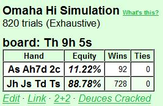
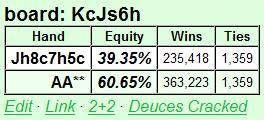

## 第 8 部分：翻牌后打法 I

### 8.1 简介

从第 8 部分开始，该系列文章将全部涉及翻牌后策略。结构化思维和规划一直是整个系列的主题，现在我们将使用相同的方法进行翻牌后玩法。PLO 首先是翻牌后游戏，并且大部分钱都是在那里赢或输的。

翻牌前玩法也是一个重要的组成部分，但并不是因为在那里输或赢了很多底池（一旦你参与其中，你通常会看到翻牌）或因为在那里犯了大错误（PLO 起手牌很接近，所以单独来看，翻牌前的错误通常很小）。PLO 翻牌前打法的作用是让我们为有利可图的翻牌后场景做好准备，这一点再怎么强调也不为过。

如果您经常面临困难的翻牌后决策（例如，当您在大底池中拿着边缘牌坐在不利位置时），这通常可以追溯到系统性的翻牌前错误。因此，尽管能够在困难的翻牌后场景中打好牌很有价值，但通常最好从一开始就避免让自己陷入许多困难的场景。

因此，即使我们将在本系列文章的其余部分主要讨论翻牌后打法，我们也不会忘记翻牌前打法。我们将有机会重新审视重要的翻牌前概念，以及它们如何导致各种翻牌后场景。例如，我们经常会看到，许多常见的翻牌后问题都可以在翻牌前找到解决办法。

第 8 部分和未来文章（可能是本系列的另外 3 篇文章）的计划是从一般到具体。我们从翻牌后规划的一些一般原则开始，包括准确计算补牌数和估计权益。

第 8 部分的主题是：

- 翻牌后规划的一般原则
- 评估翻牌后情况

我们将在此过程中使用大量示例。本文中的大多数示例都很简单，以便使用我们正在讨论的概念进行训练。然后，我们将在未来的文章中讨论更具体的“现实生活”翻牌后场景。

### 8.2 翻牌后计划的一般原则

人们可以写厚厚的书籍来介绍 PLO 翻牌后玩法，但不可能在像本文这样的文章系列中涵盖所有内容。但我们可以谈论很多关于合理的 PLO 思维过程以及哪些原则对于翻牌后玩法最重要。

我们将从两个非常重要的概念开始，这两个概念完全是通用的。它们可用于各种决策和所有形式的扑克：

- 好扑克模型
- 灰色区域

好扑克描述了如何做出扑克决策，而灰色区域告诉我们，我们的决策准确度是有限的：

#### 8.2.1 好扑克

“好扑克” 是高额有限注德州扑克玩家 Bryce “Freedom25” Paradis 在其早期为 Stoxpoker.com 制作的视频之一中提出的扑克决策模型。好扑克模型将扑克决策过程描述为一个两步过程：

1. 制定一组准确的假设
2. 根据这些假设找到最佳玩法

步骤 2 是该过程中最简单的部分。第 1 步可能非常困难，我们必须结合使用广义的假设、特定的对手信息和逻辑。这个过程很难系统地学习，经验非常重要。我们玩得越多，我们就越能感知周围发生的事情。

但是，当存在一组假设时（无论它们是好的还是坏的），原则上很容易根据这些假设推断出最佳打法。从假设到关于最佳行动方案的结论是一个由数学和逻辑控制的过程。因此，原则上可以精确地完成良好扑克决策过程中的第 2 步。在实践中，我们很少找到数学上最好的打法，但我们可以训练自己至少在大多数时候找到一条好的打法。

由于改进第 1 步是一个困难而缓慢的过程，因此当我们想要改进我们的扑克决策过程时，我们希望将大部分精力投入到第 2 步。我们的目标是始终根据我们所知道的或我们认为我们知道的内容找到最佳打法（或至少是一条不错的打法）。如果我们能够正确完成第 2 步，我们将始终能够充分利用我们拥有的任何信息和假设。我们积累的经验越多，我们的假设就会越准确，我们的扑克决策也会越准确。

以下是 “好扑克” 决策过程的一个例子：

**示例 2.1.1**  
\$10PLO 6-max

**Preflop：**  
Hero（\$10） A♦ 8♦ 7♠ 4♥ 在按钮位置加注到 \$0.35，BB（\$10）跟注。BB 的 HEM 统计数据为松散 - 被动，VP\$IP / PFR% / AF = 50 / 6 / 1.2。

> Hero 指我们以第一视角回顾牌局的玩家，可以称为牌手 A，本书的翻译中直接称呼 “英雄” 或者用原来的英文 Hero，Villain 原意坏人通常用来指对手。

**Flop：** A♠ 8♠ 5♦（\$0.75）  
BB（\$9.65）过牌，Hero（\$9.65）下注 \$0.75，BB 跟注。

**Turn：** A♠ 8♠ 5♦ 3♣（\$2.25）  
BB（\$9.65）过牌，Hero 需要做出决定。

对于一名有能力的玩家来说，这是一个典型的好扑克思维过程：

*我的翻牌下注是自动持续下注，带有顶两对。BB 的翻牌跟注与广泛的听牌和边缘成手牌一致。他可以有许多顺子和同花听牌的组合，可能还有一对与之搭配。他还可以用任何顶对牌过牌跟注。我有顶两对，我应该对他的范围有相当的胜率。但我没有强牌，我不得不对过牌加注弃牌。*

*但我认为对手不会用落后我们的任何牌过牌加注，所以我不担心被诈唬。而且由于我也相信我有很好的权益，所以我应该下注。我想给对手一个机会放弃他的第二好牌，或者为听到更好牌的机会付出代价。我只有两对，而且牌面协调，所以我更希望他弃牌。但是当他跟注时，我可能处于有利地位。如果他跟注并在河牌圈过牌，我将可以选择免费摊牌或价值下注。我会在到那里时做出决定。*

因此 Hero 下注 \$2.25，BB 再次跟注。

**River：** A♠ 8♠ 5♦ 3♣ J♠（\$6.75）  
BB（\$7.40）过牌，Hero 需要做出决定。

*一张可怕的河牌，但我认为他没有拿到同花，因为我预计他经常会用同花下注以获得价值（如果他过牌，他不能指望我会用更差的牌下注）。我认为我在这里通常领先，所以我应该下注以获得价值吗？不，这不是一个好主意因为对手可能不会在像这样的可怕牌面用更差的牌跟注。*

*如果河牌是空白，他可能会用顶对和更差的两对牌跟注河牌下注，但当同花出现时，我假设他会过牌 - 弃牌他所有的一对牌和大部分两对牌，即使他很松。他的范围中可能还有许多破产的顺子听牌，但我无法从中获得价值。所以总的来说，我认为我应该过牌，因为我认为下注的价值不够（我需要在他跟注时有 50% 以上的胜算）。*

所以 Hero 过牌。对手拿到翻牌的两头顺子听牌 + 对子。Hero 以两对获胜。

注意 Hero 在此过程中做出的假设。这些假设基于两件事：

- Hero 根据 BB 的 HEM 统计数据判断其为松手。
- Hero 根据松手 - 被动玩家的一般玩法，对 BB 的范围和倾向做出了一般性的假设。

鉴于这些假设，Hero 认为他应该在转牌圈下注他脆弱的两对牌。在河牌圈，Hero 认为他不会被更差的牌跟注，因此他进行了免费摊牌。BB 的实际牌是我们预期经常看到的牌，即破产的顺子听牌（在河牌圈跌跌撞撞地拿到两对）。

所有玩家在玩牌时都会使用某种形式的 “好扑克” 流程，即使他们没有意识到这一点。我们假设各种事情，然后尝试找出该怎么做。但是通过意识到这个过程并将我们的思维过程口头化，我们将更好地控制我们的决策方式。

区分做出假设和从假设中得出结论非常重要。将这两个过程分开可以更容易地识别和纠正我们思维中的缺陷。一旦您意识到了第 2 步中的错误，通常很容易纠正。第 1 步中的错误和缺点很难系统地解决。但如果问题是缺乏信息，我们至少可以从知道问题所在这一事实中找到安慰（我们只是没有足够的信息来得出准确的结论）。

但无论我们多么擅长根据假设得出合乎逻辑的结论，无论我们在牌桌上做出准确假设的能力有多强：总有一条我们不能跨越的界限。这是因为我们永远无法获得有关牌桌上发生的事情的完整和完美的信息。换句话说：有时我们会发现自己处于*灰色区域*。

#### 8.2.2 灰色区域

“灰色区域” 是扑克玩家 / 教练 Tommy Angelo 在他的文章《互惠：扑克获利的原因》（我强烈推荐的一篇文章）中提出的扑克概念。Angelo 首先指出，有些扑克决策要么完全正确，要么完全错误。例如，A♠ A♥ K♠ K♥ 在按钮位置加注是完全正确的。而在大盲注位置 2♠ 2♥ 2♦ 2♣ 跟注按钮加注是完全错误的。

完全正确或完全错误的决策处于黑 / 白区域。黑 / 白决策很简单，只有一个正确答案。当然，这并不意味着所有黑 / 白决策对初学者来说都很容易。但扑克改进过程的很大一部分是关于学习本质上是黑 / 白的概念。我们学习它们，使用它们，很快它们就会根深蒂固地融入我们的思维中。

但并非所有决策都是黑 / 白的。在黑白之间有一个区域，我们发现许多决策既不完全正确，也不完全错误。在这种情况下，我们做什么并不重要，因为一种选择似乎与其他选择一样好（至少在我们看来是这样）。例如，对于初学者 PLO 玩家来说，从 UTG 开始加注一个破烂的 Q♠ Q♥ 7♠ 2♦ 可能无利可图。但这也不是一个大错误，如果桌面动态被动，一个好的玩家可能可以从 UTG 中有利可图地玩这手牌。

当我们开始玩扑克时，我们的灰色区域很大（事实上，当我们开始时，一切都在灰色区域）。原因是我们还没有学会大多数黑白决策。所以我们有一个巨大的灰色区域，充满了我们觉得困难的决定，仅仅是因为我们不知道更好的选择。

接下来是最重要的部分：

随着我们提高扑克技巧，我们的灰色区域会缩小，而黑白区域会扩大（因为我们越来越善于识别决策是完全正确还是完全错误）。*但灰色区域永远不会完全消失！* 无论您的名字是 Phil Ivey、Tom Dwan 还是 Skjervøy，每个人都有自己有时会走进的灰色区域。原因是灰色区域不仅是我们的一部分；它也是游戏的一部分。

与国际象棋不同，国际象棋中我们始终拥有有关游戏状态的完美信息，但在扑克牌桌上我们无法获得完整和完美的信息。因此，即使我们完美地完成了良好扑克决策流程中的第 2 步，并始终根据我们的假设找到最佳路线，也总会有一个我们无法超越的边界，因为我们没有完整和完美的信息。

例如：

您在按钮位置持有手边缘牌 Q♥ T♣ 9♣ 4♥，CO 已加注。您不了解 CO 或盲注位置的玩家。此时，3-bet、跟注或弃牌都是可行的选择。如果您知道 CO 的开池加注范围很广，而且他在不利位置打法直接，并且盲注很紧，那么您可能想要用这手投机牌 3-bet 或松跟注。但如果 CO 是好的 / 激进，并且盲注很松，那么您应该更加保守，更倾向于弃牌。

现在您没有信息，因此您只需选择一个动作。这绝不是一个困难的决定，但您肯定处于灰色地带。如果您想稳妥行事，只需弃牌这手投机牌。如果您想试探对手，请在有利位置松跟注或 3-bet，然后看看他们如何反应。您在这里的选择更多地取决于您的默认风格，而不是 “正确” 风格。

在这种情况下，在您更好地了解对手之前，您会玩一种有点 “无效” 的扑克游戏。您可以根据一般信息对他们使用合理的默认策略，但此时您将无法最大限度地利用他们的个人弱点。

意识到灰色地带将帮助你专注于重要的事情。始终尝试提出准确的假设，并始终尝试根据这些假设推断出好的打法。但是如果你发现自己陷入了困境，无法解读对手的行动，你必须接受我们有时会在没有良好计划的情况下陷入灰色地带。

受这一点，不要让它在玩游戏时让你感到沮丧。继续下一手牌，利用两节之间的时间来缩小你的灰色地带。在每节课后分析困难的手牌是一种很好的改进方法。只需在会话期间在 HEM 中标记困难的手牌，然后稍后查看它们。

牌局结束后，你可以返回这些手牌，看看你是否错过了一些重要的信息，或者这手牌是否根本无法解决（至少以你目前的技能）。你也可以与其他人讨论手牌。有时另一个玩家会给你一个令人大开眼界的建议。我把这些顿悟时刻称为 “学会观察”。有时，你对游戏的理解会有一个质的飞跃，你现在能够看到桌上以前隐藏的东西。

最后：请记住，接近的决定（很难做出明确的决定）的定义是，我们做什么并不重要。根据定义，这些决定对我们的胜率没有太大影响，除非有很多（如果有很多，我们可能会在游戏的其他部分出现漏洞，通常是翻牌前）。

所以，刚开始时不要纠结于接近的决定。先把大事做好。堵住你的大漏洞，然后再解决小漏洞，这是系统改进的良好工作模式。

#### 8.2.3 玩游戏是为了赢钱，而不是为了赢得底池

一些玩家似乎对这个概念免疫。他们玩游戏是为了赢得底池，无论大小，他们很少关注风险与回报。原因显然是他们的自尊心。放弃我们已经投资的底池会导致心理不适，我们有时会做一些愚蠢的事情来赢得底池，这样我们就可以避免这种不适。特别是在单挑底池中，当对手从我们手中夺走一个底池时，我们很容易感到 “羞辱”。

但无论我们的自尊心告诉我们什么：如果参与其中不会赚到钱，我们都会优雅地撤退并保存我们的筹码。

以下是您在最低 PLO 级别中经常看到的非常糟糕的翻牌后打法示例：

**示例 8.2.3.1：翻牌圈过度玩 AAxx**  
\$10PLO 6-max

Hero（\$10）A♠ A♥ 7♦ 2♣ 从 UTG 加注到 \$0.35，CO（\$10）跟注，BTN（\$10）跟注，SB（\$10）跟注，BB 弃牌。

**Flop：** T♥ 9♥ 5♠（\$1.50）  
SB（\$9.65）过牌，Hero（\$9.65）下注 \$1.50，CO 弃牌，BTN（\$9.65）加注到 \$6，SB 弃牌，Hero（现在很沮丧）思考了 2 秒并全押，BTN 跟注。

**Turn：** T♥ 9♥ 5♠ K♠（\$20.80）

**River：** T♥ 9♥ 5♠ K♠ 4♠（\$20.80）

BTN J♥ J♠ T♦ T♠ 凭借翻牌三条 + 后门同花听牌 + 后门顺子听牌获胜。使用 ProPokerTools 我们发现 Hero 在翻牌上有 11% 的权益：

这里发生了什么？

Hero 一开始就正确地进行了翻牌前加注。我们拿到了最差的 AAxx 牌，但足以进行开池加注，而且如果我们使用合理的默认策略，我们就不会陷入困境。如果我们被 3-bet，我们可以 4-bet，并准备好在被跟注时在任何翻牌中全押。如果我们的开池加注被跟注，我们有时会在翻牌中持续下注（我们更喜欢干燥翻牌和少数对手），有时我们会过牌并放弃（在协调的翻牌和面对许多对手时）。

关键是我们在被跟注后不会承诺在任何翻牌中持续下注。因此，在我们认为继续这手牌没有利润的时候，我们会以小额损失（翻牌前加注 3.5 bb）逃脱。这是可以接受的代价，可以有机会偷盲注、获得 4-bet 获利的机会，或者看到有机会击中顶三条的翻牌（这是我们在多人底池中用糟糕的 AAxx 玩牌的主要目的）。

Hero 被跟注，而翻牌是他未改进的 AAxx 可能出现的最糟糕的翻牌之一。他有一对裸高对，3 个对手，并且被这种翻牌上能采取行动的牌击败。因此，Hero 的翻牌后计划应该是最简单的：过牌并立即放弃。

但 Hero 选择下注。这告诉我们，他在这里考虑的不是 EV，而是在翻牌前加注 AAxx 后赢得他认为 “有权” 获得的底池。他愿意冒着筹码的风险来实现这一点。他持续下注，被加注，并与加注者单挑。 Hero 现在有最后一次机会弃牌并带着大部分筹码逃脱。但他却出于怨恨而加注，并作为绝对劣势全押。

从德州扑克转到 PLO 时，我们首先要摆脱的就是在翻牌前加注后，我们有权用持续下注赢得大量底池的感觉。在 PLO 中，总有相当大的几率有人翻牌（任何翻牌）击中大牌，而且我们通常必须玩 “中牌或放弃”，尤其是在面对许多对手、在协调的翻牌中以及在位置不佳时。

如果您有许多对手和协调的翻牌并且您位置不佳，那么使用 “中牌或放弃” 的翻牌后策略是唯一有意义的事情。这正是上例中 Hero 所处的境地，但他任由自尊心左右自己的打法，最终在完全处于黑 / 白区域的情况下捐出了满满一组筹码（所有有能力的 PLO 玩家都会站在 Hero 的角度自动过牌并放弃）。

#### 8.2.4 不要让牌决定你的玩法

这个原则是前一个原则的变体。新手 PLO 玩家中常见的一个 “弊病” 是他们过于看重他们看到的牌，而没有足够注意其他因素。他们也没有足够地适应他们的情况在每条街上的变化，尤其是当他们以一手好牌开始的时候。我们在示例 8.2.3.1 中看到了一个典型的例子，我们的英雄拒绝接受他的 AAxx（在翻牌前对抗任何其他非 AAxx 牌时表现良好）在翻牌时被淘汰。

对于初学者 PLO 玩家来说，他手上的牌和牌桌上的牌是两个最重要的因素，其他因素都远远不够。但经验丰富的玩家会通过除了牌之外的一系列因素来评估每一种情况。有时牌不会排在最重要的因素之列。

经验丰富的玩家明白手牌价值是相对的，而不是绝对的。例如，我们不需要 “强牌” 来下注以获得价值，我们需要一手比 50% 跟注我们的牌（无论它们是什么）更好的牌。经验丰富的玩家也明白，有时他可以从某种情况下获取的价值与他的牌无关（例如，当他在有利位置攻击他认为较弱的玩家时）。

下面是两个例子来说明我们正在谈论的内容：

**示例 8.2.4.1：弱 AAxx 有利位置上单挑对战松散被动的对手**  
\$10PLO 6-max

**Preflop**  
UTG（\$10）溜入，Hero（\$10）A♠ A♥ T♣ 3♥ 按钮位置加注到 \$0.45，盲注弃牌，UTG 跟注。UTG 是松散被动的，我们还没有看到他在有其他玩家主动权的底池中诈唬。

**Flop：** K♠ 9♦ 4♦（\$1.05）
UTG（\$9.55）过牌，Hero（\$9.55）下注 \$0.80，UTG 跟注。

**Turn：** K♠ 9♦ 4♦ 3♣（\$2.65）
UTG（\$8.75）过牌，Hero（\$8.75）下注 \$2，UTG 弃牌。

Hero 拿着一张马马虎虎的 AAxx（一套同花，其他的都很少）在有利位置上加注，后面是松散被动（并且假定是弱手）的玩家。我们成功隔离了弱手，并在一个协调性较好的翻牌（同花听牌和内包顺子听牌都有可能）中翻出一对裸牌。对手跟注翻牌，因此我们认为他的范围很弱，包括各种听牌、一对牌，也许还有一些没有备用听牌的弱两对牌。

转牌是一张空白牌，UTG 再次过牌。Hero 现在意识到他那平庸的一对牌可能仍然领先于对手所拥有的任何牌。我们并不期望在这里获得很高的权益，但我们可能在对抗都是的范围时表现不错。因此我们再次下注，主要是为了让对手有机会放弃他（可能不错的）的权益。我们估计被我们击败的牌不会过牌加注，如果发生这种情况，我们可以轻松弃牌。

UTG 弃牌，以应对我们的转牌下注，这证实了他的翻牌过牌跟注范围很弱。但如果他在翻牌时击中一些公共牌，如果他知道我们只有一对裸高对，他可能应该再次跟注。如果是这样的话，我们从他的弃牌中获得的收益比被跟注的收益更多。在这种情况下，许多新的 PLO 玩家在处于 Hero 的位置时会在转牌时僵住。他们下注一次边缘牌，然后被跟注。然后他们自动假设对手有一手牌，他要把这手牌带到河牌圈，他们担心如果他们再次下注，他们会再次被跟注。这些玩家也永远害怕被过牌加注，害怕如果他们用边缘牌建立一个大底池，他们会被诈唬（现在或在下一条街）。

但是想想我们在转牌圈拿到边缘牌的情况：

- 对手是松散被动的
- 因此我们预计他会用宽而弱的范围跟注看翻牌
- 他在空白的转牌圈第二次过牌
- 我们预计他不会过牌加注、诈唬我们，也不会诈唬河牌。

因此对手给我们传递的信息是：

- 他在翻牌圈前很弱（跟注并跟注加注）
- 他在翻牌圈仍然很弱（过牌并跟注下注）
- 他在转牌圈仍然很弱（转牌圈是空白的，现在他再次过牌）

那么为什么不简单地相信他并再次下注以获得价值 / 保护呢？我们没有什么可担心的。如果他加注，我们会毫不后悔地弃牌。如果他跟注并在河牌下注，我们也会这样做。如果他跟注，在河牌上过牌，我们随后过牌，而他以 6♦ 5♦ 4♠ 3♦ 两对牌获胜，我们耸耸肩说 “哦，好吧”。

请注意，在转牌圈用边缘牌随后过牌以诱使对手诈唬对我们在 PLO 中没有多大帮助。首先，我们经常诱使对手进行薄价值下注，而不是诈唬。而且，当河牌完成对手很容易获得的听牌时，我们通常无法跟注河牌下注。最后，对我们来说，对手在转牌圈放弃他的边缘牌比免费看到河牌更好。

这是因为他通常对我们的边缘牌有相当好的权益（PLO 中的领先 / 落后情况比德州扑克少）。通过用我们的边际牌在转牌圈下注并迫使他弃牌，我们经常会让他犯错误（如果他知道我们有什么牌，他应该跟注或过牌加注）。边缘第二好牌通常在 PLO 中对抗边缘最佳牌时具有不错的胜率，而最佳牌几乎总是希望第二好牌在翻牌圈或转牌圈弃牌。

请注意，位置在这里非常重要。当对手第二次过牌时，我们从他那里得到的信息使我们能够满怀信心地在转牌圈下注。但是如果我们的位置不利，我们就会陷入困境（在做出决定之前，我们无法看到对手对转牌的反应）。

**示例 8.2.4.2：弱 AAxx 在不利位置的多人溜入底池**  
\$10PLO 6-max

**Preflop**  
UTG（\$10）跟注，CO（\$10）跟注，SB（\$10）跟注，Hero（\$10）A♠ A♥ T♣ 3♥ 在大盲注位置过牌。UTG 是示例 8.2.4.1 中的松散被动玩家，其他人未知。

**Flop：** K♠ 9♦ 4♦（\$0.40）  
SB（\$9.90）过牌。我们的计划是什么？

我们的起手牌和翻牌与上例相同，但翻牌后的情形不同。在示例 8.2.4.1 中，我们有一手好牌，可以加注以隔离位置较弱的溜入者。翻牌后我们有一手平庸的牌，但它足够强，可以在位置上与一个弱手单挑，而这个弱手一直通过过牌向我们示弱。因此，在相对手牌价值尺度上，我们的手牌足够强，可以在翻牌前加注，然后在翻牌后下注两次。

在这里，我们没有足够的手牌来翻牌前加注，因为我们在多人底池中处于不利位置。因此，我们从翻牌前过牌开始。翻牌后我们拥有与上例相同的绝对手牌价值（我们的牌相同，翻牌也相同），但在相对手牌价值尺度上，我们的手牌下降了很多。我们既没有单挑，也没有位置，在多人底池中我们处于劣势，而且我们对对手的牌一无所知。我们可以假设小盲注玩家在过牌后很弱，但其他一切都被掩盖了。

下注以保护我们弱但可能是最好的牌免受听牌的影响，在这里对我们没有任何帮助。底池很小，没有什么可保护的。而且我们的牌对其他 3 手我们知之甚少的牌很弱，而且在落后时我们几乎没有补牌（在最坏的情况下我们只听牌 A♣）。即使我们在翻牌圈下注并被较弱的牌跟注，转牌圈也会很难玩，因为我们必须先行动。我们是否应该假设我们仍然领先并在空白转牌圈再次下注？我们是否应该担心被听牌，然后过牌并放弃？如果我们在转牌圈下注并被跟注，我们会在河牌圈面临同样的问题，只是这次底池要大得多（这使得我们在河牌圈用弱牌做出不利位置的决定更加困难）。

花点时间考虑一下，如果我们决定在翻牌圈下注，这手牌在未来几轮中会如何发展。你应该明白，在翻牌圈下注只会让我们赢得一个非常小的底池，或者在底池越来越大的底池中用平庸的牌面临不利位置的艰难转牌圈 / 河牌决定。这通常是 PLO 中最糟糕的情况之一。所以我们向前看，看到威胁迫在眉睫，然后我们翻牌圈过牌以避免它：

**Flop：** K♠ 9♦ 4♦（\$0.40）  
SB（\$9.90）过牌，Hero（\$9.90）过牌，UTG（\$9.90）过牌，CO（\$9.90）下注 \$0.40，SB 弃牌。Hero 现在做什么？

Hero 弃牌。我们有时会在翻牌时弃掉最好的牌，但 “翻牌时最好的牌” 在 PLO 中意义不大。唯一重要的是我们是否有足够强的牌可以在翻牌时继续获利，而我们没有。CO 代表着一手不错的牌或不错的听牌，而我们只有一手平庸的成手牌，几乎没有改进的潜力。如果 CO 继续下注，我们就无法跟到摊牌，而我们的翻牌过牌跟注会告诉他，他确实应该继续下注以迫使我们弃牌（就像我们在示例 8.2.4.1 中对 UTG 所做的那样）。所以我们只需在翻牌圈弃牌，让他赢得这个小底池。

在示例 8.2.4.1 中的翻牌后场景中，我们的手牌 A♠ A♥ T♣ 3♥ 很弱，但有利可图。但在示例 8.2.4.2 中，这手牌在翻牌后很弱，毫无价值。在第一个示例中，我们通过隔离弱玩家来为自己设置一个有利可图的翻牌后场景，然后我们利用位置、手牌阅读和逻辑来提取翻牌后的价值。

在第二个示例中，我们通过翻牌前过牌并看到一个免费翻牌来为自己设置一个有利可图的翻牌后场景（set mining 挖掘中暗三条）。我们没有得到我们希望的翻牌，我们的手牌大部分都变成了垃圾。我们优雅地退出，没有浪费筹码试图以一手平庸的手牌和没有出局的劣势赢得一个微小的底池。

在前两个示例中，我们讨论了在规划翻牌后游戏时必须考虑的一些情境因素。现在我们将更详细地研究这些因素：

### 8.3 规划翻牌后打法

我们现在将讨论一些重要的情境因素，在规划翻牌后玩法时，你必须始终考虑这些因素。我们总是在翻牌时将第一枚筹码放入底池之前开始规划，并且我们希望在从翻牌进入转牌之前制定翻牌后计划。

请注意，我们的翻牌后计划通常直接遵循我们的翻牌前计划。请记住，我们的翻牌前策略的目的是让我们为有利可图的翻牌后场景做好准备。因此，大多数时候，我们都会以大致的眼光看待翻牌，了解我们将在不同类型的翻牌上做什么。

合理的翻牌前玩法的一个结果是，我们还会仔细考虑最终出现各种翻牌后场景（超出我们翻牌的情况）的可能性。例如，在按钮位置进行投机 3-bet 单挑之前，我们必须考虑盲注跟注的几率（应该很小），以及加注者的倾向（他应该在不利位置谨慎地玩牌）。

要评估的情境因素列表可以很长，但我们将仅限于最重要的因素。训练自己在每次看到翻牌时都仔细考虑所有这些因素，这样您的翻牌后决策就会变得更容易。以下是要评估的因素列表：

1. 对手的数量
2. 位置
3. 筹码量（以 SPR 衡量）
4. 我们的估计权益（由我们可以看到牌以及我们对对手及其范围的假设给出）

我们将这篇文章保留用于翻牌后规划的一般讨论，因此我们将在这里讨论 1 - 3。换句话说，除了牌和我们掌握的对手信息之外的情境因素。我们将在第 9 部分讨论权益。在那里，我们将学习如何根据我们能看到的牌和对我们面临的对手范围的假设来估计我们的权益。

#### 8.3.1 对手数量

如示例 8.2.4.1 和示例 8.2.4.2 所示，看到翻牌的玩家数量对于相对手牌强度非常重要。这会影响到我们需要多大的手牌强度才能在翻牌后继续获利，以及我们用各种类型的手牌玩得有多积极。

经常发生的翻牌后情况是，我们在翻牌前加注并被一个或多个对手跟注后，在翻牌上持续下注。作为起点（在我们查看翻牌结构和其他因素之前），我们可以使用以下准则：

- 单挑：在大多数翻牌上持续下注
- 三人：在很多翻牌上持续下注，但大多在没有强牌的情况下过牌协调的翻牌。
- 四人：大多玩 “不中就弃牌”

单挑和多人底池通常给我们最简单的持续下注决策。在单挑对抗中谁能赢得底池与翻牌前的主动权和翻牌后继续表现出侵略性密切相关。两位玩家都知道对方几乎可以在任何翻牌上拿到任何东西，因此在双方都错过翻牌的底池中，侵略性往往是决胜局。

在多人底池中，翻牌前的主动权不那么重要。根据经验法则，面对 3 个或更多对手，你可以在翻牌后的决策中忽略翻牌前的主动权。如果你在翻牌前加注，但在面对 3 个或更多对手时错过翻牌，只需过牌并立即放弃。如果你在盲注中跟注加注，并在多人底池中翻牌出大牌，那么领先下注翻牌是可以的。你不想冒险过牌，也不能相信翻牌前的加注者会替你下注对抗许多对手。

我们将在第 9 部分中更多地讨论持续下注，但以下是在单挑、3 人和 4 人底池中持续下注决策的 3 个示例：

**示例 8.3.1.1：单挑底池中 c-bet 决策**  
\$10PLO 6-max

**Preflop：**  
CO（\$10）跟注，您（\$10）在按钮位置用 K♦ K♠ T♣ 8♦ 加注到 \$0.45，盲注弃牌，CO 跟注。

**Flop：** A♦ 8♠ 3♣（\$1.05）  
CO（\$9.55）过牌，您（\$9.55）下注 \$0.80，CO 弃牌。

这是 PLO 与无限注德州扑克不同的情况。在无限注德州扑克中，我们经常在 A 高牌和干燥牌翻牌上过牌好的低对。原因是我们处于领先 / 落后的局面，手中有一手有价值的牌。我们可以过牌并诱使诈唬，我们可以在后面的街道上跟注，或者我们可能有机会进行价值下注。

这种思维方式不能很好地转移到 PLO。一个原因是，当我们的对手手上有 4 张牌时，我们领先或落后的可能性较小。例如，如果他在翻牌圈有 J T 9 8，他有 11 张补牌，可以得到两对或三条，而且他也可以在转牌圈拿到顺子听牌。所以当我们怀疑对手很弱时，我们通常不想在 PLO 中将边缘牌变成抓诈唬牌，我们宁愿让他弃牌。由于他的边缘第二好牌通常对我们的边缘最好牌有相当的胜率，所以他经常会犯弃牌的错误，而这正是我们想要的。

另外，请注意，当我们诱导诈唬时，这通常是我们不能跟注的诈唬。对手可以在转牌圈和河牌圈代表很多牌，任何转牌圈 / 河牌都可以击败我们的边缘牌。再次提醒，请记住 PLO 牌很少在翻牌时领先 / 落后，因此对手可以很容易地在转牌和河牌上代表一手强牌（这对我们来说要困难得多，因为翻牌时过牌暴露了他们的弱点）。

根据经验，如果你有一手中等的牌，有一定的摊牌价值，而你预计对手的范围很弱，你通常应该下注，迫使他放弃他的弱牌。这通常比在小底池中偷偷摸摸地摊牌对你来说更好。即使对手在翻牌时远远落后，他也经常在转牌时拿到补牌，那么为什么要让他免费提高呢？

**示例 8.3.1.2：三人底池中 c-bet 决策**  
\$10PLO 6-max

**Preflop：**  
CO（\$10）跟注，SB（\$10）跟注，您（\$10）用 A♣ K♠ J♣ T♠ 在大盲注加注到 \$0.40，CO 跟注，SB 跟注。

**Flop：** A♠ 6♥ 5♣（\$1.20）  
SB（\$9.60）过牌，您（\$9.60）下注 \$1.20，CO 弃牌，SB 跟注。

翻牌前加注是优质双花百老汇牌的标准做法。您位置不佳，但您会击中很多翻牌，因此您纯粹是为了价值而加注。

我们翻牌中顶对 / 顶踢脚 + 后门顺子听牌 + 2 个后门坚果同花听牌。在多人底池中，一对顶对不足以打到河牌圈，但这里我们有一对顶对和不错的后备。通过下注翻牌，我们为在很多转牌上继续获利做好了准备：

- 任何 A、K、Q、J、T
- 大多数黑桃
- 大多数梅花

我们必须小心处理转牌，因为转牌会与牌桌上的两张低牌配对，或者组成顺子听牌，但超过一半的牌对我们有利。换句话说，我们期望在转牌上获得更多权益。这意味着即使我们现在没有足够的牌来进入河牌圈，我们也经常会在转牌上有足够的牌。

因此，如果我们持续下注并被跟注，即使我们的位置不佳，我们也不会期望用未改进的裸顶对来应对许多棘手的转牌情况。因此，我们很高兴根据价值建立更大的底池（当然，我们不会介意在翻牌圈拿下底池）：

**Turn：** A♠ 6♥ 5♣ K♣（\$3.60）  
SB（\$8.40）过牌，您（\$8.40）下注 \$3.60，小盲注弃牌。你拿到了众多好转牌中的一张，现在你有两对 + 坚果同花听牌 + 卡顺听牌。SB 继续示弱，而我们有明显的转牌下注价值。此时他不太可能打败我们（他需要三条），如果他是听牌，我们希望他能为此付出代价。如果我们被加注，我们当然会用 16 张补牌跟注，以得到坚果同花、坚果顺子或葫芦。

**示例 8.3.1.3：四人底池中 c-bet 决策**  
\$10PLO 6-max

**Preflop：**  
CO（\$10）溜入，您（\$10）用 A♣ 8♦ 7♣ 5♦ 在按钮位置加注到 \$0.45，SB（\$10）跟注，BB（\$10）跟注，CO 跟注。

**Flop：** K♣ J♣ 6♠（\$1.80）  
SB（\$9.55）过牌，BB（\$9.55）过牌，CO（\$9.55）过牌，您（\$9.55）过牌。

翻牌前加注是标准加注，用强牌隔离溜入者。我们没有得到我们所希望的翻牌后场景（在加注底池中与位置单挑），我们看到 4 人看到翻牌 。这当然对我们来说没问题，因为我们有一手协调性强、双花色的强牌，在多人底池玩得很好。但这意味着我们必须相应地调整翻牌后的计划。我们的计划不是在大多数翻牌单挑时持续下注，而是多人底池玩 “不中就弃牌” 的游戏，除非我们以某种方式击中翻牌，否则我们不会持续下注。

那么，这个翻牌适合我们还是弃牌？我们有坚果同花听牌和后门顺子听牌，但我们绝对没有足够的牌来下注并在翻牌时投入所有筹码。而且我们并不指望在翻牌时经常拿下底池，因为我们预计对手经常会在 KJx 翻牌上击中某个牌。所以我们只是利用我们的位置拿一张免费牌，并希望免费改进增强。

**Turn：** K♣ J♣ 6♠ Q♠（\$1.80）  
SB（\$9.55）过牌，BB（\$9.55）下注\ $1.80，CO 弃牌，你弃牌。

转牌没有帮助我们，现在 BB 下注底池。我们只有一张裸坚果同花听牌，没有任何额外的东西，所以这是一个简单的底池赔率问题。我们需要 > 4 : 1，而我们得到的赔率为 2 : 1，而且假定隐含赔率很低，所以我们弃牌。不可能赢每一手牌。

请注意，位置使得这手牌比我们从 UTG 加注更简单、更便宜。在这里，我们在翻牌时得到了一张免费牌，但如果我们从不利位置过牌，有人通常会在我们后面下注。这将迫使我们要么付钱来提高，要么放弃不错的权益（如果我们认为我们没有足够的底池赔率 + 隐含赔率）。

### 8.3.2 位置

位置有两种：

- 绝对位置
- 相对位置

绝对位置是我们相对于按钮的位置。相对位置是我们相对于翻牌前加注者（或我们预计会下注的其他玩家）的位置。

谈到绝对位置，我们倾向于最后行动，这一点非常重要。相对位置不太重要，但我们在计划游戏时会始终牢记这一点。

新 PLO 玩家学到的第一句口头禅是 “位置就是一切” 和 “位置，位置，位置”。初学者当然明白位置很重要，这是常识。但是，直到他们玩了几千手牌，感受到了在位置内和位置外打牌的影响后，他们才完全理解位置在这个游戏中到底有多重要。

他们很快发现，在有利位置上你可以下多少注，因为不利位置的玩家被迫首先暴露弱点。例如，在下注翻牌并被跟注后，你必须在不利位置过牌的边缘牌，通常可以在有利位置上下注两次。他们还会体验到拿着一手马马虎虎的牌坐在不利位置的不适，尤其是当一个激进而有能力的玩家对他们有位置优势的时侯。理解 PLO 中位置重要性的两个关键概念是：

1. 位置不佳的玩家通常被迫玩更直接的游戏
2. 位置不佳的玩家通常被迫首先限制他们的范围

这两个因素都导致信息从位置不佳的玩家流向位置良好的玩家。PLO 是一种任何人都可以随时拥有（或代表）任何东西的游戏。正因为如此，除非底池是单挑，否则 PLO 中没有太多赤裸裸的诈唬。此外，如果你在翻牌时有最好的牌，你很容易被超越。

因此，如果我们发现自己手握强牌，但位置不佳，我们很少在多人底池中慢玩。这既因为我们很容易被超越，也因为我们不能相信我们后面的玩家（例如翻牌前加注者）会用更差的牌下注，给我们机会加注。这意味着位置不佳的玩家经常用他们的强牌下注，即使他们没有在翻牌前加注。这对有位置的玩家有利，因为他们现在可以获得大量有关对手牌力的真实信息。

如果我们的牌力较弱且位置不佳，我们很少会采取重大行动来赢得底池。这是因为我们后面的任何玩家都有可能翻牌击中大牌，而我们不知道牌力在哪里（因为没有人在我们之前行动）。但是，在有位置且手牌较弱的情况下，我们有时可以在对手通过向我们过牌而暴露弱点后，进行适时的诈唬。

翻牌后游戏的很大一部分基于对牌力的简单假设，我们不一定考虑对手范围的细节。下注和加注，然后在下一轮中继续同样的操作，表明牌力较强。下注然后过牌表明牌力较弱。跟注比下注和加注弱，但并不一定意味着牌力较弱。

让我们看一个常见的翻牌后情景来说明在不利位置玩牌的弊端：

**示例 8.3.2.1：在不利位置的情况下以有限的范围玩牌**  
\$10PLO 6-max

**Preflop：**  
UTG（\$10）加注到 \$0.35，BTN（\$10）跟注，盲注弃牌。UTG 是直接的 TAG，BTN 是未知的（对我们和 UTG 来说都是如此）。

UTG 加注代表一个强大的范围，偏向于同花和协调的高牌手牌。BTN 的跟注代表一个较弱的范围（因为他没有 3-bet），但他永远不会在 UTG 的范围面前处于很大的劣势（PLO 起手牌价值非常接近）。

**Flop：** A♠ 8♦ 4♦（\$0.85）  
UTG（\$9.65）下注 \$0.70，BTN 跟注。

UTG 的翻牌打法没有限制他的范围。他单挑持续下注的范围可能与翻牌前加注的范围相同，因此他可以拥有从顶三条到空气牌的任何牌。BTN 的跟注告诉我们他在某种程度上击中了翻牌。他跟注并不代表他有超强牌，但他不一定很弱。他可能在慢打超强牌，或者他有一手中等强的牌，在这种情况下表现良好（单挑一个不一定击中翻牌的宽范围牌）。请记住，我们预计 UTG 会在翻牌上持续下注很多空气牌。

但作为起点，我们预计 BTN 大部分情况下都有中等强的牌，因为他没有加注，而且在这个干燥翻牌上没有太多超强牌可能。 BTN 也可能是缠打的（用一手非常弱的牌跟注，计划在 UTG 过牌并放弃后偷走底池）。无论如何，我们预计他的范围在翻牌后跟注会相当广泛，而且很难准确判断他的手牌。

**Turn：** A♠ 8♦ 4♦ K♣（\$2.25）  
UTG（\$8.95）现在要做出一个重要的决定。

如果 UTG 在这个转牌中过牌，他将限制自己的范围，而 BTN 仍然有很宽的范围。牌面不是很有听牌的倾向，但可能出现同花听牌和一些弱顺子听牌。因此，如果 UTG 有一手强牌，它很少会强到足以给 BTM 一张免费牌（除非 UTG 预计 BTN 在过牌时会下很多注，这样 UTG 就可以过牌加注）。因此，如果 BTN 拿着一手强牌对抗未知的玩家，一个直截了当的 TAG 在大多数情况下会再次下注。他可能会进行过牌加注，但强到足以过牌加注的牌并不常见。

因此，如果 UTG 在这个转牌中过牌，他将向 BTN 发送大量有关其牌力的信息。基本上，他是在告诉 BTN，他可能没有足够的牌力打到摊牌。按钮位置上的有思想的玩家现在可以利用这些信息为自己谋利。他可以通过在转牌圈下注对抗假定的弱牌范围来创造很大的优势。如果 UTG 有一手他想打到摊牌的边缘牌，他现在面临着不得不跟注两个大注的威胁。他可能只跟注一个注就能打到摊牌，也可能不会。只有现在控制着手牌的 BTN 知道。这种威胁迫使 UTG 在转牌圈放弃很多边缘牌。他很弱，通过过牌他告诉 BTN 他很弱。BTN 现在有能力通过下大注转牌圈并威胁跟注更大的河牌圈注来将他赶出底池。

假设 UTG 有 A♣ Q♠ Q♦ 9♣ 牌并在转牌圈过牌。他现在在协调性较好的牌面上持有顶对 / 顶踢脚牌，而 BTN 可能持有中等强牌范围（主要是各种边缘成手牌或听牌）。但 BTN 可能持有强牌，如果没有，他可能会在河牌圈提升到强牌。那么如果 BTN 在 UTG 过牌后下注，UTG 应该怎么做？过牌 - 跟注？过牌 - 跟注一次下注，然后在河牌圈过牌 - 弃牌？

UTG 的问题是，他通过过牌暴露了自己的弱点。如果他在转牌圈过牌 - 跟注，则表明他很弱。BTN 现在可以相当准确地读懂 UTG 的手牌，因为充其量是具有摊牌价值的边缘手牌，希望便宜地进入摊牌。然后BTN 应该意识到 UTG 可能无法跟注两个大注来进入摊牌。因此，他可以通过在转牌圈下大注给 UTG 造成巨大压力。

由于 UTG 知道 BTN 玩家知道 UTG 可能无法跟注，因此 UTG 必须意识到转牌圈过牌跟注（以保持 BTN 玩家诚实）不太可能对他有多大帮助。如果 UTG 开始用边缘牌过牌跟注转牌圈，但对河牌圈下注弃牌，他只会向观察敏锐的对手捐出筹码。但如果他决定用这些牌一直过牌跟注，他将被价值下注直至死亡。因此，UTG 要么过牌跟注一次，要么过牌跟注到底的静态策略不会给他带来多大好处。

因此，当 UTG 通过过牌转牌将其范围限制为弱牌时，他最好只是过牌 - 弃牌，而不是试图偷偷地将它们带到小底池（这超出了他的控制范围）摊牌。如果 UTG 认为在转牌上用一手弱牌将更多筹码投入底池是个好主意，那么他通常最好自己下注（并保持他的范围不受限制），而不是过牌到 BTN 并暴露弱点。

转牌下注部分是为了价值（我们可能会被一手较弱的牌跟注），部分是半诈唬（我们希望 BTN 弃牌，但当他用更好的牌跟注时，我们可能会提升到最好的牌），部分是为了阻止他诈唬（我们冒着在过牌后被诈唬的风险，因为我们不能真正过牌 - 跟注）。

无论如何，这里的寓意是，作为一般规则，您不想在位置不利的情况下被动地玩弱牌范围。那些有能力且激进的玩家会对你下注到死。他们可以读懂你的范围（尤其是当他们看到你这样做几次时），他们会在转牌和河牌让你的生活变得一团糟。他们比你更了解你的范围，他们可以很容易地代表强牌（尤其是你一直在过牌）。

注意！这并不意味着你应该在任何时候都继续在转牌上下注边缘牌，因为你害怕如果你过牌会被诈唬！这个问题的解决办法可以在之前的几条街找到。你必须向前看，看看问题来自哪里：

1. 在翻牌前在不利位置玩很多非坚果潜力的起手牌
2. 在翻牌时在不利位置用很多边缘牌下注

例如，假设您 Q♠ 9♥ 6♦ 2♣ 在四人底池中获得了一张免费翻牌，并且在 J♣ 9♣ 2♠ 这样的协调牌面中翻牌获得底两对。不要在多路底池中用这手牌在不利位置下注，只需过牌并弃牌。您的手牌非常弱，即使它可能是翻牌上的 “最佳手牌”。

您有时会被加注并不得不弃牌。而且您经常会被跟注，然后您将不可避免地不得不在很多转牌中过牌，并在对手下注时面临不愉快的决定。只需计算可能出现的所有讨厌的转牌，您就会发现下注这个翻牌只会导致后续回合的痛苦。当然，您有时会在翻牌时拿下底池，但这是一个很小的底池。当您被对手反击时，您可能会损失惨重。

在我看来，理解和利用位置是您想要掌握 PLO 时最重要的技能。我们在本系列文章中讨论了位置，我们将在未来的文章中继续探讨位置及其用途。在第 9 部分中，我们将更多地讨论手牌阅读和使用信息以及位置中的 “下注杠杆”（我们在示例 8.3.2.1 中涉及的一个主题）。

### 8.3.3 筹码量（以 SPR 衡量）

我们将在翻牌后规划中使用的第三个因素是翻牌时（并且只在翻牌时）筹码量与底池大小的比率。我们称之为 “SPR”（筹码 - 底池比率）。如果玩家的筹码量不同，则每对玩家之间将存在一个 SPR 值。

以下是一个例子：

**示例 8.3.3.1：多人底池中的 SPR**  
\$10PLO 6-max

**Preflop：**  
您（\$20.50）A♠ J♠ 9♥ 8♥ 从 UTG 加注到 \$0.35，MP（\$8.20）跟注，BTN（\$2.60）跟注，BB（\$21.50）跟注。

**Flop：** x x x（\$1.45）  
以下是您和每个对手之间的 SPR 值（请记住，两个玩家之间的有效筹码量等于较小筹码量的玩家）：

- Hero（\$20.15）vs MP（\$7.85）：7.85 / 1.45 = 5.4
- Hero（\$20.15）vs BTN（\$2.25）：2.25 / 1.45 = 1.6
- Hero（\$20.15）vs BB（\$21.15）：20.15 / 1.45 = 13.9

我们记得在第 5 部分中，我们大致定义了 4 类 SPR 值：

- 极低：\< 1
- 低：\< 4
- 中：4 - 13
- 高：\> 13

我们注意到 SPR 值 1、4 和 13 分别对应于需要 1、2 和 3 个底池大小下注全押。高或高 / 中 SPR 的情况通常发生在跟注和加注底池中。在 3-bet 底池中，我们通常有低或中 / 低 SPR。在 4-bet 底池中，我们通常有低 / 超低 SPR。

在上面的例子中，我们对 MP 有中等 SPR（5.4），对 BTN 有低 SPR（1.6），对 BB 有高 SPR。如果我们想要更细致一点，我们可以说对 MP 有中 / 低 SPR，对 BTN 有低 / 超低 SPR，对 BB 注有高 SPR。

现在我们知道如何计算 SPR 值并对其进行分类，下一步是学习如何在翻牌后规划中使用这些信息。原理很容易理解：

*SPR 越高，我们在翻牌后全押的有效底池赔率就越低，我们需要的权益就越多，才能全押获利。相反，SPR 越低，我们需要的权益就越少，就能全压获利。*

我们可以简单地说明这个概念，通过计算在不同的 SPR 值下，我们需要多少权益才能在翻牌圈单挑全压时获利：

**SPR = 1：**  
我们冒 1 的风险赢得 1 + 1 = 2，因此我们获得的有效底池赔率是 2 ：1。我们需要 1 / (2 + 1) = 33% 的权益。

**SPR = 4：**  
我们冒 4 的风险赢得 1 + 4 = 5，因此我们获得的有效底池赔率是 5 ：4。我们需要 4 / (5 + 4) = 44% 的权益。

**SPR = 13：**  
我们冒 13 的风险赢得 1 + 13 = 14，因此我们获得的有效底池赔率是 14 ：13。我们需要 13 / (14 + 13) = 48% 的权益。

换句话说，SPR 越高，在翻牌时领先就越重要（例如，单挑时权益超过 50%，三方胜率超过 33% 等）。原因是，当 SPR 增加时，底池中死钱的覆盖率会降低。因此，我们的 EV 更多地取决于投入资金时是否拥有良好的权益。

我们并不总是为了翻牌后全押而玩，但只要我们参与翻牌，这个原则就会一直萦绕在我们头上。如果我们处于一种要么在翻牌后全押，要么在后面的街上全押的场景中，我们必须确保我们的权益与我们的 SPR 有很好的相关性。

SPR 越高，当我们建立一个大底池时，拥有坚果牌或坚果牌就变得越重要。这在多人底池中甚至更为重要，因为撞到坚果牌的风险远高于单挑底池。

现在我们将看 4 个使用不同 SPR 值操作的示例，并讨论这对翻牌后游戏的影响。为简单起见，我们假设所有玩家的筹码量相同。

**示例 8.3.3.2：高 SPR 的翻牌后计划**  
\$10PLO 6-max

**preflop：**  
UTG（\$10）跟注，CO（\$10）跟注，您（\$10）K♠ K♦ 7♣ 5♣ 在按钮位置跟注，BB（\$10）过牌。

**Flop：** J♣ T♥ 6♣（\$0.45）  
BB（\$9.90）过牌，UTG（\$9.90）下注 \$0.45，CO（\$9.90）跟注。您的计划是什么？

让我们来看看本文中讨论过的 3 个翻牌后因素（对手数量、位置和 SPR）。我们有3 个对手，并且我们拥有最佳绝对位置（但不是最好的相对位置，因为我们没有结束下注）。SPR 为 9.90 / 0.45 = 22（非常高）。

在多人底池中，如果已经有 2 名玩家参与翻牌，那么 SPR 较高意味着我们需要有坚果牌 / 听牌才能开心地玩大底池。而在像这样的听牌较多的翻牌中，我们希望在将筹码放入底池之前拥有坚果潜力。有位置可以更容易地用无法加注的牌摊牌，但这并不是在这种情况下用弱牌 / 听牌参与的理由。

在高 SPR 情况下，在大底池中走向摊牌，最重要的因素是我们的坚果潜力。当我们参与边缘牌 / 听牌时，我们还必须考虑负面隐含赔率。这里的情况正是如此。

我们在听牌较多的翻牌中翻出几乎是裸牌的高对（我们几乎可以忽略多人底池中的低同花听牌）。我们面前有一个下注和一个跟注。我们有：

- 一手弱牌，没有太多改进潜力，也没有超级好牌。
- 高 SPR，这意味着在大底池中风险 / 回报比很差。
- 绝对位置很好，但对于这么差的一手牌，这对我们帮助不大。

结论：翻牌时弃牌

因为我们认为我们经常有 “翻牌时最好的牌” 而跟注下注只会导致问题。首先，我们远远落后于超级听牌，我们的同花听牌毫无价值。此外，如果 UTG 继续下注，我们不能继续用我们的弱牌 / 弱听牌跟注而没有改进。最后，我们没有任何补牌可以让我们确信这是最好的牌。所以弃牌，弃牌，弃牌。

**示例 8.3.3.3：中等 SPR 的翻牌后计划**  
\$10PLO 6-max

**Preflop：**  
UTG（\$16）加注到 \$0.35，您（\$16）A♠ A♣ 8♠ 8♦ 在按钮位置 3-bet 到 \$1.20，盲注弃牌，UTG 跟注。

**Flop：** J♥ 9♥ 6♦（\$2.55）  
UTG（\$14.80）过牌，您的计划是什么？

除了我们的牌之外，翻牌后因素还包括：

- 单挑
- 有利位置
- 中等 SPR (14.8 / 2.55 = 5.8)

前两个因素对我们非常有利，第三个因素在我们看牌之前是中立的。中立的意思是 SPR 本身没有任何优势或劣势。重要的是我们如何根据 SPR 调整翻牌后计划。当我们看牌和翻牌时，我们可以做出与 SPR 相关的好坏决定。

那么让我们看看我们在权益方面有什么。不多。我们在一个协调性极强的翻牌上有一个没有听牌的裸高对。我们从两个阻断牌到顺子听牌中获得了一点额外优势，但仅此而已。

所以我们基本上必须在两条线之间做出选择：

- 翻牌时下注 - 弃牌（面对对手加注）
- 翻牌时过牌并希望过牌到摊牌（但保留在对手再次过牌时下注转牌的权利）

这里我们陷入了灰色地带，我们必须尽最大努力打牌。但请注意，如果我们坚持上述其中一条原则，那么自我伤害的可能性是有限的。我们能做的唯一灾难性坏事就是在底池中下注不止一次，而这不是一个选择。

利用位置拿一张免费牌并希望过牌到河牌是一个不错的计划。如果我们选择下注，我们必须对过牌 - 加注弃牌，因为我们的权益在对手的过牌 - 加注范围（​​主要是成手牌 + 听牌的强组合）面前非常差。为了在这个翻牌上用裸 AAxx 全押而感到高兴，我希望 SPR < 1。例如，一个 4-bet 底池，起始筹码为 100 BB，我们承诺在任何翻牌上全押。

**示例 8.3.3.4：低 SPR 的翻牌后计划**  
\$10PLO 6-max

**Preflop：**  
UTG（\$10） 加注到 \$0.35，BTN（\$10）跟注，您（\$10）A♠ A♦ 8♥ 7♦ 在小盲注位置 3-bet 到 \$1.50，UTG 跟注，BTN 跟注。

**Flop：** T♠ 6♥ 3♦（\$4.60）  
您（\$8.50）先行动。您的计划是什么？

翻牌后除牌外还考虑以下因素：

- 2 个对手
- 不利位置
- 低 SPR（8.50 / 4.60 = 1.8）

低 SPR 值（\< 2） 意味着我们不需要超强的牌来下注并投入到这个翻牌中（除非我们愿意投入其余筹码，否则我们不应该下注）。有两个对手是需要谨慎的理由，但对于如此低的 SPR，这不太令人担忧。我们的位置不利，但这也不是什么大问题，因为如果我们有一手好牌值得下注的话，我们就不会打算在任何时候放弃。

那么，我们有足够的牌可以在这里下注吗？当然。我们有一对高对 + 坚果卡顺听牌 + 2 个后门同花听牌。我们通常在翻牌时有最好的牌，而且如果我们与更好的牌发生冲突，我们有不错的权益。我们有大约 2 + 4 + 2 = 8 个坚果牌（大约 4 x 8 = 32% 的权益）来对抗大多数更好的牌，所以我们不太担心遇到更好的牌。

我们预计经常会在翻牌时拿下底池，而且如果我们没有拿下底池，我们的权益从来都不是太差。所以这是一个明显的下注并全押翻牌的场景。

**示例 8.3.3.5：超低 SPR 的翻牌后计划**  
\$10PLO 6-max

**Preflop：**  
CO（\$10）加注到 \$0.35，您（\$10）J♥ 8♣ 7♥ 5♣ 在按钮位置投机性 3-bet 到 \$1.20，盲注弃牌，CO 4-bet 到 \$3.75，您跟注。

**Flop：** K♣ J♠ 6♥（\$7.65）  
CO（\$6.25）全押，您怎么做？

翻牌后除了我们的牌之外还需要考虑以下因素：

- 单挑
- 有利位置
- 超低 SPR（6.25 / 7.65 = 0.82）

我们注意到，在极低 SPR 的情况下，其他两个因素变得不重要。原因是，如果筹码中剩余的下注少于底池大小，我们只需要做出底池赔率决定。我们以足够的权益投入，否则我们弃牌。

这里我们的底池赔率为 13.90 : 6.25 = 2.2 : 1，所以我们需要 1 / (2.2 + 1) = 31% 的权益。我们假设 CO 几乎总是有 AAxx，所以我们需要翻牌两对或更好的牌，或者至少有 8 张干净的牌（根据 4x 规则，4 x 8 = 32% 的权益）。

这里我们有一对（9 + 2 = 11 张补牌，两对 / 三条牌）+ 后门顺子听牌 + 2 张非坚果后门同花听牌，翻牌不太协调。如前文中的示例所示，我们将两对 / 三条补牌从 11 减少到 8，以计算 AAxx 对抗我们的两对的听牌，以及 AAxx 从未知边牌获得的权益。由于缺乏坚果潜力，1 + 2 = 3 个后门补牌到顺子和 2 个非坚果同花也应该稍微打折。我们进行一些判断，并计算 2 个后门补牌。我们最终估计翻牌上有 8 + 2 = 10 个假定的干净补牌。

这给出了 4 x 10 = 40% 的翻牌估计权益，因此我们远高于 31% 的阈值，我们可以轻松跟注。ProPokerTools 模拟证实了我们的估计：

**Turn：** K♣ J♠ 6♥ T♠（\$20.15）

**River：** K♣ J♠ 6♥ T♠ A♠（\$20.15）

CO 用 A♥ A♣ 7♦ 6♣ 获胜。我们在翻牌时对他的实际手牌有 41% 的权益。

### 8.3.4 翻牌后计划总结

我们决定在翻牌后计划玩法时重点关注以下因素：

1. 对手数量
2. 位置
3. 筹码量（以 SPR 衡量）
4. 我们的估计权益（由我们能看到的牌以及我们对对手及其范围的假设给出）

在本文中，我们讨论了 1 - 3，我们将权益的讨论留到第 9 部分。通过将一般因素（除了我们的牌之外的所有因素）与具体因素（牌）分开，我们强调了从牌中查找并注意手中正在发生的其他事情的重要性。扑克手牌不是我们看到的牌，而是我们在所有其他可用信息的背景下看到的牌。我们收集和处理的信息越多，我们的决策就越好。

训练对牌之外因素的理解的一个好练习如下：

- 忽略牌
- 仔细考虑所有其他因素
- 决定你需要什么样的牌才能参与翻牌
- 看看你实际上拥有什么，并决定这是否足够好。

例如，你在按钮位置上用一些 xxxx 的牌跟着跟注，落后于 CO，两个盲注都跟注。你看到 4 路底池中有 X X X 翻牌。SB 下注，CO 跟注。每个人都有满筹码，所以 SPR 很高。你现在想看哪些牌？

很明显，我们想要一手坚果牌。要么是一手强成牌（最好有后备听牌），要么是一手强的坚果听牌。如果你 9♣ 8♣ 7♠ 6♥ 现在在翻牌上看到 6♦ 5♠ 4♥，你会很高兴。如果你 K♠ K♥ J♦ 7♥ 在翻牌上看到 K♦ 9♥ 6♠，你会很高兴。如果你 A♥ K♥ T♠ T♦ 在翻牌上看到 7♥ 7♠ 6♥，你会忍住不做任何动作并弃牌。

你也可以选择一手你以前玩过的牌，玩 “如果？” 游戏。在这种情况下，你应该怎么做？你应该用另一种牌做什么？如果你的位置发生了变化，你应该怎么做？等等。

在牌桌外练习翻牌后计划将提高你在牌桌上思考和计划的能力。你想把你的牌看作一个更大整体的一部分，你想了解不同的翻牌后因素是如何联系在一起的。

### 8.4 总结

在本文中，我们构建了一个极简的理论框架，用于思考翻牌后场景和规划翻牌后玩法。我们列出了 4 个重要因素（对手数量、位置、SPR 和权益），并讨论了这些因素如何指导我们的翻牌后决策。

我们通过许多示例说明了合理的 PLO 翻牌后决策。这些示例保持简单以强调重要概念，但我们将在以后的文章中介绍更复杂的 “现实生活” 场景，我们将看到我们的翻牌后规划模型如何应用于其中。

在下一篇文章中，我们将以对权益和权益相关概念的全面处理结束关于翻牌后规划的讨论。除其他外，我们将学习如何计算各种听牌（包括大包牌听牌）的补牌数以及如何快速准确地估计翻牌时的权益。然后，当我们学会了如何分析和规划翻牌时的牌局时，我们将开始讨论一些具体和常见的翻牌后场景。

几天后，我还将发布博客 3，作为文章系列的实践部分。在那里，我将展示我们玩过的最低 PLO 级别（\$5PLO）的结果。我还将谈谈我玩这个级别的经验（关于这个级别的一般评论、玩家在那里最常犯的错误以及如何利用这些错误）。
