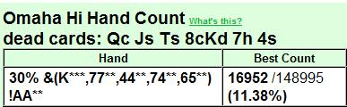

## 第 11 部分：翻牌后打法 IV

### 11.1 简介

在第 11 部分中，我们将继续讨论第 10 部分开始的持续下注（c-bet），这次重点关注 3-bet 和 4-bet 底池。接下来我们将讨论如何防御 c-bet，然后我们以关于 c-bet 的最重要原则的总结结束本文。

第 11 部分的原计划是讨论与 c-bet 和翻牌下注相关的其他主题（延迟 c-bet、2 次 c-bet、识别好的诈唬场景），但由于篇幅限制，这些将移至第 12 部分。第 12 部分的计划是讨论上述主题，然后讨论转牌圈打法。转牌圈打法与翻牌圈的计划密切相关，我们将看到良好的翻牌圈计划如何为未来的街打下基础。当我们完成转牌圈打法后，我们将讨论河牌圈打法，可能在第 13 部分。

### 11.2 3-bet 和 4-bet 底池中的 c-bet

3-bet 和 4-bet 底池中的 c-bet 大多发生在单挑场景中。为简单起见，我们在此仅考虑单挑底池，除非另有说明，否则我们假设起始筹码为 100 BB。

当在 100 BB 起始筹码的情况下翻牌前进行一次以上加注时，SPR 会降至低（\< 4）或极低（\< 1）。在 3-bet 单挑底池中，我们通常会获得 3 到 4 之间的 SPR。在 4-bet 单挑底池中，我们通常会获得 0.8 到 1.2 之间的 SPR。如前文所述，较低的 SPR 值意味着我们在翻牌后具有更好的风险 / 回报率。因此，降低我们的全押牌力要求也是正确的，但这并不一定意味着我们可以盲目地大举进攻。

例如，我们通常希望避免在 3-bet 底池中下注 - 弃牌，因为这样做代价非常高昂。因此，在我们 c-bet 之前，务必要对我们的权益和翻牌时的弃牌权益进行彻底评估。如果我们在其中一个方面很少，那么我们需要很多在其他方面。我们究竟需要多少取决于风险 / 回报比率，即我们 c-bet 时获得的有效底池赔率（可能计划在对手不弃牌时全押）。

在 4-bet 底池中，如果起始筹码为 100 BB，通常只需在翻牌时将剩余筹码（当所有翻牌前加注 / 再加注都是底池大小时，还剩大约 1 个底池大小的下注）全部押入即可。但正如我们在之前的文章中看到的那样，这样做的原因是我们选择了正确的牌型来进行 4-bet（即经常击中翻牌的牌）。看待这个问题的一种方式是说，在你决定 4-bet 的那一刻，你就做出了在翻牌前 4-bet 之后对任何翻牌进行 c-bet 的决定。如果你选择正确的牌在翻牌前进行 4-bet，那么根据数学原理，即使你每次翻牌都全押，或接近全押，对手也无法在翻牌后剥削利用你。

我们通常在 4-bet 时有 AAxx，但是我们记得，在前一篇关于 4-bet 的文章（第 6 部分）中，当对手用较宽且较弱的范围对我们 3-bet 时，我们会用较宽的范围 4-bet。无论如何，我们都会用优质手牌进行 4-bet，这些手牌会以各种方式击中许多翻牌，因此，在有效底池赔率 1 : 1 或更高的情况下，对任何翻牌全押进行 c-bet 通常是正确的。

现在，我们将使用一些详尽的示例来研究 3-bet 和 4-bet 底池中的 c-bet。在所有示例中，我们都使用第 8 部分和第 9 部分中定义的简单翻牌后规划模型，并且我们将通过评估模型中的情境因素来开始每个翻牌后决策过程。我们还将使用第 9 部分中定义的翻牌结构分类方案（湿 / 干和重 / 轻）。

**示例 11.2.1：3-bet 底池 C-bet 决策**  
\$10PLO 6-max

**Preflop**  
CO（\$12.80）加注到 \$0.35，您（\$10）用 Q♣ J♠ T♠ 8♣ 在按钮位 3-bet 到 \$1.20，盲注弃牌，CO 跟注。CO 喜欢看翻牌，并且一直在翻牌前跟注大量加注和 3-bet。他从后面位置松散地加注，但翻牌后他很被动。他似乎翻牌后没有强牌很谨慎，并且通常在翻牌后继续下注时有好牌。到目前为止，我们还没有看到他弃牌给 3-bet，所以我们假设他用他的大部分加注范围跟注。

**Flop：** K♦ 7♥ 4♠（\$2.55）  
CO（\$11.60）过牌，你还剩下 \$8.80，你的计划是什么？

翻牌后参数：

- **对手数量：** 单挑
- **位置：** 有利位置
- **SPR：** 8.80 / 2.55 = 3.5（低）
- **权益：** 差。我们基本上没有牌力 / 没有听牌。

在翻牌前 3-bet 后，翻牌我们完全没有击中任何牌，在这些情况下，重要的是要意识到我们没有义务在每次翻牌时都进行 c-bet。但在这里我们可以假设以下几点：

- 翻牌是干燥 / 轻的牌，我们的对手经常错过它。
- 我们没有理由认为他会试图诈唬我们。

所以我们可以假设对手大多数时候也错过了，在这种情况下他会对我们的 c-bet 弃牌。因此，对这种翻牌牌面进行 c-bet 似乎是一种有利可图的玩法，即使我们对跟注或过牌加注的牌没有任何权益可言。我们可以可靠地代表顶三条、超对或顶对，因为我们的大多数 3-bet 范围由 AAxx 和好的百老汇牌组成。因此，如果 CO 正在考虑我们的牌，他会知道我们经常在这个翻牌上至少击中顶对。当然，CO 也可以翻牌得到一手好牌，但可能性很小，因为他用一个宽而弱的范围加注并跟注 3-bet。

在非常干燥的翻牌牌面上，将我们的大多数 “空气” 牌作为纯粹的诈唬 c-bet 的盈利能力当然对任何人来说都是显而易见的。但在本系列文章中，我们不会将所有显而易见的事情视为理所当然，所以让我们估计一下他在翻牌中拿到 Kxxx 牌的频率。换句话说，我们想知道他有多少次拿到顶对、顶两对、顶 + 底两对或顶三条，因为 Kxxx 包括所有这些组合。

从 HUD 中我看到 CO 从这个位置加注了 30% 的牌。由于他在翻牌前看起来非常松散，在加注和 3-bet 底池中也是如此，我们可以假设他用他的整个范围跟注 3-bet（除了 AAxx，他会 4-bet）。首先，根据我们能看到的牌，计算一下他范围内的组合数。我们假设他前 30% 的手牌符合 ProPokerTools 使用的手牌排名。

前 30% 的范围减掉了一些牌，因为有些牌要么在我们手中，要么在牌面上。我们还移除了 CO 的所有 AAxx 牌，假设他会用它们进行 4-bet。所以他现在的范围中有 35785 种组合。然后我们计算其中有多少包含 K：

这给出了 13947 种组合。因此，CO 手中有 K 的概率为 13947 / 35785 = 39%。请注意，这些不仅是顶对牌，而且还有 KKxx 的顶三条和两对组合 K7xx / K4xx，因为所有这些都是 Kxxx 的子集（但是，前 30% 范围内的 K7xx / K4xx 牌的数量可能很低）。这看起来很有希望，所以让我们更进一步，计算 CO 拥有以下组合的概率：

- Kxxx（KKxx 的顶三条、K7xx / K4xx 的两对牌、Kxxx 的顶对牌）
- 77xx、44xx、74xx（中三条、底三条、底两对牌）
- 65xx 两头顺子听牌。

换句话说，我们计算了 CO 前 30% 范围内的所有组合，这些组合现在有翻牌顶对、两对、三条或唯一可用的不错的听牌。我们得到 16952 个组合，如下所示：

我们记得 CO 范围内的组合总数是 35785，所以他翻牌得到顶对、两对、三条或两头顺子听牌的概率是 16952/35785 = 44%。因此，我们知道，如果 CO 翻牌得到的牌比顶对或两头顺子差，那么他不可能比低对没有强听牌的更强。这些是我们预计他会对 c-bet 弃牌的牌。如果是这样，那么 CO 将在 100 - 44 = 56% 的时候里弃牌。

那么我们应该 c-bet 吗？当然。即使我们下注满底池，我们也会得到 1 : 1 的有效底池赔率，所以如果对手弃牌超过 50%，我们就会赚钱。在这里，我们估计他在这个干燥翻牌中翻牌得到小于顶对的牌的概率为 56%。此外，我们不必在这种干燥牌翻牌上下注满底池，因此我们可以通过较小的 c-bet（例如 3/4 底池）来获得更好的有效底池赔率。

我选择下注略多于 3/4 底池。在这种干燥牌面上，我可能用较小的下注（例如，大约 1/2 底池）就可以了。但在微级别中，下注略多于您认为可以赢下底池的金额是一个有用的经验法则。您会遇到许多对手，他们正在寻找任何借口用各种垃圾牌跟注，而您不想鼓励他们这样做。请记住，在 PLO 中，您通常希望对手在翻牌时弃牌，即使他们有弱牌。

**Flop：** K♦ 7♥ 4♠（\$2.55）  
CO（\$11.60）过牌，你（\$8.80）下注 \$2，CO 弃牌。

正如预期的那样。通过这种下注大小，我们给自己的有效底池赔率是 2.55 : 2 = 1.28 : 1。因此，如果 CO 弃牌的概率超过 1 / (1.28 + 1) = 44%，我们就会自动赚钱。我们估计他在 56% 的时候里没有顶对或不错的听牌，我们预计他会在这种情况下弃牌。我们当然预计他会用顶对、不错的听牌或更好的牌跟注或过牌加注。

由于我们已经开始为这种情况做数学计算，让我们也估计一下 c-bet 的 EV。我们假设 CO 会在 56% 的时候里弃牌，我们可以保守地假设当他跟注或过牌加注时，我们获胜的几率为 0%。根据这些假设，c-bet 的 EV 为：

EV = 0.56(\$2.55) + 0.44(-\$2) = +\$0.55

我们还可以做出更保守的估计，假设 CO 有时会用比顶对或两头顺子听牌差的牌跟注或过牌加注。例如，假设 CO 的有效弃牌率因此从 56% 降至 50%。我们的 EV 则变为：

EV（保守）= 0.50(\$2.55) + 0.50(-\$2) = +\$0.28

因此，即使 CO 有时会用比顶对或不错的听牌差的牌跟注或过牌加注，我们仍然可以从 c-bet 中赚钱。我们（最终）得出结论，这对于 c-bet 来说一定是有利可图的情况。

这是我们详细分析单挑 c-bet 场景的一个例子，大多数人仅凭翻牌结构（干燥牌和 K 高）就能立即意识到这是有利可图的，那么为什么要这么费劲呢？这个分析的目的是向您展示如何系统地估计成功的机会和下注的 EV。我们将对手放在一个范围内，并使用 ProPokerTools 计数函数来计算他范围内各种类型的手牌数量。然后我们能够 “证明” 为什么在干燥 / 轻的牌上大量 c-bet 通常有利可图。

当然，我们必须在此过程中做出假设，因此这种分析永远不会完美。但是，如果我们使用保守的 “最坏情况” 思维模式，并且最终仍能获得有利可图的 c-bet，我们可以假设我们的结论是可靠的。这就是这种情况。我们估计，即使使用保守的假设，c-bet 的 EV 也是正数，因此我们进行 c-bet。平均获胜 +\$0.28 （或大约）并不是什么大事，但请记住，c-bet 决策经常发生。因此，这些小额利润会随着时间的推移迅速增加，并构成您总获胜率的重要组成部分。

**示例 11.2.2：3-bet 底池 C-bet 决定 II**  
\$10PLO 6-max

**Preflop**  
BTN（\14.85）加注到 \$0.35，您（\$11.15）A♦ A♥ 6♦ 4♥ 在小盲注位置 3-bet 到 \$1.10，BTN 跟注。BTN 是一个 TAG，他在按钮位置加注的范围相当广（43%）。他对 3-bet 弃牌很多，因此我们可以假设他弃牌的牌包括裸对和糟糕的 Axxx 牌。因此，他的跟注范围应该主要由不错的同花和协调的牌组成。

**Flop：** Q♣ 9♣ 7♠（\$2.30）  
您还剩下 \$10.05。您的计划是什么？

翻牌后参数：

- **对手数量：** 单挑
- **位置：** 不利位置
- **SPR：** 10.05 / 2.30 = 4.4（低 / 中）
- **权益：** 差。我们的超对通常是翻牌圈最好的牌，但是面对由好的对子 + 听牌组合组成的范围，我们的权益很低。这种翻牌结构上有很多这样的可能性，我们可以假设这个翻牌击中对手的范围很大。

这里我们遇到的情况是，我们在翻牌前用一手好 AAxx 牌 3-bet，计划在很多翻牌上 c-bet，并经常跟注全押。如前文所述（例如，第 5 部分中关于 3-bet 好牌和坏牌 AAxx 牌之间的区别的讨论），对于好 AAxx 牌来说，这是一个不错的计划。这些牌经常在翻牌中获得不错的权益，因为它们的协调边牌经常与翻牌相关。因此，翻牌前的好 AAxx 牌经常在翻牌时变成好的超对 + 听牌。因此，翻牌前用好 AAxx 牌 3-bet，让我们在翻牌时获得很多有利可图的 c-bet 机会，我们的手牌通常是最好的牌，并且在不是最好的牌时有一些权益可以依靠。

但这不是那种翻牌。更糟糕的是，我们预计这手翻牌与对手的范围紧密相关。所以让我们快速估算一下，看看。我们知道他在按钮位置加注 43%，并且在 3-bet 时会放弃最弱的牌。我们假设他在按钮位置用前 30% 的牌跟注，但 AAxx 牌除外（他会 4-bet）。在考虑所有可见的牌后，按钮位置的范围剩下 37032 种组合：

然后我们计算这个范围内有多少手牌翻牌后是暗三条、两对、顶对、顺子听牌（至少是两头顺）或同花听牌。这些是对手翻牌全押范围的候选牌。他可能不会全押所有牌（例如，没有对子的裸同花听牌），但这个范围内的许多牌都是对子 + 听牌或更好的牌。这些牌足以在 3-bet 底池中面对单挑 c-bet 加注全押。

对手的翻牌全押候选牌加起来有 28172 种组合，也就是 28172 / 37032 = 其总范围的 76%。对手范围的 ~ 3/4 至少在翻牌中出现了某种不错的成手牌或不错的听牌。我们对这些牌的胜率是 36.53%，如下所示：

在对手范围中较好地击中翻牌的那一部分牌面前，我们处于绝对劣势。那么如果我们决定 c-bet 会发生什么呢？我们可以通过做出一些简单的假设并构建一个情况模型来估计 c-bet 的期望值。首先，我们来看看下注 - 弃牌，然后是下注 - 跟注。

我们首先稍微收紧 BTN 的全押范围，因为假设他会用他候选范围（成手牌 + 听牌）中的所有牌全押是不现实的。其中一些牌太弱了（例如，裸同花听牌或裸两头顺子听牌）。而当 BTN 没有同花听牌时，他不得不担心我们有。

因此，我们简单地假设 BTN 50% 的时候会全押，而不是 76%。目前我们还不知道，面对对手范围中 “最佳” 部分，我们的权益是多少，但肯定低于我们面对他 76% 全押范围时的 36.53%。让我们用估算说是 33%。

然后我们定义我们的模型：

- 我们 c-bet 底池
- BTN 在翻牌圈用他总范围中最好的 50% 加注底池，否则他弃牌。

请注意，此模型并未捕捉 c-bet 后的所有可能结果。对手可以决定用他范围的一部分跟注我们的下注，但我们假设他要么加注要么弃牌。毕竟，简化现实才是建模的全部意义所在。

**c-bet 并在全押后弃牌**  
我们有 50% 的机会赢得 \$2.30 的底池，而有 50% 的机会我们会对 BTN 的全押弃牌并损失 \$2.30。这个打法的 EV 显然为零：

EV（下注 - 弃牌）= 0.50(+\$2.30) + 0.50(-\$2.30) = \$0

**c-bet 并在面对全押后跟注全押**  
我们下注 \$2.30。BTN 有 50% 的机会弃牌，否则他会将底池加注到 \$9.20。由于我们不弃牌，我们唯一的选择就是将剩余的筹码全押进去（例如，我们 3-bet 到总共 \$10.05）。然后我们全押总底池 \$22.40，从我们 c-bet 的那一刻起，我们已经投入了 \$10.05。EV 为：

EV（下注 - 跟注）= 0.50(+\$2.30) + 0.50(0.33(\$22.40) - \$10.05) = -\$0.18

**结论**  
根据上述模型，c-bet 无利可图。我们一路上都做了假设，但我们已经明确确定了两件事：

- BTN 击中这个翻牌的次数比他错过的次数多
- 当他击中翻牌时，我们平均处于劣势.

我们还估计，c-bet 的期望值为 -EV，即使我们假设对手弃牌了一些可能的全押候选牌（76% -- > 50%）。如果我们让他全押整个 76% 的候选牌（我们的权益为 36.53%），我们的下注弃牌和下注跟注期望值分别变为 -\$1.20 和 -\$1.87。但这不太现实。

无论如何，即使我们的 c-bet 得到了 3-bet 底池中相当多的死钱的补贴，我们在这里也无法通过 c-bet 获利。我们拿下底池的次数不够多，而且当对手不弃牌时，我们没有足够的权益。这或多或少是我在玩这手牌时得出的结论（跳过详细分析）。所以我在翻牌圈过牌，打算放弃。

**Flop：** Q♣ 9♣ 7♠（\$2.30）  
您（\$10.05）过牌，BTN（\$13.75）过牌。

我们得到了一张免费牌，这很不错。

**Turn：** Q♣ 9♣ 7♠ Q♥（\$2.30）  
您（\$10.05）过牌，BTN（\$13.75）过牌。

我们的处境有所改善，在看到一张空白的转牌后，我们的权益现在增加了，对抗听牌和一对牌。但我看不出有什么令人信服的理由在转牌下注。我再次过牌，希望得到免费摊牌，我预计一个紧而激进的对手经常会给我这样的机会。

**River：** Q♣ 9♣ 7♠ Q♥ 6♠（\$2.30）  
您（\$10.05）过牌，BTN（\$13.75）过牌，你赢了。BTN 有 A♠ K♥ K♠ J♦。

在这样的对抗之后，分析对手的线路并尝试了解他的想法是一个好习惯，因为这将在未来的手牌中有用。他有一手不错的起手牌，所以跟注我的 3-bet 是可以的。尤其是对抗像我这样的玩家，我会用相当宽的范围进行 3-bet（但盲注位置当然会比较紧）。

我也喜欢他的翻牌过牌。BTN 在翻牌圈拿到了一手不错但不是很好的牌，有一对超牌 + 卡顺 + 后门坚果同花听牌，牌面协调可能有同花听牌。他知道我过牌后经常会很弱，但他不能 100% 确定。

在转牌圈，他可能使用与翻牌圈相同的逻辑。他有一手有摊牌价值 + 弱听牌的牌。我似乎处于过牌模式，所以 BTN 加入了其中，决定过牌看看谁赢。这绝对是他可以考虑下注（基本上是将他的牌变成诈唬）让我弃牌的地方，特别是如果他认为我有 AAxx。但转牌过牌是可以的。

在河牌圈，他被第三次过牌，现在他的选择很简单：下注并将他的牌变成诈唬牌，迫使我弃牌，或者过牌并赢过我范围中的几乎所有牌。对手选择了后者。我不确定他的最佳打法是什么，因为这取决于我的范围中有多少百分比是 AAxx 牌，以及我是否用 AAxx 跟注河牌圈的下注。这些事情不是常数，但会根据游戏进程和我对对手的解读而略有不同。

在我准备放弃的情况下，我显然很高兴得到这手牌的过牌。但对手打得很好。最有趣的翻牌后决定是 C-bet 的决定。我们对对手的实际牌有很好的权益（68%），但对他的假定范围权益很差。通过进行与示例 11.2.1 中相同类型的范围分析，我们估计 c-bet 无利可图。

这是我们放弃 c-bet 的一个例子，因为我们不想在处于劣势时盲目地下注对抗强范围。在 3-bet 底池中，下注 - 弃牌的代价很高，我们通常不想让自己陷入经常不得不在下注 - 弃牌或用较差的权益投入筹码之间做出选择的境地。进行这种分析工作是一种很好的离桌练习，可以让您更轻松地快速估计各种翻牌中各种范围的权益。因此，请定期将其作为扑克 “家庭作业” 的一部分。

示例 11.2.3：3-bet 底池 c-bet 决策 III  
\$10PLO 5 人

**Preflop**  
BTN（\$10）加注到 \$0.35，您（\$10）A♠ A♥ Q♥ J♥ 在小盲注位置 3-bet 到 \$1.10，BTN 跟注。您只与 BTN 玩了 2 圈，从您看到的情况来看，他似乎不是很松或很激进。

**Flop：** K♥ 9♦ 5♠（\$2.30）  
您还剩下 \$8.90。您的计划是什么？

翻牌后参数：

- **对手数量：** 单挑
- **位置：** 不利位置
- **SPR：** 8.90 / 2.30 = 3.9（低）
- **权益：** 对抗对手的总范围不错，对抗他将继续的牌可能也不错。我们的超对通常是翻牌圈最好的牌，而且我们在落后时有少量补牌，可以拿到顶三条 + 卡顺 + 后门同花听牌。当对手有 KQJT 这样的百老汇牌时，我们的顺子牌也会阻挡他的顺子听牌。请注意，此翻牌圈最好的顺子听牌是 QJTx 和 876x（9 张补牌的内嵌包牌），因此我们不会在这里遇到怪兽（超级）包牌。

**Flop：** K♥ 9♦ 5♠（\$2.30）  
您（\$8.90）下注 \$2，BTN（\$8.90）加注到 \$8.30，您 3-bet 全押到 \$8.90，BTN 跟注。

**Turn：** K♥ 9♦ 5♠ 2♦（\$20.10）

**River：** K♥ 9♦ 5♠ 2♦ K♣（\$20.10）  
BTN 凭借 K♠ Q♠ T♥ 7♥ 翻牌顶对 + 卡顺子获胜。我们在翻牌圈的胜率恰好为 60%，如下所示：

在 \$2.30 的底池中，我们在翻牌圈全押对手的实际手牌的 EV 是：

EV = 0.60(\$2.30 + 2 x \$8.90) - \$8.90 = +\$3.16

为了说明在翻牌圈下注跟注时拥有与 AAxx 手牌相匹配的听牌的重要性，让我们计算一下在翻牌圈下注跟注随机 AAxx 手牌的 EV。我们现在是翻牌圈的弱势一方，拥有 48% 的权益：

在底池中有死钱的情况下，全押当然仍然是正确的，但我们的 EV 会大幅下降：

EV = 0.48(\$2.30 + 2 x \$8.90) - \$8.90 = +\$0.75

这是我们在本系列文章中多次讨论过的内容。我们使用翻牌前打法来设置有利可图的翻牌后场景。当我们 3-bet  AAxx 时，我们希望设置翻牌场景，以便我们可以在翻牌后有利可图地下注剩余的筹码。我们通过 3-bet 好的 AAxx 牌来设置这一点（尤其是当我们处于不利位置时）。好的 AAxx 通常会翻牌获得 “零散” 的权益，这让我们平均而言可以在翻牌时下注跟注，而这正是这手牌中发生的事情。

例如，对于垃圾 AAxx，通常明智的做法是翻牌前平跟，翻牌后更多地玩 “不中就弃牌”，因为这种牌很少能很好的击中翻牌。当我们很少在翻牌圈强力击中时，我们会发现自己在翻牌圈拿着弱牌时处于更棘手的 c-bet 位置。例如 A♥ A♦ 8♠ 4♣，在这个翻牌圈，我们对抗对手实际手牌的权益将是 44%：

在这种情况下，翻牌全押对我们没有任何好处：

EV = 0.44(\$2.30 + 2 x \$8.90) - \$8.90 = -\$0.06

因此请记住：好 AAxx 牌和坏 AAxx 牌之间有很大区别。对最差的 AAxx 牌进行 3-bet 时要谨慎，尤其是在不利位置的情况下，您或多或少被迫在翻牌单挑时进行大量 c-bet。当您被迫进行大量 c-bet 时，您希望拥有支持它的权益。

**示例 11.2.4：3-bet 底池 c-bet 决策 IV**  
\$10PLO 6-max

**Preflop**  
BTN（\$19.10）加注到 \$0.35，您（\$10）A♣ K♠ J♣ 9♠ 在小盲注位置 3-bet 到 \$1.10，BTN 跟注。BTN 未知。

**Flop：** Q♦ 7♠ 7♥（\$2.30）  
您还剩 \$8.90。您的计划是什么？

翻牌后参数：

- **对手数量：** 单挑
- **位置：** 不利位置
- **SPR：** 8.90 / 2.30 = 3.9（低）
- **权益：** 差。我们没有牌，翻牌时只有几个后门听牌。

翻牌是干 / 轻的牌，我们什么都没翻到，但对手可能也没有击中任何东西。在没有权益优势的 3-bet 底池中，在进行 c-bet 之前要仔细考虑，这是一条很好的规则，因为观察力敏锐的对手可以通过对我们激进的 c-bet 更多（半）诈唬性加注来剥削利用。所以我们必须准备好在翻牌时没有手牌 / 没有听牌的情况下多次过牌。特别重要的是不要让自己在 3-bet 底池中陷入大量下注 - 弃牌的境地，因为这样做代价非常高昂（大底池 = 我们必须进行大额 c-bet  = 当我们不得不弃牌时，或者当我们被跟注而没有机会赢得底池时，我们会损失惨重）。

但这是诈唬性 c-bet 的较好翻牌之一。如果我们进行与示例 11.2.1 中相同的分析，我们将看到对手的范围在这个翻牌上也非常弱，所以他应该经常弃牌。请注意，我们可以可靠地在这里代表 AAxx，如果我们有 AAxx，除非他有三条或更好的牌，否则对手的权益将非常糟糕。

所以我们在这里 c-bet，在这种干燥结构下，我们不必下大注，无论是诈唬还是价值下注。如果对手什么都没有，我们预计他会弃牌，几乎不管我们的下注大小。如果他有东西，我们预计他会跟注或加注，不管我们的下注大小。

**Flop：** Q♦ 7♠ 7♥（\$2.30）  
您（\$8.90）下注 \$1.50，BTN（\$18）跟注。

**Turn：** Q♦ 7♠ 7♥ 5♥（$5.30）  
您还剩 \$7.40。您的计划是什么？

在这里，我们要做出一个相对简单的决定。对手以某种方式击中了这个翻牌，我们预计他的范围包括许多顶对 / 超对牌，有时是慢打的三条或更好的牌。我们基本上有两条路可走：

- 我们可以继续代表 AAxx 并再次下注，以诈唬对抗他的一对牌。
- 我们可以过牌并放弃

为了继续诈唬，我们需要一些理由相信对手会放弃他的顶对 / 超对牌以对抗第二次下注。通常在低级别的 3-bet 底池中不会出现这种情况，因此我们可以放弃该计划。我们通过进行了百分比游戏（一定频率）c-bet 翻牌，我们被更好的牌跟注，因此我们放弃。

**Turn：** Q♦ 7♠ 7♥ 5♥（\$5.30）  
您（\$7.40）过牌，BTN（\$16.50）过牌。

一切都没有改变。BTN 可能正在用顶对 / 超对牌进行底池控制，计划跟注河牌下注。因此，河牌诈唬可能对我们没有任何帮助。

**River：** Q♦ 7♠ 7♥ 5♥ T♣（\$5.30）  
您（\$7.40）过牌，BTN（\$16.50）过牌。BTN 用 A♦ Q♠ J♥ 6♥ 获胜。他翻牌得到顶对 / 顶踢脚，跟注 c-bet ，然后过牌。他的打法很好。

**示例 11.2.5：4-bet 底池 c-bet 决策**  
\$10PLO 6-max

**Preflop**  
您（\$13.45）用 A♣ K♠ Q♣ T♠ 在 CO 加注到 \$0.35，BTN（\$9.65）3-bet 到 \$1.20，您 4-bet 到 \$3.75。BTN 跟注。BTN 是一个非常松散激进的玩家，他曾激进地 3-bet 我们。根据之前的牌局，他可能拥有从优质 AAxx 到像 7♠ 7♥ 5♠ 3♦ 这样的粗糙牌。他并不是每次都 3-bet 我们，但他似乎知道很难防御松散的 3-bet（这是真的）。​​因此，如果在加注者后面有可玩的牌，通常会用 3-bet 来隔离，他对 “可玩” 的定义非常广泛。

我们有一手优质的双同花百老汇牌，可以很好地对抗对手的整个 3-bet 范围。我们不想让他认为他可以坐在我们后面，抓住一切机会用半垃圾牌 3-bet，所以我们可以通过放松我们的 4-bet 范围进行调整。我们可以开始用最好的 AKKx、AQQx 和 AKxx 牌 4-bet，而不是只用 AAxx 4-bet，正如第 6 部分中讨论的那样。

如果他不 5-bet 我们，我们可以假设他没有 AAxx，然后我们可以像翻牌后有 AAxx 一样玩我们的牌。当我们用 AKKx 或 AQQx 进行了轻度 4-bet 时，这显然是正确的，因为我们几乎总是有最好的对子。但我们计划在超低 SPR 场景中用 AKxx 在各种翻牌上持续下注全押。面对松散的 3-bet 者，我们经常翻牌是最好的牌，当他用更好的牌跟注我们时，我们通常有一些补牌。

**Flop：** 8♦ 4♠ 3♥（\$7.65）  
你有 \$9.70。你的计划是什么？

翻牌后参数：

- **对手数量：** 单挑
- **位置：** 不利位置
- **SPR：** 5.9 / 7.75 = 0.8（超低）
- **权益：** 即使我们只有高牌，对抗对手的总范围也不错。我们预计他的翻牌前跟注范围会充满我们目前击败的牌（被主导的百老汇牌，以及没有击中一对的连牌）。即使他应该翻牌击中一对，我们也有一些补牌。

干燥 / 轻的翻牌，我们翻出 4 张高牌。SPR 超低，当我们推入其余筹码（\$5.90）时，我们获得有效底池赔率（7.65 + 5.9）：5.9 = 2.3：1。然后我们需要赢得 1 / (2.30 + 1) = 30% 的时间才能赚钱。我们在这个干翻牌上有一些弃牌权益，当我们被更好的牌跟注时，我们有一些补牌。

因此，这显然是我们继续我们的翻牌前计划的翻牌，c-bet 在大多数翻牌上全押。我们原本希望翻牌是一对或更好的牌，但这个翻牌对我们来说是次优选择。我们没有一对或听牌，但对手可能也没有，然后我们有很好的权益。

**Flop：** 8♦ 4♠ 3♥（\$7.65）  
您（\$9.70）全押，BTN（\$5.90）跟注。

**Turn：** 8♦ 4♠ 3♥ 5♣（\$19.45）

**River：** 8♦ 4♠ 3♥ 5♣ J♥（\$19.45）  
BTN A♦ T♥ 6♦ 6♠ 有一对 6 获胜。我们在翻牌上有 39% 的权益，如下所示：

在 \$7.65 的底池中，剩余筹码 \$5.90，39% 的权益，翻牌全押的 EV 为：

EV = 0.39(\$7.65 + 2 x \$5.90) - \$5.90 = +\$1.69

因此，即使我们能看到对手的牌，我们也会全押。再加上我们经常在这个翻牌圈拿到最好的牌，而且我们有一些弃牌权益，很明显我们的 c-bet 非常有利可图。请注意，即使按钮有一对，我们翻牌前也有最好的牌，权益为 57%。他对我们的 4-bet 的松散跟注证实了我们对他非常松散的解读。面对这样的玩家，放松我们的 4-bet 范围并除了 AAxx 之外还包括优质百老汇牌是正确的。

之前的文章已经详细讨论了用 AAxx 牌单挑 4-bet 和 c-bet，因此我们不会在本文中继续讨论这个话题。上面的例子是为了说明在 4-bet 底池中用非 AAxx 牌进行 c-bet 决策，我们看到，当对手不对我们进行 5-bet 时，翻牌后的计划或多或少是相同的。

重要的是，您要明白，在 4-bet 底池中有利可图的 c-bet 是通过选择正确的起手牌在翻牌前 4-bet 来设定的。我们主要坚持使用 AAxx 和超优质非 AAxx 牌。换句话说，这些牌通常翻牌时有足够的权益，可以在极低的 SPR 下，对抗松散的 3-bet 范围的情况下，以有利可图的方式全押任何翻牌。但请注意，当筹码深度超过 100 bb 时，这种情况可能会发生变化。

### 11.3 对抗 c-bet

我们现在已经讨论了 c-bet 的一些重要原则，以及它们在加注、3-bet 和 4-bet 底池中的应用。现在是时候 “扭转局面” 并讨论如何对抗 c-bet 了。我们将重点关注单挑场景，在这种情况下，我们太弱，无法根据价值继续翻牌。

这种关注点的选择是自然而然的，因为多人底池和我们拥有强牌的底池相对打的比较直接。多人底池中，当其他人领先下注时，我们通常会放弃我们最弱的牌。而单挑中拥有强牌时，我们通常会在不利位置时过牌加注，并在有利位置选择价值加注或慢玩。对于中等强牌（例如顶 + 底两对），我们通常以摊牌中等底池为目标。

当我们单挑时，手上拿着一手弱牌，我们有一些空间来击败对手，因为我们经常会发现自己处于双方都很弱的局面。如果对手给我们机会，让我们可以有利可图地攻击他，我们可以通过反击他的诈唬的 c-bet（而且通常有很多）。通过攻击 c-bet 者的弱范围来偷取额外的底池显然比让他利用主动权偷取双方都错过翻牌的所有底池要好。

但我们必须有选择性，而不是每次怀疑对手的范围很弱时就盲目开火。我们必须考虑他的范围，它与翻牌的联系，以及对手如何看待我们和我们的范围。

以下是两种重要的场景，我们在翻牌圈拿着一手弱牌，选择反击 c-bet：

- 单挑（过牌）加注诈唬对手
- 单挑有利位置缠打

现在我们将研究这两种场景的一些详细示例，并讨论在反击我们怀疑通常是 c-bet 诈唬时应该如何思考。

**示例 11.3.1：单挑过牌加注诈唬**  
\$10PLO 6-max

BTN（\$14.45）加注到 \$0.35，SB（\$15.90）跟注，您（\$10）J♣ T♦ 9♣ 7♥ 在大盲注位置跟注。

BTN 是紧凶型玩家，SB 也是如此。您查看 HUD 并注意到 BTN 在该位置开池 54% 的牌。这不是一个坏策略，因为您和 SB 都是紧凶型玩家，在盲注位置上弃牌很多。BTN 的 c-bet% 也很高，为 75%。您已经没牌一段时间了，没有采取任何行动。因此，您认为您的形象是紧而扎实的。

**Flop：** A♠ 9♥ 2♦（\$1.05）  
SB（\$15.55）过牌，您有 \$9.65。您的计划是什么？

翻牌后参数：

- **对手数量：** 3 人
- **位置：** 不利位置
- **SPR：** 9.65 / 1.05 = 9.2（高）
- **权益：** 差。我们有一个中对和后门同花听牌，但这没有任何价值，除了阻断效果（使我们的对手不太可能击中翻牌）。

你基本上什么都没拿到（第二对没有高牌踢脚 + 低后门同花听牌）。底池是多人的，所以我们的出发点是放弃这个底池而不争夺。但如果 BTN c-bet 和 SB 弃牌，我们将有机会从假定的宽而弱的范围中偷走底池。这就是发生的事情：

**Flop：** A♠ 9♥ 2♦（\$1.05）  
SB（\$15.55）过牌，您（\$9.65）过牌，BTN（\$14.10）下注 \$0.80，SB 弃牌。您的计划是什么？

让我们先列出一些事实：

- BTN 翻牌前开池范围很广，而且他正在积极地 c-bet。*因此，他的范围应该很广且很弱，在 c-bet 这个翻牌之后也是如此。*这是一个干燥翻牌，他可以在有利位置上对抗两个紧凶型玩家，有良好的弃牌权益，因此，即使底池是多人的，他在这个特定位置 c-bet 很多 “空气” 是正确的。
- 因此，当您在这种类型的翻牌上过牌加注诈唬 BTN 时，您可以期望获得良好的弃牌权益，但是：这并不意味着您每次都应该诈唬。

如果您每次都过牌 - 弃牌这个翻牌，那么您对抗这个玩家的过牌 - 弃牌次数就会太多。他的范围可能很宽且很弱，所以你应该有可能在干燥翻牌上偷走一些底池。但是如果你每次在这些翻牌上都过牌加注诈唬，那么你的诈唬就太多了，他可以通过轻跟注或用诈唬 3-bet 来再诈唬你来调整。那么我们什么时候应该诈唬呢？

首先，让我们估计 BTN 在我们加注后有任何东西可以继续的频率。我们可以通过计算 BTN 范围中的三条、两对和顶对的数量来估计这个百分比，即所有组合（AAxx、99xx、22xx、A9xx、A2xx、92xx、Axxx）。其中一些不太可能，但 BTN 的范围很广，所以我们将它们全部包括在内。这个翻牌上没有任何可能的顺子或同花听牌，所以我们不必担心这些。有些顶对和两对组合在紧手玩家（我们）过牌加注后太弱，无法继续，但我们还是将它们包括在内，以便将分析的权重放在对我们来说 “最坏” 的情况上。如果在最坏情况下诈唬有利可图，我们可以相信这个结论。

在调整我们手中和翻牌中的已知牌后，前 54% 范围内的组合总数为 78295：

然后我们计算一下对手范围内（AAxxx, 99xx, 22xx, A9xx, A2xx, 92xx, Axxx）的组合数。这给了我们
30569 个组合：

因此，考虑到我们能看到的牌，BTN 在这个翻牌圈拿到顶对或更好的牌的概率是 30569 / 78295 = 39%。如果 BTN 从不反诈唬，并且从不拿着比顶对更差的牌继续玩翻牌，我们有 100 - 39 = 61% 的概率在翻牌圈通过过牌加注偷走底池。因此，我们应该有一个有利可图的过牌加注诈唬机会，即使我们对对手继续玩牌的范围的假设比较宽松。

请注意，我们假设：

- BTN c-bet 他的整个范围
- 当我们过牌加注时，他从不反诈唬我们。
- 他用所有顶对或更好的牌跟注或 3-bet

第一个假设不一定有效，但它是合理的。我们知道 BTN 经常进行 c-bet，而他现在处于这样一种情况：在翻牌圈，他处于两名紧手玩家的位置。所以他应该在这里进行大量 c-bet。第二个假设也不一定有效，但考虑到我们的形象，这是非常合理的。而且，如果第三个假设无效，那么对我们来说就更好了（例如，如果 BTN 下注弃牌所有顶对牌，只用两对或更好的牌继续跟注）。

有经验的玩家会立即意识到这种情况是过牌加注诈唬的好时机，我们已经使用范围分析来了解为什么会这样。因此，我们过牌加注诈唬：

**Flop：** A♠ 9♥ 2♦（\$1.05）  
SB（\$15.55）过牌，您（\$9.65）过牌，BTN（\$14.10）下注 \$0.80，SB 弃牌，您过牌加注到 \$2.40（0.6 x 底池），BTN 迅速弃牌。

正如预期的那样。我们过牌加注到 0.6 x 底池，可能可以用更少的下注获胜。但在宽松的微级别中，倾向于稍微大一点的下注和加注是一个好策略。请注意，我们无法可靠地代表这种类型的翻牌中的许多强牌，而一个善于思考的对手可能会利用这一事实，轻跟注或再次反诈唬我们。

我们可以用哪些牌过牌加注以获得价值？显然是 AAxx，因为我们会在不利位置用很多不好的 AAxx 平跟。我们也可以可靠地代表 A9xx 和 99xx，即使我们在不利位置的平跟范围内可能没有很多 99xx 牌。除了 AAxx、A9xx 和 99xx，我们能持有的强牌真的不多，因为我们可能不会在不利位置平跟 22xx、A2xx 和 92xx。

因此，面对一个有思想的对手，我们很难可靠地代表一手强牌。幸运的是，这不是我们在面对典型的低级别对手时需要担心的事情。使用这个特定的加注大小，我们投资了 \$2.40 来赢得 \$1.85，所以我们给自己的有效底池赔率是 1.85 : 2.40 = 0.77 : 1。因此，我们需要赢得超过 1 / (1.77 + 1) = 56% 才能获利。我们估计 BTN 弃牌的概率为 61%，因此诈唬应该有利可图。如果我们选择较小的下注额，那么利润会更高。

**在这些情况下我们诈唬频率应该多少？**  
让我们回到这个问题。这里有两个可能的答案：

- 使用感觉 / 本能
- 使用阻断牌随机化提高我们的成功率

根据感觉玩这些场景是可以的。我们知道这是一个适合诈唬的好翻牌，除非我们做得过头了，所以我们可以在其他情况看起来适合的时候偶尔过牌加注（我们的形象很好，对手看起来很紧而且没有失控，等等）。

但我们也可以使用手中的阻断牌作为决定因素。这里我们有第二对，这减少了 BTN 有两对（A9xx、92xx）或中三条（99xx）的机会。所以我们的中对消除了 BTN 可以继续的一些组合。让我们通过移除 9 来估计阻断牌对我们手牌的影响。

我们将手牌从 J♣ T♦ 9♣ 7♥ 改为 J♣ T♦ 7♥ 6♣。对手范围内的组合总数则变为 77868：

而（AAxxx, 99xx, 22xx, A9xx, A2xx, 92xx, Axxx）的组合总数变为 31729：

因此，BTN 翻牌时顶对或更好的牌的概率变为 31729 / 77868 = 41%。我们记得，当我们手中有 9 时，相应的概率是 39%。因此，当我们手中有 9 时，BTN 有一手可以跟注或 3-bet 的牌的可能性从 41% 降低到 39%，降低了 2 个百分点。BTN 弃牌的概率从 59% 增加到 61% 。这是一个很小的影响，但绝对重要。

另外，请注意，使用阻断牌作为过牌加注的理由也会使我们的诈唬随机化。我们不会每次都诈唬这种类型的翻牌（当我们击中了一些翻牌，但还不足以继续获得价值时，我们就会这样做），并且我们通过选择对手不太可能击中翻牌的情况来最大化我们的成功率。

例如，如果我们在 9♠ 9♥ 6♣ 翻牌时有一些几乎毫无价值的牌，我们可以使用 6xxx、87xx、75xx、T8xx、T7xx 等牌作为阻断牌 / 随机化，无论是在不利位置诈唬过牌加注，还是在有利位置上诈唬加注。

本文中我们不会讨论有利位置上的诈唬加注，但适用相同的原则。例如，如果您在按钮位置冷跟注并与一个 c-bet 过多的玩家（或弱紧且可以被欺负的玩家）单挑，愿意在协调性不太好的翻牌上诈唬加注。并且最好用有一点权益的牌来做这件事，既可以随机化您的诈唬，也可以提高他们的成功率。

如果我们处于有利位置，我们还有另一种武器可供使用，那就是缠打。这是我们将要研究的下一个偷牌场景：

**示例 3.2：单挑有利位置缠打**  
\$10PLO 6-max

**Preflop**  
UTG（\$17.55）加注到 \$0.35，您（\$13.20）A♠ J♠ T♣ 9♥ 在按钮位置跟注，盲注弃牌。UTG 是 TAG。他在大多数翻牌单挑中 c-bet，但您的印象是他很少在没有牌的情况下在转牌和河牌上继续下注。

**Flop：** K♠ 6♠ 5♦（\$0.85）  
UTG（\$17.20）下注 \$0.85，您还剩下 \$12.85，您的计划是什么？

在这里，我们选择在有利位置按钮用一手好的 A 同花牌平跟 UTG 的加注。这也是我们可以 3-bet 的牌，但在面对较松的加注范围（​​例如 CO 加注）时，3-bet 会变得更好。在 UTG 加注后，在按钮位置平注并邀请盲注位置的玩家参与多人底池行动对于我们适合多人的坚果牌来说是可以的。

我们击中了翻牌，但不是很强。我们有一个带高牌的坚果同花听牌，但这在 PLO 中不算是超强听牌。所以，让我们在假设我们被动地打牌，不试图偷牌的情况下分析这种情况。我们有 8 张干净的同花补牌，它们没有与公共牌配对，我们有 3 张顶对补牌。我们假设这平均给我们 9 张干净的补牌。要用 9 张补牌有利可图地跟注 c-bet，我们需要略高于 4 : 1 的底池赔率。这里我们得到的是 2 : 1，所以我们依赖于隐含赔率（当我们击中时，我们必须至少多赚 2 x \$0.85 = \$1.70）。但是，我们的同花听牌的隐含赔率很低，因为第三张黑桃会扼杀行动，除非 UTG 自己有同花（这不太可能）。因此，如果我们被动地玩牌，严格遵循底池赔率和隐含赔率，跟注翻牌下注可能无利可图。

因此，如果我们在这里跟注，不仅仅是为了听牌，还因为我们有时想在后面的几条街偷走底池。这种用技术上来说单凭底池赔率和隐含赔率来跟注不够强的牌的做法被称为缠打。

在有利位置缠打 c-bet 的目的是便宜地看转牌，然后利用对手会过牌并放弃一些转牌的事实。为了最大限度地提高我们赢得底池的机会，我们希望尽可能多地满足以下条件：

- 对手在翻牌圈下注的范围很宽且很弱
- 对手很直率，当他的 c-bet 被跟注时，他会在转牌圈过牌并放弃他的弱牌。
- 对手很少在转牌圈过牌加注
- 我们有一些补牌

单挑 c-bet 肯定是下注者有一个很宽且很弱的范围的情况，因为在大多数翻牌圈单挑时 c-bet 是正确的。在这里我们还知道对手是一个激进的 c-bet 者（我们有阅读），我们可以放心地假设他的 c-bet 范围在这个翻牌圈不是很强。

他不可能有同花听牌（我们有），而且 UTG 加注者范围中没有太多组合可以让他在翻牌时获得两对或三条（K6xx、K5xx、65xx、66xx、55xx 是 TAG 的 UTG 范围中不太可能的组合）。因此，我们可以假设他的范围偏向于错过翻牌的 “空气” 牌和顶对 / 超对牌。由于一对牌没有好的听牌，在遇到阻力时通常不足以打到摊牌，因此对手将被迫用这些牌在很多转牌上过牌，希望便宜地打到摊牌。

我们当然不希望出现这种情况，转牌过牌是我们在跟注翻牌时寻找的绿灯。如果他在转牌上过牌，我们的计划是下注以诈唬他所有的一对牌和更差的牌。

**但是等一下，如果他的范围很弱，我们为什么不直接在翻牌圈加注呢？**  
我们可以在翻牌圈用同花听牌半诈唬加注，但让我们从数学上比较一下缠打和加注：

- 如果我们在翻牌圈跟注底池大小的下注，并计划在对手过牌时在转牌圈下注底池，那么我们投资的金额等于翻牌圈底池的 4 倍。
- 如果我们在底池大小的翻牌圈下注后加注底池，那么我们投资的金额等于翻牌圈底池的 4 倍。

那么有什么区别？

- 有时对手会在翻牌圈加注后 3-bet，迫使我们放弃不错的权益（裸坚果同花听牌不够强足以在 3-bet 后继续）。
- 通过将我们的攻击推迟到转牌圈，我们确保我们的大部分投资是在对手通过过牌暴露弱点后进行的。平均而言，这让我们的投资获得了更好的回报。

当对手很强时，缠打让我们有机会轻易地听牌。与翻牌加注不同，缠打让我们在尝试偷牌之前获得了更多关于对手范围的信息。当他在转牌圈过牌表示自己很弱时，我们进行攻击。如果他继续在转牌圈下注，我们可以放弃缠打（或者如果我们认为这样做有利可图，可以再次缠打），从而节省我们计划在偷牌尝试中投入的大部分筹码。当对手足够强大到可以 3-bet 翻牌圈加注时，我们可以避免在没有看到转牌圈的情况下将全部投资投入底池。

**但是如果对手在转牌圈经常诈唬怎么办？**  
我们更喜欢对付那些在转牌圈轻易放弃的玩家，但请注意，如果对手在转牌圈下注过多，他会给我们更好的隐含赔率。例如，让我们假设对手 100% 的时候都在转牌圈下注，无论他的手牌如何。但是他给了我们足够的隐含赔率来跟注翻牌圈的 c-bet，这完全基于底池赔率 / 隐含赔率和补牌。

如果他在翻牌圈下注底池，然后每次转牌圈都下注底池，相当于他在翻牌圈投入了 4 倍底池，这给了我们足够的隐含赔率来用 9 张补牌的坚果同花听牌跟注翻牌圈的下注。在这手牌中，翻牌时底池为 \$0.85，而对手的底池大小持续下注 + 我们的跟注使得转牌时底池为 \$2.55。对手现在下注 \$2.55。这使得我们在翻牌时的有效隐含赔率是（2 x \$0.85 + \$2.55）: 0.85 = 5 : 1。这比我们用 9 张补牌跟注所需的 4 : 1 还要高。因此，只要我们确保自己总是有一些补牌，对手就无法通过在每张转牌上盲目地开火来防御我们的缠打。因此，对手被迫在以下两者之间做出选择：

a. 过牌并放弃一些转牌
b. 支付我们的隐含赔率

这就是让我们用不错但不是很好的听牌缠打的原因，即使我们似乎没有底池赔率和隐含赔率来在翻牌上听牌。如果对手在转牌圈轻易放弃，那么获得补牌就不那么重要了，因为我们从偷牌权益中获得了更多的 EV。相反，如果对手在转牌圈下注很多，那么获得补牌就更重要了，最好是获得一手坚果的听牌，这样当我们击中时，我们就可以很容易地最大化隐含赔率。现在我们更多地是为了隐含赔率而缠打，而不是为了偷牌权益。

**我们是否应该在对手转牌圈过牌后总是下注？如果不是，我们应该在转牌圈哪些牌下注？**  
这是一个判断问题。如果对手是那种对每个边缘顶对过牌 - 弃牌的谨慎而直接的类型，当他过牌时，我会在任何转牌下注。这些玩家害怕（而且理所当然地）在大底池中被边缘牌 “困住”，他们倾向于选择安全路线并在转牌圈过牌 - 弃牌。由于他们不经常过牌 - 加注，所以他们的转牌圈过牌很容易被读懂。如果他们转牌圈用边缘牌过牌 - 跟注，试图让你诚实，你通常会得到另一个在河牌圈偷走底池的机会。

面对那些经常在转牌圈过牌 - 加注或过牌不错的牌来阻止诈唬的更狡猾的玩家，在他们过牌给你后拿更多的免费牌是有意义的。面对这些玩家，我宁愿在转牌圈惊恐牌上下注。任何完成听牌的转牌都是候选牌。对手知道你经常在翻牌跟注后听牌，但他不知道你有什么听牌。因此，如果你下注完成听牌的转牌，而他现在在可怕的牌面位置上拿着一手边缘成手牌，这对他来说是一个非常糟糕的情况，因为：

- 你有时有完成听牌的牌，而他反超的机会很小或听死牌。
- 如果你没有，你有时还是会在河牌听牌。
- 即使河牌是空白，面对另一个大注对他来说也会非常不舒服（可能会也可能不会，这个决定取决于你而不是对手）。

现在应该很好地理解了缠打背后的理论，所以让我们继续我们的手牌。我选择以缠打跟注翻牌：

**Flop：** K♠ 6♠ 5♦（\$0.85）  
UTG（\$17.20）下注 \$0.85，您（\$12.85）跟注。

**Turn：** K♠ 6♠ 5♦ 2♦（\$2.55）  
UTG（\$16.35）过牌，您有 \$12。您的计划是什么？

对手过牌。根据我对他的解读，计划很简单，就是在对手过牌后押注任何转牌。这里的转牌几乎是空白，但它确实完成了顺子听牌（我们不太可能拥有顺子，但对手不一定考虑这一点）。如果他的牌比顶对差（他的范围应该全是顶对），我预计他会过牌 - 弃牌。即使有顶对，他也不会对跟注转牌下注感到兴奋，因为他看到更大的河牌下注威胁迫在眉睫。

**Turn：** K♠ 6♠ 5♦ 2♦（\$2.55）  
UTG（\$16.35）过牌，您（\$12）下注 \$2，UTG 弃牌。

一个成功且相当标准的缠打，在有中等强听牌的情况下，在有利位置对抗弱手玩家。我选择下注低于底池的金额，以便给自己一个更好的诈唬价格。我想这个玩家不会根据我的下注大小改变他的策略。如果他有一手弱牌，包括像顶对这样强的牌，我预计他会弃牌。

在这里，我们用一个不错的听牌缠打，但如果情况好，你也可以在没有补牌的情况下缠打。这绝不应该是一种标准玩法，但你可以用它作为一种武器来利用非常胆小的玩家。例如，假设我们处于上述情况，但这次翻牌是 9♠ 9♥ 4♣。

你有一手像这样 K♥ Q♠ J♥ 8♣ 的牌，而对手是一击即停止的类型，他总是在单挑时 c-bet，但当被跟注时，他没有牌就停手。一定要尝试在这种类型的玩家面前进行没有补牌的缠打。如前所述，您可以使用阻断效果来随机化您的缠打并提高成功率。这里您有几个后门补牌，这使得对手不太可能持有与此翻牌相关的牌。

有利位置赋予您力量，而面对弱手，有利位置赋予您巨大的力量。这是我们从有利位置缠打讨论中学到的教训。我们将在第 12 部分讨论两次开枪的时进一步讨论缠打。

### 11.4 翻牌圈 c-bet 原则总结

以下是我们在第 10 部分和第 11 部分讨论过的最重要的 c-bet 概念的总结：

#### 11.4.1 单挑的单次加注底池 c-bet

- 单挑在大多数翻牌圈用 “空气牌” 和强牌 c-bet。
- 请记住，在 SPR 较高的情况下，全押时需要强牌、坚果牌。
- 您可以根据翻牌结构（但不能根据手牌强度）调整下注大小。例如，在对手很少有强牌的干燥 / 轻的翻牌圈（例如 8♥ 5♠ 2♦，J♠ 6♣ 6♥ 或 A♦ 7♥ 3♠）上进行小额 c-bet。对诈唬和价值下注使用相同的下注大小。
- 在有利位置，用有一定补牌（例如，没有任何额后备的坚果两头顺子听牌）的边缘牌 / 听牌过牌更多翻牌，这将从免费牌中受益。这在被过牌加注的风险很高，并且你有一手有不错的权益和一些补牌但不足以在过牌加注后继续游戏时尤其重要。
- 对于几乎没有补牌的边缘牌（例如，在协调的翻牌上，顶 / 底两对），下注 - 弃牌通常比过牌并控制底池更好。请记住，在 PLO 中，你很少遥遥领先或落后，并且用边缘牌诱导诈唬的价值比在无限德州中要低。
- 当你在单挑底池中与 c-bet 的玩家对战时，想想如何剥削利用 c-bet 过多的玩家，或者在被跟注时转牌圈轻易放弃的玩家。你可以在翻牌圈通过选择性诈唬加注 / 诈唬过牌加注来攻击他们，或者用边缘牌 / 听牌缠打，计划有时在他们过牌时在转牌圈偷走底池。

#### 11.4.2 多人单次加注底池 c-bet

- 在多人底池中，很少将翻牌 c-bet 作为纯粹的诈唬。如果有 3 个或更多对手，则完全采用 “不中就弃牌” 的策略，并且只用最好的牌 c-bet 以获得价值或作为强有力的半诈唬。
- 但如果您有一点额外优势，例如假定的良好弃牌权益、一些权益、一些阻断牌、一些补牌，以及从看到对手过牌中获得的信息，那么您也可以在多人底池中尝试下注。
- 不要在没有牌的情况下在多人底池中反击 c-bet。如果您太弱而无法继续，基于您手牌的摊牌权益，通常只需放弃。如果没有良好的阅读能力和充分的理由认为这样做会有利可图，请勿尝试在多人底池中进行诈唬加注或薄缠打。
- 除此之外，请使用单挑底池中列出的原则，并记住，在面对许多对手时，在玩大底池时，关注坚果的牌就变得更加重要。

#### 11.4.3 单挑的 3bet 和 4bet 底池 c-bet

我们在这些底池中 c-bet 策略的调整主要围绕这样一个事实：低 SPR 使得降低翻牌后手牌强度要求变得正确。

在单次加注底池中，全押底池围绕着玩家范围的顶部，即坚果牌和坚果听牌。在 3-bet 底池中，我们也经常用我们范围的中间部分全押，例如对子 + 坚果同花听牌、好但不强的超强包牌、没有备用听牌的两对等。而在 SPR 约为 1 的 4-bet 底池中，如果我们击中翻牌中的任何牌，我们基本上愿意全押。裸坚果同花绰绰有余，对子 + 不错的听牌的任何组合通常都是超强牌。

对于 3-bet 和 4-bet 底池，翻牌前打法和翻牌后打法之间的联系非常重要。我们不想让自己在 3-bet 或 4-bet 底池中经常翻牌出较差的权益，而我们避免这种情况的方法是，在翻牌前 3-bet 和 4-bet 时，主要坚持使用优质同花和协调的牌。如果我们这样做，我们将在翻牌时获得大量有利可图的 c-bet 机会。

### 11.5 总结

在第 11 部分中，我们完成了对翻牌圈 c-bet 的讨论，并使用了一些详尽的例子来说明单次 3-bet / 4-bet 底池的策略和计划，以及对抗 c-bet 的策略和计划。

第 11 部分的原计划是包括一些与翻牌圈 c-bet 和翻牌圈下注相关的主题，但我们将把这些内容移到第 12 部分。在第 12 部分中，我们还将讨论转牌圈玩法。以下是我们将要讨论的一些主题：

- 延迟 c-bet
- 使用手牌阅读 + 逻辑来识别偷牌的好时机
- 反主动下注
- 为后面的街道做计划
- 两次开枪
- 防御缠打

> 2025-01-22 校对