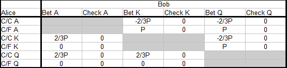
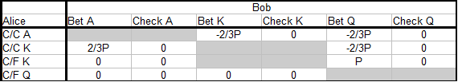

### 13.1 简介

第 12 部分之后停顿了很长时间，但我们继续之前的内容。第 13 部分和接下来几篇文章的主题是单挑底池中的翻牌后下注。我们将采用自上而下的方法，首先讨论合理打法的原则，有时基于理论，有时基于良好的扑克意识和逻辑。然后我们用例子说明这些概念，并讨论如何偏离默认打法来对抗我们有阅读的玩家。

我们将讨论有利位置和不利位置的打法。在这两种情况下，我们都希望有好的默认策略来保护我们免受上帝和激进对手的利用。换句话说，我们希望以平衡的方式玩牌，这样好的对手就不能轻易发现和利用我们游戏中的弱点。当我们训练了这种可靠的默认策略时，我们可以用它们来对抗优秀的玩家和未知的玩家。

这是一种思考扑克策略的好方法。面对能够快速识别和利用漏洞的优秀对手，我们必须考虑如何防御他们的攻击。如果我们不能发现其他玩家的漏洞，那么唯一有意义的事情就是保护自己不被他利用，同时我们试图从桌上较弱的玩家那里赚钱。

当与未知玩家玩牌时，可以假设他们在最低级别时玩得不好，但在中级别和更高级别时则不能这样，因为那里有很多强手。因此，明智的做法是先对未知玩家采用平衡策略，然后我们可以稍后进行调整，以利用通过阅读发现的漏洞。

因此，我们将受益于训练稳固而平衡的默认策略，这些策略部分基于防御，而不是总是试图利用可能存在也可能不存在的弱点（例如，通过大量诈唬，假设我们的对手弃牌太多）。我们应该记住，当我们调整以利用其他玩家的错误时，我们正在偏离平衡的玩法，从而在我们自己的策略中创造漏洞。一个善于观察和思考的对手可以通过这些漏洞攻击我们。大致了解平衡策略是什么样的，使我们能够在情况需要时在剥削性玩法和平衡玩法之间进行切换。

第 13 部分将讨论单挑和有利位置 c-bet 决策。由于我们将涵盖大量内容，我们将把第 13 部分分成多个部分（13a、13b、13c 等）。第 13a 部分将讨论一些基本理论，我们将使用这些理论来构建关于单挑和位置 c-bet 的思考。然后，我们将在以后的文章中应用该理论，并逐渐加深对这种情况下价值下注、诈唬和再次过牌范围的理解。当我们对在有利位置上 c-bet 翻牌圈有了很好的理解后，我们在连续开枪（c-bet 并计划在后续回合继续下注）时也有了基础。连续开枪始于良好的 c-bet！

>barrel 连续下注，连续开火。和持续下注 c-bet 有类似的意思。

由于优秀的玩家会在有利位置上玩大部分加注牌，因此这是一个重要的游戏场景。在翻牌圈 c-bet 太多或用错误类型的牌下注是一种常见的漏洞，会让我们陷入翻牌圈或后续回合的问题中。在第 12 部分中，我们讨论了如何在 PLO 中下注弃牌中等强牌（例如，在 T♦ 6♣ 2♠ 翻牌圈上，Q♥ Q♦ 7♠ 5♦ 这样的牌）以及这通常比随后过牌和玩转牌更好。但是，中等强牌有不同类型，在本文中，我们将使用更细致入微的观点。一些中等强牌最好作为下注弃牌牌来玩，而其他牌则在我们随后过牌时玩得更好。翻牌。

以下两个例子说明了如果我们使用不平衡和静态的 c-bet 策略而不注意对手如何适应我们，我们可能会遇到哪些问题：

**示例 13.1.1 针对假定的紧手对手进行激进的 c-bet**  
\$50PLO 6-max

**Preflop**  
您（\$50）在 BTN 上用 Q♣ 9♥ 7♣ 3♦ 加注到 \$1.50，BB（\$50）跟注。

您尚未收集任何对手的具体解读，但到目前为止，桌上的玩家都打得相当紧，翻牌前和翻牌时都有很多弃牌。因此，您决定在 BTN 上以非常宽的范围加注。您弃掉最糟糕的垃圾牌，如 7♦ 3♥ 2♣ 2♠，但当对手弃牌到您时，您加注大约 80%。在被跟注后，您也非常慷慨地 c-bet，并且您已经拿下了很多底池，而对手在翻牌时都过牌 - 弃牌。

**Flop：** 4♥ 4♦ 2♣（\$3）  
BB (\$48.50) 过牌，您需要做出 c-bet 决定。您完全错过了翻牌，但您的对手可能也错过了，并且您假设他会对您的 c-bet 采取谨慎和直接的打法。因此，您进行了 \$1.50 c-bet 诈唬，BB 过牌加注到 \$4.50，然后您弃牌。

如果您现在不停下来评估手牌，您可能会在未来的牌局中遇到麻烦。您在一手非常干 / 低的翻牌上 c-bet 一手垃圾牌，这手牌几乎同时错过了您的范围和对手的范围。在这些翻牌上，我们预计我们的诈唬会很成功，因此在过牌时，通常要进行大量 c-bet 诈唬，尤其是面对谨慎的对手时。

但这次 BB 过牌加注。这应该会触发警报，因为他翻牌前打得很紧（他不太可能拿到 4 或 22xx），而且到目前为止翻牌后他打得很紧）。我们现在应该考虑他可能已经厌倦了我们松散激进的 BTN 打法，并决定反击。像这样的过牌加注难以击中的翻牌是一种方法。

如果 BB 针对我们在 BTN 上的激进加注和 c-bet 的策略做出了这种和其他合理的调整，那么继续这样做将使我们被利用。我们现在的问题是，当我们翻牌前开出一个宽范围，然后在翻牌后 c-bet 大部分范围时，我们最终会得到一个宽而弱的 c-bet 范围，BB 可以通过各种方式利用这个范围。例如：

- 经常诈唬 - 过牌加注（可能在干翻牌上用任何四张牌）
- 用宽范围过牌 - 跟注翻牌，计划诈唬一些转牌惊吓牌，在转牌后过牌时诈唬一些河牌，在转牌和河牌上过牌时赢得一些未改善的摊牌。

如果我们根据这手牌和未来的牌得出结论，BB 确实对我们做出了调整，我们应该换个方式，收紧。我们应该更紧地开池加注，也少用 c-bet 诈唬。首先，我们不想让自己处于一个非常宽、不平衡和弱的范围，诈唬过多的境地。因为这是我们的对手可以利用的情况，他现在已经决定这么做了。

所以，假设我们考虑到这些因素，换个方式。但由于我们感觉有点脆弱，我们调整得太多了。我们只用最好的牌 c-bet，然后我们用所有不能对抗加注的牌过牌，即我们的中等强牌和所有空气牌。如果对手注意到了我们的所作所为，那么后果会怎样？

**示例 13.1.2 紧的 c-bet 对抗假定的松凶型玩家**  
\$50PLO 6-max

**Preflop**  
您（\$50）在 BTN 上用 Q♠ Q♥ 6♣ 3♦ 加注到 \$1.50，BB（\$50）跟注。BB 是上例中的玩家，我们假设他已经调整以对抗我们之前的松凶型打法。我们通过在翻牌前和翻牌时打得更紧来反击调整，如上所述。这是因为我们担心当我们诈唬或用边缘牌下注时被过牌加注诈唬。

**Flop：** J♠ 7♦ 2♣（\$3）  
BB（\$48.50）过牌，并且您有一个 c-bet 的决定。您在一个相当干的翻牌上翻出了一个平庸的高对，而您通常应该在这里拥有最好的牌。但是由于您害怕被加注，您决定用这手牌和类似的牌随后过牌。您主要希望让这手牌过牌并在小底池中赢得摊牌。

**Turn：** J♠ 7♦ 2♣ 9♦（\$3）  
BB（\$48.50）下注 \$2，您现在做什么？

转牌对我们不利，因为它使得顺子、各种可能的两对组合、同花听牌和顺子听牌成为可能。由于只有一对高牌且没有出牌，我们不能跟注，因此您弃牌。

但是您应该再次考虑继续使用您选择的策略的后果。对已经开始反击您的 BB 进行紧缩是合理的。但是如果您现在开始在错过的每一个翻牌上跟注，生活对您来说不会更轻松。

一个善于观察的对手很快就知道，翻牌后你过牌意味着你很弱。而当你下注时，你很强。所以他不必反击你的 c-bet。他可以安坐其位，只用他最好的牌来防御你强的 c-bet，然后他弃掉所有的垃圾牌。当你过牌后，他可以用垃圾牌 诈唬，尤其是那些可怕的牌，偷走很多底池。他的强牌也很容易对抗你的弱牌范围。

我们再次看到，极端和静态的策略会制造 “漏洞”，善于观察和思考的对手可以通过这些漏洞进行攻击。所以现在我们可以问：

*如果极端松散激进的 c-bet 策略和极端紧缩被动的 c-bet 策略都无法对抗迅速适应我们的对手，那么我们应该如何考虑我们在有利位置的 c-bet 决策？我们能否找到一种无论对手是谁都能发挥良好作用的强势策略，并可将其作为对抗优秀或未知对手的默认策略。*

事实证明，这些强势策略确实存在，在本文的其余部分，我们将讨论如何在我们进行 c-bet 单挑和有利位置的情况下采用这种策略。

到目前为止，我们通过合理的扑克意识和逻辑将寻找强势 c-bet 策略的问题缩小到以下几点：

- 我们不能 100% 地对抗适应能力强的对手
- 所以我们需要过牌一些翻牌
- 但如果我们只过牌我们最弱的牌，我们很容易被阅读和利用。
- 那么 c-bet 和 过牌 的强势默认策略是什么样的？

我们的下一步是转向 AKQ 游戏，这是一个简单的 1 街扑克模型，然后我们解决游戏的底池限注变体，以阐明强 c-bet / 过牌策略单挑和位置的一般形状。然后我们将在未来的文章中使用该策略的一般形式，并使用它来设计我们在 PLO c-bet 中的范围。

以下部分是为了完整性和将来参考而包含的。除非您对数学细节感兴趣，否则您可以跳到本节末尾的解决方案（第 13.2.3 小节）。

### 13.2 以 AKQ 游戏为模型，以底池限注方式进行 PLO 单挑有利位置 c-bet

MISS PIC 图片丢失

- 我们有两名玩家：Alice（不利位置）和 Bob（有利位置）
- 底池大小为 P
- 两名玩家都从 AKQ 牌堆中得到一张牌
- Alice 在黑暗中过牌（不看牌过牌）
- Bob 现在可以过牌并摊牌，或者他 c-bet 2/3 底池。
- 如果 Bob 下注，Alice 可以弃牌，或者她可以跟注并摊牌。
- 下注回合结束时，如果无人弃牌，则最高牌获胜摊牌。

我们只关注 Bob c-bet 决策的 EV，我们不关心谁为起始底池做出了贡献。我们将 Bob 的 c-bet 大小设置为 2/3 x 底池，以使其代表 PLO 中的 c-bet / 过牌决策。在实践中，我们有时下注较少，有时下注较多，但 2/3 x 底池是单挑和有利位置时平均 c-bet 大小的良好估计。

如果 Bob 从不下注，翻牌后不会有钱换手，双方的 EV 都为零。但是当 Bob 有时下注时，情况会发生变化。我们在第 12 部分（我们研究了此模型的固定限制变体）中看到，由于 Bob 的位置和迫使 Alice 以过牌开始的规则，Bob 处于 +EV 情况。我们将在这里看到同样的事情，但由于我们选择的下注大小，游戏的解决方案不同。

我们现在根据所选规则解决此模型游戏。解决游戏意味着找到双方玩家的完整策略以及他们的 EV。我们计算相对于 Bob 的 EV，由于游戏是零和游戏（没有佣金），Alice 的 EV 必须与 Bob 相反（EV（Alice）= -EV（Bob））。

#### 13.2.1 构建一个简化的支付矩阵

我们首先为游戏构建一个支付矩阵。这是一个包含所有可能结果以及玩家在每个结果下的赢利和损失的表格。我们只看摊牌前的价值（仅看因下注而易手的筹码），并计算相对于 Bob 的 EV。

完整的支付矩阵是：

我们使用这些缩写来表示 Alice 的策略

- C/C = 过牌 - 跟注
- C/F = 过牌 - 弃牌

例如，当 Bob 虚张声势地下注 Q 时，他要么输掉 2/3 x 底池的 c-bet（当 Alice 用 A 或 K 跟注时），要么赢得底池 P（当 Alice 弃牌 A 或 K 时），这是他通过过牌无法赢得的。完整的支付矩阵只是 Bob 在游戏中所有可能结果的完整值列表，无论所涉及的策略是好是坏。下一步是消除玩家没有理由选择的主导策略。然后我们减少支付矩阵。

如果我们有两个策略 S1 和 S2，其中 S1 永远不会比 S2 差，有时甚至更好，我们说 S1 主导 S2。我们通过消除试图最大化利润的玩家从未使用的主导策略来简化支付矩阵。我们从 Alice 开始，消除她用 A 弃牌和用 Q 跟注的弃牌。这些策略分别由跟注 A 和弃牌 Q 主导。

然后我们消除 Bob 的主导策略，即下注 K 和过牌 A：

MISS PIC

最后，我们通过删除既自动又不影响 EV 的策略进行最后一次简化。这些是 Alice 用 Q 的检查弃牌和 Bob 用 K 的检查。因此，当我们解决 Alice 和 Bob 的最佳策略的游戏时，我们只需考虑以下子集：

MISS PIC

#### 13.2.2 解决 AKQ 游戏

我们现在通过从数学方程式中推导出 Alice 和 Bob 的最佳策略来解决游戏。Bob 总是下注 A，而 Alice 总是过牌跟注 A，因此，为了完全指定两位玩家的策略，我们需要找出以下内容：

- Bob 用 Q 诈唬的频率是多少？
- Alice 用 K 诈唬的频率是多少？

我们还需要一个定义：

**最佳策略**  
如果我们的对手无法通过改变针对我们的策略来改变她的 EV，我们称该策略为最佳策略。然后她对自己的战略选择变得无动于衷，因为它们都导致相同的 EV，并且她处于战略无动于衷点。

**Bobby用 Q 诈唬的最佳频率**  
当 Bob 用 Q 诈唬时，Alice 当然总是用 A 过牌跟注，但她要用 K 做出选择。她可以拿到最好的牌，也可以被击败，那么她应该跟注还是弃牌？当 Bob 的持续下注策略达到最优时，Alice 应该对跟注或弃牌无动于衷，我们有：

EV_Alice（跟注 K）= EV_Alice（弃牌 K）

Bob 总是下注 A。此外，他有时用 Q 诈唬。让 b 成为 Bob 有 Q 时诈唬的概率。Alice 用 K 跟注的 EV 为：

EV_Alice（跟注 K）= EV（Bob 下注 A）+ EV（Bob 诈唬 Q）

Bob 有一半时间有 A，当 Alice 遇到 A 时，她输掉 -2/3P（请注意，此符号应读作 (-2/3)P 而不是 -2(/3P)）的赌注。Bob 有一半时间有 Q，但只有 b% 的时间下注他有 Q。因此，Bob 诈唬 Q 的概率为 1/2 x b =b/2，Alice 跟注时获胜 +2/3P。

那么 Alice 用 K 跟注的 EV 表达式为：

EV_Alice（跟注 K）  
= EV（Bob 下注 A）+ EV（Bob 诈唬 Q）  
= (1/2)(-2/3P) + (b/2)(+2/3P)  
= -P/3 + bP/3

同样的推理告诉我们 Alice 用 K 弃牌的 EV 表达式（当她让自己被诈唬输掉底池 P 时，如果 Bob 过牌她本可以赢得底池）为：

EV_Alice（弃牌 K）=(b/2)(-P) =-bP/2

现在我们通过将 Alice 用 K 跟注的 EV 设置为等于她弃牌的 EV（这样她就处于无差异点）来找到 Bob 的最佳诈唬频率：

EV_Alice（跟注 K）= EV_Alice（弃牌 K）  
-P/3 + bP/3 = -bP/2  
-1/3 + b/3 = -b/2  
-1 + b = -3b/2  
b + 3b/2 = 1  
b(1 + 3/2) = 1  
b(5/2) = 1  
b = 1/(5/2)  
b = 2/5  

我们得出结论，当 Alice 有 Q 时，他应该有 2/5 = 40% 的时间诈唬

**Alice 用 K 的最佳跟注频率**  
我们对 Alice 使用类似的方法。当 Alice 发挥最佳水平时，她跟注的频率如此之高，以至于 Bob 对用 Q 跟注或诈唬变得漠不关心。这为 Bob 定义了一个无差异点，我们有：

EV_Bob（诈唬 Q）= EV_Bob（跟注 Q）

Bob 用 Q 跟注的 EV 为 0，因此我们只需要找到 Bob 用 Q 诈唬时的 EV 表达式：

EV_Bob（诈唬 Q）  
= EV（Alice 跟注 A）+ EV（Alice 跟注 K）+ EV（Alice 弃牌 K）

此表达式中的第一个项只是 Alice 有 A 的概率（50%）乘以 Bob 被跟注时的损失（-2/3P）。

EV（Alice 跟注 A）=(1/2)(-2/3P)

对于涉及 Alice 用 K 跟注和弃牌的两个项，我们让 c 表示她跟注的概率。那么她弃牌的概率为 (1-c)。当 Alice 用 K 跟注时，Bobby输掉 -2/3P。当 Alice 弃牌 K 时，Bob 用他的虚张声势赢得了 P 底池。EV 表达式中的最后两个项变为：

EV（Alice 跟注 K）= (1/2)(c)(-2/3P)

EV（Alice 弃牌 K）= (1/2)(1 - c)(P)

我们得到：

EV_Bob（诈唬 Q）  
= EV（Alice 跟注 A）+ EV（Alice 跟注 K）+ EV（Alice 弃牌 K）  
= (1/2)(-2/3P) + (1/2)(c)(-2/3P) + (1/2)(1 - c)(P)  
= -P/3 - Pc/3 + P/2 - Pc/2  
= -2P/6 - 2Pc/6 + 3P/6 -3Pc/6  
= -2P/6 + 3P/6 -2Pc/6 - 3Pc/6  
= P/6 -5Pc/6  
= (1/6){P - 5Pc}

最后，我们通过将 Bob 诈唬的 EV 设置为等于他的过牌 EV（为 0）来找到 Alice 的最佳跟注频率：

EV_Bob（诈唬 Q）= EV_Bob（过牌Q）  
(1/6){P - 5Pc} = 0  
P - 5Pc = 0  
1 - 5c = 0  
5c = 1  
c = 1/5

我们得出结论，Alice 应该在她有 K 的 1/5 = 20% 的时间里跟注。

#### 13.2.3 AKQ 游戏的完整解决方案

**Alice**  

- 总是用 A 过牌跟注
- 1/5 = 20% 的时间用 K 过牌跟注
- 总是用 Q 过牌弃牌

**Bob**  

- 总是用 A 下注以获得价值
- 总是用 K 过牌
- 2/5 = 40% 的时间用 Q 诈唬

最后一步是计算我们刚刚找到的最佳策略对的 Bob 的 EV：

#### 13.2.4 AKQ 游戏的价值（Bob 的 EV）

现在我们让 Alice 和 Bob 使用他们的最佳策略对抗对方，然后我们计算 Bob 的 EV。问题可以分为六个部分，我们计算以下每种情况下 Bob 的摊牌前价值：

- Alice 有 A 而 Bob 有 K
- Alice 有 A 而 Bob 有 Q
- Alice 有 K 而 Bob 有 A
- Alice 有 K 而 Bob 有 Q
- Alice 有 Q 而 Bob 有 A
- Alice 有 Q 而 Bob 有 K

所有情况都同样可能，概率为 1/6。我们首先计算每种情况对 Bob EV 的贡献，然后通过将所有贡献相加来找到他的总 EV：

**情况 1：Alice 有 A 而 Bob 有 K**  

EV1 = (1/6)(0) = 0

Bob 总是在后面过牌，并且没有下注。

**场景 2：Alice 有 A，Bob 有 Q**  

EV2  
= (1/6){EV（Bob 诈唬）+EV（Bob 过牌）}  
= (1/6){(2/5)(-2/3P) + (3/5)(0)}  
= (1/6){-4P/15}

Bob 2/5 的时间都在诈唬，剩下的 3/5 的时间都在过牌。当他对 A 诈唬时，他总是输掉 -2/3P。当他过牌时，他什么都不输。

**场景 3：Alice 有 K，Bob 有 A**  

EV3
= (1/6){EV（Alice 跟注）+EV（Alice 弃牌）}  
= (1/6){(1/5)(2/3P) + (4/5)(0)}  
= (1/6){2P/15}

Bob 总是下注。Alice 有 1/5 的时间跟注，Bob 赢得 2/3 P。她有剩余的 4/5 的时间弃牌，Bob 一无所获。

**场景 4：Alice 有 K，Bob 有 Q**  

EV4  
= (1/6){EV（Bob 诈唬）+EV（Bob 过牌）}  
= (1/6){(2/5){(1/5)(-2/3P) + (4/5)(P)} + (3/5)(0)}  
= (1/6){-4P/75 + 4P/5}  
= (1/6){-4P/75 + 60P/75}  
= (1/6){56P/75}

Bob 2/5 的时间诈唬，其余 3/5 的时间过牌。在他诈唬的那些时间里，Alice 有 1/5 的时间跟注，Bob 输掉 -2/3P。她有 4/5 的时间弃牌，Bob 赢得底池 P。当 Bob 过牌时，他既不赢也不输。

**场景 5：Alice 有 Q 而 Bob 有 A**  

EV5 = (1/6)(0) =0

Bob 总是下注，Alice 弃牌 Q，没有钱易手。

**场景 6：Alice 有 Q 而 Bob 有 K**  

EV6 = (1/6)(0) = 0

Bob 总是回头检查他的 K，没有钱易手。

**Bob 在本场比赛中的总 EV**  

我们将 6 个 EV 贡献相加，得出 Bob 的总 EV：

Bob 的 EV  
= EV1 + EV2 + EV3 + EV4 + EV5 + EV6  
= 0 (1/6){-4P/15} + (1/6){2P/15} + (1/6){56P/75} + 0 + 0  
= (1/6){-4P/15 + 2P/15 + 56P/75}  
= (1/6){-2P/15 + 56P/75}  
= (1/6){-10P/75 + 56P/75}  
= (1/6){46P/75}  
= 23P/225

Bob 从其最佳持续下注策略中赚取了 23P/225 =0.102P。他的 EV 随着底池大小 P 线性增长，因此起始底池越大，对 Bob 越有利。

这种情况的一个明显类比是当弱而被动的玩家在不利位置玩大量大底池时会发生什么，例如通过平跟大量 3-bet。在不利位置与优秀玩家打出弱平跟范围非常困难，而且底池越大，情况就越糟（如果翻牌后筹码仍然相当深）。尤其是如果不利位置的玩家习惯性地向翻牌前进攻者过牌并让他决定游戏。

然后，处于有利位置的玩家可以轻松地建立一个 c-bet 范围，其中价值下注（对应于 AKQ 游戏中的 A）和诈唬（对应于 AKQ 游戏中的 Q）的比例保持平衡，然后他过牌并用中等强度的牌（对应于 AKQ 游戏中的 K）拿一张免费牌，这些牌太弱而无法进行价值下注，但又太强而无法变成诈唬。

我们将在以后的文章中看到，处于不利位置的玩家有时可以通过在翻牌圈下注来让自己更轻松，但处于不利位置的玩家仍然很难玩好。

#### 13.2.3 AKQ 游戏的 PLO 解释

我们引入了一个模型，用于在翻牌单挑时在位置上进行 c-bet，该模型的最佳解决方案是

**Alice**  

- 总是用 A 过牌 - 跟注
- 1/5 =20% 的时间用 K 过牌 - 跟注
- 总是用 Q 过牌 - 弃牌

**Bob**  

- 总是用 A 下注以获得价值
- 总是用 K 过牌
- 2/5 = 40% 的时间用 Q 诈唬

EV(Bob) = 23P/225

请注意，在我们的模型中，Alice 被迫以过牌开始下注回合。当我们将此模型应用于真实扑克时，当不利位置的玩家通常过牌时，它将发挥最佳效果。由于不允许 Alice 过牌 - 加注，因此当不利位置的玩家很少过牌 - 加注时，该模型将发挥最佳效果。

该模型的另一个限制是，只有一条下注街（或者说是 1/2 条街，因为 Alice 不能下注），手牌价值是固定的。在真正的扑克游戏中，我们还必须担心被加注，并且必须考虑手牌价值发生变化的未来几条街的玩法。

但是我们可以从这个简单的模型中提取一些基本概念：

- Bob 有三个范围：一个强价值下注范围，一个中等强的过牌范围，以及一个弱的空牌范围，他从中挑选诈唬牌。
- Bob 使用的价值下注 / 诈唬比率是下注大小与底池大小的函数。确切地说，Bob 的 c-bet 的价值 / 诈唬比率与 Alice 跟注的底池赔率相同，即 5 ：2。他下注 100% 的价值牌和 40% 的空气牌，比率为 100 ：40 = 5 ：2。他诈唬的概率与 Alice 因抓诈唬而获得的底池赔率相同，她对用她的抓诈唬牌 (K) 跟注或弃牌变得没有影响（indifferent）。
- Alice 用她的抓诈牌跟注足够多，以阻止 Bob 用他所有的空气牌作为诈唬而获利，而 Bob 变得对诈唬或不诈唬无动于衷（因为他的诈唬牌正好打成平手）。但她弃牌了足够多的抓诈牌，以避免被 Bob 的价值牌压死。

Bob 的下注策略遵循扑克中众所周知的强度原则：

- 用你最好的牌下注以获得价值
- 过牌那些太弱而不能下注以获得价值的牌
- 用你最弱的牌，有时诈唬，否则过牌。

因此，当我们玩 PLO 并想使用平衡的 c-bet 策略对抗优秀或未知的玩家时，我们可以从将我们的总范围分成三组开始，从上到下：

- 价值牌
- 随后过牌的牌
- 空气牌

**价值牌**  
我们下注的最好的牌，期望从被加注或跟注中获利。当您尝试建立强大的默认 c-bet 策略时，让大多数价值牌成为您计划 3-bet 或跟注以对抗 c-bet 的牌。简单来说：您的价值牌是您乐于用其玩大底池的牌。

以下是一些在单次加注且有 100 bb 筹码的单挑中明显的价值牌：

J♠ J♣ 7♠ 2♦ 在翻牌 J♥ 9♥ 6♦（顶三条）  
A♥ K♦ Q♠ T♦ 在翻牌 A♠ K♦ J♠（坚果顺子 + 顶两对）  
K♠ T♦ 9♦ 8♠ 在翻牌 K♦ 7♥ 6♦（标准牌 + 13 出坚果牌 + 非坚果同花听牌）

所有这些牌都很容易对抗加注。顶三条总是可以高兴地全押，同样，对于有再听的坚果顺子也是如此（即使我们有时会遇到有更好再听的相同顺子）。而对子 + 顺子 + 同花的组合听牌也将对对手向我们发出的所有牌（包括我们难以控制的一些听牌）具有神级权益。

**跟注手牌**  
您通常会在翻牌圈持有中等强度的手牌 / 听牌，这些手牌可能是最好的，或者至少在落后时有一些不错的出牌，但它们不足以在翻牌圈全押或跟注加注。由于这些手牌可以通过看转牌获得价值，因此它们是适合随后过牌的好手牌。我们有更好的诈唬候选者（较弱的手牌，在下注 - 弃牌以对抗加注时不会放弃太多权益）。我们有更好的手牌可以全押或下注跟注对抗加注。

但是，我们需要在中等强度的手牌组中做出重要区分。一些中等强度的手牌更适合作为下注手牌，我们下注主要是为了让对手弃牌（我们下注以保护我们的手牌）。其他中等强度的手牌在我们跟注并用它们玩转牌时玩得更好。

以下是一些在翻牌圈后跟注的候选牌：

T♠ 9♥ 8♦ 3♠ 在翻牌 J♠ 7♦ 2♣（内嵌坚果包牌 + 后门同花）  
J♣ 9♦ 7♦ 4♥ 在翻牌 Q♠ 8♦ 4♣（坚果卡顺 + 对子）  
6♥ 5♥ 4♦ 3♦ 在翻牌 Q♥ 9♥ 8♥（低同花听牌）

两张顺子牌是与对手愿意用来玩大底池的牌对抗时会很吃力的牌。最好的牌（内坚果包）可以下注，计划是跟注加注并玩转牌（如果筹码相当深，并且我们也会在未来的几轮中诈唬），而弱卡顺 + 对子组合面对加注应该默认弃牌。

对于这些类型的牌（手牌 / 听牌组合，带有少量好牌），重要的是，当我们下注 - 弃牌时，我们会放弃很大一部分权益。我们不想继续对抗加注，但很多转牌会帮助我们，要么让我们获得最好的牌，要么给我们很好的诈唬机会（通常是当一张惊悚牌出现并且对手再次过牌时）。我们希望看到这种牌的转牌，而过牌翻牌可以让我们到达那里。

对于同花，下注以获得价值可能很诱人，但在这样做之前，我们必须考虑当对手愿意玩大底池时，他能给我们什么行动。这主要是更大的同花。即使我们现在几乎总是有最好的牌，这也不足以成为下注以获得价值、计划投入筹码的好理由。我们还必须考虑当筹码投入时谁拥有最好的牌，不幸的是，这主要是对手。

我们可以不押注价值，而是用同花跟注，计划跟注转牌下注。如果对手不下注，我们可以选择押注价值，或者再次使用跟注线，计划跟注河牌下注。坐在跟注的玩家后面，我们都有很好的选择。

请注意，我们跟注的牌是可以在很多转牌上继续的牌，如果对手下注的话。这是一个重要的观点，我们稍后会详细讨论。当我们在翻牌上跟注时，我们是在告诉对手我们的范围很弱。一个激进和投机取巧的玩家经常会利用这些信息来对付我们，并在很多转牌上诈唬，期望经常成功。

我们不能让如此有价值的信息就这样泄露，因此，重要的是我们要考虑用可以玩转牌的牌跟注。根据定义，这些牌是具有许多补牌的牌（如果我们有一手在翻牌时很少最好的牌）或不惧怕许多转牌的牌（如果我们有一手在翻牌时可能最好的牌，但我们不一定想用它玩大底池）。

**空气牌**  
无法下注以获得价值且从转牌中获利不多的牌是空气牌。空气牌是诈唬的候选牌。任何让你一眼就 “吓到” 的牌都可以用作诈唬，但重要的是，我们不要默认对所有候选牌都诈唬（尽管有些玩家让我们在某些翻牌上侥幸逃脱）。当我们使用平衡的默认策略时，我们希望诈唬的力度刚好足以让对手意识到我们下注时可能在诈唬，但不要太多以至于他会立即从大量跟注或反击中获利。

如果他现在试图通过弃掉大量抓诈牌来逃避我们的价值牌，他会因为我们的诈唬而失去更多底池。如果他试图通过大量跟注或再次诈唬来惩罚我们的诈唬，他会因为我们的价值牌而失去更多价值。由于我们的价值下注和诈唬范围是平衡的，因此对手几乎无法阻止我们通过下注获利。他所能做的就是用自己合理平衡的范围来保护自己，将损失降至最低。

以下是一些诈唬的候选者：

Q♣ J♥ T♦ 9♦ 在翻牌 K♠ 7♦ 5♣（干燥牌面的空气牌）  
A♦ K♥ J♣ 9♣ 在翻牌 T♦ 6♦ 2♦（同花牌上的坚果同花阻断牌）  
6♠ 6♦ 5♠ 5♣ 在翻牌 9♦ 7♦ 2♠（非坚果卡顺 + 后门同花）（原书笔误）

当我们诈唬时，原则上我们可以使用任何无价值的牌，但使用最差牌中最好的牌永远不会有坏处。这也有助于关注翻牌结构以及对手的范围如何可能击中翻牌。

在第一个翻牌上，我们什么都没有，而且还有更糟糕的听牌，但翻牌很干涩，很难击中。在第二个翻牌上，我们有坚果同花阻断者，这给了我们一些有趣的机会。首先，对手现在不能有坚果同花，所以被过牌加注的概率已经降低了（即使有低同花，对手也应该警惕过牌加注）。如果他跟注，我们就可以考虑未来几轮的选择。我们可以继续诈唬，希望他放弃他的低同花和任何更弱的牌，或者我们可以过牌并放弃。如果对手继续过牌给我们，这对他来说很谨慎，因为他没有坚果或坚果听牌，我们在有利位置上有很多好的选择。

在最后一个翻牌上，我们的听牌很弱。当我们看到中等强牌时，我们过牌了很多听牌，那么我们在这里应该按照同样的方式思考吗？不，因为我们这里的听牌太弱了，无法玩转牌。当我们击中顺子时，我们并不是坚果牌，而且我们还可以凭借同花牌组成顺子（或者河牌上可能出现同花）。

当你的听牌很弱，以至于即使击中了也不想跟注转牌下注时，你就没有适合在翻牌圈过牌以获得价值的牌。另一方面，即使是最弱的听牌，在翻牌圈跟注时也会赢得一些底池。因此，如果你可以选择在 6♠ 6♦ 5♠ 5♣ 诈唬和在翻牌圈 9♦ 7♦ 2♠ 上用 T♣ 5♣ 3♠ 3♥ 等完全垃圾牌诈唬，你会更喜欢前者。这为你在跟注时提供了一些逃生通道，你将赢得更多的底池。换句话说，用非常弱的听牌诈唬比用完全垃圾的诈唬更占优势。

如果对手弃牌或过牌加注，你有什么牌并不重要，而且无论如何，你也不会因为弃掉这种弱听牌而对过牌加注感到不高兴。如果你的牌力很弱，无法跟注或价值下注，那么在下注 - 弃牌时你不会牺牲太多的价值，因为即使你打出了期望的牌，也很难通过摊牌赚钱。但是当你的牌力提高时，你会赢得一些小底池，所以当你被跟注时，这手牌还是有一点价值的。

### 13.3 关于 PLO 中中等强牌的重要概念

最后，我们将稍微扩展一下与 PLO 中中等强牌的定义有关的概念，以及它与 NLHE 中相应的定义有何不同。

我们在第 12 部分中讨论了这个问题，我们使用建模来说明在 PLO 中，远远领先 / 远远落后的牌对我们的影响比在 NLHE 中小。例如，在 A♠ 9♥ 2♥ 翻牌上用 K♠ K♥ 4♣ 3♦ 随后过牌。

在 NLHE 中，我们可以在这样的翻牌上用 KK 过牌，计划在小底池中摊牌（如果对手在转牌和河牌下注，则过牌或至少跟注一次）。这个计划称为 “WA / WB 线路”。

在 PLO 中，这种做法效果不佳，原因如下：

- 有了 4 张起手牌，对手已经领先的可能性很大，因此翻牌后跟注的诱惑力较小。
- 如果他没有打败我们，如果我们在翻牌时给他一张免费牌，他很有可能会拿到听牌或拿到好牌反超我们。
- 即使我们应该有最好的牌，如果我们下注并且对手知道我们有什么牌，他应该跟注对手范围内的许多第二好牌。但由于他不知道我们有什么牌，他通常会弃牌。这是扑克基本定理的错误，我们从中获利。例如，6♠ 5♦ 4♦ 2♠ 在翻牌 A♠ 9♥ 2♥ 上，他有 11 张三条 / 两对的出路，还有一些后门可能性。因此，如果他知道我们只有一对中等的低对，他将有足够的底池赔率来跟注并听到更好的牌。

对于我们稍好一些的牌，例如 A♠ 7♦ 6♦ 4♣（原书笔误）在 A♠ 9♥ 2♥ 翻牌上的情况也是如此。在 NLHE 中，我们会在这些干翻牌上用 A3 这样的牌过牌，因为我们是 WA / WB，几乎没有被反超的风险。NLHE 中的翻牌过牌可以控制底池大小，并让我们轻松赢得小 / 中等底池，这是这种翻牌最适合的打法。

但是在 PLO 中，如果 A♠ 7♦ 6♦ 4♣ 在 A♠ 9♥ 2♥ 翻牌上，这手牌太弱了，无法过牌并玩转牌，即使它在翻牌上通常是最好的。干燥翻牌上顶对似乎有点自相矛盾，所以让我们运用逻辑：

如果我们在翻牌后过牌，计划玩转牌（包括在下注时跟注），我们乐意看到哪些牌？任何 7、6 或 4 的两对牌都会改善我们的牌力，但只是轻微的改善。我们仍然落后于三条和顶两对，我们所有的两对牌都在牌面上放了顺子听牌，有时还有我们没有的同花听牌。所以在改进到两对后，我们不能乐意玩大底池。我们可以改进到三条，但我们仍然落后于葫芦和更好的三条，所以我们在那里有同样的问题。大多数其他不能改善我们的转牌要么面上有听牌，要么让较弱的牌领先。

所以如果我们在翻牌后过牌，而对手在转牌后下注，我们几乎永远不会高兴。当我们至少在某些转牌上不能用我们的过牌牌愉快地玩大底池时，我们几乎没有理由过牌。通常，我们最好将这手牌视为 “PLO 空气牌”。然后，我们将 A♠ 更多地视为对抗其他顶对 / 两对牌的阻断牌，而不是对抗对手给我们行动范围的有价值的牌。

因此，我们可以在 A♠ 9♥ 2♥ 翻牌上下注 A♠ 7♦ 6♦ 4♣ 来保护我们的手牌，并让对手放弃一些他本应该继续的牌，如果他知道我们手中的牌的话。这是一个典型的下注 - 弃牌 - 边缘手牌情况，我们在 PLO 中经常看到。如果你想在这个翻牌上用顶对牌过牌，你有许多更好的候选牌可供选择。

你可以用类似的思路来思考，比如 J♦ 8♦ 4♣ 翻牌上的 K♠ Q♠ Q♥ 2♦ 牌，以及 9♦ 7♦ 4♣ 翻牌上的 A♣ 8♣ 7♥ 4♥ 等平庸的两对牌。下注并希望对手弃牌。如果他过牌加注，请毫不后悔地弃牌，如果他跟注，你必须在以后的回合中打好扑克。

### 13.4 总结

在第 13a 部分中，我们为理解翻牌圈位置平衡的持续下注策略奠定了理论基础。我们讨论了基于良好扑克意识 + 逻辑和情况数学模型的持续下注原则。我们还简要讨论了如何在实践中设计价值下注、过牌和虚张声势的范围。

在第 13b 部分中，我们将从更实际的角度看待持续下注，并定义一个程序来训练我们在各种翻牌结构上建立合理范围的能力。
