## 第 7 部分：磨练低级别 PLO

### 7.1 简介

我们在第 6 部分结束了对翻牌前理论的讨论，我评论说第 7 部分及以后的内容将讨论翻牌后玩法。但在此之前，我们将暂时放下理论，用一篇文章来讨论：

- 本系列文章的实践部分（从 \$5PLO 到 \$200PLO 建立资金）
- 低级别 PLO 玩家池
- 各种翻牌前和翻牌后 HEM 统计数据的合理价值范围
- 如何为 PLO 6-max 设计一个简单的 HoldemManager (HEM) HUD

碰巧的是，自从第 6 部分发布以来，我已经从一个巨大的 HEM 数据库中获得了统计数据。这个数据库是由我的一个朋友建立的，她在过去 4 个月里一直在努力打低级别游戏。她于 2010 年 1 月开始打 PLO25，资金为 50 BI（\$1250），在撰写本文时（2010 年 4 月），她即将升至 PLO200。她的计划是先在这里将资金积累到 100 BI，然后再转到 PLO400。

我们的朋友（将保持匿名）购买了数据挖掘的手牌历史，并建立了一个低级别 PLO 数据库，其中包含数百万手牌，包括 PLO25、PLO50 和 PLO100。有些人认为这是可以接受的，有些人（大多数扑克网站都属于其中）认为这是不可接受的，但我们不会在这里讨论这种做法的道德问题。

有意思的是，我们那位玩世不恭的朋友让我们可以使用数据库来进行一些关于低级别玩家池的统计分析。我提到过，我很想知道更多关于低级别的总体情况。自从我玩低级别以来已经有一段时间了，而且在我自己学习游戏的时候，我没有在低于 PLO100 的级别打过 PLO，所以我对这些级别了解不多。我也有兴趣估算一些常见的 HEM 统计数据，如VP\$IP、PFR%、3-Bet%、WTSD% 等在低级别条件下的合理值。

当我们的朋友听到这个消息时，她提出从她的数据库中提取信息，以便我们使用。我很高兴地接受了这个提议，并决定根据这个分析写一篇文章。到目前为止，我们已经经历了很多深奥的理论，所以我们可以稍事休息，讨论更实际的事情，然后再讨论翻牌后理论。

所以第 7 部分的目的是讨论磨练低级别 PLO，通过从大型数据库中提取信息来研究这些级别下的玩家池，并展示如何为 HoldemManager 设计一个简单的 PLO HUD。

### 7.2 本系列文章的实践部分

在对数据库进行统计分析之前，让我们简单谈谈 “从头开始学习 PLO” 系列文章的资金建设项目。

我们记得从第 1 部分开始，我们为本系列文章定义了一个资金建设项目。我们在 PLO5 级别从 50 BI（\$250）开始，我们的目标是建立足够大的资金以升级到 PLO200。

我们使用一种称为 “50 + 10” 的晋级方案。这意味着我们在当前级别下至少要有 50 个买入，然后只要在此基础上有至少 10 个下一个级别买入的情况下，我们就可以尝试下一级别。例如，我们从 PLO5 开始，拥有 50 个买入，然后在 PLO10 中积累 10 个买入（\$100）并尝试一次。如果我们输掉了这 10 个买入，我们就回到 PLO5，再次积累 10 个买入，反复进行。这样，我们总是至少有 50 个买入来应对当前级别的游戏，然后才会以有控制的方式尝试更高级别的游戏。

这给出了以下进展。

- **\$5PLO 到 \$10PLO：** 在 \$5PLO 磨练 20 BI（\$100），并将资金积累到 50 + 10 BI（\$350），以尝试 \$10PLO。
- **\$10PLO 到 \$25PLO：** 在 \$10PLO 磨练 40 BI（\$400），并将资金积累到 50 + 10 BI（\$750），以尝试 \$25PLO。
- **\$25PLO 到 \$50PLO：** 在 \$25PLO 磨练 40 BI（\$1000），并将资金积累到 50 + 10 BI（\$1750），以尝试 \$50PLO。
- **\$50PLO 到 \$100PLO：** 在 \$50PLO 磨练 35 BI（\$1750），并将资金积累到 50 + 10 BI（\$3500），以尝试 \$100PLO。
- **\$100PLO 到 \$200PLO：** 在 \$100PLO 磨练 35 BI（\$3500），并将资金积累到 50 + 10 BI（\$7000），以尝试 \$200PLO。

如果第一次尝试时所有尝试都成功，我们必须努力获得 20 + 40 + 40 + 35 + 35 = 170 BI。如果我们（有点武断地）假设平均赢率为 7.5 ptBB / 100（ptBB = 2 x 大盲注），我们平均每 1000 手牌将获得 1.5 BI。所以我们必须至少玩 170 /（每 1000 手牌 1.5）= 113,000 手牌。

那么从一开始，我们的资金建设项目发生了什么？这可以用一句话来概括：*来回重复了两次*。我在撰写第 2 部分和第 3 部分（2009 年 10 月至 11 月）时努力完成了 PLO5 和几乎所有 PLO10，计划是在转到 PLO25 之前撰写有关这些限制的博客。

但是，2009 年 12 月，我的电脑崩溃了（圣诞快乐！），桌面硬盘上所有未备份的内容（包括文章系列文章的数据库和手牌历史）都丢失了。这有点烦人，所以我暂停了一段时间，转而专注于撰写理论文章。现在，该系列文章的翻牌前部分已经完成，现在是重新开始写作的好时机。如果一切顺利，我应该能够同时完成资金建设项目和剩余的理论文章。因此，接下来几个月的计划是同时完成这两个部分，然后以总结结束该系列文章。这可能将在 2010 年夏季的某个时候发生。

该系列文章实践部分的挫折表明事情并不总是一帆风顺的，你必须预料到一路上会出现问题（如果有的话，这是一种良好的扑克心态）。但也有好的一面。丢失数据库并重新开始让我有机会调整我的微限制策略。我在博客 2 中为资金建设项目写道，我想最大化胜率（不一定是每小时收入）而不是交易量。换句话说，高度集中精力玩几张桌子，并尝试从每张桌子上榨取每一滴价值。

事后看来，我发现这个攻击计划对于微级别来说有点过头了。在 PLO5 和 PLO10 上磨练了几千手牌并评估了微级别对手的质量后，我得出结论，最好追求高交易量（打牌手数）。花费大量时间和精力研究单个微级别对手以找到并利用他们最大的个人漏洞根本是无效的。

让我解释一下我的意思：

假设你坐在一张桌子上，桌上有 1 个已知的大鱼、1 个未知的和 3 个扎实的常客。这在中高赌注的桌子上很常见，因为那里有很多常客和很少的大鱼。所以当你发现一张桌子上有一条已知的大鱼时，你会想和他打牌（可能没有太多更好的桌子了）。你在这张桌子上的计划应该是最大限度地利用这条鱼，同时试图与其他常客打成平手（我们假设他们和你一样好）。

为了使这个计划成功，你需要注意桌子上的每一个玩家并收集阅读。你必须惩罚这条鱼犯的错误，同时你需要防御其他常客惩罚你的错误的企图。你还必须密切关注桌子上的未知玩家，并尝试快速对他进行分类，这样你就可以开始制定对付他的策略。在这张牌桌上所做的努力可以带来巨大的回报，既可以立即获得（通过利用鱼），也可以在以后的游戏中获得（因为您期望再次遇到许多这样的玩家，尤其是常客）。

但在微级别游戏中，事情会更简单，原因如下：

- 您会遇到很多大鱼，因此您无需最大限度地利用所有大鱼即可获得高胜率。
- 您会遇到一些需要防御的稳定常客
- 您很少会在以后的游戏中遇到相同的玩家

因此，即使集中精力玩几张牌桌的磨练策略可以让您在微级别游戏中获得天文数字般的胜率，您也可以通过玩稳定的 ABC 扑克而不过多关注阅读来获得非常好的胜率。换句话说：标准的稳定 ABC 扑克会严厉惩罚微级别玩家犯下的大错误和频繁错误，从而让您获得高胜率。

在更高级别游戏中，集中精力玩游戏可能意味着输赢之间的差异。但在微级别游戏中，这更有可能意味着优秀玩家的高胜率和非常高的胜率之间的差异。此外，当玩家池非常大时，收集阅读的价值会降低，因为你不会在未来的很多回合中与相同的玩家对战。因此，在胜率略有降低的情况下玩更多的牌桌会更有效。这意味着我们希望最大化我们的小时工资，而不是胜率（以 bb/100 为单位）。

例如，在 8 张微级别牌桌上玩 ABC 扑克，您可以轻松地赚到 10 bb/100（例如，每 1000 手 1 bI）。每小时每桌玩 70 手，我们的小时工资是：

(10 bb/100 手) x (560 手/小时) = 56 bb/小时

也许您在 4 张牌桌上全神贯注地玩牌时可以赚到 15 bb/100（例如，4 x 70 = 280 手/小时），但小时工资会下降到：

(15 bb/100 手) x (280 手/小时) = 42 bb/小时

以 bb/100 中最高的获胜率进行游戏是可取的，因为这会降低您的波动并为您提供更线性的利润曲线。但即使你能做到 15 bb/100，10 bb/1000 仍然是一个非常好的赢率，而且你现在每小时可以多赚 (56 - 42) / 42 = 0.33 = 33%，因为你玩的牌桌数量是原来的两倍。

这些具体数字当然是随机得出的。但总会有一个最佳点（数量和赢率之间的折衷）可以最大化你的时薪。在特定限制下最大化时薪不一定是对你长期最有利的，因为你可能会通过玩更少的牌桌和最大化你的赢率学到更多（并为更高的限制做好准备）。但在微级别下，我现在认为最好的策略是简单地练习 ABC 游戏，最大化你的时薪，并尽快离开那里。然后，当你达到低级别时，你可以采取下一个战略步骤，在那里你会找到更多的常客。在微级别上花费的时间越少越好，快速查看一下你每手牌支付的佣金，你就会相信这是正确的。

因此，当我本月（2010 年 4 月）再次开始积累资金时，我会玩更多桌子（可能 8 张）。除了坐在桌子旁时自动获得的信息外，我不会试图收集对手的非常详细的信息。不过，我对新玩家的建议是，他们从几张桌子开始，这样他们就有时间仔细考虑他们的决定。但是，当你熟练掌握 ABC 扑克时，最好追求数量并快速摆脱微级别。使用 ABC 策略摆脱微级别将为你提供宝贵的实践，这些实践将在以后派上用场。许多标准线路和标准思维 / 规划方式将变得自动化，这会让你的大脑在需要时思考更困难的事情。然后，当你达到更高的级别时，你会遇到更有思想的对手，你可以减少决策过程的数量并增加其复杂性。

### 7.3 对低级别 PLO 玩家池的简单统计研究

正如介绍中提到的，我最近获得了一个大型低级别 PLO 数据库的统计数据，该数据库包含约 1500 万手 PLO25、PLO50 和 PLO100 的近期牌局。我脑海中立即浮现出几个问题：

- 低级别玩家中有多少比例是认真的常客，其中有多少人只是漫无目的地乱玩？
- 他们中有多少人是赢家？
- 低级别的佣金是多少，佣金的总体影响是什么？

通过挖掘这些问题的答案，我们可以开始对低级别 PLO25 到 PLO100 的条件形成一个总体概念。我们也许可以得出一些结论，关于如何才能成为赢家。我们还将了解典型的低级别 PLO 玩家及其表现。

在我们开始工作之前，这里有一个免责声明：

*本文中所做的分析工作并非旨在鼓励任何人违反他们所玩的扑克网站的规则。如果使用数据挖掘的手牌历史违反了您网站的规则，您有责任遵守规则，或者承担违反规则的后果，如果您这样做并被抓住。*

本文中所做的工作具有非常普遍的性质，我们试图提取有关整个低级别 PLO 玩家池的信息。我们不分析个别玩家的玩法。因此，我认为这种使用数据挖掘的手牌历史在道德上是可以接受的。建立这个数据库的玩家当然有其他原因这样做，但这是她的责任，而不是我们的责任。我们只是利用分析数据的机会得出关于低级别玩家池的一般结论。

#### 7.3.1 有关数据库的事实

- 在 PLO25、PLO50 和 PLO100 上收集了大约 1500 万手牌
- 92469 名不同的玩家
- 所有手牌均来自同一手牌历史提供商
- 所有手牌历史均在 2010 年 1 月 1 日至 2010 年 4 月 16 日期间在同一扑克网站上收集。

因此，我们在 3.5 个月的时间内从 3 个低级别 PLO25、PLO50 和 PLO100 中抽取了 1500 万手牌样本。由于所有手牌均在同一网站上进行，我们预计许多玩家在这些级别之间移动，但我们的数据库中有 92469 名不同的玩家。

#### 7.3.2 赢家和输家的分布情况如何？

我们直接从数据库中提取这个数字。我们将赢家定义为胜率至少为 0 bb/100 的玩家，我们得到：

赢家：24212 (26%)  
输家：68257 (74%)

在我们的数据库中注册的玩家中，大约四分之一的人已经获利。在线扑克世界中赢家和输家的真实分布尚不清楚，但我们预计大多数玩家都会输。我们的数据证实了这一点。

#### 7.3.3 典型的低级别 PLO 玩家的玩牌量是多少？

我们首先要调查的是玩家池是如何根据玩牌数量进行分配的。一些常客会在同一个级别内连续玩几个月，而一些业余玩家会玩一两局，然后离开，再也不回来。

在开始分析之前，我想提醒您，我们拥有的只是一个样本。但我们假设所有玩家在数据库中记录的手牌百分比相同，因此我们可以比较不同玩家玩牌的数量。换句话说，如果玩家 1 在数据库中有 5000 手牌，而玩家 2 有 1000 手牌，我们将假设玩家 1 玩牌的数量是玩家 2 的 5 倍，即使我们在数据库中只有他们手牌的样本。

我们注意到这些手牌是在 3.5 个月的时间内收集的，因此数据库中的大多数玩家都有足够的时间玩很多手牌（如果他们愿意的话）。因此，如果我们发现很多玩家玩牌数少于 100 手，那么我们可以非常肯定地得出结论，他们玩牌不多。当然，理论上他们可能玩了很多未记录在我们数据库中的牌，但这在几个月内不太可能发生。也可能是这些玩家刚刚开始玩牌（即他们还没有时间记录很多牌）。但如果有很多玩家，这种情况就不太可能发生，因为我们预计新玩家的涌入将或多或少保持稳定。首先，根据玩牌手数将玩家池（92469 名玩家）分成几组：

< 100 手：49248 名玩家  
100 - 999 手：31007 名玩家  
1000 - 4999 手：9397 名玩家  
\>= 5000 手：2817 名玩家

总计：92469 名玩家

让我们通过图表来说明这一点：

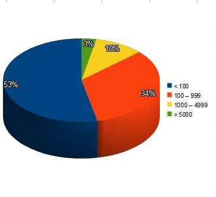

这个结果有点令人惊讶。在 3.5 个月的时间里，我们仅从 3% 的玩家池中抽样了超过 5000 手牌。这表明常客的比例非常低。这当然可能是因为手牌历史提供商只抽样了所有玩过的手牌中的一小部分。但由于我们的数据库中有 30 名玩家玩过 100,000 手牌或更多（其中一名玩家玩过 500,000 手牌），这似乎不是一个好的解释（玩过很多手牌的玩家似乎会记录他们的手牌）。

因此，我们得出结论，在这个扑克网站上，低级别 PLO 的常客比例很低。我们如何定义常客玩家有点随意，但要求在超过 3 个月的时间里在我们的数据库中至少记录 5000 手牌似乎是合理的。如果我们使用这个定义，在这些限制下，我们有 3% 的常客。为了考虑统计不确定性，我们可以稍微扩大这个限制，得出的结论是，不到 5% 的玩家似乎是常客。

现在我们来看看范围另一端的玩家群体，即低玩牌量玩家。我们观察到，超过一半的玩家池记录的手数不到 100 手。这可能是因为他们中的许多人在抽样期结束时开始玩（例如，也许他们中的大多数人在四月份开始玩）？我们通过查看数据库逐月增长的情况来调查这一点：

1 月 31 日：46716 名玩家（+46716）  
2 月 28 日：67112 名玩家（+20396）  
3 月 31 日：84326 名玩家（+17214）  
4 月 16 日：92469 名玩家（+8143）

新玩家的涌入似乎相当稳定。在 49,248 名抽样手牌少于 100 手的玩家中，只有不超过 8143 名可能在 4 月 1 日或之后开始玩。因此，大多数低级别玩家都在 1 月 1 日至 3 月 31 日之间进行游戏，并且他们有足够的时间记录手牌。

因此，超过一半 (53%) 的玩家似乎几乎没有玩过低级别 PLO。他们玩了几手牌，然后（可能）就离开了。同样，我们只有所有玩过的手牌的样本，但如果玩家在数据库中注册的手牌少于 100 手，则他很可能是低手牌量玩家（同样，我们有许多玩家拥有 100,000 手或更多，因此那些玩很多手牌的人似乎会记录他们的手牌）。

因此我们得出结论：

*这个扑克网站上的大多数低级别 PLO 玩家玩的手牌数量非常少。常规玩家的比例似乎很小。似乎大多数玩家要么只玩几局游戏，要么定期玩，但玩得非常零散。*

这意味着你遇到的大多数玩家都很弱，对游戏的理解有限。当然，普通玩家玩得更频繁，玩的牌桌也更多，所以你遇到个人常客的频率会高于任何其他随机非常客玩家。但你遇到的大多数对手都是容易被击败的。这是令人鼓舞的（而且并不完全出乎意料）。然而，令人惊讶的是，试一下就不玩了的玩家（那些玩牌量极低的玩家）的比例如此之高。

但与鱼对战只是胜负的一部分。要获胜，我们还需要击败佣金，所以让我们为 3 个级别中的每一个计算一下：

#### 7.3.4 PLO25、PLO50 和 PLO100 的佣金是多少？

首先，让我们找出玩家池中总佣金损失了多少。我们直接从 HEM 中提取以下数据：

- 92469 名玩家
- 总利润：-\$6071161.70
- 平均利润：-\$65.66
- 平均赢率：-13.28 bb/100

由于每个定义中所有玩家的总利润等于佣金，我们看到每个玩家平均支付了 -\$65.66 的佣金。我们的样本在 3.5 个月内总共支付了超过 600 万美元的佣金，并且我们的样本仅包含这段时间内在 PLO25、50PLO 和 100PLO 上玩的所有牌局的一小部分。

结论：如果您想通过扑克致富，请创建自己的网站。

现在来看看每个级别的佣金。我们挑选每个级别中玩牌最多的 3 名玩家，计算他们的佣金并取平均值：

**\$25PLO:**  
玩家 1：175466 手牌，佣金为 -\$7161.15 = 佣金为 -16.32 bb/100  
玩家 2：150728 手牌，佣金为 -\$5886.37 = 佣金为 -15.62 bb/100  
玩家 3：134534 手牌，佣金为 -\$5126.66 = 佣金为 -15.24 bb/100  

总计：460,728 手牌，佣金为 -\$18,174.18 = 佣金为 -15.78 bb/100

**\$50PLO:**  
玩家 1：349,427 手牌，佣金为 -\$22,575.55 = 佣金为 -12.92 bb/100  
玩家 2：259,214 手牌，佣金为 -\$19,811.55 = 佣金为 -15.29 bb/100  
玩家 3：122,772 手牌，佣金为 -\$8,698.48 = 佣金为 -14.17 bb/100

总计：731,413 手牌，佣金为 -\$51,085.58 = 佣金为 -13.97 bb/100

**\$100PLO：**  
玩家 1：295,804 手牌，佣金为 -\$33,417.86 = 佣金为 -11.30 bb/100  
玩家 2：280,966 手牌，佣金为 -\$32,858.25 = 佣金为 -11.69 bb/100  
玩家 3：218,506 手牌，佣金为 -\$27,374.52 = 佣金为 -12.53 bb/100  

总计：795,276 手牌，佣金为 -\$93,650.63 = 佣金为 -11.78 bb/100

**估计佣金**  
\$25PLO：15-16 bb/100  
\$50PLO：13-14 bb/100  
\$100PLO：11-12 bb/100

在所有级别下，佣金都是 \> 10 bb/100，例如，每玩 1000 手牌，就有佣金超过 1 个买入。相对于 PLO25，佣金在 PLO50 时下降约 12%，在 PLO100 时下降约 25%。

对于新玩家来说，如此高的佣金是一个巨大的障碍，这显然是很少有玩家能胜出的最大原因。佣金在一定程度上取决于游戏风格。例如，如果您玩很多手牌，并参与很多小底池，您需要支付更多的佣金。如果您玩更少的手牌，放弃更多小底池，而是专注于最大化大底池的价值，那么您支付的佣金就会更少。

佣金的一个重要影响是，它可能会将微利的情况变成收支平衡或亏损的情况。如果您卷入许多此类情况，将会发生两件事：

- 您降低了胜率
- 您为游戏引入了（甚至）更多的波动

因此，当您在低级别时做出接近的决定时，请记住佣金。如果充其量只是一场边缘游戏，那么佣金可能会将其变成一场失败的游戏。因此，当您有疑问时，您可能希望将佣金作为胜负等式中的一个因素。

我们知道 PLO 是一种允许风格变化很大的游戏（您可以通过许多非常不同的风格获胜），但我怀疑低级别佣金严重限制了我们在风格方面的选择。在高级别下，佣金几乎可以忽略不计，您会发现玩得很松（\> 40% VP\$IP）的赢家，但我怀疑这在低级别下是否是最佳选择。如果你是一名优秀的玩家，你也许能够成功，但如果你真的那么优秀，你无论如何也不会在低级别中呆太久。尽管在低级别中，非常松散的打法对你有利可图，但它可能不是玩这些级别的最有利可图的方式。

因此，让我们使用数据库来估计一些常见的翻牌前和翻牌后 HEM 统计数据的合理值。这应该能让我们了解哪种打法在低级别 PLO 中效果最好。

### 7.4 为低级别 PLO 估算合理的 HEM 统计数据

我们将使用数据库来估算以下 HEM 统计数据值的合理范围：

- VP\$IP
- PFR%
- 3-Bet%
- 翻牌后攻击性因子 (AF)
- 翻牌 CBet%
- 转牌 CBet%
- WTSD%

换句话说：

- 您自愿玩多少手牌
- 翻牌前加注的频率
- 翻牌前 3-bet 的频率
- 翻牌后攻击性有多强
- 翻牌后持续下注的频率
- 转牌后持续下注的频率（转牌持续下注）
- 摊牌的频率

还有许多其他有趣的统计数据，因此我们仅挑选了少数最常用的统计数据。

#### 7.4.1 定义我们的方法

为了从 HEM 数据库中估计合理的统计值，我们将使用文章《堵住漏洞 - 根据统计范围确定典型的 bb/100》中概述的方法，您可以在 HEM 菜单（“帮助” --> “文章”）中找到此方法。该方法的本质是我们研究胜率（bb/100）如何随统计值的变化而变化。然后我们使用它来估计最佳统计范围。

我们首先过滤数据库中至少有 5000 手牌的所有玩家（即常规玩家）。我们需要一些最小样本量，因此我们使用与文章中相同的样本量。这为我们提供了 2817 名玩家的样本，这些玩家拥有 5000 手牌或更多。5000 手牌并不是一个很大的样本，但我们将研究玩家群体，而不是单个玩家。

例如，假设您选择了 1000 名玩家，每人玩过 5000 手牌，VP\$IP \> 80%。现在将这些玩家与 1000 名玩家（每人玩过 5000 手牌，VP\$IP < 30%）进行比较。即使每个玩家只玩过 5000 手牌，也几乎可以保证第二组玩家的表现会优于第一组。因此，我们可以非常肯定地得出结论，VP\$IP \< 30 比 VP\$IP > 80 要好得多。我们的分析将像这样进行（别忘了许多玩家玩过远多于 5000 手牌）。

例如，我们将研究 VP\$IP 如何影响胜率。然后，我们列出所有 2817 名玩家，并根据 VP\$IP 对列表进行排序。然后我们将玩家池分成 5 组，每组玩家数量相等（VP\$IP 值最低的 1/5 进入第 1 组，接下来的 1/5 进入第 2 组，依此类推）。

对于每个组，我们记录该组中 VP\$IP 值的上限和下限，然后找到该组中胜率的中位数（中位数是将该组精确分为两半的值）。中位数越高，该组中的玩家平均表现越好，该组的 VP\$IP 范围越理想。因此，我们选择中位数最高的组的 VIP\$IP 范围作为我们对最佳 VP\$IP 范围的估计。

为了使这种方法更加清晰，让我们用一个使用两个组的简单示例来说明。假设数据库中有 6 名玩家，他们的 VP\$IP 值和胜率如下：

玩家 1：VP\$IP = 14 且 bb/100 = -1  
玩家 2：VP\$IP = 44 且 bb/100 = -3  
玩家 3：VP\$IP = 27 且 bb/100 = 4  
玩家 4：VP\$IP = 88 且 bb/100 = -5  
玩家 5：VP\$IP = 19 且 bb/100 = 2  
玩家 6：VP\$IP = 37 且 bb/100 = 0

然后我们根据 VP\$IP 对玩家进行排序：

玩家 1：VP\$IP = 14 且 bb/100 = -1  
玩家 5：VP\$IP = 19 且 bb/100 = 2  
玩家 3：VP\$IP = 27 且 bb/100 = 4  
玩家 6：VP\$IP = 37 且 bb/100 = 0  
玩家 2：VP\$IP = 44 且 bb/100 = -3  
玩家 4：VP\$IP = 88 且 bb/100 = -5

现在我们根据玩家的 VP\$IP 值（最低的 3 名玩家归于第 1 组，最高的 3 名玩家归于第 2 组）将此玩家池分成两个大小相等的组（每组 3 名玩家），并找出每组的胜率中位数。中位数定义为将组一分为二的数据点。这意味着组中一半的玩家胜率低于中位数，而另一半的玩家胜率高于中位数。显然，中位数越高，组中玩家的平均表现就越好。

**第 1 组**  
玩家 1：VP\$IP = 14 且 bb/100 = -1  
玩家 5：VP\$IP = 19 且 bb/100 = 2  
玩家 3：VP\$IP = 27 且 bb/100 = 4

VP\$IP 范围：14 - 27  
中位数 bb/100：2

**第 2 组**  
玩家 6：VP\$IP = 37 且 bb/100 = 0  
玩家 2：VP\$IP = 44 且 bb/100 = -3  
玩家 4：VP\$IP = 88 且 bb/100 = -5

VP\$IP 范围：37-88  
中位数 bb/100：-3

**模型示例的结论**  
此模型示例中的最佳 VP\$IP 范围是 14 - 27（第 1 组的范围）。第 1 组的胜率中位数为 +2 bb/100。第 2 组玩家的 VP\$IP 范围为 37 - 88，胜率中位数为 -3 bb/100。我们得出结论，14 - 27 之间的 VP\$IP 比 37 - 88 之间的 VP\$IP 更好，14 - 27 是我们根据此数据集估计的最佳 VP\$IP 范围。

我们接下来要做的是将此精确方法用于前面列出的每个 HEM 统计数据。不同之处在于，我们现在有 2817 名玩家，而不是 6 名，我们将他们分成 5 组，而不是 2 组（因此我们将有三组 563 名玩家，两组 564 名玩家）。

对于每个 HEM 统计数据，我们在 Excel 中进行数据处理和计算，然后我在此处粘贴结果截图。最佳范围用灰色区域标记。

#### 7.4.2 估计最优 VP\$IP

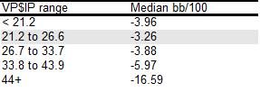

请注意，所有 VP\$IP 范围的中位数都是负数。这并不意外，因为数据库中的大多数玩家都会输，而且输家分布在所有可能的打法风格中（残酷的佣金是造成这种情况的一个重要原因）。但这对我们的分析没有任何意义。我们只是想找到中位数最高的范围，而不管这个中位数是多少。我们只是假设中位数最高的统计区域是最佳范围的良好估计。

从上面的数据中，我们得出结论，低级别的最佳 VP\$IP 范围是 21 - 27%（四舍五入到最接近的整数）。这是典型的紧 - 凶 (TAG) 区域。在我们计算了低级别佣金之后，这应该不会让我们感到惊讶。玩更松的风格当然也可以获利，但我猜我们不会找到很多能够使用非常松散的翻牌前策略获利的低级别玩家。那些足够优秀能够做到这一点的人往往会快速晋级。

这些数据还告诉我们，绝对不建议以高于 45% 的 VP\$IP 四处挥霍。大多数尝试这样做的玩家可能都是鱼（除了翻牌前打法过于松散之外，还有其他漏洞），但佣金可能会让有能力的玩家也难以以这种风格获胜。人们普遍认为你可以在 PLO 中玩得非常松散，但在高佣金环境中，远远超过 30% 可能不是一个好主意。

#### 7.4.3 估算最佳 PFR%

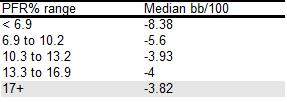

很难根据这些数据准确估计最佳 PFR% 范围，因为所有 \> 10% 的范围表现都差不多。这意味着我们找不到像 VP\$IP 那样被两侧的次优区域包围的明确定义的最佳区域。

我们无法估计最佳 PFR% 范围的上限，但我们确实找到了下限。从数据中可以清楚地看出，PFR% \> 10% 的表现会很好。而表现最好的范围（尽管差异很小）是 PFR% \> 17%。这是一个典型的 TAG 值。标准 PLO TAG 的 VP\$IP 在 20-25% 区域，PFR% 在 15-20% 区域，我们现在已经确认这两个统计范围都适用于低级别 PLO。

但请注意，低至 10% 的 PFR% 似乎也运行良好。单个玩家的最佳属性值不能在真空中精确决定，因为它还取决于它如何与玩家风格的其他组成部分协同工作。例如，玩家可以选择在跟注者后面跟着跟注并在有位置的情况下玩小底池，而不是加注并在有位置的情况下玩大底池。大量的跟着跟注和大量的隔离加注都可以很好地发挥作用，只要我们为这些动作选择正确的手牌类型，并且只要根据翻牌前发生的情况调整翻牌后的打法。

#### 7.4.4 估算最佳 3-Bet%

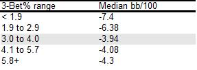

我们看到与 PFR% 相同的趋势，即三个最高 3-bet 范围具有相似的中值，因此很难确定哪个是最佳的。我们没有找到明确定义的最佳范围，但我们确实找到了下限（\> 3% 显然表现最佳），并且我们认为 3 - 6% 作为最佳 3-bet% 区域的起点是合理的。

我们从第 6 部分记得，优质 AAxx、优质百老汇手牌和优质投机手牌的 3-bet 范围约为 5%。数据库分析表明，这是一个合理的范围。但我们需要记住，最佳 3-bet 频率高度依赖于对手，并且我们可以在按钮位置进行大量松散的 3-bet，尤其是对弱紧对手。

值得一提的是，低级别的通常被动情况下可能导致数据库中的次优低 3-bet% 值过多。我们发现 3-6% 范围内的 3-bet% 似乎效果最好，但 \> 6% 可能效果更好（6+% 范围的表现几乎与 3-6% 范围一样好）。但由于很少有玩家在这些级别下 3-bet 高达 6+%，因此我们无法获得该区域的大量数据。因此，我们没有像 VP\$IP 那样获得最佳 3-bet% 范围的明确上限（我们清楚地确定了中间的最佳区域）。

因此，我们注意到，对于强手来说，\> 6% 的 3-bet 可能比 3-6% 更好，尤其是当他面对弱手时。但作为起点，3-6% 范围上部的 3-bet% 应该效果很好（再次，优质 AAxx + 优质百老汇 + 优质投机牌给我们 ~5%）。

#### 7.4.5 估算最佳 AF（攻击因子）

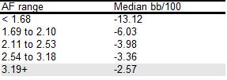

与 PFR% 和 3-Bet% 一样，我们也没有找到明确定义的 AF 最佳区域。但我们找到了下限（\> 3）。我们不知道在达到次优 AF 值之前我们能走多远，但我们肯定希望保持 \> 3。

#### 7.4.6 估算最佳 Flop c-bet%

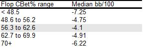

这里我们有一个明确定义的最佳区域。看来最佳的 Flop c-bet% 位于 56 - 63% 之间。低于 50% 或高于 60% 显然不是最佳的。

#### 7.4.7 估算最佳 Turn c-bet%

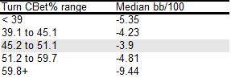

我们看到的模式与 Flop c-bet% 相同。我们有一个明确定义的最佳区域 45 - 51%。从这些数据中可以清楚地看出，在转牌圈进行过多的持续下注会受到严厉惩罚。

#### 7.4.8 估算最佳 WTSD%（Went to Showdown 打到摊牌的百分比）

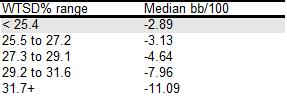

WTSD%（Went to Showdown 打到摊牌的百分比）不是我们在玩游戏时经常使用的统计数据，因为如果我们想知道是否可以在翻牌后诈唬让对手输掉底池，还有其他更好的统计数据可用。但它是一个很好的统计数据，可以包含在简单的 HUD 布局中。我们没有找到明确定义的最佳区域，但我们得到了一个上限的估计值。数据表明，最佳 WTSD% 位于 27% 以下。

### 7.5 我们为低级别 PLO 设计了一个简单的 HUD 布局

我们在本文中要做的最后一件事是设计一个简单的 HoldemManager HUD 布局，用于在磨练低级别 PLO 时使用。我们将根据之前找到的最佳统计数据范围开展这项工作。

在开始之前，我要说的是，我在玩游戏时不怎么使用 HUD 统计数据。我更喜欢注意了解我的对手此时此刻的表现，而且我经常在完全不使用 HUD 的情况下玩游戏。但我当然明白人们喜欢在玩游戏时使用 HUD 统计数据。所以让我们尝试一下我们之前找到的统计数据范围，并使用它们构建低级别 PLO HUD 的“骨架”。

#### 7.5.1 我们的主要 HUD 理念

我们将应用 KISS 原则（Keep It Simple, Stupid 保持简单，愚蠢）并使用广泛的概括来定义 HUD 中的范围。我们从之前研究的 7 个统计数据开始：

- VP\$IP
- PFR%
- 3-bet%
- 翻牌后攻击因子（AF）
- Flop c-bet%
- Turn c-bet%
- WTSD%

我们还在数据库中包括玩家的姓名和他拥有的手牌数量。我们首先将姓名和手牌数量放在一行上，然后将 VP\$IP、PFR%、3-bet% 和 AF 放在第二行上，最后将翻牌 c-bet%、转牌 c-bet% 和 WTSD% 放在第三行上。

在 HEM HUD 布局管理器（菜单：“HUD 选项” --> “玩家首选项...”）中，它看起来像这样：

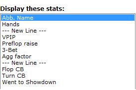

对于每个统计数据，我们将使用简单的颜色编码系统区分最佳区域和次优区域：

- 黄色 = 紧 / 没用的（tight / nitty）
- 绿色 = 宽松 / 被动（loose / passive）
- 红色 = 激进（aggressive）
- 蓝色 = 稳健 / 中立（solid / neutral）

对于每个统计数据，我们将使用这些颜色代码定义 3 个区域。这将为我们提供简单的指导，指导我们如何解释我们遇到的玩家的统计数据值。现在我们将介绍每个统计数据，定义统计数据区域并简要评论如何在玩游戏时使用这些统计数据。

#### 7.5.2 VP\$IP

根据之前的分析，分为 3 个类别：

无用（黄色）：\< 21  
稳健（蓝色）：21 - 27  
松散（绿色）：\> 27

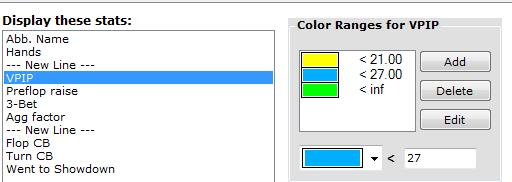

请注意，我们将很多玩家归为一个非常宽泛的类别，称为 “松散”。我们本可以定义第四个类别（半松散），例如在 27 - 35% 区域，并将 “松散” 保留给真正松散（35+%）的玩家。但是，我们牺牲了精度，只使用简单的 3 类系统。

在玩游戏时使用 VP\$IP 很简单。VP\$IP 是我们在对对手进行分类时首先使用的统计数据，也是对他在所有街道上的范围进行所有估计的基础。颜色编码系统让我们只需查看颜色即可轻松识别细致和扎实的玩法。“松散” 类别非常广泛，因此在这里我们还需要查看数字，以查看我们面对的是半松散（27 - 35）还是真正松散（35+）的玩家。

至于我们自己，我们希望将自己置于 “稳健” 区域的中间位置，VP\$IP 略低于 25%。这是一种稳健的 TAG 风格，在低级别条件下表现良好。

#### 7.5.3 PFR%

根据之前的分析分为 3 类（略作手动调整）：

被动（绿色）：\< 5  
中立（蓝色）：5 - 10  
激进（红色）：\> 10

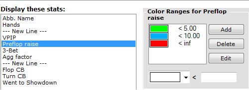

根据之前的分析进行直接分类。“激进” 类别很广泛，当使用 VP\$IP 约为 25% 时，我们希望将自己置于 16 - 17% 左右的标记处。

#### 7.5.4 3-bet%

3-bet% 的分类比之前的统计数据更棘手，因为最佳区域定义不明确。但让我们试试这个：

被动（绿色）：\< 3  
稳健（蓝色）：3 - 6  
激进（红色）：\> 6

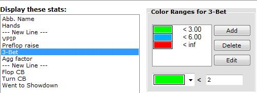

我们记得，在第 6 部分所做的分析中，优质 AAxx + 优质百老汇牌的强 3-bet 范围约为 2.5%。优质 AAxx、优质百老汇牌和优质投机牌（最佳连牌和最佳 A 同花 + 连牌）的更宽范围约为 5%。

因此，将 3-6% 的范围定义为 “稳健” 是有意义的，而低于该范围的一切都属于 “被动”，高于该范围的一切都属于 “激进”。当我们低于 3% 标记时，我们的范围主要变为优质 AAXX + 优质百老汇牌（或者，所有 AAxx 牌的范围，没有其他牌，即 2.5%）。在范围的另一端，如果我们超过 6%，我们的范围中必须有很多投机牌，这与激进和狡猾玩家的 3-bet 范围一致。

当我们被被动玩家 3-bet 时，我们可以扔掉最弱的牌，然后逃之夭夭，尤其是当他处于有利位置上时。他不会乱打，试图用一手弱牌在不利位置击败一个强范围的牌是愚蠢的。所以我们大多会放弃我们处于不利位置的弱牌，就是这么简单。当我们对这种类型的玩家 4-bet 时，我们大多会拿着 AAxx。

在有利位置时，我们可以用很多弱牌跟注，因为我们现在对翻牌后的底池有了更好的控制，而且我们将有更多机会利用我们掌握的有关他的紧范围的信息来获得优势。例如，现在我们更容易在击中时拿到回报，或者在错过但我们知道他也错过时偷走底池。

面对非常激进的 3-bet 玩家，我们必须在不利位置进行更多反击。我们的 4-bet 范围也将更宽，我们将开始用优质 AKKx、AQQx 和 AKxx 牌进行 4-bet，如第 6 部分所述。

但不要过分反击不利位置的激进 3-bet 玩家。在这种情况下，您仍然必须放弃很多弱牌，并接受一个比您有位置的玩家对您有一定权力的事实。

当谈到我们自己的 3-bet% 时，我建议您不要试图将其推高到某个预定值。只需使用我们之前在文章系列中讨论过的决策过程来分析每个 3-bet 场景。当您不断找到 3-bet 以获得价值的好机会时，无论是投机性 3-bet 还是诈唬性 3-bet ，您的 3-bet 百分比都会水到渠成。

#### 7.5.5 翻牌后攻击因子（AF）

我们定义了 3 个大类：

被动（绿色）：\< 2  
中立（蓝色）：2 - 3  
激进（红色）：\> 3

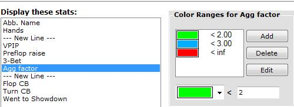

在玩游戏时使用此参数很简单。当被动玩家下注或加注时，他通常有这个参数。当激进玩家下注或加注时，他不一定有这个参数。从那里开始。

我们的目标是 AF \> 3，但我们不确定最佳区域在哪里结束，次优区域在哪里开始。但只要我们不陷入被动游戏，我们就应该做得很好。

#### 7.5.6 Flop c-bet%

根据之前的分析分为 3 个类别：

被动（绿色）：\< 55  
稳健（蓝色）：55 - 65  
激进（红色）：\> 65

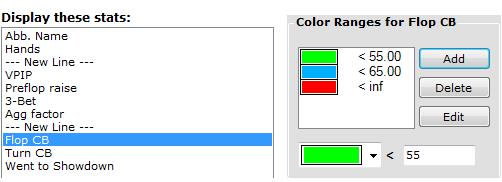

这个统计数据使用起来相对简单。经常用弱牌过牌的玩家的持续下注应该比在翻牌圈用大部分范围的牌持续下注的玩家的持续下注更受尊重。面对被动的持续下注者，我们弃牌更多，面对激进的持续下注者，我们跟注和加注更多。

如果您觉得用弱牌进行的持续下注总是被跟注或加注，则您可能持续下注过多。如果您的对手察觉到您的这种行为，他们会通过反击您频繁的持续下注来调整，因为他们知道您通常什么都没有。

相反，如果您的持续下注受到很多尊重，而您觉得在翻牌圈拿到大牌时从未得到任何行动，则您可能持续下注过少。如果您的对手意识到您在错过翻牌后过牌很多，他们会通过在您下注时给予您更多尊重来做出回应。因此请记住，你应该在翻牌圈持续下注很多空气牌。这本身就是有利可图的（只要你不要过度），而且它可以平衡你的范围，让你在翻牌后更难被人解读。

#### 7.5.7 Trun c-bet%

我们定义了 3 个大类：

被动（绿色）：\< 40  
稳健（蓝色）：40 - 55  
激进（红色）：\> 55

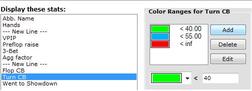

很少在转牌圈无牌持续下注的玩家可以通过以下方式利用：

- 在转牌圈下注时放弃更多边缘牌
- 在翻牌圈缠打更多，看看他们是否在转牌圈放弃

在这里，您可以查看 Flop c-bet% 和 Turn c-bet%。面对在翻牌圈持续下注过多但很少在转牌圈无牌持续下注的玩家，您可以在翻牌圈缠打很多。激进的翻牌圈持续下注策略当然也可以通过在翻牌圈诈唬加注更多来利用。但如果你知道他会在很多转牌圈放弃，那么最好等着看他在转牌圈做什么。您可以在诈唬之前收集有关他的范围的更多信息，并且您还可以看到转牌（如果您在翻牌圈诈唬加注并且他加注了您，您将不得不弃牌）。

#### 7.5.8 WTSD%

最佳区域没有明确定义，但我们发现了一个上限（27%）。为了安全起见，我们稍微扩大了这个限制，并尝试了以下类别：

没用（黄色）：\< 24  
稳健（蓝色）：24 - 28  
松散（绿色）：\> 28

使用此统计数据可以大致了解玩家是否必须摊牌。但是，如果您想利用一个细心的玩家，可以使用更好、更具体的统计数据（例如 “对 Flop c-bet ​​弃牌”、“对 Turn c-bet ​​弃牌” 或 “对 River c-bet 弃牌”）。但我们包含此统计数据是为了在我们的 HUD 中有一个粗略的 “我有多大可能从他那里偷走这个底池” 参数。

WTSD% 显然非常依赖于我们在短期内发到的牌（当我们拿到手牌时，我们更频繁地摊牌），所以当样本量较小时不要依赖它。

#### 7.5.9 我们的 HEM HUD 设计摘要

您可以构建比这个更精致的 HUD，但我的理念是 “少即是多”。我也想知道为什么我在 HUD 中包含了某个统计数据，我想知道如何使用它提供的信息。如果您不知道如何处理某条信息，它就不再是信息，而是变成了噪音。

此外，我并不声称这些 HUD 统计数据范围对于所有类型的游戏条件都是最佳的。但我希望这项工作能让您更好地了解如何组织我们玩游戏时漂浮在我们周围的信息。组织它使收集和处理它变得更容易。

除了这里使用的方法外，还可以使用其他方法，但归根结底都是相同的：我们想知道合理的统计范围大致在哪里，然后我们在此基础上定义各种类别（“紧”、“松”、“被动”、“积极”、“稳健”、“无用” 等）。我建议您自己对类别之间的边界进行一些实验。使用此处完成的工作作为起点，并根据需要稍微向上或向下调整边界。如果您认为有必要，您还可以引入更多类别。例如，您可能希望在 27 - 35% 区域为 VP\$IP 定义一个 “半松散” 类别，如前所述（将 VP\$IP 30 玩家与 VP\$IP 80 鱼分组有点误导）。

请记住，所有试图区分 “好” 统计数据和 “坏” 统计数据的 HEM 统计数据分类系统都是近似的，并且没有独特的方法可以根据统计数据定义玩家类别。我们希望有合理而简单的类别，可以帮助我们在玩游戏时处理和利用信息。HUD 应该帮助我们，而不是让我们感到困惑。永远记住这一点，你会发现设计和使用 HUD 布局很简单。

### 7.6 总结

我们讨论了本系列文章实践部分的进展（或缺乏进展），并估计了资金建设项目和本系列文章其余部分的时间框架。我们预计在未来 4-5 个月内完成这项工作。

然后，我们对一个大型 HEM 数据库进行了一些简单的统计分析，并得出了一些关于低级别 PLO 的条件和玩家类型的结论。我们还估计了低级别 PLO 佣金。

最后，我们使用数据库估计了常用 HEM 统计数据的最佳范围，并使用这些统计数据为 PLO 设计了一个简单的 HEM HUD。

这篇文章是所有理论中间的一个小 “实践插曲”，我希望您能对一般的低级别条件、HEM 数据库信息处理以及 HEM 统计数据和 HEM HUD 有所了解。本系列文章的下一阶段是讨论翻牌后玩法，据我估计，我们还有 3-4 篇文章才能完成。
