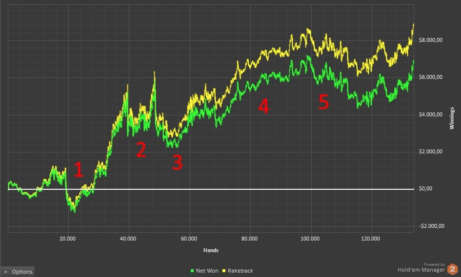

# 介绍

## 本书讲的是什么？

本书将教你一些重要的概念，让你在微级别和小级别 6 人桌底池限注奥马哈 (PLO) 的众多玩家中脱颖而出。打好基础后，我将讲解更高级的主题，为你提供进一步提升游戏水平所需的工具。虽然本书中的概念主要针对线上现金游戏玩家，但它们也适用于锦标赛玩家。掌握这些重要概念后，你甚至可以将它们运用到赌场牌桌上。这些信息曾经只提供给我的私人辅导学生，现在也向你，本书的读者开放。

## 我的亲身经历

凭借对游戏的极大热情和投入，我在不到五个月的时间里就从微级别玩家晋升到盈利丰厚的中级别 6 人桌 PLO 玩家。我的主要技能包括：

- pokerstrategy.com 德语版教练
- 专业牌局分析师
- 扑克视频制作人
- 扑克教练，提供社区公开课和私人课程（可付费）

由于本书主要讲述如何在 PLO 中获利，然后逐步提高级别，进一步获利，因此我想在图 1 中展示我自己的成长历程。这是我的净利润与时间（以玩过的牌局为单位）的关系图。我使用 Hold’em Manager 2（本书中你将学习使用的软件工具之一）绘制了这张图。如果你分析这张图，就会发现我的进步历程：从 PLO $0.10/$0.25 的牌局到 PLO $0.50/$1 的牌局，我的牌局水平不断提升（有时也会下降 - 这也是游戏的一部分）。在此期间，我成功地在 13 万手牌内将我的起始资金从 $1,000 增加到 $10,000，这相当于4个月的实际游戏时间。从图表的曲线可以看出，即使你最终确实盈利，也应该做好准备，在盈利过程中会经历许多短暂的 “顺风顺水” 时期，以及一些糟糕的 “下风期”。这真是一段坎坷的旅程！我可以将我周期性的利润下滑归因于两种情况：一种是学习了一些艰难的知识（例如，学习了一个一开始很难但后来发现有利可图的新概念，比如更松地防守盲注）。另一种是波动因素，这在像 PLO 这样的游戏中可能非常巨大。看看我的盈利图表，糟糕的心态和糟糕的资金管理导致了短期内资金的大幅波动 [第 1 点和第 2 点]。在这些暴跌之后，我的资金几乎不足以继续玩 $50 的游戏了。就在那时，我终于决定再次投入扎实的研磨打牌 [第 3 点]。我的努力最终得到了回报，我成功地在这些级别上恢复到了可接受的胜率 [第 4 点]。大约 10 万手牌之后，我准备尝试一下 $100 的游戏 [ 第 5 点]，这需要我再玩大约 5 万手牌来适应这个高度竞争的环境，才能最终稳定下来。正如你所判断的，这张图讲述了我的故事，从最初的 “失控牌手” 到随着时间的推移成为一名稳定的赢家。在你的扑克生涯中，尤其是在学习阶段，你可能会经历类似的磨难。不要在长期处于深度 “下风期” 状态时失去动力。即使是世界上最好的 PLO 玩家，比如 Phil “MrSweets28” Galfond 本人，也会经历持续数月的连败，这就是游戏的本质。

图 1：13 万手牌后，从 $0.10/$0.25 升级至 $0.50/$1

返水是你作为忠实客户获得的返还金额

## 这本书的书名是什么意思？

本书的书名强调了如果你认真学习和练习，就能在玩底池限注奥马哈（PLO）时建立起极高的自信心。短短一个月，你就能学会如何做出正确的选择，并理解在特定情况下为什么必须选择某种策略而非其他策略。这是像 PLO 这样高波动性扑克游戏中最重要的概念之一。我对此深有体会。在我真正理解本书所阐述的概念之前，我曾一度自以为拥有非常扎实的牌技。这仅仅是基于短期盈利；然而，实际上我只是运气好，碰巧赢了一手好牌。几周后，“平均法则” 的钟摆开始摆动。钟摆的摆动更像是重锤，我的资金被清空，我不得不重新买入。当你意识到自己的牌技存在漏洞，而这些漏洞又被运气掩盖时，那种感觉真是糟糕透顶，令人沮丧。

## 如何解决游戏中的漏洞

这个问题的根源在于你不确定自己是玩得好还是只是运气好。解决这个问题的关键在于能够证明你所做的每一个动作都是合理的。要做到这一点，需要你掌握游戏的基本概念。我们将从学习重要的翻牌前原则开始，然后学习翻牌后的打法，并偶尔学习支持这些打法的数学推理。

## 谁应该读这本书？

如果你符合以下任何一项，那么本书就是为你而写的。

- 你是一个完全的扑克新手
- 你了解 PLO 的基本规则，但缺乏在真实或虚拟牌桌上冒险的信心
- 你是一位德州扑克玩家，想在你的扑克游戏中加入 PLO 来增添一些变化。对于德州扑克玩家来说，我可以告诉你，没有什么能比 PLO 的刺激和动作更令人兴奋的了。
- 你已经玩过 PLO，但收效甚微或根本没有成功
- 你希望通过修复当前游戏中的漏洞来改进你的游戏计划
- 你是一名高级 PLO 玩家，渴望进入 “下一个级别”。

## 为什么要读这本书？

我的回答是，28 天的强大 PLO 概念将提高你的游戏水平。虽然这些概念并不像你想象的那么难，但不要指望它读起来轻松，完全的初学者在最初几天就会遇到挑战。有些主题可能需要读第二遍或第三遍才能完全理解并运用到牌桌上。即便如此，即使没有任何奥马哈经验或扎实的数学基础，你也可以在四周内玩赢钱的 PLO，前提是你有时间每天学习和练习一节课。即使是本书中介绍的数学知识，也侧重于在游戏中可执行的近似解，以求得数学上的正确答案。这让你能够做出正确的打法，而无需在牌局进行中途进行繁琐的计算。

另一个原因是，我专门为你 - 一位有抱负的 PLO 玩家——撰写这本书。大多数奥马哈书籍的作者都是扑克玩家，他们通过无限注德州扑克（NLHE）积累资金，后来又在中级别加入了 PLO。然而，这些作者并不了解中级别玩家与本书所针对的微级别和低级别玩家之间的显著差异。由于我从最低级别开始，并成功地一路向上，我认为自己完全有资格阐述在这些级别获胜的具体要点。

阅读本书的另一个原因是，它采用了与其他扑克书籍不同的方法。我采用了高度指导性的方法。本书将每个日常主题分为四个不同的部分，使其更容易掌握：

- 介绍
- 测验
- 解答
- 练习

介绍简要概述了主题，以便你了解特定概念的理论以及解决练习所需的背景信息。

测验部分是你在学习介绍部分所呈现内容后的 “家庭作业”。你会发现它充满挑战，但回报丰厚。成功完成测验的方法有很多种。你可以自己分析问题并构思答案，也可以咨询你的 “牌友”，甚至可以利用互联网上的扑克资源来研究答案以获得更多见解。但根据我的经验，提高牌技最有效的方法是自己完成测验，而不是 “偷看” 答案。像任何成功的牌手一样，你必须投入自己的智慧和勤奋才能找到制胜之道。

解答部分是你检查家庭作业的地方。在这里，你可以将自己的答案与作者提供的建议进行比较和评估。

最后，在练习部分，你将获得关于如何进一步练习每日主题并将其实际应用于 PLO 牌桌的建议。练习部分有助于巩固你对每日主题的了解。你现在可能已经注意到，有很多东西需要学习。因此，在学习完每日课程后立即进行练习，并证明自己能够完成相关练习，有助于你在奥马哈牌桌上从理论过渡到实际操作。每次练习结束后，你都会收到一份总结，用于确认你是否理解了当天所有重要的课程。

## 附录

最后，同样重要的是，本书还提供了一个附录（分为五个部分），你可以从中获得有关游戏基础知识和实用工具（例如手牌图）的更多信息。

我将相关附录部分链接到它们适用的课程日期。如果你对某些扑克术语不太熟悉，本书末尾有一个词汇表，其中对这些扑克术语进行了定义。此外，本书还有一个统计词汇表，它识别并解释了讨论统计数据时使用的所有缩写，并明确了每个统计数据的确切含义。

现在，我相信你已经迫不及待地想要开始为期 28 天的短手牌 PLO “新兵训练营” 了。那么，让我们开始吧。