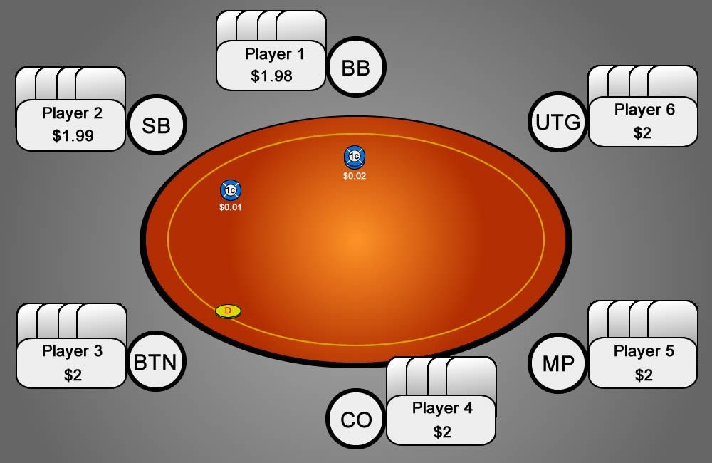
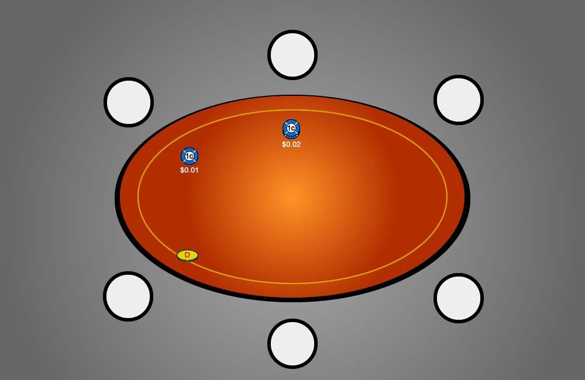

本书面向 6 人桌 PLO 玩家，因此我们首先要了解的是座位名称 - 相对于这种牌桌上的位置。在各种扑克游戏中，玩家的位置都非常重要，例如奥马哈和德州扑克。一些扑克职业选手甚至会说，奥马哈的位置几乎和牌本身一样重要！由于每手牌最多有四轮下注，后位最后行动的优势与前位必须先做决定的劣势形成了鲜明对比。

## 介绍

本书中，我将使用表 1 中的命名约定来描述座位：

| 座位 | 名称 |
| --- | --- |
| UTG  | 枪口位 |
| MP | 中位 |
| CO | 截止位 |
| BTN | 按钮位 |
| SB  | 小盲注位 |
| BB | 大盲注位 |

表 1：6 人桌 PLO 游戏中的位置

现在让我们看一下图 2，看看这些座位在扑克牌桌上是如何分布的：

图 2：标准 6 人桌 PLO 牌桌的翻牌前排列

要确定座位，你可以从 BB 开始，逆时针方向排列，直到确定所有座位（参见玩家 1 到玩家 6）。请注意，当玩家离开或退出牌桌时，最早的位置将被移除。这意味着当牌桌上只有 5 名玩家时，没有 UTG 座位。

在翻牌前游戏中，奥马哈的一个重要基本原则是，我们的手牌范围会随着我们向右（或顺时针）从 UTG 到 BTN 逐渐变松（即变宽），然后在轮到盲注玩家行动时显著收紧。另一个需要考虑的点是，我们在 BTN 的胜率是六个 PLO 座位中最高的。拥有 BTN 使我们能够用最弱的范围玩牌，同时仍然赚取最多的钱。这是因为在 BTN，我们在翻牌、转牌和河牌的下注轮次中始终拥有绝对位置优势。底池中的绝对位置优势使我们能够始终最先看到对手的行动，因为我们总是在翻牌后最后行动。这意味着我们比对手拥有信息优势，如果对手继续过牌，我们也可以过牌得到一张免费牌，如果我们认为这是提升到最佳牌的最便宜的方式（例如，在听牌时）。或者，我们可以攻击那些 “胆小鬼”，用强成手牌向对手下注。通过这样做，我们可以迫使他们放弃可能比我们更好的牌（即 “为弃牌权益下注”）。

另一方面，UTG 有一个明显的劣势，那就是我们不知道桌上其他玩家在翻牌前会做什么。如果 UTG 用一手不太强的牌跟注（甚至加注），他不知道在牌回到自己手上之前，自己是否会遇到一次或多次加注（或再加注）。现在，UTG 面临着一个艰难的抉择：要么用一手较弱的牌在不利位置跟注潜在的大额加注（大多数情况下如此），要么弃牌，甚至没看到翻牌就放弃投入的资金。至于 SB 和 BB，虽然盲注位置在翻牌前有机会看到行动，但在翻牌后成本更高的下注轮中，他们都将被迫提前行动。

本书中，我经常会根据玩家的绝对位置，将他们称为 “有利位置”（IP）或 “不利位置”（OOP）。在单挑（HU）底池中，这些术语始终指底池中的另一个玩家。例如，如果你坐在 MP，而 UTG 开池加注，那么当你跟注时，你将处于有利位置。当然，你坐在 MP 不一定就能保证是有利位置。再举一个例子，你从 MP 开池加注（也称为 “率先加注入池”（RFI）），而 CO 跟注。你现在就处于不利位置了，因为他比你更靠近 BTN 的右侧。

对于翻牌后多人底池（MW），我们将考虑 “相对位置” 这个术语。相对位置取决于我们相对于翻牌前主动玩家（PFA）的位置。我们希望被动玩家（溜入或跟注的玩家）位于我们的右侧，而翻牌前主动玩家位于我们的左侧。换句话说，我们越靠近翻牌前主动玩家的右侧，我们的相对位置就越好。原因如下：典型的多人底池（含翻牌前主动玩家）翻牌后情况是，所有玩家都会习惯性地 “过牌给加注者”。然后，按照惯例，翻牌前主动玩家会持续下注（c-bet），其他玩家也会做出相应的行动。拥有相对于翻牌前主动玩家的最佳相对位置，可以让所有其他玩家在这些经典的 “过牌给加注者” 的场景中展开行动，然后我们才能做出自己的决定。在翻牌前回合，当我们身后有可能会加入底池的松手玩家，或者在我们之前已经有两名或更多玩家加入底池时，考虑我们的相对位置就显得尤为重要。

一般来说，你只需要记住，无论是翻牌前还是翻牌后，谁结束行动，谁就是拥有最佳相对位置的玩家。相对位置在 3 人行动中至关重要。想象一下，当 UTG 加注，SB（一个弱手玩家）跟注，然后你在 BB 跟注。当你翻牌圈击中超强牌时，如果该牌过牌给加注者，翻牌前主动玩家 c-bet，SB 跟注，你就有机会赢得一个大底池。当底池中有 4 位或更多玩家时，绝对位置比相对位置更重要。这是因为，当底池中有超过 3 名玩家时，翻牌前主动玩家持续下注的可能性会降低，这是因为每增加 1 名玩家，翻牌前主动玩家的弃牌权益（FE）就会降低。因此，真正需要拥有最强牌才能赢得底池的必要性就会增加。此外，底池中每增加 1 名玩家，“反主动下注” 的概率也会增加。每次反主动下注和加注都会改变相对位置，因为现在结束行动的玩家发生了变化。在多人底池中通过反主动下注来操纵相对位置以利于我们是一个高级话题，我们将在第 16 天讨论。

## 测验

1. 与不利位置相比，我们在翻牌后在有利位置游戏有哪些优势？
2. 为什么我们在 3 人底池中的相对位置可能比我们的绝对位置更重要？
3. 在以下情况下，我们的 [i] 绝对位置和 [ii] 相对位置分别是什么？
[3a] Hero 在 CO 位置：UTG 弃牌，MP 加注，Hero 跟注（BTN，SB，BB 弃牌）
[3b] Hero 在 BB 位置：UTG 弃牌，MP 加注，CO 弃牌，BTN 弃牌，SB 再加注，Hero 跟注，MP 弃牌
[3c] Hero 在 BTN 位置：UTG 加注，MP 跟注，CO 再加注，Hero 跟注，SB 弃牌，BB 弃牌，UTG 跟注
[3d] Hero 在 BB 位置：UTG 跟注，MP 加注，CO 弃牌，BTN 跟注，SB 弃牌，Hero 跟注，UTG 弃牌

## 答案

1. **与不利位置相比，我们在翻牌后在有利位置游戏有哪些优势？**
    
    当我们在有利位置时，我们拥有一个关键优势，那就是我们总能看到前面玩家的动作。这让我们有机会进行狡猾的诈唬或缠打对手。通过缠打，我们试图在对手是翻牌前主动玩家，但在后面的回合（通常是转牌）表现出弱点时，让他放弃手牌。当牌面出现我们可以代表的惊悚牌时，这种方法最有效。
    
    如果我们是翻牌前主动玩家，那么对手很可能会在翻牌向我们过牌，因为我们在翻牌前表现出了攻击性 [如前所述，翻牌后扑克中最古老、最流行的格言之一是 “过牌给加注者！”]。这让我们可以随后过牌并获得一张免费牌，这在我们拿到大听牌或想便宜摊牌时非常有用。
    
    下一个要点是弃牌权益。如果你处于不利位置，那么你被迫对 c-bet 弃牌更多。这是因为当你处于不利位置，而有利玩家对你开枪时，很难看到摊牌。你不仅无法获得免费牌来领先，而且也没有任何好的机会在不冒着筹码风险的情况下击败对手。稍后我们讨论翻牌后统计数据时，我们会发现，当我们比较 “有利位置 / 不利位置对 c-bet 弃牌” 时，通常（至少对于一些实力较强的对手而言），不利位置对 c-bet 弃牌的比例会高出合理的幅度。
    
    最后一点是，我们在有利位置拥有更高的隐含赔率。我们将在第 25 天更多地了解隐含赔率。
    
2. **为什么我们在 3 人底池中的相对位置可能比绝对位置更重要？**
    
    一个典型的翻牌后情况是，所有玩家都过牌到翻牌前主动玩家，翻牌前主动玩家 c-bet，其他玩家也采取相应的行动。想象一下，MP 开池加注，BTN 跟注，而 Hero 在 BB 跟注。Hero 现在处于绝对位置最差，因为他距离 BTN 右侧最远。然而，由于他结束行动，所以他现在处于相对位置最佳。翻牌 Hero 过牌给翻牌前主动玩家，后者很可能会 c-bet，BTN 不得不对此做出反应。虽然他拥有绝对位置，但对于处于 “三明治” 位置的玩家来说，情况非常棘手，因为他夹在尚未透露太多实际牌力信息的玩家中间。
    
    如果 BTN 弃牌，那么 Hero 就会知道他只在面对翻牌前主动玩家单挑。如果 BTN 跟注或加注，那么 Hero 无需投入任何筹码就能了解 BTN 的牌力。
    
3. **在以下情况下，我们的 [i] 绝对位置和 [ii] 相对位置分别是什么？**
    1. Hero 在 CO：UTG 弃牌，MP 加注，Hero 跟注（BTN，SB，BB 弃牌）
        1. 我们拥有最佳的绝对位置，因为我们比对手更靠近 BTN 的右侧。
        2. 因为底池是单挑，我们的相对位置等于我们的绝对位置。
        
    2. Hero 在 BB：UTG 弃牌，MP 加注，CO 弃牌，BTN 弃牌，SB 再加注，Hero 跟注，MP 弃牌
        1. 我们处于不利位置，因为对手比我们更靠近 BTN 右侧。
        2. 因为底池是单挑，我们的相对位置等于我们的绝对位置。
        
    3. Hero 在 BTN：UTG 加注，MP 跟注，CO 再加注，Hero 跟注，SB 弃牌，BB 弃牌，UTG 跟注，MP 跟注
        1. 我们直接在 BTN，这意味着我们始终占据底池的绝对位置。
        2. 我们的相对位置最差，因为在 UTG 和 MP 过牌后，翻牌由翻牌前主动玩家 CO c-be，我们必须先行动。MP 拥有最佳相对位置，因为他结束行动。
        
    4. Hero 在 BB：UTG 跟注，MP 加注，CO 弃牌，BTN 跟注，SB 弃牌，Hero 跟注，UTG 弃牌
        1. 我们的绝对位置最差，因为我们距离 BTN 右侧最远。
        2. 我们拥有最佳相对位置，因为 UTG（意外地）弃牌了。现在，在翻牌前主动玩家的持续下注之后，我们可以作为翻牌的最后一个玩家行动。

## 练习

图 3：6 人桌 PLO 牌桌

以下练习示例请参考上图。在纸上画一个类似的图。

如果你还没有这样做，请写下每个位置的名称（相对于庄家按钮），直到你本能地记住它们。

现在，尝试不同的场景：首先，假设你在 BB。面对哪些位置加注你会在翻牌后打有利位置，面对哪些位置会处于不利位置（假设是单挑）？然后，转到 SB，依此类推。

假设你在 SB。现在问问自己，如果 UTG 加注，然后 MP 3-bet，你进行跟注，你会处于什么样的相对位置。尝试所有你能想到的不同场景（在你之后的跟注者，在你之后的 3-bet 者）你……）。同样，改变你自己的位置。在你的图表中添加任何其他你可能觉得有用的注释（例如，战术优势和劣势）。

## 总结

- 6 人桌上的位置
- 位置优势
- 绝对位置 vs. 相对位置
- 底线：由于位置在 PLO 中非常重要，因此你必须能够自动确定自己在一手牌中的绝对位置和相对位置。