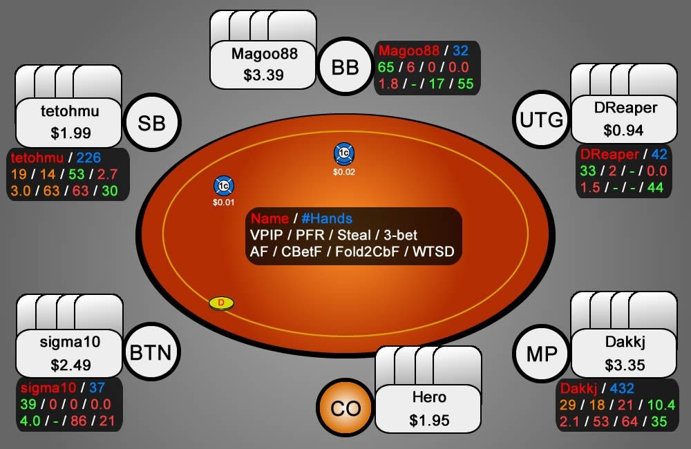
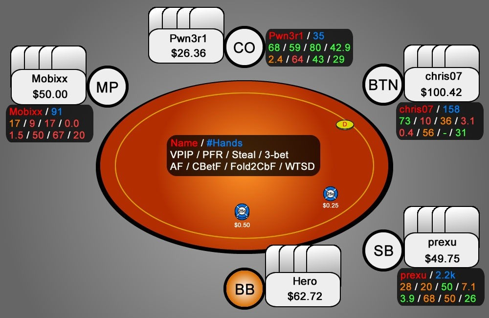
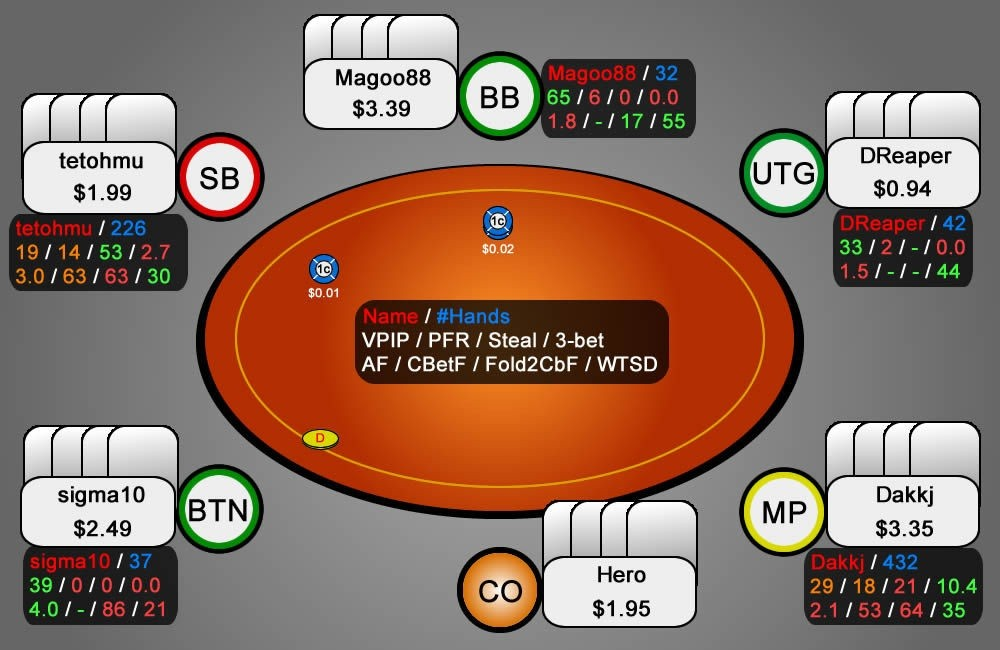
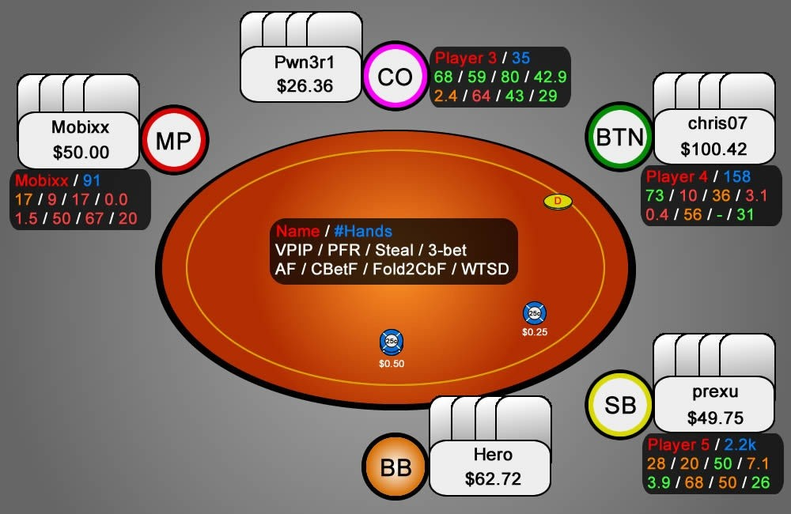

# 第三天  - 了解你的对手

现在你已经掌握了第二天的学习内容，能够根据你在 6 人牌桌上 BTN 的位置判断哪些牌可以在翻牌前玩。然而，与游戏的整体复杂性相比，这些起手牌指南相对固定。

今天的主题是如何在面对特定对手时正确选择牌。所以这次，我们的重点是牌桌动态。我们将分析与我们同桌的玩家，然后研究在这些情况下应该采取哪些调整措施。为此，理解 HUD 生成的统计数据至关重要。如果你不知道“VPIP”、“PFR”、“AF” 或 “WTSD” 的含义，我建议你查看附录 4，并尝试记住这些数据及其对应含义。

## 介绍

为了能够对对手进行分类，我们需要将所有类型的扑克玩家分为两大类。让我们先从那些玩得不好的玩家说起，他们被亲切地称为 “鱼”。这类玩家正是我们玩扑克的原因。从长远来看，他们才是我们的主要收入来源。大多数鱼会在短时间内输掉大量资金，以至于几天或几周内就退出扑克圈，再也没有出现在牌桌上。幸运的是，有些鱼会坚持足够长的时间，让我们能够确定他们究竟是什么类型的糟糕打法。所有鱼都有一个共同点，这可以被认为是它们的标志：它们都拥有极高的 VPIP（通常高达 40% 以上）。你不仅需要知道自己是否钓到了鱼，了解自己钓到的鱼的种类也同样重要。在构建鱼的子类别时，我倾向于使用以下区分方法：

- 激进鱼
- 被动鱼
- 疯鱼

PFR 和 3-Bet 数据是定义鱼的主要依据（翻牌后激进数据也是划分鱼的因素，但一般来说，PFR 和 3-Bet 数据就足够了）。PFR 和 3-Bet 数据越高，就越容易区分激进鱼（和疯鱼）和被动鱼。后者是你更常遇到（也更想遇到）的鱼。高 VPIP、低 PFR、低激进度和高 WTSD 是被动鱼玩家的分类依据，这意味着他们会把很多牌带到摊牌。话虽如此，激进鱼和被动鱼之间的 VPIP 通常差别不大 - 两者都有很高的 VPIP。

最后一种也是最有趣的鱼是疯鱼。这类玩家的特点是疯狂的超级攻击性 - 无论是翻牌前还是翻牌后 - 几乎用任何 4 张牌。相信我，当疯鱼坐在你的牌桌上时，你很容易就能发现他。与其他鱼不同，只要你和你的同桌允许他碾压你，疯鱼实际上可能是一个麻烦的玩家。一旦你意识到疯鱼每手牌都在加注和 3-bet，你就需要做出正确的调整来对抗他。

其余玩家被认为是更优秀的玩家（相对于鱼而言），我们称他们为 “常客”（或 regs）。我们这样称呼他们，是因为这些人会定期玩他们各自的级别。常客的能力各不相同，但在大多数情况下，要让他们掏钱是一项更艰巨的任务。和鱼类一样，常客也分为以下几种：

- 超紧型（Nit）
- 紧凶型（TAG）
- 松凶型（LAG）

我们通常可以通过 VPIP 和 PFR 之间较小的差距（约 10%）来识别不同类型的常客玩家，这表明他们很少在翻牌前采取被动策略。这就是为什么他们被称为紧凶和松凶玩家。同样，我们不仅可以根据他们和鱼分类中所使用的 VPIP、PFR 和 3-Bet 数据来对常客玩家及其技能水平进行分类，还可以根据他们的偷盲、弃牌给偷盲和过牌 - 加注倾向来分类。

紧凶指的是那些 VPIP 通常不会高于 25% 的玩家。这通常是紧凶和松凶之间的区别。普通的紧凶玩家的 3-Bet 数据大多低于 6%，对抗偷盲弃牌率高于 75%，而松凶玩家通常拥有更高的 3-Bet 数据和更低的偷盲弃牌数据。虽然紧凶的漏洞多种多样，不像鱼那样容易察觉，但他们有一个相当普遍的特征：他们打牌非常有条理，类似 “ABC” 的风格。这意味着他们是系统性很强的玩家（即 “按部就班”），当你剥削利用他们（例如，在有利位置不断施压）时，他们无法很快适应，甚至根本无法适应。这是因为他们不愿偏离既定的策略，他们认为那是他们的舒适区。

和疯鱼一样，松凶玩家也是非常棘手的对手。他们总是在有利位置 3-bet，在不利位置经常过牌 - 加注，这真的会让我们的日子不好过。松凶玩家比疯鱼危险得多，因为他们的加注和再加注是基于对 PLO 更深入的基础知识。好消息是，在小级别和微级别游戏中，大多数认为自己是松凶的玩家比常规玩家更鱼。这是因为他们过度激进的策略既缺乏专业性也缺乏成熟度，无法解释他们为何如此行事。因此，他们通常无法察觉到你何时对他们采取紧缩策略，即使你手中握有超强牌，他们仍然试图将你赶走。

紧弱玩家指的是那些几乎不玩任何牌的玩家，但一旦他们玩了，就要小心了。由于他们的范围非常紧且强，所以当他们加注时，通常手中握有好牌。低于 15% 的 VPIP、较低的 3-bet 频率和非常高的偷盲弃牌率是他们的标志。

以上是一些基本指标，可以帮助你对牌桌上的玩家进行分类。你可以利用这些信息来找到牌桌上的 “活跃玩家”，以及那些你应该谨慎应对的强势对手。

## 测验

1. 我们可以针对这 6 种不同类型的玩家做出哪些调整？
2. 在紧（常客玩家较多）和松（鱼玩家较多）牌桌上，我们的手牌选择有何不同？
3. 假设你加入了如下图所示的两张牌桌（图 4 和图 5）：
    1. 这些牌桌的玩家类型有哪些？
    2. 你能扩大从 CO 或 BTN 偷盲的范围，对抗你身后的（潜在）玩家吗？为什么 / 为什么不？
    3. 在这些牌桌上，哪些类型的牌你能够盈利？哪些类型的牌无利可图？

图 4：问题 3 的第一个场景

图 5：问题 3 的第二个场景

## 答案

1. **面对这 6 种类型的玩家，我们可以做哪些调整？**
    
    **激进鱼**
    
    面对这类玩家，我们通常应该谨慎对待翻牌的薄价值下注。通常情况下，我们最好用脆弱的牌在翻牌后过牌，并将较弱的牌带到摊牌。采取被动的打法，让他们用较弱的范围诈唬通常是一个不错的选择。
    
    **被动鱼**
    
    被动型鱼人也被称为 “跟注站”，他们会用较弱的牌一直跟到摊牌。对抗被动鱼的最佳策略是在翻牌后多采用领先下注的打法。但是，如果你领先下注，而他们大幅加注反击，你可能需要考虑弃牌。这是因为这些玩家的加注通常意味着我们被彻底击败，因为他们只在拿到坚果牌时加注，很少诈唬。在与被动型鱼对战时，你偶尔会遇到翻牌后最小加注的情况。记下这对相应玩家意味着什么，通常情况下，它要么是一手非常强的成手牌，要么是一手听牌。
    
    **疯鱼**
    
    我们知道，面对疯鱼，翻牌前加注最有可能被对手 3-bet。因此，我们应该只加注那些能够对抗 3-bet 的牌。我们也可以通过跟注那些有很高的坚果潜力牌，但无法对抗 3-bet 的牌来适应疯鱼。符合此标准的牌是 Q-Q-x-x-ss 或 A-B-x-x-ss。此外，我们还可以大幅扩大我们的 4-bet 范围。如果你和疯鱼单挑进入底池，并且击中了一些牌，那么就直接过牌 - 跟注到河牌。通常情况下，你就能击败他。
    
    **紧凶玩家**
    
    面对常客玩家的适应性调整比面对弱鱼牌手更难。这是因为他们对游戏的理解更深入，并且拥有不同的、更不容易被利用的漏洞。一个样本量充足的软件追踪工具有助于识别常客玩家的漏洞。常见的 ABC 漏洞是，他们在不利位置时弃牌过多，无论是面对 3-bet 还是接下来的持续下注，即使你已经对他们做了 20% 的 3-bet。另一个漏洞是，他们在面对你的 BTN 偷盲时弃牌过多。你甚至可能 100% 地偷盲，而这些玩家都能让你侥幸逃脱。最后，很多玩家在翻牌前加注后，拒绝进行通常的持续下注时，过牌 - 弃牌的次数过多。
    
    **松凶玩家**
    
    对抗合理的松凶玩家的最佳应对方法是收紧。然而，这种策略的转变可能会带来问题。想象一下，我们左边坐着一位实力强劲的松凶玩家。现在，我们被迫放弃很多 CO 的开池加注范围，因为当松凶玩家在 BTN 时，我们很有可能被他 3-bet。这损害了我们的利润，因为 CO 是扑克中第二好的位置，我们在 CO 位置上放弃加注会损失很多潜在的赢利（尤其是在盲注位置有两条活鱼在乱玩的时候）。由于 PLO 中的权益非常接近，面对实力强劲的松凶玩家合理的 3-bet 范围，扩大我们的 4-bet 范围，我们并没有太大的吸引力。这样做大多数时候只会在已经很高波动的游戏中增加波动。在这种情况下，面对一个位置优势较大的松凶玩家，最好的策略或许就是离开牌桌，去别的地方试试你的牌技！ 
    
    **紧弱玩家**
    
    面对那些几乎不怎么玩牌的玩家，最好的应对策略是经常开池加注，然后大量偷盲。但当沉睡的 “石头” 突然醒来并向你发起反击时，务必格外谨慎。
    
2. **在紧 / 激进（常客玩家较多）和松 / 被动（鱼玩家较多）牌桌上，我们的手牌选择有何不同？**
    
    **紧 / 激进牌桌**
    
    由于低连牌的可玩性较高，我们可以更频繁地玩它们。这意味着我们可以跟注更多 3-bet，并且有机会击中各种翻牌。在这些牌桌上，由于多人底池较少（常客玩家的 VPIP 通常较低），被压制的风险较小。
    
    **松 / 被动牌桌**
    
    高对子 / 坚果同花牌的价值会大幅提升，因为这些牌凭借其出色的压制潜力在中小底池中大放异彩。然而，它们无法承受翻牌前过大的压力。因此，它们非常适合松 / 被动牌桌，因为在这种牌桌上，3-bet 的风险非常低（被动鱼玩家很少 3-bet）。
    
3. **假设你加入了以下两桌**
    
    第 1 桌
    
    
    
    图 6：标记 1 号桌的玩家
    
    1. **这些牌桌的玩家类型有哪些？**
        
        这张桌子上有 3 位被动型玩家（sigma10、Magoo88 和 DReaper）。如你所见，他们的 VPIP 数据都非常高。此外，这 3 位鱼的 PFR 和 3-bet 数据都很低，这正是他们与激进型玩家的区别所在。这张桌子上还有 1 位激进型玩家（tetohmu）。如你所见，VPIP 和 PFR 之间的差异非常小，因为这些玩家在玩牌时非常激进。我们还可以判断 tetohmu 显然不是弱手玩家，因为他的 VPIP 远低于 25%，而且他的 3-bet 价值只有 2.7%。身穿黄色衣服的弱手玩家 “Dakkj” 坐在我们右边的 MP 位置。他的 VPIP 超过 25%。但与被动鱼相比，VPIP 和 PFR 之间的差距仍然很小。这位玩家与其他玩家的另一个区别在于他 10.4% 的高 3-bet 数值。
        
    2. **你能扩大你在 CO 或 BTN 位置的偷盲范围来对抗你身后的（潜在）玩家吗？为什么 / 为什么不？**
        
        CO 位置的 Hero：BTN（sigma10）并不理想，因为他 39% 的高 VPIP 表明他会在有利位置跟注很多。SB 的 TAG（tetohmu）可以接受，因为他比较紧。然而，BB（Magoo88）并不是松的偷盲的最佳人选，因为他的高 VPIP 和低的偷盲弃牌率。综合考虑，我不建议比我们典型的 CO 开池范围偷盲更多。
        
        BTN 位置的 Hero：SB（sigma10）会跟注很多，但从他的偷盲弃牌率来看，他弃牌的概率高达 86%（至少意味着 7 次中有 6 次）。这对我们有利。BB（tetohmu）很紧，经常弃牌。所以在这种情况下，以更高的频率偷盲是一个好时机。
        
    3. **在这些牌桌上，哪些类型的牌你能够盈利？哪些类型的牌无利可图？**
        
        由于 3-bet 价值通常较低，我们的高对牌更有价值。你可能还记得，单同花高对在击中大三条和同花时，拥有良好的压制潜力。在这张牌桌上，小连牌（例如 6-5-4-3、8-7-5-4）会因为 VPIP 很高而失去价值。这导致了很多多人底池，击中可能带来灾难性后果的第二坚果顺子和同花的概率会增加。
        
    
    第 2 桌
    
    
    
    图 7：标记 2 号桌的玩家
    
    1. **这些桌位的玩家类型有哪些？**
        
        这次我们的玩家阵容比较混合。注意，这张桌上只有 5 名玩家，所以没有 UTG 位置。我们已经知道如何定义紧凶玩家（Mobixx）、被动鱼（chris07）和松凶玩家（prexu）。我们还识别出了一名疯鱼（Pwn3r1）。我们可以通过他极高的 VPIP、PFR 和 3-bet 数据轻松识别他。
        
    2. **你能扩大你在 CO 或 BTN 位置的偷盲范围来对抗你身后的（潜在）玩家吗？为什么 / 为什么不？**
        
        CO 位置的 Hero：避免偷盲！即使 BTN 很紧，SB（Pwn3r1）也是疯鱼，BB（chris07）也是跟注站。因此，你不看翻牌就偷盲的机会几乎为 0。
        
        BTN 位置的 Hero：用所有可玩性强或高牌价值的牌偷盲。如果我们加注后被 3-bet 或跟注，我们很可能不得不打一个相当大的底池。
        
    3. **在这些牌桌上，哪些类型的牌你能够盈利？哪些类型的牌无利可图？**
        
        我们的整个游戏都应该围绕疯鱼展开，因为他将主导行动。对抗疯鱼的应对策略可以是，用我们通常会弃牌的范围（例如 K-J-7-6-ss、A-8-8-x-ss）溜入。我们还应该用高牌（例如 A-B-B-x-ss）和大对子（例如 K-K-x-x-ss）4-bet 来扩大我们的 4-bet 范围。
        
        希望你现在已经了解了你在牌桌上会遇到的玩家类型，以及如何应对他们。
        

## 练习

1. 加入一张你熟悉级别牌桌，并在获得足够多的牌组样本后，立即系统地对对手进行分类。理解我们今天学到的统计数据后，你会发现自己可以快速地进行分类。
2. 使用颜色编码方案，可以使用你的追踪软件或扑克软件（作为玩家类型的附加指标）。使用与相应玩家类型相关的颜色。

## 总结

- HUD 的基本统计数据
- 使用 HUD 识别不同类型的玩家
- 找到针对不同玩家类型的正确调整方案