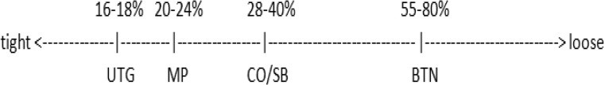

到目前为止，我们只讨论了根据特定情况何时应该跟注、下注和加注。我们还没有详细讨论下注和加注的实际下注尺寸（相对于底池大小）。换句话说，我们应该下注多少？

## 介绍

找到合适的下注尺寸需要比你想象的更多思考。在本主题中，我们将讨论翻牌前和翻牌后的下注尺寸，并解释为什么在特定情况下我们更倾向于使用特定的下注尺寸。

**翻牌前**

确定合适的下注尺寸主要取决于两个因素。首先是我们的整体游戏计划。当我们采用紧凶风格时，我们几乎可以在任何位置进行底池开池加注。另一方面，如果我们采用松凶风格，我们也可以考虑选择较小的开池加注尺寸。第二个因素是牌桌的游戏计划。如前所述，你需要根据牌桌上不同类型玩家的动态调整你的游戏策略。一般来说，牌桌越紧，你开池加注的下注尺寸就应该越小。这是因为在紧的牌桌上，我们较小的加注通常有更高的弃牌权益，而且不会进入太多的多人底池。在较松的牌桌上，我们更喜欢价值牌，所以应该选择更大的加注。

对于 3-bet，我建议始终 3-bet 到底池。这可以简化你的整个游戏。如果你 3-bet 的尺寸较少，那么你应该有一个明确的理由。改变 3-bet 尺寸可能相当困难的另一个原因是，你必须将不同的牌型与相应的 3-bet 尺寸联系起来。这可能会让你的对手很容易预测你总是用强牌 3-bet 到底池，而用弱牌 3-bet 的尺寸较少。第三，较小的 3-bet 可能会促使更多冷跟注者仅仅为了他们跟注获得的丰厚底池赔率而加入底池（尤其是在较低级别），这对你的单挑牌来说是极为不利的。最后，人们倾向于在 3-bet 底池中对 c-bet 弃牌很多，所以当你用较小的 3-bet 尺寸进行 3-bet 时，你赢得的底池也会更小。

**翻牌后**

选择合适的翻牌后下注尺寸比翻牌前更加复杂。有几个因素会影响到你。你必须考虑牌面的结构，并考虑哪种下注尺寸最合适。我们将在今天的练习中更深入地探讨这个话题。

## 测验

1. 你应该在翻牌前 / 翻牌使用哪些不同的开池加注尺寸？为什么？
2. 哪些其他因素决定了我们在翻牌 / 转牌 / 河牌用价值牌和诈唬牌应该选择哪种下注尺寸？

## 解答

1. **你应该使用哪些不同的开池加注尺寸？**
    
    **翻牌前**
    
    UTG：底池
    MP：底池
    CO/SB：2.5bb
    BTN：2.5bb
    
    **为什么？**
    
    正如我们在简介中讨论过的，有不同的策略。一般来说，我喜欢并建议你在 UTG 和 MP 玩得紧，在后位玩得松。这是因为位置的价值很高，我们希望剥削利用那些经常弃牌或在翻牌后不利位置玩得弱的玩家。在下图（图 8）中，我将向你展示我在各个位置开池加注的频率，同时，牌桌的松度大致如何影响我在不同位置开池加注的频率。每个位置左侧的数字是我针对非常松的牌桌的建议，而右侧的数字是我针对紧牌桌的建议开池加注频率：
    
    
    
    图8：开池加注范围如何在后面位置变得更松的说明
    
    你可能已经注意到，SB 是可以开池的最后位置，但并非最松的位置。这是因为在 SB 开池加注，翻牌后我们对 BB 没有位置优势。我们可以相当松地偷盲，因为我们后面只剩下一位玩家可以行动，而且我们知道我们可以赢下盲注，或者在单挑底池中与 BB 对战。
    
    我们还可以根据牌桌玩家的类型调整下注大小。如果我们在 BTN，盲注位置有两位弱手玩家，我们可以利用我们较弱的范围降低下注大小来剥削利用他们。除非弱手玩家突然拿到超强牌，否则他们不会在意我们选择的下注大小，而是会根据他们的静态策略继续弃牌。
    
    **翻牌**
    
    1/3 底池：锁定牌面，4-bet 底池中的对子牌面
    1/2：对子牌面 / 同花牌面
    2/3：干燥牌面
    3/4：听牌很多的牌面
    底池：溜入底池，SPR < 2 的情况，多人底池听牌很多的牌面
    
    **为什么？**
    
    选择翻牌后下注大小的主要考虑因素是你击中牌面的力度以及你认为对手击中牌面的力度。我们小尺寸下注的牌面很难击中，或者通常面对当前坚果牌（即所谓的锁定牌面）的补牌有限。锁定牌面的一个例子是 A♠️-A♣️-K♠️ 翻牌，所有牌面对当前坚果牌（即 A-A-A-A-K）都几乎是听死牌，甚至面对更现实的牌（如 A-K-x-x）也是如此。牌面的听牌越多，可以跟注的牌就越多，我们就越需要保护自己的成手牌。翻牌前溜入底池通常较小，我们通常只为价值下注。因此，我们应该倾向于下注底池，以便我们可以积累底池中的资金。
    
2. **哪些其他因素决定了我们在翻牌 / 转牌 / 河牌用价值牌 / 诈唬牌应该选择的下注尺寸？**
    
    **翻牌**
    
    - 牌面结构
    - 对手的感知范围
    - 对手的感知 Hero 范围
    - SPR
    
    **转牌**
    
    - 以上所有要点
    - 在惊悚牌上比在空白牌上下注更小
    - 在能带来更多听牌的牌上下注更大
    
    **河牌**
    
    - 翻牌到河牌的所有要点
    - 评估整手牌（包括翻牌前）
    
    正如你所见，除了牌面结构之外，还有很多其他因素会影响我们选择的下注尺寸。对手的感知范围是指我们根据已经观察到的对手以及他的 VPIP / PFR / 3-Bet 数据，认为他会玩的牌的范围。如果我们在河牌圈，并且需要考虑他愿意用我们认为他的范围支付多少我们的赢牌，这一点也很重要。
    
    对手对 “Hero” 感知范围就是对手认为我们持有的范围。最简单的例子是，当我们用 100BB 有效筹码 4-bet 时。对手对 Hero 感知范围迫使他认为我们持有的是 A-A-x-x。如果公共牌是 A 或对子，我们只需小尺寸下注就能获得很大的弃牌权益。
    
    在翻牌，我们仍然需要考虑的因素是 SPR 的情况。当 SPR 小于或等于 2 时，底池下注几乎总是最佳选择 - 前提是有一些补牌可以听。这可以最大化弃牌权益，同时在保持平衡的同时，最大限度地利用我们顶端范围的价值。
    
    在转牌，有一条一般的经验法则是，“惊悚牌” 你应该下注比空白牌更小 。想想 J♥️-10♣️-3♣️ 的翻牌圈。跟注此翻牌的牌通常是同花听牌、像 J-10 这样的成手牌，以及可能还有一对的包牌。假设转牌来了一张 J♠️。现在实际上没有理由下大注，因为所有持有顺子或同花听牌的玩家都应该对小尺寸下注弃牌，而像 J-10-x-x 这样的成手牌则不会对任何下注弃牌，无论大小。
    
    在河牌，关于下注大小，我们并没有太多在翻牌和转牌没有考虑到的新因素。重要的是要考虑整手牌，然后决定最佳下注大小。为了更好地理解所有这些因素，我将带你通过一手完整的牌局进行演示。在此过程中，我将重点介绍每个关键的考虑因素。这也是你第一次接触牌局阅读。
    
    **翻牌前**
    
    假设所有玩家的筹码深度都是 100BB，我们是第一个在 BTN 行动的玩家。我们翻牌前用 A♠️-J♠️-3♣️-2♣️ 偷盲 2.5bb。SB 弃牌，BB 对手跟注。这导致在翻牌 SPR 很大。
    
    **翻牌**
    
    牌面是 Q♠️-9♥️-4♠️。对手过牌。我们持有坚果同花听牌，在翻牌持续下注 75% 的底池，因为这是听牌很多的湿润牌面。对手跟注。
    
    **转牌**
    
    转牌是 6♣️，所以牌面现在是 Q♠️-9♥️-4♠️-6♣️。对手过牌。现在我们除了坚果同花听牌外，还有一个弱卡顺听牌。他的感知范围现在倾向于一对带有额外牌的牌（例如弱同花听牌或顺子听牌）。这是因为他的强牌在这种听牌较多的翻牌圈可能已经下注或过牌 - 加注了。我们在转牌圈下注大约 80-90% 的底池，因为 6♣️虽然不是一张惊悚牌，但确实能带来更多顺子听牌。同时，这张牌并不能组成很多强两对，所以他也不得不放弃跟注翻牌的牌（这对我们来说非常有利）。同时，我们希望用我们的下注尺寸来更严厉地惩罚听牌，因为我们认为听牌可能在他的范围之内。对手跟注了我们的转牌下注。此时，我们知道他的牌力并不强，因为现在他肯定会用他的强牌（比如暗三条）表现出攻击性，因为几乎每张河牌都能完成听牌。
    
    **河牌**
    
    河牌来了一张 6♦️，使得最终的公共牌面变成了 Q♠️-9♥️-4♠️-6♣️-6♦️。对手过牌。即使我们错过了所有的听牌，这张牌也不应该改善对手的牌力。此外，对手对我们的感知范围非常强，因为我们在翻牌和转牌都下注，而公共牌面我们很可能代表一手强牌。所以，通过下注这张河牌，我们可以给对手施加巨大的压力。我们应该下注足够大，让他弃掉他的一对 Q、超对和其他弱牌。我建议下注大约底池的 60-70%。下注越大，效果越差，因为唯一会跟注的牌是成手牌（例如，拿着 6，或者慢玩的暗三条变成葫芦（考虑到对手因为没有提前加注而在面对听牌时损失了多少价值，他的葫芦打得不好）。除非他是个十足的鱼，否则剩下的牌都会弃牌。
    
    ## 练习
    
    尝试找到最适合你风格的翻牌前下注尺寸。你可以像我之前介绍的那样，画一个图表来展示你的范围是如何推导出来的，然后根据图表调整你的下注尺寸。此外，还要考虑你在当前级别最有可能遇到的牌桌情况，并据此调整你的范围和下注尺寸。现在，你已经掌握了关键的参考点，可以找到适合你的游戏和牌桌的最佳下注尺寸。在今天的课程以及之后的课程中，请继续练习翻牌后的下注大小，并在下注前尽可能多地考虑各种因素。
    
    ## 总结
    
    - 调整翻牌前下注大小
    - 影响翻牌后下注大小的因素