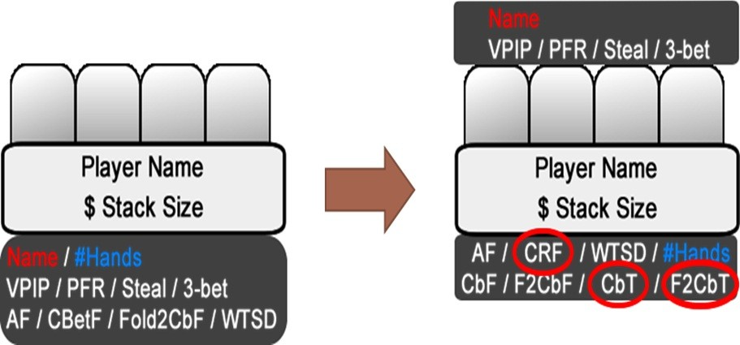
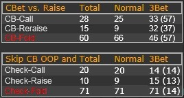
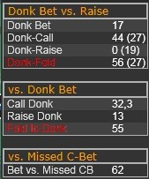

我们已经探讨了如何使用基本的翻牌前统计数据来分析对手。今天，我们来探讨下一步，即我们将在翻牌、转牌和河牌使用的统计数据。

## 简介

我们在附录 4 讨论 HUD 时，已经介绍了一些翻牌后统计数据。因此，本节中你看到的统计数据并非都是全新的。请确保将我们经常引用的统计数据添加到你的主 HUD 中。我建议你将当前的 HUD 重组为两个面板，如图 9 所示。圈出的是你应该考虑添加到 HUD 中的新翻牌后统计数据。

图9：将当前的 HUD（左）拆分为两个面板，以区分翻牌前和翻牌后（右）

由于所有未圈出的统计数据都已在附录 3 中讨论过，因此我们只讨论新增的统计数据。除了这三个新的 HUD 统计数据外，我还将介绍一些我喜欢集成到弹出窗口中的翻牌后统计数据。您可能会发现这些数据对解答练习题非常有用。

**HUD 统计数据**

- Check-Raise Flop (CRF)：此值表示该玩家在翻牌过牌后加注的频率。我建议使用 “Check-Raise Flop vs. PFA” 统计数据，而不是通用的翻牌过牌 - 加注统计数据。当你是翻牌前主动者时，你最需要这个统计数据，因此将其直接显示在 HUD 中而不是弹出窗口中会很方便。此统计数据的合理值应在 15% 左右。许多较弱的常客玩家和低级别玩家的 CRF 通常低于 10%。
- Continuation Bet Turn (CbT)：此统计数据告诉你该玩家在翻牌 c-bet 后，在转牌 c-bet 的频率。我建议，对于转牌持续下注（CbT）和翻牌持续下注（CbF）统计数据，都应整合 “单次加注底池” 版本（“CbF/CbT in SRP”），以便尽可能详细地了解最常见的单次加注底池情况。你的转牌 c-bet 率应在 55% 左右。
- Fold to Continuation Bet Turn (F2CbT)：此统计数据显示该玩家在跟注翻牌后，在转牌对 c-bet 弃牌的频率。与翻牌持续下注（CbF）和转牌持续下注（CbT）统计数据一样，我建议你使用 “单次加注底池（SRP）” 版本的 F2CbF 和 F2CbT 统计数据。与弹出窗口一样，你甚至可以考虑为有利位置和不利位置添加 F2CbF/T 值。在转牌超过 50% 的弃牌率会让你容易受到激进对手的攻击。

**弹出式统计数据**

你应该将以下弹出式统计数据整合到你的 “CbF” 统计数据中。

- Fold Continuation Bet to Raise on the Flop (CB-Fold F)：此统计数据显示对手在翻牌持续下注 - 弃牌的频率。当对手的 c-bet 频率较高时，此统计数据尤其有价值。你可以用它来判断他愿意对你的加注弃牌的频率。那些在翻牌 c-bet 后，对加注弃掉弱的同花的玩家，其 CB-Fold F 值通常为  55-60%。当你看到这个阈值时，你应该经常发起攻击。
- Skip Flop Continuation Bet and Check-Fold (FSkCbF)：此统计数据显示该玩家作为翻牌前主动方并在不利位置过牌时弃牌的频率。大多数低级别常客玩家都有一个很大的漏洞，当他们作为翻牌前主动方过牌到你在翻牌下注时，几乎总是弃牌（高达 85% 或更多）。

为了更好地理解此类弹出窗口的实际效果，图 10 展示了我建议的 CbF 弹出窗口设计方法：

图 10：第一个弹出窗口：CbF

在本例中，“Normal” 表示单次加注底池，而 “3Bet” 表示 3-bet 底池。

你应该将以下弹出窗口统计数据整合到你的 “F2CbF” 统计数据中。

- Bet vs. Missed C-Bet：此统计数据与 FSkCbF 统计数据相对应。它决定了当翻牌前主动方过牌时，该玩家的下注频率。当此值较高时，你可以在听牌较多的公共牌面上用过牌 - 加注你的强牌，意图让该玩家用半诈唬下注，然后用你的加注将他逼入绝境。40% 左右的数值应该被视为你过牌 - 加注的默认值。
- Donk Bet (Db)：此数据表示玩家面对翻牌前主动方反主动下注的频率。该值越高，玩家反主动下注的牌力越弱。可剥削利用的 Db 数据从 20% 左右开始。
- Fold to Donk Bet (F2Db)：此数据与 Db 数据相对应。它表示玩家面对反主动下注时弃牌的频率。最好将此数据与 “F2Cb IP” 值进行比较，以判断该玩家在反主动下注时比持续下注更谨慎还是更不谨慎。

图 11 展示了 F2CbF 弹出窗口的示例：

图 11：我们的第一个 F2CbF 弹出窗口

## 测验

在做出决定前 a) 作为翻牌前主动方，b) 对抗翻牌前主动方，你应该考虑翻牌后最重要的统计数据是什么？

## 解答

**在做出决定之前，你应该考虑哪些最重要的数据：**

**a) 作为翻牌前主动方？**

- VPIP/PFR：在翻牌后，你仍然应该考虑一些翻牌前数据来确定对手的范围。幸运的是，VPIP 和 PFR/RFI 足以应对大多数游戏情况。其他翻牌前数据，例如（跟注）3-bet，也有助于确定对手在翻牌持有的范围。
- Fold to CBet F IP/OOP / Fold to CBet T：这些数据会极大地影响你是否要在翻牌圈 c-bet 的决定。它们是你决定是否应该用范围底端的牌下注，还是直接过牌 / 弃牌，避免继续输钱的主要考虑因素。正如这里所列，你可能需要在相应的弹出窗口中添加 F2CbF 数据的位置统计数据，以获取更详细的信息。
- (Check-)Raise CBet：我们将在 c-bet 的讨论中详细探讨这一点（参见下一节），并思考此值如何影响我们的 c-bet 行为，尤其是在我们中端范围的时候。
- WTSD：此值越高，对手的范围越弱，你越应该考虑轻下注以追求价值。
- Bet vs. Missed CBet：此数据表明当我们作为翻牌前主动方过牌时，对手下注的频率。如果此值很高，我们可以通过过牌 - 加注而不是 c-bet 来利用这一点，从而从他的诈唬中获取价值。此外，在翻牌过牌并在转牌加注也是有效的策略。
- AF：此数据可以让你大致了解对手的激进性。当此数据低于 1 时，你几乎总是应该考虑自己下注，而不是希望诱使对手诈唬。
- (Donk Bet)：我将这项数据放在括号中，是因为在反主动下注真正发生之前，你无需考虑它。如果你面对的是反主动下注，那么最好也看看这位玩家的反主动下注 vs. 加注的数据，以便准确判断他的反主动范围实际上有多强。

**b) 对抗翻牌前主动方？**

- CBet F IP/OOP / CBet T：如果 CBet T 的数据明显低于 CBet F 的值，那么他就是在翻牌进行缠打操作的理想对手。为了更好地判断对手在有利位置和不利位置中的行为，你可能需要在你的弹出窗口中添加位置相关的 CBF 数据。
- CBet-Fold F：这项数据总是值得查看的，因为有些对手在持续下注被加注时，弃牌率非常高。
- Skip CBet and…：此值表示该玩家在跳过持续下注 c-bet 后最常采取哪种类型的行动。尤其是在较低级别的牌局中，玩家在这种情况下非常不平衡，当他们在不利位置不 c-bet 时，通常会对下注弃牌 > 80%。
- Fold to Donk Bet：将弃牌给反主动下注和弃牌给 c-bet 的统计数据进行比较始终是个好主意。这样，你就可以确定对手如何处理反主动下注和 c-bet。有时，对手对反主动下注的反应很弱，你应该在他们出现这种漏洞时利用它。
- (WTSD)：这次 WTSD 放在括号中，因为它仅当我们是主动者时才重要。当对手是翻牌前主动方 时，掌握对手进入摊牌频率的信息并不重要。原因是有更重要的值，例如前面提到的 CBet-Fold 或 Skip CBet and Fold 的统计数据。此外，他还是那个有主动权的人。尽管如此，在判断困难时，WTSD 还是能提供很好的帮助。

## 练习

1. 如果你还没有练习，你应该完善当前的 HUD，将其分为翻牌前和翻牌后，并添加我们今天讨论的弹出式统计数据。
2. 现在你应该对这些更详细的翻牌后统计数据有所了解。为了充分利用这些数据的强大功能，你可能需要回过头来多复习几遍本课，才能真正了解在哪种情况下需要哪些统计数据。我强烈建议您投入时间和精力来学习这些统计工具。尽职解读统计数据的回报是：即使没有真正看到对手的底牌，你也能真正理解何时以及如何利用这些强大的工具来剥削利用对手。

## 总结

- 如何运用翻牌后数据