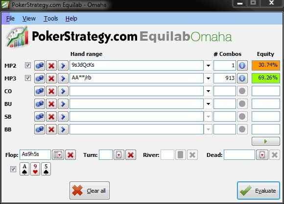
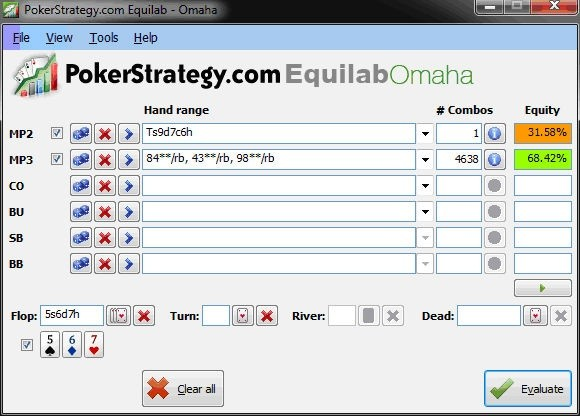
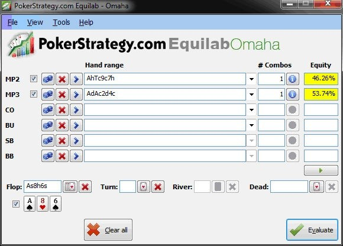

本节的主题是 PLO 中的权益。在本课中，我们将学习更多关于手牌权益的知识。更重要的是，我们将学习如何利用补牌来估算我们的权益。

## 介绍

这将是我们的第二个数学主题。不过别担心，与底池赔率课程类似，它并不难。我们甚至不需要计算器就能理解这个主题！我们已经从附录 5 中了解了如何将每张补牌乘以大约 2.5% 来估算我们在一条街上的权益。今天，我将解释一下，当我们只知道补牌数量时，我如何估算两条街（从翻牌到河牌）的权益。有两个主要原则你必须记住。我称其中一个为锁定，而另一个为未锁定。

**锁定**

每张阻断牌 / 补牌都会改变我们的权益 4%。
后门同花听牌（BDFD）= 3%
示例：同花听牌 vs. 顺子

**未锁定**

每张阻断牌 / 补牌都会改变我们的权益 3%。
后门同花听牌（BDFD）= 2.5%
示例：同花听牌 vs. 暗三条

现在我们将讨论这些方法的背景。首先，我们将分析未锁定场景：

**公共牌：**A♠️-9♥️5♠️
**Hero：**K♠️-Q♦️-J♣️-9♠️

假设这是一个 4-bet 底池。你可以很确定你的对手拿着 A-A-x-x，但没有同花听牌，所以知道你对抗这手牌的权益非常重要。看看我们是如何做的。我们知道这是一个未锁定场景。这意味着如果我们击中一张补牌，我们仍然有可能输给更好的牌。在这种情况下，当我们击中同花时，对手仍然可以通过改进成葫芦来赢得底池。首先，我们需要计算我们的补牌、阻断牌和后门同花听牌。

补牌：9 张（2♠️、3♠️、4♠️、6♠️、7♠️、8♠️、10♠️、J♠️、Q♠️）阻断牌：1 张（9♠️）
后门同花听牌：无

在未锁定的场景下，“每张阻断牌 / 补牌都会改变我们的权益 3%”，因此现在的计算很简单：9×3 + 1×3 = 30%。

为了演示权益，我使用 PokerStrategy.com Equilab 软件。EquilabOmaha 的图形用户界面如下图 12 所示，你可以查看结果。

图 12：EquilabOmaha 权益计算（含阻断牌）。

如你所见，我们的估算与实际结果非常接近！

锁定方法类似，只需为我们的补牌 / 阻断牌 / 后门同花听牌使用更高的乘数即可。让我们练习一下！

## 测验

**公共牌：**5♠️-6♦️-7♥️
**Hero：**10♠️-9♦️-7♣️-6♥️
**对手：**顺子

底池：$100
Hero 下注 $50，对手加注到 $200 并全下

计算

1a) Hero 有多少胜率（也用今天的方法估算一下）？

1b) Hero 需要多少权益才能全下盈利？

1c) Hero 可以在这里跟注吗？

**公共牌：**A♠️-8♥️6♠️
**Hero：**A♥️10♣️-9♣️-7♥️

预估并计算

Hero 面对以下牌型有多少权益：

2a) A♦️-A♣️-2♦️-4♣️（顶三条）？

2b) A♦️-K♠️-Q♠️-J♣️（顶对 + 同花听牌）？

## 解答

**公共牌：**5♠️-6♦️-7♥️
**Hero：**10♠️-9♦️-7♣️-6♥️
**对手：**顺子

底池：$100
Hero 下注 $50，对手加注到 $200 并全下

1a) Hero 有多少权益（也用今天的方法进行预估）？

让我们先从估算开始：补牌：7 到 8（6♠️、6♣️、7♠️、7♦️、8♠️、8♦️、8♥️、8♣️（对手可以用顺子阻断一张 8））

阻断牌：无

后门同花听牌：无

结果：7(8) x 4（锁定）= 28% (32%)。这个例子之所以锁定，是因为当我们击中补牌时，对手已经没有办法改善他的牌了。

现在将我们的估算与计算结果进行比较：对手可能持有 3 张顺子，因此我们必须计算我们对所有顺子的权益。详情请见图 13。

图 13：我们对抗所有顺子组合的权益

平均而言，我们的权益约为 32%。

底池：$100
Hero 下注 $50 ，对手加注到 $200 并全下

1b) Hero 需要多少权益才能全下盈利？

i) 150 赢 350 = 2.3 : 1 = “3.3 次中有 1 次” = 1 / 3.3 = 30%
ii) 150 / ((100 + 50 + 200) + 150) = 30%

1c) Hero 可以在这里跟注吗？

Hero 可以在这里跟注，但这几乎不正确。他需要 30% 的权益，而平均权益为 32%。但这个决定没有考虑抽水。这意味着你需要的权益总是会比数学计算出的要高一些。因此，在有抽水的现金游戏中，如果你的跟注接近盈亏平衡，那么抽水带来的价值损失应该会让你选择弃牌。

**公共牌：**A♠️-8♥️6♠️
**Hero：**A♥️10♣️-9♣️-7♥️

估计：Hero 面对以下牌有多少权益：

2a) A♦️-A♣️-2♦️-4♣️（顶暗三条）

补牌：13 (5♠️, 5♦️, 5♥️, 5♣️, 7♠️, 7♦️, 7♣️, 9♠️, 9♦️, 9♥️, 10♠️, 10♦️, 10♥️)
阻断牌：1 (A♥️)
后门同花听牌：1 (♥️)
结果：13 × 3 + 3 + 2.5 = 44.5%

计算：Hero 有多少权益？

图 14：计算我们面对顶三条的权益

**公共牌：**A♠️-8♥️6♠️
**Hero：**A♥️10♣️-9♣️-7♥️

估计：Hero 面对以下牌有多少权益：

2b) A♦️-K♠️-Q♠️-J♣️ (顶对 + 同花听牌)

补牌：9 (5♦️, 5♥️, 5♣️, 7♦️, 7♣️, 9♦️, 9♥️, 10♦️, 10♥️)
阻断牌：无
后门同花听牌：1 (♥️)
结果：9 × 3 + 3 = 30%

计算：Hero 有多少权益？

图 15：计算我们对抗顶对  + 同花听牌的权益

本节的练习到此结束。希望你理解了目前为止的所有内容。如有任何疑问，请返回练习，并在之后重复练习。

## 练习

你可以在游戏过程中随时练习本节的方法。只需估算你对抗对手最有可能拿到的牌的补牌，然后确定你的权益即可。现在，你拥有了一种简单而有效的方法，可以在游戏中快速计算你的权益，而无需使用权益表和其他工具。

## 总结

- 使用补牌计算权益
- 锁定与未锁顶原则