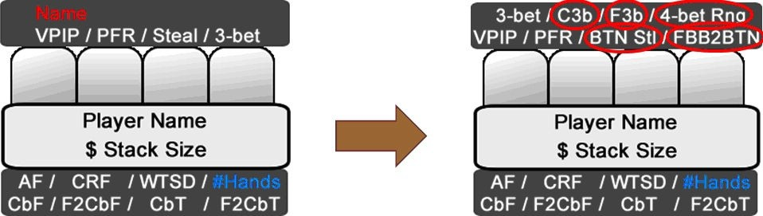
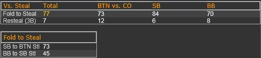
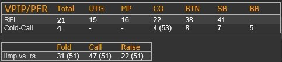

第二周已经结束。你在牌桌上是否一直保持着盈利状态？你是否正在考虑升级？在此之前，不妨先了解一下那些能够显著提升你翻牌前水平的重要统计数据。

## 介绍

几天前，我们更新了 HUD，增加了一些额外的翻牌后统计数据和弹出窗口。今天，我将告诉你哪些统计数据对于提升翻牌前水平至关重要，应该添加到 HUD 中，或者至少添加到弹出窗口中。同样，我将首先向你展示你当前 HUD 的实际外观，以及为了涵盖大部分重要的翻牌前统计数据，你应该添加哪些统计数据。图 16 展示了这些调整。左侧显示你当前的 HUD，右侧显示你的目标 HUD。

图16：将重要的翻牌前统计数据添加到你的 HUD

你可能已经注意到，“姓名” 不再出现在新版 HUD 中。这是因为比玩家姓名更有价值信息实在太多了。接下来，我们将解释所有新的 HUD 统计数据（圈出部分），以及一些你可能想添加到翻牌前弹窗中的其他统计数据。

### HUD 统计数据

**Call 3-Bet (C3b) Fold 3-Bet (F3b) 4-Bet Range (4-Bet Rng)**

我将这三个统计数据放在一起，因为它们彼此关联。我认为尽可能多地了解对手的 3-bet 倾向以及他们对 3-bet 的反应非常重要。留意那些面对 3-bet 弃牌率超过 20% 的玩家，并尝试通过大量 3-bet（尤其是在有利位置）来利用他们。4-bet 范围可以反映对手对非 A-A-x-x 牌型 4-bet 的频率。 4-bet 范围约为 2.5% 表示该玩家只会 4-bet A-A-x-x 的牌。

**BTN Steal**

BTN 偷盲决定了该玩家在 BTN 时加注的松紧程度。这项数据因玩家而异。标准的 “ABC-熟客” 玩家可能只会偷盲 35% 左右，而典型的松牌玩家则倾向于在 BTN 偷盲 60% 以上的牌。

**Fold BB to BTN Steal (FBB2BTN)**

当你在 BTN 时，如果你想知道在尝试偷盲时应该玩得有多松，这项数据会发挥作用。如果这项数据高于 70%，你应该考虑在 BTN 时偷盲。

**弹出式统计数据**

以下统计数据应集成在你的 “FBB2BTN” 弹出式统计数据中。

**Fold BTN to CO Steal (FBTN2CO)**

此数据可以帮助你确定在 CO 可以开池的松度。如果 BTN 对你的 CO 偷盲弃牌很多，那么你可以考虑在 CO 和 BTN 偷盲时使用几乎相同的范围。此数据越低，你需要偷盲的范围就越强（即越紧）。标准的 FBTN2CO 值约为 70%。

**BTN vs. CO 3-bet (3bBTNvsCO)**

这个数据告诉你 BTN 对 CO 3-bet 的频率。我们已经提到过，当 BTN 对 CO 频繁 3-bet 时，这可能表明我们应该考虑离开牌桌。这个数据越高，你从 CO 位置偷盲的难度就越大。我们将在未来的课程中学习如何有效地提升这个价值。

**Fold SB to BTN Steal (FSB2BTN)**

这个数据应该始终与 FBB2BTN 结合使用。如果你结合这两个数据，你应该就能很好地了解自己从 BTN 偷盲的频率。如果这个数据对你来说在 80% 到 90% 左右，也不用担心，因为 SB 位置绝对是最差的位置。如果你从那里玩太多手牌，你就会输钱。

**Fold BB to SB Steal (FBB2SB)**

仅考虑此数据，你就能很好地了解对手对游戏的看法。优秀的常客玩家的 FBB2SB 数据会低于 10%，因为你拥有如此好的赔率，并且可以在剩余的牌局中在有利位置。ABC 玩家和较差的常客玩家会坚持使用通常超过 50% 的严格 FBB2SB 数据。你的 SB 偷盲范围应该几乎完全根据此数据（以及 F2CbF 数据）来确定。

图 17 展示了一个 FBB2BTN 弹出窗口的示例。

图 17：FBB2BTN 弹出窗口示例

最后，以下是你应该考虑添加到 “VPIP” 弹出窗口中的数据：

**（位置）Raise First-In (RFI)**

此值显示当没有玩家先入底池时，玩家的加注范围。众所周知，来自 CO、BTN 和 SB 的 RFI 被称为 “偷盲”。你应该在弹出窗口中为每个位置添加 RFI。

**Cold-Call 3-Bet (CC3b)**

这项统计数据告诉你，一位尚未主动投入底池（因此不会排除盲注）的玩家在他之前跟注 3-bet 的频率。对于优秀的玩家来说，这个值不应该超过 7%。如果超过 7%，则意味着该玩家跟注的牌太弱。

**Limp-Fold (LF)**

最后一个弹出统计数据告诉你，当玩家溜入后面临后面的加注时，他弃牌的频率。由于大多数 PLO 玩家希望看到翻牌，因此一旦他们进入底池，不要指望在这里看到太多持有高价值牌的玩家。但是，如果持有高溜入 - 弃牌的玩家溜入后再次加注，你一定要跟踪这一情况。这可能是所谓的 “纽约后 - 加注”，即一名玩家故意在激进的牌桌上溜入一手强牌，以便对其进行 3-bet。

图 18 应该能让你了解你的 VPIP 弹出窗口可能是什么样子：

图 18：VPIP 弹出窗口

现在你知道我的 HUD 上有什么了，轮到你思考在考虑一些基本情况时，你可能需要考虑哪些统计数据。试着通过解决今天的练习来做到这一点。注意，你可能还需要考虑翻牌后的数据！

## 测验

在以下翻牌前情况下，你在做决定之前应该考虑哪些最重要的统计数据？为什么？

1. 对抗我们前面 1 名溜入者。
2. 对抗我们前面 2 名或更多溜入者。
3. 对抗我们前面 1 名加注者。
4. 对抗我们前面加注者和跟注者。
5. 对抗我们前面加注者和再加注者。
6. 在 CO/BTN 面对未开池。

## 解答

**在做决定之前，翻牌前应该考虑哪些最重要的统计数据？为什么？**

1. **对抗我们前面 1 名溜入者**
    
    Fold2CBet Flop：虽然我们讨论的是翻牌前统计数据，但考虑一些对抗单个溜入者的翻牌后统计数据也很重要，这样才能全面了解情况。我们了解对手在面对翻牌 c-bet 时弃牌越多，我们就能在翻牌前尝试轻的隔离他。
    
    后方玩家的 VPIP/3bet：其次，我们需要考虑我们后面的玩家。我们在前面的部分已经讨论过这一点。这些数值越高，我们在尝试隔离时的手牌范围就越紧。我们应该将范围更多地偏向那些可以打多人底池（即对抗高 VPIP 时）或可玩性高的牌（即对抗高 3-bet 时）。
    
    （Limp-Fold）：最后，由于许多玩家通常在有人溜入后才跟注，因此我建议仅当玩家采取其他行动时才查看此统计数据。
    
2. **对抗我们前面 2 名或更多溜入者**
    
    无：这可能听起来很奇怪。但是，当我们前面有 2 名溜入者时，我们已经知道，如果我们加入底池，翻牌底池几乎肯定会至少有 3 人（因为习惯性溜入者总是在感觉到多人底池 “家庭底池” 时加入）。由于这已经定义了我们的游戏范围，因此当底池中已经有两名溜入者时，没有其他数据可以改变我们的玩法。
    
3. **对抗我们前面 1 名加注者**
    
    RFI（加注者的）：RFI 值决定了他的开池范围有多强。由此，我们可以确定我们可以多轻松地进行 3-bet 来获得价值或捍卫我们的盲注。具体的调整将在后续章节中讨论。
    
    CBet Flop, CBet Turn：这是翻牌后数据的第一个重要组合。这些数据决定了我们预计用我们的牌摊牌的频率。
    
    CBet-Fold Flop：翻牌 CBet-Fold 值很高，那么我们也可以在翻牌前跟注更多牌。我们这样做的目的是在对手持续下注较多的情况下，在底池外诈唬加注。
    
    FoldTo3Bet、Fold2CBet 3b：结合这两个数据，你也能很好地利用对手。务必结合使用这两个数据。当你在 BTN 对 CO 位置时，这组数据尤其有用。你甚至可以在 3-Bet 底池数据中使用位置相关的 FoldTo3Bet 和 Fold2CBet，从而更详细地了解它们。这让你在有利位置时能够使用更轻的 3-Bet。
    
    Skip CBet 和 Check-Fold：如果这些值很高，并且 c-bet 频率较低，那么你也可以使用这组数据来利用它们。当你后面的玩家比较紧时，只需被动跟注来防守更多牌即可。
    
    后面玩家的 VPIP/Cold-Call 3-Bet：如果这些数值很高，那么你不应该试图剥削利用你前面的单个加注者，因为即使你 3-bet，底池大多数情况下也会变成多人底池！
    
4. **对抗我们前面加注者和跟注者**
    
    RFI（第一个加注者的）：这个数据表明了对手范围的强度。
    
    VPIP（冷跟注者的）：如果第一个加注者的 RFI 和冷跟注者的 VPIP 都很高，那么我们可以考虑稍微轻度的挤压以获得价值。
    
    4-bet（加注者的）：这一点不太重要，因为大多数人的 4-bet 范围通常仅限于 A-A-x-x。所以不值得过度考虑这个问题，除非对手是弱手玩家或疯鱼玩家。
    
5. **对抗我们前面加注者和再加注者**
    
    RFI（第一个加注者的）：该数据表明了对手范围的强度。
    
    3-bet（3-bet 者的）：只有当该数据非常高时，我们才应该考虑对这两个对手进行轻度的 4-bet。
    
6. **在 CO/BTN 面对未开池**
    
    BTNFold2CO：当我们在 CO 时，后面只有一位玩家占据有利位置。因此，了解他的牌型非常重要。如果 BTN 玩家经常对我们的 CO 偷盲弃牌，那么我们可能会放松范围，考虑在 CO 偷盲几乎全部的 BTN 范围。
    
    BTNvsCO3b：这个数据决定了 BTN 玩家在 CO 偷盲时 3-bet 的频率。如果这个数据很高，那么我们应该考虑在 CO 收紧，避免用无法防御 3-bet 的牌加注。如果这个对手真的很强，那么这可能是我们离开牌桌或至少换位的理由，因为 CO 是我们扑克中赚钱第二多的位置，收紧会大幅降低我们的胜率！
    
    SBFold2Steal：了解 SB 玩家的玩法有多松总是有益的。他总是在翻牌处于最差的位置。因此，这项统计数据通常决定底池是进入多人底池、单挑还是无人争夺。
    
    BBFold2Steal：如果 SBFold2Steal 和 BBFold2Steal 的统计数据都很高（例如超过 70%），那么你应该考虑将其作为 BTN  100% 偷盲的许可证。
    
    Fold2CBetOOP Flop：如果盲注玩家是翻牌前的跟注站，那么你也应该看看这项统计数据。有些玩家防守盲注比较松散，但对翻牌后如何打牌非常不确定，并且倾向于在牌局中弃牌很多。
    

## 练习

我们今天介绍了很多关于统计数据的理论。你应该花时间用这里介绍的统计数据构建你自己的 HUD 和弹出窗口。当你对你的 HUD 感到满意时，就可以在今天的牌桌上测试一下了。

## 总结

- 常见翻牌前场景的重要统计数据