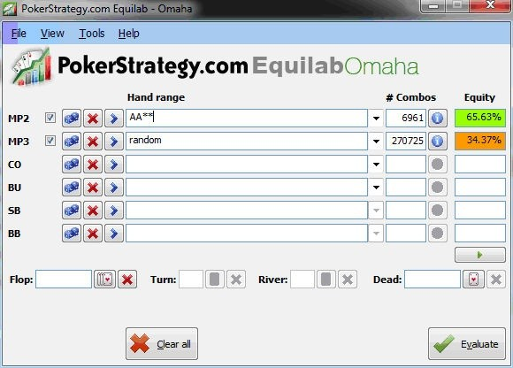

你还记得之前我建议过，当有人在有利位置不停地对你进行 3-bet 时，你应该离开牌桌吗？虽然我们讨厌不停地 3-bet 的人，就像毒药一样，但我们也必须尊重他大胆的打法。现在，是时候让你成为牌桌上每个人都害怕的那种玩家了。我将教你如何像疯子一样进行 3-bet，但你的疯狂中也蕴含着方法。一如既往，我们不想盲目地推行新的概念。相反，我们将仔细研究哪些牌型和哪些情况适合 3-bet。

## 介绍

与 NLHE 相反，没有哪个优秀的 PLO 玩家会进行纯诈唬 3-bet。这是因为在 PLO 中 3-bet 的弃牌权益通常要低得多，因为翻牌前的权益优势较小。例如，即使是 A-A-x-x，PLO 中冷热权益最高的牌型，在翻牌前对抗随机牌型（即从牌堆中随机抽取的 4 张牌）的权益也只有 65%。相比之下，在 NLHE 中，A-A 对抗随机牌型有 85% 的优势，你就能明白为什么在 PLO 中对抗 3-bet 大量弃牌并非明智之举。

图 19 展示了 A-A-x-x 在 PLO 中对抗随机牌型的翻牌前权益。

图 19：A-A-x-x 对抗随机牌的权益

虽然冷热权益差异可能不像德州扑克中那么大，但有时我们仍然需要弃牌来应对再加注。这是因为我们的手牌翻牌前还没有结束。翻牌后我们还需要进行三轮（可能花费不菲的）下注。因此，如果你的牌缺乏击中潜力或包含 “悬垂牌”，并且你处于不利位置，你应该避免用这些牌来对抗 3-bet 玩家。

另一方面，当你处于有利位置时，你可以进行所谓的 “轻度 3-bet”（即用可能不值得再加注的牌值进行再加注）。你可能已经在有利位置防守图表中看到了 “轻度 3-bet” 这个术语。一般来说，你应该只用那些在单挑底池中表现良好的牌做轻度 3-bet，这些牌要么有可能击中各种听牌，要么能够压制松的开池加注范围。

我们也可以放松我们的 3-bet 范围以对抗偷盲。这是因为他们的范围通常非常松（我想你还记得常见的 BTN 偷盲范围……），所以我们有很大潜力用那些能够压制他们偷盲范围或在冷热牌权益方面足够好的牌来对抗这些范围。现在，我们将在练习中仔细探讨所有这些主题。

## 测验

1. 哪些牌型适合对抗偷盲（RFI > 50-55% 的玩家）进行 3-bet？
2. 哪些因素对轻度 3-bet 至关重要？
3. 哪些牌型适合松 / 轻度 3-bet？

## 解答

1. **哪些牌型适合对抗偷盲（RFI > 50-55% 的玩家）进行 3-bet？**
    
    我们已经从防守图表中了解了哪些牌型通常适合 3-bet。我们还没有做的是考虑如何调整对抗偷盲的策略（我相信你已经在你的不利位置防守图表中注意到了这一点）。这是因为在 3-bet 底池中，即使对抗偷盲范围更广的玩家，想要用更松的范围盈利也更加困难。既然你已经了解了最重要的翻牌后概念，我很乐意向你介绍更松的反偷盲范围。以下范围应该比较合适：
    
    对抗偷牌 (RFI >50-55%)：A-B-C-xds、A-B-C-Cds+、A-C-C-Cds+、A-B-B-xss+、A-T-9-8ss+、Q-Q-x-xds+、K-J-10-9ss+、Q-8-7-6ds+、9-9-8-7ss+、8-8-7-6ds+
    
    再次强调，我不建议在不利位置用低连牌进行 3-bet，因为它们的冷热权益太低（甚至为负）。即使是像 9-8-7-6ds 这样看似很强的连牌，权益也远低于像 9-9-8-7ss 甚至 Q-8-7-6ds 这样边缘的反偷盲牌。
    
2. **哪些因素对轻度 3-bet 至关重要？**
    
    以下是进行轻度 3-bet 时需要考虑的一些重要因素的简要概述：
    
    位置：这是最重要的考虑因素。我们只希望在有利位置时进行轻度 3-bet。在不利位置时，切勿用轻度范围 3-bet，除非你对对手弃牌的 3-bet 统计数据有近乎完美的解读。
    
    可玩性：只考虑用具有一定可玩性的牌进行轻度 3-bet。记住，轻度 3-bet 的理念是用较弱的范围获胜。所以，确保你至少能够在被跟注时在多种不同的公共牌面上进行游戏。
    
    有效筹码量：正如我们在之前的课程中学到的，始终关注对手的筹码量。这也适用于轻度 3-bet。筹码量越大，你可以进行越轻度的 3-bet 。记住，我们 3-bet 的牌是有可玩性的，这些牌不一定比对手的范围更有权益。因此，我们必须保持较高的 SPR，这样我们才更有可能在不摊牌的情况下拿下底池。如果有效筹码量较小，比如 50BB 或更少，我们必须将我们的轻度 3-bet 范围更多地倾向到具有更好权益的牌（例如，像 A-B-B-xss 或 K-K-x-xss 这样的牌）。
    
    我们后面的玩家：还记得我们五步翻牌前计划的第三点吗？在我们 3-bet 之前，我们还应该关注我们左边等待行动的玩家。原因是，只有当我们相对确定最终能够毫无争议地赢得这手牌，或者在单挑底池中与单个对手对战时，我们才会进行轻度 3-bet。因此，如果我们左边的玩家很松，可以冷跟 3-bet，那么轻度 3-bet  则无异于自杀。
    
    能够对抗 4-bet：好消息是，你不会经常被 4-bet。如果你左边一位超级紧的玩家，在你们的游戏中还没有玩过底池，突然醒过来，进行 4-bet，假设最初的加注者弃牌，我们仍然可以考虑跟注我们的轻度 3-bet 范围，因为我们几乎可以 100% 确定这位玩家拿着 A-A-x-x。在这种情况下，我们只需计算一下我们面对这手牌的翻牌补牌，就能轻松知道我们是否有足够的权益（使用我们在第十三天学到的方法）。这也是为什么当我们的牌中有 A 或对子时，我们应该避免轻度 3-bet。这些牌不能跟注 A-A-x-x 的 4-bet，因为它们很少能击中合适的翻牌类型，从而获得对抗 A-A-x-x 所需的权益。为了更好地了解哪些牌可以跟注 4-bet，我推荐你使用 TomGrill 的 “PLO 4-bet计算器”：http://equitybattle.com/4bc/。
    
    加注者 RFI：有些情况下，我们想要在对手范围较松的情况下扩大我们的权益优势，例如当我们在 BTN，面对一个 35% 或更高的松 CO 开池加注范围时。在这种情况下，最好的玩法可能是将 A-K-9-8ss，甚至 A-B-x-xds 这样的牌添加到我们的轻度 3-bet 范围中。如上所述，这些牌型我们必须对 4-bet 弃牌。然而，在对手范围较松的情况下，它们 3-bet 仍然是有利可图的。这是因为有了 A 阻挡牌，我们降低了对手拿到 A-A-x-x 的可能性。而且，在较松的范围内，不会有那么多 A-A-x-x 组合，所以我们不太倾向于弃牌。你仍然应该避免用对子（这种对子无法对抗 4-bet，甚至没有 A 阻挡牌）进行轻度 3-bet。
    
    弃牌权益：前面提到，我们用那些并不一定比对手范围有权益优势的牌进行轻度 3-bet。这是因为我们应该能够凭借 3-bet 本身的威胁性或接下来的持续下注赢得很多底池。关注 “Fold to 3-Bet“（F3b）的统计数据以及 “Fold to Continuation Bet in 3-Bet Pots”（F2Cb3bP）的统计数据总是有益的。这些数字越高，我们可以进行 3-bet 的牌就越多。
    
3. **哪些牌型适合松 / 轻度 3-bet？**
    
    既然我们已经讨论了这些因素，现在是时候给你一些具体的牌例了：
    
    **有利位置**
    
    A-B-B-xds，B-B-B-Css
    6+6+6+6+ds（例如 K-10-9-6ds，Q-J-9-7ds）C-C-C-xds -> 3 张牌互相连接，且最多有 1 个缺口（例如 6-5-4-xds，K-Q-10-xds）对抗高 RFI（>35%）：A-B-x-xds，A-B-B-xss，A-K-9-8ss+，Q-Q-x-xds+
    
    **不利位置**
    
    （仅作为对抗高 F3b 和 F2Cb3bP 值的剥削性行动）A-B-P-Pss，B-B-B-xds（其中 PP = [任意] 对子）
    

## 练习

1. 根据之前练习中呈现的场景和牌局，更新你的不利位置防守图表中的 “对抗偷盲” 部分，以及你两张防守图表中的 “轻度 3-bet” 部分。
2. 今天玩牌时，每次你拿到一手牌，都要判断这手牌是否符合 3-bet 的条件。要特别注意在 CO 和 BTN 位置的牌局，以免错过任何好的轻度 3-bet 机会。尝试仔细考虑所有你必须考虑的轻度 3-bet 因素。同时，也要关注在 SB 和 BB 位置的牌局，看看它们是否符合反偷盲的条件。
3. 使用你的追踪软件（HM2 / PT4），标记你进行反盲牌、轻度 3-bet 或跟注 4-bet 的每一手牌。玩过并标记大约 5 手牌后，退出扑克游戏。
4. 回顾步骤 3 中的牌局，并将这些牌局与你的图表进行比较。查看 3-bet 列表的因素，并确认你已经考虑了其中一个或多个因素。务必突出显示你在 5 手牌样本中没有（但应该）使用的任何因素。
5. 对于你跟注 4-bet 的任何牌，使用 4-bet 计算器计算跟注是否正确。
6. 返回并继续你的游戏——这次要特别关注你突出显示的因素。
7. 重复步骤 3-6，直到你感觉自己也熟悉了突出显示的因素。

## 总结

- 反偷范围
- 轻度 3-bet 因素和范围
- 对 3-bet 和 4-bet 的正确反应