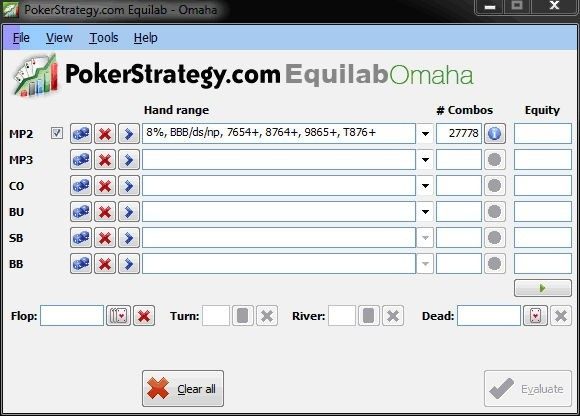

# 第二十天 - 非 A-A-x-x 牌型 4-bet

第三周即将结束。现在，你应该已经掌握了所有翻牌前打法的基础知识。现在是时候在我们的翻牌前 “技巧包” 中再添加一个概念了。是时候改变以往只用 A-A-x-x 牌型 4-bet 来应对对手 3-bet 的做法了。

## 介绍

在 PLO 中，当我们面对对手的 4-bet 时，通常必须假设对手的范围几乎完全由 A-A-x-x 牌型组成。我们也可以先将 4-bet 范围限制在 PLO 中的最佳牌型上，尤其是在我们不确定如何调整游戏计划的这一特定部分时。

在本节学习高级 4-bet 时，了解哪些牌型在手牌对抗中具有权益优势非常重要。为了演示，我将再次使用 PokerStrategy Equilab。我们的目标是找到对抗对手 3-bet 范围时具有权益优势的范围。在接下来的练习中，你将找到 4-bet 范围来对抗对手的 3-bet 范围。

在开始计算之前，我们应该先了解一下像 Equilab 这样的程序是如何计算百分比输入的。记住，如果我们想计算我们对抗对手 3-bet 范围（比如说，对手的 3-bet 范围大约是12%）的权益，那么我们不能盲目地在 Equilab 中输入 “12%”。这是因为在 PLO 中，没有哪个玩家会 3-bet 恰好达到前 12%（以翻牌前原始权益计算）的牌型。从我们自己的策略中可以知道，我们也会用 7-6-5-4+、8-7-6-4+、9-8-6-5+ 或 10-8-7-6+ 这样的牌型进行 3-bet。只需记住，像 K-K-8-6rb 这样的牌比 J-10-9-8ds 这样的牌拥有更高的权益。即使是像 A-Q-4-4ss 或 K-K-K-9ss 这样弱的牌，也被认为比像 7-6-5-4ds 这样的连牌更强。话虽如此，如果在 J-10-9-8ds 和 K-K-8-6rb 之间做出选择，我想你应该知道人们更喜欢用哪些牌进行 3-bet。除了连牌之外，像 B-B-B-xds 这样的隔离 - 加注牌型也经常出现在对手的 3-bet 范围中。因此，在我们对一个我们设定为 12% 范围的玩家进行牌型范围估算时，我们想要考虑将实际权益最高的 12% 牌型的数量降低到更低的比例，并用实际游戏中观察到的其他牌型来替代它们。这样就确定了特定玩家的实际 12% 范围。

<aside>
💡

如果你对 Equilab 的语法有疑问，可以通过 “帮助”->“ 语法文档和示例”进行检查。

</aside>

## 测验

1. 指定一个非 A-A-x-x 的 4-bet 范围，对抗 a) ≥8%、b) ≥12%、c) ≥16%、d) ≥20%、e) ≥30% 的 3-bet 范围。
2. 为什么像 8-7-6-5ds、J-10-9-8ss 这样的牌适合 3-bet，却不适合 4-bet（有效筹码为 100bb）？

## 解答

1. **指定一个非 A-A-x-x 的 4-bet 范围，对抗 a) ≥8%、b) ≥12%、c) ≥16%、d) ≥20%、e) ≥30% 的 3-bet 范围。**
    
    正如简介中提到的，我们希望纳入其他牌型（例如，摊牌时观察到的权益较低的牌，以及玩家喜欢玩的其他 “经典” 投机牌），而不仅仅是特定范围内的特定牌。我将通过一个例子来演示如何计算这些范围。目标是让我们在最终计算出的范围面前拥有 >50% 的权益，这样即使不需要弃牌权益，我们也能确保领先。
    
    如果我们想要计算我们面对 ≥8% 的 3-bet 范围的权益，方法如图 20 所示：
    
    
    
    图 20：确定通用 8% 3-bet 范围的第一步
    
    此图展示了一位假想玩家的 8% 3-bet 范围。我们输入标准的 “8%”，加上估计的连牌范围，以及玩家倾向于 3-bet 的其他牌型（BBB/ds/np）。总体而言，我们得到了略高于 27000 种组合。当我们从 “MP2 范围” 中移除 “8%” 后，我们现在还剩下 9000 种组合。
    
    然后，我们计算出标准 8% / 连牌的比率：27/9 = 3。逆运算（9/27）告诉我们，MP2 的 8% 3-bet 范围中大约有 1/3 由连牌和其他较弱的牌组成，这些牌型代表着较低等级的标准牌型（就冷热权益而言）。现在，我们想确定有多少连牌能够取代标准 8% 范围中的 K-K-8-6rb 这样的牌型：用 8% 除以我们的比率 3，我们得到 2.6%。这意味着我们必须从 8% 范围中移除 2.6%：8% - 2.6% = 5.4%。根据这些计算，我们确定该玩家的最终范围如下：前 5.4%、BBB/ds/np、7-6-5-4+、8-7-6-4+、9-8-6-5+ 和 10-8-7-6+。
    
    现在我们只需要用不同类型的牌对抗这个范围（以及我们练习集中的其他范围），看看我们何时拥有超过 50% 的权益（除了 A-A-x-x，我们之前已经知道，无需在此计算）。
    
    轻度 4-bet 表
    
    | **对手 3-bet 范围** | **Hero 轻度 4-bet 范围** |
    | --- | --- |
    | Vs. ≥8% | A-K-K-xss+, K-K-5-4ds+, A-K-Q-Qds, A-B-B-Bds |
    | Vs. ≥12% | A-Q-Q-xds, K-K-x-xds, K-K-9-8ss, Q-Q-J-Jds |
    | Vs. ≥16%  | K-K-x-xss, K-K-9-8r+, A-B-B-xds, A-B-B-Bss |
    | Vs. ≥20% | K-K-x-xrb, Q-Q-x-xds, A-Q-Q-xss, A-J-J-xds, A-K-x-xds, A-B-M-Mds, A-10-9-8ds+, B-B-B-Bds |
    | Vs. ≥30% | J-J-x-xss, 10-10-x-xds, A-10-10-xss, A-x-x-xds, A-B-M-Mss, B-B-B-xds, B-B-B-Bss, A-B-B-xss |
    
    表3：我们可以轻度 4-bet 的牌（基于对手 8% 的范围）
    
    <aside>
        
    请注意，在书中，“B” 表示 “10、J、Q 或 K”（在 Equilab 中，B 表示 J、Q、K 或 A）。
    
    </aside>
    
2. **为什么像 8-7-6-5ds、J-10-9-8ss 这样的牌适合 3-bet，却不适合 4-bet（有效筹码为 100bb）？**
    
    你可能在练习 1 中已经注意到，这些牌即使面对松散的范围，也没有权益优势。这就是为什么它们在 4-bet 底池中 SPR 较低时表现不佳的原因。然而，用这些牌 3-bet 和跟注 3-bet 是可以的，因为在翻牌上它们的牌力非常明确，在 SPR 为 4 或更高时表现最佳。
    
    最后一点是，如果你用像 8-7-6-5ds 这样的牌 3-bet，并被 4-bet，你可以很容易地跟注 4-bet。这样，在面对 4-bet 局面时，你就不必担心该跟注还是弃牌了。为了重新认识哪些牌可以跟注 4-bet，我推荐你使用 “PLO 4-bet 计算器” - 参见第十五天。
    

## 练习

1. 将练习 1 的答案复制并打印出来。
2. 在今天的游戏中，每当你面对 3-bet 时，请以此为指导，判断你的牌是否足够好，可以 4-bet 对抗该范围。记住，你应该对对手的 3-bet 范围有足够多的了解，以防止你 4-bet 太薄！
3. 每次你在本次游戏中被 4-bet，并且不确定你的跟注（或弃牌）是否正确时，请记下那手牌。游戏结束后，使用 4-bet 计算器计算跟注是否正确。

## 总结

- 你可以 4-bet 除了 A-A-x-x 以外的牌