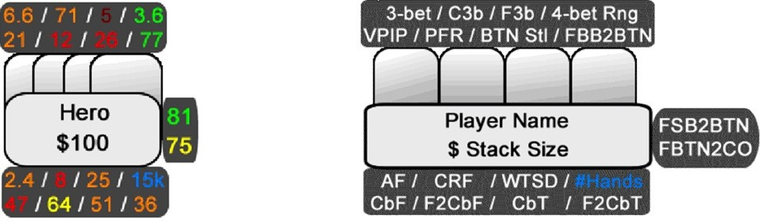
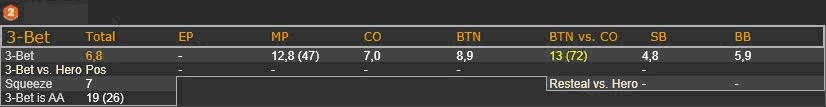
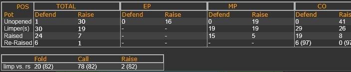
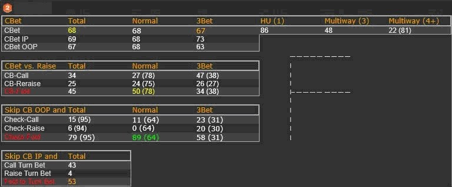
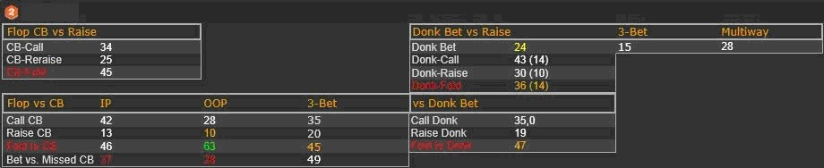

# 第二十四天 - HUD 和弹出窗口的进一步应用

你可能已经猜到了，统计数据在 PLO 游戏中非常重要。因此，你应该努力成为一名善于利用统计数据的玩家。今天，我将向你介绍 HUD 和弹出窗口统计数据的高级用法。

## 介绍

如果你知道如何有效地使用 HUD，它就是一个非常强大的工具。你在创建和应用 HUD 上投入的精力越多，你从中获得的价值就越大（以你的最终收益衡量）。在本节中，我将解释我是如何利用 HUD 和相关的弹出窗口统计数据来提升我的优势的。今天你应该已经拥有了足够的经验，能够正确使用这些统计数据了。你可以随意重建你在屏幕截图中看到的内容，并根据你自己的需求进行调整。

**颜色编码**

你可以在图 21 中看到我的 HUD，我在我的 HUD 中使用了五种不同的颜色（虽然你在这里看不到它们）。这有助于我快速发现对手在翻牌前和翻牌后明显的漏洞，以及这些漏洞的严重程度。

图 21：最终的 HUD（左）及其统计数据描述（右）

我使用的颜色排名如下（相对于平均值 / 良好值）：

- 深红色：非常低
- 红色：低
- 橙色：平均
- 黄色：高
- 绿色：非常高

<aside>

PokerStars 玩家须知：自 2015 年 10 月 1 日起，PokerStars 使用的 HUD 最多只能包含三种不同的颜色。作为调整，我创建了一个修改后的 HUD 版本，其中只有三种不同的统计数据颜色（红色、橙色、绿色）。

</aside>

在这个例子中，当 Hero 面对 BTN 偷盲时，他在 BB 弃牌了 77% 的牌。这个值应该是绿色，绿色表示 GO，当这位玩家坐在 BB 位置时，我们应该从 BTN 位置偷盲几乎所有牌。还要考虑这位玩家的 “Fold SB to Button Steal”（FSB2BTN）值。该值为 81%，也会标记为绿色。如果 SB 玩家持有绿色 “Fold SB to Button Steal”，而 BB 玩家持有绿色 “ Fold BB to BTN Steal”，那么他们就是在恳求你用 BTN 的任意四张牌偷盲。你甚至可以更进一步：当你在 CO 并且是第一个开池玩家时，你还可以考虑 “Fold BTN to CO Steals”（FBTN2CO）值，在本例中为 75%（标记为黄色）。黄色表示你无法用你的 BTN 范围从 CO 偷盲注（如果这个值也是绿色，我会这么做），但你绝对可以扩大你的 BTN 偷盲注范围。在这种情况下，每当这个值标记为黄色时，你还可以查看他的 “3-bet BTN vs. CO ” 数据，这将引导我们看到第一个弹出窗口。当我点击 “3-Bet” 统计数据时，会弹出如图 22 所示的窗口，让我详细了解这位玩家的 3-bet 倾向。

图 22：3-bet 弹出窗口

在这种情况下，这位玩家在 BTN 对抗 CO 的场景会 3-bet 13%。记住，他防守的频率只有 25%，但防守时 3-bet 的频率是 13%。这些信息会引导我制定一个更紧的 CO 针对这位玩家的偷盲范围，并且主要用那些强到足以不利位置跟注 3-bet 的牌来偷盲。在 PLO 中，挤压的牌通常非常强，几乎和 4-bet 范围一样强，这仅仅是因为与 NLHE 相比，在 PLO 中挤压时几乎没有弃牌权益。然而，也有一些玩家像图 22 中那样，7% 的牌会挤压。因此，我们甚至可以用那些对抗那个紧逼范围的牌进行 4-bet，就像我们在第二十天学到的那样。

我设计了另一个重要的弹窗，点击玩家的 VPIP 或 PFR 值时会弹出：

图 23：每个位置弹出的 VPIP/PFR 信息摘录

在这里，我可以看到这位玩家如何应对各种不同的翻牌前情况，例如：未开底池，在他之前有一个或多个溜入者，以及加注和再加注的情况。你可以看到每个位置的详细信息，这有助于确定他几乎在每种情况下的范围。我还在这个弹窗中整合了他溜入后对加注的反应。

当我点击翻牌的 C-Bet 数据时，会出现另一个有用的翻牌后弹窗，如图 24 所示。它可以帮助我判断这位玩家在翻牌前主动方时是否存在任何漏洞。

图 24：我的 CBF 弹窗

同样，在我的设置中，我使用上述颜色编码系统对最重要的统计数据进行了颜色编码。对于这位玩家，当他没有在不利位置 c-bet 时，你会看到一个绿色的过牌 - 弃牌值，而他在不利位置的 c-bet 率为 67%。剥削利用这种玩家很容易。只要在他（作为翻牌前主动方）每次过牌到你时下注，你就能自动获利。

我想向你展示的最后一个弹窗如图 25 所示。点击 “Fold to C-Bet Flop” 统计数据时，它会打开。

图 25：我的 F2CbF 弹窗

当你作为翻牌前主动方并且想要了解这位玩家在面对反主动下注时的行为时，这个弹窗会涵盖所有内容。在本例中，不利位置 “Fold to C-Bet” 值为 63%，会被标记为绿色。因此，当该玩家处于不利位置而您是翻牌前主动方时（例如，当你在 BTN 偷盲，而对手在盲注位置跟注时），你几乎应该始终 c-bet。即使你不 c-bet，也不会面临来自该玩家的太大压力。这是因为他的 “Bet vs. Missed C-Bet” 值显示为红色，因此非常低。

总的来说，我使用了 16 个独立的弹出窗口，可以通过它们查看 HUD 中几乎所有统计数据的详细信息。

## 测验

1. 尝试在你当前的 HUD 中使用颜色编码，以便能够指示对手明显的漏洞。
2. 查看统计数据章节，并写下所有被认为重要的统计数据。
3. 尝试将这些数据纳入最符合他们情况的弹出窗口中。同时，尝试包含翻牌前的位置统计数据以及翻牌后有利位置和不利位置之间的区别。

## 解答

这些练习没有绝对正确或错误的答案。只需找到最适合你的方法即可。创建 HUD 是一个耗时的过程。如果你独立完成，那么你应该循序渐进地创建它。每周甚至每天进行改进是关键。随着时间的推移，你会更好地理解所有统计数据的标准值以及如何正确设置颜色代码。

## 练习

你应该在每次游戏时练习使用 HUD。游戏时，手边准备一张纸或一个空白的记事本，记录如何调整某些颜色值，哪些统计数据适合添加到弹出窗口中，以及哪些根本不会用到。当你发现一些很少使用的统计数据时，它们可能会使你的 HUD 变得杂乱无章。要么丢弃它们，要么加倍努力，如果你觉得它们可能有用的话。

## 总结

- 使用弹出窗口