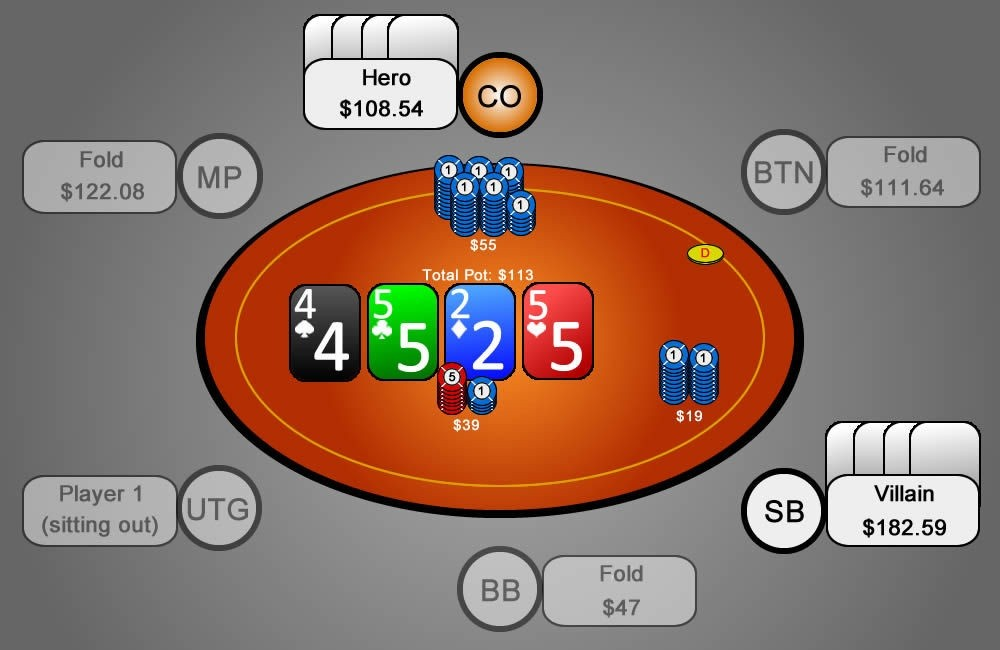

这将是你的期末数学考试！本节旨在测试你对之前课程中已学过的所有数学概念的掌握程度。

## 介绍

我想总结并列出我们已学习过的所有数学概念的清单。如果所有这些概念对你来说都 “轻而易举”（即你已经在课程中成功运用它们），那么你就可以继续进行最后一组练习了。如果不是，请复习你不太熟悉或不熟悉的部分。

**使用补牌估算权益**

我们学习了使用补牌估算权益时需要考虑两种不同的情况：锁定方法和未锁定方法。如果你不完全确定这两种方法是什么，以及在哪种情况下应该使用它们，你应该回到第十三天，再次复习这些方法。

**计算 / 估算底池赔率**

除了底池赔率之外，我们还学习了估算方法（$pot）。这些都是非常重要的概念。如果您对此还不确定或忘记了某些内容，我强烈建议你回去重复学习第六天（底池赔率）和第十九天（$pot）的课程。

**计算 / 估算弃牌权益**

弃牌权益的计算方法基本与计算底池赔率的方法相同。此外，请记住，诈唬 - 加注最常见的弃牌权益百分比是：底池大小，3/4 底池大小，以及 1/2 底池大小。如果你需要重复学习本课程，请返回第二十二天。

**计算 / 估算隐含赔率**

根据我的经验，这是大多数 PLO 玩家最难理解的主题。如果需要，可以再次学习本课程进行复习。如果你觉得有必要，请返回第二十五天。

## 测验

想象一下你参与其中。尝试回答以下问题：

图 26：今天练习的起点

1. Hero 在加注前需要多少权益才能跟注获利？
2. 对手对抗 Hero 的加注后需要多少权益才能跟注获利？
3. 对手需要多少权益才能全下获利（不包括弃牌权益）？
4. 如果对手决定在这里全下，Hero 需要多少权益才能跟注？
5. 如果 Hero 诈唬加注，Hero 加注后需要多少弃牌权益百分比？
6. 如果对手手持 8-7-6-5 对抗葫芦，他需要多少隐含赔率？

计算结果，a) 用数学方法（精确计算），以及 b) 使用你在游戏中也能使用的估算方法计算结果。如果你已经是这方面的专家，那么你可以尝试测量计算结果所需的时间。估算方法的计算时间应该少于 10 秒，这是你的最终目标。

## 解答

图 27：针对此特定场景进行计算

1. **Hero 在加注前需要多少权益才能跟注获利？**
    1. 计算
        1. $19 赢 $39+$19 = 58 / 19 = 3.05 : 1 = 24.7%
        2. 19 / ((19 + 39)+19) = 24.7%
    2. 估算
        1. $pot = $39
        2. $19 赢 $39 ≤ 1/2
        3. ≤ 1/2 ≤ 25%
2. **对手对抗 Hero 的加注后需要多少权益才能跟注获利？**
    1. 计算
        1. $36 赢 $113 = 113 / 36 = 3.1 : 1 = 24%
        2. 36 / (113 + 36) = 24%
    2. 估算
        1. $pot = 38 + 19 + 19 = 76
        2. $36 赢 $76 < 1/2
        3. < 1/2 < 25%
3. **对手需要多少权益才能全下获利（不包括弃牌权益）？**
    1. 计算
        1. $110 赢 $40 + $55 + $95 = 190 / 110 = 1.7 : 1 = 37%
        2. 108.5 / ((19 + 19 + 39.5) + 108.5 + 108.5) = 37%
    2. 估算
        1. $pot = $38 + $19 + $19 = $76
        2. 110 / 76 ~ 1.5
        3. ~ 1.5 ~ 37.5%
4. **如果对手决定在这里全下，Hero 需要多少权益才能跟注？**
    1. 计算
        1. $75 赢 $130 + $40 + $55 = 225 / 75 = 3:1 = 25%
        2. 75 / ((39 + 130 + 55) + 75) = 25%
    2. 估算
        1. $pot = $40 + $55 + $55 = 150
        2. 75 / 150 = 1/2
        3. 1 / 2 = 25%
5. **如果 Hero 诈唬加注，Hero 加注后需要多少弃牌权益百分比？**
    1. a) 计算
        1. $55 赢 $39+$19 = 58 / 55 = 1.05 : 1 = 48.6% 弃牌权益
        2. 55 / ((19 + 39) + 55) = 49% 弃牌权益
    2. b) 估算
        1. 加注大约是 1/2 底池大小，≥ ~50% 弃牌权益
6. **如果对手手持 8-7-6-5 对抗葫芦，他需要多少隐含赔率？**
    1. 计算
        1. 8-7-6-5 对抗葫芦 ~ 25% = 3 : 1
        2. 36 × 3 = 108 - 39 - 19 - 55 = $-5
        3. 36 × 2 = 72 - 39 - 19 - 19 = $-5
        
        由于隐含赔率是负数，这意味着我们已经得到了直接正确的赔率，因此我们不需要任何隐含赔率。
        
    2. 估算
    他大约有 9 张补牌。9 × 2.5 = 25% = 3 : 1。所以他需要 3 : 1 的赔率。
    他得到的是 36 : 114 = 3 : 1，所以他不需要隐含赔率。

## 练习

如果你完成了这最后一节数学课，你应该能够找出自己在这个方面最大的弱点。通过复习和练习，至少每周进行一次。通过学习和游戏内应用，这些方法很快就会成为你的第二天性。试着在每次游戏中运用它们。通过这样做，你的计算会变得更快、更准确。更快地计算你的权益，比如说，在听牌的情况下，这一点非常重要。线上扑克中最明显的迹象之一是，当有人为了防止听牌而持续下注时，你会看到时间在流逝，因为听牌的玩家显然在纠结是否跟注。重复是运用这些方法做出即时决策的关键。

## 总结

- 巩固你的数学知识