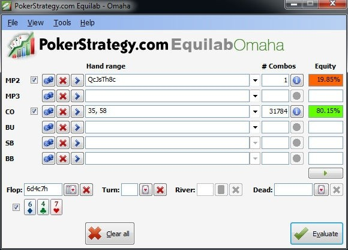

我们已经完成了 PLO 理论的学习。现在是时候将所有内容整合起来，提升我们的读牌能力了。提升思维能力最简单的方法是查看具体的牌例，找出最佳玩法并进行论证。

## 介绍

读牌是扑克中最伟大的艺术之一。一开始，你可能会认为，除非你姓诺查丹玛斯，否则几乎不可能在 PLO 中进行读牌。毕竟，PLO 的底牌数量是德州扑克的两倍，牌型组合也更多。尽管如此，根据对手试图向你灌输的故事，你仍然可以在一手牌过程中分解出可能出现的牌型范围。我会在简介中举一个例子，然后在练习中再举几个例子，方便你练习。

**Preflop：**（$1.50）

对手（BTN）：??? $108.70
Hero（BB）：K♠️-Q♠️-J♣️-9♥️ $127.30

UTG 弃牌，MP 弃牌，CO 弃牌，BTN 加注到 $2.50，SB 弃牌，Hero 加注到 $8，BTN 跟注 $5.50

我们坐在 BB 位置，面对 BTN 的加注。这是偷盲，因此即使在 BB ，我们也应该 3-bet 以争取价值。我们 3-bet，BTN 跟注。注意，所有示例中，抽水已从底池中扣除。

**Flop：**（$16.50）8♠️-3♣️-6♦️（2 人）
Hero 下注 $10.50，BTN 跟注

我们首先应该分析一下公共牌结构。这是一个相对干燥的公共牌，因此 c-bet 大约 2/3 底池的金额就足够了。这个下注，我们立即获得了弃牌权益，因为在这个公共牌面击中对手的牌并不多。常见的可能跟注翻牌的牌是带卡顺的对子或超对。面对这些牌，我们在转牌 c-bet 时拥有很高的弃牌权益。因此，我们必须考虑是否有足够多的转牌来改善我们的牌型。实际上，转牌有足够的牌（任何黑桃、9、10、J、Q、K）让我们可以进行第二次开枪。因此，我们决定在翻牌 c-bet $10.50，BTN 跟注。

**Turn：**（$37.50）8♠️-3♣️-6♦️-J♦️（2人）
Hero：？（有效筹码 $90.20）

转牌来了一张 J♦️。由于这张牌将我们提升到顶对，并且还有另外 3 张底牌可以在河牌击中最佳两对（以及卡顺），我们绝对应该进行第二次下注。底池为 $37.50，剩余 $90.20。J 其实算不上什么惊悚牌，因为它没有组成任何顺子，但确实能带来一些额外的听牌（9-10 顺子听牌和方块同花听牌）。在对手跟注翻牌后，我们已经说过，我们判断他的牌是卡顺或超对。他也有可能在转牌拿到了同花听牌。像暗三和两对这样的强牌很可能会翻牌加注，因为这些牌型也有一些惊悚牌（事实上，除了 8 或 6 之外，每张转牌都会降低它们的牌力）。即使他拿到 8-6-x-x 这样的牌，或者用 J♦️ 组成两对（这种情况不太可能发生，因为我们自己也拿着 J），我们仍然有 K、Q 和 9 的补牌。即使对手是慢打暗三，10 也是顺子补牌。现在我们必须确定我们的下注大小。

时刻扪心自问，如何才能迫使对手犯下最大的错误。在本例中，对手有很多听牌，这让他在转牌跟注一个较小的下注只是一个小错误（而对于我们特定的牌来说，这根本不算什么错误）。当我们小额下注并被加注时，我们仍然无法确定我们是否弃牌。然而，如果我们下注一个底池，对手用听牌跟注或用一对加弱听牌弃牌所犯的错误就会被放大。所以，在这种情况下，我们不必担心过度展现自己的牌力，因为所有跟注翻牌并弃牌的对手现在都拥有很大的权益来对抗我们的牌。我之所以更喜欢在这里下大注而不是小注，最后一个原因是河牌的 SPR。如果我们在转牌下注小，我们会看到河牌的 SPR 为 1，而我们再次处于不利位置时，通常会犯比对手更大的错误。这就是为什么我建议在这种情况下转牌下注，如果被加注则全下。

**Turn：**（$37.50）8♠️-3♣️-6♦️-J♦️（2 人）
Hero 下注 $37.50，BTN 跟注 $37.50

BTN 跟注。这基本上表明他在这里牌力不强，要么是一手弱成手牌，要么是一手听牌。

**River：**（$112.50）8♠️-3♣️-6♦️-J♦️-2♥️（2 人）
Hero：？（有效筹码 $52.70）

河牌是 2♥️，这基本上是一张空白牌，这意味着它无法完成任何听牌，也不太可能形成两对。因此，我们认为这张河牌不应该对他（我们认为的）弱牌有帮助。当我们现在在河牌下注时，我们可以预期对手会弃掉他的破产听牌，或者跟注他的两对（在这种情况下，我们输了）。另一方面，如果我们决定过牌，我认为他不会为了价值而强行下注 8-6 或 K-K 之类的牌，而只会过牌。然而，通过过牌，我们看起来更像是自己放弃了破产的听牌，并给了对手用这些破产听牌和无法在摊牌时获胜的弱牌诈唬的机会。在这种情况下，我们又必须思考如何让对手犯下最大的错误。归根结底，我们有一个游戏计划：如果我们下注，他会弃掉那些赢不了的牌，而用能打败我们的牌跟注。所以，我们最好过牌，诱使对手诈唬，而我们在这种情况下肯定会跟注。

**River：**（$112.50）8♠️-3♣️-6♦️-J♦️-2♥️（2 人）
Hero 过牌，BTN 下注 $52.70 并全下，Hero 跟注 $52.70

我们决定过牌。对手全下。此时，重要的是看我们的相对牌力，而不是绝对牌力。我们的绝对牌力不过是一对 J，在 150bb 的底池里，我们被迫着在河牌再跟注 50bb。但由于我们着眼于整手牌以及牌局的走势，我们认为我们的牌力足够强，可以跟注，因为这比他所有不是价值下注的牌都强。让我们来看看结果：

结果：（$217.90）
BTN 摊牌 A♦️-10♦️-9♠️-4♥️
Hero 摊牌 K♠️-Q♠️-J♣️-9♥️
Hero 凭借一对 J 赢得 $217.90

对手亮出的牌是一个很好的例子，玩家应该很容易弃牌，但因为没有其他办法赢得底池，所以选择了诈唬。此外，在转牌迫使对手跟注了我们底池大小的下注，他犯下了最大的错误。一般来说，你不应该太害怕 PLO 中的慢玩，因为有很多令人恐惧的牌和 “行动冻结” 牌，它们往往会惩罚慢玩。即使在像这样的干燥翻牌，每一张 2、4、5、7、9 和 10 都会在转牌组成顺子，这通常会阻止你用暗三条可能获得的行动，或者开启你不想面对的行动（来自顺子）。

通过研究这手牌的例子，我希望你已经了解了 PLO 中的读牌是如何运作的。现在，我希望你尝试描述你自己的思维过程，并思考以下练习中的牌。慢慢来，认真评估每种玩法的优点。为了评估你的思维过程，并判断你是否已经是一位非常扎实的玩家，我添加了一个新技巧。在解答中，你将根据所选打法的相对正确性获得积分奖励。

## 测验

评估 Hero 从翻牌、转牌到河牌的后续牌局。对于每一轮下注，建议 Hero 应该采取什么行动（例如，持续下注 / 主动下注、过牌 - 跟注、过牌 - 加注 或 过牌 - 弃牌），并给出你的理由。

1. **Preflop：**（$1.50）
    
    对手（CO）：??? $127.40
    
    Hero（UTG）：Q♣️-J♠️-10♥️8♣️ $248
    
    Hero 加注到 $3.50，MP 弃牌，CO 加注到 $12，BTN 弃牌，SB 弃牌，BB 弃牌，Hero 跟注 $8.50
    
    **Flop：**（$25.50 | 有效筹码 $115.40）6♦️-4♣️-7♥️（2 人）
    
    Hero 过牌，CO 下注 $18，Hero 弃牌
    
2. **Preflop：**（$1.50）
    
    对手（CO）： ??? $141.80
    
    Hero（SB）：J♣️-J♦️-9♦️-8♣️ $918.50
    
    UTG 弃牌，MP 弃牌，CO 加注至 $3.50，BTN 弃牌，Hero 加注至 $11.50，BB 弃牌，CO 跟注 $8
    
    **Flop：**（$24 | 有效筹码 $130.30）K♥️5♣️-Q♦️（2 人）
    
    Hero 下注 $15.30，BTN 跟注 $15.30
    
    **Turn：**（$54.60 | 有效筹码 $115）K♥️5♣️-Q♦️-9♥️（2 人）
    
    Hero 下注 $39.50，BTN 弃牌
    
3. **Preflop：**（$1.50）
    
    对手（BTN）：??? $191
    
    Hero（BB）：A♥️J♠️-10♥️8♣️ $101.50
    
    UTG 弃牌，MP 弃牌，CO 弃牌，BTN 加注到 $2，SB 弃牌，Hero 加注到 $6.50，BTN 跟注 $4.50
    
    **Flop：**（$13.50）J♠️-4♠️-Q♥️（2 人）
    
    Hero 下注 $8.50，BTN 跟注 $8.50
    
    **Turn：**（$30.50）J♠️-4♠️-Q♥️9♦️（2 人）
    
    Hero 下注 $20.40，BTN 跟注 $20.40
    
    **River：**（$71.30）J♠️-4♠️-Q♥️9♦️-8♠️（2 人）
    
    Hero 过牌，BTN 过牌
    
    结果：（$71.30）
    
    BTN 摊牌 Q♦️-J♦️-10♠️-6♦️
    Hero 摊牌 A♥️J♠️-10♥️8♣️
    
    Hero 凭借顺子 8 到 Q 赢得 $35.65
    
    BTN 凭借顺子 8 到 Q 赢得 $35.65
    

## 解答

对于每一轮下注，建议 Hero 应该采取什么行动（例如，持续下注 / 主动下注、过牌 - 跟注、过牌 - 加注 或 过牌 - 弃牌），并给出你的理由。

1. **Preflop：**（$1.50）
    
    对手 (CO)：??? $127.40
    
    Hero (UTG): Q♣️-J♠️-10♥️8♣️ $248
    
    Hero 加注到 $3.50，MP 弃牌，CO 加注到 $12，BTN 弃牌，SB 弃牌，BB 弃牌，Hero 跟注 $8.50
    
    **Flop：**（$25.50 | 有效筹码 $115.40）6♦️-4♣️-7♥️（2 人）
    
    Hero 过牌，CO 下注 $18，Hero 弃牌
    
    在评价 Hero 的玩法之前，让我们先来看看我们在这个位置可能的选择：
    
    - Hero 反主动下注（20P）：通过反主动下注，我们已经展现了一些实力，并且保持了较高的 SPR。注意，我们的主要目的不是翻牌的弃牌权益，即使我们对抗像 A-K-10-9ds 这样的大连牌时有弃牌权益。反主动下注的目标是将对抗超对的弃牌权益拖延到转牌圈。如果我们提前考虑转牌圈，我们就可以有效地进行第二次开枪：2、3、5、8、9、10、J 或 Q。即使是 7 或 6 这样的牌也可能对我们有利，因为对手可能会认为我们反主动下注要么是两对，要么是顺子。转牌唯一对我们不利的牌是 K 和 A，我们必须用它们进行过牌 - 弃牌（尽管我们可以考虑用 K♣️ 和 A♣️ 进行开枪）。
    - Hero 过牌 - 弃牌（15P）：Hero 持有卡顺听牌和后门同花听牌，因此决定过牌。对手下注 $18，在 Hero 弃牌后拿下底池。这看起来是 Hero 非常标准但缺乏想象力的打法。
    - Hero 过牌 - 跟注（5P）：过牌- 跟注在这里看起来不是一个有效的选择，因为在不掌握主动权的情况下，我们可以继续玩的转牌太少，而且我们目前的牌也没有任何摊牌价值。
    - Hero 过牌 - 加注（10P）：通过过牌，我们让对手有机会 c-bet，然后通过加注拿下我们的弃牌权益。然而，在这个特定的公共牌面上，在 3-bet 底池中，过牌 - 加注对对手来说并不那么可怕（假设他拿着 A-A-x-x 或 K-K-x-x 以及后门听牌）。想想我们会如何游戏 9-8-7-x 这样的牌。尽管我们的过牌 - 加注对抗超对的弃牌权益并不是那么好，但我仍然绝对会推荐用这些牌在这里使用过牌 - 加注。然而，在实际的例子中，我不喜欢很少弃牌权益的过牌 - 加注，不用我说，我们用过牌- 加注就把承诺全下底池了。
    
    Hero 决定过牌，CO 下注 $18，Hero 加注到 $62，CO 加注到 $115.40 并全下，Hero（还剩 $53.40）：???
    
    1. 底池金额 = 26 + 124 = $150
    2. 53/150 > 1/3
    3. 1/3 > 20%
    - Hero 弃牌：我们需要略高于 20% 的全下才能证明跟注的合理性。我们可以使用 Equilab 来检查我们面对两个顺子时的权益。图 28 的结果显示，我们只面对顺子时才有很小劣势。
    - Hero 跟注：考虑到你对这位玩家的牌型解读，你可能会发现他还会用其他牌型加注，比如 7-8-9-x，或者只是 A-A-x-x，甚至可能还没有拿到顺子。有时候，我们只能咬紧牙关跟注。

        
    
    图 28：我们过牌 - 加注后几乎有正确的赔率跟注全下。
    
    总结：对于这个翻牌，我推荐反主动下注，而不是其他选择过牌 - 弃牌和过牌 - 加注。过牌 - 跟注是四种选择中最低效的一种。
    
2. **Preflop：**（$1.50） 
    
    对手（CO）：??? $141.80
    
    Hero（SB）：J♣️-J♦️-9♦️-8♣️ $918.50
    
    UTG 弃牌，MP 弃牌，CO 加注至 $3.50，BTN 弃牌，Hero 加注至 $11.50，BB 弃牌，CO 跟注 $8
    
    3-bet 的策略很大程度上取决于 CO 的开池加注范围，尤其是 BB 的松的程度。如果没有这些信息，跟注或 3-bet 都是可以接受的玩法。
    
    **Flop：**（$24 | 有效筹码 $130.30）K♥️5♣️-Q♦️（ 2 人）
    
    Hero 下注 $15.30，BTN 跟注 $15.30
    
    翻牌我们有一副弱对子、一副卡顺听牌和两张后门同花听牌。
    
    - Hero 下注（20P）：我们决定下注约 2/3 个底池。如果对手跟注，那么我们转牌的 SPR 大约为  2。我们阻挡了唯一真正的听牌（J-10），因此，他的跟注范围很可能是一对。如果他持有中等牌，他很可能会对持续下注弃牌，这对我们的牌来说是一个不错的结果。由于有两个后门同花听牌和一个卡顺听牌，转牌有各种各样的牌，这些牌应该足以：
        1. 迫使他弃掉一对 K 或 Q；
        2. 如果我们转牌被迫全下，也有足够的全下。基于所有这些考虑，持续下注是一个不错的选择。
    - Hero 过牌 - 跟注（10P）：另一个选择是翻牌过牌 - 跟注。如果我们这样做，我们可能会诱使他用中等牌进行诈唬下注。如果我们按照这个解读，对手转牌最好的改进牌很可能是中等同花听牌。我们转牌 SPR 仍然是 2，但这次没有主动权。如果我们再次过牌，他很可能会下注，我们真的不知道该怎么办了。这是因为，如果没有掌握主动权，他甚至可以用中等牌型半诈唬我们，这些牌型在转牌时拿到了听牌，但如果我们翻牌 c-bet，他就会弃牌。
    - Hero 过牌 - 弃牌（10P）：过牌 - 弃牌是最后一种选择。当我们面对一个被动的玩家，我们知道他只有在拿到 K 或 Q 时才会在翻牌（在我们过牌之后）下注时，我会推荐这种打法（虽然我们这里没有这方面的信息）。
    
    所以我的排名是，面对被动玩家时，过牌 - 弃牌 > 下注 - 弃牌 > 过牌 - 跟注，面对其他玩家时，下注 - 弃牌 > 过牌 - 跟注 > 过牌 - 弃牌。
    
    **Turn：**（$54.60 | 有效筹码 $115）K♥️5♣️-Q♦️-9♥️（2 人）
    
    Hero 下注 $39.50，BTN 弃牌
    
    转牌圈来了一张 9♥️，Hero 决定再次下注。我不同意下注这张牌。即使我们阻挡了顺子，SPR 是 2，也不会有太多牌在这里弃牌。这是因为这张牌实际上根据对手的翻牌跟注范围大幅改善了他的牌力。同时，它削弱了我们的范围，因为它既不是一张空白牌，也不是一张能让我们获得同花听牌之类的牌。我只会在那些对我们的范围没有帮助的牌（比如 2♠️）或只能改善我们范围的牌（比如同花听牌）下注。唯一一张跟注翻牌现在可能弃牌的牌是 A-K-P-P 之类的。在这个特定的转牌，我更喜欢过牌 - 弃牌（20P）而不是 下注 - 弃牌（10P）。BTN 弃牌，所以这次 Hero 是对的（但这并不意味着 Hero 的玩法是正确的！）。
    
3. **Preflop：**（$1.50）
    
    对手（BTN）：??? $191
    
    Hero（BB）：A♥️J♠️-10♥️8♣️ $101.50
    
    UTG 弃牌，MP 弃牌，CO 弃牌，BTN 加注到 $2，SB 弃牌，Hero 加注到 $6.50，BTN 跟注 $4.50
    
    BTN 最小加注，我们决定在 BB 进行 3-bet 以争取价值。这应该是最好的玩法，跟注只适用于非常紧的范围。
    
    **Flop：**（$13.50）J♠️-4♠️-Q♥️（2 人）
    
    Hero 下注 $8.50，BTN 跟注 $8.50
    
    这是这手牌中第一个有趣的位置。Hero 有一对，一个双卡顺听牌和一个后门同花听牌。
    
    - Hero 下注（10P）：Hero 决定下注较小，然后 BTN 跟注。我认为这个下注尺度太小了。如果 Hero 想下注，他应该下注更大，因为这个尺寸听牌每次都会跟注。因此，我们很难判断哪些转牌对我们有利，哪些能提升对手的权益。如果对手全下，我们就不得不弃牌，同时损失大量权益。
    - Hero 过牌 - 跟注（20P）：即使我们拿着 A-A，也应该过牌（之后三种选择都可行）。在这种情况下，拥有一个过牌 - 跟注范围可以很好地平衡我们的过牌 - 弃牌。另一个好处是，我们不介意对手随后过牌并拿到一张免费牌，因为我们不会错过太多价值，而且我们有足够的转牌来提升我们的牌力。通常情况下，我们会避免过牌 - 跟注，因为这通常会让我们的牌很明显（我们处于听牌状态）。但在这种情况下，这些信息对对手没有太大帮助。现在他该怎么应对转牌的黑桃？所以，他很难决定哪些牌可以在转牌继续下注或诈唬。如果他拿着 Q，而转牌带来了同花，他很可能会过牌。如果我们认为自己没有足够的摊牌价值，甚至可以在河牌诈唬。
    
    所以我认为过牌 - 跟注是最佳选择，下注是次佳选择。但是，如果你想在这里下注，你绝对应该比 Hero 下注更大。
    
    **Turn：**（$30.50）J♠️-4♠️-Q♥️9♦️（2 人）
    
    Hero 下注 $20.40，BTN 跟注 $20.40
    
    转牌我们击中低顺子。
    
    - Hero 下注（10P）：我们决定再次下注。然而，和翻牌一样，Hero 下注的金额相当小。这样做的问题是，如果我们被加注，我们很可能不得不弃牌，尽管我们真的不想用这么强的牌弃牌。他还有很多听牌可以用来加注。然而，我们不知道他是否会玩得这么激进，因为他加注可能只是因为他有更好的顺子。
    - Hero 英雄过牌 - 跟注（15P）：另一种玩法是在转牌过牌 - 跟注。这让对手可以半诈唬他的听牌。问题是，他会在河牌用任何破产的听牌过牌，而我们无法从中获得更多价值。
    - Hero 过牌 - 加注（20P）：过牌时更好的玩法是过牌 - 加注。通过过牌 - 加注，我们迫使对手付出高昂代价才能看到河牌，而当他在河牌没能击中听牌时，他也无法节省资金。同时，我们也从他的听牌中获得了更多价值。你可能会说，面对 K-10（我们仍然有 K 作为补牌），我们会输掉全部筹码。实际上，即使我们过牌 - 跟注，我们也会输掉这笔钱，因为如果河牌是空气牌，我们就无法弃掉顺子。如果对手随后过牌，我们仍然有机会在河牌价值下注，因为他在翻牌跟注时肯定击中了某些牌。
    
    因为我们无法真正判断下注 - 弃牌还是下注并全下是更好的玩法，而且当他跟注时，我们在河牌的 SPR 会很差，所以我对转牌的建议是过牌 - 加注 > 过牌 - 跟注 > 下注。
    
    **River：**（$71.30）J♠️-4♠️-Q♥️9♦️-8♠️（2 人）
    
    Hero 过牌，BTN 过牌
    
    就目前的情况来看，我认为除了在这张河牌上过牌之外，没有其他选择。让我们分析一下结果：
    
    结果：（$71.30）
    
    BTN 摊牌 Q♦️-J♦️-10♠️-6♦️
    Hero 摊牌 A♥️J♠️-10♥️8♣️
    
    Hero 凭借顺子 8 到 Q 赢得 $35.65
    
    BTN 凭借顺子 8 到 Q 赢得 $35.65
    
    哎哟！我们平分底池，转牌的权益是 89%。大多数情况下，如果我们过牌 - 加注，他本来就应该下注并全下。另外，考虑到如果他决定全下，我们可能在转牌下注 - 弃牌。
    
    现在是时候总结一下你的观点了。如果你的得分超过 75 分（满分 100 分），那么你已经具备了良好的读牌能力，并且已经对游戏有了很好的理解。
    

## 练习

我希望你能够通过整合所有关于 PLO 的知识，对读牌有所了解。即使不考虑数据或笔记这些强大的工具，你也能发现我们仍然可以很好地分析牌局范围，从而确定最佳玩法。我强烈建议你尽可能多地进行牌局分析。和朋友们聚在一起，讨论你不确定的牌局，并听取他们的意见。这是提升你对游戏知识的最佳方法之一（除了你在本书中学到的知识！）。在玩牌时，评估每一手牌，并尝试找到 “成功的关键”，无论是以技术上合理的方式打牌，还是利用玩家类型、他们的数据、他们的范围、他们的漏洞（根据你的笔记），或者理解他们试图告诉你的故事。

## 总结

- 读牌方法