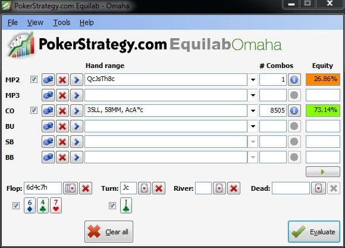

# 第二十八天 - 适应：深筹码、赌场和锦标赛 PLO

在最后一节中，我将介绍一些主题，帮助你适应线上 6 人桌 PLO 以外的游戏。这只是一个概述，更多详细信息可以在其他书籍和在线资源中找到。本节旨在让你已经扎实的 PLO 游戏，并让你大致了解如何适应这些不同的环境。

## 介绍

以下三种变体之间的两个主要区别是 SPR 和玩家类型。我将通过比较我们目前所学的内容来介绍每种变体。

**深筹码**

玩急速弃牌游戏时，你会很快成为深筹码（因为你会在一张桌子上玩很多手牌）。玩深筹码时，每个错误的决定都会让你损失更多资金。另一方面，你会从对手的错误中获利，获利幅度相同。玩深筹码时唯一改变的是 SPR。你与对手的筹码越深，位置就越重要。不利位置尝试收紧范围，甚至比现在更加严格。但是，你可以进一步扩大你的轻度 3-bet 范围和有利位置偷盲范围，并降低你的对 3-bet 弃牌范围。在翻牌后玩深筹码时，你有更大的回旋余地来迫使对手放弃他的牌，而不必被迫弃牌。正如你所知，位置对于在摊牌前拿下底池至关重要。

**赌场 PLO**

如果你经常在赌场玩，那么你可能已经注意到牌桌上坐满了深筹码的玩家。这是因为牌桌上的玩家更多（9-10 人，而不是 6 人），而且现场玩家会用很多弱牌 “哭着跟注”。这导致底池的建立速度比线上 PLO 快得多。另一个需要考虑的因素是，你没有在线工具，因此计算资金会更加困难 - 无论是计算底池大小还是有效筹码量。当然，如果你想快速分析一下权益，可以随时请荷官帮你清点底池（询问玩家在一手牌中还剩多少筹码比较棘手）。无论如何，在牌局结束后，一定要花时间清点并记住哪些玩家筹码短或筹码深。在牌局进行到一半时再这么做就太晚了。

赌场 PLO 与线上相比，一个更大的区别在于，人们玩得更松、更被动。当与其他 9 人一起玩时，每个底池通常都是 5 人参与的，甚至 9 人的 “家庭底池” 也并非闻所未闻。现在，你应该已经了解了应对巨额多人底池的正确策略。因此，务必始终选择有统治潜力的牌，并在没有拿到坚果牌时避免投入过多资金。不要太在意平衡。相反，当你拥有冷热胜率时，用你的大牌下大注和加注，以阻止多人底池的出现。

最后，你不在线上，可以看到每个人的 “扑克脸”。所以，留意肢体语言，也就是人们在特定情况下表现出来（但自己没有意识到）的行为。典型的肢体语言包括某人的手开始颤抖（表明他们手气不错），或者他们开始对你说垃圾话（当他们诈唬时）。但要小心：有时，这些肢体语言也可能导致错误的假设。例如，某人无法控制地颤抖可能意味着他实力雄厚，但也可能意味着他为了诈唬而赌上所有资金后陷入了极度恐惧之中。只有当你多次观察到这种行为时，或者这是你最终（即决胜局）的考虑因素，决定了你最终的行动时，才应该使用肢体语言。

**锦标赛 PLO**

锦标赛 PLO（包括现场和线上）是深筹码玩法和赌场 PLO 的混合体。随着盲注以固定的时间间隔增加，SPR 一开始会非常深，但最终会在后期降至 10bb。玩家池通常与赌场游戏的玩家规模相当。其中一个原因是，大鱼们更喜欢锦标赛而不是现金游戏，因为在给定的时间内，参加一场锦标赛比在现金游戏中多次买入并不断输掉筹码的成本更低。灵活性以及适应牌桌的动态和筹码量非常重要。与急速弃牌扑克一样，深入了解对手通常很困难，因为他们会定期被其他玩家替换。不仅牌桌上的玩家会被轮换，而且随着更多玩家被淘汰、牌桌关闭，而其他玩家被合并，你也会从一张牌桌转移到另一张牌桌。你应该根据牌桌的松度来制定策略，从调整你的开池加注尺寸到调整你的手牌范围。你还应该在牌局的每个阶段密切关注 SPR。最后，最重要的区别是，当你输掉筹码时，你就出局了（假设你不是在锦标赛的补买阶段）。

要想在锦标赛中赚钱，你通常必须进入前 10%。在锦标赛的 “泡沫” 阶段，只需要再有一名玩家输掉筹码，其他所有人就能获得奖金，此时牌桌的动态会发生巨大变化。优秀的锦标赛玩家会大胆地从几乎任何位置偷盲，拿走巨额盲注和前注，而许多玩家则会僵住，直到泡沫破裂（因为他们害怕自己成为 “泡沫男孩”）。你甚至会看到其他玩家组队，用弱牌跟注，只是为了击溃全押的短筹码，从而打破泡沫。这与独立筹码模型（ICM）的概念相关，ICM 纯粹是针对锦标赛（或 Sit-and-Go）的考量，不适用于现金游戏。

现在深呼吸，慢慢做最后的练习。

## 测验

我相信你还记得上一个练习中的牌例。现在我想让你思考一下，如果这些牌是深筹码、在赌场玩，或者在锦标赛决赛桌玩，最佳打法会有什么变化。我已经用上一个练习中建议的打法替换了 Hero 的打法。再次，请解释一下，在新的环境下，我们的最佳打法会有什么变化？

1. **深筹码**
    
    **Preflop：**（$1.50）
    对手（CO）：??? $127.40 → $248
    Hero（UTG）：Q♣-J♠-10♥-8♣ $248
    
    Hero 加注到 $3.50，MP 弃牌，CO 加注到 $12，BTN 弃牌，SB 弃牌，BB 弃牌，Hero 跟注 $8.50
    
    **Flop：**（$25.50 | 有效筹码 $236）6♦-4♣-7♥（2人）
    Hero 下注 $18，CO 跟注 $18
    
    **Turn：**（$61.50 | 有效筹码 $200）6♦-4♣-7♥-J♣（2人）
    Hero 下注 $48，CO 加注到 $202 并全押，Hero？（有效筹码 $152）
    
2. **赌场玩法**
    
    **Preflop：**（$15）（10 人）
    对手（CO）：??? $1,418
    Hero（SB）：J♣-J♦-9♦-8♣ $9,185
    
    6 人弃牌，CO 加注到 $35，BTN 弃牌，Hero 加注到 $115，BB 弃牌，CO 跟注 $80
    
    **Flop：**（$240 | 有效筹码 $1,303）K♥-5♣-Q♦（2人）
    Hero 下注 $153，BTN 跟注 $153
    
    **Turn：**（$546 | 有效筹码 $1,150）K♥-5♣-Q♦-9♥（2人）
    Hero 过牌，BTN 下注 $150，Hero？（有效筹码 $850）
    
3. **锦标赛中，再爆掉一名玩家即可进入钱圈。平均筹码量为 60,000，最短筹码量为 5,000。**
    
    **Preflop：**（1,500）（6人）
    对手（BTN）：??? 191,000
    Hero（BB）：A♥-J♠-10♥-8♣ 101,500
    
    3 人弃牌，BTN 玩家加注到 2,000，SB 弃牌，Hero 加注到 $6,500，BTN 跟注 4,500
    
    **Flop：**（13,500）J♠-4♠-Q♥（2人）
    Hero 过牌，BTN 玩家下注 8,500，Hero 跟注 8,500
    
    **Turn：**（30,500）J♠-4♠-Q♥-9♦（2人）
    Hero 过牌，BTN 下注 20,400，Hero 加注到 86,500 并全押，BTN 跟注 66,100
    
    **River：**（203,500）J♠-4♠-Q♥-9♦-8♠（2人）
    
    **比赛结果：**（203,500）
    BTN 摊牌 Q♦-J♦-10♠-6♦
    Hero 摊牌 A♥-J♠-10♥-8♣
    
    Hero 以顺子 8 到 Q 赢得 101,750
    BTN 以顺子 8 到 Q 赢得 101,750
    

## 解答

1. **深筹码**
    
    **Preflop：**（$1.50）
    对手（CO）：??? $127.40 → $248
    Hero（UTG）：Q♣-J♠-10♥-8♣ $248
    
    Hero 加注到 $3.50，MP 弃牌，CO 加注到 $12，BTN 弃牌，SB 弃牌，BB 弃牌，Hero 跟注 $8.50
    
    与昨天的牌局相比，唯一变化的是对手的筹码量。我在简介中建议你在深筹码时，在不利位置要更紧一些。不过，这手牌太强了，不可能对 3-bet 弃牌，因此，开池加注和跟注都可以。
    
    **Flop：**（$25.50 | 有效筹码 $236）6♦-4♣-7♥（2人）
    Hero 下注 $18，CO 跟注 $18
    
    正如你所见，我已经根据昨天讨论的最佳打法调整了行动。所以我们没有选择过牌 - 弃牌，而是选择反主动下注，CO 决定跟注。现在我们的筹码更深了，我甚至会考虑过牌 - 加注而不是反主动下注，因为即使对手拿着 A-A，不像 SPR 更低时那样愿意全押。此外，如果他全押，我们仍然有弃牌的空间。当我们的筹码更深时，反主动下注的价值也会降低，因为他有更多空间在翻牌慢打，在转牌加注。
    
    **Turn：**（$61.50 | 有效筹码 $200）6♦-4♣-7♥-J♣（2人）
    Hero 下注 $48，CO 加注到 $202 并全押，Hero？（有效筹码 $152）
    
    转牌来了一张 J♣，我们击中了顶对、同花听牌和卡顺听牌。按照昨天的建议，我们继续进攻，试图让 A-A-x-x 弃牌。然后，砰！对手猛地加注。我们先来看看在这种情况下，我们需要多少权益才能获得有利可图的全押：
    
    1. 底池金额 = $62 + $100 = $162
    2. 152/162 < 1
    3. < 1 < 33%
    
    这意味着，为了获得有利可图的全押，我们需要略低于 33% 的权益。让我们看看我们面对两种最有可能的牌的权益：慢打顺子和带同花听牌的 A-A-x-x。图 29 展示了结果。注意，我在顺子后面添加了 “LL” 和 “MM”，以便在与 A-A-x-x 等其他牌型混合时获得更真实的组合。
    
    
    
    图 29：使用 EquilabOmaha 进行全押权益分析
    
    如你所见，我们根本没有足够的权益来在这么深的筹码量下在转牌进行全押。因此，当筹码量这么深时，我们不得不弃牌。在这种情况下，翻牌反主动下注似乎不再是一个好的打法。虽然过牌 - 弃牌可能仍然可行，但我想向你展示我在这种筹码深度翻牌最喜欢的打法过牌 - 加注。
    
    **Flop：**（$25.50 | 有效筹码 $236）6♦-4♣-7♥（2 人）
    Hero 过牌，CO 下注 $18，Hero 加注到 $62，CO 跟注 $44
    
    **Turn：**（$149.50 | 有效筹码 $174）6♦-4♣-7♥-J♣（2 人）
    Hero 下注 $149.50，CO 加注到 $174 并全押，Hero？ （有效筹码 $24.50）
    
    我们甚至不用计算就能看出，我们在这里可以毫不费力地跟注。这个打法的另一个巨大优势是，我们在翻牌和转牌都拥有巨大的弃牌权益。由于我们有很多牌可以 c-bet（正如我所说 - 除了 K 和 A 之外的所有牌），这个打法显然是我在这种深筹码情况下最喜欢的。
    
2. **赌场玩法**
    
    **Preflop：**（$15）（10 人）
    对手（CO）：??? $1,418
    Hero（SB）：J♣-J♦-9♦-8♣ $9,185
    
    6 人弃牌，CO 加注到 $35，BTN 弃牌，Hero 加注到 $115，BB 弃牌，CO 跟注 $80
    
    为了让这手牌更有赌场风格，我把赌注加到了 $5/$10。现在桌上还有 9 个人，但这无关紧要，因为前面 6 个人已经弃牌了。在这种情况下，我更喜欢 3-bet，因为 BB 更有可能成为跟注站。因此，通过加注，我们增加了与 CO 单挑的机会。
    
    **Flop：**（$240 | 有效筹码 $1,303）K♥-5♣-Q♦（2人）
    Hero 下注 $153，BTN 跟注 $153
    
    正如上一节所述，我更喜欢在翻牌 c-bet 而不是过牌。你可能还记得我说过，面对被动玩家时，我更喜欢下注 - 弃牌。在赌场玩牌时，我们应该假设，除非有证据证明情况并非如此，否则玩家池会很松且被动。这就是为什么在这种情况下，我更喜欢下注 - 弃牌。当他随后跟注时，我们还有几张不错的转牌可以打。
    
    **Turn：**（$546 | 有效筹码 $1,150）K♥-5♣-Q♦-9♥（2人）
    Hero 过牌，BTN 下注 $150，Hero？（有效筹码 $850）
    
    在翻牌下注后，我们决定现在过牌是转牌最好的打法，因为这张牌相比我们的更容易击中他的范围。在赌场玩的时候，你经常会看到这种尺寸的奇怪下注。现场玩家往往会忘记底池有多少资金，只是随机下注。即使这个下注很小，我们只需要 150/550 > 1/4 > 16.6%，我们仍然不确定哪些河牌对我们有利，因为我们的牌没有干净的补牌。
    
    加注诈唬风险很大。下注小的玩家可能害怕有人拿着坚果牌，但只要他们能想象到任何能让他们转牌赢下底池的牌，他们就不太可能弃牌。这是赌场玩家的另一个特点，尤其是在他们享用免费酒水的时候，他们不知道牌面权益，会在这种关键时刻用最薄弱的听牌跟注。这就是为什么我会避免加注而直接弃牌。
    
3. **锦标赛中，再爆掉一名玩家即可进入钱圈。平均筹码量为 60,000，最短筹码量为 5,000。**
    
    **Preflop：**（1,500）（6人）
    对手（BTN）：??? 191,000
    Hero（BB）：A♥-J♠-10♥-8♣ 101,500
    
    3 人弃牌，BTN 玩家加注到 2,000，SB 弃牌，Hero 加注到 $6,500，BTN 跟注 4,500
    
    我们的筹码量已调整至锦标赛的正常水平。平均筹码量为 60,000，而最短筹码量仅剩 5BB。这意味着我们是锦标赛中筹码量较为健康的玩家之一。我们需要再爆掉一名玩家的筹码才能进入钱圈。盲注是 500/1000，这意味着我们的筹码深度略超过 100BB。BTN 最小加注，我仍然愿意在翻牌前 3-bet 来获得价值。
    
    **Flop：**（13,500）J♠-4♠-Q♥（2人）
    Hero 过牌，BTN 玩家下注 8,500，Hero 跟注 8,500
    
    正如上一节所述，这次我们采用过牌 - 跟注。我仍然更喜欢这种打法，因为它能保持较小的底池。我不想在锦标赛的这个阶段和筹码领先者发生激战，尤其是在我自己筹码量这么大的情况下。
    
    **Turn：**（30,500）J♠-4♠-Q♥-9♦（2人）
    Hero 过牌，BTN 下注 20,400，Hero 加注到 86,500 并全押，BTN 跟注 66,100
    
    最推荐的打法是过牌 - 加注，然后全押对手可能持有的所有听牌。我仍然认为这不算糟糕，但我们必须考虑到，我们面对的是一个相当被动的玩家池，他们更喜欢用听牌过牌，只用非常强的成手牌下注。其次，我们是为了锦标赛的生存而战。如果对手有 K-10，那么我们就会被淘汰出局，一分钱也拿不到。在扑克中，没有什么比打了几个小时的锦标赛却一无所获更糟糕的了！
    
    这就是为什么我在这里更倾向于过牌 - 跟注。通过过牌 - 跟注，我允许自己在河牌，如果他下大注，仍然可以做一个谨慎（且痛苦）的弃牌。但至少我的筹码量还在锦标赛中，66,100 的筹码量仍然高于平均水平。我也不认为那些玩得很被动的玩家会冒着超过一半筹码的风险，用他们破产的听牌来诈唬。
    
    **River：**（203,500）J♠-4♠-Q♥-9♦-8♠（2人）
    
    **比赛结果：**（203,500）
    BTN 摊牌 Q♦-J♦-10♠-6♦
    Hero 摊牌 A♥-J♠-10♥-8♣
    
    Hero 以顺子 8 到 Q 赢得 101,750
    BTN 以顺子 8 到 Q 赢得 101,750
    
    虽然这些结果可能会让你觉得自己是世界上最倒霉的人，但你不应该忘记，如果对手拿着 K-10，这可能是你在锦标赛中的最后一手牌了。
    

## 练习

如果你在阅读并理解本主题后感兴趣，可以尝试不同的 PLO 变体，例如赌场 PLO 或锦标赛 PLO。如果附近没有赌场，只需点击一下鼠标，即可参加各种买入的线上 PLO 锦标赛。凭借本书中学到的概念，我相信你能够快速切换，并找到适合这些变体的正确玩法。你只需思考与典型的 100BB 6 人桌现金游戏相比，哪些变化了，哪些保持不变。在您你未来的练习中，尝试将所有内容整合在一起，并在你认为对某些主题不确定的练习后查阅本书。

## 总结

- 调整你的玩法以适应深筹码 / 赌场 / 锦标赛 PLO