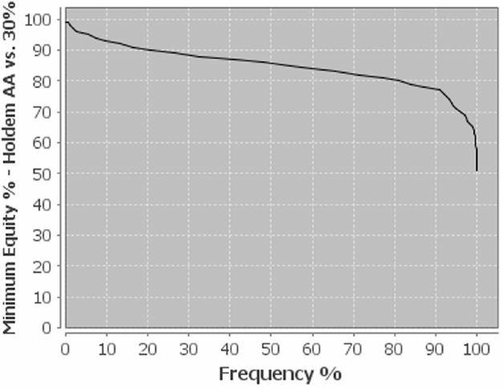
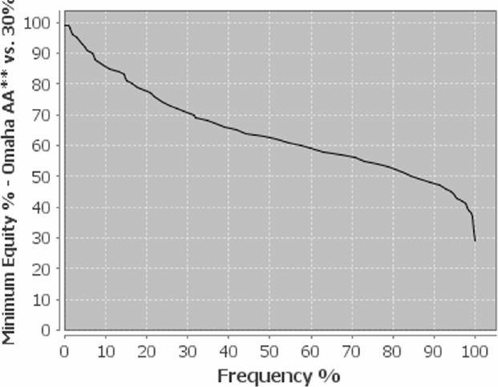
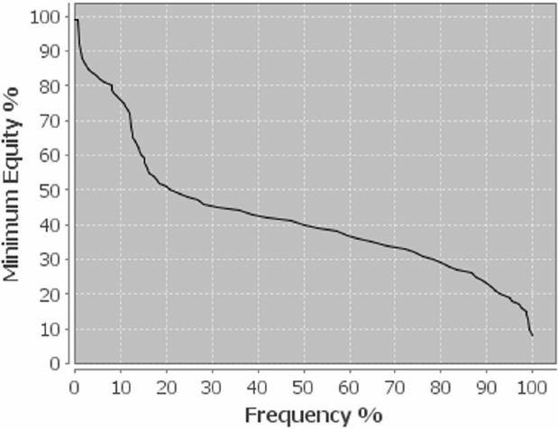
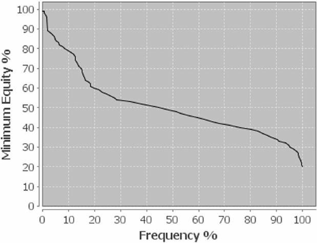
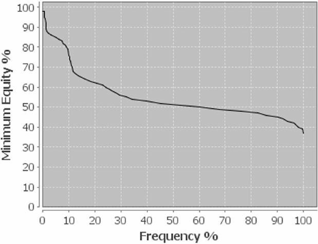
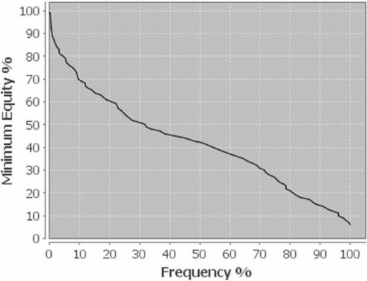
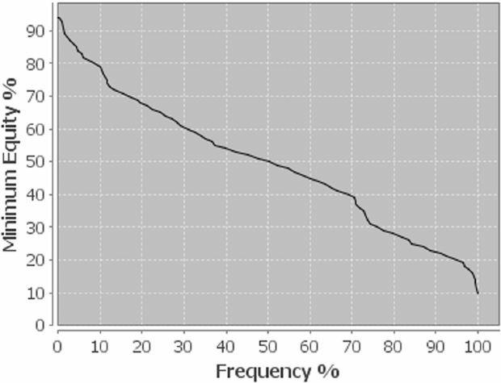
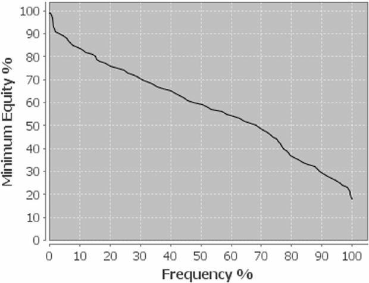

PLO 的翻牌前风格多种多样，而且与德州扑克不同，它似乎有很多可能的盈利风格。如果你具备必要的翻牌后技巧，你可以用非常松散的策略获胜，因为权益非常接近。

那么，为什么要费心做翻牌前决策呢？你为什么要关心牌的选择呢？PLO 绝对是翻牌后游戏，无论你在翻牌前的权益是多少，游戏都会在翻牌后重新开始。为了回答这些问题，让我们先来回顾一下基础知识。最重要的问题是：一个好的翻牌前策略首先能达到什么目的？

你希望你的翻牌前策略能为你的整个范围创造积极的预期。好的起手牌选择可以最大化翻牌后盈利的局面数量，让你能够轻松地实现你的权益，并避免艰难的局面和艰难的决策。

正因为 PLO 是一款翻牌后游戏，所以翻牌前的决策至关重要：你肯定不想在翻牌后陷入无数困难或无利可图的局面。翻牌前牌的选择是你盈利的基础。

你可能会说，好吧，翻牌前你有 40% 的权益，所以你进入翻牌后的情况时，你通常仍然有 40% 的权益，并且会一直打到河牌，但始终落后于对手的范围，这意味着即使你在翻牌后玩得正确，仍然会输钱。这就是为什么你需要了解一些基本概念，帮助你创造有利可图的翻牌后局面。了解哪些因素决定了你起手牌的价值，将有助于你将你的游戏提升到更高的水平。让我们来看看 PLO 中决定牌力的因素。评估翻牌前策略有两个关键。

首先，你必须了解你牌的特点，特别是**权益、可玩性、坚果性和权益分布**。这些是起手牌选择的主要概念，因为它们决定了你起手牌的绝对价值。

其次，你必须了解你即将进入的翻牌后局面，以及你的牌在这种情况下将如何表现。有几个参数会影响你的判断，包括**对手数量、位置、SPR、主动权、对手的倾向以及你的形象**。这些因素决定了你翻牌后手牌的相对质量。在 PLO 中，翻牌前后的手牌表现总是存在差异，因为 PLO 是一种翻牌后游戏，而牌面会极大地影响所有手牌的权益。你也必须考虑这一点。

### 权益

在扑克中，我们所说的牌力通常指的是起手牌的原始权益，即翻牌前不考虑翻牌后冷 / 热牌力的权益。这是一个指标，但并非唯一的决定因素，因为翻牌圈和后续的几条街——尤其是在 PLO 中——可能会极大地改变你的权益，从而改变你赢得底池的几率。尽管如此，权益仍然是牌力中最重要的元素，所有非常好的起手牌在面对非优质起手牌时，显然都具有权益优势。你应该选择那些能让你拥有权益优势的牌，以便在翻牌后创造有利可图的局面。让我们从优质起手牌开始：A-A。

在德州扑克中，A-A 的翻牌前权益在对抗 30% 的范围时高达 85.99%，而且在翻牌圈，这一比例变化不大。你的 A-A 在 80% 的翻牌圈仍然拥有超过 80% 的权益，在 90% 的翻牌圈拥有 77% 的权益。这意味着翻牌圈根本没有改变你的游戏方式，因为你的翻牌前权益通常保持不变，而且你几乎总是拿着最好的牌。

奥马哈的情况则截然不同。权益差距很小，你的 A-A-x-x 在对抗 30% 的范围时只有 65.77% 的优势。此外，这种较小的优势在翻牌圈不像在德州扑克中那样能保持得那么好。正如你在图表中看到的，你的权益只有 40% 的翻牌圈能保持。在一半的翻牌圈，你的权益大约是 63%。

虽然翻牌圈大约有 84% 的概率你会抛硬币，但这不像德州扑克那样有利。翻牌圈往往会极大地改变你的权益。你必须评估你的起手牌，不仅要考虑翻牌前的原始权益，还要考虑其他影响翻牌后可玩性的因素。

虽然对于所有拥有巨大权益优势的超级强牌来说，这一点并不那么重要，但对于所有你仍然想玩的普通牌来说，可玩性至关重要。由于 PLO 是一款翻牌后游戏，你的钱是通过创造有利可图的翻牌后局面来赚取的，所以你应该首先问自己一些问题。你的起手牌在翻牌后表现良好吗？你能实现你的权益吗？你的牌在多人游戏还是单挑游戏更好？它适合高 SPR 还是低 SPR 的场合？面对一个情绪失控、会用大范围全下的玩家，你能用 3-bet 获利吗？你能连续五手 3-bet 吗？或者你的对手会反击吗？

你必须明白，翻牌前的决策并非凭空而来。你的起手牌选择应该受到影响翻牌后局面的因素的影响。翻牌前并非一条孤立的街道，而是一手牌的切入点，这手牌最终会在河牌圈结束，而你很可能已经把所有资金都投入底池。要时刻意识到，所有街道都是相连的，你的所有行动都必须经过计划。最大的底池通常是在河牌圈赢得的，而不是在翻牌圈之前。

### 可玩性

在 PLO 中，可玩性非常重要，尽管它可能无法量化定义。可玩性高的牌通常比其他牌更容易玩，因为你更容易做出决定。你知道自己的处境，也知道如何玩你的牌。另一方面，尤其是在玩低牌和非坚果听牌时，你常常会担心自己拿到被压制的听牌，这会使你的玩法在某些公共牌面变得棘手。

没有悬垂牌的起手牌通常可玩性很高，如果你能很好地击中公共牌，你就能听到坚果牌，而不必担心可能被压制。高口袋对子也是如此。如果你翻牌击中顶三条，你不必担心更高的三条。另一方面，如果你持有深筹码，你必须仔细评估低口袋对子、低同花听牌以及带有悬垂牌或缺口的牌。这些牌玩起来很冒险，它们提供了不错的隐含赔率，但也存在被压制的风险。

不好的 A-A 牌，例如非同花的 A-A-7-2，通常玩起来很差，除非你在翻牌圈拿到顶三条，否则大多数翻牌圈都会导致你过牌 - 弃牌，因为你无法在连接牌面继续游戏。

一般来说，关于可玩性，可以考虑根据你的起手牌在翻牌后的表现来分类。像 K-K-7-2-r 这样的牌，在几乎所有翻牌圈都表现得非常两极化，使其成为单一要素牌的典型。几乎没有什么方法可以强势击中翻牌圈。你可以击中非常强的三条，但你不会在翻牌圈拿到顺子听牌或同花听牌。

另一方面，多要素起手牌可以通过不同的方式组成非常强的牌，甚至可以将对子价值与顺子和同花潜力结合起来。像 Q-J-10-9-ds 或 A-8-7-6-ds 这样的牌，可以在翻牌圈拿到对子、顺子听牌和同花听牌，并且在各种翻牌面再听牌时，它都可以成为真正的强牌。在大多数情况下，多要素牌比单要素牌更强、更灵活，而单要素牌由于其翻牌圈潜力的两极化，在高 SPR 场景更受到限制。

### 坚果性

之前我们讨论了听坚果牌的重要性。现在，你将进一步了解坚果牌的构成以及它在翻牌圈后如何发挥作用。坚果牌有两种类型。第一种是高口袋对子，它们大多数时候都能在翻牌圈中拿到顶三条，从而压制其他三条或对子组合。另一种是坚果听牌，无论是顺子听牌还是同花听牌。你可能输掉了 K 高同花或第二坚果顺子。底池中的玩家越多，你就越需要几乎完全依靠坚果牌才能在摊牌时获胜。你并不总是需要坚果牌，但坚果牌总是有用的。有一个简单的方法可以做到这一点。不要在 SPR 高的多人底池中玩像 Q-8-5-4-ds 这样较弱、非坚果性的牌。

随着 SPR 和底池玩家数量的增加，坚果性变得越来越重要。我们将在 SPR 章节中详细探讨这一点。

### 权益分布

起手牌的选择不仅仅是在翻牌前真空的情况下选择可玩的牌。由于 PLO 是翻牌后游戏，你必须始终预测翻牌的构成，例如底池玩家、位置、主动权等等。请记住，不同类型的牌由于其权益分布不同，玩法也有所不同。有些牌很少在翻牌圈击中，但一旦击中就会非常强。这被称为两极化的权益分布。另一些牌更频繁地击中翻牌圈，但倾向于在翻牌圈击中听牌和不太强的成手牌。这些被称为平滑权益分布的牌。

**两极化的权益分布**

权益分布两极化的牌很少能在翻牌圈击中好牌，但如果它们击中翻牌，则对抗所有其他牌型的权益都非常高。这里典型的牌型是 K-K-7-2 彩虹，大多数情况下，如果你击中了暗三条，就能赢得大底池。如果你观察一下 K-K-7-2-r 对抗不同范围的权益分布，这手牌的两极性就一目了然了。

K-K-7-2-r vs. 10% 范围

对抗非常紧的范围时，K-K-7-2-r 的表现并不理想。它只有大约 22% 的翻牌圈权益 (如果你击中了暗三条或明三条)。在少数翻牌圈，它的权益非常高，而在大多数其他翻牌圈，它的权益相当低，而且你不得不经常弃牌，因为很多翻牌圈的可玩性都相当差。这张图的弯曲非常大，这对于两极化的权益分布来说意义重大。

K-K-7-2-r vs. 30% 范围

面对较弱的范围 (这里是 30%)，权益分布变化很大。由于你击中的超对数量较多，你在超过 40% 的翻牌圈中拥有超过 50% 的权益。而你在大约 90% 的翻牌圈中拥有大约 33% 的权益，这个比例相当高。

K-K-7-2-r vs. 100% 范围

为了完成概述，我们来对比一下 100% 范围的理论权益分布。如你所见，由于你的 K-K 具有高对价值，所有公共牌面的总体权益都非常高。尽管如此，在 60% 的翻牌圈 (30%-90% 之间)，你的权益并不比抛硬币高。这是因为奥马哈的权益分布通常较为接近。单对彩虹牌型总是很容易被各种顺子听牌、同花听牌，当然还有两对组合所伤害。你的 K-K 在大多数翻牌圈都有不错的权益。但随着转牌河牌的两张牌的出现，用单高对打到摊牌总是一种赌博。

正如你在 K-K-7-2-r 等典型两极化牌型的图表中所看到的，这些牌型在翻牌圈拥有巨大的权益，尤其是在对抗更强的范围时，但这种情况并不常见。但一旦它们击中目标牌，它们在任何情况下都能游刃有余，压制其他牌型，并在诸如大三条对小三条等情况下还可以免费提升中获利。因此，由于它们的坚果性，它们非常适合多人游戏和高 SPR 的场合。

**平滑的权益分布**

平滑的权益分布与两极化的权益分布相反。它能击中更多翻牌，且权益相当可观，但很少击中非常强的翻牌。所有平滑的起手牌都具有良好的连接性，无论是双同花还是单同花，例如 K-Q-J-10、10-9-8-6、8-7-6-5 等。

我们以 Q-J-10-9 双同花为例，看看它在对抗不同范围时的表现。

Q-J-10-9-ds vs. 10% 范围

乍一看，你会看到一张与两极化分布不同的图表。这条线更平坦，没有明显的弯曲。随着范围变弱，这种曲线变得越来越明显。权益分布更加平滑均衡。你击中次数更多，但权益却更少。没有出现权益峰值，例如翻牌圈拿到顶暗三条时，但你在很多公共牌面都有不错的权益。

Q-J-10-9-ds 对抗 30% 范围

对抗更松的范围，这手牌会获得很大的价值，尤其是在对抗对手前 30% 的牌时，当它在翻牌圈获得更大比例的权益时。此外，在近 70% 的情况下，你拥有 30% 的权益，这使得它成为一手非常好的牌。

Q-J-10-9-ds 对抗 100% 范围

即使对抗 100% 范围的牌型，这手牌也表现非常出色，在近 70% 的翻牌圈中拥有 50% 的权益。

由于其权益分布的特点，Q-J-10-9-ds 与所有权益分布平滑的牌型一样——在单挑底池和低 SPR 情况下表现非常出色。由于它们不会在翻牌圈击中非常坚果的牌，例如坚果同花听牌和大三条对小三条，因此你必须小心，不要在 SPR 非常深的情况下被免费听牌反超。但它们在多人游戏中也表现出色。持有这些牌型占据有利位置，在可玩性方面有很大帮助。它们在单挑底池中表现最佳，在这种情况下，以更高的频率在翻牌圈击中相当一部分权益，比以较低的频率在翻牌圈击中坚果牌更为重要。

现在你应该了解了 PLO 中的牌力机制，但仅仅考虑权益和可玩性并非选择牌的唯一标准。你还必须预测翻牌后的局势。对于某些牌型来说，如果你在翻牌圈单挑时 SPR 较低，或者你在 9 人平跟底池时 SPR 较高，那么预测结果可能会有很大差异。有些牌型更适合单挑，有些则更适合多人游戏，有些牌型在不利位置或主动出击时更容易打。以下参数将帮助你构建可能的翻牌后局面，并提供一些关于应该玩哪些牌型的提示。

**要点**

- 权益分布平滑的牌型通常翻牌圈权益较高
- 权益分布两极化的牌型击中翻牌较少，但击中时权益很高。

### 对手数量

选择起手牌时一个非常重要的参数是你将面对的对手数量。底池中的玩家越多，摊牌时获胜的牌型就越强。另一方面，单挑底池需要更多薄价值下注、缠打和诈唬，因为对手更有可能错过翻牌，或者翻牌时拿到一手平庸的牌，他可能不想继续玩下去。在 PLO 中，面对四个对手，尝试纯粹的诈唬通常是徒劳的，因为很有可能至少有一个对手翻牌时拿到了一手非常强的牌，而且不会弃牌。但在单挑底池中，或许也有一些有利可图的诈唬时机。

起手牌的两个特质——**坚果性**和**权益分布**——很大程度上取决于底池中的玩家数量。正如我们上面所说，底池中的玩家越多，摊牌时获胜的牌就越强。因此，你应该玩坚果牌，或者至少坚果听牌。在多人底池中玩中等同花或底端顺子听牌几乎总是在烧钱。你应该在这些底池中几乎只玩坚果听牌。因此，你应该玩翻牌圈能击中坚果听牌，或者创造可以免费听牌反超局面的牌，例如大三条对小三条牌。显然，像 A-A-J-10 双同花这样的顶级牌在任何情况下都表现良好。但是，很多牌，比如 A-8-7-6 单同花或 K-K-x-x 彩虹，在多人底池中表现尤为出色，因为它们在翻牌圈能击中非常强的牌或听牌。

权益分布两极化的牌在多人底池和高 SPR 的场合中表现更佳。他们击中公共牌的次数较少，但如果击中，你手中握有一手非常强的牌，凭借其坚果性的牌力，你可以轻松应对多人行动。

单挑底池对坚果性的牌力要求不高。由于你只面对一位对手，摊牌时获胜的牌力不如多人行动强。坚果性的牌力虽然仍然可取，但并不那么重要。更重要的是平滑的权益分布。你希望用不那么坚果性的牌击中更多翻牌。当然，在单挑底池中击中坚果性的牌也完全没有问题，但更重要的是更频繁地击中翻牌，因为即使是平庸的牌，面对一位对手，摊牌时也能获胜。

**要点**

- 单挑底池有利于不那么坚果性的牌，但权益分布平滑，可玩性高。
- 多人底池有利于坚果性的牌，权益分布两极化。

### 位置

位置是一个非常容易描述的参数。你要么处于有利位置，要么处于不利位置。处于不利位置意味着你在整手牌中都处于信息劣势，因为在你之后行动的玩家总是知道你做了什么。处于有利位置的玩家也能控制底池的大小。

在多人底池中，情况就没那么简单了，因为处于第一个和最后一个行动之间的玩家，面对他前面的玩家处在有利位置，面对他后面的玩家则处于不利位置。但还有相对位置，即你与翻牌前主动权相关的位置。翻牌前加注者拥有主动权，并且最有可能在翻牌圈下注。因此，如果他坐在你的左边，你就处于相对有利位置，因为你可以看到所有其他对手面对持续下注的举动，如果他下注，你最后行动。绝对位置和相对位置都具有许多战略意义。

在不利位置的情况下实现你的权益更加困难，尤其是在你范围中间持有边缘牌的情况下。因此，当你处于不利位置时，你应该创建两极化的翻牌后范围，这意味着在翻牌前你应该优先选择坚果牌，也就是两极化的牌。这消除了 PLO 中最烧钱的因素：不得不用平庸的牌过牌 - 跟注，并在之后的回合弃牌。你应该时刻注意这个问题，并通过选择稳固的起手牌来避免它。在不利位置时，你需要的是那些非常强，并且在击中翻牌时有很大坚果潜力的牌，例如同花牌、A-x-x-x 的连牌 、K-K-x-x-r，甚至是 J-10-9-8-r。

你或许不介意在不利位置与较弱的玩家对抗，但在与实力强劲、激进的对手对抗时，你绝对应该避免这种情况。这是选择牌桌的一个标准。如果你的左边有两位优秀的玩家，你可能不想加入这张牌桌。

在有利位置时，实现你的权益要容易得多。你甚至可以玩包含坚果性和非坚果性的牌的合并范围，而且可玩性很高。即使拿着边缘牌，缠打、半诈唬或连续下注也更容易获利。

**要点**

- 简单参数：有利位置或不利位置
- 多人底池：相对位置
- 不利位置：最好是两极化的坚果性手牌
- 有利位置：信息优势让你能够玩非坚果性平滑权益分配的牌
- 多人：不利位置玩家的范围往往比有利位置玩家强得多

### 筹码底池比 (SPR)

筹码底池比 (SPR) 等于有效筹码量除以底池大小。该值可以在翻牌圈、转牌圈或河牌圈计算。它可以被视为风险与回报的比率。它很容易计算，并且对于你如何玩牌至关重要。

SPR = 有效筹码量 / 底池大小

有效筹码量就是游戏中最小的筹码量。假设你们单挑，翻牌圈底池为 $10。如果你们双方都有 $95，那么 SPR 就是 9.5。如果对手只有 $35，那么 SPR 就是 3.5。

在制定牌局计划时，SPR 至关重要。你需要根据全下的可能性来制定牌局计划，并评估风险与回报的对比情况。由于在 PLO 中下注金额不能超过底池大小，因此 SPR 比在德州扑克中更为重要。假设对手在三条街都下注了底池，你就可以确定河牌圈底池的确切大小。

在单挑底池中，SPR 为 1 表示只剩下一个底池大小的下注。SPR 为 4 表示在当前街和下一条街都可以进行底池大小的下注。SPR 为 13 表示有足够的资金在翻牌圈、转牌圈和河牌圈进行底池大小的下注。如果 SPR 高于 13，除非玩家在某个时刻加注，否则所有资金不会全部进入底池。下表概述了常见的 SPR 情况。

同样的数字也适用于底池大小的加注。在一条街上进行底池大小的下注和底池大小的加注，其投入底池的金额与在后续街上进行底池大小的下注相同。因此，如果 SPR 为 4，您可以用底池大小的下注和底池大小的加注全下。下表中，您可以看到一些标准的 SPR 以及它们如何影响所需的盈亏平衡权益。SPR 对您的风险回报状况影响巨大。尤其是在 SPR 较低的情况下，您可以比在深底池中少得多地进行筹码，因为您需要的权益要低得多。

| SPR | 盈亏平衡全下 (%) | 底池大小下注 |
| --- | --- | --- |
| 0.5 | 25 |  |
| 1 | 33.3 | 1 |
| 1.5 | 37.5 |  |
| 2 | 40 |  |
| 3 | 42.9 |  |
| 4 | 44.4 | 2 |
| 5 | 45.5 |  |
| 6 | 46.2 |  |
| 7 | 46.7 |  |
| 8 | 47.1 |  |
| 9 | 47.4 |  |
| 10 | 47.6 |  |
| 11 | 47.8 |  |
| 12 | 48 |  |
| 13 | 48.1 | 3 |
| >13 | >48.1 |  |

用 44% 的权益玩不同的 SPR 会有很大不同。当 SPR 较低时，这是一张非常有利可图的牌，但即使 SPR 小到 4，您也必须更多地考虑对手和他的全下范围，以及加注可能获得的弃牌权益。如果 SPR 非常高，您必须更加担心自己承担的风险，因为在翻牌圈全下将是一种 -EV 的玩法。您必须担心自己被免费听牌打败，在后面的街道上被击败，并以最佳方式实现您的权益。

**低 SPR 情况**

当底池规模相对于你的筹码量变得非常大时，你想要使用的牌型范围应该大幅扩大。基本上，如果 SPR 为 1，即使你在翻牌圈击中了不多的权益，你也不应该弃牌，因为你只需要 33.3% 的权益就能收支平衡。

在低 SPR 情况下，底池赔率是主导因素，它抵消了高手可以用来击败你的大多数手段，例如缠打下注或轻度加注。没有操作或诈唬的空间。事实上，在如此低的 SPR 情况下，翻牌后根本没有复杂的打法。由于没有更多资金，扑克更像是一场单街游戏，在后续街无需做出艰难的决策。非坚果听牌的价值很高，因为如果你被听牌反超，你的损失相对较小。

**中等 SPR 情况**

在 100 BB 的牌桌上，SPR 的中等范围 (4-13) 最为常见。你的筹码越深，就越需要围绕多条街来规划你的牌局，也就越需要更高的权益来打出 +EV 的玩法。坚果性变得愈发重要，选择最佳的玩法来实现你的权益也同样重要。一般来说，如果 SPR 位于上限范围，你必须谨慎地在翻牌圈玩没有再听牌的坚果牌，因为你可能会被同一手牌在有再听牌的情况下免费听牌反超。如果 SPR 处于中低水平，你仍然可能想要快速玩牌并在翻牌圈全下。

**高 SPR 情况**

如果 SPR 达到 13 或更高，只有当玩家加注时，所有资金才会全下。由于高风险与高回报，范围会变得更加两极化，要么是坚果牌，要么什么都没有。中等强度的牌在深度场合无法承受太多行动。谨慎地玩像裸三条或低葫芦这样的牌。

**SPR 与位置**

SPR 的一个显著特点是它对位置优势的影响，这种影响在 SPR 较低时会减弱，因为可供选择的街更少，导致翻牌圈和转牌圈的全下或弃牌决策更多。

**操控 SPR**

操控 SPR 的能力是优秀玩家的一项关键技能。你必须评估你的牌型并回答以下问题：我的牌型在多人底池还是单挑底池中表现更好？在低 SPR 还是高 SPR 的情况下表现更好？我想让更差的玩家继续玩下去吗？面对激进的对手，我是否想在翻牌前跟注超强牌来诱导他们轻度 3-bet？在决定你的翻牌前策略之前，你必须回答这些问题以及更多问题。例如，如果你拿着像同花 A-8-7-6 这样的坚果性手牌，你可能想要多人行动，因为当你击中翻牌时，你的牌型在多人底池中能赚很多钱。另一方面，如果你拿着 Q-10-8-5-ds 这样的牌你可能想要 3-bet 来降低 SPR 赢得单挑底池。它在多人底池中表现不佳，因为你的听牌可能被压制。创造一个你能有最大 +EV 的局面对你的胜率非常有利。

通常情况下，你应该更多地玩坚果牌，以应对多人、高 SPR 的局面。而权益分布平滑的非坚果牌，在单挑时 SPR 较低时表现更佳。你的翻牌前打法应该考虑所有这些因素，以便为你的牌创造最有利可图的局面。

**要点**

- SPR 决定了你需要多少权益才能做出有利可图的打法
- 低 SPR 需要较少的坚果性和较少的权益就可以全下
- 高 SPR 需要坚果牌和更多权益才能全下
- 操控 SPR：你可以通过选择不同的翻牌前打法来 “调整” SPR。坚果牌在高 SPR 下表现更好，而平滑牌在低 SPR 下表现更好。

### 主动性

与德州扑克不同，在奥马哈游戏中，主动性并不那么重要。如果所有对手都错过了翻牌，主动性就会变得更加重要。由于奥马哈游戏中权益分布接近，而且你击中翻牌的次数更多，因此诈唬性的持续下注会失去价值。但理解这个概念仍然会提升你的游戏水平。

主动性在单挑阶段更为重要，因为对手错过翻牌或翻牌圈拿到弱牌 (他可能难以继续玩下去) 的可能性更大。在这种情况下，诈唬性持续下注可能非常有利。玩家的倾向在这里也很重要。如果你隔离一个玩太多牌的弱牌对手，他大多数时候不会在翻牌圈拿到强牌，而主动性可以赢得底池。由此概括，你会发现，只要你拥有更强的范围，主动性就会因为你的权益优势而获得价值。此外，你应该主动地来玩弱的、边缘的牌，像用超对或顶对被动过牌 跟注这样的玩法通常是 -EV。当然，这与我们的一般游戏计划有关，你应该阅读相应的章节。

另一方面，主动性在多人底池几乎不起作用。所有玩家的范围越强，主动性就越成为一个边缘因素，你不应该过分依赖它。面对不止一个对手，纯粹的诈唬式持续下注通常等于烧钱。你必须非常准确地判断何时运用主动权进行诈唬才是正确的玩法。

由于范围的两极化，在静态锁定的公共牌面或非常干燥的公共牌面，运用主动权比在湿润公共牌面更有效。假设你翻牌前 3-bet，公共牌是 A-A-2。你的范围应该包含很多 A-x-x-x、A-A-x-x 和高对，你的范围会很多时候击中这个公共牌，对手很难继续下去。被你范围的顶端牌压制的风险太高了，这阻止了对手用较弱的牌进行边缘打法。因此，在这种情况下运用你的翻牌前主动权非常合理。另一方面，如果你在枪口位置加注，翻牌是 7-6-5-r，你的范围可能很难代表一手强牌，采取主动权可能也不太明智。

总结一下，你可以总结出一些规律。主动权在单挑底池中更有效，因为单挑底池拥有范围对范围的权益优势，并且在对子牌面或锁定牌面等两极化的翻牌面中也更有效。在多人底池和湿润牌面中，主动权就没那么重要了。

**要点**

- 奥马哈的主动性不如德州扑克重要
- 在单挑底池中主动性更重要
- 在多人底池中主动性几乎不重要

### 对手的倾向

你的起手牌选择必须考虑对手的倾向。虽然你可能大致知道在牌桌上不同位置应该用哪些牌开池加注，但当你考虑对手的倾向时，你可能需要调整这些范围。这里最重要的因素是 VPIP、PFR、偷池和 3-bet 百分比。面对非常紧的玩家，你可以偷池更松，但如果他进池，你就必须玩得更紧。一般来说，你必须调整你的翻牌前范围，以最大化你在面对不同对手时的翻牌后权益。你可能应该在面对非常松的玩家或差劲的玩家时玩更多牌。面对非常紧的玩家的 3-bet，你可能更喜欢 9-8-7-6 这样的牌，而不是 K-Q-J-10，因为 9-8-7-6 在面对他的范围时表现更好，他的范围包括很多 A-A-x-x、K-K-x-x 和 A-K-J-10 牌，这些牌可能压制 K-Q-J-10。

正确解读翻牌前数据非常重要。由于奥马哈游戏中可能的起手牌种类繁多，两个玩家之间 20% 或 30% 的范围可能会有很大差异。有些玩家可能更喜欢连牌、同花牌，而有些玩家可能更倾向于玩口袋对子或高牌。3-bet 范围也是如此。这位玩家是会不顾位置地对所有 A-A-x-x 牌进行 3-bet，还是会用很多 Q-J-10-9 或低连牌进行 3-bet？对他实际范围的解读应该会极大地影响你的起手牌选择。大多数人拥有相同的前 5% 牌型范围，但后面范围的牌型在不同玩家之间可能存在显著差异。根据个人范围进行调整将极大地影响你的胜率，并使你的翻牌后打法更容易。因此，你应该观察对手的倾向，并尽可能地做好记录。不仅要玩你范围中最好的牌，还要选择那些能够对抗对手范围并取得良好表现的牌，这一点非常重要。

### 形象

形象通常很难定义和量化分析，因为它很大程度上取决于印象，而印象可能并非如此。一个典型的例子是，当一位玩家被 2 张补牌反超，输掉筹码后加注，并在下一手牌中打得非常激进时。你首先想到的可能是他情绪失控了。但他可能只是又拿到了一手好牌。但你还没有这些信息，因为你看不到他的牌，你只是觉得他情绪失控了。因此，深入挖掘非常重要。形象很大程度上取决于具体的牌桌历史以及游戏迄今为止的进展情况。此外，还有一些关于性格的一般性注释。

你需要知道哪些对手容易失控，哪些对手不会。在上面的例子中，如果你知道某个玩家有时会失控，那么如果他在遭遇坏牌后变得激进，很可能就是这种情况。另一方面，一个从不失控的玩家如果变得激进，很可能是因为他有一手好牌。

所以，你必须始终问一些具体的问题。首先，**你的对手如何看待你此刻的激进？** 如果你刚刚输掉一些大牌，他们可能会认为你失控了，并会通过扩大他们的范围或诱导更多诈唬来应对。如果你意识到这一点，你就可以非常有效地利用这种倾向。你可能想要进行轻的价值下注，或者采取其他行动来从中获利。

第二个问题更普遍，不太依赖于牌桌历史。**你的对手如何看待你的总体倾向？** 他是否认为你价值下注较少？他是否认为你是一个经常过牌 - 弃牌的弱手？他是否认为你的河牌下注很强？考虑根据对手对您的印象来调整您的手牌选择。