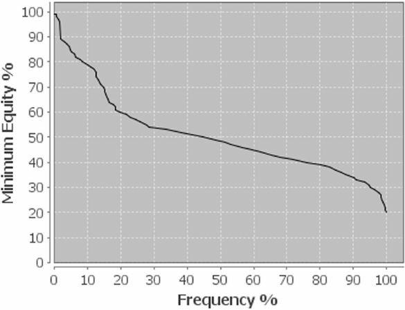
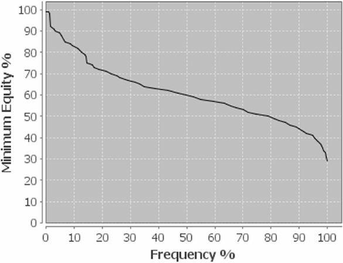
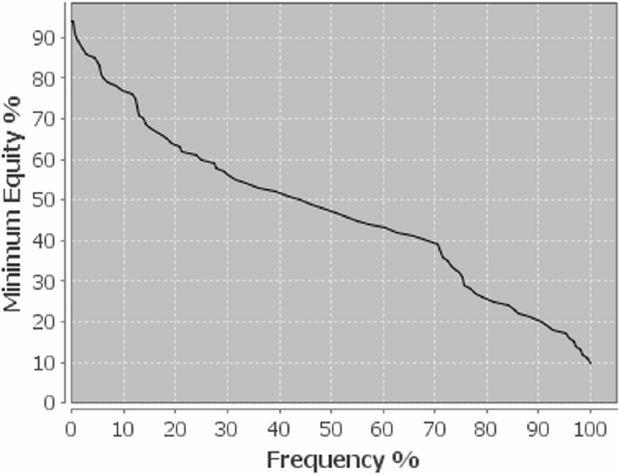
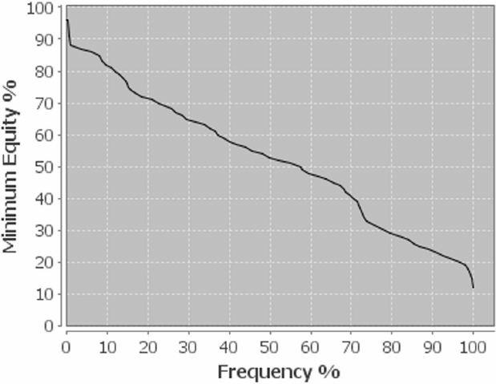
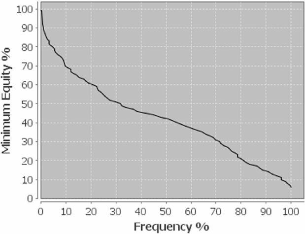
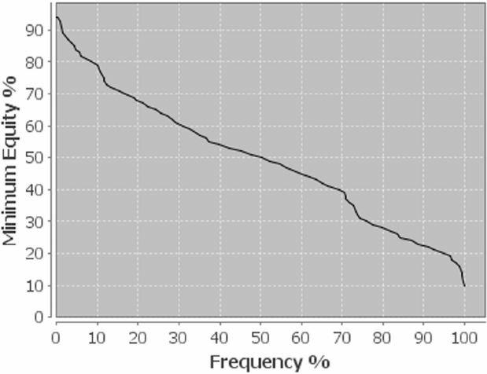
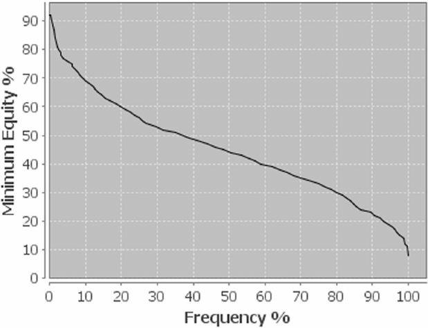

让我们更详细地谈谈你手中牌的最佳打法。与德州扑克不同，翻牌前的被动打法非常有意义，你不应该对所有想玩的牌都自动加注。奥马哈的翻牌前主动权远不如德州扑克重要，因为 PLO 更依赖于翻牌。翻牌圈后，牌面价值 (以权益计算) 可能会发生很大变化，因此在翻牌前少投入一些资金，并在投入大量资金之前评估牌面是合理的。

所有这些考虑因素都应该影响你的整体游戏计划。理想情况下，如果你进入一手牌，你应该有一个计划来应对对手可能采取的行动。例如，在 BTN 加注很多牌，然后每次面对再加注都弃牌，这种做法并不明智。这会让你很容易被剥削利用。你应该已经知道，当你在 BTN 60% 频率加注，你的对手会更轻地 3-bet，而一个不错的防守范围会让他们的日子难过得多。你甚至可能想在每个 BTN 都最小加注，并 100% 跟注盲注的 3-bet。这有时会阻止一些对手进行轻的 3-bet，尤其是在你翻牌后打得好的情况下，因为他们总是不得不在不利位置打大底池，而不能确定你的精准范围。

无论如何，无论你选择什么策略，你都应该评估你的游戏计划，以确定它是否有利可图。你肯定不想把你的游戏建立在一个行不通的理论之上。因此，从一开始就制定一个严谨的游戏计划很有帮助，因为它能帮助你避免翻牌后遇到困难和接近的局面。你玩得越松，你的牌就越边缘。这会让翻牌后的决策更加困难。

首先，你需要在每个位置建立合理的开池加注范围。本书的标准游戏是 6 人桌，筹码量为 100 BB。如果你想制定一个坚实的游戏计划，你的开池加注范围应该相当紧。之后，你可以开始放松，并谨慎地逐步扩大你的范围。

**要点**

- 起手牌的选择并非在翻牌前凭空而来
- 起手牌的选择是你翻牌后盈利的切入点
- 起手牌的选择与位置和对手的倾向有关

### 开池范围

**关于范围的一般想法**

所有扑克玩家都会毫不犹豫地谈论 12% 的开池范围、8% 的 3-bet 频率等等。乍一看，这些范围或许能让你对它有一个清晰的认识，但深入挖掘后，你会发现，这些范围的实际构成存在一些疑问。与德州扑克相比，PLO 的牌型要多得多。在 PLO 中，一个 15% 的范围包含 40,600 种牌型，这是一个巨大的数字，很难在牌桌上记录下来或进行视觉化。要理解玩家如何选择他们的牌型，需要进行大量的解读。有些人更喜欢玩口袋对子，而有些人则更喜欢双同花或连牌。你应该做笔记，以帮助你了解对手如何选择他们的起手牌。例如，如果一个玩家在 3-bet 底池中频繁地用小的、不连接的口袋对子来碰运气，你应该记录下来，这样你就可以最大限度地利用这个漏洞。

在 PLO 中，创建令人满意的范围是一个非常复杂的过程，而且很难一概而论，因为它也非常依赖于玩家。为了简单起见，我们将使用标准的牌型排名系统。本书不打算深入探讨牌型范围。本书在讨论某些范围 (例如 3-bet 范围) 时可能会略有不准确之处，但本书仍然会教你如何运用范围思考并将其应用于你的游戏。本书提供的工具将帮助你制定有利可图的翻牌前策略，并根据特定对手进行调整。理解这些原则远比将预设的范围融入你的游戏更重要。

所有范围都很大程度上取决于你的位置和所在的牌桌。本书提供了一些建议，帮助你在满员 6 人桌的牌桌上找到适合自己风格的范围。被动或激进的牌桌需要进行一些调整，少人桌也一样。例如，如果只有 4 名玩家，你就必须更多地偷牌，更多防守，因为平均而言，他们的牌力会略弱。制定游戏计划是扑克成功的先决条件，但你始终需要根据实际的牌桌和对手进行调整。因此，请将以下章节作为你个人游戏计划的建议，并尝试根据自己的风格和整体策略进行调整。

**不同位置的开池范围**

**UTG**

在前位，你肯定希望拥有最紧的范围，因为你很可能需要在不利位置对抗后位的跟注者。大多数人在前面位置玩得很紧，你也应该如此。加注大约 12% 似乎比较合适。

当然，你会对所有双同花高对 (从 A-A-x x 到 Q-Q-x-x) 加注，然后是所有合适的、连接的 J-J-x-x 组合，例如 J-J-9-8-ds 或 A-K-J-J-ds，以及最好的 10-10-x-x 组合 (A-10-10-x-ds 等) 加注。如果彩虹牌 J-J-x-x 或 10-10-x-x 不是超级连接的牌，例如 J-J-10-9，你不应该用它们加注。像 6-6-5-5 这样的连接双同花两对也是标准的加注。

所有好的、连接的、双同花或单同花的 A-x-x-x 牌，例如 A-10-9-8、A-7-6-5，以及所有好的 A-K-Q-J、A-K-Q-10 等，都应该加注。A-K-x-x-ds 也是一种开池，即使有悬垂牌。

对于连牌，所有双同花的、连接的连牌，例如 8-7-6-5+，以及一个缺口的连牌，例如 J-10-8-7-ds 或 Q-10-9-8-ds，都应该加注。

开池范围很大程度上取决于你的风格，更重要的是你的对手。在艰难的牌桌上，如果你在前位打得特别紧，你不会对自己造成伤害，因为位置劣势可能很大，尤其是面对优秀的玩家时。

**MP**

在中位，你应该比在 UTG 加注得稍微松一些。用同样的牌加注，再加上一些更弱的、连接的、彩虹牌或单调牌，例如 A-7-6-5 或 A-J-10-9 彩虹牌。你很可能处于不利位置，所以不要松得太厉害。在前位和中位，保持极度紧的打法至关重要。大多数玩家，即使是顶级职业玩家，在这些位置打得都非常紧，你也应该如此。你可以在你的追踪软件中看到你的位置优势。你可能不会经常在这两个位置获胜。从宏观角度来看，最好不要卷入太多困难的场合。把你的松打法限制在 CO 和 BTN，也就是最有利可图的位置。

**CO**

从 CO 开始，你可以开始放松你的范围。所有高口袋对子 (10-10-x-x+) ，即使是非同花的，以及所有两对，都可以加注。这些牌在有利位置上玩会非常有利。你不必太担心非常强的范围，因为拥有最强范围的两位玩家已经弃牌了。你也可以用所有连牌以及所有有某种连接的牌开池加注。

然而，你的 CO 开池范围也取决于在你之后行动的玩家。如果 BTN 和盲注会 3-bet 很多，你应该更紧地开池。另一方面，如果他们弃牌很多，你可以开始更宽地偷盲。

**BTN**

BTN 保证了翻牌后的位置优势。你应该在这里使用你最宽的范围，因为这将非常有利可图。你可以用几乎所有可玩的牌开池加注：大多数口袋对子、任何 A 同花、所有连牌，甚至像 8-7-5-3 单同花、K-Q-J-7 彩虹牌和任何双同花牌。

**SB**

你应该在 SB 玩得紧，因为你总是处于不利位置。你的开池范围也取决于 BB。如果他对 SB 很轻地 3-bet，你就必须适应这种情况。如果他弃牌很多，你也应该调整。如果 BB 很容易盖牌，偷盲就变得更加重要。如果一位玩家在 BB 频繁 3-bet，你可能应该只用很多牌补齐盲注，而不是加注。

你在 SB 的范围可以与你的 MP 范围相似。你甚至可以比在 MP 更好地调整，因为你只需要考虑在你之后行动的那位玩家的特点。

### 翻牌前跟注范围

在 PLO 中考虑翻牌前跟注范围时，你必须注意上面讨论过的牌型选择原则：位置、对手数量和他们的游戏风格，当然还有即将发生的局面 (单挑、多人、SPR 等等)。这些因素构成了每个翻牌前决策的基础，无论你是想加注、跟注还是对开池加注弃牌。与自己开池加注 (这更多地取决于你的位置) 相比，跟注范围更多地取决于对手和行动。

如果你拿着一手不错的牌并想继续玩下去，你可以跟注或再加注。这两种选择都有各自的理由。在 “3-bet” 章节中，我们将详细讨论何时再加注是更好的选择。在这里，我们想讨论哪些情况下跟注是正确的玩法。这里的关键在于想象翻牌后可能出现的情况。

首先，你不应该用手牌对非常紧、很可能 4-bet 的对手来再加注，这会迫使你陷入略微劣势的赌博，尤其是在你持有不错的、有连接性的、坚果性的手牌，而且在多人底池时也表现良好的情况下。如果你决定在 MP 跟注 UTG 的玩家，底池很可能会变成多人，因为 BTN 的玩家也会采取轻的跟注策略，试图在翻牌后利用他的位置优势。盲注玩家获得了极好的赔率，并且防守也会更轻，从而导致高 SPR、多人的局面。正如我们上面所学到的，坚果性和两极化的牌在这些情况下表现非常好，你甚至应该邀请其他持有非坚果性范围的玩家跟注。跟注并可能压制较弱的听牌或较小的口袋对子，将极大地提高你的权益。当你不想用非强牌但坚果性的牌来赶走对手时，跟注是正确的选择，但这里还有另一个需要考虑的方面。

在非常激进的牌桌上，翻牌前总是有 3-bet，你应该用更强的范围跟注开池加注，这样你就不会被迫用平庸的牌玩手中的筹码，甚至在翻牌前弃牌。当翻牌前有很多再加注时，用平庸的牌平跟是一个很大的错误。在这种牌桌上，你应该在翻牌前玩得稍微紧一些，以避免在很多边缘场景赌博。在非常激进的牌桌上，设陷阱也是一个不错的选择。用非常强的牌跟注开池加注应该是你的武器。让激进的玩家轻的 3-bet，然后你 4-bet 加注，创造一个非常有利可图的局面。如果桌上有激进的短筹码玩家，这也可能是一个选择。

另一方面，对抗非常被动的对手你可能会看到很多便宜的多人底池翻牌，尤其是拿着坚果性的手牌。如果 3-bet 很少，你可以用各种牌跟注，并且更多地依赖你的翻牌后技巧，因为你无需冒太多风险就能在翻牌后进入非常有利可图的局面。在考虑你的跟注范围时，这是三个最重要的考虑因素。

现在，让我们讨论一下如何挑选能够有效对抗开池加注对手范围的牌。面对一个紧的 UTG 13% 的开池加注范围，其中包含大量大口袋对子和不错的百老汇牌，用在其他情况下很容易 3-bet 的牌跟注可能会有一些优势。这里的关键在于用翻牌后具有极佳可玩性和可预见性的牌跟注 (即，你可以轻松判断自己和对手的牌力)，从而创造有利可图的局面。

像 A-Q-9-8-ds 或 A-Q-J-9-ss 这样的牌，面对松散的范围很容易 3-bet，但面对紧的范围，你唯一的选择就是翻牌前平跟。如果你用这些牌 3-bet 对抗非常紧的对手，翻牌后你很可能会被他范围中的相当一部分牌压制。因此，用你的优秀牌跟注是最好的选择，因为它即使在多人底池中也能发挥出极佳的效果。跟注还会引来一些你占优势的弱牌。你更倾向于用小连牌 3-bet，因为他们很容易跟注紧的对手的 4-bet，让你在翻牌后处于有利可图的位置。我们将在牌例中的第 8 手牌中详细讨论这一点。

思考如何运用这些原则来对抗非常松的范围。虽然像 A-Q-J-9-ss 这样的牌很容易 3-bet，但你可能不想用低连牌 3-bet 来对抗松散的范围，因为松散对手的跟注范围会包含很多中等牌，可能会压制你。用 8-7-6-5-ss 这样的牌跟注，就能让你在翻牌圈有更好的可预见性，并且更具可玩性。

**总结**

- 在单次加注、多人底池中，坚果性比非坚果性的牌表现更好。
- 在激进的牌桌上，你应该减少翻牌前跟注，并且玩得非常紧。
- 在被动的牌桌上，你可以用很多 (坚果性) 牌跟注，并尝试玩翻牌后。
- 针对特定对手调整你的跟注范围非常有益

### 3-bet 范围

在深入探讨 3-bet 范围之前，你应该先了解我们为什么要 3-bet。3-bet 的理由是什么？从博弈论的角度来看，3-bet 是一个策略决策，目的是获得更多价值并提高你的整体 EV。当你在翻牌前拥有权益优势时，3-bet 最明显的目的显然是为了获得价值。你希望通过利用翻牌前的权益优势直接获利，使底池尽可能大，因为这总是能带来直接利润。

筹码越少，翻牌前的权益优势就越重要。这就是为什么短筹码或 CAP 游戏和锦标赛中的 3-bet 范围比深筹码游戏更注重高牌和权益。你看到了权益优势，而且由于再加注底池的 SPR 非常低，你可以轻松地消除翻牌后的打法并实现你的权益。但翻牌后的玩法恰恰是你不想用任何翻牌前拥有可观权益优势的牌来输掉底池的原因。在 PLO 中，你通常不能在翻牌前全下，至少在其他玩家不愿意 4-bet 的情况下是这样。如果你愿意对所有 A-A-x-x 牌 (无论其质量如何) 都进行 3-bet，那么在 SPR 中到高的情况下，优秀的玩家在翻牌后有很多机会实现他们的权益。糟糕的 A-A 通常会导致翻牌后出现很多猜测，因为你很少能击中非常强的牌。

可玩性，尤其是翻牌圈的权益分布，是 3-bet 时的另一个考虑因素。对于拥有可玩性优势但权益不一定很高的好牌，你可以调整 SPR 以使其更具优势，并提高翻牌后的玩法质量。我们稍后在讨论各种 3-bet 牌型时会讨论这个问题。除了试图通过权益或可玩性优势来最大化价值之外，还有许多其他理由在翻牌前进行再加注。你可能想要隔离较弱的玩家，或者瞄准那些在 3-bet 底池中玩得不太好的玩家，例如，如果他们在持续下注时弃牌过多，或者倾向于弃牌过少。虽然隔离玩家不像在德州扑克中那么重要，但它仍然是一条有价值的翻牌前打法。

尤其是在有利位置，3-bet 是一个非常强大的武器，因为它可以让你操纵 SPR，以适应你的牌型，并用合适的牌打更大的底池。但在位置劣势下 3-bet 会更加棘手，尤其是在使用弱的 A-A-x-x 或 K-K-x-x 等两极化的牌时。然而，在翻牌前降低 SPR 可以减少你的位置劣势，因为 SPR 越高，位置就越重要，反之亦然。在详细介绍你可能想要在翻牌前考虑再加注的牌型之前，让我们先来谈谈位置优势下的 3-bet 以及一些一般注意事项。

**3-bet 和位置**

如果你考虑用特定牌型进行 3-bet，首先要考虑你的对手和你的位置。你不会想对一个非常紧的开池频率 5% 的玩家进行 3-bet。3-bet 的关键在于正确解读牌桌和位置。你的 3-bet 幅度可以大或小，而且你可能会用不同的牌型进行 3-bet，这取决于你的对手是紧是松。你也应该根据翻牌后的位置来 3-bet 不同的牌型。在有利位置时，你可以比在不利位置时做更轻的 3-bet，因为你可以控制底池大小，并在整手牌中拥有信息优势。在不利位置时，你会更喜欢一些比较坚果性的牌型，这样你才能轻松应对。而在有利位置时，你可以用所有权益分布平滑、并且能从有利位置和控制底池大小中获利的牌型进行更有创意的 3-bet。

**对抗 UTG**

对抗 UTG 的紧手加注者，你应该用尽量少的牌 3-bet 。他很可能拿着非常强的牌，大多是双同花的百老汇牌和高口袋对子和连牌，此外还有一些可玩性极佳的连牌。不过，你也可能想用低连牌或对抗 UTG 的紧手加注者时表现良好的牌 3-bet，但这是一个更高级的概念，需要大量的牌型和牌面解读。

当然，你可以用所有好的 A-A 3-bet，以及对抗百老汇牌和高对子范围时表现良好的牌，例如 J-10-9-8-ds、7-6-5-4-ds 或 8-7-6-5-ds 等双同花、低连牌。不要用双同花的 Q-Q、连接的 J-J 或 K-J-10-9 这样的连牌 3-bet，因为它们在对抗紧范围时效果不佳，而且你经常会遇到一些在翻牌后占主导地位或免费听牌反超你的牌，比如在前位的开局范围中，像 A-K-J-10 这样好的 A 高牌百老汇连牌。

**对抗 MP**

对抗 MP 的开池加注，你基本上会用和对抗前位相同的牌 3-bet，但你可以稍微扩大你的范围，加入一些好的百老汇连牌，最好是 A 高牌，单同花或双同花连牌，比如 A-K-J-10-ss。

如果你在盲注 3-bet，翻牌后会处于不利位置，那么你应该只用强牌再加注。如果你在 CO 或 BTN 很可能有位置优势再加注，那么你可以更放松一些。翻牌后的信息优势在这里至关重要。

**对抗 CO**

对 CO 的再加注显然取决于你在 BTN 有位置优势还是在盲注位置处于不利位置。

在有位置优势的情况下，你可以用所有优质牌、所有好的连牌、所有以某种方式连接的大牌 (例如 A-K-10-5-ss) 以及两对 (例如 9-9-6-6) ，甚至中等双同花的牌 (例如 8-7-5-4-ds) 进行 3-bet。如果你想加注范围足够广，可以加入一些半连接、双同花且权益分布平滑的牌，例如 Q-10-8-6 或 K-Q-9-7。

在不利位置的情况下，你不应该 3-bet 那么宽。倾向于选择那些你会对 MP 开池玩家再加注的优质牌。

对抗 CO 开池玩家的另一个可能适合 3-bet 的牌是好的、连接好的、双同花的、中等百老汇对子 (例如 Q-Q-x-x 或 J-J-x-x)。面对较松且没有太多百老汇连牌的对手，这非常有利可图。你将压制他范围中相当一部分，也就是中等的连牌。在这种情况下，Q-Q-x-x 或 J-J-x-x 牌甚至比 A-A-x-x 牌更强，因为它们在对抗对手的防守范围时表现异常出色。想象一下，你用 J-J-10-9 进行 3-bet，而你的对手用 9-7-8-6 这样的强的连牌防守。在很多公共牌面，他可以在翻牌圈表现良好，但仍然会被完全压制。

**对抗 BTN**

如果你没有选择翻牌前溜入 - 再加注的玩法，那么你 3-bet 对抗 BTN 玩家的大多会发生在盲注。如果 BTN 防守，你每次都会处于不利位置。你的范围应该相当紧，以弥补位置劣势。你的范围应该或多或少与你 MP 3-bet 的范围相似。BTN 会用很多不连接的双同花牌和小口袋对子开池加注，而百老汇牌对抗这些牌型非常有效。所有好的连牌，以及像 A-K-J-4-ss 或 K-Q-10-8 这样的不错的百老汇组合，都是不错的 3-bet 牌型，因为 BTN 的范围里有很多中低牌。由于 BTN 范围里有很多中等水平的双同花牌，所以双高同花的牌型也非常有效。

**对抗 SB**

如果你对 SB 开池加注 3-bet，那么你将在整个翻牌后都处于有利位置。这是一个巨大的优势，考虑到 SB 玩家的倾向，你可以做宽范围的 3-bet。如果他在这个位置玩得非常紧，你应该相应地调整你的 3-bet 范围。另一方面，如果他试图给你在 BB 位施加很大压力，并且经常偷盲和加注，你可以通过非常宽的 3-bet 让他在翻牌前做出许多艰难的决定。

**一般注意事项**

让我们再次思考一些关于 3-bet 的显而易见的事情。开池范围越紧，你 3-bet 的频率就越小。相比前位的开池玩家，你更应该在后位的开池玩家身上做 3-bet。如果你决定对紧范围 3-bet，你必须调整你的范围，以便在翻牌后有更好的表现。面对松范围，尤其是在有位置优势的情况下，即使没有坚果潜力或强牌，你也应该做宽范围的 3-bet，并在翻牌后创造最佳的 SPR 局面，这样你的牌最容易打。

**3-bet 牌型**

既然我们已经讨论了位置因素，现在让我们来讨论一下适合 3-bet 的牌型。显然，你的 3-bet 范围中很大一部分应该是双同花。同花，尤其是坚果同花，通常会为你的牌型增加很多权益。A♠️-A♦️-Q♣️-7♥️ 和 A♠️-A♦️-Q♠️-7♦️ 的可玩性差异很大。在你的整个 3-bet 范围中都要记住这一点。

3-bet 牌型的分类方法有很多。你可以选择经典的牌型分类，也可以采用权益 / 可玩性分类。你应该了解这两种方法，因为它们能帮助你了解 3-bet 的不同方面。就牌型分类而言，可以考虑以下主要牌型：

- 高对
- 连牌
- 两对
- 其他

另一种方法同时考虑牌型质量和性能。我们考虑以下标准：

- 权益优势
- 可玩性优势

两种方法各有优劣。虽然按牌型分类的方法易于理解且直观易懂，但权益 / 可玩性方法则更为精妙，并运用了 3-bet 背后的博弈论原理。它解答了你为什么要 3-bet 的问题。这一点尤为重要，因为它可以防止你在某些牌类中陷入一种 “自动驾驶式” 的 3-bet 模式。你可以 3-bet 的牌有很多，但这样做并不总是最佳的玩法。重新思考你希望通过再加注实现的目标是必须的，这应该是每个可靠游戏计划的一部分。在下一章中，我们将遵循经典的按牌型分类的方法，但我们将使用权益和可玩性的博弈论方法来分析它们。

**高对子**

**A-A**

A-A 是 3-bet 最重要的牌类，事实上，它们也是 3-bet 次数最多的牌类。紧的 3-bet 范围非常偏重 A-A，很多玩家仍然根本不混合他们的范围，而是用所有 A-A 起手牌再加注。我们稍后会讨论其战略意义。

A-A 牌组中最重要的 3-bet 子集是超级优质牌，例如双同花的 A-A-K-K、A-A-10-10 或 A-A-J-10，因为它们相对于所有其他牌都具有巨大的权益和可玩性优势。你应该在任何位置都充分利用这种权益优势。在某些情况下，你可能只想用这些牌跟注来引诱对手诈唬或挤压，但通常无论位置如何，你都应该 3-bet 它们。凭借其保证的权益优势，这些牌显然非常适合对抗紧的和松的开池范围。

对于非优质 A-A 的情况，情况会变得更加棘手。像 A-A-2-2-ss 这样的牌在翻牌后表现不佳，因为在大多数公共牌面上你都会面临棘手的决策，但你通常仍然应该用它们进行 3-bet。这样做有几个原因。首先，你想减少对手的参与度，并赢得单挑底池。在多人底池中，摊牌时的牌力会非常强。除非翻牌圈拿到顶三条或坚果同花听牌，否则超对牌无法承受这些行动。另一个原因与翻牌圈的 SPR 有关。翻牌圈的 SPR 越低，翻牌前的权益优势就越重要，从而降低了翻牌圈后投机牌的潜在赔率。拿着 A-A 并且 SPR 大约为 1 进入翻牌圈总是有利可图的。你经常在翻牌圈获得必要的 33.3% 的全下权益，并且你消除了某些公共牌面中有时棘手的翻牌后打法。

非常弱的 A-A 牌，例如经典的 A-A-7-2-r，不应该自动进行 3-bet。在确定翻牌前的打法之前，你必须仔细评估自己的情况。你可能仍然想在有利位置 3-bet，但如果位置不利，并且预计底池会有多人，你可能只想跟注翻牌前的开池加注，然后争取击中三条拿到价值。大多数翻牌圈你都无法继续玩下去，在这种情况下，限制翻牌前的投入可能是更有利可图的决定。

让我们来看看不同类型的 A-A 牌面对不同范围的权益分布。我们选择了五张 A-A 牌作为示例：首先是 A-A-x-x，然后是超级优质双同花 A-A-J-10，单同花 A-A-2-2，以及彩虹 A-A-K-Q 和 A-A-7-2。

| A-A vs 范围 | A-A-x-x | A-A-J-10-ds | A-A-2-2-ss | A-A-K-Q-r | A-A-7-2-r |
| --- | --- | --- | --- | --- | --- |
| 15% | 65.13% | 71.46% | 65.15% | 65.43% | 60.32% |
| 20% | 65.01% | 71.35% | 65.04% | 64.95% | 60.2% |
| 25% | 64.9% | 71.06% | 65.04% | 64.45% | 60.15% |
| 30% | 64.78% | 70.95% | 64.78% | 63.97% | 60.14% |
| 35% | 64.62% | 70.72% | 64.76% | 63.66% | 59.77% |
| 40% | 64.53% | 70.59% | 64.57% | 63.51% | 59.88% |
| 45% | 64.51% | 70.48% | 64.53% | 63.29% | 59.75% |
| 50% | 64.4% | 70.42% | 64.64% | 63.07% | 59.6% |
| 60% | 64.47% | 70.21% | 64.66% | 62.81% | 59.85% |
| 100% | 65.43% | 70.56% | 66.1% | 63.44% | 61.18% |

从这些数据中，我们可以得出一些有趣的结论。首先，你可以看到，像 A-A-J-10-ds 这样双同花、连接良好的牌型，在对抗所有范围时，表现更好，权益比其他类型的 A-A 牌型高超过 5%。此外，所有 A-A 牌型在对抗紧范围时都表现出色，而在对抗宽范围时则会损失一些权益。这种趋势随着 A-A 牌质量的下降而更加明显。在 60% 的范围中，它们会损失权益，而在对抗 100% 的范围时，它们的表现略好一些。

从连接良好但彩虹色的 A-A-K-Q 牌型中，我们可以得出另一个重要的结论。缺乏同花听牌会对你的整体权益产生负面影响，尤其是在对抗宽范围时。

让我们用 A-A-K-Q 来仔细看看同花听牌的重要性。

| A-A vs 范围 | A-A-K-Q-r | A-A-K-Q-ds | A-A-K-Q-ss |
| --- | --- | --- | --- |
| 15% | 65.43% | 70.31% | 67.91% |
| 20% | 64.95% | 69.87% | 67.49% |
| 25% | 64.45% | 69.67% | 67.05% |
| 30% | 63.97% | 69.46% | 66.79% |
| 35% | 63.66% | 69.08% | 66.4% |
| 40% | 63.51% | 69.05% | 66.39% |
| 45% | 63.29% | 68.76% | 66.07% |
| 50% | 63.07% | 68.6% | 65.9% |
| 60% | 62.81% | 68.5% | 65.6% |
| 100% | 63.44% | 69.04% | 66.16% |

正如你所见，同花听牌能显著提升权益，而且它还能大幅提升翻牌后的可玩性，让你在某些类型的翻牌圈中拿到超强牌，而不是过牌 - 弃牌。需要注意的是，同花听牌在面对松散范围时，其权益优势更大。

**K-K**

K-K 牌在 PLO 中不如在德州扑克中强，但它们仍然是非常强的 3-bet 牌。让我们来看一张权益表。表中的同花牌总是高牌同花。与所有起手牌一样，连牌能极大地提升你牌的质量，无论是翻牌前的权益还是翻牌后的可玩性。

| K-K vs 范围 | K-K-x-x | K-K-Q-J-ds | K-K-Q-J-ss |
| --- | --- | --- | --- |
| 15% | 52.82% | 56.93% | 53.94% |
| 20% | 54.75% | 59.23% | 56.29% |
| 25% | 56.11% | 60.63% | 57.62% |
| 30% | 57.16% | 61.7% | 58.68% |
| 35% | 57.87% | 62.43% | 59.61% |
| 40% | 58.43% | 62.99% | 60.22% |
| 45% | 58.87% | 63.47% | 60.58% |
| 50% | 59.27% | 63.93% | 61.05% |
| 60% | 60% | 64.45% | 61.68% |
| 100% | 62.44% | 66.82% | 63.96% |

| K-K vs 范围 | K-K-Q-J-r | A-K-K-Q-ds | K-K-7-2-r |
| --- | --- | --- | --- |
| 15% | 50.97% | 62.82% | 45.9% |
| 20% | 53.38% | 64.35% | 48.1% |
| 25% | 54.96% | 65.28% | 49.51% |
| 30% | 55.85% | 65.88% | 50.54% |
| 35% | 56.72% | 66.09% | 51.34% |
| 40% | 57.28% | 66.42% | 51.97% |
| 45% | 57.9% | 66.52% | 52.57% |
| 50% | 58.14% | 66.69% | 52.95% |
| 60% | 58.84% | 66.86% | 53.78% |
| 100% | 61.17% | 67.8% | 56.71% |

如上表所示，K-K 的翻牌前权益远低于 A-A。K-K 在面对紧范围时根本不强，如果牌力不够强，比如 K-K-7-2-r，就会落后。这是 A-A 和 K-K 之间的第一个重大区别。A-A 在面对紧范围时表现良好，在面对较松范围时会损失一些权益，而 K-K 的表现则截然不同。随着范围变宽，K-K 会持续增强，但在面对紧范围时缺乏明显的权益优势。显然，A-A 的存在，尤其是在紧范围中，会削弱 K-K 的整体表现。此外，没有同花听牌或连接的非常弱的 K-K，其实力也并不强，即使面对 25% 的范围，也处于劣势。

你还可以看到，K-K 同时持有 A 边牌可以大幅提升你的权益，因为它降低了对手持有 A-A 的概率，同时也降低了你在翻牌圈出现 A 时的脆弱性。

另一方面，好的、连接的、同花的 K-K 牌在对抗更宽范围时表现极佳，使其成为扩大权益优势的完美 3-bet 牌。特别是，由于你拥有充足的权益优势和良好的可玩性，你可以轻松 3-bet 来对抗后位或 BTN 的开池。

不要用非常弱的 K-K 牌 3-bet，或者只在非常特殊的情况下这样做。由于其权益分布极其两极化，在再加注的底池中，它无法经常在翻牌圈中击中强牌，从而无法获得丰厚的利润。你可能可以对抗弱牌，但更好的做法通常是用糟糕的 K-K 平跟开池加注，并将 3-bet 限制在非常好的、连接的和双同花的 K-K 牌上。看看 K-K-7-2-r，这手牌的权益分布呈现两极化，只有大约 20% 的翻牌圈权益超过 60%，这使得它更适合多人参与、高 SPR 的牌局。因此，你用这样的牌 3-bet 不会获得价值。弱 K-K 通常更适合高 SPR 的牌局，所以你通常应该在翻牌圈前用它们跟注。

K-K-7-2-r vs. 30%

K-K-Q-J-ds vs. 30%

如果我们比较一下 K-K-7-2-r 和超强 K-K-Q-J-ds 的权益分布，就会发现一些明显的差异。与两极化的 K-K-7-2-r 相比，K-K-Q-J-ds 的权益分布非常平滑，几乎 80% 的翻牌圈权益为 50%，一半的翻牌圈权益为 60%，这是一个巨大的差异。

你可能根本不想用 K-K 3-bet 对抗紧的 UTG 开池，或者如果想，只用超强 K-K 3-bet。由于权益优势并非必然，可以考虑平跟，这样你就可以翻牌后继续游戏，而起手牌越弱，这一点就越重要。你可以避免 4-bet，这会让你陷入尴尬的境地，因为 K-K 在对抗好的 A-A 牌时表现糟糕，而 A-A 牌构成了 4-bet 范围的很大一部分。

**Q-Q**

Q-Q 不是你应该经常考虑 3-bet 的牌，尤其是在对抗紧范围时。但对抗宽范围时这样做仍然有其优势，因为你甚至可能在翻牌后控制一些中等大小的牌。让我们来看看下面的权益表。同花色总是包含最大的牌。

| Q-Q vs 范围 | Q-Q-x-x | Q-Q-J-10-ds | Q-Q-J-10-ss |
| --- | --- | --- | --- |
| 15% | 46.03% | 51.11% | 47.91% |
| 20% | 49.95% | 53.95% | 50.83% |
| 25% | 51.1% | 55.95% | 53.08% |
| 30% | 52.4% | 57.44% | 54.51% |
| 35% | 53.67% | 58.73% | 55.96% |
| 40% | 54.56% | 59.56% | 56.7% |
| 45% | 55.16% | 60.4% | 57.56% |
| 50% | 55.98% | 61.07% | 58.32% |
| 60% | 56.99% | 62.17% | 59.4% |
| 100% | 60.33% | 65.22% | 62.46% |

| Q-Q vs 范围 | Q-Q-J-10-r | A-Q-Q-K-ds | Q-Q-4-5-ss |
| --- | --- | --- | --- |
| 15% | 44.84% | 59.14% | 49.66% |
| 20% | 47.85% | 61.41% | 51.95% |
| 25% | 50.1% | 62.96% | 53.78% |
| 30% | 51.67% | 63.81% | 55.09% |
| 35% | 52.97% | 64.56% | 56.05% |
| 40% | 53.85% | 64.92% | 56.88% |
| 45% | 54.7% | 65.28% | 57.7% |
| 50% | 55.45% | 65.36% | 58.32% |
| 60% | 56.57% | 65.86% | 59.42% |
| 100% | 59.74% | 67.46% | 62.93% |

显然，你并没有在对抗紧范围时在翻牌前发挥权益优势。实际上，随机的 Q-Q 牌型在对抗 25% 范围时，权益已经开始持平，但仍然存在一些可玩性问题。即使是强的、连接的、双同花的 Q-Q-J-10，也仅仅略微领先于紧范围。此外，这种牌型在对抗非常宽的牌型范围时并没有巨大的权益优势，但与 K-K 类似，它在对抗更宽的范围时会逐渐增强。

如果你拿着 A-K-Q-Q-ds，这个假设会有所改变。牌型移除效应会消除相当多的潜在更大口袋对，这对你的整体权益非常有利，使其成为一个有利可图的 3-bet，并为你翻牌后的范围增添一些欺骗性。因此，Q-Q 牌型在对抗宽范围时是一个有利可图的 3-bet，在这种情况下你不太可能被 4-bet。用 Q-Q 牌型面对 4-bet 会相当尴尬，因为你经常会遇到 A-A 或 K-K 牌型，这些牌型在翻牌前就能把你彻底击败。除非翻牌圈的 SPR 非常高，否则用 Q-Q 跟注 4-bet 根本不会盈利。

通常情况下，你不应该用低于 Q-Q 的口袋对子 3-bet，即使是 Q-Q 也必须谨慎评估。你仍然可以用 J-J 或 10-10 的牌 3-bet，但通常只能用两对。我们将在两对章节中讨论这一点。

**总结**

- 如果同花且连接的，高口袋对子可以获得很高的价值。
- 如果没有 A 边牌，K-K 和 Q-Q 牌在面对紧范围时表现不佳。
- 所有非优质口袋对子的权益分布都呈现出两极化。

**连牌**

还有另一组可能的 3-bet 牌型，它们并不一定拥有权益优势，但由于其在 3-bet 底池中平滑的权益分布，具有可玩性优势。这些就是连牌。

你必须区分百老汇连牌 (A-K-Q-10、K-Q-J-10) 和小牌或中牌连牌 (J-10-9-8、9-8-7-6) ，因为它们在对抗不同类型的范围时会有所不同。对抗非常紧的范围，尤其是在 UTG 开池时，带有 A 或 K 的大牌连牌表现不如小牌连牌。这是因为紧的范围除了大对子外，还包含许多百老汇牌。尤其是在没有 A 的情况下，UTG 加注者很有可能持有 A-A-x-x 或正在压制你的牌。小牌连牌在翻牌后具有更好的可预见性和可玩性。

另一方面，百老汇牌的连牌在对抗松散的后位开局范围时会获得很大的价值，因为现在你可以压制并免费听牌胜出他们范围中相当一部分的牌，例如，K-Q-J-10-ds 对抗 J-10-9-8。

如上所述，连牌通常没有很大的权益优势。即使是强牌、双同花、A 高牌的百老汇牌连牌，在对抗宽范围时也只是略占优势。所以，你可能会问为什么这些牌型经常用来 3-bet。这个问题有几个答案。

首先，从博弈论的角度来看，只用 A-A 牌型而不加其他牌型 3-bet 是非常糟糕的。由于你的牌是明牌，你的对手很容易在 3-bet 底池中剥削你。因此，你必须将你的 3-bet 范围与各种牌型混合，以覆盖大部分公共牌。如果公共牌型出现三张低牌，你有时也应该击中强牌。否则，你将不得不在任何低牌翻牌圈过牌 - 弃牌，这会让你很容易被剥削利用。虽然你的 3-bet 范围不太可能经常击中低牌面，但你范围中的一小部分仍然应该能够继续。

在讨论连牌时，你会注意到，即使是非常强的高牌和百老汇连牌也没有很大的权益优势。这些牌的威力在于它们结合了非常好的可玩性和压制跟注范围的力量。它们也具有非常好的翻牌后权益分布，这意味着由于其平滑的权益分布，它们更容易在翻牌圈中拿到好牌。而且，如果它们击中，它们通常击中得非常强，将成手牌和不错的听牌结合在一起。这种在翻牌圈中拿到非常强的组合听牌 (带同花听牌的顶两对、带顺子听牌的顶对或强的包牌) 的能力，使得它们在翻牌圈后非常有价值。

因此，连牌有两个重要的特点。首先，它们都具有平滑的权益分布，并且由于其多种构成要素，可以在很多翻牌圈中继续对抗。你可以在翻牌圈拿到对子、顺子听牌或同花听牌，而且通常情况下，你还能拿到强成手牌加听牌的组合。这就是它们的第二个优势。连牌在各种公共牌面都能取得不错的权益，这使得它们在对抗各种牌型 (包括暗三条) 时都拥有很高的权益。

我们会根据不同的类别讨论连牌：A、K 和 Q 高连牌，以及带有中牌和低牌的其他连牌。虽然我们主要讨论的是没有缺口的纯连牌，但你仍然可能需要考虑带有缺口的牌型。J-10-9-8 和 J-10-9-7 之间的权益差异很小，但缺口通常会略微降低你的整体权益。记住，大的缺口或位于顶部的缺口会影响你翻牌后的可玩性，因为它们会减少你在翻牌圈可以击中的坚果听牌的数量。

从整体来看，通常可以说连牌越大越好。大连牌会在翻牌圈击中更大的对子、更大的葫芦，甚至更坚果潜力的听牌，而中小连牌则会增加很多欺骗性，也能击中坚果潜力的顺子听牌。小连牌的同花听牌通常价值不高，因为它们很容易被压制。它们的价值更多地在于它们的阻挡性，可以阻止更大的同花听牌进入，而且在某些全下场合，它们是不错的后备选择。

**A-高连牌**

A-高百老汇连牌与 NLHE 中的 A-K 相当。它们面对几乎所有范围的权益上都占优势，但另一方面，它们在面对松范围 (只是小热门) 时权益并不高，而且经常面临被非常紧范围中的大口袋对子压制的风险。你不会希望用 A-K-Q-J-ds 4-bet，因为你主要面对的是 A-A，甚至可能是非常好的 K-K。但你仍然希望经常用这些牌对抗更松的范围，以便立即获利。

| A-高连牌 vs 范围 | A-K-Q-J-ds | A-K-Q-J-ss | A-K-Q-J-r |
| --- | --- | --- | --- |
| 15% | 52.47% | 49.26% | 45.38% |
| 20% | 54.63% | 51.56% | 47.68% |
| 25% | 56.09% | 52.96% | 49.2% |
| 30% | 57.03% | 53.82% | 50.25% |
| 35% | 57.67% | 54.45% | 51.1% |
| 40% | 58.27% | 55.23% | 51.69% |
| 45% | 58.74% | 55.68% | 51.01% |
| 50% | 59.07% | 55.93% | 52.46% |
| 60% | 59.63% | 56.38% | 52.98% |
| 100% | 61.25% | 58.12% | 54.81% |

| A-高连牌 vs 范围 | A-K-J-10-ds | A-Q-J-10-ds | A-9-8-7-ds |
| --- | --- | --- | --- |
| 15% | 52.72% | 50.75% | 46.1% |
| 20% | 54.84% | 52.81% | 47.23% |
| 25% | 55.92% | 54.17% | 48.21% |
| 30% | 56.98% | 55.48% | 49.11% |
| 35% | 57.72% | 56.17% | 50.03% |
| 40% | 58.23% | 56.76% | 50.71% |
| 45% | 58.75% | 57.61% | 51.53% |
| 50% | 59.17% | 58.03% | 51.93% |
| 60% | 59.67% | 58.73% | 53.12% |
| 100% | 61.5% | 60.89% | 56.88% |

正如你在上面的权益表格中所看到的，同花对连牌很多都有好处，甚至更好的是，大多数同花听牌都非常棒。像 A-K-Q-J 这样的牌型在彩虹牌中会非常吃亏，面对随机牌型时，权益只有 54.81%。但如果是双同花，它就变成了一手非常强大的牌型，有可能免费增强牌力，并压制低连牌。

说到 A-高连牌，你通常会想到 A-B-B-B 类型的牌型，即一张 A 牌和三张连接的百老汇牌，但你也应该考虑甚至用 A-9-8-7 这样的牌进行 3-bet，因为它们能给你的范围增添很多欺骗性，能够赢下一些你通常没有击中的公共牌。它们可以与坚果同花听牌一起，翻牌击中包牌或两端顺子听牌，并能在你的范围中增加一些在中低牌公共牌中表现良好的牌型。A-高连牌的 3-bet 很容易用来对抗松的开池玩家，尤其是对抗后位的开池加注玩家，但对抗紧范围时必须谨慎，因为紧范围包含很多 A-A-x-x 和好的 K-K-x-x。

**K-高连牌**

查看下面的权益表，你会发现 K-高连牌几乎没有任何权益优势。即使是像 K-Q-J-10-ds 这样强的牌，面对 25% 的范围也只能打平，而且落后于更紧的范围。偶尔用这些牌 3-bet 的原因是它们在翻牌后的可玩性，尤其是在对抗非常松的开池加注玩家时。所有 3-bet 在双同花的情况下表现都更好，如果没有同花，它们的表现就相当糟糕，正如你在 K-Q-J-10 彩虹牌的权益相对较低所看到的那样。

K-Q-J-10、K-Q-J-9 和 K-10-9-8 之间的权益差异并不大，你可以把它们都加入你的 3-bet 范围，尤其是在面对非常松的对手和后位的开池玩家时。这会给你的 3-bet 范围增加一些欺骗性。面对理性且谨慎的玩家，K-高连牌在翻牌前通常很容易跟注，但由于它们在翻牌后具有极佳的可玩性，这并非什么大问题。

| K-高连牌 vs 范围 | K-Q-J-10-ds | K-Q-J-10-ss | K-Q-J-10-r |
| --- | --- | --- | --- |
| 15% | 46.52% | 43.1% | 39.48% |
| 20% | 48.7% | 45.35% | 41.76% |
| 25% | 50.28% | 46.98% | 43.43% |
| 30% | 51.55% | 48.37% | 44.94% |
| 35% | 52.67% | 49.43% | 45.92% |
| 40% | 53.62% | 50.31% | 46.86% |
| 45% | 54.35% | 51.15% | 47.7% |
| 50% | 55.04% | 51.69% | 48.29% |
| 60% | 55.99% | 52.93% | 49.55% |
| 100% | 59.12% | 56.06% | 52.76% |

| K-高连牌 vs 范围 | K-Q-J-9-ds | K-J-10-9-ds | K-10-9-8-ds |
| --- | --- | --- | --- |
| 15% | 45.55% | 46.51% | 45.23% |
| 20% | 47.6% | 48.34% | 46.87% |
| 25% | 49.32% | 49.67% | 48.09% |
| 30% | 50.54% | 50.89% | 49.17% |
| 35% | 51.71% | 52.11% | 50.15% |
| 40% | 52.55% | 52.78% | 50.9% |
| 45% | 53.53% | 53.73% | 51.68% |
| 50% | 53.97% | 54.35% | 52.46% |
| 60% | 55.12% | 55.35% | 53.56% |
| 100% | 58.5% | 58.86% | 57.58% |

连牌最大的优势之一是其平滑的权益分布。像 K-Q-J-10-ds 这样的牌型在很多翻牌圈都能很好地击中，因此非常适合 3-bet 底池，因为这种底池的 SPR 相当低，在很多时候击中漂亮的翻牌非常重要。

K-Q-J-10-ds vs. 15%

面对 15% 的紧的范围，K-Q-J-10-ds 在翻牌圈以大约 43% 的频率获得 50% 的权益。考虑到你不需要在再加注底池中拥有恰好 50% 的权益就能收支平衡，你可以放心地假设，你大约有一半的时间拥有必要的全下权益，这是一个非常理想的结果。即使在 SPR 较低的情况下，它也表现得非常出色，在超过 70% 的翻牌圈获得 40% 的权益。此外，由于其出色的可玩性，你不会经常陷入困境。

K-Q-J-10-ds vs 30%

K-Q-J-10-ds 在面对更宽泛的 30% 范围时表现有所提升。如你所见，你以较高的频率获得了不错的权益。在 70% 的翻牌圈，你的平均权益大约是 40%。在大约 57% 的翻牌圈，你的权益是 50%。

让我们仔细看看最坏的情况，当你对抗 A-A-x-x 时。

K-Q-J-10-ds vs A-A-x-x

K-Q-J-10-ds 在对抗最强起手牌时表现并不好。你只有 32% 的翻牌圈能获得 50% 的权益。其中一个原因是邻近效应，这意味着持有靠近 A-A 的百老汇牌会降低你的权益。因此，在对抗紧手或包含大量 A-A 牌的范围时，你不应该在翻牌前过度玩 K-高的连牌，因为这简直是 -EV。

**总结**

- K-高连牌在对抗紧范围时表现不佳
- 对抗非常松的范围时，它们可以增加你 3-bet 范围的欺骗性，从而压制对手的很多跟注范围。
- 由于其平滑的权益分布，它们在 3-bet 底池中具有很强的可玩性。

**Q-高连牌**

与 K-高连牌类似，Q-高连牌在对抗较松范围时总体表现更佳，其优势在于能够压制其他听牌。因此，额外的同花会大有帮助。如果没有同花，Q-J-10-9 即使对抗 100% 的范围也表现不佳，权益只有 51.45%。另一个有趣的观察是，差距对你的整体权益影响不大。即使是像 Q-J-9-7-ds 这样的两张隔牌，与 Q-J-10-9-ds 相比，也只会损失少量的权益。

| Q-高连牌 vs 范围 | Q-J-10-9-ds | Q-J-10-9-ss | Q-J-10-9-r | Q-10-9-8-ds | Q-J-9-7-ds |
| --- | --- | --- | --- | --- | --- |
| 15% | 44.97% | 41.79% | 38.25% | 44.99% | 44.09% |
| 20% | 46.87% | 43.44% | 40.13% | 46.51% | 45.4% |
| 25% | 47.97% | 44.88% | 41.62% | 47.51% | 46.49% |
| 30% | 49.28% | 46.1% | 42.61% | 48.45% | 47.41% |
| 35% | 50.26% | 47.24% | 43.83% | 49.47% | 48.26% |
| 40% | 51.15% | 47.99% | 44.49% | 50.19% | 49.09% |
| 45% | 52.08% | 48.76% | 45.4% | 50.87% | 49.84% |
| 50% | 52.76% | 49.63% | 46.32% | 51.63% | 50.55% |
| 60% | 53.9% | 50.75% | 47.57% | 52.95% | 51.74% |
| 100% | 57.53% | 54.54% | 51.45% | 56.85% | 55.71% |

Q-J-10-9-ds vs. 10%

正如我们上面所说，Q-J-10-9-ds 面对非常强的范围时，权益并不高，只有大约 30% 的翻牌圈能打平。而面对稍微松一些的范围时，情况会明显改变，如下图所示，你面对 30% 的范围时。图中你大约在一半的翻牌圈有 50% 的权益，在 70% 的翻牌圈有 40% 左右的权益，这说明了这手牌的权益分布较为平滑。

Q-J-10-9-ds vs. 30%

因此，你应该谨慎地用这些牌型对抗紧范围，但对抗松范围和后面位置的开池，它们可以为你的 3-bet 范围增加很多欺骗性和价值。

**总结**

- 你不应该用 Q-高连牌对抗紧范围，进行 3-bet。
- 对抗非常松的范围，它们在你的 3-bet 范围内是有利可图的，可以压制很多对手的跟注范围，并使你的 3-bet 范围更好地覆盖牌面。
- 由于它们平滑的权益分布，它们在 3-bet 底池中具有很强的可玩性。

**中低连牌**

你绝对不应该用中低连牌进行 3-bet，以扩大翻牌前的权益优势。虽然中等大小的连牌，例如 J-10-9-8、10-9-8-7 和 9-8-7-6，在面对最宽范围时仍能保持较小的权益优势，但对于低连牌来说，情况并非如此，它们甚至落后于 100% 的范围。你应该用这些牌 3-bet 来欺骗对手，并平衡你的 3-bet 范围。如上所述，如果你的范围在低牌面永远无法继续下注，那就非常糟糕了。你很容易被剥削。因此，你应该在你的范围中添加一些在中低牌面表现良好的牌型，这样如果你击中了，就能获得不错的隐含赔率。许多玩家试图在典型高牌 3-bet 范围无法击中的低牌面诈唬。如果他们拥有平衡的 3-bet 范围和良好的牌面覆盖率，那么与你对抗将更加困难。

| 中低连牌 vs 范围 | J-10-9-8-ds | 10-9-8-7-ds | 9-8-7-6-ds |
| --- | --- | --- | --- |
| 15% | 43.96% | 43.79% | 43.37% |
| 20% | 45.45% | 44.51% | 43.93% |
| 25% | 46.43% | 44.77% | 44.38% |
| 30% | 47.43% | 45.46% | 44.7% |
| 35% | 48.41% | 46.21% | 45.25% |
| 40% | 49.18% | 47.02% | 45.58% |
| 45% | 49.92% | 47.54% | 46.04% |
| 50% | 50.61% | 48.13% | 46.39% |
| 60% | 51.88% | 49.19% | 47.47% |
| 100% | 55.79% | 53.14% | 50.89% |

| 中低连牌 vs 范围 | 8-7-6-5-ds | 7-6-5-4-ds | 6-5-4-3-ds |
| --- | --- | --- | --- |
| 15% | 43.67% | 43.72% | 42.43% |
| 20% | 43.93% | 43.82% | 42.6% |
| 25% | 44.07% | 43.85% | 42.71% |
| 30% | 44.3% | 43.98% | 42.67% |
| 35% | 44.54% | 44.03% | 42.75% |
| 40% | 44.73% | 44.24% | 42.86% |
| 45% | 44.98% | 44.24% | 42.86% |
| 50% | 45.28% | 44.36% | 42.86% |
| 60% | 45.88% | 44.75% | 42.93% |
| 100% | 48.81% | 47.11% | 44.33% |

有趣的是低连牌，尤其是 7-6-5-4 或更低的连牌，在对抗所有范围 (从超紧到 100% 随机范围) 时的表现几乎完全相同。

你应该用这些连牌 3-bet 的另一个原因是，它们在 SPR 较深的牌面表现不佳，在单次加注底池中也表现不佳。他们的同花听牌大多会被压制，甚至你的顺子听牌也可能被免费听牌反超。此外，你的对手在 SPR 较高的低牌面不会用他们范围的大部分牌疯狂地对抗，但他们可能会考虑在他们认为比较安全的牌面 3-bet 底池中轻度全下。这种欺骗性策略正是你在小连牌 3-bet 时所寻找的，这使得它们更适合 3-bet。

**总结**

- 连牌 (尤其是双同花连牌) 由于其平滑的权益分布而具有可玩性优势。
- 中低连牌能为你的 3-bet 范围增添许多欺骗性，并平衡你的范围。
- 尤其是，应该更频繁地用低连牌进行 3-bet。

**两对**

说到两对，通常指的不是 A-A-K-K 或 K-K-Q-Q，而是像 10-10-8-8 或 6-6-5-5 这样的牌。两对有多种形式，其中最强的是像 10-10-9-9-ds 这样的双同花连接牌型。它们不仅提供了击中两套暗三条的机会，而且还具有 (有限的) 顺子潜力。这一点非常重要，正如你将在下表中看到的那样。连接性和同花越强，就越好。

| 两对 vs 范围 | Q-Q-J-J-ds | Q-Q-J-J-ss | Q-Q-J-J-r | Q-Q-9-9-ds | Q-Q-3-3-ds |
| --- | --- | --- | --- | --- | --- |
| 15% | 53.11% | 49.89% | 46.71% | 52.53% | 50.15% |
| 20% | 55.99% | 52.76% | 49.61% | 55.07% | 52.6% |
| 25% | 57.69% | 54.77% | 51.83% | 57.01% | 54.41% |
| 30% | 59.19% | 56.2% | 53.22% | 58.36% | 55.91% |
| 35% | 60.4% | 57.41% | 54.51% | 59.48% | 56.77% |
| 40% | 61.2% | 58.21% | 55.47% | 60.39% | 57.71% |
| 45% | 61.96% | 59.15% | 56.31% | 61.19% | 58.45% |
| 50% | 62.69% | 59.82% | 56.96% | 61.74% | 59.69% |
| 60% | 63.69% | 60.81% | 57.96% | 62.66% | 59.99% |
| 100% | 66.81% | 63.92% | 61.18% | 65.9% | 62.17% |

如你所见，同花非常重要，很多玩家只用双同花两对进行 3-bet。如果手牌中仍有缺口可以组成顺子和两头顺子听牌，那么权益损失并不大，但像Q-Q-3-3这样的非连接两对就会损失很大。此外，Q-Q-J-J-ds 的权益分布比 Q-Q-3-3 更平滑，后者的权益分布更加两极化。

让我们将这些数字与其他各种两对牌型进行比较。

| 两对 vs 范围 | J-J-10-10-ds | 10-10-8-8-ds | 9-9-8-8-ds | 6-6-5-5-ds | 4-4-3-3-ds |
| --- | --- | --- | --- | --- | --- |
| 15% | 45.03% | 43.42% | 42.92% | 42.24% | 40.06% |
| 20% | 46.45% | 44.54% | 43.69% | 42.56% | 40.31% |
| 25% | 47.58% | 45.62% | 44.64% | 42.85% | 40.67% |
| 30% | 48.72% | 46.42% | 45.3% | 43.19% | 40.93% |
| 35% | 49.77% | 47.19% | 45.81% | 43.49% | 41.04% |
| 40% | 50.63% | 47.85% | 46.52% | 43.82% | 41.33% |
| 45% | 51.19% | 48.47% | 47.08% | 44.14% | 41.46% |
| 50% | 51.98% | 49.27% | 47.56% | 44.31% | 41.59% |
| 60% | 53.2% | 50.4% | 48.56% | 44.71% | 41.98% |
| 100% | 57.45% | 54.76% | 52.91% | 47.63% | 43.48% |

请注意，对子越大，它们对抗松散范围的表现就越好。相比之下——这一点非常值得注意——像 4-4-3-3 这样的小两对对抗所有范围的表现几乎相同。这意味着即使对抗紧范围，你也可以用这些牌 3-bet。翻牌前用这些牌再加注的关键原因显然不是为了扩大权益优势，而是为了欺骗和平衡。当你击中暗三条时，这些牌非常具有欺骗性，尤其是在 3-bet 底池中，它们会创造出非常有利可图的时机，因为你的对手可能会用小牌面诈唬或很轻的全下。用这些牌 3-bet 的另一个原因是减少对手的数量，因为在多人底池中，小暗三条很容易被压制。

**总结**

- 用两对 3-bet 为你的 3-bet 范围增添了欺骗性，让你能够压制那些在某些牌面结构情况下全下的激进对手。
- 同花和连接性能带来很大的价值。

**其他牌**

其他一些可能的 3-bet 牌不一定具有权益优势，但由于它们在 3-bet 底池中拥有平滑的权益分布，因此玩起来很好。这些是同花且有某种连接性的牌，例如 A-K-8-6-ds、A-Q-4-5-ds、K-10-8-6-ds 和 Q-10-7-5-ds。尽管你并没有利用权益优势 (双同花 A-K-x-x 除外)，但有几个原因让你应该在翻牌前用这些牌 3-bet 而不是跟注。

在你的范围中拥有这些牌将有助于平衡你在 3-bet 底池中的翻牌打法，但更重要的是它们拥有平滑的权益分布。在单次加注、多人底池中，这些牌会在翻牌圈中打出很多两对牌和弱听牌，这些牌很可能在翻牌后被免费听牌反超或被压制。你可以尝试通过操纵翻牌前的 SPR 来降低这种风险。记住，如果 SPR 较低，你不必击中超强牌加上再听牌。两对牌加上较弱的听牌通常足以让你玩到全下。而这正是你想用这些牌达到的目的：通过翻牌前的再加注来操纵 SPR，创造一个对你有利的翻牌后局面。非常坚果潜力的牌最适合深筹码多人玩，而权益分布平滑的牌则更适合单挑、SPR 较低的情况。显然，你不会想用像 A-Q-4-5-ds 这样的牌对非常紧的范围 3-bet，因为你经常会被压制。但面对松散的开池，3-bet 可能是一个有利可图的策略。

此外，几乎所有这些牌在 4-bet 底池中都表现良好，所以你不必像其他两极化的牌那样害怕被 4-bet。你可以用所有权益分布平滑的牌来发挥你的创造力。让我们来看一些例子。我们不建议你从现在开始总是用这些牌 3-bet，但重要的是要考虑你对这些牌的选择。务必理解，通过翻牌前的行动来操纵 SPR 可以显著提高你的权益和整个范围的可玩性。

| 连接牌 vs 范围 | A-K-8-6-ds | A-Q-5-4-ds | K-10-8-6-ds | Q-10-7-5-ds |
| --- | --- | --- | --- | --- |
| 15% | 48.65% | 47.12% | 44.03% | 42.38% |
| 20% | 50.19% | 48.32% | 45.29% | 43.41% |
| 25% | 51.31% | 49.23% | 46.51% | 44.42% |
| 30% | 52.31% | 50.14% | 47.44% | 45.05% |
| 35% | 53.01% | 50.9% | 48.39% | 46.09% |
| 40% | 53.72% | 51.43% | 49.17% | 46.64% |
| 45% | 54.11% | 52.01% | 49.95% | 47.42% |
| 50% | 54.65% | 52.51% | 50.61% | 47.95% |
| 60% | 55.42% | 53.26% | 51.83% | 49.26% |
| 100% | 58.04% | 56.31% | 55.79% | 53.33% |

如表格所示，所有双同花的 A-K-x-x 或 A-Q-x-x 牌在几乎所有范围的权益都相当可观，在 15% 的紧范围也几乎持平。即使是像 K-10-8-6 或 Q-10-7-5 这样的双同花牌，在紧范围下也表现不俗。所有这些牌的真正价值在于它们在翻牌圈的权益分布。它们经常会在翻牌圈获得相当可观的权益。

K-10-8-6-ds vs 15% 范围

正如你在 K-10-8-6-ds 对抗 15% 范围的翻牌分布中所看到的，你大约有一半的时间会在翻牌圈获得大约 45% 的权益，这通常足以让你在 3-bet 底池中在翻牌圈全下。考虑到这手牌极佳的可玩性，这是一个非常理想且有利可图的结果。务必考虑你的所有选择。尤其是对于这类翻牌圈不会出现很多坚果听牌的牌，更好的选择可能是降低 SPR 来提升它们的表现。

**总结**

- 拥有一个平衡的 3-bet 范围非常重要，该范围应包含高对、百老汇牌、良好的中低连牌以及一些具有欺骗性的牌，例如小两对。
- 你的 3-bet 范围很大程度上取决于对手的位置和开池范围。

### 3-bet 跟注范围

在过去的美好时光里，人们只会用所有 A-A-x-x 组合 (即使是非常弱的组合) 进行 3-bet，并且像在德州扑克中一样在任何翻牌面都全下，所以面对 3-bet 完全不弃牌是有利可图的。不幸的是，时代变了，人们拥有更完善、更平衡的 3-bet 范围，这使得与他们竞争变得更加困难。关键在于要准确了解对手在每个位置 3-bet 的牌型。

你在 3-bet 章节中学习了这些参数。准确评估形势，为 3-bet 的玩家分配合理的范围至关重要。

你首先应该了解自己在该位置的开池加注比例。你玩得紧还是松？其他玩家目前如何看待你的形象？你最近参与了很多行动，还是玩得非常稳健？之后，你可以评估对手的倾向。他通常 3-bet 非常紧还是非常松，或者在特定位置面对前位或后位的开池加注时会怎么做？

第一个提示是他整体的 3-bet 比例。低于 5% 的范围表明该玩家 3-bet 非常紧。他的范围会包含大量好的 A-A-x-x 和 K-K-x-x 组合，通常是单同花或双同花，一些高连牌以及像 9-8-7-6-ds 这样的超强、低连牌。防守这些玩家的 3-bet 时要非常小心。他们不仅拥有翻牌前的权益优势，而且他们的范围中很大一部分都包含翻牌后表现良好的牌。对抗这些紧的玩家，你应该防守那些在有利位置上能够很好地对抗他们再加注范围的牌。

你可以从你的追踪程序中获得的第二个提示是他面对特定位置的开池加注的倾向。观察他面对 EP、MP 或 LP 开池加注的 3-bet 数据。观察他是否倾向于在 BTN 频繁 3-bet，在盲注位置玩得更紧，或者他是否经常在 BTN 平跟，但在盲注位置 3-bet 范围很广。他的整体 3-bet 数据可能与某些位置的数据有很大差异。

不要只看他的整体 3-bet 数据。一个位置意识强的玩家可能会在面对 LP 开池加注时 3-bet 范围很广，但在面对更紧的对手在 EP 的加注时，他会玩得非常紧。此外，强势玩家可能会在面对他们认为翻牌后较弱的玩家 (例如那些在 3-bet 底池中弃牌过多的玩家) 时 3-bet 范围很广。你必须权衡所有这些因素，才能准确地定义你的范围。

另一个问题是你的翻牌后位置。跟注 3-bet 后，你是处于有利位置还是不利位置？或者多人参与的底池，你对主动加注方的相对位置如何？面对多个对手时，你会处于不利位置吗？你的翻牌后位置和底池中的玩家数量应该会极大地影响你想要防守再加注的牌。

在详细评估你的防守范围之前，让我们先讨论另一个话题。翻牌圈的 SPR 会因你最小加注而对手进行最小 3-bet，或者对手进行底池大小的加注和再加注而有很大差异。这会极大地改变你跟注的赔率和翻牌圈的 SPR。SPR 很重要，因为它会影响牌的可玩性、全下权益，甚至位置优势的重要性，尽管它在 4-bet 底池中更为重要。

现在我们将详细讨论跟注 3-bet 的最常见场合：EP 开池玩家跟注 3-bet、CO 开池玩家跟注 BTN 3-bet 以及 BTN 开池玩家跟注盲注 3-bet。

**EP 开池玩家跟注 3-bet**

由于所有玩家在 UTG 或 MP 位置都拥有最紧的范围，因此对 UTG 开池者 3-bet 会显示出很强的牌力。对非常紧的开池范围 3-bet 意味着你会经常面对 4-bet。因此，每个有思想的玩家在这种场合 3-bet 时都会有一个非常平衡且合理的范围，并且也会有应对可能出现的 4-bet 的计划。你的 3-bet 范围很大一部分会包含好的 A-A-x-x，或者非常强的、双同花且连接的 K-K-x-x，或者对 UTG 开池者通常也拥有翻牌前权益优势的牌。除此之外，你也可以用一些较小的连牌或权益分布平滑的牌 (例如 Q-10-9-8-ds) 3-bet，因为它们在翻牌后具有良好的可玩性并且 SPR 较低。玩家会以不同的方式衡量权益和可玩性优势，有些人 3-bet 更多是为了可玩性，而有些人则更倾向于追求权益优势。

面对 EP 开池加注的松散 3-bet 范围，你会遇到更多可玩性极佳的牌，而拥有强大权益优势的牌则更少。在这些场合，对手的倾向非常重要。你必须掌握这些倾向，并写下一些笔记，以便在将来类似场合使用。面对紧的开池加注范围时看看哪些牌在常见的 3-bet 范围内通常不会出现，这或许会很有趣。这些牌包括各种较弱的百老汇牌，例如 A-J-9-8-ds、A-Q-10-8-ss 和 K-Q-J-9-ss，因为它们面临着被高连牌口袋对子或更好的百老汇牌组合压制的风险。

在了解了 3-bet 范围之后，你现在可以构建你在这个场合的跟注范围了。由于你可能会用范围顶部的所有牌 (A-A、非常好的 K-K、A-K-Q-J-ds 类型的牌对抗更松的 3-bet 范围) 进行 4-bet，因此你的跟注范围基本上受到限制，包括带有相连边牌的百老汇口袋对子 (例如 Q-Q-10-8-ds 或 J-J-10-9-ds)、两对 (例如 9-9-8-8-ss 或 8-8-5-5-ds) 以及好的单同花和双同花连牌 (例如 A-7-6-5-ds、J-10-9-8-ss、K-10-8-7-ds、10-9-8-7-ss) 或不错的相连对子 (例如 9-9-8-7-ss、Q-Q-10-10-r 或 Q-Q-2-2-ds)。像 A-K-6-5-ds 这样的被压制的牌型在面对稍微松的对手时可能会跟注，但面对更紧的对手时就会弃牌。

关于你的弃牌范围，你作为开池玩家几乎不会对 3-bet 弃牌。你 EP 的开池范围非常紧，而且你的牌的权益很高，因此弃牌是一个错误。你唯一应该考虑弃牌的牌型是那些在面对几乎只拿着非常强牌的极紧 3-bet 玩家时表现非常糟糕的牌型。如果对手的 3-bet 范围主要由连接的 A-A-x-x-ss+ 和 A-K-K-x 组成，你应该会发现像 K-K-7-6-ss 这样中等 K-K 牌型以及通常像 A-K-6-4-ds 这样的牌型会弃牌，因为你冒着翻牌后被压制的风险。面对松的再加注玩家，你 EP 的开池范围应该足够紧，几乎不会对他们的 3-bet 弃牌。

如何平衡你的跟注范围来对抗非常紧的对手？从博弈论的角度来看，弃掉像 K-K-7-6-ss 这样强的牌或许是可以被剥削利用的。另一方面，在 EP 加注后被紧手石头 3-bet 的情况并不常见，也不会对你的牌局造成太大影响。但这并不意味着你不应该留意那些紧手，特别是因为他们抓住了你的这个漏洞，从而改变了他们针对你的 3-bet 习惯。关键在于了解对手的倾向，构建相对精准的范围，然后确定有利可图的 3-bet 跟注范围。

**CO 开池者跟注 BTN 3-bet**

另一种常见的情况是，在 CO 开池后，面对来自 BTN 3-bet。这种情况比较复杂，因为我们会遇到各种各样的范围，包括松范围的开池和再加注。要构建一个稳健的跟注范围，你必须确定对手在 BTN 面对 CO 开池者 3-bet 的频率。你的 CO 的开池范围也至关重要。如果你在这个位置玩得比较紧，一个有思想的对手会更少的 3-bet 用一个更强的范围和来跟注你。如果你在 CO 的开池范围比较宽，他也会用更轻的 3-bet 你。弄清楚他在这个位置的确切 3-bet 数据，将极大地帮助你构建一个有利可图的跟注范围，以及一个稳固的、难以被利用的 4-bet 范围。

BTN 3-bet 范围可以包含各种各样的牌：显然，最强的 A-A-x-x 和 K-K-x-x 牌，好的连牌和同花 Q-Q-x-x 和 J-J-x-x，所有同花连牌，从百老汇牌开始向下，两对以及一些不错的、连接性、投机性强且权益分布平滑的牌，比如 K-10-8-6-ds、Q-J-7-5-ds 和 J-9-8-6-ds。

你需要做一些初步思考，才能构建一个不错的 3-bet 跟注范围。首先，要意识到你会在整手牌中都处于不利位置，这使得跟注变得不那么有吸引力，因为你经常会处于紧逼和困难的局面，尤其是当你的对手是一位擅长阅读公共牌的激进玩家时。因此，你更好的选择之一是大幅扩大你的 4-bet 范围，既能利用翻牌前的权益优势对抗松散的范围，又能阻止对手用不错的 SPR 在有利位置游戏。对手 3-bet 越松，你 4-bet 也应该越松，甚至包括用低连牌组来欺骗对手和覆盖公共牌面。由于 BTN 的范围很广，而且他能够攻击低牌和中等牌面，所以用一些能让你在那些通常不会被典型高牌型范围覆盖的公共牌面反击的牌组进行 4-bet 至关重要。你可以在下面的 4-bet 章节中找到许多可能的 4-bet 牌组对抗各种 3-bet 范围的权益。除了构建一个合理的 4-bet 范围外，你还必须在那个时候构建跟注和弃牌范围。

你应该用所有 (百老汇) 连牌跟注，例如 K-Q-J-10-ss+、K-Q-J-9-ss+ 或 Q-J-10-9，以及所有其他权益分布平滑的牌，当然还有像 9-9-7-7 这样不错的、连接的两对。像 A-K-J-9-ss 或 A-K-10-8-ss 这样带有 A 的好连牌，可以用来对激进的 3-bet 玩家进行 4-bet，但跟注也是个不错的选择，因为你压制了他 3-bet 范围的很大一部分。

为了避免被剥削，你只需要在面对 BTN 3-bet 时放弃你范围中的一小部分。你应该放弃的牌只有那些两极分化的牌，它们很少击中翻牌，并且在不利位置的 3-bet 底池中玩得很差，比如 K-K-5-3 (可以对抗非常松的玩家 4-bet) 或 Q-Q-4-2。你也应该非常小心彩虹牌，比如 K-Q-J-9-r。由于 BTN 3-bet 范围中大部分是双同花牌，任何出现在公共牌上的同花听牌都会严重损害你的权益和可玩性。如果你认为自己在面对 3-bet 时弃牌太多，最好稍微收紧你的开池范围，以应对激进的再加注者，从而避免做出艰难的决定并避免被对手剥削利用。

**BTN 开池者跟注盲位 3-bet**

我们最后要讨论的典型情况是 BTN 开池者，其中一个盲注玩家 3-bet。如果你跟注盲注位置 3-bet，你将始终在 BTN 占据有利位置。乍一看，这是一个很大的优势，但位置并不能弥补用很多边缘牌对抗强范围的劣势。

盲注玩家的范围非常强，而由于你在 BTN 加注范围很宽 (大约 50%-60%)，你的整个范围的权益将处于显著劣势。因此，如果你想拥有一个相当强的防守范围，你将不得不弃掉很多牌。用你的整个范围跟注是一个巨大的错误，因为你会犯下 PLO 的头号错误——跟注后被迫在很多翻牌和转牌圈弃牌。构建一个准确的 3-bet 范围很大程度上取决于盲注玩家的倾向以及他面对 BTN 位玩家的 3-bet 数据，如果他再加注越紧，你的跟注范围就必须越强，你应该弃掉的牌就越多。防守范围过宽不会给你带来任何好处。弱范围的位置优势在翻牌圈面对实力强劲的对手时，不会产生很多 +EV 的局面。你的弱范围会让你在大多数公共牌面都处于劣势。

因此，你应该让你的跟注范围足够强，并在 3-bet 底池中弃掉所有可见性和可玩性较差的牌，例如 A-6-3-2、A-9-6-2、K-K-7-2-r、Q-Q-6-3-ss 和 J-J-7-2。

**总结**

- 跟注 3-bet 的关键在于了解对手的倾向，构建相对精准的范围，然后构建有利可图的 3-bet 跟注范围。
- 此外，你必须构建合理、平衡的 4-bet 和弃牌范围，以免被对手利用。

### 4-bet 范围

鉴于目前的激进程度，4-bet 正成为游戏中越来越重要的一部分。几年前，人们只会用 A-A-x-x 4-bet，而其他牌则会平跟 (或弃牌) 来应对 3-bet。然而，通过激进的 4-bet (尤其是在筹码较深的情况下) 来降低 SPR 并提高弃牌权益，不仅会让你成为令人畏惧的玩家，还能帮助你在翻牌前针对某些 3-bet 范围进行调整。

了解何时 4-bet 以及何时对 3-bet 弃牌。玩家每次 3-bet 都快速跟注，声称自己有位置优势，而且可以翻牌圈拿到两对来清掉 A-A 的时代已经一去不复返了，因为如今的玩家拥有更全面、更均衡的范围，以及在所有回合中下注、过牌 - 跟注和过牌 - 加注的频率。如果你在 BTN 开池，而一个非常紧的 BB 玩家 3-bet 你，那么你完全没有必要去防守像 J-J-4-2-ss 这样弱的牌，指望翻牌圈拿到暗三条。

你真正需要担心的只是不要被 3-bet 剥削利用。这时你就可以开始通过 4-bet 进行调整了。尤其是在 CO 对抗 BTN 的 3-bet 大战中，更宽的 4-bet 比平跟 3-bet 更好，正如上一节所讨论的那样。例如，如果你在 CO 开池，手里拿着 A-Q-Q-8-ds 之类的牌，而 BTN 的玩家 3-bet，而 BTN 的范围肯定比 A-A-x-x 更广，那么通常更好的做法是 4-bet，要么对 5-bet 弃牌 (如果你知道他只会用 A-A-x-x 或 A-K-K-x 做 5-bet，并且跟注其他所有牌)，要么对 5-bet 全下。

总结：面对 3-bet，你可以弃牌、跟注或 4-bet。在本节中，我们将尝试确定何时应该将 4-bet 视为最佳玩法。除了你的牌之外，还有两个重要因素需要考虑：3-bet 者的位置和他的 3-bet 数据。他的整体 3-bet 数据可能会产生误导，因为如果一个玩家在 BTN 面对 CO 的开池玩家 3-bet 非常宽范围，但在面对紧跟的 EP 加注者 3-bet 时却非常谨慎，那么他的范围就会有很大差异。

因此，你必须评估实际的 3-bet 频率以及正确的、特定位置的 3-bet 数据，才能让你的 4-bet 有利可图。如果 BTN 的 3-bet 百分比为 15%，那么它仍然可能有所不同，这取决于他是在对一个松散玩家的 CO 开池玩家再加注，还是在对一个在 UTG 、在第一个位置只加注 8% 的紧弱玩家 3-bet。3-bet 范围也可能因加注者是否具有位置而有所不同。为了制定一套完美的对抗策略，你必须记录并以最具剥削性的方式适应他的游戏风格。但在本节中，我们假设所有玩家都持有 x% 的最佳起手牌。这是一个可行的假设，我们可以用它来得出一些普遍的推论，尽管表格中的数据可能并不完全适用于特定的对手。

很明显，用 100 BB 筹码进行 4-bet，翻牌后的打法基本上被终结了，因为翻牌圈的 SPR 大约为 1，这意味着必要的全下权益可以通过击中任何类型的成手牌或听牌来实现。翻牌后的可玩性起着次要的作用，推动权益优势才是 4-bet 决策的决定性因素。

让我们来看看不同的 4-bet 范围以及应该如何构成它们。4-bet 范围通常偏重于 A-A-x-x，并混合一些其他牌，通常是好的 K-K-x-x 牌、百老汇连牌，以及为了平衡牌面和覆盖公共牌面而出现的低连牌。我们将分析以下牌型：

- A-A-x-x
- K-K-x-x
- A-高连牌
- 其他连牌

**A-A-x-x**

A-A 是 4-bet 中最重要的牌型，因为通常只有这些牌型才能保证权益优势。这种情况在多人底池中可能会有所改变，但 4-bet 底池很少是多人的。让我们来看看一些权益，并评估一下 A-A 的质量。

| A-A vs 范围 | A-A-x-x | A-A-J-10-ds | A-A-2-2-ss | A-A-K-Q-r | A-A-7-2-r |
| --- | --- | --- | --- | --- | --- |
| 3% | 57.44% | 63.06% | 59.45% | 54.3% | 52.86% |
| 5% | 63.14% | 69.07% | 63.87% | 63.2% | 58.68% |
| 8% | 64.79% | 70.83% | 64.99% | 65.43% | 60.26% |
| 10% | 65.07% | 71.67% | 64.97% | 65.42% | 60.39% |
| 12% | 65.05% | 71.36% | 65.19% | 65.54% | 60.41% |

如你所见，即使是这些牌中最差的 A-A-7-2-r，在面对 3% 的紧范围时也拥有权益优势，因此 4-bet 仍然有利可图。A-A 牌越好，这种打法就越有利可图。还要注意，至少拥有一种同花的重要性。像 A-A-K-Q-r 这样连接性的牌仅略优于 A-A-7-2-r，但远远落后于双同花或单同花的牌。在 4-bet 底池中，彩虹牌比在单次加注底池中更容易受到攻击，因为在如此低的 SPR 下，任何理性的玩家都不会放弃任何同花听牌。在单次加注底池中，你可能有机会用激进的 (阻挡牌) 打法打掉较小的同花听牌，但当 SPR 约为 1 时，这种情况不会发生。

关于用 A-A-x-x 进行 4-bet，没什么可说的，因为在 100 BB 的扑克游戏中，这几乎总是正确的打法。

**K-K-x-x**

在 PLO 中，K-K 仍然是一手强牌，但它们并不适合用来攻击性地对抗紧范围。相反，K-K-x-x 在对抗包含许多 A-A-x-x 和 A-x-x-x 牌的紧范围时表现非常糟糕。你必须非常精确地判断是否用 K-K 进行 4-bet。

| K-K vs 范围 | K-K-x-x | K-K-Q-J-ds | K-K-Q-J-ss | K-K-Q-J-r | A-K-K-Q-ss |
| --- | --- | --- | --- | --- | --- |
| 3% | 30.89% | 37.79% | 33.74% | 29.89% | 31.68% |
| 5% | 38.02% | 43.11% | 39.39% | 35.53% | 42.87% |
| 8% | 45.51% | 49.56% | 46.25% | 42.82% | 52.84% |
| 10% | 48.5% | 52.52% | 49.47% | 46.07% | 56.17% |
| 12% | 50.62% | 54.69% | 51.54% | 48.49% | 58.36% |

如你所见，随机的 K-K-x-x 在 12% 的范围下开始打平，因此，在没有更多动机的情况下，用 K-K 对合理的范围进行 4-bet 并非理想之选。只有面对非常松且 3-bet 范围较宽的对手时，才考虑采取这种策略。

看着 K-K-Q-J，一手连接性更好的牌，你可能会认为它表现更好，但你仍然会被非常紧的范围击败。观察同花也很有指导意义。 K-K-Q-J-ds 和它的彩虹牌组在权益上存在巨大差异。面对更宽的范围，K-K-Q-J-ds 仍然是一个非常有利可图的 4-bet 牌，尤其是在对手很轻的跟注情况下。

由于 K-K-x-x 对抗 A-A-x-x 牌型表现糟糕，因此持有 A 阻挡牌对你非常有帮助，原因有二。这不仅可以减少其他牌型中可能的 A-A 组合数量，还可以降低你面对 A-高连牌输钱的概率。权益情况清楚地证明了这一点。当然，对抗 3% 范围时，你的表现甚至比 K-K-Q-J 更差，因为最紧的范围包含大量 A-A 和其他带有 A 的牌型，这使得你的 A 几乎成了悬垂牌。但即使如此，用 A-K-K-Q-ss 对抗 8% 范围时，你也能获利。

**A-高连牌**

用 A-高连牌 4-bet 显然只在对抗较松的范围时才有效。非常紧的范围包含大量 A-A-x-x 牌，压制了你的 A 几乎成了悬垂牌。面对更松的范围，这仍然非常有利可图，不仅因为你的权益优势，还因为你有潜力在很大程度上压制跟注范围。看一下权益，就能明白同花在 4-bet 时的重要性。

| A-高连牌 vs 范围 | A-K-Q-J-ds | A-K-Q-J-ss | A-K-Q-J-r | A-9-8-7-ds | A-9-8-7-r |
| --- | --- | --- | --- | --- | --- |
| 3% | 35.18% | 31.16% | 25.87% | 40.03% | 32.16% |
| 5% | 40.66% | 36.92% | 32.04% | 42.37% | 34.95% |
| 8% | 46.29% | 42.66% | 38.44% | 44.22% | 36.82% |
| 10% | 48.7% | 45.37% | 41.08% | 44.71% | 37.53% |
| 12% | 50.64% | 47.43% | 43.38% | 45.38% | 37.99% |

虽然用 A-K-Q-J-ds 做 3-bet 对抗 12% 的范围已经很有利可图，但用 A-K-J-Q-r 做 3-bet 则远逊于 15% 的范围。此外，在非常紧的范围内，持有 A 和百老汇牌也是不利的。你可以看到，A-9-8-7-ds 在最紧的范围内表现远好于 A-K-Q-J，但在较松的 3-bet 范围内却损失了权益。

**其他牌型**

你可能想用其他牌类做 4-bet，但只针对特定的对手。用百老汇牌类做 4-bet 来对抗那些 A-A-x-x 牌占比很大的非常紧的范围是一个很大的错误。你会在权益上落后，而且经常被对手更强的范围压制，如下表所示。你的标准玩法应该是用这些牌跟注。只在对抗非常松的 3-bet 玩家时才考虑用这些牌进行 4-bet，因为对抗他们时这样做可能有利可图。你可以利用这一点来平衡你的 4-bet 范围。更重要的是，你可以压制中低牌范围，很轻的在 4-bet 底池中翻牌圈全下。

| 连牌 vs 范围 | K-Q-J–10-ds | K-10-9-8-ds | Q-J-10-9-ds | J-10-9-8-ds | 9-8-7-6-ds | 6-5-4-3-ds |
| --- | --- | --- | --- | --- | --- | --- |
| 3% | 40.37% | 42.3% | 41.08% | 42.64% | 43.36% | 40.96% |
| 5% | 40.39% | 41.96% | 41.11% | 41.88% | 42.67% | 41.46% |
| 8% | 42.07% | 42.89% | 42.01% | 42.23% | 42.81% | 41.87% |
| 10% | 43.72% | 43.63% | 42.84% | 42.66% | 42.92% | 41.02% |
| 12% | 44.88% | 44.29% | 43.84% | 43.26% | 42.99% | 42.28% |
| 15% | 46.52% | 45.32% | 44.95% | 44.18% | 43.51% | 42.49% |

关键在于：当对手在用各种有平滑权益的牌进行宽范围 3-bet，并且在翻牌圈轻的跟注时，你应当用你的连牌进行 4-bet。相比之下，用低连牌进行 4-bet 通常比用高 (百老汇牌) 连牌更有利可图。如果你只用高连牌和大口袋对子来 4-bet，那些聪明的对手会意识到你在低翻牌面上无法继续行动，从而逼你弃掉强牌，给你制造很多棘手的局面。将低连牌纳入你的 4-bet 范围，可以为你提供良好的翻牌面覆盖，再结合合理的下注、跟注和加注策略，应对不同的翻牌结构，会让你在 4-bet 底池中变得难以被剥削利用，难以对付。

一个合理的 4-bet 范围应当包含所有的高权益牌以及为了覆盖翻牌面而选取的低连牌。而面对大多数 3-bet 范围时，高连牌和中连牌更适合作为跟注而非 4-bet 的选择。

认真思考你的 4-bet 范围和平衡性是非常有价值的。你应花时间仔细分析对手的 3-bet 范围和他们在面对 4-bet 时的防守范围，因为其中会有大量可供你利用的漏洞。