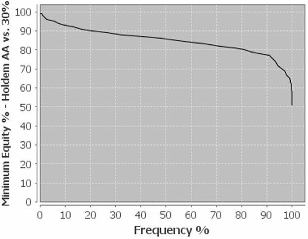
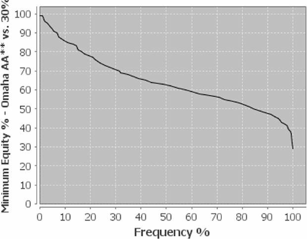

### 牌面结构

成为更强大的 PLO 玩家的关键之一，无疑是深刻理解不同的牌面结构。需要考虑的因素有很多。其中至关重要的是要理解，在 PLO 中，游戏基本上从翻牌圈开始。虽然在德州扑克中，你的强牌通常在大多数翻牌圈仍然是热门牌，但 PLO 中的权益变化很大。让我们从一个简单的例子开始。你拿到 A-A，并且你的对手是一个 30% 的范围。我们将比较德州扑克和奥马哈的翻牌前权益和翻牌圈的权益分布。

最小权益百分比 - 德州扑克 A-A vs 30%

最小权益百分比 - 奥马哈 A-A-x-x vs 30%

在德州扑克中，A-A 对抗 30% 的范围中拥有 85.99% 的翻牌前权益，而且这个比例在翻牌圈变化不大。你的 A-A 在 80% 的翻牌圈仍然拥有超过 80% 的权益，在 90% 的翻牌圈拥有约 77% 的权益。因此，翻牌圈不会影响你的牌局策略。

奥马哈的情况则截然不同。权益差距很小，你的 A-A-x-x 对抗 30% 的范围中仅有 65.77% 的优势。此外，这种较小的优势不像德州扑克那样在翻牌圈保留。正如你在图表中所看到的，你的翻牌前权益仅在 40% 的翻牌中保留。在一半的翻牌圈，你的权益约为 63%。虽然翻牌圈大约有 84% 的概率会抛硬币，但这并不像德州扑克那样有利。通常情况下，翻牌圈会极大地改变你的权益，你必须适应这一点。

这个例子表明，翻牌后的打法在奥马哈游戏中比在德州扑克中重要得多。了解各种牌面结构的特点至关重要，不仅对于 A-A，对于所有牌型都至关重要。下面我们将提供一些工具来识别各种牌面结构的结构和特点。稍后我们将通过几个例子来说明其战略意义。

**牌面统计数据**

在我们继续对各种翻牌进行分类之前，让我们先来看一些统计数据。

**牌面结构：概率**

- 单调牌 5.2%
- 双色牌 55.11%
- 彩虹牌 39.68%
- 对子 17.29%
- 顺子可能 8.48%

最常见的是双色牌面，出现概率约为 55%。超过一半的翻牌面都可能出现同花听牌。其次是彩虹牌面，出现概率接近 40%。单调的同花色牌面非常罕见，仅占 5%。因此，持有同花的起手牌非常重要，因为大多数牌面 (约 60%) 都可能击中同花或同花听牌。接下来，我们将更深入地探讨各种牌面结构的定义，并讨论应对这些牌面的策略。

### 如何评估牌面结构

你肯定熟悉干燥牌和湿润牌的概念。干牌面几乎没有或完全没有顺子或同花听牌的可能性，湿牌面则相反。湿润度是指牌面可能顺子或同花听牌的程度。需要考虑两个方面：同花听牌的同花性和顺子听牌的连接性。

你还必须考虑牌面的等级。有高牌或低牌吗？牌面里有 A 或百老汇牌吗？这在讨论翻牌动态时尤为重要。但首先，让我们逐步分析一下同花性、连接性和等级这三个类别，从最容易处理的开始：同花。

**同花性**

在看翻牌时，同花是一个显而易见的考虑因素。同花性分为三种：单调、双色和彩虹。然而，当我们讨论湿翻牌面的同花时，我们几乎总是指双色翻牌面。彩虹翻牌面上没有同花听牌。单调翻牌面上也没有同花听牌，有同花成牌，但没有同花听牌。

如果翻牌上有两张同色的牌，你可以认为这是同花翻牌，因为有可能出现同花听牌。正如我们上面所看到的，双色翻牌是最有可能出现的，大约占 55%。虽然双色翻牌面由于有可能出现同花听牌也可以被认为是湿翻牌，但还有一个更重要的因素：连接性。

**连接性**

连接性是指公共牌面产生顺子听牌的可能性。像 10-8-5 或 Q-J-7 这样的连接性公共牌面比 K-8-2 更容易产生顺子听牌。虽然德州扑克和奥马哈的翻牌面看起来相似，但奥马哈的公共牌面 (包含四张底牌) 的湿润度动态与德州扑克有所不同。让我们比较一下翻牌连接性的类别，以及它们如何影响奥马哈在转牌圈产生顺子的可能性。

奥马哈的所有非顺子翻牌面都属于五类之一，分别对应转牌圈至少出现一个顺子的概率为 0%、25%、33%、41% 或 49%。

**0% 连接性**

只有四种公共牌面不可能在转牌圈出现顺子。它们是 K-8-3、K-8-2、K-7-2 和 Q-7-2。其他所有公共牌面都可能在转牌圈至少出现一个顺子。直觉上，你可能也会认为像 K-7-3 或 K-9-3 这样的公共牌面是干牌，但其实并非如此，因为它们可能在转牌圈至少出现一个顺子。记住，即使是像经典的 A-7-2-r 这样看似干的公共牌面，也可能在转牌圈出现顺子。如果公共牌面出现 A，那么转牌圈总有可能出现顺子。

**25% 连接性**

这类公共牌面有几个，其中一些转牌圈出现顺子的概率略低于 25%。一般来说，所有带有三张缺口牌和一张悬垂牌的翻牌面都属于这类公共牌面。K-9-2、Q-8-3 和 J-7-2 都是可能在转牌圈 (即击中一张缺口牌) 出现各种顺子的公共牌面。例如，在 Q-8-3 上，每张 J、10 或 9 都会组成一个顺子。每个公共牌面都有恰好三个卡顺听牌。

**33% 连接性**

33% 连接性牌型包括翻牌圈中存在两张缺口牌和悬垂牌的牌型，例如 K-10-5、Q-9-4 和 10-7-2。在 K-10-5 牌型中，每张 A、Q、J 或 9 都能组成顺子。这类牌型有很多。我们来看一下其他一些牌型：K-7-4、K-8-5、Q-7-4、10-7-2 以及更多具有相同结构的牌型。你也可以说，33% 连接性牌型由所有可能一个两头顺听牌和四个卡顺听牌的翻牌组成。在 K-10-5 牌型中，Q-J 是两头顺听牌，A-Q、A-J、Q-9 和 J-9 是卡顺听牌。

**41% 连接性**

在 41% 连接性类别中，我们有一些公共牌，例如 K-6-4、Q-7-5、J-5-3 和 8-4-2。你之前看到过，随着缺口牌张数减少，转牌圈形成顺子的概率会增加。例如，三张缺口牌张数属于 25%，两张缺口牌张数属于 33%。这里我们看到，所有带有一张缺口牌和悬垂牌的翻牌圈都属于 41% 连接性类别。

但另一种类型的翻牌圈也拥有同样的连接性，例如 K-J-8、Q-J-2 等翻牌圈。很难简洁地描述这些牌型。它们大多没有像 10、9、8 或 7 这样的共用中间牌，在这种情况下，它们只能在一端形成顺子。有些翻牌圈允许两个两头顺子听牌和五个卡顺听牌。例如，在 K-6-4上，你用 7-5 和 5-3 来组成两头顺子听牌，用 8-7、8-5、7-3、5-2 和 3-2 来组成卡顺听牌。

**49% 连接性**

可以想象，那些以某种方式连接且没有悬垂牌的公共牌构成了连接性最高的翻牌类别。这些牌包括 K-10-6、Q-8-7、9-5-2 等等。所有连接性最低的公共牌，至少有两张三缺口牌、一张三缺口牌和一张两缺口牌、两张两缺口牌或一张一缺口牌和一张两缺口牌，都属于 49% 连接性类别。

还有另一类牌，其成员与 41% 连接性类别中的一些牌型相似。这些牌型有两张连接牌和一张悬垂牌，而连接牌由两张中间牌组成。这些牌型包括 J-10-2、10-9-2、9-8-3、8-7-2 和 7-6-2，以及像 A-7-6、K-8-7 和 Q-6-5 这样的公共牌。这些牌型在 49% 的情况下可能有顺子。就可能的牌型组合而言，你可以说这些公共牌型主要由三种类型组成：允许六个卡顺听牌、一个两头顺听牌和七个卡顺听牌，或者三个两头顺听牌和六个卡顺听牌。

像 A-K-2 这样的公共牌允许六个卡顺听牌：Q-J、Q-10、J-10、5-4、5-3 和 4-3。

如果你看 A-10-7，9-8 可以作为两头顺听牌，而 K-Q、K-J、Q-J、J-9、J-8、9-6 和 8-6 可以作为七个卡顺听牌。

最后，还有像 A-10-9 这样的公共牌面，允许三个两头顺听牌和六个卡顺：Q-J、J-8、8-7 是两头顺听牌，而 K-Q、K-J、Q-8、J-7、8-6 和 7-6 是卡顺听牌。

当然，所有这些组合在游戏中的概率各不相同，玩法也各有不同。尤其是傻瓜端组合，虽然不像坚果端组合那样经常出现，但它们确实存在。稍后我们将讨论公共牌结构如何影响你的游戏计划。目前，我们了解到了以下五类连接性。

这些类别对许多翻牌后局面有着显著的影响。它们决定了你愿意积极地玩哪些牌。

**等级**

除了同花性和连接性之外，还有一个因素需要考虑：等级。公共牌是高牌还是低牌？考虑这一点主要有两个原因。首先，在高牌公共牌上，转牌圈的权益转移较少。如果你观察像 A-K-7 这样的公共牌，你会发现权益转移并不多。像 A-K-x-x 这样的好成手牌不可能被更好的两对赢，只能被暗三条和听牌击败。

另一方面，在 9-7-2 这样的公共牌上，顶两对不仅容易受到更多顺子听牌的攻击，还容易受到所有对子和高牌的组合的攻击，如果转牌圈出现 2 成对子，甚至容易受到超对的攻击。

但这并不是唯一的问题。由于你的对手会更多地玩高牌而不是低牌，你还必须考虑手牌范围与翻牌圈的互动。这就引出了公共牌的轻重。

**重轻**

重牌面意味着牌面结构与对手翻牌前范围的匹配度更高。由于玩家天生倾向于百老汇牌，因此高牌面比低牌面更重。轻牌面与翻牌前范围的匹配度较低。例如，7-5-2 就是一个非常轻的牌面。玩家不常玩小口袋对子，即使是小顺子也不常见，只占合理开池或 3-bet 范围的一小部分。

由于重牌面与翻牌前范围的互动性更强，因此在重牌面击中翻牌圈顶两对和暗三条的概率远高于在轻牌面中。大多数玩家玩小对子的频率不如玩高对子的频率高。以下是一些轻牌和重牌面的例子：

重牌：A-K-2、A-10-9、K-Q-5、Q-J-7、J-10-9

轻牌：9-7-4、8-5-3、6-5-4

你已经学习了几种分类翻牌的方法，但我们还没有探讨它们的战略意义。在提供战略建议之前，我们需要一个非常重要的概念。那就是翻牌的动态，我们将所有因素综合起来。

鉴于我们获得扑克知识是为了指导我们制定胜局策略，让我们继续我们的探讨。我们了解到，翻牌可以根据湿润度 (同花性、连接性) 和等级 (尤其是重牌和轻牌) 进行分类，但所有这些因素的结合点在于动态。

我们稍后将运用这些概念来制定一个均衡、难以被利用的游戏计划。

**动态**

动态指的是下一张公共牌改变当前坚果牌的概率。动态公共牌面可能会受到大量改变坚果牌的牌的影响。而静态公共牌面则很少甚至完全不受此类牌的影响。

乍一看，你可能会认为这个概念与 “湿润度” 和 “干燥度” 相同。实际上，它更进一步。“湿润度” 和 “干燥度” 指的是公共牌的结构，而动态还会考虑玩家的底牌以及他们想要运用的策略。这两者完全不同。

动态定义了你在整体游戏计划中，如何在不同的公共牌面上玩不同类型的牌。例如，如果你在一个非常静态且干燥的公共牌面上持有顶暗三条，可以采用更具创造性的打法路线。因为你不太可能被反超。因此，为了平衡你的范围，你甚至可以考虑用非常强的牌过牌，或者干脆跟注加注。在非常湿润的公共牌面上，你可能需要更多地保护你的牌，因此慢玩可能不是最佳选择。

你还必须了解对手在各种牌面结构下可能想要采取行动的牌型。在范围两极化的干燥静态牌面加注通常意味着一手强成手牌或诈唬牌，而在湿润牌面加注则意味着很多成手牌和半诈唬牌。

回到我们最初的讨论，湿润度和等级定义了牌面结构，而动态则决定了你根据整体游戏计划在不同牌面使用范围的策略。

我们将根据翻牌圈结构的湿润度 (同花性、连接性) 和等级 (重轻) 对翻牌圈结构进行分类，然后讨论相关的动态。让我们通过一些例子来解释这个概念。牌面有两种类型——静态和动态——我们可以根据强弱度将它们划分为不同的子类别。

我们将讨论以下牌面结构。

静态：重 / 干、轻 / 干、成对、单调
动态：重 / 湿、轻 / 湿

### 牌面的分类

**静态牌面**

静态牌面种类繁多，从重 / 干牌面到对子牌面和单调牌面，后者通常被称为 “锁定牌面”。它们都具有静态牌面的主要特征：当前的坚果牌很少被反超，而且在转牌圈，权益变化也很少。当然，所有静态牌面也都是 “干燥牌面”。我们将从重 / 干牌面和轻 / 干牌面开始，然后再讨论所谓的 “锁定牌面”。

**重 / 干牌面**

我们以 A-K-7-r 为例，说明重 / 干牌面。我们上面看到，在这种牌面中，很少有转牌能够改变成手牌或当前坚果牌的权益。因此，这些翻牌面中的坚果牌 (顶暗三条) 拥有很高的权益，只有一张百老汇牌 (Q、J 或 10) 才能在转牌圈改变坚果牌的权益。这并不意味着你应该慢玩这些牌面，因为你的对手可以用他的范围在转牌圈获得大量权益，而你当然希望保持平衡的持续下注频率。

由于很少有权益转移的转牌，成手牌通常拥有大量权益，而且相当强。在重 / 干牌面，范围两极分化非常严重。如果你在这些牌面面对行动，通常是来自另一手成手牌或诈唬。由于没有真正强的听牌，这些牌面几乎没有半诈唬。所以，如果你在 A-K-7-r 上面对一个过牌 - 加注，你可以假设你的对手不会用 A-7-x-x 或 K-7-x-x 加注。在大多数情况下，甚至没有人会用 A-K-x-x 裸牌加注。这毫无意义，因为你要么遥遥领先，要么遥遥落后。在重 / 干牌面，游戏通常更倾向于摊牌，像顶对这样的中等强度牌往往更频繁地摊牌。

要注意，重 / 干的牌面通常会更符合翻牌前激进玩家的范围，因此他往往倾向于在这些牌面持续下注。他之所以会这样做，是因为从风险回报的角度来看，用弱牌攻击这些牌面结构非常冒险。例如，如果你在 A-K-7 牌面持有 A-Q-7-x，你更有可能倾向于摊牌，因为你已经被一些在紧开池范围中占主导地位的牌 (A-A、A-K、K-K) 彻底击败，这使得你很难继续对抗对手的行动。

然而，公共牌的结构可能会在转牌圈发生变化，尤其是在河牌圈，可能会带来很多意外。让我们来看看一些与 A-K-7 翻牌圈相关的数据。

**A-K-7 彩虹**

- 转牌圈顺子概率：24.42%
- 转牌圈同花概率：0
- 河牌圈顺子概率：63.82%
- 河牌圈同花概率：16.82%

你可能会惊讶于河牌圈可能出现的顺子数量之多。河牌圈出现同花的概率要低得多，但不应忽视。

最后，我们来做一个简短的概述。

**重 / 干牌面的特征**

- 坚果牌拥有很高的权益
- 成手牌在这些牌面拥有很高的权益
- 很少有听牌或半诈唬牌
- 范围两极分化
- 很少有转移权益的转牌

**轻 / 干**

轻 / 干牌面的一个例子是 9-4-2-r。与重牌面相比，轻牌面更容易受到更多改变坚果牌面的转牌的影响。除了出现 A、3、5 或 6 (这些牌面中的任何一张都可能组成顺子) 的概率外，每张高牌都可能组成更大的暗三条或更好的两对。在接下来出现的 13 种可能的等级中，A、K、Q、J、10、6、5、3 和 2 都可能在转牌圈改变坚果牌面。如果你观察像 8 和 7 这样的牌，它们不会改变坚果牌面，但它们可以带来巨大的权益变化，让转牌圈的包牌 + 一对牌带来巨大的权益。这看起来根本不像是一个干牌面。这时，轻牌面就派上用场了。轻牌面的概念可以帮助你更好地评估这些牌面并制定合适的策略。

如果你面对一个紧的开池范围，那么只有一小部分会击中翻牌圈。当然，有很多超对，一些三条 9，但中三条或底三条很少出现在对手的开叫范围中。此外，几乎没有顺子听牌或包牌，因为紧的开叫范围很少包含 6-5-4-3。偶尔会有像 A-A-3-5 和 K-K-3-5 这样的翻牌强势击中对手的牌，但对手范围的大部分包括超对和带有高牌的顶对 (K-Q-J-9、A-K-J-9、Q-J-10-9)。在轻 / 干公共牌面，范围会合并。

以下是 9-4-2 彩虹公共牌面的一些数据。

- 转牌圈拿到顺子的概率：32.72%
- 转牌圈拿到同花的概率：0
- 河牌圈拿到顺子的概率：71.49%
- 河牌圈拿到同花的概率：16.8%

由于两对组合或强听牌很少，超对在轻 / 干的公共牌面上可以获得很大的价值。由于转牌圈有很多可以转移权益的牌，你的成手牌，尤其是超对，在这些公共牌面上需要认真保护。A-A-x-x 对抗像 Q-J-10-9 这样的顶对牌有 64% 的优势。

**轻 / 干牌面的特征**

- 真正强的成手牌 (例如暗三条) 很少
- 超对仍然拥有很高的权益
- 适合 A-A 和 K-K 的牌面
- 权益接近由于即将出现许多改变牌面的牌
- 范围由许多中等强度的成手牌和听牌组成

**对子牌面**

大约 18% 的翻牌是对子。这足以让我们认真思考如何应对这种特殊类型的牌面。几年前，玩对子牌面并不难。诈唬的现象较少，大多数玩家只会在顶葫芦牌上发挥创意，而更多时候玩三条甚至底葫芦牌来打摊牌。每个人都害怕坚果牌。不害怕坚果牌或许是个错误，但近年来，牌局动态发生了显著变化。

对子牌面总是会形成两极化的范围。许多玩家经常攻击这些牌面，尤其是在 3-bet 底池中。在对子牌面用超对面对对手的行动会非常尴尬，因为你要么遥遥领先于诈唬，要么遥遥落后于成手牌。与动态牌面不同，在动态牌面，你的大多数决策都基于权益，而对子牌面的决策则基于特定对手的攻击频率。你必须仔细观察对手攻击这些牌面的频率，以及他们用什么牌。他们会用顺子听牌和同花听牌攻击对子牌面吗？他们会用超对加注吗？还是他们只是放弃得太少了？

在深入探讨战略方法之前，让我们先来看看与对子牌面相关的一些概率。首先考虑对子牌面的重量。你的对手的范围击中三条的可能性大吗？例如，如果你面对一个紧手对手，他击中包含小对子的牌面的可能性就不大。让我们考虑一下一些标准范围在对子牌面击中三条的可能性。

一些标准范围击中三条的概率

| 范围 vs 牌面 | 5% | 10% | 15% | 20% | 25% |
| --- | --- | --- | --- | --- | --- |
| A-A-2 | 27.63 | 31.57 | 32.45 | 33.13 | 31.6 |
| K-K-2 | 14.97 | 18.99 | 21.5 | 21.01 | 19.75 |
| Q-Q-2 | 10.81 | 14.8 | 16.35 | 16.37 | 16.61 |
| J-J-2 | 11.56 | 13.91 | 15.61 | 16.57 | 16.23 |
| 10-10-2 | 11.95 | 16.02 | 17.35 | 17.78 | 18.07 |
| 9-9-2 | 8.91 | 11.83 | 12.11 | 12.4 | 12.84 |
| 8-8-2 | 7.99 | 10.01 | 11.59 | 13.07 | 13.47 |
| 7-7-2 | 7.32 | 8.62 | 9.9 | 11.67 | 12.99 |
| 6-6-2 | 6.52 | 6.55 | 7.73 | 8.98 | 9.94 |
| 5-5-2 | 6.39 | 6.89 | 7.61 | 9.28 | 10.17 |
| 4-4-2 | 5.72 | 5.77 | 6.16 | 6.91 | 7.65 |
| 3-3-2 | 5.08 | 4.76 | 4.87 | 4.95 | 5.33 |
| 4-2-2 | 5.05 | 4.17 | 4.2 | 4 | 4.13 |

| 范围 vs 牌面 | 30% | 40% | 50% | 80% | 100% |
| --- | --- | --- | --- | --- | --- |
| A-A-2 | 28.97 | 25.17 | 21.88 | 15.2 | 12.49 |
| K-K-2 | 19.02 | 17.81 | 16.57 | 14.16 | 12.45 |
| Q-Q-2 | 16.72 | 16.43 | 15.8 | 13.96 | 12.49 |
| J-J-2 | 16.07 | 16.1 | 15.95 | 14.1 | 12.43 |
| 10-10-2 | 17.87 | 16.89 | 16.96 | 14.58 | 12.57 |
| 9-9-2 | 13.45 | 13.8 | 13.73 | 13.86 | 12.5 |
| 8-8-2 | 13.71 | 13.07 | 13.88 | 13.25 | 12.43 |
| 7-7-2 | 14.12 | 13.83 | 14.79 | 13.84 | 12.48 |
| 6-6-2 | 11.85 | 13.87 | 14.95 | 14.29 | 12.42 |
| 5-5-2 | 10.53 | 11.95 | 14.05 | 14.47 | 12.53 |
| 4-4-2 | 7.97 | 9.34 | 10.55 | 13.14 | 12.5 |
| 3-3-2 | 5.81 | 4.76 | 7.48 | 11.86 | 12.58 |
| 4-2-2 | 4.11 | 4.63 | 5.3 | 8.54 | 12.57 |

我们可以从这张表格中得出一些有趣的结论。让我们从 100% 的范围开始。所有的概率都在 12.5% 左右。偏差源于我们进行的试验次数有限 (600,000 次)，但理想情况下，随机牌型击中三条的概率为 12.5%。

常识或许会告诉我们，随着范围变窄，概率会变得更加两极化，也就是说，在大对子公共牌面，三条的概率会增多，而在小对子公共牌面，三条的概率会减少。事实上，从 100% 到 20% 的范围，这种趋势一直存在。之后，概率又开始趋于一致。造成这种情况的原因有很多，首先是 175 个非常窄的范围包含大量大对子，从而降低了击中三条的概率。但更窄的范围在百老汇公共牌面比在小牌公共牌面更有可能击中三条，这是事实。

同样，如果你的对手范围合理，那么在 2-2-x、3-3-x 和 4-4-x 上，超对也相当强。只有非常松的范围才会包含很多小牌可能在这些公共牌面组成三条。

如果你拿着 A-A，那么百老汇对子公共牌面就没什么优势了，因为所有范围都包含凑成三条的合理概率，但你的范围也包含三条。因此，你可能会进行大量的诈唬和反诈唬。记住，在干燥公共牌面，决策更多地基于频率而不是权益，因此你必须详细记录对手的倾向。

双色公共牌面是一个特殊情况。虽然在对子公共牌面听牌时通常应该小心谨慎，但也有一些例外。在 3-bet 或 4-bet 的底池中，你的同花听牌几乎总是有足够的权益在对子公共牌面下注。例如，像 A♥️-7♥️-x-x 这样的牌在 5♥️-2♠️-2♥️ 上对抗 A-A-x-x 时，几乎有 45% 的权益。然而，在 K♥️-Q♥️-Q♦️ 上，你可能已经听死牌了。因此，仔细研究对手的倾向并准确了解他在这类牌面上的频率非常重要。

**总结**

- 对子牌面会导致范围两极分化，以及遥遥领先 / 遥遥落后的局面
- 权益变化很少
- 决策取决于对手的倾向
- 紧范围击中小对子的概率小于松范围
- 百老汇对子更有可能击中紧范围

**单调牌面**

与德州扑克不同，在 PLO 中，单调牌面非常稳定，因为你必须用两张底牌才能组成同花。这意味着在单调牌面上根本没有同花听牌：同花或非同花——这是一个问题。很少有能改变权益的牌，因为只有牌面对子才能改变当前的坚果牌 (某人改进成同花顺的概率非常小)。以下是一些单调牌面上出现次数不多的数据。

**单调牌面的概率**

- 单调翻牌圈 5.18%
- 单调转牌圈 1.06%
- 单调河牌圈 0.2%
- 转牌圈出现对子 18.37%
- 河牌圈出现对子 38.71%

正如你所见，单调牌面在 PLO 中非常罕见，但仍然需要正确的策略。由于同花牌面非常稳定，它们与对子牌面具有相同的特征，并且经常受到攻击。首先，持续下注和诈唬加注的概率很高。记住，一个 20% 的紧范围在翻牌圈击中同花的概率只有 22.37%，但由于你希望对手持续下注的频率很高，所以你的对手可能会跟注，甚至轻度加注。只有三种类型的牌会攻击单调牌面：同花、暗三条和诈唬牌，通常会与坚果同花阻挡牌结合使用。

同样，静态公共牌面上的决策是基于频率而非权益驱动的，因此你必须详细记录对手的反应模式：他们如何处理同花成牌、坚果同花、小花同花甚至顺子听牌和两对牌型。他们是否频繁诈唬？面对反诈唬和迷你加注时如何应对？是否会做阻挡下注？会在几条街持续下注？他们的诈唬会持续到转牌和河牌，还是开一枪就放弃？他们会用同花牌在翻牌或转牌过牌来诱导诈唬吗？过牌示弱时用的是弱同花还是强同花？

如上所述，翻牌圈击中同花的概率并不高，因此通常情况下没有人拿到同花。但很少有牌能与可能下注的同花牌竞争，因为它们缺乏权益。即使是暗三条，在单调牌面上也非常难打。虽然它们也有不错的权益，但仍然远远落后于同花，而且没有真正的隐含赔率，因为你唯一能赢同花的机会是当牌面出现对子时，你会拿到葫芦，并使对手同花牌放慢节奏。

如果你在翻牌圈击中了你的坚果同花，你肯定不希望在转牌圈或河牌圈看到牌面出现对子，因为对手可能借此组成葫芦反超你的坚果牌。同样，你必须关注对手的频率。他在单调牌面上有多少次会用两对或暗三条进行跟注？又有多大概率拿着较弱同花牌时，会试图诈唬迫使你放弃更大的同花？想要在同花牌面剥削对手，就必须充分依赖你积累的对手笔记。

让我们回顾一下。

**单调牌面的特征**

- 翻牌圈同花很少
- 持续下注频率高
- 大量诈唬 (翻牌圈诈唬加注、(坚果) 阻挡牌)
- 决策取决于玩家的倾向
- 范围两极分化

**动态牌面**

与静态牌面相比，动态牌面的转牌圈和河牌圈的权益会频繁变化。成手牌在这些牌面会失去价值，听牌才是真正的强牌。强的包牌和同花听牌甚至可能比顶三条更有优势。顺子——甚至是坚果顺子——不带再听牌的牌非常脆弱，面对三条 + 同花听牌时，权益可能非常低。在进一步分析这些牌的强弱之前，我们先来看一下动态牌面的一些常见权益。具体来说，我们将分析 K♦️-Q♣️-2♦️-2♣️ 在 J♥️-10♥️-9♠️ 的翻牌面。

翻牌圈看起来对你的牌很有利，让你拿到了坚果顺子。但你仍然应该非常小心。面对紧手对手，快速玩这种牌型可能是一个巨大的错误，因为有些牌的权益更高。J-J-xh-xh 拿到了顶三条和同花听牌，面对当前牌面的坚果牌，权益高达 63%。即使是像 A♥️-3♥️-3-3 这样同花听牌带废牌，也有 38% 的权益。同花听牌带有额外权益像两对这样的牌则非常强。例如，10-9-8-7 带红桃听牌是热门牌型，它对抗没有再听牌的当前坚果顺子的权益几乎达到 52%。

尤其是在多人底池中，裸坚果顺子是一手非常弱的牌。想象一下，你在一个多人底池中，另外两位玩家全下。一位玩家拿着暗三，另一位玩家拿着坚果同花听牌，你的权益会降到只有 31.73%。

这体现了在动态公共牌面再听牌的重要性。成手牌只有在一些附带再听牌的情况下，在动态公共牌面才真正强。

**重 / 湿**

重 / 湿公共牌面的例子有双色牌面 J-10-6 或 A-10-9 。你的顶两对或顶暗三基本上只是在对抗强听牌时平手。因此，你希望通过卡顺听牌、顺子听牌或同花听牌获得一些额外的权益。让我们更仔细地看看 A♥️-10♥️-9♠️ 的公共牌面。

- 转牌圈出现顺子的概率：48.92%
- 转牌圈出现同花的概率：22.35%
- 河牌圈出现顺子的概率：82.65%
- 河牌圈出现同花的概率：45.76%

这些数据表明了这种公共牌结构实际上有多么 “湿”。河牌圈出现顺子的概率接近 83%，出现同花的概率约为 46%。对于一手干燥的顶三条来说，这可不是什么好消息，而且它会极大地影响玩家对顶三条的看法和游戏方式。

为简单起见，我们假设顶三条由随机牌组成，并且 K-Q-J-10 为包牌。正如你在下表中所看到的，干 A-A-x-x 在面对包牌加同花听牌时处于劣势。

公共牌：A-10♥️-9♥️

| 牌型 | 权益 |
| --- | --- |
| A-A-x-x | 46.99 % |
| K-Q-J-10:hh | 53.01 % |

拥有同花听牌和顶三条，可以显著提升这手牌对抗包牌的价值。

公共牌：A-10♥️-9♥️

| 牌型 | 胜率 |
| --- | --- |
| A-A-x-x:hh | 71.63 % |
| K-Q-J-10 | 28.37 % |

在强 / 湿公共牌面上，还有另一个需要考虑的重要因素：坚果性。众所周知，在 PLO 游戏中，你不应该只拥有强听牌，而应该拥有坚果听牌。尤其是在多人游戏中，这一点非常重要。你肯定不想被比自己更好的听牌免费反超。以上面的翻牌 A-10-9 为例，假设你拿着 8-7-6-5 和同花听牌。这看起来是个很强的听牌，但如果你用它对抗几个对手，你很可能只是听死牌了，因为有很多强牌、成手牌和更高的听牌可以碾压你。在讨论轻 / 湿牌面之前，让我们先回顾一下重 / 湿牌面的特征。

重 / 湿牌面的特征

- 当前坚果牌的权益低于干牌面
- 成手牌会失去价值
- 很多听牌的权益甚至可能高于翻牌圈的裸坚果牌
- 听牌和半诈唬牌会产生很多行动
- 权益非常接近
- 最强的牌是大组合听牌和带有再听牌的成手牌
- 坚果性非常重要

**轻 / 湿**

轻 / 湿翻牌面是我们评估的最后一类翻牌面。与轻 / 干翻牌面类似，这类翻牌面很少击中翻牌前的范围，但在 7-6-2 双色翻牌面上，至少有相当数量的同花听牌，这使得这类翻牌面非常活跃。这类翻牌面中有一些暗三条组合或强牌、成牌，即使是顶暗三条，面对各种牌型也并非大热门。这类翻牌面中会出现相当数量的对子加听牌，从带对子的包牌到带顺子听牌的对子，甚至超对加同花听牌，面对所有成牌都有相当好的权益。

这类翻牌面保证了玩家的积极性，因为权益非常接近，成牌和半诈唬会在翻牌圈引发大量行动。轻 / 湿翻牌面的范围比较复杂。尤其是在多人玩牌的情况下，你应该时刻注意坚果牌和坚果听牌，而在单挑底池中，你可以稍微轻的全下。

轻 / 湿翻牌面的特征

- 坚果牌的权益低于干翻牌面
- 强牌和成手牌很少
- 听牌和半诈唬牌会产生大量行动
- 权益非常接近
- 最强的牌是听牌和带有再听牌的成手牌
- 坚果性非常重要

### 翻牌后策略

**总体思路**

扑克玩家最重要的武器是知道何时下注、何时过牌。你总是有几种下注选择。你可以过牌、跟注、弃牌或加注，这取决于其他玩家的行动。请注意，你范围中的部分牌与这些选择相对应。你会弃牌一部分，跟注一部分，加注一部分，以及用范围中的一部分下注。

首先，你需要有一个计划，至少在翻牌圈，决定你想如何玩你的牌。你不应该只考虑当前街上的某个行动，要计划好你的牌，直到河牌圈。如果你下注却不知道被加注时该怎么做，或者不知道下一轮该怎么玩，那就太不合理了。这基本上就是在浪费钱。关键在于你的游戏计划。事实上，你不仅应该关注你的牌在特定公共牌面的表现，还应该关注如何运用你的整个范围。

如果你用 A-A 做 4-bet，翻牌是 8-7-6，而你的踢脚牌恰好是 10-9，那么你可能仍然想像玩其他所有 A-A-x-x 牌一样玩这手牌。不把范围中的大部分牌都用来代表强牌，会给你当前的牌增加很多欺骗性。在像 8-7-6 这样的翻牌圈，几乎所有玩家都会不顾手牌情况，试图让你弃掉超对。因此，立即下注来暴露你的牌力将是一个很大的错误，因为没有玩家会在低牌面用干超对持续下注。在这种情况下，你几乎只希望有一个大的过牌范围和一个小的或不存在的下注范围。

永远不要在与你范围大部分牌面不符的牌面结构上与聪明的对手下注，因为他们会很好地对抗你的范围。只有偏离你平衡的策略，对那些只看牌的弱手进行剥削性打法时，你才应该这样做。但是，在与更强的玩家对抗时，平衡你的打法至关重要，这样才能确保你在所有牌面结构上的下注模式都无法被剥削利用。

本书，尤其是在游戏计划章节中，我们始终强调平衡范围的重要性。如果你的对手察觉到你游戏计划中的漏洞，比如你只用强牌下注，用弱牌过牌，那么在如今的游戏中，你将被彻底击败，因为即使是水平平平的对手也能很快察觉到这一点，并诈唬你赢走很多底池。构建平衡范围的关键在于思考你的范围及其在各种牌面结构上的表现，包括你自己的范围以及对手的范围。评估牌面结构并考虑整个范围的可玩性，而不是你特定牌面在特定情况下的可玩性，这一点至关重要。如果你无法判断哪些牌面对你的范围有利，哪些牌面对对手不利，哪些牌面是动态的，哪些牌面是静态的，你就无法制定合理的游戏计划。

**不同牌面结构下的下注策略**

一个稳健的翻牌后游戏计划要求你在对你有利、对对手不利的牌面，无论是强牌还是听牌，甚至是相当多的边缘牌，都要增加下注频率。为此，你必须了解不同牌面结构的特点，然后仔细考虑你的范围与牌面的互动，以确定最有利可图的翻牌后下注路线。虽然这是一个非常棘手且复杂的话题，但也有一些经验法则。以下讨论主要适用于翻牌后的单挑底池。在多人底池中，同样的原则也适用，但你必须用范围中更小的一部分进行诈唬和价值下注。在多人底池中，你必须更加谨慎地玩你的实际牌，因为很有可能至少有一位对手很好的击中翻牌。诈唬在大多数情况下不会成功，只有在特定场合才会成功。不过，你可以将以下原则应用于多人底池。

我们将分析上一章讨论过的牌面结构，并根据其动态将其分为四类，并制定合理的下注策略。这些类别包括：

- 非常动态
- 动态
- 静态
- 非常静态

在 A-J-9-ss、K-10-8-ss、Q-J-7-ss 或 J-10-6-ss 等动态翻牌面，尤其是对手的所有范围都击中翻牌时，你必须减少持续下注，但下注时要下大注，以保护你的牌免受众多改变权益的转牌的影响。合理的持续下注频率是 55%-70%，你应该下注接近底池。

在这些动态翻牌面中，你的权益是决定因素，因为对手所有范围都击中翻牌，而且没有完全用垃圾牌诈唬的牌。如果有人在这些翻牌面采取行动，那么通常是一手非常强的成手牌、半诈唬牌或带有再听牌的阻挡牌。在这些翻牌面中没有纯粹的诈唬牌。

关于你在这些翻牌面的策略，有一些安全的策略可以采取。如果你什么都没击中，也就是说你甚至没有后门听牌或阻挡牌，那就过牌 - 弃牌，把你所有的垃圾牌都弃牌。下注被跟注的几率实在太高了，你得在后面的几条街上更多诈唬，而且没有任何权益能赢得底池，这绝对是 -EV。因此，你应该对所有完全错过公共牌的牌都过牌 - 弃牌。另一方面，你应该用所有非常强的牌下注，而且正如上文所述，你可以下注相当大的牌。

在这些公共牌面，问题在于如何在不利位置时建立一个合理且平衡的过牌范围，这不仅包括过牌 - 弃牌 / 过牌 - 跟注线路的牌，还包括过牌 - 加注线路的牌，因为你不能只用所有好牌下注，而用弱牌过牌 - 弃牌。为了保持平衡，你必须在你的过牌范围中包含一些强牌，尤其是在面对那些经常对你错过的持续下注进行攻击并经常缠打的激进对手时。

一个好方法是用一些弱但坚果潜力的听牌过牌 - 跟注，比如没有任何额外权益的纯坚果同花听牌。你的持续下注面对加注，在不利位置会陷入困境，难以实现你的权益。而使用过牌 - 跟注的玩法，你可以轻松地看到接下来的几条街，而不会过度膨胀底池。同时，你的过牌范围也会得到相当大的平衡，变得更强，这样激进的对手在你过牌时试图向你施压时就必须更加谨慎。

关于你的过牌 - 加注范围，最好包含一些非坚果牌，这些牌在不利位置时会很不舒服，因为你永远无法拿到坚果牌。对抗激进对手，过牌 - 加注的理想牌型是那些拥有足够权益、足以全下 100 BB 筹码的牌，比如在双色牌面的顶对和底对加上顺子听牌或同花听牌。这样，你就可以避免在转牌圈和河牌圈你持续下注时对抗那些会非常轻的跟注的对手的艰难时刻。由于转牌圈有很多不利的牌，你可以让你的牌局更轻松，甚至可能从那些在有利位置对抗持续下注时玩起来非常完美的听牌中获得更多价值。你更加平衡了你的过牌范围，也变得更难对付了。如果对手只是随后过牌，你不会错过任何价值，只需打一场两条街的游戏，这对于一手平庸的牌来说完全没问题。

这就是为什么你不想在动态牌面结构下将范围顶部 (例如顶暗三条) 纳入你的过牌 - 加注范围，在这种情况下，你想要保护你的牌并立即获得价值。此外，你还应该考虑平衡你的下注范围。如果对手决定随后过牌，这对你非常强的牌来说将是一场灾难，因为这会让平庸的牌有机会实现其权益而无需被罚注。

我们将在 “单次加注底池” 章节中深入讨论这些情况，尤其是在牌例 4、5 和 6 中。

**非常动态牌面总结**

- 在不利位置时平衡你的过牌范围是平衡游戏计划的最大问题
- 用你的强牌下注，如果完全错过翻牌就弃牌
- 过牌 - 跟注：在你的过牌范围中加入一些坚果听牌 (以实现权益)，用一对加弱听牌过牌 - 跟注
- 过牌 - 加注：在你的过牌 - 加注范围中加入一些非坚果牌 (不适合在不利位置打牌)
- 决策以权益为导向
- 作为翻牌前加注者，理想的下注频率是 55%-70%，下注接近底池大小

在动态牌面下注，例如 Q-7-5-ss、A-10-6-ss、A-J-4-ss、K-Q-7-ss、Q-7-5-ss、9-8-4-ss 或 7-5-2-ss，很可能会被跟注，所以你必须调整你的下注策略。不要频繁诈唬。持续下注的概率大约在 65%-75% 之间。当然，如果你下注，下注额应该比在静态牌面更大，这样才能保护你的强牌并从中获取价值。下注 70%-90% 的底池大小就足够了。与非常动态牌面的主要区别在于，翻牌前范围击中强牌的概率较小，这使得双方玩家手中都握有更多中等强牌。但平衡你的过牌范围在这里与动态牌面一样重要。

此外，随着牌面越来越小、越来越轻，更强的翻牌前范围会失去权益。因此，面对那些比你的开池范围更频繁击中轻牌面的非常松的范围，你应该稍微多放弃一些。另一方面，面对那些跟注范围非常紧且强，不太可能击中轻牌面的玩家，你应该更频繁地在轻牌面持续下注。但要小心。非常激进的玩家往往会在轻牌面使用很多缠打策略，因此更有可能使用动态玩法，甚至可能进行诈唬。

**动态牌面总结**

- 调整你的过牌范围，尤其是在轻牌面
- 更紧的翻牌前范围会在低牌面损失权益
- 激进的对手会频繁缠打，尤其是在轻牌面
- 过牌 - 跟注：平衡你的范围很重要
- 65%-75% 的时候下注 70%-90% 的底池
- 为了平衡，不要用范围顶部过牌
- 下注所有中等牌，因为你无法通过过牌 - 跟注获利

像 A-K-9-r、A-9-2-r、A-7-2-r、J-6-6-r、K-K-Q-r 这样的非常静态的牌面，以及顺子或单调的牌面，通常需要更高的持续下注频率。合理的持续下注频率可能是 75%-85%。这是因为这些牌面往往是遥遥领先 / 遥遥落后的局面，后续回合的权益转移较少。由于很少有牌能对抗当前的坚果牌，对手很难用平庸或边缘牌继续对抗，这使得下注对拥有翻前主动权和更强翻前范围的玩家来说很有吸引力。在这些牌面结构上，跟注范围非常缺乏弹性，因为听牌很少。你可以比在动态牌面下注更少，因为几乎没有权益变化。

在静态或锁定的公共牌面，你显然可以下注较小的金额，从底池的 50%-75% 不等。由于权益变化很少，你不必像在听牌和湿润公共牌面那样费力地保护你的牌。而且，由于你想频繁地在这些公共牌面下注，你的诈唬也会更便宜，而且效果与更大的下注相同。下注大小很大程度上取决于你的整体游戏计划。这里的数字只是指导原则，你不应该仅仅因为我们在这里写了就总是下注底池的 50%-75%。你必须找到最适合你、符合你游戏计划的下注大小。

玩家的倾向也很重要。如果你的对手经常攻击这类公共牌，你必须适应他们的风格，并找出他们攻击的牌型。他们是经常在低牌、对子公共牌面用弱牌加注吗？还是用弱三条或葫芦加注？他们会用阻挡牌、后门听牌、超对或空气牌加注吗？他们会在后续回合，甚至在位置不利的情况下，用缠打来偷取底池吗？关键在于充分了解你的对手。做好笔记，如果他在这些场合不平衡，就制定相应的反制策略。例如，如果他总是在你过牌时试图攻击，你应该用你非常强的牌进行一些价值过牌，以最大化你的 EV。但是，在这些牌面制定一个平衡的过牌 - 跟注或过牌 - 加注范围非常困难，因为这是一个遥遥领先 / 遥遥落后的局面。因此，你应该只在面对较弱的对手时使用剥削性策略。面对优秀的对手，你总是应该用你范围中的大部分牌下注，以保持平衡，并保持不被剥削。

我们将在本书末尾关于深筹码打法的章节中讨论这些牌面。

**非常静态的牌面总结**

- 范围经常错过这些牌面，而且听牌很少
- 持续下注频率较高，但比动态牌面要小
- 对手的倾向非常重要

像 A-Q-9-r、A-5-2-r、J-8-7-r、10-8-6-r、7-7-5-r 或 J-J-5-ss 这样的静态牌面，以及非常静态的牌面都需要类似的策略，但由于静态牌面的听牌更多，你被跟注的次数也更多。你应该在所有静态牌面 (大约 70%-80%) 上持续下注，并且下注额要比动态牌面小。非常合理的下注额是底池金额的 55%-80%。

如果你知道对手会跟注很多他认为很弱的小注，试图偷走底池，那么下大注或许有一定优势。更大的下注可能会诱使他弃牌，但这很大程度上取决于玩家和牌型。面对强牌玩家，你需要平衡下注尺寸，不让对手剥削利用，这意味着你应该在这些公共牌面持续下小注。

**静态牌面总结**

- 范围经常错过这些牌面，而且听牌很少
- 持续下注频率较高，但下注幅度要小于动态牌面
- 对手的倾向非常重要

### 下注策略总结

你不可能总是深入分析所有不同的牌面结构，但可以遵循一些经验法则。

在湿润且听牌较多的牌面，你不应该像在静态牌面那样频繁地持续下注。诈唬的价值较低，因为你更有可能被很多牌跟注，而这些牌不知何故会击中并继续跟注。这意味着当你下注时，你需要下注更大，从 66% 到满底池不等，以保护你的牌并从你的强听牌中获得价值。在湿润牌面，大多数决策都是基于权益的。你应该充分了解自己在标准场合对抗各种牌的权益。这并不意味着你完全不应该在这类牌面诈唬，但如果你真的要诈唬，你必须大手笔诈唬，并保持均衡的下注量。此外，单街诈唬在湿润牌面根本行不通。如果你决定诈唬，你必须计划好第二次和第三次开枪，弃掉所有在翻牌圈和转牌圈持续下注过轻、不得不在河牌圈弃牌的边缘牌。除了你的下尺寸，甚至你的翻牌后策略也必须平衡，以保持稳健的、基于博弈论的策略。

当然，这意味着你应该在强势击中你范围的牌面非常激进，而在弱势击中你的范围的牌面则更被动。你必须在与你的范围不相关的牌面使用不同的下注策略，因为你通常不想在不利于你范围的牌面下注太多。你必须更频繁地进行过牌 - 弃牌和过牌 - 加注，而不是用非常弱的范围持续下注。平衡的过牌策略是在所有可能的牌面结构上，为所有翻牌后线路制定一个非常平衡且难以利用的策略的关键。

在制定下注和翻牌后策略时，另一个需要考虑的因素是你是否处于有利位置，并牢记多人底池中的相对位置。在常规场合，制定合理且难以利用的线路至关重要。当然，在翻牌前，你可以预测自己的翻牌后位置，并且在选择翻牌前牌型时应该考虑到这一点。如果你可能处于不利位置，则尝试玩更多坚果牌，如果你预计处于有利位置，则添加非坚果牌。

在单挑底池中，作为翻牌前进攻方，你应该倾向于在翻牌圈下注，尤其是在不利位置时。当然，这取决于牌面是否击中你的范围，更具体地说，它是否击中你的牌，但通常情况下，你在不利位置下的下注要比有利位置下注略多。在奥马哈游戏中，下注 - 弃牌通常比过牌 - 跟注更好，因为用边缘牌过牌 - 跟注非常困难。尤其是面对那些只在少数强牌情况下才会加注你的持续下注的对手时，下注 - 弃牌是你用很多中等牌时应该采取的策略，因为它总体上是最 +EV 的策略。你想阻止对手实现他们的底池权益，而下注就是实现这一点的策略。即使是你认为是空气牌，面对中等牌也常常有 20%-30% 的权益，这就是你应该弃牌的原因。如果你让对手弃掉弱顺子听牌或带有后门听牌的底对，你已经取得了很大的成功。

有了位置优势，你更有可能通过在范围的某些部分之后过牌来实现你的权益。首先，你可以平衡你的过牌范围并强化它，这样你的对手就无法发现一些读牌并利用你过牌范围过弱的漏洞。你应该实现你的权益，尤其是拿着你不想看到过牌 - 加注的牌，比如有一些后门听牌潜力的弱牌。

在多人底池中，你应该玩得非常直接，因为持续下注诈唬只在非常特殊的牌面结构上有效。用强牌下注，用那些跟注后很难打到摊牌的牌过牌。有时你可以尝试一些巧妙的过牌，例如在一个 3-bet 底池中，后面有一个短筹码玩家，他们很可能下注。

在这种情况下，不时用你的强牌过牌，打算在短筹码玩家下注后过牌 - 加注，可以极大地提高你的权益。用这种方式，你可以避免转牌圈的很多棘手情况，并立即实现你的权益。这种打法的理想对象是持有坚果同花听牌的超对，或者你不想让对手看到转牌的弱暗三条。当然，你也需要平衡这些棘手的过牌，不应该总是依赖对手替你下注，但混合运用你的翻牌后打法非常重要。

如果你处于不利位置，你应该始终避免 PLO 的头号错误，那就是用边缘牌频繁过牌 - 跟注。尤其是激进的对手会让你在后面的几条街弃牌。如果你过牌 - 跟注一两条街，却在后面的牌局中弃牌，那你就浪费了不少钱。有时，最好立即弃牌，并将一些边缘牌纳入你的过牌 - 加注范围。如果你决定下注，尤其是在湿润的公共牌结构下，请提前规划你的牌局，并在转牌圈根据不同的公共牌结构坚持你的游戏计划。如果你的对手是被动玩家，倾向于用平庸的听牌进行大量跟注看牌，那么最好的玩法通常是在后续回合继续下注，如果他们在第三次开枪时弃牌很多，甚至在河牌圈下注并诈唬。另一方面，面对那些拥有非常强跟注范围的强势对手，不要过度玩牌。一如既往，你的翻牌后策略很大程度上取决于你的对手，你必须针对特定玩家制定详细的计划。尽管如此，你应该在常规场合制定清晰的游戏计划，然后根据对手的倾向进行调整。

### 下注尺度

翻牌后下注尺度是游戏中最复杂的概念之一，甚至很难笼统地讨论它，因为影响你决策的因素有很多：你的范围 / 手牌、你的对手、牌面结构、你的形象、游戏流程，甚至最近的牌局历史。

首先，你不应该只使用一种下注尺度，无论牌桌上发生什么，你都不应该使用这种尺度。无论如何，你都应该在翻牌圈和转牌圈使用不同的下注尺度。在非常干燥的牌面，你不应该像在湿润的牌面那样下注那么大，因为你不需要保护你的牌，而且诈唬时风险更小。而在湿润的牌面，你会下注更大，以保护你的牌，并放弃较弱的听牌。

下注合适的金额可以让你操纵对手的跟注范围。大额下注往往会使他的跟注范围变窄、更强，而小额下注则会使其范围变宽、更弱。

你可能会想，为什么你总是得不到回报。也许你下注过多。同样，你也可能因为在非常湿润的公共牌面下注太小而被反超。这听起来可能像一个极端的例子，但它强调了最佳下注策略的重要性。如果你下注过大，对手会弃牌很多。如果你下注过小，对手会跟注很多。面对两极化的范围，小额下注通常和大额下注效果相同，因为无论你下注多少，对手都不会在 K-K-Q-r 上跟注 8-7-6-5。如果你想在这些两极化的、遥遥领先 / 遥遥落后的公共牌面做价值下注，你应该下注得相当小，因为你的对手无法跟注大额下注。如果你决定诈唬，也要坚持这些尺度。你的价值下注和诈唬必须大小相同，才能不被利用。如果你总是做价值下注，你也需要诈唬。

从博弈论的角度来看，你的下注频率和下注尺度与对手的跟注频率和跟注范围形成了一种均衡。这意味着两者之间存在某种关系，并存在一个无差异点。当你以合适的频率和下注尺度进行价值下注和诈唬时，对手对跟注或弃牌就变得无差异。你处于完美平衡状态，他的决定对他的 EV 也无差异。

从长远来看，由于你处于完美平衡状态，他无法从你的牌局中获利。这就是平衡的游戏计划和策略的力量所在。制定这类平衡策略需要大量的时间和精力，仅仅通过理论分析是无法实现的。更好的方法是详细分析一些示例牌局，深入挖掘，找出特定场合所需的确切下注和跟注范围。由此，你可以得出一些可以在类似情况下应用的结论，并理解平衡策略的含义。我们将在 “牌局示例” 章节中针对一些标准场合进行此类分析。

在进行手牌分析之前，我们想提醒你心理学和心态的重要性。