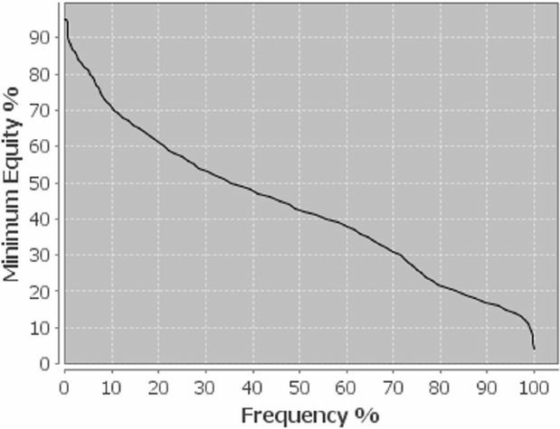
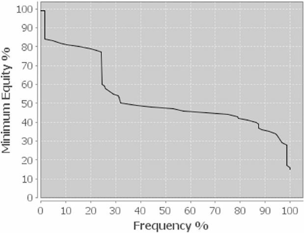

# 第十章 3-bet 底池

在决定是否在翻牌前 3-bet 时，总有一些考虑因素。在有利位置，尤其是在深筹码的情况下，3-bet 很少是错误的做法，因为对手很难通过 4-bet 或在翻牌圈激进地打法来应对。

然而，在不利位置时，你通常应该只用非常强的牌 3-bet，尤其是在深筹码的情况下。尤其要记住，你应该用坚果同花再加注，因为没有什么比把所有钱都押进去，然后被深筹码持有更大的同花听牌压制更糟糕的了。

在决定翻牌前是 3-bet 还是平滑跟注时，同花非常重要。如果你拿着坚果同花，你完全可以接受让别人跟注，从而形成一个多人底池，因为当你的筹码全押时，你会压制其他的同花听牌。大对子也适合多人底池，因为你不仅能够，而且真的想击中大三条压制小三条。另一方面，小对子或两对，例如 6-6-7-7，在单挑中表现更好，因此用他们进行 3-bet 是合理的。

隔离较弱的玩家，尤其是那些过于松散和被动的玩家，是你游戏计划的重要组成部分。如果你坐在某个开池过于松散、持续跟注 3-bet 且 4-bet 不够激进以惩罚你宽泛 3-bet 范围的玩家左边，那么你几乎处于有利位置。此外，如果他翻牌圈没有拿到两对或更好的牌，他通常会弃牌。

当然，在翻牌圈前制定稳健的计划来防御 3-bet 非常重要。如果你平衡翻牌圈跟注范围和持续下注范围，从而拥有一个受保护的转牌圈范围，避免被持续开枪，那么你将很难被对抗。

此外，你不应该在翻牌前面对紧范围的玩家时，剥削 3-bet 太轻，因为这通常会让你在翻牌后陷入困境，不知所措。

我们将在接下来的牌例中详细讲解这些内容以及更多内容。我们将探讨在翻牌前用什么牌对抗紧的、前位的加注者进行 3-bet，以及如何应对松的 BTN 开池玩家。

### 第 8 手牌 - 对抗前位开池加注的玩家，哪些牌适合 3-bet 以及如何评估牌面结构

**PLO $5-$10**

SB ($1,000)

BB ($345)

UTG ($1,654)

Hero (MP) ($1.090)

CO ($1,450)

BTN ($1,001)

Preflop：Hero 在 MP 持有 4♠️-5♦️-7♠️-9♦️

UTG 加注到 $35，Hero 再加注 $110，UTG 跟注 $85

UTG 是一位谨慎、稳健的常客玩家，他知道如何调整，也是牌桌上实力较强的玩家之一。他在 UTG 的开池加注范围约为 14%。你持有一张不错的低连牌，单挑时玩得很好，但多人游戏能力较差。众所周知，在多人底池游戏中，持有坚果同花非常重要，因为碰到更大同花的风险会增加。

面对一个紧缩的、注重位置的 UTG 开池玩家，你通常不能 3-bet 太轻，也不能太狠。他的范围太强了，他会经常为了价值跟对你 4-bet。然而，你肯定希望有一个对抗他的再加注范围。当然，这个范围包括所有强 A-A 和 K-K，尤其是那些带 A 的牌 (A♥️-K♦️-K♥️-xd)。为了平衡范围并保证良好的公共牌覆盖率，你应该在你的 3-bet 范围中加入强的双同花连牌。

在这种情况下，低连牌比百老汇老连牌 (例如 A♥️-Q♥️-J♠️-9♠️) 更适合 3-bet。高连牌不仅在多人底池中表现完美，但低连牌在面对初始加注者的 4-bet 时表现更优。此外，高连牌容易被诸如 A♣️-K♥️-Q♣️-10♥️ 这类牌型压制。

你完全可以用低连牌跟注 4-bet，但你必须弃掉高连牌。尤其是如果对手的范围包括全部 A-A、非常强的 K-K 和最强的高连牌，你的 A♥️-Q♥️-J♠️-9♠️ 就足以让你在翻牌前面对 4-bet 弃牌。

Hero 牌型和权益

A♥️-Q♥️-J♠️-9♠️ 36.66%

对手范围和权益

A-A-x-x、A-K-K-x、B-B-B-B 63.34%

仅从数字来看，翻牌前跟注绝对值得。但你应该考虑不同翻牌圈的可玩性。对手很可能每次翻牌都全押，让你放弃权益。即使你在翻牌圈击中一对面对 A-A 或 K-K 时，你的权益仍然很低，最终你会跟注过于频繁。

你可能意识到你需要跟注范围中的高连牌，因为它们即使在多人游戏中也表现良好。另一方面，你应该用低顺子做 3-bet，因为它们在单挑底池中对抗紧范围时表现完美。

现在，让我们看看不同的翻牌圈、转牌圈和河牌圈结构，并决定哪些应该下注，哪些应该随后过牌。

**你击中强牌的翻牌结构随后过牌**：

Preflop：Hero 在 MP 持有 4♠️-5♦️-7♠️-9♦️

Flop：($235) 3♣️-4♦️-6♦️ (2 人)

UTG 过牌，Hero 过牌

你翻牌圈击中了强牌。通常情况下，你在这个场合会有超过 90% 的权益，这意味着你无需保护你的牌，但你需要保护你的范围。由于牌面连接性很强，你的 3-bet 范围包括 A-A、K-K、高连牌，以及一些像 7-8-9-10 这样的牌，你显然已经错过了这个翻牌牌面结构。

这意味着你不能频繁地在这个翻牌圈持续下注。一方面，你想用 A-A 过牌然后摊牌。另一方面，你也不想在有听牌的情况下用 A-A 下注 - 弃牌。

总的来说，如果可能的话，你应该在每个翻牌圈都有一个下注范围。在这里，如果你没有同花听牌，你应该用坚果顺子下注。你应该用没有其听牌的卡顺下注，比如 Q♣️-10♠️-8♣️-7♠️。

通过过牌坚果牌，你可以保护你的 A-A、K-K 和对子加听牌，并使对手很难在很多转牌圈盲目领先下注。事实上，你会鼓励对手在转牌圈进行大量错误的价值下注或保护性下注。更不用说，一旦你在翻牌圈随后过牌，他会增加诈唬的频率。

考虑到剥削性玩法而非 GTO 玩法，还有几个方面需要考虑。因为你的对手在翻牌前没有 4-bet，你可以将所有 A-A 和大多数强 K-K 排除在他的范围之外。这意味着他最有可能的牌是像 A-Q-J-9 这样的百老汇牌，无论是双同花还是单同花。他之所以比小连牌更常拿到这些牌，是因为你拿着后者。

你不仅阻挡了一些小连牌组合，而且翻牌结构也阻挡了它们。

Turn：($235) 3♣️-4♦️-6♦️-10♠️

UTG 下注 $160，Hero 加注 $555

此时没有理由在转牌圈平跟并继续慢玩。除非你明确读准对手经常过度操作，或是在翻前面对抗 3-bet 时非常松散，并在转牌和河牌圈持续诈唬，否则此刻就应该全力推进你的权益优势。

这样做有几个原因。首先，在这里构建跟注范围非常困难。你不能也不想用纯粹的抓诈唬牌 (比如 A-A) 跟注，因为太多的河牌对你不利，让你无法跟注到底。你也想在河牌圈保护自己免受诈唬牌的攻击，并且你想压制对手的听牌。其次，你应该在这里扩大你的价值范围，压制对手的价值范围。你肯定不希望一张可怕的河牌出现，让你的行动戛然而止。

**你错过的翻牌结构**

Preflop：Hero 在 MP 持有 4♠️-5♦️-7♠️-9♦️

Flop：($235) K♣️-9♠️-6♦️ (2 人)

UTG 过牌，Hero 过牌

有些翻牌圈你只能放弃并过牌。你不可能赢得每个底池，你需要做的就是好好玩好你的范围，这包括放弃最弱的部分，尤其是在对手很可能拿着强牌的时候。同时，位置优势有助于保持底池较小，希望转牌圈能增强你的范围。

这就是位置优势发挥作用的地方。如果你在不利位置，不得不在这个翻牌圈过牌，一旦对手决定在翻牌圈下注抢夺底池，你的打法就是过牌 - 弃牌。无论他拿着强牌还是在诈唬，你都无能为力。

这种翻牌结构对于持续下注来说尤其危险，因为它与对手的开池范围紧密相关。他的范围里有三条 K-K、两对和一对带包牌。你通常不能指望在这个翻牌圈获得弃牌权益。如上所述，由于你持有低连牌，而对手在 UTG 开池加注，他很可能持有中高连牌或百老汇连接牌。

同时，你持有两张后门同花听牌和一张卡顺。即使卡顺不是坚果顺，如果转牌或河牌出现一张 8，也不会有太大影响，因为 10-7-x-x 只是对手范围的一小部分。如果你的转牌是 9，你的三条很可能就是最好的牌。总而言之，拥有后门权益很有帮助，在任何一轮牌上做决定时都应该考虑到这一点。

接下来是转牌，让我们来看看你在不同的转牌上应该如何打。

**转牌加注**

- 任意 8、4♦️、3♦️、3♠️、2♦️、2♠️。您的加注额度始终为底池大小，以保护成手牌并在听牌时获得尽可能多的弃牌权益。

**转牌跟注**

- 任意 9、转牌上的任意两对以及转牌上的任意同花听牌。但是，您应该弃牌 K♦️、K♠️ 和 6♠️，因为两对在河牌圈无法改善您的牌力，而且您可能面对的是葫芦，这会降低您的权益。

**转牌弃牌**

- 任何未在上文提及的转牌

Preflop：Hero 在 MP 持有 4♠️-5♦️-7♠️-9♦️

Turn：($235) K♣️-9♠️-6♦️-2♦️ (2 人)

UTG 下注 $165，Hero 加注 $730，UTG 跟注 $565

假设你在这个转牌圈面对跟注而不是再加注，这通常意味着对手自己也拿到了听牌。

那么，你对河牌圈的计划是什么？如果我们看一下筹码量，你只剩下 $250 的河牌剩余。底池大小已经是 $1,695，所以显然在河牌圈很难获得任何弃牌权益。

不过，你还是想用河牌圈的两对全押。即使河牌是 7，也是一种价值全押，因为低牌在对手范围中出现的次数并不多，而且主要是因为你的全押相对于底池大小来说太小了。任何玩家在那个时候几乎不可能放弃任何对子。

同时，如果公共牌是对子，除非是 9，这能给你三条，你应该随后过牌，并希望在摊牌时对抗某种漏掉的包牌或同花听牌赢得胜利。对手的范围里有一些 Q-J-10-8、A-Q-J-10、7-8-10-J 等组合。

**通常适合诈唬持续下注的翻牌结构**

正如我们所讨论的，在某些公共牌结构上，你可以用完全空气牌持续下注获利，因为翻牌圈有立即弃牌的权益，或者转牌圈或河牌圈有未来弃牌的权益。然而，你通常更喜欢用适合诈唬或有后门权益的牌下注。

好的诈唬牌是 8-6-x 上的 9-9-x-x (如果转牌或河牌出现 5、7 或 10，用来诈唬阻断坚果顺子)，或者 Q♥️-J♥️-2♠️ 上的 A♥️-A♦️-x-x (如果出现另一张红桃，用来代表坚果同花。如果出现 10 或 K，用来代表顺子)。

然而，由于你在翻牌前通过加注、跟注、3-bet 甚至 4-bet 来定义你的范围，所以你可以简单地在某些翻牌圈结构上下注或加注，因为你的范围比对手的范围更能击中这些结构。正如你已经知道的，反之亦然。用你范围中较差的结构持续下注会损失资金，并使你的牌力非常不平衡。

**适合诈唬的翻牌**

Preflop：Hero 在 MP 持有 4♠️-5♦️-7♠️-9♦️

Flop：($235) A♣️-9♣️-2♦️ (2 人)

UTG 过牌，Hero 下注 $125

Flop：($235) Q♣️-9♠️-4♦️ (2 人)

UTG 过牌，Hero 下注 $155

Flop：($235) K♣️-3♠️-4♦️ (2 人)

UTG 过牌，Hero 下注 $120

Flop：($235) 8♣️-8♠️-2♦️ (2 人)

UTG 过牌，Hero 下注 $115

总的来说，下注时，你持有对子、两对还是听牌并不重要。重要的是牌面结构是否符合对手的范围。尤其对于玩手牌、不玩范围的弱的对手来说，这是一种很好的剥削方法。

面对善于思考的对手，你当然也需要在下注或过牌时考虑你的范围。注意下注量。听牌越多，即使大多数公共牌面或多或少比较干燥，你就越应该持续下注。低顺子听牌不如高顺子听牌危险。某些人在 UTG 的开池范围在 8-9-x 翻牌圈的顺子听牌比在 2-3-x 翻牌圈的顺子听牌更多，因为在前位很少玩低牌。

**总结**

- 翻牌前 3-bet 牌，对抗对手开池范围时表现良好
- 不要在没有弃牌权益的情况下盲目持续下注翻牌圈
- 积极加注转牌圈以创造弃牌权益

### 第 9 手牌 - BTN 松散地 3-bet CO 并随后半诈唬

**PLO $5-$10**

SB ($860)

BB ($1,145)

UTG ($1,654)

MP ($890)

CO ($1,850)

Hero (BTN) ($1,780)

Preflop：Hero 在 BTN 持有 K♥️-10♥️-8♠️-6♦️

CO 加注到 $30，Hero 加注到 $105，CO 跟注 $75

一位常客玩家在 CO 开池，你用一手中等牌在 BTN 略显松散地 3-bet。CO 的常客玩家实力稳健，但不算太强，在这种情况下他大约会用 40% 的牌开池。你决定 3-bet 而不是平跟或弃牌，原因如下：

你与 CO 的玩家筹码较深，因此他的 4-bet 范围会更窄。他会用 A-A-x-x、A-K-K-x 以及一些双同花连牌进行 4-bet。你的牌更适合在单挑底池中占据主动权和位置优势，这使得对手更难轻易地 4-bet，迫使他不得不在翻牌后做出艰难的决定。如果你真的被 4-bet，考虑到在很多翻牌圈面对对手都拥有极佳的牌面可视性，这是一个非常容易跟注的牌。

Hero 牌型和权益

K♥️-10♥️-8♠️-6♦️ 45.98%

对手范围和权益

40% 54.01%

正如你所见，翻牌前这几乎就是平手牌。你对抗他的 4-bet 范围有 38.3% 的权益。由于你想在这种情况下拥有一个平衡的 3-bet 范围，你需要确保你能够在翻牌圈应对各种类型的公共牌 (公共牌覆盖)。因此，你的范围中必须包含高连牌、大对子以及低连牌和中连牌。

你的 3-bet 范围应该是这样的：

A-A-x-x-ds、连接良好的 A-A-x-x-ss、K-K-9-10-ds+、Q-Q-10-9-ds+、J-J-9-9-ds+、B-B-B-B-ss+、4-5-6-7-ds+，以及一些连接良好的双同花或单同花、一或两张缺口，这些牌的权益分布平滑，可玩性强，并且在各种公共牌结构有可视性。你的牌就是这样的。

如果盲注位置有一个短筹码玩家，并且挤压很轻，你的 3-bet 范围必须更紧。另一方面，你的跟注范围应该保持良好的平衡，以应对盲注玩家挤压和原始加注者过度跟注或反加的情况。翻牌前用弱 A-A 和 K-K 平跟可以保护你。

Preflop：Hero 在 BTN 持有 K♥️-10♥️-8♠️-6♦️

Flop：($225) 4♣️-5♦️-Q♥️ (2 人)

CO 过牌，Hero 下注 $145

你翻牌圈拿到了卡顺，决定在这个翻牌圈持续下注。在翻牌圈或转牌圈下注时，你总是希望找到特定的转牌来继续下注，并思考如何最好地实现你的底池权益。由于筹码量如此之深，你不太可能在这个翻牌圈看到纯诈唬的过牌 - 加注。然而，你持有 K 高牌，并且希望看到对手立即弃牌 (A-K-J-10 或连牌，这些牌完全错过了翻牌圈)。

你应该关注的是你的后门底池权益。你持有后门同花听牌和后门百老汇听牌。你可以拿到顶对，然后在转牌圈过牌，从而有可能在河牌圈诈唬。

那么，你会用什么类型的牌下注？哪些牌适合过牌？

众所周知，在 PLO 中，迫使对手放弃他的权益是主要目标。因此，除非你担心对手过牌 - 加注，并且你的牌好到无法下注 - 弃牌，否则你真的应该避免在听牌较多的公共牌上给出免费牌。在这种情况下，你可能想用完全空气牌 (例如 7-9-10-J、8-9-10-J、K-J-10-9 等) 过牌，并持有后门同花听牌。这是因为在很多转牌上，你都有可能拿到一手包牌，并希望继续游戏。你可以用没有听牌的弱顶对 (例如 Q-J-10-9) 过牌来平衡这种情况。

其他任何无法提升成强牌但需要保护的牌，都应该下注。在这种筹码量下，你应该用像 A-A-x-x 或 K-K-x-x 这样的弱牌 (没有听牌) 下注 - 弃牌。你的实际牌型就属于这种情况。在特定情况下，如果你的对手是个疯狂的玩家，在任何翻牌圈在非常深的筹码用任何卡顺子过牌 - 加注底池，你或许应该在转牌圈空白 (A、K、J、10、9) 时下注 - 跟注全押。

你的下注量应该与你持有的所有牌型相同。记住，你的下注量取决于牌面结构。牌面的听牌越多，你就必须下注越大才能保护你的权益。

Preflop：Hero 在 BTN 持有 K♥️-10♥️-8♠️-6♦️

Flop：($225) 4♣️-5♦️-Q♥️ (2 人)

CO 过牌，Hero 下注 $145，CO 跟注 $145

一旦对手跟注翻牌圈，你需要弄清楚他跟注的范围。 A-K-Q-x、A-Q-J-x、A-Q-10-x 以及许多其他顶对类型的牌型组合，以及顺子听牌 (无论有没有对子) 都会在那里跟注。关于他是否快速玩暗三条或两对的信息在这里非常有价值。他快速玩强牌的次数越多，他的过牌 - 跟注范围就越弱，这使得转牌圈和河牌圈下注成为好的选择。

Preflop：Hero 在 BTN 持有 K♥️-10♥️-8♠️-6♦️

Turn：($515) 4♣️-5♦️-Q♥️-J♥️ (2 人)

CO 过牌，Hero 下注 $390

这张转牌为你带来了极佳的额外权益，让你能够保持激进的策略并持续发力。不要犯这样的错误：在这样的转牌上放慢节奏，指望在河牌上有所改进。你真正需要做的就是在转牌圈利用你的弃牌权益下注。实际上，你只需要拥有一个平衡的转牌圈下注范围，仅此而已。

继续用 Q-4-x-x 这样的弱两对、K-K-x-x 和 A-A-x-x 下注，当然还有所有暗三条。在这种情况下，如果有人加注，你几乎会选择跟注。此时不宜做底池下注，因为你有一个下注 - 弃牌的范围。用没有后备的 K-K-x-x 和 A-A-x-x 等弱牌继续下注，以获得价值和保护。

Hero 牌型和权益

K♥️-10♥️-8♠️-6♦️ 39.14%

对手范围和权益

4-5-x-x、Q-J-x-x、J-5-x-x、J-J-x-x、Q-5-x-x、Q-Q-x-x 60.86%

显然，这在转牌圈算是一种最糟糕的情况。尽管如此，你在转牌圈对抗对手价值过牌 - 加注范围的权益接近 37%。事实上，4-5-x-x 不会在转牌圈加注，但甚至可能在此时或河牌圈弃牌。通常情况下，你的对手在翻牌圈会拿着类似的听牌或弱成手牌，无法在转牌圈继续下注，最终会弃牌。更重要的是，你有多少机会真正提升到最佳牌型，并在河牌圈价值下注或听牌失败后诈唬。

如果对手会在转牌圈领先下注，你显然应该平跟，因为他采取一些奇怪的下注 - 弃牌路线的可能性非常小。他不应该指望你会在这种听牌密集的公共牌面弃掉任何成手牌。

Preflop：Hero 在 BTN 持有 K♥️-10♥️-8♠️-6♦️

Turn：($515) 4♣️-5♦️-Q♥️-J♥️ (2 人)

CO 过牌，Hero 下注 $390，CO 跟注 $390

他的转牌圈跟注范围与翻牌圈范围相似。正如我们所说，大多数两对组合都可以从他的范围中移除，这取决于他是那种会全押底两对或平跟，甚至弃牌的类型。

River：($1,295) 4♣️-5♦️-Q♥️-J♥️-K♠️ (2 人)

CO 过牌，Hero 全押 ($1,140)

你可能认为自己在河牌圈拿到了顶对，并且拥有摊牌价值，这没错。但是，如果你真的用顶对加弱踢脚赢了底池，那么全押也没关系，因为你手里拿着最好的牌，对吧？

但你的对手有可能拿着听牌的 A-K-x-x，或者 4-5-x-x，虽然不想在转牌圈弃牌，但绝对不可能在这张河牌圈跟注。你手里拿着一张 10，就排除了一些 A-10-x-x 或 10-9-x-x 的组合，这些组合会让你的对手拿到顺子。

冒着 $1,140 的风险赢得 $2,435，你的诈唬需要有 46.82% 的概率有效 [1140/(1140+1295)]。翻牌前要注意你的 3-bet 范围。在这种深度下注的情况下，你手里拿着很多百老汇牌，所以你的范围严重倾向于顺子、两对或暗三条。你需要一个平衡的下注范围，这就是为什么你必须在河牌圈用任何暗三条或顺子做价值下注。

除了 K-Q-x-x 和 K-J-x-x 之外，你显然应该用任何两对过牌来获得摊牌价值。和往常一样，你需要考虑你的对手是那种会做英雄跟注的人，还是会弃掉除了范围顶端牌 (可能是暗三条，偶尔也可能是暗三条 K) 之外的所有牌。

正如前面提到的，他不可能拿到其他暗三条，因为所有暗三条都在转牌圈过牌 - 加注。

**总结**

- 面对松散、位置靠后的开池玩家时，积极地 3-bet
- 深筹码时利用你的位置优势
- 不要在转牌圈放慢节奏，在整手牌中保持激进

### 第 10 手牌 - 深筹码盲注 3-bet 对抗 LP 开池

**PLO $5-$10**

Hero (SB) ($1,942)

BB ($1,326)

UTG ($1,035)

MP ($1,000)

CO ($1,496)

BTN ($2,204)

Preflop：Hero 在 SB 持有 8♦️-6♥️-9♥️-7♣️

三人弃牌，BTN 加注到 $30，Hero 再加注到 $110，BB 跟注 $110，BTN 跟注 $80

总体而言，你在 SB 的 3-bet 百分比会高于 BB。这是因为你想隔离后位开池玩家，并迫使 BB 在翻牌前弃牌，这样你就可以进行单挑而不是多人游戏。你在 SB 的 3-bet 范围会包含很多连牌，这些牌在单挑时的表现远胜于多人游戏。

那么，为什么你应该用这些连牌进行 3-bet 呢？

高牌面 (你可以诈唬) 以及像 2-2-4-r 这样的干燥彩虹牌面都能让你受益。你可以持续下注这些牌面，并在对手大部分防守范围中获胜，因为他的开池范围不太可能击中低牌或对子牌面。

你还需要在翻牌前拥有一个平衡的 3-bet 范围，并且能够通过过牌 - 跟注或下注来代表低牌、连接的牌面结构，并能够抵御对手的加注压力。这将使你的 3-bet 范围更具欺骗性。记住，如果你翻牌前的 3-bet 范围中高牌占比很高，对手很容易在低牌面诈唬 - 加注你的持续下注。

假设你的对手在 BTN 用大约 55% 手牌开池加注。这包括所有 A-A-x-x、K-K-x-x、不错的 Q-Q-x-x 和 J-J-x-x，以及所有连牌和大多数双同花牌。

以下是你的牌对抗该范围的表现：

Hero 牌型和权益

8♦️-6♥️-9♥️-7♣️ 43.68%

对手范围和权益

55% 56.32%

下图显示了你在翻牌圈对抗 55% 开池范围的权益。如你所见，一半情况下你的翻牌圈权益大约为 43% 或更高。注意，你的对手在翻牌圈前没有 4-bet。因此，你会更频繁地在百老汇翻牌圈结构上拿下底池。

6-7-8-9-ss vs 55%

Preflop：Hero 在 SB 持有 8♦️-6♥️-9♥️-7♣️

Flop：($330) 8♥️-K♦️-5♥️ (3 人)

Hero 下注 $240，1 位玩家弃牌，BTN 加注到 $1,050，Hero 跟注 $810

你翻牌圈拿到了一对加包牌和一手弱同花听牌，这手牌非常适合持续下注来平衡你的下注范围。

下注或过牌时，你应该始终注意你的被感知范围。你需要用非常强的牌下注，才能用弱范围下注，而不会被频繁加注。一旦对手发现你的牌力不平衡，他就会开始诈唬 - 加注来剥削你。

下注或过牌时还需要考虑的一点是，如果你在翻牌圈过牌，对手下注偷池的频率有多高。由于翻牌前你的筹码深度接近 200 BB，所以在转牌圈被跟注时，选择过牌 - 加注以留出一个底池大小的下注空间是一个不错的选择。

在这种情况下，你的对手相当被动，很可能会用任何顶对过牌。虽然你基本上翻牌圈拿到了一手超强牌，但你目前还无法击败任何顶对类型的牌。在 PLO 中，迫使对手放弃任何权益都是一个不错的结果，除非你无法被反超，而本局情况并非如此。

现在，你确实在翻牌圈被加注了底池，这几乎从来都不是诈唬。你需要考虑是在翻牌圈再次全押，还是平跟看转牌。什么时候应该全押，什么时候跟注看转牌更好？

当然，这取决于对手的倾向。对手越激进，你全押的幅度就应该越大。此外，尤其是在深筹码的情况下，你需要考虑牌面结构以及转牌圈可能出现的权益变化。

在这种情况下，牌面结构复杂，有同花和顺子听牌。可以肯定的是，大多数玩家不会用底两对在这种很多听牌结构下加注。要么非常强的成手牌，要么非常强的听牌。

对手会加注的强成手牌：任何暗三条、带同花或顺子听牌的顶两对

强听牌：包牌 + 同花听牌、坚果同花听牌 + 对子

一方面，在考虑翻牌圈是再加注还是平跟加注时，你的牌型非常重要。尤其是如果你拿着顶暗三条，无论牌面如何变化，你都应该再全押，以确保你有足够的筹码。如果在翻牌圈平跟，却看到转牌出现完成同花的牌，那将是一场灾难，因为对手会因此不再下注。

另一方面，如果你持有底三条或中三条或顶两对并带有卡顺，看到安全的转牌圈全押是减少输给更好牌的好方法，同时还能用更好的权益投入资金对抗强大的听牌。

**翻牌圈权益**

Hero 牌型及权益

8♦️-6♥️-9♥️-7♣️ 52.81%

对手范围及权益

8-8-x-x, K-K-x-x, 5-5-x-x 47.19%

Preflop：Hero 在 SB 持有 8♦️-6♥️-9♥️-7♣️

Turn：($2,430) 8♥️-K♦️-5♥️-2♣️ (2 人)

**转牌圈权益**

Hero 牌型及权益

8♦️-6♥️-9♥️-7♣️ 41.06%

对手范围及权益

8-8-x-x, K-K-x-x, 5-5-x-x 58.94%

正如你所见，面对如此强大的听牌，任何暗三条在翻牌圈都处于劣势。但在转牌圈，暗三条几乎有 59% 的权益。你可能会惊讶地发现，三条在转牌圈的权益只有 59%。这几乎概括了这场游戏的波动性有多大。

这些牌面结构，以及本例中特定的转牌，说明了为什么除非筹码量短，否则你不应该在翻牌前用差的 A-A-x-x 和 K-K-x-x 做 3-bet。即使你用 A-A-x-x 拿到超对，但实际手牌中在翻牌圈只拿到第二对，你裸的 A-A-x-x 无法真正承受的攻击，不得不在很多翻牌圈下注 - 弃牌。

如果你的翻牌圈下注被跟注，那么在玩大多数转牌时都会很困难，因为它们要么会完成听牌，要么会让牌面变得非常吓人，让持有超对的牌手不敢继续下注。最终，这只会变成一场纯粹的猜谜游戏，让你的范围变得过于薄弱，容易被利用。

Hero 牌型和权益

8♦️-6♥️-9♥️-7♣️ 53.54%

对手范围和权益

(8-8-x-x, K-K-x-x, 5-5-x-x),(8-K-x-x)… 46.46%

这张图展示了你在转牌圈可能拥有的权益频率分布。有趣的是，无论转牌圈出现什么，你都有 54% 的权益获胜。考虑到你无法在对手加注时只判断对手是暗三条，我们可以推测他可能持有顶两对、包牌和高同花听牌。

比你的原始权益更重要的是你的牌型在任何转牌圈的表现。大约 24% 的时候，你的权益接近 80%，甚至更高。你的权益很少会低于 37%——实际上，只有当转牌圈出现对子时。

基于此，你可能知道最佳打法了。当然，最佳打法是跟注你的听牌，并推掉转牌圈的空白牌。当转牌圈出现对子时过牌 - 弃牌，因为葫芦会是对手范围中的一个重要组成部分。

Preflop：Hero 在 SB 持有 8♦️-6♥️-9♥️-7♣️

Turn：($2,430) 8♠️-K♦️-5♥️-2♣️ (2 人)

Hero 下注 $782 全押

为什么在转牌圈领先全押？你的对手很可能真的在诈唬 - 加注，或者可能持有类似的包牌同时持有较弱的对子。此外，你也不会对他价值范围的全押弃牌。只有当你知道对手可能会在转牌圈过牌时，过牌才是更好的玩法。

当你击中顺子或同花时，不要犯在转牌圈过牌的错误。缺乏经验或狡诈的玩家通常喜欢在这种情况下过牌来设陷阱。你应该强迫对手把钱投入底池。对手很可能会放慢节奏，用两对和暗三条过牌，尤其是在转牌圈出现同花的情况下。别让他轻易看到河牌！

**总结**

- 深筹码适合 3-bet
- 不要盲目地在翻牌圈全押听牌
- 等待转牌圈使权益变化的好牌
- 当你确定可以彻底击败对手时，在翻牌圈全押

### 第 11 手牌 - 如何在多人底池翻牌圈和转牌圈玩的坚果听牌

**PLO $5-$10**

SB ($860)

BB ($1,145)

UTG ($1,654)

MP ($1,390)

Hero (CO) ($1,250)

BTN ($1,780)

Preflop：Hero 在 CO 持有 A♥️-10♥️-8♠️-6♦️

MP 加注到 $30，Hero 跟注 $30，BTN 3-bet 到 $135，MP 跟注 $105，Hero 跟注 $105

你拿着一手相当不错但并非惊艳的单同花牌，你平滑跟注 MP 的开池加注。如果没有坚果同花，在 CO 是明显的弃牌 (但你应该在 BTN 玩这手牌)。你已经了解了玩坚果听牌的重要性，尤其是在多人底池中。

在某些情况下，你可以选择翻牌前 3-bet，前提是你读懂了 MP 的开池范围过广或翻牌后弃牌过度，而且通常根本不会反击。但这里我们面对的是一位来自 BTN 的 3-bet，他是一位松凶型的常客玩家，翻牌后不愿紧弃牌。最初的加注者跟注，你跟注结束了行动。

Flop：(420) K♣️-5♥️-4♥️ (3 人)

MP 下注 $280，Hero 跟注 $280

这个翻牌圈的情况非常有趣。你翻牌圈拿到了坚果同花听牌和卡顺听牌。你还有后门百老汇顺子听牌，以及不时拿到后门三条的机会。

MP 不是翻牌前 3-bet 的玩家，他在翻牌圈领先下注，你必须决定是加注还是跟注。这里不能弃牌。考虑到你在这个位置可能持有同花听牌、包牌、两对，甚至三条 K，MP 的领先下注范围应该相当强。此外，3-bet 玩家尚未行动，很可能已经醒来，并持有足够强的牌，可以立即加注全押。

因此，我们来为 MP 分配一个领先下注范围：

K-K-x-x、5-5-x-x、4-4-x-x，以及带有同花听牌的 4-5-6-7-ds、K-5-6-7、K-4-6-7 和 K-6-7-8。如果你观察他在前位的开池范围，你会发现中三条和底三条的 4-4 和 5-5 只是其中很小的一部分。事实上，K-K-x-x 和 4-5-6-7-ds 是最有可能的牌，完美地契合他的翻牌前范围。

Hero牌型及权益

A♥️-10♥️-8♠️-6♦️ 34.32%

对手牌型及权益

K-K-x-x、5-5-x-x、4-4-x-x、4-5-6♥️-7♥️ …… 65.68%

这就是你对抗 MP 领先下注范围的表现。

跟注是你最好的选择。你有一个非常强的听牌，你想让对方继续下注，这样你就可以打败他较差的听牌。缺乏经验的玩家通常会在有人下注时用坚果听牌翻牌全押。然而，与单挑相比，在多人底池中拿着坚果同花听牌时，你的权益表现如何，这一点值得考虑。

以下是你对抗 BTN 全押范围和 MP 跟注范围的权益。

Hero 牌型及权益

A♥️-10♥️-8♠️-6♦️ 37.24%

对手范围及权益

K-K-x-x, 5-5-x-x, 4-4-x-x, 4-5-6♥️-7♥️ , … 31.46%

K-K-x-x, 5-5-x-x, 4-4-x-x, 4-5-6♥️-7♥️ , … 31.30%

当你全押面对对手范围非常强时，你的权益会提升。具体来说：

Hero 牌型和权益

A♥️-10♥️-8♠️-6♦️ 34.34%

对手范围和权益

K-K-x-x、5-5-x-x、-4-x-x、4-5-6♥️-7♥️ …… 65.66%

单挑时，面对三条，你明显落后。但看看三条的权益，三条的权益上升，而持有三条的玩家的权益却大幅下降。

现在，如果 BTN 弃牌，转牌是一张空气牌，如果 MP 再次下注，你该怎么办？这是一个合理的问题，答案很大程度上取决于下注的大小，以及你是否获得了额外的权益。如果公共牌是一对，考虑到你了解他在翻牌圈的领先下注范围，你很容易弃牌。

总的来说，这无关紧要，转牌圈或河牌圈的艰难决策绝不应该成为你选择更简单玩法的理由，除非你被迫错误跟注或频繁弃牌。然而，这种情况在这里不会发生。

那么，让我们来看看你应该跟注 MP 领先下注的范围，或者在类似情况下，当你面对领先下注且后面有一名或多名玩家时，应该玩哪些牌型：

- 非常强的牌 (暗三条、顶对 + 同花听牌)
- 中等强的牌 (顶两对 + 卡顺听牌、顶对 + 弱同花听牌)
- 你所有的强听牌

基本上，在这种情况下，除非后面的玩家跟注非常松，否则你没有加注范围。平滑跟注可以扩大你的范围，从而给还没行动的玩家再次全押的机会。而直接加注则会大大缩小剩下玩家的范围，让他们只能玩非常强的牌和强听牌。面对这些强范围，你实际上赚不到钱。

尤其是在深筹码的情况下，当一个玩家翻牌领先下注，另一个玩家加注时，你拿着底三条或顶两对在这种翻牌圈无力行动，是什么感觉？你要么把钱投入到翻牌圈对抗强听牌，要么几乎在面对更高三条时听死牌。相反，你应该鼓励玩家跟注更弱的牌，比如更弱的同花听牌。

此外，如果第三位玩家跟注，翻牌圈领先下注的玩家可能会对你的加注弃牌。一方面，保护你的底池权益并迫使对手弃牌是很好的选择。另一方面，一旦翻牌圈被跟注，人们往往会觉得有必要在大多数转牌圈全押，因为你的翻牌圈跟注范围太弱。最重要的是，你需要保护你的跟注范围，包括非常强的牌和听牌。

这样，你就可以在各种转牌圈做出正确的决策，并在面对超强听牌时利用权益转移来全押你的价值范围。要弄清楚你在特定转牌圈跟注时是否获得了合适的底池赔率，你需要做一些计算。

你真正想加注，迫使你后面的玩家弃牌的牌，只有一手包牌加一个弱同花听牌，或者一手顺子听牌加一个弱同花听牌。不过，在这种情况下，你几乎不可能迫使对手弃掉强同花听牌。更不用说，对手领先下注弃掉像暗三这样的强牌的可能性为 0。

然而，当你在翻牌圈平跟暗三时，你不会在任何转牌圈弃牌。你需要明白，翻牌圈基本上全押了。唯一不同的是，你会通过平跟来保护你的范围，让它看起来比实际更弱 (比如你拿着暗三条的时候)。

让我们来看看转牌圈可能发生的两种情况。其中一种是 BTN 跟注翻牌圈的下注，所以我们认为转牌圈是多人游戏。

Preflop：Hero 在 CO 持有 A♥️-10♥️-8♠️-6♦️

Flop：($420) K♣️-5♥️-4♥️ (3 人)

MP 下注 $280，Hero 跟注 $280，BTN 跟注 $280。

Turn：($1260) K♣️-5♥️-4♥️-2♣️ (3 人)

MP 下注 $975 并全押，Hero 跟注或弃牌 $835。

你需要底池权益的 28.5% 才能在这个转牌圈跟注 (你剩余的 835 筹码除以底池总大小 2,930)。如果你认为 BTN 也会跟注转牌圈，你只需要 22% (835/3,765)。

这手牌应当弃牌。主要原因是，BTN 很可能拿到弱同花听牌或顺子听牌，这会降低你的权益，也让你在河牌圈拿到同花和顺子的补牌更少。此外，如果 MP 拿到暗三条，2♥️ 和 K♥️ 就不再是你的补牌了。MP 也可能拿到两对加同花听牌，从而翻牌圈领先下注并在转牌圈全押。

如果你在转牌圈剩下的筹码少得多，大约 $400，那么你跟注的底池赔率大约为 16% (400/2,460)，那么你跟注的可能性就会更大，具体来说，因为 BTN 在转牌圈弃牌的可能性也更小。

Preflop：Hero 在 CO 持有 A♥️-10♥️-8♠️-6♦️

Flop：($420) K♣️-5♥️-4♥️ (3 人)

MP 下注 $280，Hero 跟注 $280，BTN 弃牌

Turn：($980) K♣️-5♥️-4♥️-8♠️ (2 人)

MP 下注 $975 并全押，Hero 跟注或弃牌 $835

在这种情况下，你在转牌圈拿到了一对，以及你的卡顺和同花听牌。玩家常常会自以为 “改进” 到一对，并且拿到了听牌。不要被这种想法迷惑。实际上，8♠️ 会组成顺子，MP 有可能拿到。

如果他现在恰好没有拿到坚果牌，那么 MP 的范围肯定能击败你的 8♠️ 对子。如果他在翻牌圈拿到了暗三条，那么无论你在河牌圈拿到两对还是三条都无关紧要。这个转牌圈明显是弃牌，就像另一个例子一样。

最后，不要担心那些糟糕转牌让你弃掉如此好的听牌。在扑克游戏中，你只需要正确地玩好每一条街。如果他在翻牌圈做出了正确的决定，优秀的扑克玩家就不会在意转牌圈或河牌圈会带来什么。

**总结**

- 选择合适的牌来看多人翻牌圈
- 拿着坚果听牌时，尽量让尽可能多的玩家陷入底池
- 平跟强牌来平衡这种场合

### 第 12 手牌 - 有利位置和不利位置跟注 3-bet

很多玩家在 3-bet 底池中都遇到麻烦，无论位置如何。这通常是因为有人在翻牌前用错误的牌从不同位置开池加注。

很多玩家在开池加注后面对 3-bet 时很难弃牌，通常认为跟注是合理的，因为权益很接近，这是事实。然而，这并不意味着所有这些随机牌在翻牌后都能发挥良好。

近年来，游戏发生了很大的变化。如今玩家的范围更加平衡。玩家池更强大，人们往往更清楚在各种翻牌圈结构上该怎么做。很多人过去习惯玩的像明牌一样。现在他们有很强的下注和过牌范围。

例如，看看小牌、连接的翻牌，比如 7-6-4。过去，人们经常会过牌 - 弃牌，因为他们的 3-bet 范围过于偏重高牌。大多数玩家如果击中了翻牌圈的牌，就会追求价值，而不太在意他们在翻牌圈的过牌范围。结果就是，一旦他们在 3-bet 底池中过牌，你基本上就可以下注、或者再转牌圈或河牌圈拿下底池。

在今天的游戏中，人们知道他们需要保护自己的过牌范围，并且他们会非常关注你翻牌前的跟注范围。他们知道，如果你翻牌前开池太松，每次 3-bet 都跟注，你的翻牌圈范围会有多弱。你必须适应这种情况，拥有合适的跟注范围来对抗 3-bet，并在必要时制定合适的 4-bet 范围。

从 GTO 的角度来看，你必须意识到你需要在翻牌前多少频率跟注 3-bet 才能保持平衡且不被剥削。面对紧手的 3-bet，因为玩家很少再加注没必要过度防守。如果对手的范围很强，而你的范围很弱，你几乎无能为力！你只需要知道，翻牌前你的强范围足以对抗对手的 3-bet。

另一方面，若对手频繁对你进行 3-bet，其持有强牌的信任度减少，你就需要拓宽自己的跟注范围，更轻松地跟注到底或在翻牌后诈唬 - 加注。同时你也需要拓宽翻牌前的 4-bet 范围，主要是为了推动那些翻牌后难以操作的权益牌参与博弈。

接下来，我们来看看如何在最常见的 3-bet 底池中玩牌。我们将分析两种情况：在不利位置 CO 加注时，被 BTN 3-bet。以及在 BTN 加注，被盲注玩家 3-bet。

**在有利位置翻牌前跟注 3-bet**

**PLO $5/$10**

SB ($1,910)

BB ($1,145)

UTG ($1,654)

MP ($890)

CO ($1,450)

Hero (BTN) ($1,000)

Preflop：Hero 在 BTN 持有 A♥️-8♥️-7♠️-6♦️

Hero 加注到 $23，SB 3-bet 到 $84，Hero 跟注 $59

Flop： ($183) A♠️-5♦️-3♥️ (2 人)

SB $125，Hero 跟注 $125

这是一个相当标准的翻牌前场合。有些玩家可能会用坚果卡顺在翻牌圈加注。然而，他们这样做并非为了价值，也不是为了保护自己。这些玩家在翻牌圈全押是为了让游戏更容易，这在扑克中是不理性的。只有当你担心在转牌圈或河牌圈被诈唬掉最好的牌时，你才会在翻牌圈加注。但这里的情况并非如此，因为很多转牌本身就能改善你的牌力，或者让你有机会拿到听牌 (4、6、7、8、9、A、任何红桃)。

还要注意，在这个翻牌圈结构中，你的对手范围里有很多诈唬牌。他所有非 A 高连牌都已经完全错过翻牌，几乎没有权益。他真的需要后门两对或三条才能赢这手牌。

平衡显然也是这里的一个问题。你的牌几乎处于范围的底部，这意味着你想把任何两对、暗三条或顺子都纳入你的跟注范围。

Preflop：Hero 在 BTN 持有 A♥️-8♥️-7♠️-6♦️

Turn：($437) A♠️-5♦️-3♥️-8♠️ (2 人)

SB 下注 $265，Hero 加注并全押

此时，你想推动你的权益优势对抗对手的范围。转牌圈带来了一手同花听牌以及几种顺子听牌。如果因为害怕更好的牌而跟注，你将在面对听牌或更差的牌时损失大量资金，因为这些牌可能会决定在河牌圈过牌 - 弃牌。显然，你用 A-3-x-x、A-5-x-x 以及更好的牌全押。

如果你对对手的下注尺度有特定的解读 (例如，用 Q-J-10-9 等 0 权益诈唬牌进行小额下注)，那么跟注转牌圈是一个可行的选择。除此之外，您现在想要榨取听牌和更差的两对的价值，并阻止他们在错过河牌时有机会过牌 - 弃牌。

**在不利位置翻牌前跟注 3-bet**

**PLO $5/$10**

SB ($1,910)

BB ($1,145)

UTG ($1,654)

MP ($890)

CO (Hero) ($1,250)

BTN ($1,800)

Preflop：Hero 在 CO 持有 A♥️-8♥️-7♠️-6♦️

Hero 加注到 $30，BTN 3-bet 到 $105，Hero 跟注 $75

Flop： ($225) A♠️-8♦️-3♥️ (2 人)

Hero 过牌，BTN 下注 $145，Hero 跟注 $145

你的牌型和上面一样，但这次你在翻牌前从 CO 开池加注，被 BTN 3-bet。这是你在不利位置被 3-bet 时最不想防守的牌型之一。始终保持手中有坚果同花至关重要。如果你的牌是 8 高同花的牌，那么面对 3-bet，你完全可以弃牌，而且 CO 不应该开池加注。

你翻牌圈击中顶两对，同时还有后门顺子和同花听牌。这个翻牌看起来比实际情况要好。尽管你持有顶两对，但在对手翻牌圈的价值范围面前，你的表现并不太好。

Hero 牌型和权益

A♥️-8♥️-7♠️-6♦️ 25.10%

对手范围和权益

A-A-x-x、A-B-B-B、A-2-3-4、A-3-4-5、A-2-4-5、8-8-x-x 74.90%

一方面，你可能会被顶三条或中三条彻底击败 (对手的范围中 A-A 比 8-8 更多)。另一方面，他所有的 A-B-B-B 牌都有 9 张补牌可以提升为更好的两对，而且还有后门百老汇听牌。如果转牌和河牌都出现了连续的 9，他也可以淹没你的两对。当你在翻牌圈过牌 - 加注并被全押时，你最多只能指望对手是顶对加卡顺听牌。

考虑到所有这些，对手在翻牌圈也有诈唬范围。但是你在翻牌圈过牌 - 加注能得到什么呢？什么也没有！

此外，如果你只有一手顶对类型的牌，你需要一个平衡的跟注范围。为了避免被连续下注到死，你需要在翻牌圈的跟注范围中加入一些强牌。最后，你在这手牌开始时的筹码略深于 100 BB。因此，在最好的情况下掷硬币，最坏的情况下听死牌的情况下，在这里过牌 - 加注来下注无异于自杀。

Preflop：Hero 在 CO 持有 A♥️-8♥️-7♠️-6♦️

Hero 加注到 $30，BTN 3-bet 到 $105，Hero 跟注 $75

Flop：($225) A♠️-8♦️-3♥️ (2 人)

Hero 过牌，BTN 下注 $145，Hero 跟注 $145

转牌：($515) A♠️-8♦️-3♥️-9♠️ (2 人)

Hero 过牌，BTN 下注 $310，Hero 加注并全押

与第一个例子中的情况一样，此时你应该迫使对手的筹码量进入底池。首先，如果对手在翻牌圈确实持有 A-B-B-B，那么你在这个转牌圈的权益会显著提高。此外，你拿到了顺子听牌，如果他拿到暗三条，这将为你提供一些补牌。

更重要的是，现在转牌圈有很多听牌，所以你想保护自己的牌。你不能总是认为对手拿到了坚果牌或比你更好的牌，然后在每条街都小心慢玩。

事实上，在为对手构建合理的转牌圈下注范围时，你需要将他的范围分成：

- 同花听牌
- 顺子听牌
- 包牌
- 两对
- 暗三条

这样做，你的转牌圈权益会上升到 60.84%。由于现在出现了这么多听牌，它们在对手下注范围中所占的比例远高于暗三条，尤其是在你阻断了其中一些听牌的情况下。

尽管如此，通过在翻牌圈平跟，你的对手更倾向于用略深的筹码在转牌圈轻量下注。如果对手不知道你在转牌圈的过牌 - 跟注范围，或者认为你没有能力用强牌过牌 - 跟注，情况尤其如此。

**总结**

- 选择合适的范围来对抗 3-bet
- 保持强大的跟注范围，尤其是在不利位置时
- 全押好的转牌来保护你的范围并压制对手的听牌