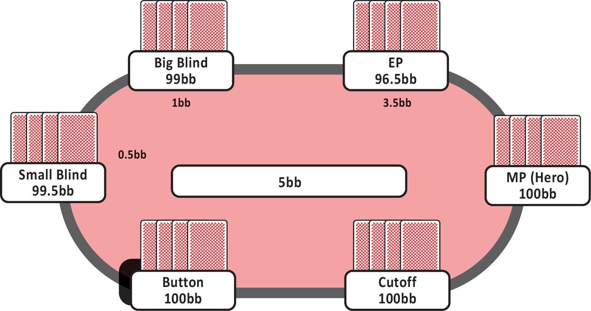
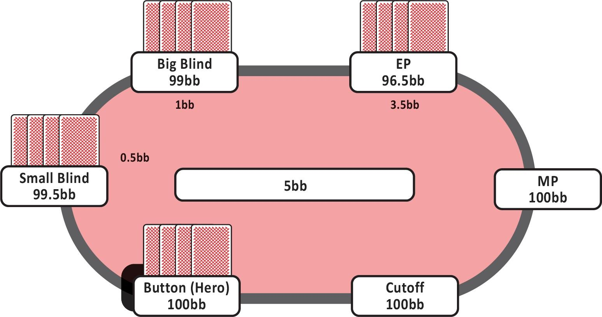
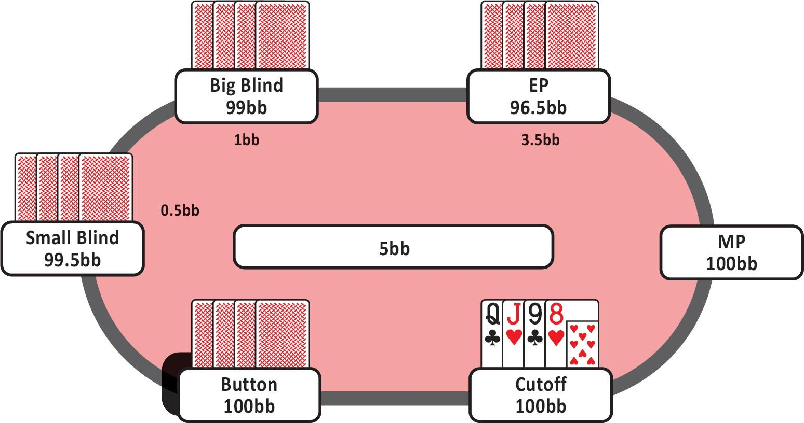
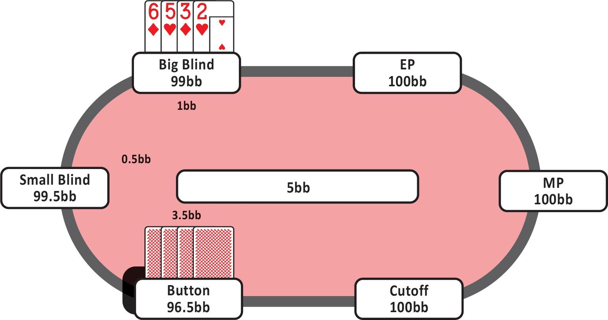
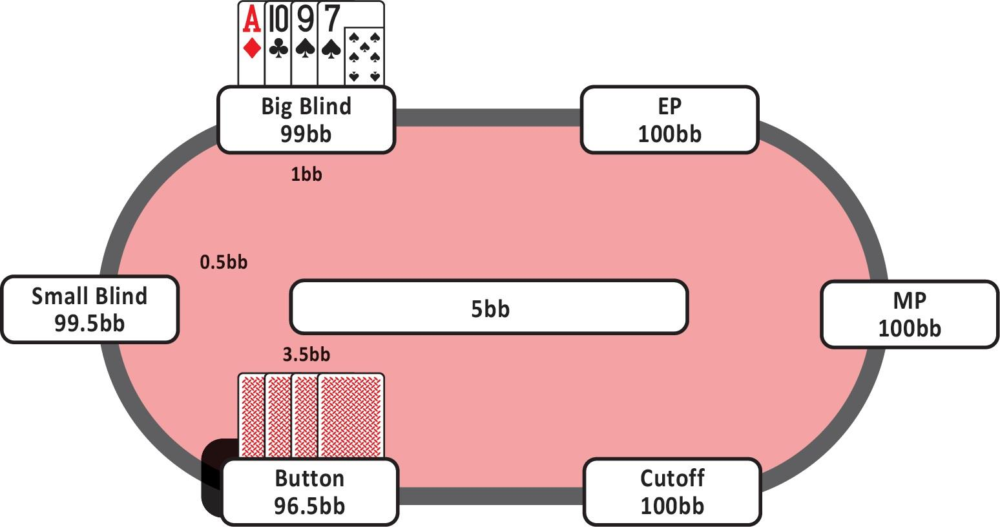
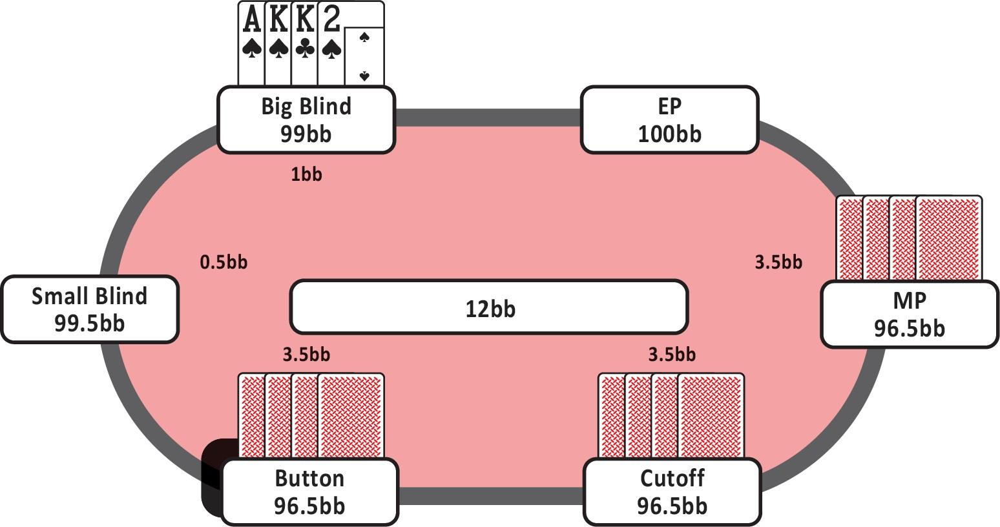
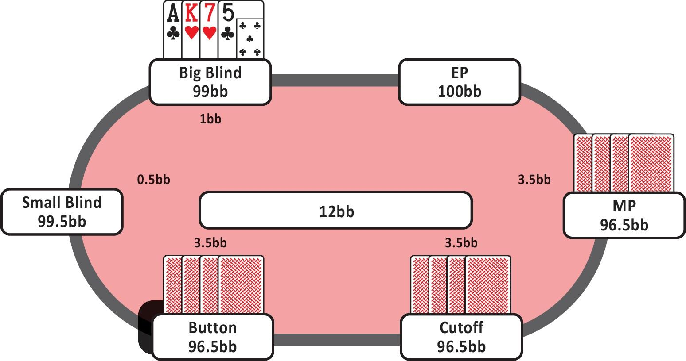

## 3.1 首次加注者

### 3.1.1 基础策略

基础策略将为你提供稳健且有利可图的开池加注范围，你可以始终使用这些范围。我们将其称为你的标准首次加注（RFI）范围。在 100 bb 深度的 6 人桌中，以下 RFI 频率定义了你的 GTO 基础策略：

- 从 EP 开池加注约 19%
- 从 MP 开池加注约 23%
- 从 CO 开池加注约 31%
- 从 BTN 开池加注约 48%
- 从 SB 开池加注约 35%

在此基础上，你可以根据其他玩家的倾向和桌上的筹码量进行（小幅）调整。例如，如果你后面的玩家打得非常激进，你会希望减少开池加注的手牌。如果你后面的玩家打得非常松且被动，你最好从开池加注范围中移除一些不太强的牌，因为这些牌在多人底池中表现不佳。这应该能让你大致了解随着你接近 BTN ，你的加注范围是如何扩大的。

需要注意的是如何计算这些手牌的百分比。一个很好的经验法则是，A-A 约占所有手牌的 2.5%。你几乎会在每个位置都玩所有的 A-A（除了一些 A-A-A 手牌）。因此，从 EP 和 MP 位置，A-A 约占你开池加注范围的 10%。

K-K 和 Q-Q 也各占所有手牌的 2.5%。然而，你并不是在每个位置都会加注所有的 K-K 和 Q-Q。像 K♠️-K♣️-7♥️-2♥️ 这样的手牌通常是一个开牌弃牌，除非你在 BTN 或 SB。像 K♠️-K♣️-7♥️-6♥️ 这样的更好的 K-K 手牌通常是可以玩的。同样，像 Q♠️-Q♣️-10♦️-2♠️ 这样的手牌在 CO 之前通常应该弃牌，而 Q♠️-Q♣️-9♦️-2♠️ 即使在 CO 也应该弃牌。

总的来说，如果你的手牌不连贯，它真的需要有一个非常强的同花或高牌才能进行开池加注。这条规则的例外是 A-A，因为你可以有利可图地进行 4-bet，并且仍然在翻前冷跟的 K-K 和 Q-Q 手牌中占据优势。另一个常见的错误是因为手牌连贯而开牌加注低牌。虽然像 9♣️-8♠️-7♦️-5♣️ 这样的手牌看起来不错，但实际上它是一个非常弱的手牌，不适合开池加注（或冷跟）。如果你认为底池会变成多人底池，这一点尤其正确。当你持有这样的手牌时，很容易被压制，而且很难压制对手 - 这应该是你的目标之一。

想象一下，你玩了一手像 9♣️-8♠️-7♦️-5♣️ 这样的牌，并在面对两个对手时翻出了 9♠️-8♥️-4♥️。看起来不错，对吧？顶两对和一个卡顺听牌。问题是，你的对手通常会玩更高的牌，所以他们可能有像顶对和同花听牌、J-10 带同花听牌、Q-J-8、A-K-9、J-10-9、Q-Q-J 等手牌。如果你在翻牌圈得到行动，你不应该对你的手牌感到满意。此外，如果转牌是 10 或更高，或者是红心，你会怎么打？你现在陷入了困境。你希望以低成本进入摊牌，但你不知道转牌是否改善了对手的手牌（很有可能），也不知道在河牌圈该做什么。而这还是在翻牌圈击中顶两对的情况下！这就是为什么像 Q♠️-J♣️-10♠️-8♦️ 这样的手牌已经更具可玩性，尤其是在其他人用较弱的连牌跟注的游戏中。选择性地玩手牌最终会带来巨大的回报。

### 3.1.2 主要要点

- 当你加入一个新桌子，不了解对手的策略时，开始使用标准或 GTO 的 RFI 频率。当你获得更多关于对手的信息时，你可以调整你的范围。
- 手牌的百分比并不是完全线性的。你正在寻找强同花、连贯手牌和高牌。如果缺少其中一个，它不太可能成为 EP 的开池加注。如果缺少两个，你可能只应该在 BTN 加注。
- 如果你预计会有多人底池，强烈关注坚果牌。那些可以压制对手且不易被压制的手牌。这是获得结构性优势的最佳方式，也是避免巨大错误的最简单方法。
- 记住，单同花手牌约占手牌的 50%，所以要非常选择性地玩这些手牌。同花手牌非常常见且弱，除非它们有非常高级别且连贯的牌。

## 3.2 冷跟基础知识

### 3.2.1 介绍

在本章中，当我们提到冷跟范围时，它适用于你面对单个加注者且你处于有利位置的情况。因此，你坐在 MP、CO 或 BTN，并且你面对来自 EP 玩家的开池加注。

在后面的章节中，我们将讨论 BB 和多人底池的情况。现在，目标是让你对在有利位置面对单个开池加注者时的冷跟有一个扎实的基础理解。

### 3.2.2 频率与位置意识

与开池加注时一样，你越接近 BTN，就越应该增加你的冷跟频率。即使面对相同的开池加注范围，这也是正确的。例如，面对 EP 加注者，你应该在 MP 冷跟约 4.8%，在 CO 冷跟约 7.2%，在 BTN 冷跟约 15.7%。MP 和 BNT 之间的差异是 300%。你越有可能在翻牌后拥有有利位置，你的冷跟范围就应该越宽。

另一个需要记住的关键点是，当你的位置更好时，你的跟注范围会增加，而你的 3-bet 范围会减少。因此，在 BTN 3-bet 边缘手牌并不像从 MP 那样必要。例如，在 MP 面对 EP 加注，你应该用约 5% 的手牌跟注，用约 5.2% 的手牌 3-bet。在 BTN 面对 EP 加注，你应该用 15.7% 的手牌跟注，只用 3.5% 的手牌 3-bet。

在下一章中，我们将讨论为什么会这样。现在，只需记住你的 3-bet 范围总是会影响你的冷跟范围。

许多玩家误解了这个概念。他们认为你应该非常激进，在 BTN 进行大量 3-bet，因为你拥有有利位置。但事实并非如此。事实上，当你拥有有利位置时，你受益于保持较高的 SPR，因为这给了你更多的翻牌后操作空间和更大的位置优势。

当你在 BTN 时，你更有动力只是跟注。这并不意味着当你有一手好牌时，你不想 3-bet。这只是意味着 CO 和 MP 位置更有动力 3-bet 边缘手牌，因为它们受益于赶走后面的玩家并获得位置。BTN 知道没有人可以在他们后面有位置优势，因此他们从 3-bet 中受益相对较少，而从跟注中受益更多。这导致 BTN 相对更被动，玩更宽的范围。

### 3.2.3 MP vs EP

那么，你应该在 MP 面对 EP 加注时冷跟哪些手牌？

在这种情况下，你面对的是一个紧的 UTG 开池加注范围，并且还有四个玩家在你后面等待行动。如果你决定跟注，很可能会看到一个多人翻牌。因此，这种情况下的关键因素是强牌。你正在寻找高同花、强连贯手牌和高对。在这种情况下足够好的手牌通常是这些因素的混合体，它们需要能够在多人底池中压制对手（图 10）。

图 10

一些例子是：

A♥️-J♥️-10♠️-2♠️

这手牌有高同花和连贯性高牌。这种组合使这手牌非常强，因此应该跟注。

A♥️-K♠️-5♥️-2♠️

这手牌的连贯性比上一个例子差，但同花更高。因此，这手牌也应该加入你的 MP 跟注范围。

7♦️-6♣️-5♦️-4♣️

当一手牌缺乏高牌时，连贯性必须非常好才能有利可图地玩这手牌。对于低牌，你希望没有间隔的连牌。这手牌是一个完美的连牌，也是一个应该加入你跟注范围的非常连贯的手牌例子。

A♣️-10♣️-10♥️-2♥️

这手牌有一个高对和一个高同花。这手牌的强牌性仍然很好，因此应该面对 EP 开池加注时跟注。

### 3.2.4 BTN vs EP

这里的主要区别是 MP 和 CO 已经弃牌，因此底池不太可能变成多路底池。此外，你拥有有利位置。记住 - 现在我们只讨论面对一个加注者且没有其他跟注者的情况。如果另一个玩家在你之前冷跟，那么你需要调整你的范围，倾向于更多的强牌，因为你会面对其他强牌。

如前所述，BTN 应该面对 EP 开牌加注时跟注 15.7% 并 3-bet 3.5%。哪些手牌是你在 BTN 面对 EP 时会跟注但在 MP 永远不会玩的？在 BTN，面对一个对手时，强牌性稍微不那么重要，而可玩性变得更加关键。由于手牌可能会变成单挑或三人底池，你可以将更多的非强牌加入你的翻牌前手牌范围（图 11）。

图 11

一些在 MP 不够好但在 BTN 足够好的跟注手牌的例子是：

Q♥️-J♠️-10♥️-2♠️

这手牌有很好的连贯性和同花性，但它不像之前讨论的 A♥️-J♥️-10♠️-2♠️ 那样强。因此，这手牌不应该在 MP 跟注。这手牌在有利位置的可玩性很好，因此可以在 BTN 有利可图地跟注。

K♠️-Q♠️-J♥️-6♥️

这是同样的故事。这手牌有高同花和良好的连贯性，但由于 6♥️ 这个散牌，这手牌不应该在 MP 跟注。

7♣️-6♣️-5♣️-4♦️

这手牌的连贯性非常好，但它缺乏高牌且是三同花。因此，这手牌应该在 MP 弃牌。然而，在 BTN，跟注的门槛稍低，这手牌应该跟注。

Q♦️-J♠️-J♣️-2♦️

这手牌的连贯性和同花性还可以，但并不出色。强牌性不足以在 MP 跟注。但在 BTN，这手牌有足够的积极因素可以跟注。

### 3.2.5 主要要点

- 你越接近 BTN，你的跟注范围就越大，3-bet 范围就越小。这是因为跟注允许你在翻牌后利用你的位置优势。
- 在前位，你应该更关注强牌性。在 BTN，多人底池的可能性较小，你能够利用位置优势，可玩性更为重要。

## 3.3 3-bet 基础知识

### 3.3.1 介绍

3-bet 是 PLO 的重要组成部分，尤其是考虑到许多玩家在被 3-bet 后很少弃牌。这些大底池对你的胜率有巨大影响，因此让我们确保你掌握了正确的基础知识和适当的 3-bet 翻牌前范围。

### 3.3.2 跟注还是 3-bet

请记住，当你决定 3-bet 时，你放弃了冷跟，反之亦然。你必须理解这两种选择的好处，因为它们是相互排斥的。

当你 3-bet 时，你通常会玩单挑底池，因为桌上的其他玩家现在必须做出更大的翻牌前投入才能进入底池。在 3-bet 底池中，SPR 比单次加注底池低得多。在 100 bb 的 3-bet 底池中，SPR 大约为 4，这意味着你经常会玩全下。

当你冷跟一个开池加注时，更有可能最终进入多人底池，尤其是如果你从前位之一冷跟。在现场游戏或小级别在线游戏中，许多底池会变成多人底池，因为你可能会面对许多具有非常宽翻牌前范围的玩家，他们没有正确调整多人游戏。在 100 bb 的单次加注底池中，SPR 通常约为 13，这意味着你需要更强的手牌才能在翻牌圈全下，尤其是在多人底池中。

### 3.3.3 位置优势

另一个关键区别是，当 SPR 较低时，如在 3-bet 底池中，处于不利位置的玩家的位置劣势较小，因为他们可以更容易地在翻牌圈或转牌圈全下。这意味着他们通常可以避免在河牌圈处于不利位置。在 PLO 中，河牌圈是一个棘手的街，因为坚果牌经常变化，这会影响处于不利位置的玩家。

在高 SPR 情况下，处于不利位置的玩家必须在这种不利情况下玩所有三条街。这剥夺了他们的 EV，而 EV 则被处于有利位置的玩家获得。因此，拥有高 SPR 会增加处于有利位置的玩家的位置优势，因为他们可以通过多条街利用它。

### 3.3.4 3-bet 的原因

请注意，这个解释是一个简化版本，旨在介绍为什么以及何时你应该考虑翻牌前 3-bet。在后面的章节中，我们将更详细地分析这个概念。

我们已经指出，3-bet 底池会导致低 SPR 情况，玩家很可能在翻牌圈或转牌圈全下。你的对手知道他们可以在翻牌圈击中一对和听牌或组合听牌时全下。因此，你在 3-bet 底池中的目标是在这种全下情况下压制对手。

实现这一目标的最佳手牌是对子加听牌类型的手牌，它们可以压制对手的类似手牌。理想情况下，你希望在翻牌圈击中顶对和高同花或顺子听牌，而不是中对和弱同花或顺子听牌。你需要通过构建你的 3-bet 范围来实现这一翻牌后目标。

因此，3-bet 有两个主要原因：

**3-bet 以推动权益优势**

你应该 3-bet 那些希望建立大底池并具有权益优势的手牌。主要的 3-bet 价值手牌是 A-A-x-x、A-K-K-x 和 A-Q-Q-x。另一种是双高同花手牌，这些手牌是双高同花，具有非常好的连贯性和高牌或接近高牌的对子。总的来说，这些手牌仅占所有手牌的约 3.5%。

**3-bet 以获得更好的可玩性**

第二个 3-bet 的原因是可玩性。那些希望 3-bet 以获得可玩性的手牌通常具有非常平滑的权益分布，这意味着它们在大量翻牌上具有良好的权益。这些手牌也不是坚果牌，因此它们不适合多人底池。这意味着 3-bet 变得更具吸引力，以使底池变成单挑。这一类别包括许多非坚果牌的高双同花连牌。它们仍然需要主要包含高牌，因为你希望压制对手的翻牌后全下范围。尽管它们缺乏坚果性，但它们与单个玩家的范围相比具有相当高的权益，并且它们在进入低 SPR 翻牌后情况时为你的范围增加了许多可玩性。

### 3.3.5 实现权益

在 3-bet 底池中，资金经常会全下。因此，你的手牌必须具有实现所有权益的潜力。你希望 3-bet 那些在 SPR 为 4 时愿意在翻牌后投入所有资金的手牌。像高双同花连牌这样的手牌通常能够全下，因为它们经常在翻牌圈击中一对或更好的牌以及不错的听牌。

如果你回想一下翻牌权益分布图，你知道 8♠️-7♠️-6♥️-5♥️ 具有更平滑的权益分布。这手牌将更容易实现权益，因为你经常在翻牌圈击中足够的权益来跟注对手的全下。当你在 3-bet 底池中击中同花听牌时，你很少能逃脱。这也适用于你的对手，因此你希望确保你拥有更好的同花听牌和顺子听牌，以便在大底池中对对手拥有大量权益。顺便说一下，8♠️-7♠️-6♥️-5♥️ 是一手你应该从 CO 面对 MP 时 3-bet 以赶走 BTN 玩家的手牌，但当你在 BTN 面对加注时应该平跟，因为后面没有人可以赶走并获得有利位置。

### 3.3.6 价值 3-bet

如果你是为了价值而 3-bet，你希望用具有原始权益优势的手牌建立一个大底池。例如，当你持有 A-A 时，大多数时候你 3-bet 是因为你希望在翻牌前将大量筹码投入底池。你还给对手 4-bet 的选择，这将更加有利可图。如果你只是用 A-A 跟注，你的对手没有 4-bet 的选择，你会失去额外的 EV。

3-bet A-A 的另一个原因是它们在低 SPR 情况下表现更好，它们可以压制具有坚果同花听牌的全下手牌，或者至少在与对子加听牌手牌对抗时表现良好，以便在 c-bet 后全下。在单次加注底池中，A-A  经常无法实现其权益，最终因无法进入摊牌而更经常输掉。

明确地说，我是在说你的手牌在 3-bet 单挑底池中比在单次加注多路底池中表现更好。我并不是说你的手牌在 3-bet 底池中应该表现得非常好。你明白区别吗？

让我们用一个例子来进一步分析这个概念。

你持有 A♠️-A♣️-9♠️-3♠️。这手牌在 3-bet 底池中不会表现得非常好，因为同花性和连贯性都很弱，但它在多人底池中表现得更差。当你在单次加注多人底池中时，你的手牌需要额外的帮助才能实现你的权益。在多人底池中，通常至少有一个玩家在翻牌圈击中一部分牌并决定下注。要继续对抗这个下注，你需要相当高的权益。像 A♠️-A♣️-9♠️-3♠️ 这样的手牌除非在翻牌圈击中三条或坚果同花听牌，否则无法继续翻牌后。因此，你希望 3-bet 这手牌，以尝试在低 SPR 下玩单挑底池，以便在更多的翻牌上推动你的权益。

你希望价值 3-bet 的最后一个原因是你受益于翻牌前的弃牌权益。如果你在某人已经投入额外资金后翻牌前赢得一手牌，你将不支付抽水，因为手牌没有进入翻牌圈，这将产生巨大的胜率！

你总是希望在翻牌前情况下比较冷跟和 3-bet 的选择。即使你有一手在 3-bet 底池中可能不会表现得非常好的手牌，你可能仍然希望考虑 3-bet，因为它可能在多人单次加注底池中表现得更差。

### 3.3.7 3-bet 以提高可玩性

进行 3-bet 以提高可玩性的主要原因是为了赶走你后面的玩家并获得单挑底池。一般来说，希望进行 3-bet 以提高可玩性的手牌并不是非常坚果性，因此它们非常受益于赶走后面持有更高同花的玩家。以下是一个例子：

你在 CO，面对来自 EP 的一个底池大小的加注。你持有 Q♣️-J♥️-9♣️-8♥️（图 12）。

图 12

这手牌连接性非常好，具有非常平滑的权益分布。它会在许多不同的牌面结构上连接，但缺乏坚果性。因此，这手牌在单挑底池中比在多人底池中表现更好。你后面的玩家可能持有比你更强的同花，因此你受益于将他们赶出底池。这些原因意味着这手牌应该进行 3-bet。

玩这手牌，你经常会翻牌圈获得相当多的权益，例如一对加听牌，并且能够在翻牌圈将所有资金投入或通过 c-bet 赢得底池。如果你处于一个有多名对手的底池中，当资金投入时，你很可能会处于不利的位置，因为你的一个对手可能会展示出比你更强的同花，而另一个对手可能持有更强的成手牌。

### 3.3.8 主要要点

进行 3-bet 有两个原因：

- 为了用一手牌建立一个更大的底池：
    - 具有原始权益优势。
    - 在单挑底池中表现更好，而不是在多人底池中。
    - 从翻牌前的弃牌权益中获益。
- 为了提高可玩性：
    - 赶走后面持有无法跟注 3-bet 但会跟注的压制性手牌的玩家。
    - 在更高的 EV 背景下玩你的手牌，因为它在低 SPR 的单挑底池中比在多人底池中表现更好。
    - 确保位置优势并赶走后面有位置的玩家。

## 3.4 面对 3-bet

### 3.4.1 介绍

当面对 3-bet 时，有三种可能的情况，每种情况都有不同的 EV：

1. 你可以进行 4-bet，这主要是用 A-A、一些 A-K-K 和 A 高双同花的连牌进行的。用这样的范围进行 4-bet 会产生非常高的 EV。
2. 跟注 3-bet。在这种情况下，你可以收回部分初始投资（加注），但跟注的 EV 几乎总是低于你初始加注的 EV。通常情况下，跟注 3-bet 的 EV 是负的，但仍然比直接弃牌并完全放弃你最初的 3.5 bb 要好。
3. 弃牌意味着你放弃了整个翻牌前的投资。你弃掉部分加注范围的原因是，这些牌在 3-bet 底池中会比直接弃牌损失更多的钱。这部分范围通常被对手的 3-bet 范围严重压制，并且缺乏权益实现能力。这意味着你经常会在翻牌圈投入所有资金时处于被压制且权益极低的状态。或者，你最终不得不频繁地过牌 - 弃牌。属于这个弃牌范围的手牌通常是大对子或高牌，它们没有额外的支持，例如双同花或强连接。

许多玩家在应对 PLO 中的 3-bet 时存在误解。他们通常认为不必对 3-bet 弃牌，但这是错误的。弱牌通过跟注会损失更多的钱，这是事实。

如果你在 EP 加注，而 BTN 进行 3-bet，你应该多久弃牌一次？答案是你应该在大约 19% 的情况下弃牌，具体取决于抽水结构、你的对手和筹码深度。如果你支付很多抽水，例如在低级别在线游戏中，你应该多弃牌约 10%，即接近 30%。如果你支付很少甚至没有抽水，例如在基于时间的抽水结构的现场游戏中，你只需要在大约 9% 的情况下对 3-bet 弃牌。

### 3.4.2 关键概念一：位置

在任何扑克游戏中，位置对你的 EV 都有重大影响。大多数玩家低估了位置在 PLO 中的影响。在有利位置的情况下，你可以实现更多的权益，因为你能够用强牌产生更多的价值，决定是否进入摊牌，并获得更多的翻牌后诈唬机会。因此，当你在有利位置时，对抗 3-bet 有利可图所需的权益最低限度要低得多。这意味着在不利位置的情况下，你将不得不更频繁地对 3-bet 弃牌。

### 3.4.3 关键概念二：如何用 A-A vs 3-bet

如果你在持有 A-A 时面对 3-bet，并且筹码为 100 bb，你希望 100% 进行 4-bet。进行 4-bet 的主要原因是 EV 远高于跟注。让对手在你是大幅领先的情况下投入大量资金到底池中，比在翻牌前设陷阱更有价值。此外，当 SPR 较低时，A-A 手牌更容易实现其权益，因为这允许你在大多数翻牌圈上有利可图地全下，而不必在不知道你的超对是否好的情况下玩多条街。

随着你变得更深，尤其是超过 150 bb 时，你希望开始更多地平跟 A-A 对抗 3-bet，因为在中等至高 SPR 的情况下，缺乏可玩性的组合可能会非常棘手。如果你选择将一些 A-A 加入你的跟注范围，请从那些可玩性最低的牌开始，因为这些牌在 3-bet 底池中更难玩，你宁愿避免犯大错并控制底池大小。

### 3.4.4 关键概念三：单同花 vs 双同花

双同花手牌比单同花手牌更常被跟注对抗 3-bet。3-bet 底池在低 SPR 下进行，这意味着平滑性是决定是否跟注 3-bet 的关键因素，因为它将帮助你在一个大底池中实现你的权益。如果你没有正确的手牌选择，你经常会发现自己不得不在翻牌圈弃牌，因为你没有足够的权益来证明继续下去是合理的。双同花手牌在对抗主要 A-A-x-x 范围时具有更多的权益和实现能力。你希望避免在没有后备的情况下击中顶对，因为这类手牌在对抗 A-A 时权益较低。双同花手牌可以击中更多的组合听牌以及带有后门同花听牌的对子，这将使你的权益更接近于 50% 的权益对抗对手主要 A-A 牌的 3-bet 范围。

这并不意味着当你面对 3-bet 时应该弃掉所有的单同花或彩虹手牌。你通常仍然应该用这些手牌跟注，尤其是在有利位置的情况下。当你在不利位置的情况下面对一个较紧的 3-bet 范围并且处于位置劣势时，你希望弃掉许多这些非双同花的组合。

### 3.4.5 关键概念四：对子 vs 3-bet

对子需要非常强的连接性或双同花才能在不利位置的情况下跟注 3-bet。回想一下关于权益分布的材料。当你持有一个对子时，你的手牌很可能会击中非常 “粗糙” 的牌面，并且你只会在少数情况下击中大量的权益。一个例子是 K♣️-K♠️-10♠️-2♥️。

这手牌很难找到任何想要过牌 - 加注全下或继续对抗 c-bet 的牌面。在大多数情况下，你会在面对包含大量 A-A 的范围时击中一个裸超对，而没有任何后备，在这种情况下你完全被压制。

其他你希望对抗 3-bet 弃牌的手牌的例子，因为它们击中太粗糙的牌面：

- K♣️-K♠️-Q♦️-4♠️
- K♦️-10♣️-10♥️-6♦️

你可以对抗 3-bet 跟注的手牌的例子，因为它们击中平滑的牌面，因此更容易实现权益：

- K♠️-K♥️-Q♥️-4♠️
- 7♥️-6♥️-6♠️-5♦️

### 3.4.6 关键概念五：A 高同花

A 高单同花手牌比三同花手牌或非 A 高同花手牌更常被跟注。持有 A 高单同花手牌、持有 A 高三同花手牌或持有非 A 高同花手牌之间存在相当大的差异。

你对抗 3-bet 应弃牌的手牌示例：

A♥️-J♦️-10♦️-3♠️

这手牌没有 A 高同花，因此权益较低。

A♥️-K♥️-Q♥️-4♠️

这手牌的权益分布非常粗糙，很难在对手的 3-bet 范围中反超。

你对抗 3-bet 应跟注的手牌示例：

A♥️-J♥️-10♠️-3♠️

这手牌有一些连接性和坚果同花。

A♦️-K♦️-Q♥️-4♣️

A 高单同花意味着这手牌有更好的机会在对手的 3-bet 范围中反超。

### 3.4.7 关键概念六：双同花连牌

双同花连牌和由 A 支持的双同花大对子可用于 4-bet。许多玩家选择了错误的手牌进行 4-bet。你不应该只在你的 4-bet 范围中包含 A-A-x-x。如果你的对手知道你只用 A-A 进行 4-bet，他们在翻牌前和翻牌后都会很容易对付你。你可以包含在你的 4-bet 范围内的其他手牌在对抗 5-bet 时表现非常好（连接且双同花），或者它们阻挡了 A-A。

适合包含在你的 4-bet 范围内但不是 A-A 的手牌示例：

A♦️-J♦️-J♥️-10♥️

这手牌阻挡了 A-A，是双同花且连接良好。这手牌的权益应该几乎对任何范围都非常高。

A♣️-K♣️-K♦️-3♦️

这手牌在原始权益方面非常强。它也是双同花，并且阻挡了 A-A。

Q♠️-J♠️-10♦️-8♦️

这手牌是双同花，连接非常好，并且可以跟注 5-bet。

### 3.4.8 主要要点

- A-A 通常应该进行 4-bet，但一些缺乏实现能力的组合在超过 150 bb 深度时更适合作为跟注。
- 双同花手牌比单同花手牌更常跟注 3-bet。
- 对子需要额外的因素来证明跟注 3-bet 的合理性，尤其是在不利位置的情况下。
- A 高单同花手牌比三同花手牌或非 A 高同花手牌更常被跟注。
- 双同花连牌和由 A 支持的双同花大对子可用于 4-bet。

## 3.5 200 bb 面对 3-bet

如果你有超过 100 bb 的筹码深度，你的整体弃牌频率也会降低。在 200 bb 时，无论是处于有利位置还是不利位置，面对 3-bet 你都会更多地继续。主要原因是，在 3-bet 底池中，200 bb 的 3-bet 玩家在翻牌圈进行底池大小的下注和承诺全下底池的情况较少。让我们简要看一下这如何影响两种场景中的策略。

### 3.5.1 不利位置深筹码翻牌前跟注者

在这种场景中，最重要的因素是筹码深度以及你有更多的翻牌后可玩性。由于较高的 SPR，你能够跟注一个下注，并且仍然有一些隐含赔率，相比于 100 bb 的起始筹码深度。

在 100 bb 时，3-bet 玩家通常会下注底池，从而在翻牌圈承诺全下底池，在这种情况下，你很难用单对牌型继续对抗一个以 A-A 为主的范围。在 200 bb 时，这个问题不会出现，因为由于筹码更深，3-bet 玩家没有太多动力在翻牌圈下注底池，因为他们无法通过底池下注和全下来盈利。3-bet 玩家在这种深度下全下的权益门槛要高得多。因此，3-bet 玩家在处于有利位置时，会更倾向于执行多街游戏计划，以尽可能利用筹码深度和位置优势。

此外，在 200 bb 时，处于有利位置的 3-bet 玩家的 3-bet 范围会比 100 bb 时更宽。这意味着他的翻牌范围稍弱。最后，在 200 bb 时，除了 BTN，RFI 范围稍紧且更强。总的来说，这意味着处于有利位置的玩家会更少进行 c-bet 或使用较小的下注尺寸。这对处于不利位置的 3-bet 跟注者有利，并允许他们在翻牌前更有利地玩更多手牌，相比于 100 bb 时。

### 3.5.2 有利位置深筹码翻牌前跟注者

在 200 bb 时处于有利位置（例如当你在 BTN 加注，SB 3-bet 时），你的位置优势相比于 100 bb 时要大得多，因此你有很大的动力在面对 3-bet 时用大部分范围进行跟注。通过跟注，你可以让对手非常难以应对。他们最终会处于一个非常大的底池中，无法执行与 100 bb 时相同的策略，因为 SPR 更高，并且他们将在多条街上处于不利位置。再次强调，这意味着处于有利位置的玩家能够利用他们的位置优势，并最终增加他们手牌的 EV。记住，作为面对 3-bet 的有利位置跟注者，你会更倾向于用很多强牌进行跟注，而不是 4-bet，并且你的 4-bet 范围会非常紧。

## 3.6 溜入

### 3.6.1 你应该在 PLO 中开池溜入吗？

溜入是指在翻牌前只跟注大盲注（或抓位）的行为。当你在 UTG 或所有人都弃牌到你时，你可以选择弃牌、跟注（溜入）或加注。正如我们之前讨论的，你几乎总是应该弃牌或加注，几乎从不应该开池溜入。

在 PLO 中，抽水往往非常高，因此你从翻牌前拿下底池而不支付任何抽水中获益很大。在大多数现金游戏中，存在 “无翻牌，无抽水” 的结构。这意味着如果你没有看到翻牌，你不需要支付任何抽水。在这种游戏中，溜入很少在你的基础策略中占有一席之地。

如果你溜入，你在翻牌前没有任何弃牌权益，因此你总是希望加注。记住，从关于加注尺寸的章节中，偷取盲注可以为你带来 150 bb/100 的胜率，这将是非常可观的。

你的策略应该是翻牌前的激进打法，以建立大底池。因此，确保向对手收取进入底池并与你竞争盲注的费用。

如果你使用开池溜入策略，当你持有强牌并希望获得支付时，你将无法从对手那里赢取尽可能多的筹码。如果你溜入一个弱牌，你只会让自己陷入麻烦，允许具有更好权益的手牌从你那里获得 EV。

“不开池溜入” 规则有几个例外。如果你玩的游戏格式不是 “无翻牌，无抽水” 游戏，例如锦标赛或按时间抽水的现金游戏，溜入可能是一个可行的策略。在这些游戏中，如果你是短筹码或面对短筹码，那么溜入可以带来战略优势，例如玩高 SPR 场景，并且不必在翻牌前弃掉相当比例的手牌。

无论你是从前位还是后位溜入，你仍然希望溜入强牌。这样你可以 “迫使” 盲注玩家用弱牌对抗你，在这种情况下，你通常具有范围和位置优势。在阅读本书后，你还应该具备发展技能优势的基础策略。

### 3.6.2 剥削利用溜入玩家

当你面对溜入玩家时，你做出的决定取决于许多不同的变量，例如位置、筹码深度、读人、你后面的玩家类型等。让我们从一个简单的事实开始。在标准抽水的现金游戏中，大多数溜入的玩家都是娱乐玩家。他们通常在翻牌前玩非常宽的范围，并且在翻牌后也经常犯很多错误。能够隔离这些弱玩家可以大大提升你的胜率。你不想过度这样做，因为如果你这样做，你自己就会成为弱玩家，并被其他警觉的玩家或拿到大牌的玩家剥削利用。你很容易陷入大麻烦，进入多人底池而没有适合这种情况的手牌。溜入玩家也可能通过更频繁地再加注来剥削利用你的宽范围，这将使他降低位置劣势并在翻牌后压制你的手牌。

一般来说，你应该使用比你的 RFI 范围更紧的范围来隔离溜入玩家。例如，如果轮到你在 BTN 行动，前面的人都弃牌，你应该在大约 50% 的情况下进行底池大小的加注。如果 CO 位决定溜入，你应该比这更紧地进行加注，因为溜入的玩家不会在面对单个加注时弃牌，他们溜入是为了跟注。一个易于记忆的一般规则是，你可以使用比溜入玩家早一个位置的 RFI 范围来隔离每个溜入玩家。例如，如果 CO 溜入，而你在 BTN，用你的 CO RFI 范围来隔离该玩家。如果 MP 和 CO 玩家都溜入，那么你应该用比他们早两个位置的 RFI 范围来隔离，例如 MP RFI 范围。

当有溜入玩家在你前面时，翻牌前的弃牌权益几乎为零。你几乎肯定会看到翻牌并支付抽水。你也不再能够独自赢得盲注，你将不得不与至少一个其他玩家分享死钱。如果你首先加注并成功偷取盲注，你的胜率将是 150 bb/100。如果有溜入玩家在翻牌前不弃牌，你将无法再达到这个胜率，因为你将不得不与溜入玩家和赌场或扑克网站分享盲注。这会大大降低你的胜率，因此你希望收紧你的范围，以便对溜入玩家具有更大的权益优势，并避免被其他玩家剥削利用。

### 3.6.3 跟注溜入

跟注溜入是指当你面对溜入玩家时决定也跟注。毕竟，这只是一个小额下注，你得到了更好的赔率，对吗？虽然这是事实，但请记住要考虑你翻牌后的去向，那将是一个多人底池。更多地关注你的手牌在未来的所有下注中如何表现，而不是翻牌前的最小下注。如果你只关注即时的底池赔率和权益，你就是在根据手牌中最不重要的方面做出决定，很容易让你的 “小错误” 在翻牌后变成更大的错误。因此，你可以认为这些小错误实际上应该被视为大错误。

我无法强调这一点。避免用不适合多人底池的手牌玩多人底池。如果你能避免这个常见的小级别 PLO 错误，你已经远远领先于竞争对手。不要认为你的高超技能可以克服游戏的结构性部分。你会被压制，被迫弃牌，或在摊牌时输得太频繁，无法在多人底池中盈利地玩弱牌。

记住，在有利位置时，你希望用你的强范围对抗对手的弱范围建立大底池。在有利位置与一个弱玩家单挑进入翻牌圈仍然是一个很好的结果。与多个玩家一起进入翻牌圈，拿着弱牌则不是。

当你处于不利位置时，例如在 SB，你可以考虑跟注溜入。即使在这种情况下，你也只应该考虑用相当强的手牌跟注溜入。在这种情况下，即使你加注，你也会处于不利位置，且没有太多翻牌前的弃牌权益。强牌可以通过在不利位置进行 3-bet 并显著降低 SPR 来获得很多收益，但在面对溜入玩家时加注，你仍然会进入一个高 SPR 的不利位置场景。大多数手牌不会获得足够的权益优势能盈利地玩，相比于仅仅跟注。作为经验法则，当你在不利位置面对溜入玩家时，只用你的 UTG RFI 范围来隔离他们。

**隔离溜入玩家的经验法则**

- 面对一个溜入玩家时，使用前一个位置的 RFI 范围进行加注。
- 每增加一个溜入玩家，增加一个更早的位置。

这是你在面对溜入玩家时想要使用的默认策略，前提是你对该玩家没有任何特定的阅读。如果你有更深的筹码，或者你的对手有非常宽的范围且在翻牌后表现较弱，你可以加注更宽。

另一方面，如果你后面的玩家非常激进，或者溜入玩家很紧，你应该加注更紧。要真正碾压你的游戏，你需要理解默认策略，然后根据桌子的条件或你的读牌调整这个基本策略。

### 3.6.4 主要要点

- 你应该只在具有非常特定抽水结构的游戏中开池溜入。
- 溜入的玩家通常在翻牌前和翻牌后都玩得很差。你希望隔离他们，以便与弱玩家玩一个底池。不要隔离得太宽，因为这样做会让你容易被剥削利用。
- 当你在有利位置面对溜入时，不要跟注溜入，选择加注或弃牌。
- 在不利位置时，跟注溜入可以是一个选择。你希望从 SB 用大约 30% 的手牌跟注溜入，特别注意你范围的坚果性。
- 用 UTG RFI 范围进行隔离。
- 一般来说，当考虑是否隔离一个玩家时，你可以用比溜入玩家早一个位置的 RFI 范围来隔离每个溜入玩家。
- 在 SB，大约 30% 的情况下跟注溜入。
- 将此作为你的基础策略，并根据你对对手的读牌和信息进行调整。

## 3.7 BB 防守对抗单个对手

### 3.7.1 基础知识

当你在 BB 面对一个单独的开池加注时，你已经知道你将在一个单挑底池中处于不利位置。如果你面对一个对手的底池大小的开池加注，你将获得 2 : 1 的赔率。这意味着如果你不需要在未来的街做出决策，你需要 33% 的权益才能盈利地跟注。但由于你确实需要在未来的街做出决策，你还需要考虑权益实现因素。

这个原则与 NLHE 中的情况相同，在 NLHE 中，你在 BB 可能会用 8♥️-4♥️ 来防御，但你会弃掉 Q♠️-2♥️。这些手牌的权益相似，但这些权益的实现方式却大不相同。这是因为 8♥️-4♥️ 的同花和连接性更好。这手牌的更高权益实现能力使你能在更多的翻牌、转牌和河牌上继续游戏，因为你可能会击中同花或顺子听牌。而 Q♠️-2♥️ 则不太可能做到这一点。

在 PLO 中，类似的原则也适用。双同花且连接的手牌往往能实现更多的翻牌前权益，因为它们比那些不具备这些优势的手牌能连接更多的牌面。这意味着 7♥️-6♠️-5♥️-4♠️ 比 J♣️-J♦️-7♠️-2♥️ 更适合防御 BTN 的开池加注。尽管 7♥️-6♠️-5♥️-4♠️ 对 BTN 的开池范围有 44% 的权益，而 J♣️-J♦️-7♠️-2♥️ 有 46% 的权益，但双同花的连牌能连接更多的翻牌，并且更有可能在翻牌后继续游戏。这不仅意味着你能更频繁地进入摊牌，还意味着你可以在必要时将手牌转为诈唬。而一手弱小的单对 J-J 则无法做到这两点。

一些玩家认为，在 PLO 中，用大部分手牌在翻牌前防御 BB 是有利可图的。这种观点基于手牌在翻牌前拥有可观的权益，以及 PLO 中不同起手牌的权益非常接近。这些玩家忽略的是，权益必须与权益实现相结合。否则，你将使用一个不完整的模型，因为我们不会在翻牌前全下。你必须开始更多地思考哪些手牌能实现更多的权益，哪些手牌不能，而这正是多个因素发挥作用的地方。双同花手牌比单同花手牌能实现更多的权益。单同花手牌比三同花手牌能实现更多的权益，而不连接的手牌比连接的手牌实现的权益更少。

然而，这还不是全部。弱的不连接手牌不仅权益较低，而且实现的权益也更少。10♠️-10♥️-6♥️-3♣️ 的原始权益低于 10♠️-10♥️-9♥️-8♣️ ，而且 10♠️-10♥️-6♥️-3♣️ 实现的权益也更少，因为它缺乏协同工作的组件。这实际上意味着这手牌的 EV 下降到不值得在翻牌前跟注的水平。仅仅拥有 33% 的权益不足以证明跟注的合理性。10♠️-10♥️-9♥️-8♣️ 由于更高的连接性，拥有更多的权益并能实现更多的权益，因此它在 BB 是一个容易的防御手牌。

持有这种代价高昂的翻牌前误解的玩家也没有足够重视位置劣势。BB 总是处于不利位置，除非是对抗 SB。如前所述，处于不利位置会使你更难实现手牌的全部权益，因为你对行动的控制较少。因此，BB 应该弃掉很多边缘手牌。

在决定是否防御 BB 对抗一个单独对手时，考虑以下两点：

- 你的手牌对抗对手加注范围的权益。
- 你的手牌的权益实现能力。

你的手牌的权益在很大程度上取决于对手的范围有多宽。如果你的对手从 EP 开池，你需要大幅收紧你的翻牌前范围。如果他们在 BTN 使用 50% 的范围开池，你可以防御大约 50% 到 60% 的手牌，因为你在 BB 对抗宽范围时获得了不错的价格。

关于上述第二点，重要的是要记住，某些手牌比其他手牌能更好地实现其权益。这意味着范围构成比游戏频率更重要。权益实现因素由手牌的组件质量和数量决定。

**剥削的调整**

如果你的对手在翻牌后非常激进，你需要调整并收紧你的翻牌前范围。那些频繁进行 c-bet 和连开多枪的对手会利用宽且封顶的范围。一个自然的剥削策略是在翻牌前防御得更紧，并在每条街上拥有更强的手牌范围，这样你的对手最终会下注到一个更容易跟注并惩罚这种倾向的范围。

**BB 防御对抗一个对手**

如果你在 BB 面对一个单独的开池加注，你应该以略高于对手开池加注范围的频率进行防御。例如，如果 EP 开池 18% 的时间，BB 应该防御大约 25%。如果 BTN 开池大约 50%，BB 应该防御大约 50% 到 60%。这仅适用于单挑底池。

### 3.7.2 抽水的影响

BB 在面对 BTN 加注时应该弃掉大约 40% 到 50% 的手牌，而在面对 EP 加注时应该弃掉大约 75% 的手牌。在高抽水游戏中，你应该弃掉更多手牌，而在低抽水游戏中，你可以弃掉更少手牌。你支付的抽水越多，你的边缘防御手牌的利润被抽水侵蚀得越多，直到某些在低抽水情况下可以防御的手牌变成亏损手牌。

### 3.7.3 小级别常见错误

在小级别中，一个常见的错误是玩家防御了太多弱的单组件手牌。这类手牌的示例包括：带 A 同花的不连接手牌、无支持的中高对、彩虹的百老汇手牌以及双同花的不连接垃圾手牌。

例如，持有一手 A 同花并不意味着你总是可以在面对一个单独的开池加注者时证明翻牌前跟注的合理性。这个单一元素在多人底池中变得更加重要，因为坚果效应和对手拥有被压制的同花听牌的机会增加。但在单挑情况下，权益实现比坚果性更重要。A 同花为手牌增加了很大的坚果性，但并没有增加太多的权益实现能力。你需要额外的组件，如连接性、高牌或对子。

同样的情况也适用于不连接的中高对、彩虹的百老汇手牌和双同花的垃圾手牌。没有支持，这些手牌没有足够的权益实现能力来在面对开池加注时跟注盈利。

### 3.7.4 在 BB 进行 3-bet

如果你还记得，在 PLO 中，3-bet 的两个主要原因是：

- 你有一手高权益的手牌。
- 你有一手具有平滑权益分布的手牌，它在单挑底池中比在多人底池中表现更好。

当你在 BB 时，没有玩家在你后面可以赶走，因此第二个原因不相关。这意味着你的 3-bet 范围几乎完全由高权益手牌组成。尤其是因为你将在翻牌后处于不利位置。当你在不利位置防御手牌时，你希望 3-bet 一个更强的范围，这样你可以在许多不同的翻牌和转牌上施加压力。你只能通过坚持使用多组件手牌（如双同花的高牌）来实现这一目标。

**剥削性建议**

当你的对手在桌上开池范围极宽时，调整策略的方法是扩大你的 3-bet 范围。不要开始更频繁地跟注，因为很多这些边缘手牌难以实现权益。扩大你的跟注范围不太可能带来赢得的底池。通过扩大你的 3-bet 范围来惩罚那些开池弱手牌的玩家，会带来更多的利润。

### 3.7.5 示例

为了澄清这些 BB 防御的基础知识，让我们来看一些示例。

**手牌示例 5**

你在 BB，持有 6♦️-5♥️-3♦️-2♥️，面对 BTN 的开池加注（图 13）。这手牌有许多不同的组件。然而，这些组件的质量非常差。

图 13

这些牌的等级非常低，这意味着这手牌会击中容易被压制的牌型，如底两对、边缘的同花听牌或顺子听牌的底端。因此，这手牌应该弃掉。

**手牌示例 6**

现在假设你持有 A♦️-10♣️-9♠️-7♠️（图 14）。

图 14

许多玩家会弃掉这手牌，因为 A 没有同花。如前所述，在单挑情况下，持有 A 同花并不关键；更重要的是手牌的权益实现能力。这手牌有不错的连接性，它正好有一手同花和一些中高等级的牌。出于这些原因，你应该用这手牌跟注。如果你面对多个对手，弃牌是最好的选择。

**手牌示例 7**

假设你现在持有 A♦️-A♣️-8♥️-4♠️（图 15）。

这手牌对 BTN 的开池加注范围有大约 62% 的权益，而像 K♥️-Q♠️-10♥️-10♠️ 这样的手牌有 59% 的权益。然而，对于 K♥️-Q♠️-10♥️-10♠️ ，你应该总是进行 3-bet，而对于 A♦️-A♣️-8♥️-4♠️，你可以选择跟注。一个权益较低的手牌更频繁地进行 3-bet，这显示了权益实现对手牌 EV 的重大影响。K♥️-Q♠️-10♥️-10♠️ 的权益实现能力更高，因为它是一手多组件手牌。它可以击中三条、强两对、同花听牌和顺子听牌。而弱 A-A 的手牌难以实现其权益，因为它们是一手单组件手牌。你希望击中一个不错的超对或顶三条，但当你持有这手牌时，没有那么多牌面会让你投入大量筹码。

### 3.7.6 主要要点

- 当你在 BB 面对一个单独的开池加注时，你需要考虑两件事：
    - **你的手牌的权益**。你的对手的 RFI 范围是什么？你的手牌是否被对手的范围直接压制？
    - **你的手牌的权益实现能力**。你的手牌是单组件还是多组件手牌？你的对手在翻牌后有多激进？
- 如果你的手牌有很多组件，实现权益会更容易。你支付的抽水越多，你在 BB 的跟注范围应该越紧。
- 对手的位置和范围与你在 BB 防御的 EV 有很强的相关性。
- 你不应该仅仅因为你获得了合理的赔率而盲目地用任何 A 同花跟注。你需要额外的支持。
- 当你考虑在 BB 进行 3-bet 时，主要考虑的因素是它是否具有强大的权益优势以及平滑的翻牌后权益分布。你希望 3-bet 那些能够压制对手且具有高权益实现能力的手牌。

## 3.8 BB 防守对抗多个玩家

在低级别和现场游戏中，一个特别常见的场景是你经常会面对一个开池加注和多个跟注者。因此，你必须了解在面对多个玩家时如何调整你的 BB 范围。

BB 在面对两个玩家时应该比面对一个玩家时弃掉更多手牌。PLO 玩家常犯的一个错误是，在面对多个玩家时，由于赔率非常好，他们在 BB 跟注的范围过宽。然而，当你玩多人底池时，你希望你的手牌更具坚果性，以便压制你的对手。如果你开始扩大你的范围，你自己将成为被压制的玩家，这将导致你损失大量筹码。

对抗多个对手时，你需要更加关注起手牌的质量，因为它需要在更多对手面前保持优势。当你在 BB 面对一个 EP 开池加注时，你应该玩大约 50% 的手牌。然而，面对一个 EP 加注和一个 BTN 跟注时，你应该只玩大约其中一半的手牌。未能做出这种调整将导致你损失大量资金，并且你会给其他两个玩家带来很多 EV。

如果你面对超过两个玩家，你的范围应该更加收紧。你决定玩的手牌需要非常坚果性。在小级别游戏中，这可能是一个令人沮丧的经历，因为当桌上的其他玩家都不耐心时，你需要保持耐心。但请记住，你的大部分利润来自于你确实有一手大牌、在翻牌前加注或再加注，并通过在翻牌后压制对手并从他们松散的翻牌前范围中获利的情况。

单挑底池的波动较小，因为你可以更频繁地赢得底池，但你应该始终专注于你能控制的事情。确保你为即将进入的场景玩正确的范围构成。那么，哪些手牌最适合从 BB 进行挤压呢？

### 3.8.1 从 BB 进行挤压

挤压是指当你面对一个加注者和一个跟注者时，你决定进行 3-bet。你正在 “挤压” 跟注者或跟注者们。总体而言，当 BB 面对 CO 的开池加注和 BTN 的冷跟注时，BB 应该弃掉 65%，跟注 27%，并进行 3-bet（挤压）大约 8%。

在决定是否进行挤压时，考虑以下几点：

- 游戏中有多少封顶范围？
- 挤压组件。具体来说，我的手牌是否：
    - 双同花？
    - 坚果性？
    - 连接性好？
    - 阻挡 A-A？
- 我的手牌能否跟注 4-bet？

游戏中封顶范围越多，你从好手牌中获得的价值就越多。随着更多玩家进入底池，翻牌后的 SPR 将更低。这使你能在挤压底池中实现更多的翻牌后权益。这意味着面对一个加注者和一个跟注者与面对一个加注者和三个跟注者之间存在很大差异。在小级别游戏中，这一点尤为重要。

### 3.8.2 挤压组件

你的手牌不需要具备所有四个组件来证明挤压的合理性。然而，你拥有的组件越多，你持有的手牌越有可能应该进行挤压。

双同花、连接性好和坚果性的组合非常强大。这意味着你经常会在翻牌后击中强压制手牌，在低 SPR 情况下，你可以在许多不同的翻牌上愉快地与多个对手全下。这是一个很好的场景，尤其是在面对封顶且宽的跟注范围时，特别是在松散的被动游戏中，那些权益实现能力低的手牌被频繁游戏。

你可能要考虑的另一个因素是手牌能否跟注 4-bet。这不如其他因素重要，但值得考虑。如果你不能跟注 4-bet，挤压的吸引力会降低，因为当你面对 4-bet 弃牌时，你放弃了一个大底池，而没有机会实现你的权益。通过手中有 A 来阻挡 A-A 是好的，因为你被 4-bet 的频率会降低。如果你确实被 4-bet，重要的是要知道哪些 A-x-x-x 手牌可以跟注，哪些应该弃牌。让我们看一些例子。

**手牌示例 8**

你在 BB 持有 A♠️-K♠️-K♣️-2♠️，面对 MP 的开池加注以及 CO 和 BTN 的跟注（图 16）。

图 16

一般来说，这手牌应该进行挤压。它阻挡了 A-A，并且具有很多坚果性，潜在的三条 K、坚果同花听牌和 A-K 组件。这手牌可以在低 SPR 情况下压制较低的对子和较低的同花听牌，这意味着你经常可以在有利的情况下全下。这手牌在低 SPR 情况下也能更好地实现其权益，因为它不一定非要击中三条才能证明全下的合理性。然而，当这手牌面对 4-bet时，你应该弃牌，因为它在面对以 A-A 为主的 4-bet 范围时表现极差。这个例子说明，有些手牌可以是非常有利可图的挤压手牌，但它们仍然需要在面对 4-bet 时弃牌。

**手牌示例9**

你在 BB 持有 A♣️-K♥️-7♥️-5♣️，面对 MP 的开池加注以及 CO 和 BTN 的跟注（图 17）。

图 17

这手牌是双同花的，带有 A 和 K 的同花，因此它具有坚果组件。持有 A 意味着你阻挡了 A-A，这使得你被 4-bet 的可能性降低。连接性不是最好的，但 A 和 K 是连接的，7 和 5 也是连接的。记住，你不需要在所有四个参数上都给你的手牌打高分。然而，通过使用这四个参数，可以清楚地看出这手牌在这种特定情况下可以进行挤压。不过，如果你面对的是 EP 加注，你更倾向于跟注。同样，这手牌在面对 4-bet 时应该弃牌。

### 3.8.3 主要要点

- BB 在面对两个玩家时应该比面对一个玩家时弃掉更多手牌。
- 如果你面对超过两个玩家，你的范围应该更加收紧，并且你应该将你的范围调整为更具坚果性。
- BB 希望保持一个紧的跟注范围，以避免在翻牌后处于不利位置时被压制。
- 当涉及到挤压时，问自己：
    - 在游戏中有多少封顶范围？
    - 挤压组件。具体来说，我的手牌是否：
        - 双同花？
        - 坚果性？
        - 连接性好？
        - 阻挡 A-A？
    - 我的手牌能否跟注 4-bet？