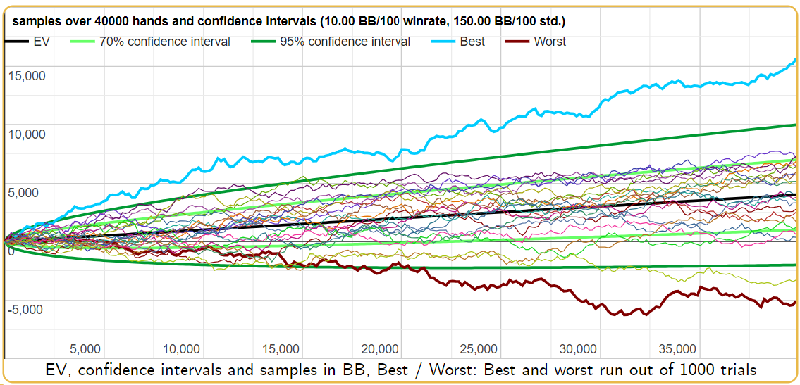
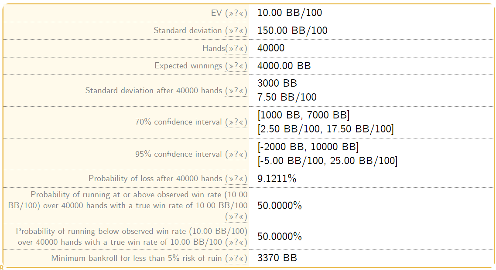

当你深入探索 PLO 扑克的世界时，了解扑克资金管理的复杂性对于长期成功至关重要。许多扑克玩家常常忽略了有效的资金管理如何显著改善你的财务状况，以及你的心理状态和游戏策略。这本全面的扑克指南旨在教你如何高效地管理资金，并解答诸如 “我需要多少买入？” 之类的迫切问题。让我们马上开始吧。

## 方差在 PLO 扑克中的作用

方差，即你的实际结果与预期结果的偏差程度，在你的扑克游戏中扮演着至关重要的角色。为了更详细地了解你的方差，像 Primedope 这样的网站可以根据你的以下数据提供统计图表：

- 胜率：扣除抽水和返水后，你每 100 手牌赢得的大盲注数量。从扑克追踪软件中获取此值，或者假设一个水平不错的玩家的胜率是 5BB，一个水平很高的玩家的胜率是 10BB。
- 标准差：你的胜率波动幅度。从扑克追踪软件中获取此值，或者假设 6 人桌 PLO 的标准差是 150。
- 手数：你进行统计分析的样本量。

例如，如果你的胜率是 10BB/100，并且每月玩 40,000 手 $1/2 级别的牌局，你预期能赢 $8,000，但仍然有 10% 的概率会输，甚至可能输掉 $10,000！听起来很有趣，对吧？欢迎来到刺激的 PLO 世界。

## 计算 PLO 所需的买入

通常建议，根据你所玩的级别，准备大约 100 个买入。如果你玩的是 $1/2 级别的游戏，理想情况下，你的扑克资金应该为 $20,000。然而，这并非一成不变的答案。以下几个因素会影响你实际需要的买入数量：

- 你的游戏优势：较高的胜率，例如 20BB/100，可以显著降低你的输钱概率，使你能够使用更少的买入。
- 买入深度：买入 50BB、100BB 还是 200BB 会影响游戏的波动性和风险。
- 游戏风格：更宽松、更激进的打法可能会带来更高的盈利，但也会带来更高的波动性。
- 其他收入来源：如果扑克是你的唯一收入来源，那么在管理扑克资金方面采取更保守的做法是明智的。

比较一位平均买入为 200BB 的激进型玩家和一位紧手买入为 50BB 的短筹码赢家，你会发现他们一个月内的亏损概率差异巨大，分别为 29% 和 1% 左右，因此你需要相应地调整你的资金需求。

## 有效资金管理的心理和策略优势

心理优势：糟糕的牌局会令人沮丧，尤其是在资金不足的情况下。妥善管理资金可以降低你的压力水平，并帮助你保持最佳状态。单局输掉一半资金可能会导致心态失衡，而输掉一小部分资金则有助于你理性看待波动，并专注于长期盈利目标。

策略优势：充足的资金可以让你做出更谨慎、更激进的决策。否则，你可能会变成一个胆怯的玩家，甚至最终导致亏损。你永远不想成为牌桌上那个胆小怕事的玩家，你当然也不想因为一手牌可能输掉大量资金而放弃有利可图的牌局。

## 扑克资金 vs. 生活资金

在 PLO 扑克和其他扑克游戏中，玩家通常会管理两个独立的资金：生活资金和扑克资金。扑克资金用于在特定级别进行游戏，并且对于根据胜率计算你的每小时收入至关重要。对于任何想要提升扑克水平的人来说，这都是一个关键的考虑因素。

与之相对的是，生活资金用于支付你的日常开支，并作为应急基金。它也是应对重大人生事件（例如结婚或购房）的储备金，甚至可以作为未来投资的资金来源。

仅仅依赖扑克资金，尤其是在它是你的主要收入来源的情况下，是一种不稳妥的做法，可能导致财务不稳定。同时管理这两个资金不仅能带来财务上的稳定，还能带来心理上的稳定，这对于优化你在 PLO 等扑克游戏中的表现至关重要。

采用提现策略，即每月从扑克盈利中取出一定比例用于支付账单、储蓄或投资，不仅能增强你的财务安全感，还能让你的 PLO 扑克胜利更有意义。

## 结论

开始你的 PLO 之旅时，假设你所选级别需要大约 150 个买入。你可以根据自己的技术水平、游戏风格和财务状况调整这个数字。记住，无论线上还是线下，有效的资金管理都是保持盈利的关键。