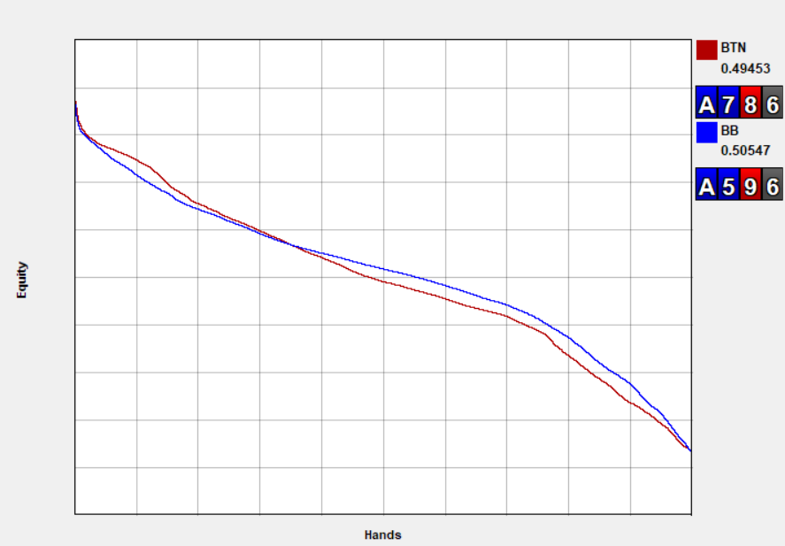
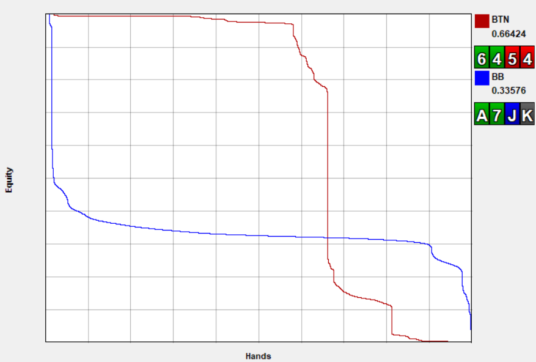
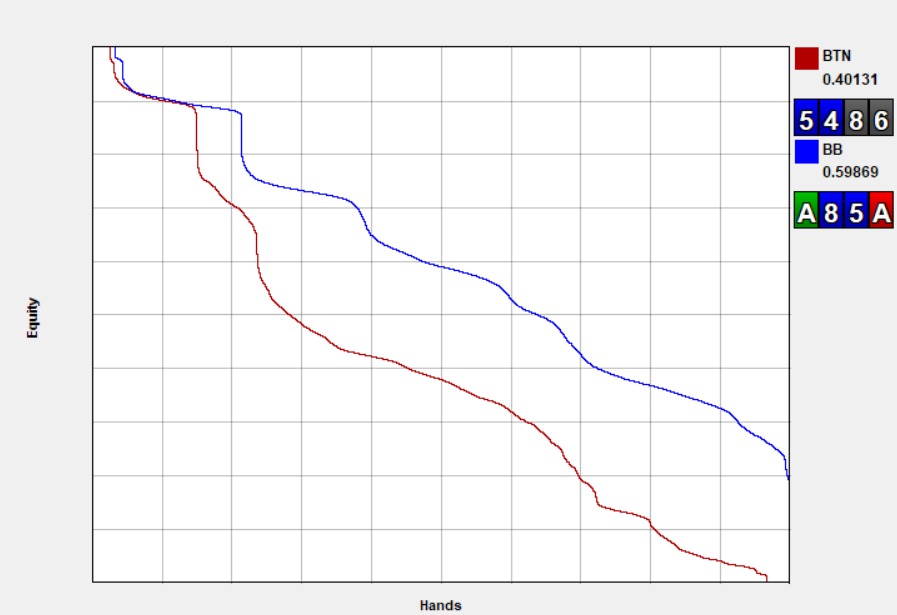
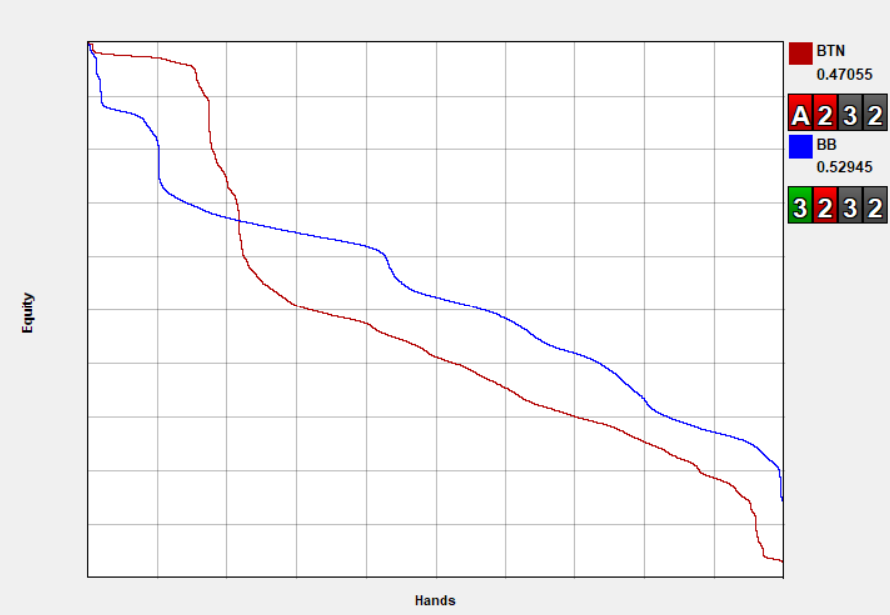

欢迎踏上探索扑克权益分布奥秘的启迪之旅。如果你渴望提升扑克技巧，理解权益分配的动态变化，并在牌桌上做出明智的决策，那么你来对地方了。从扑克基础到高级权益分布概念，本指南将助你成为一名技艺精湛的扑克玩家。

## 什么是扑克权益？

权益 - 你在扑克理论领域经常会遇到这个词。但它究竟是什么呢？你可以将权益想象成你在牌局中 “分到的那份”，代表在没有后续行动的情况下你赢得一手牌的概率。在这里，我们将深入探讨不同形式的权益，以及它们在扑克游戏中扮演的关键角色。

**三种权益类型**

1. 手牌 vs 手牌权益：例如，A-A-7-4 彩虹牌型对抗 K-K-Q-T 彩虹牌型，权益为 66.5%。
2. 手牌 vs 范围权益：A-A-7-4 彩虹牌型对抗双同花 K-K、Q-Q 和中等连牌，权益为 59.7%。
3. 范围 vs 范围权益：8% 的 3-bet 范围对抗 20% 的加注 - 跟注范围，权益为59%。

**计算权益**

使用 “4 + 2 法则” 可以简化权益的计算。需要快速估算吗？计算你的补牌，翻牌圈乘以 4，转牌圈乘以 2，瞧 - 你就得到了一个近似值。这个便捷的方法在听牌情况下是你的得力助手，能为你的打法提供宝贵的见解。想要深入探索扑克数学的世界，请务必阅读我们 [“扑克数学入门：循序渐进指南”](pc15.md)。

**利用原始权益应对全押场景**

原始权益是衡量一手牌获胜潜力的重要指标，尤其是在玩家考虑全押的情况下。在 PLO 等与传统德州扑克截然不同的扑克游戏中，原始权益的概念更加突出。PLO 中成牌和听牌之间全押的普遍性，为利用权益来确保胜利创造了绝佳的机会。

然而，原始权益存在局限性。它基于牌局会顺利进入摊牌阶段且不再发生任何行动的假设，而这往往与现实情况不符。这时，权益实现就显得尤为重要，它能够将牌局的真正潜力与扑克游戏的动态因素联系起来。

**权益实现：弥合与真实牌局的差距**

权益实现为权益概念引入了一个新的精细层面，充分考虑了真实扑克场景的复杂性。其核心在于将原始权益与 EV 计算相结合，从而更准确地展现一手牌的价值。

权益实现的公式如下：

权益实现率 = EV / (底池 x 权益)

考虑以下情况：你面对一个 $10 的底池，你的牌型对对手的范围有 50% 的权益。然而，在动态的公共牌面上，你处于不利位置，只有一个超对，没有其他牌型支持。虽然从原始权益来看，这手牌可能很强，但缺乏足够的支持来显著提高你最终摊牌的可能性，导致你的期望值只有 $2。在这种情况下，你的权益实现率仅为 40%，这意味着你可能只能获得底池中总权益的 $2，而你的总权益应该是 $5。

权益实现率弥合了理论计算和实际游戏之间的差距，它基于各种因素，提供了对一手牌真实潜力的更细致的理解。

## 什么是权益分布？

扑克中的权益分布是指将权益分布到你手牌范围的各个部分。想象一下，这是一张地图，它展示了你牌组中前 10% 的牌、后 10% 的牌以及介于两者之间的所有牌的牌力分布。通过将此分布绘制在图表上，你可以了解你的整体牌力格局，通常被称为牌力分布的 “形状”。

可视化这个动态概念涉及两个轴：

X 轴（水平轴）：该轴代表你牌组范围的百分比，显示不同牌力出现的频率，每条线代表从左到右的 0% 到 100%。例如，考虑图表上的第一个水平标记，它仅代表你牌组范围的 10%。这意味着特定牌力出现的概率仅为 10%。

Y 轴（垂直轴）：垂直轴揭示了当你的牌组与对手的牌对决时，你牌组范围中每个部分所代表的牌力大小。将你持有的权益百分比向上绘制成图表，你会发现左上象限代表你最强的手牌，而这些手牌频率最低。

**线性权益分布与极化权益分布**

线性分布

在权益分布领域，线性模式指的是你的权益均匀分布在所有牌型范围内。这种平衡通常在翻牌圈出现，涵盖了从诈唬到强牌（包括坚果牌）的各种牌型。附图展示了这种平衡，其中整体权益保持稳定，且权益分布在整个范围内保持均匀。

这种情况通常出现在翻牌圈双方牌型范围都与公共牌相互作用的场景中，此时牌型范围之间的相互作用让位于其他重要因素，例如位置优势、筹码深度和公共牌的演变。

极化分布

这种极化模式表现为手牌范围上下两端的明显分界线。这种现象在关键的河牌圈下注中尤为突出，此时对手的意图变得清晰 - 要么是持有最强牌，要么是在诈唬。

观察图表动态：主动下注的玩家（红线所示）在约 60% 的情况下拥有接近 100% 的权益。然而，在剩余的 40% 的情况下，他们的权益会急剧下降至接近于 0。这种情况使蓝线玩家陷入困境，他们需要准确评估赔率，并判断对手牌型中是否存在阻挡牌，以及是否应该跟注。想要更深入地了解阻挡牌的策略作用，请阅读我们关于 [“精通扑克阻挡牌（翻牌后）”](pc17.md)。

不同的权益分布如何影响我们的策略

当你拥有权益优势并考虑下注频率和金额时，了解你的权益分布与对手的权益分布如何匹配，对于做出最佳决策至关重要：

范围差距较大

当你的权益分布在整个牌型范围内出现显著差距时，就会出现一个战略机会。这表明你拥有范围优势，你的牌型分布全面优于对手。为了利用这一优势，可以考虑频繁下注，并经常使用较小的下注额（尤其是在牌型范围中间部分优势最大时）。这种策略旨在从对手较弱的牌型中榨取价值，并以低成本进行诈唬，从而最大化你的战略优势。

顶部差距巨大

你的权益分布上限存在显著差距，这赋予你 “坚果优势” - 即你持有更多顶级牌型。这种情况为你提供了通过策略性下注施加压力的独特机会。通过选择更大的下注额，你可以加大对手抓诈唬牌的压力，同时在持有优质价值牌时积累可观的底池。在这种情况下，权益分布图反映了你牌型范围顶端的明显优势。

## 结论

总而言之，我们已经深入探讨了扑克权益的复杂世界，从基本原理到权益分布等高级概念。掌握了这些知识，你就能在牌桌上做出明智的决策。

权益不仅仅是理论 - 它是一种实用的工具。从原始权益到权益实现，你现在已经掌握了这些概念的核心。此外，我们还揭示了权益分布在指导你的下注决策方面的战略影响。