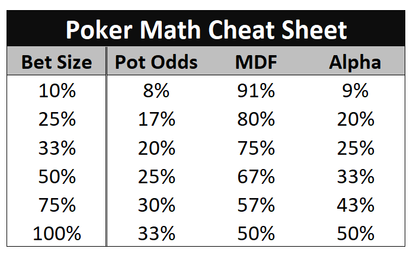

扑克数学是扑克的基础要素，它能帮助你做出 +EV 的决策。在本节中，我们将定义游戏中常用的几种扑克数学类型，帮助你在牌桌上做出明智的选择。同时，我们也会探讨这些简化理论的局限性，并讨论如何进行必要的调整以弥合理论与现实之间的差距。

**底池赔率**

理解底池赔率对于评估跟注的盈利能力至关重要。底池赔率代表跟注后达到盈亏平衡所需的权益。底池赔率的计算公式如下：

底池赔率 = 跟注金额 / 跟注后的底池大小

例如，假设转牌圈底池为 $20，Hero 面临 $10 的下注。跟注需要 $10，跟注后的底池大小为 $40 （原底池 + 对手的下注 + Hero 的跟注）。因此，所需权益为：

所需权益 = $10 / $40  = 25%

掌握底池赔率能让你根据手中牌的权益来判断跟注是否有利可图。

**Alpha**

Alpha 是成功诈唬的关键概念。它代表你的诈唬需要成功多少次才能达到盈亏平衡。Alpha 的计算公式如下：

Alpha = 风险 / (风险 + 回报)

例如，如果底池是 $20，Hero 在河牌圈下注 $10 试图偷底池，那么 Hero 冒着 $10 的风险去赢取 $30（下注 + 底池，如果对手不跟注）。因此，Alpha 为：

Alpha = $10 / $30 = 33%

这意味着 Hero 的诈唬至少需要 1/3 的概率成功才能盈利。

**最小防守频率（MDF）**

MDF 是防御对手诈唬的关键概念。它表示为了避免被对手利用，你应该跟注的范围（也就是你的跟注范围）的百分比。 MDF 的计算公式为：

MDF = 1 - Alpha 或

1 / (1 + 下注额占底池的百分比)

例如，如果底池为 $20，而 Hero 在河牌圈面临 $10 的下注，我们之前计算出的 Alpha 为 33%，那么 MDF 为：

MDF = 1 - 33% = 67%

或者，MDF 也可以计算为 1 / (1 + 50%) = 67%。

理解 MDF 可以帮助你做出更平衡的跟注决策，防止对手通过过度诈唬来占你的便宜。

下一节，我们将探讨现实的扑克数学与理论的差异，并阐明实现最佳游戏策略的重要考量因素。现在，这里提供一份常用下注额度的速查表：

## 现实与理论

虽然前面讨论的简化扑克数学概念提供了宝贵的见解，但认识到现实扑克场景中出现的细微差别和偏差至关重要。

**底池赔率**

**权益实现：**

实际上，底池赔率假设在当前回合的决策点之后，底池将过牌到河牌，你将实现你的权益。然而，这种过于简化的假设忽略了后续的下注轮次。仅仅因为拥有足够的权益就跟注一手边缘牌可能会导致不利的结果。随着牌局的进行，后续的下注可能会迫使你在摊牌前弃牌，从而无法实现你在之前回合所拥有的权益。为了做出更准确的决策，计算特定情况下的 EV 至关重要，EV 会考虑潜在的后续行动。我们将在后续文章中详细探讨 EV 的计算，以提升你的决策能力。

**隐含赔率（或反向隐含赔率）：**

在现实的扑克游戏中，底池赔率并不能完全反映未来的下注行为。虽然跟注可能缺乏赢得当前底池的直接权益，但如果你击中了一手极具迷惑性的听牌，并能诱使对手在未来下注较大金额，那么跟注的隐含赔率可能非常高。理解并运用隐含赔率进行决策，可以显著影响你的整体盈利能力，尤其是在未来价值远大于当前底池金额的情况下。

**最低防守频率**

**范围优势：**

最低防守频率（MDF）是抵御对手诈唬的有效工具，但在某些情况下，它可能无法准确代表最佳防守策略。例如，在某些情况下，你可能会发现自己相对于对手的范围处于严重的劣势，此时坚持使用 MDF 并不明智。一个经典的例子是，在翻牌前跟注对手的 3-bet，然后遇到 A-7-2 的彩虹翻牌，而你手中没有 A。考虑到对手的 3-bet 范围，在这种情况下，我们几乎没有领先牌，因此与 MDF 相比，我们可以选择过度弃牌。

**对手倾向：**

MDF 的计算假设对手会根据其下注额进行正确的诈唬。然而，现实中的对手通常会偏离平衡的诈唬频率，从而导致其诈唬与价值的比例出现偏差。为了优化你的防守策略，请密切关注对手的倾向，并相应地调整你的跟注范围。

**Alpha**

**有权益的诈唬：**

Alpha 计算通常假设诈唬时的权益为 0%，但实际上，即使被跟注，也可能存在一些权益。为了准确评估你的成功率，尤其是在多街诈唬中，在计划诈唬时，要考虑拥有一定权益的复杂性。

**多街诈唬：**

某些牌型在翻牌圈可能缺乏弃牌权益，但在转牌圈或河牌圈却有很高的成功概率。例如，用同花色的 A 在单调的翻牌圈下注，并在河牌圈连续开枪三次，可能会阻止对手跟注，即使他们在之前的几条街上用三条跟注，希望击中公共牌对子。评估多街诈唬场景需要对牌局未来的潜在发展有更深入的了解。

## 结论：

通过了解扑克理论与实际扑克之间的区别，你可以优化决策过程，在牌桌上做出更准确的判断。理解权益实现、隐含赔率、范围优势、对手倾向以及利用权益进行诈唬等因素对基础扑克数学的影响，将帮助你提升牌技。敬请期待后续文章，我们将深入探讨 EV 的计算，进一步提升你的扑克数学能力。