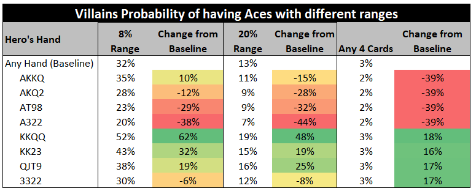

在瞬息万变的扑克世界中，理解阻挡牌是获得显著优势的关键。在扑克术语中，阻挡牌指的是通过保留某些特定牌来达到的策略性排除对手牌的效果。想象一下：你正在玩扑克，翻牌圈全是黑桃，而你手里拿着黑桃 A。恭喜你，你成功阻止了对手组成坚果同花！阻挡牌在 PLO 中扮演着至关重要的角色，因为游戏中经常会出现两极分化的情况，玩家要么拥有最强牌型，要么一无所有。如果你想提升你的扑克技巧，掌握有效运用阻挡牌的艺术至关重要。

## 从翻牌前开始：

在深入探讨高级阻挡牌策略之前，让我们从最基础的开始：翻牌前。你是不是经常会想：“我有一张 A，所以对手不可能有 A-A，我可以用 A-K-K-x 进行 4-bet？” 这是一种常见的初始想法，但要想真正战胜对手，你需要提升你的思维水平，不仅要考虑某一张特定的阻挡牌，还要考虑你所有的四张底牌。

## 进阶思维：

要真正发挥阻挡牌的作用，你必须仔细审视你的整手牌及其与对手潜在范围的互动。仅仅关注一张阻挡牌，并思考它是否足以支撑某个特定的行动，这是错误的。阻挡牌的价值取决于你其他牌的组合，这些牌既可以增强阻挡牌的影响，也可以抵消它的作用。

例如，假设对手的 3-bet 范围为 8%，开池范围为 20%，我们来探讨一下你手牌中有一张 A 的影响。结果非常有趣，也凸显了其他牌的重要性：

使用 ProPokerTools 及其定义的范围创建

## 边牌至关重要！

观察 8% 的对手范围，我们首先会注意到，拥有 A 仍然比没有 A 重要。然而，你会发现阻挡牌的 “价值” 差异很大，从降低 38% 的概率到实际提高 10% 的概率不等。而这一切都取决于边牌。让我们来分析一下：

**A-K-K-Q 增加了我遇到 A-A 的概率，但我手里有 A！？**

在这种情况下，8% 的 3-bet 范围通常以高牌为主，包含 K-K-x-x、Q-Q-x-x、K-Q-x-x 双同花等牌型。如果对手手中没有 K 或 Q，那么他 3-bet 范围的 60% 将是 A-A。然而，我们只阻挡了 2 张 K 和 1 张 Q，所以我们处于中间状态，这正是阻挡牌的本质 - 它们降低了对手范围内某些牌型的出现概率。如果我们把手牌调整为只包含一张 K（A-K），我们会发现遇到 A-A 的概率下降了。这说明边牌是如何影响主要阻挡牌（A）的价值的。在 A-K-K-Q 的情况下，我们不仅阻挡了 A，还阻碍了相当一部分非 A-A 的 3-bet 范围。相比之下，A-K 虽然也能阻挡 A，但对非 A-A 的 3-bet 范围的影响较小。

**为什么 2-2 如此重要？**

让我们用另一张阻隔牌 2-2 来探讨一下。你可能会疑惑，像 2-2 这样一手弱牌怎么能降低遇到 A-A 的概率呢？这种现象源于 “解除阻挡牌”，它们的作用与阻挡牌相反。持有 2-2，我们实际上解除了对手除 A-A 之外的更多 3-bet 范围的阻挡，具体来说，就是百老汇对子、双同花连牌等。要知道，8% 的范围相对较窄，在这个范围内包含 2 的牌型非常少。其中大多数可能包含 A-A，或者 A-K-K。持有 2-2，我们有效地限制了对手 3-bet 范围内 A-A 组合的数量，同时也解除了更高连牌的阻挡。事实上，除了 A-A 之外，包含 2 且会进行 3-bet 的牌型数量仅为 0.7%。

**强牌（无 A）：**

一个令人惊讶的例子是 K-K-Q-Q，面对 8%  的牌型范围。令人惊讶的是，你遇到 A-A 的概率高达 62%！这反驳了一个常见的误解，即没有 A 就意味着遇到 A-A 的概率与标准概率相同。但我们再次强调，除了 A-A 之外，其他 3-bet 的范围都被我们大幅限制了。

当面对更窄的牌型范围时，边牌的影响会更加显著，细微的变化都可能彻底改变结果。随着牌型范围的扩大，A 的存在就成为最重要的影响因素。

## 结论

恭喜！你已在掌握扑克翻牌前阻挡牌的艺术方面迈出了关键一步。有了这些知识，你现在可以策略性地驾驭 PLO 游戏，有效地利用阻挡牌来获得对对手的优势。记住，阻挡牌的真正威力不在于单张牌，而在于你所有牌与对手牌型之间的相互作用。要继续掌握翻牌后阻挡牌的技巧，请阅读我们系列文章的下一篇 [“精通扑克阻挡牌：你的 PLO 制胜终极指南（翻牌后）”](pc17.md)。