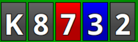

在之前的文章 [“精通扑克阻挡牌：你的 PLO 制胜终极指南（翻牌前）”](pc16.md) 中，我们介绍了阻挡牌的基础知识及其在翻牌前阶段的重要性。现在，让我们进入游戏树中更为复杂的部分：翻牌后阶段。

正如我们之前讨论的，阻挡牌是指那些会影响对手持有特定牌型概率的牌。让我们来探讨不同类型的阻挡牌及其策略意义：

**坚果阻挡牌：**

坚果阻挡牌你可能很熟悉，它可以成为你手中的强力武器。一个经典的例子是，当黑桃同花听牌出现时，你拿着黑桃 A。通过代表坚果牌，你可以利用对手不可能持有绝对最佳牌型的信息。

**价值阻挡牌：**

价值阻挡牌虽然不一定能阻挡坚果牌，但能有效阻止一些边缘牌型，尽管这些牌型仍然很有价值。巧妙利用价值阻挡牌可以有效地操控对手。例如，如果你在干燥牌面情况下持有较弱的顶对，你可以选择过牌 - 加注使更好的顶对弃牌，从而阻挡诸如顶三条和顶两对之类的牌型，进而增加你的激进性。

**未来阻挡牌：**

未来阻挡牌是指那些能在接下来的回合中获得巨大价值的阻挡牌。通过尽早利用这些阻挡牌，你可以积累底池，并在阻挡牌发挥作用时占据有利位置。例如，与其等待同花出现后再用最强的同花阻挡牌下注，不如在同花出现之前就用黑桃 A 积极下注，成功淘汰较弱的同花听牌和其他边缘牌型，同时保留一张强牌，以便在后续回合进行诈唬。

## 何时使用阻挡牌：

**诈唬：**

使用阻挡牌诈唬是一种常见的策略，但关键在于策略性地使用。仅仅依靠坚果阻挡牌进行诈唬可能会犯错。考虑以下几种情况，以判断何时适合使用阻挡牌诈唬，何时不适合：

- 适合诈唬的情况：当你阻挡对手的价值牌、抓诈唬牌，或者不阻挡对手可能立即弃牌的牌时。这些阻挡牌可以提高你的诈唬成功的概率。
- 不适合诈唬的情况：如果你持有摊牌价值牌，或者阻挡了对手可能持有的破产听牌，则应避免诈唬。在这些情况下，诈唬不太可能带来积极的结果。

**抓诈唬：**

在判断对手是否诈唬时，阻挡牌会显著影响你的决策过程。确保你阻挡的是对手最有可能持有的牌型至关重要。例如，如果你持有 T-T，这手牌可以有效阻挡对手的坚果顺子，而对手下注底池大小，那么他们要么持有坚果顺子，要么就是在诈唬。在这种情况下，你可以用抓诈唬的牌更谨慎地跟注，因为你可以忽略对手两对击败你顶对的可能性，他们很可能会选择过牌。然而，如果对手下注 1/3 底池，你的 T-T 可能就不那么重要了，因为他们可能持有更小的顺子或带有阻挡顺子的三条。

**价值下注：**

在决定是否进行价值下注以及下注多少时，考虑你的阻挡牌至关重要。你需要判断对手是否有可以跟注的牌型，或者是否有你想给他们诈唬机会的牌型。例如，假设你没能凑成同花听牌和顺子听牌，而你手里有两对。在这种情况下，你有效地阻挡了对手的两对等价值牌，同时不阻挡所有顺子和同花听牌。这增加了对手破产听牌的可能性。因此，在河牌圈过牌引诱对手诈唬可能是最佳策略。

- 有利于价值下注：不阻挡对手的抓诈唬牌，并阻挡了破产听牌。这些阻挡牌增加了对手跟注你价值下注的可能性。
- 不利于价值下注：阻挡了可以跟注的弱牌，或者不阻挡破产听牌。在这种情况下，你的价值下注可能效果不佳，因为对手更有可能弃牌。

## 边牌的重要性：

正如我们在之前的文章中讨论过的，许多玩家存在一个常见的误解，即他们只关注一张牌，并仅根据这张牌来评估阻挡牌的价值。实际上，在 PLO 中，你手中有四张牌，每一张都会影响你主要阻挡牌的价值。

让我们来看一个示例牌面：

假设你在这副牌面上拿着黑桃 A，但没有同花。你已经尝试用两轮下注来诈唬对手，但收效甚微。现在，你面临着是否进行第三枪的抉择。假设你的牌是 A♠️K♥️9♥️9♣️。

虽然你确实有黑桃 A，这意味着你的对手不可能拿到坚果牌，但这手牌并不适合诈唬。原因如下：

1. 摊牌价值：你的 K 可以有效对抗像 K-5-6-x 这样跟注了两轮的牌。这赋予你一定的潜在摊牌价值，从而降低了诈唬的有利性。
2. 价值阻挡：你阻挡包含 K 的价值牌，对手可能已经弃牌了，因为同花已经成牌。这降低了诈唬成功的几率。
3. 阻挡顺子听牌：你也阻挡了对手可能跟注的顺子听牌，这些听牌现在会立即弃牌，从而降低了你诈唬的有效性。
4. 阻挡红桃：你的两张红桃阻挡了翻牌圈的后门同花听牌，降低了对手在翻牌圈用边缘牌型（持有后门同花听牌）跟注你的可能性。

考虑到这些因素，你的对手很可能也持有同花，这使得你的诈唬成功的可能性降低。

**选择好的边牌：**

在同样的场景下，假设你拿着一手像 A♠️Q♣️4♣️4♦️ 这样的牌，但没有同花阻挡牌。这手牌就必须诈唬，因为：

1. 不阻挡价值牌：你不阻挡所有对子（现在这些对子必须弃牌），增加了你诈唬成功的几率。
2. 不阻挡破产顺子听牌：你的牌不阻挡破产顺子听牌，使得你的对手更有可能没能成顺子。
3. 没有摊牌价值：由于没有显著的摊牌价值，你过牌的理由就更少，这鼓励你进行诈唬。

## 阻挡牌的形态：

另一个关键方面是理解阻挡牌的价值是如何在不同的回合中变化的。这就是为什么在决定是否值得用阻挡牌构筑底池时，考虑它们在不同公共牌型下的未来价值至关重要。

例如，假设翻牌圈出现 K-8-7，并且有两张黑桃。如果你手持 9-9 而没有黑桃，你可能会犹豫是否下注。虽然你拥有不错的顺子阻挡牌，但黑桃随时可能出现，使你的阻挡牌失效。同样，如果转牌圈出现顺子，而你的对手有两对和同花听牌，他们可能不会弃牌，这会让你陷入不利的局面。

在决定是否用顺子阻挡牌下注时，优先考虑牌面结构较为稳定的情况，因为在河牌圈你更有可能持有坚果顺子阻挡牌。

**对对手跟注范围的影响：**

你还必须考虑你的阻挡牌如何影响对手在前一轮的跟注范围。例如，在 A♠️K♥️9♥️9♣️ 的例子中，由于手牌的可玩性较差，而你的阻挡牌可以阻挡对手的听牌和对子，因此你原本可以在翻牌圈下注。然而，由于你阻挡了所有这些牌型，一旦对手跟注你的翻牌圈下注，他们更有可能持有价值牌。因此，你的阻挡牌的价值显著降低，使其成为随后过牌并评估河牌圈牌型的更佳选择。

## 结论

总之，对于任何想要提高底 PLO 牌技的玩家来说，理解并有效运用翻牌后的阻挡牌至关重要。通过识别不同类型的阻挡牌及其策略意义，玩家可以做出更明智的决策，获得竞争优势，并提高在牌桌上的胜率。将阻挡牌融入诈唬、抓诈唬和价值下注策略可以带来更丰厚的回报。此外，考虑边牌对阻挡牌价值的影响，可以让玩家做出更明智的选择，并在多轮游戏中调整策略。通过练习和运用这些技巧，玩家可以提升翻牌后的打法，从而提高在 PLO 中的整体表现。