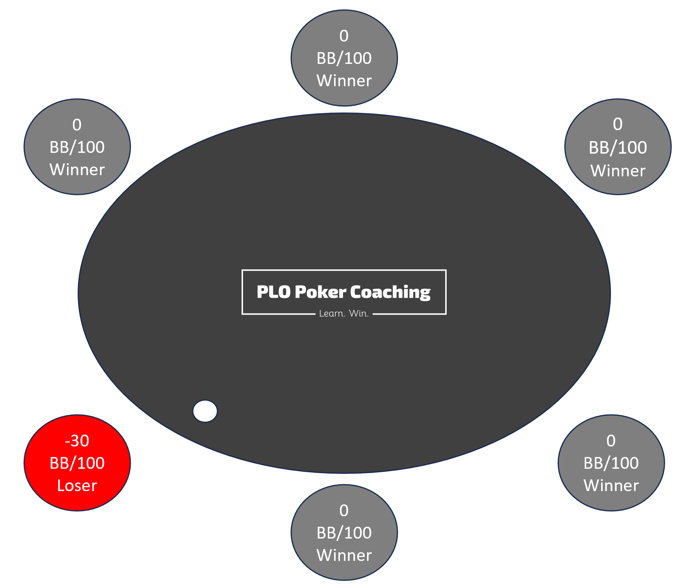
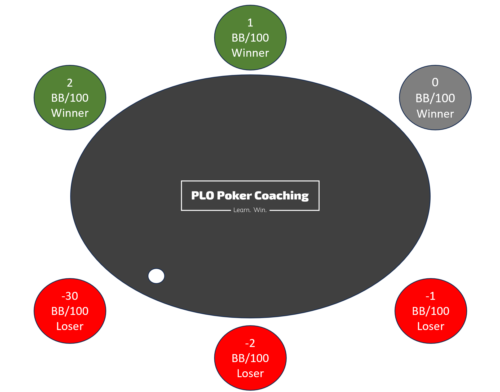
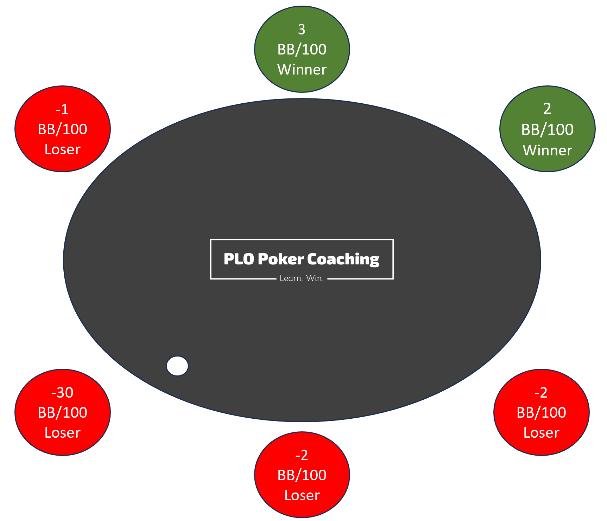

在扑克中，最关键的计算远不止于牌面和赔率 - 而是如何最大化盈利。这就是 “牌桌盈利” - 一个常被误解的扑克瑰宝，它综合考虑了总抽水、返水、玩家优势和牌桌位置等因素。这个经常被忽视的方面，是将普通的牌局变成盈利牌局的关键，即使是经验丰富的职业玩家也不例外。

## 什么是有效抽水？

有效抽水是指你支付的总抽水减去你获得的任何返水和促销优惠。扑克网站会在其网站上明确说明抽水结构，以每个底池的百分比来表示，并设定上限。例如，5% 的抽水，上限为 $4，意味着他们会从每个底池中抽取 5% 的金额（通常仅在翻牌后抽取），最高不超过 $4。

扑克网站通常还会提供返水，也就是将你支付的抽水的一部分返还给你作为游戏奖励，返水比例从 0-50% 不等。

有效抽水 = 抽水 - 返水

好吧，这只是个开始。虽然看起来很简单，但大多数人 - 包括许多职业玩家 - 往往就此止步。让我们深入探讨，弄清楚一款游戏是否真的可以战胜，而这需要我们定义你的扑克优势。

## 如何确定你的扑克优势：

虽然了解有效抽水至关重要，但真正改变游戏规则的是确定你的优势。严肃的玩家会使用胜率来衡量自己的表现，胜率以每 100 手牌的大盲注（BB/100）来衡量。这个比较指标显示了你与其他玩不同级别和不同手数的玩家相比的成功程度。例如，如果你玩的是 $1/2 PLO，100 手牌赢了 $20，那么你赢了 10 BB，扣除抽水后你的胜率就是 10 BB/100。

因此，为了将抽水纳入计算，我们也需要以 BB/100 来考虑抽水。使用 HM3 或 DriveHUD 2 等扑克追踪软件可以轻松实现这一点，并显示你实际支付的抽水（以 BB/100 为单位）。不过，我在下面列出了一些常见的 5% 抽水结构及其不同上限的估算值（请注意，这取决于你的游戏风格）：

- 3 BB 上限（例如，在 $1/2 的游戏中，上限为 $6）= 13 BB/100
- 2 BB 上限（例如，在 $1/2 的游戏中，上限为 $4）= 11 BB/100
- 1.5 BB 上限（例如，在 $1/2 的游戏中，上限为 $3）= 10 BB/100

## 了解你的对手：

确定你的优势也需要对对手进行深入的群体分析。将玩家分为几类，例如实力强劲的常客、实力较弱的常客、鱼和鲸鱼。为了保证估算的准确性，请控制类别数量。在数据库中对玩家进行分类后，为这些特定群体分配胜率。

现在，你可以计算出你相对于牌桌上特定类型对手的优势。例如，如果牌桌上有你和另一位实力强劲的常客，你们的胜率都是 10 BB/100，那么你们彼此之间的优势为 0。

## 现在让我们让它盈利：

运用这些知识是找到盈利游戏的关键。首先要计算出整桌玩家支付的有效抽水。假设每位玩家支付 10 BB/100 的抽水，并获得 50% 的返水，那么每位玩家的实际抽水为 5 BB/100。将实际抽水乘以牌桌上的玩家人数（例如 6 人），即可得到牌桌的实际抽水，例如 30 BB/100，这部分费用最终支付给扑克网站。

举个简单的例子，我们需要一位输掉 -30 BB/100 的 “鲸鱼”（指输掉 30 BB/100 的玩家），才能使其他 5 位水平相当、彼此之间没有优势的玩家达到盈亏平衡。乍一看，这似乎并不盈利：我们只是将 “鲸鱼” 的损失分摊到其他玩家身上，而这仅仅是为了弥补我们支付给扑克网站的实际抽水。看起来并不乐观。我们的示例牌桌可能如下所示：

但我们还没有考虑牌桌上的位置，而位置对盈利能力至关重要。坐在 “鲸鱼” 左边的玩家几乎可以凭借有利位置参与所有对抗弱手玩家的底池。如果我们仍然假设其他五位常客的水平相同，那么这将使有利位置玩家获得额外的优势，提高胜率，而其他玩家则会因此处于劣势（扑克是一个零和游戏）。这样看来，“鲸鱼” 左边的玩家似乎更有胜算：

然而，请记住，并非所有普通玩家的水平都相同。考虑对手胜率类别的不同，可以更好地评估你的处境。例如，即使你坐在 “救世主” 的位置上，旁边是一位 “鲸鱼” 玩家，但如果左边是两位实力强劲的 PLO 高手，你的处境也可能变得岌岌可危，情况可能如下所示：

## 结论：提升你的扑克水平

了解有效的抽水、你的优势以及牌桌位置的动态变化是提升扑克胜率的关键技能。忽略这些因素甚至会让你难以战胜实力较弱的玩家。花些时间分析你支付的抽水、你对对手的优势以及你的位置优势 / 劣势。

掌握这些关键计算，释放盈利游戏的全部潜力。领悟其中的策略细微之处，无论在线下牌桌还是线上牌桌，你都能持续取得胜利。记住，你玩得越聪明，运气就越好。