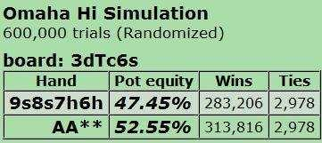

# 第 1 部分：简介

## 1.1 简介

这是《从零开始学习 PLO》系列文章的第 1 部分。目标受众是微级别和低级别玩家，他们有一些有限注或无限注德州扑克经验，但几乎没有或完全没有 PLO 经验。我的这个系列的目的是系统而有条理地教授基本的 PLO 策略。

在第 1 部分中，我将首先讨论本系列的背景及其结构。然后我将概述目前市场上（在我看来）最好的 PLO 学习材料，我们将以从文献和视频中学习基本 PLO 理论。结束第 1 部分，我们将在第 2 部分开始讨论 PLO 策略。

### 1.1.1 本系列文章的背景

当我在 2005 年春天开始玩扑克时，有限注和无限注德州扑克是主流游戏，而普通玩家在这两种游戏中的技术都很低。要想从有限注或无限注德州扑克低级别升至中级和高级，你只需要正常的智力和一些专注的努力。

有了这些，你可以在几个月内从低级升至中级，并开始赚大钱。许多获胜的玩家只是在打牌中学习必要的技能和策略，并没有做任何特别的事情来继续系统地提高。

这种日子基本上已经结束了。自线上扑克的黄金时代（2003-2006 年）以来，有限注和无限注德州扑克已成为更难的游戏。这有几个原因，但毫无疑问，普通玩家的进步很大程度上源于通过书籍、论坛和培训视频使好的策略成为常识。

线上扑克玩家群体中不乏高手，自 2003 年线上扑克爆发以来的六年间，这些人一直在练习、分析和探讨最佳策略。这促成了有限注和无限注德州扑克策略的快速发展。如今，你很容易就能找到一些低级别牌桌，其竞争激烈程度丝毫不亚于几年前的中级别牌桌。如果你想从德州扑克的低级别开始，逐步晋升到中高级别，就必须做好付出巨大努力的准备。

那么，在如今的线上环境中，雄心勃勃的玩家会面临哪些挑战呢？首先，你必须愿意付出艰辛的努力，持续系统地提升自己的技能。否则，随着对手水平的不断提高，你的优势将会逐渐消失。其次，你必须在游戏选择上投入更多精力，不仅要关注你目前玩的游戏，还要学习新的游戏，以便有更多高质量的对局可供选择。

这让我们想到了底池限注奥马哈（PLO）。对我来说，PLO 很长一段时间都没有引起人们的注意。我听到很多人说它很有趣，利润很高，但直到 2008 年我才开始尝试，而且我玩它主要是为了改变（当时我玩德州扑克）。我玩得不亦乐乎，但对游戏应该如何玩却知之甚少，但我逐渐开始对游戏有了感觉。我还观察到，这款游戏中的普通玩家经常犯可怕的错误，玩家池的技能水平让我想起了过去的德州扑克游戏。

这给了我学习这款游戏的动力。因此，在 2009 年秋天，我决定开始系统的学习，从零开始自学扎实的 PLO 策略。由于我喜欢写扑克理论，我决定为低级别玩家撰写一系列文章。

在本系列中，我将介绍我在学习过程中使用过的 PLO 策略和概念，我的目标是为初学者制定一个 PLO 学习理论框架。我希望本系列能够帮助读者开始学习 PLO，并希望他们可以将其作为学习 PLO 策略和学习如何思考 PLO 的起点（这可能与我们思考德州扑克的方式非常不同）。

### 1.1.2 本系列文章的计划

我之前曾为有限注德州扑克写过一个系列文章《从零开始学扑克》，其中我讨论了有限注德州扑克的基本策略，并同时进行了一个资金积累项目（将 1000 BB 的有限注德州扑克资金从 $0.25-0.50 逐步积累到 $5-10）。我计划在本系列文章中使用相同的形式。我们将从翻牌前策略和起手牌强度原则开始，然后我们将转到翻牌后游戏。

此外，“大赌注扑克”（底池限注和无限注）的一般原则将成为整个系列的共同点。PLO 的许多策略原则都是游戏下注结构（底池限注）的结果，而不是游戏类型（翻牌游戏，我们使用 4 张起手牌，并且我们必须使用手中的 2 张牌和公共牌中的 3 张牌）的结果。将任何扑克游戏都视为下注结构和游戏类型的结合，就能更容易地理解为什么正确的策略是这样的。

我们还将在本系列文章中包括一个微级别 / 低级别资金积累项目，这样做有几个很好的理由。本系列文章面向初学者，这意味着大多数目标读者将在最低级别进行游戏。我从未磨练过微级别 PLO，所以我应该确保我讨论的策略适合读者正在玩的级别。这意味着我需要亲自积累这些级别的经验。

磨练项目也将成为可用于本系列文章的场景和手牌的来源。最后，磨练项目有望让我们了解一个稳健而自律的玩家在微级别和低级别下可以实现的胜率，以及使用合理的资金管理方案可以多快提高级别。这可以为刚接触游戏的小级别玩家提供灵感。

那么从哪里开始磨练呢？我决定从本系列文章起始资金 $250 开始，因为我的印象是大多数微级别玩家都是从类似的资金开始的。下一步是选择资金管理方案，我选择了一个我称之为 “50 + 10” 的方案。这意味着最低资金为 50 买入（Buy in 简写为 BI），因此我们从 $5PLO 开始，只要我们有当前级别的 50 个买入加上下一个级别的 10 个买入，我们就可以开始尝试下一个级别。

如果我们输掉了尝试的资金，我们会重新开始并再次尝试（为下一个级别积累 10 个新买入并再次尝试）。因此，我们每次尝试 10 个买入，并且当资金下降到前一个级别的 50 个买入时，我们总是会降级。

下一个问题是项目应该在哪里结束。我喜欢挑战，所以我计划为本文准备好资金，以尝试 $200PLO。这意味着当我们有 50 个买入（$5000）用于 $100PLO 以及 10 个买入（$2000）用于 $200PLO 时，我们结束项目。换句话说，我们将把我们的 $250 变成 $7000。

我们实际上需要为这个项目使用多少时间（例如多少手牌）？首先，我们找出必须赢得不同的级别多少（最低）买入：

- **$5PLO 到 $10PLO：** 在 $5PLO 时磨练 20 BI（$100），并将积累至 50 + 10 BI（$350），以尝试 $10PLO。
- **$10PLO 到 $25PLO：** 在 $10PLO 时磨练 40 BI（$400），并将积累至 50 + 10 BI（$750），以尝试 $25PLO。
- **$25PLO 到 $50PLO：** 在 $25PLO 时磨练 40 BI（$1000），并将积累至 50 + 10 BI（$1750），以尝试 $50PLO。
- **$50PLO 到 $100PLO：** 在 $50PLO 上磨练 35 BI（$1750），并将积累到 50 + 10 BI（$3500），以尝试 $100PLO。
- **$100PLO 到 $200PLO：** 在 $100PLO 上磨练 35 BI（$3500），并将积累到 50 + 10 BI（$7000），以尝试 $200PLO。

如果每一次尝试升级都成功，我们必须投入 20 + 40 + 40 + 35 + 35 = 170 个买入。如果我们（有点武断地）假设平均胜率为 7.5 ptBB/100（ptBB = 2 x BB），我们平均每 1000 手牌将获得 1.5 个买入。所以我们必须至少玩 170 /（每 1000 手牌 1.5）= 113,000 手牌。

对于一个具有最低职业自豪感的磨练者来说，这是小菜一碟。我们在这里做了一些假设，所以请谨慎对待这个估计。但我们可能接近现实。（顺便说一句，如果我还没有说过，我们在这里玩 6 人桌。我再说一遍，不是满员桌。）

## 1.2 学习 PLO 的资料和扑克工具

以下的资讯基本过时了，可以略去。

直到最近，在书籍和辅导视频市场上还找不到太多关于 PLO 的内容。但在过去几年里，已经出版了几本好书，大多数培训网站也开始制作大量高质量的 PLO 视频。

在本节中，我将概述（我认为）最好的 PLO 书籍、视频和工具。我还将为那些想要系统学习 PLO 理论和概念的人设计一个简短的学习计划。

### 1.2.1 PLO 书籍

以下是目前市场上（在我看来）最好的 PLO 文献的简短评论：

**《PLO 扑克 - 大局策略》（Hwang 2008）**

就我而言，这本书的出版日期标志着优秀 PLO 文献的元年。这本书讨论了满员桌策略，其主要主题是当我们打深筹码时建立有利可图的场景。为了实现这一点，我们需要了解起手牌结构，在我看来，这是这本书真正出彩的地方。

无论我们打的是满员还是短人桌 PLO，我们都需要知道什么是好的起手牌。我们还需要知道哪些牌适合赢得大底池，哪些牌更适合赢得小底池。

截至目前，Hwang 对 PLO 起手牌的讨论是最详尽的。他根据类型和强度对起手牌进行分类。他还彻底解释了结构缺陷，以及参与结构不良的牌型的后果。

Hwang 在深筹码满员桌游戏中的主要游戏计划是在参与大底池的游戏中建立优势，这就是为什么他在书中投入了大量篇幅来理解起手牌的强度和结构，以及不同类型的起手牌更喜欢哪种类型的翻牌后场景。

我们将玩 6 人桌，但 Hwang 对起手牌的讨论对我们来说非常有价值，因为我们经常会发现自己处于 “大底池” 的情况，我们的好牌与另一手好牌在大底池中的发生对抗。

Hwang 随后转向翻牌后游戏，并讨论了 PLO 的翻牌后 ABC 扑克原则。除了用优质牌玩大底池外，我们还需要熟练掌握小底池游戏，Hwang 讨论了大底池和小底池翻牌后场景。

**《高级 PLO - 第 1 卷：小球和短人桌玩法》(Hwang 2009)**

这是《PLO 扑克 - 大局策略》的后续作品，也是计划出版的 3 本高级 PLO 系列书籍中的第一本。Hwang 假设读者熟悉他的第一本书中列出的原则，现在他向前迈出了一大步。这本书的主题是利用位置，Hwang 通过讨论和手牌示例展示了如何充分利用位置为我们带来新的获利机会。它还允许我们放宽起手牌要求，有时甚至放宽幅度很大。Hwang 第一本书中的 “大局策略” 仍然是我们的核心策略，但通过学习利用位置，我们将获得更多机会在我们怀疑没有人有太多牌的情况下赢得小底池（这在单挑和短人桌底池中经常出现）。Hwang 把这种策略称为 “小球”，这是他在短人桌比赛中喜欢使用的策略。

**《职业 PLO 的秘诀》 (Slotboom 2006)**

这本书主要针对满员玩家，是学习短筹码策略的书（我们的理念是短筹码只会让人烦恼，但这并不意味着它没有利润）。Slotboom 详细解释了他的（有时非常规的）满员 PLO 策略，包括短筹码策略和深筹码策略。他没有像 Hwang 那样给出一个完整的游戏计划，但他解释了他对 PLO 的看法，这应该会给读者很多思考（至少对我来说是这样）。

**《短人桌 PLO 的秘诀》（Slotboom / Hollink 2009）**

与 Hwang 一样，Slotboom 在他的满员桌书之后又写了一本关于短人桌 PLO 的书。他使用的结构与第一本书类似，这意味着他讨论了自己的策略，并解释了这些策略如何以及为什么对他有用。他详细描述了从满员桌转向短人桌游戏的过程（这变得必要，部分原因是满员桌游戏充斥着读过他第一本书的短筹码玩家），并讨论了他必须做出的战略调整。

本书的后 1/3 部分由合著者 Rob Hollink（一位著名的高额玩家）撰写。Hollink 分析了他自己在 $25-50 到 $200-400 的级别下玩的 33 手 PLO 手牌。许多手牌涉及众所周知的线上昵称，如 durr、Urindanger、OMGClayAiken 等。

**《你的 PLO 有多好？》（Reuben 2003）**

这本小书堪称精品，收录了 57 道取自实战的牌局测验。Stewart Reuben 是一位非常松凶的玩家，对起手牌的要求等问题持较为宽松的态度。这种打法对他来说非常有效，因为他擅长实战深筹码游戏。但试图在如今 100 BB 买入的线上游戏中模仿他的打法，很可能会导致资金破产。

但这不是一本你为了复制策略而阅读的书，你阅读它是为了训练你的 PLO 思维过程。我建议你认真对待测验，并在检查答案之前尽可能地解答它们。每手牌都会给你一个分数，Reuben 很好地解释了他推荐的策略。

通过将自己的思维过程与强手的思维过程进行比较，你可以学到很多东西。你有时会发现自己的玩法中存在逻辑上的不一致，并且学会思考以前没有考虑到的事情。

### 1.2.2 PLO 视频

内容过时，略去。

### 1.2.3 扑克工具

我们需要两样东西：

**1. Omaha Manager**

Omaha Manager 是 HoldemManager 的 Omaha 版本，该程序已成为 PLO 牌谱记录软件（HUD）的标准，如果你要使用牌谱记录软件（你应该使用），请使用此程序。

大多数读者应该都知道线上扑克中牌谱记录软件，但我们也将在以后的文章中讨论这一点。

**2. ProPokerTools Omaha Simulator**

ProPokerTools Omaha Simulator 是一款权益计算器，既可用于特定手牌，也可用于手牌范围。你还可以使用通配符（例如，使用 AA** 可以计算任何 A-A-x-x 牌型。）。

这是训练你对不同场景中不同类型手牌权益的理解的必不可少的工具。使用此工具的一个好方法是在每场游戏后分析重要的手牌。例如，你可以计算你玩过的所有大底池的权益（例如，你在某手牌中全押的所有底池）。

**示例**

你正在玩 $5PLO（盲注 $0.02 和 $0.05）。UTG（$5）加注底池到 $0.17，你（$5）持有 9♠8♠7♥6♥ 在 BTN 3-bet 到 $0.40（略低于底池），盲注弃牌，UTG 4-bet 加注底池到 $1.27，你跟注（并且你假设 UTG 的 4-bet 意味着他几乎总是有 A-A-x-x）。

**Flop：**3♦T♣6♠ （$2.61）

UTG（$3.73）下注 $2.61，你（$3.73）加注全押，UTG A♠A♣K♦2♣ 跟注（正如你所假设的）。

**Turn：**3♦T♣6♠K♥ （$10.07）

**River：**3♦T♣6♠K♥4♠ （$10.07）

UTG 以 A-A 获胜。你现在想知道在假设 UTG 持有 A-A 的情况下你的翻牌加注是否正确。

你选择在有利位置用优质双同花连牌进行 3-bet，以便与加注者进行单挑。他 4-bet 到最大下注额度。你认为这意味着他持有 A-A-x-x，于是跟注，计划在翻牌圈击中足够权益对抗他预期的牌型时，就全押。翻牌圈你击中低对子 + 内嵌包牌 + 后门同花听牌，并按计划全押。

现在我们可以使用 ProPokerTools 来计算我们对 A-A-x-x 的翻牌权益：

在这个翻牌中，我们几乎与 A-A-x-x 是掷硬币，而且由于底池为 $2.61，后手剩下 $3.73，我们承诺下注，因此我们全押。这意味着我们投资 $3.73 赢得总底池 $2.61 + 2 x $3.73 = $10.07（翻牌前底池 + 双方剩余筹码），我们有 47.45% 的权益，因此我们在翻牌时全押的 EV 为：

EV = 0.4745($10.07) - $3.73 = +$1.05

我们在翻牌时全押赚了 $1.05。这比弃牌（EV = $0）要好，因此加注全押是一种有利可图的打法。

## 1.3 学习计划

以下是针对那些想要了解基本 PLO 策略的人提出的 “PLO 课程” 建议：

### 1.3.1 学习《PLO 扑克 - 大局策略》（Hwang）

（你可以跳过关于奥马哈高 - 低的最后两章）

彻底学习第 4 章（*起手牌和翻牌前打法*）。Hwang 首先根据类型对起手牌进行分类：

1. 大牌和 A 高百老汇包牌
2. 顺子牌
3. A 同花牌
4. 对子 + 
5. A-A
6. 边缘牌

<aside>

Broadway：A K Q J T 为人头牌，本书中称为百老汇牌。

</aside>

然后他根据质量对它们进行分类：

1. 优质牌
2. 投机牌
3. 边缘牌
4. 垃圾牌

记住这两种分类方案以及属于它们的所有手牌。然后，你将有一个框架来快速评估你的起手牌的质量，并且你还将很好地理解不同类型的起手牌所偏好的不同条件。

例如，如果你拿到了 A♥K♦Q♥9♣，你会立即将其标记为 “A 高百老汇包牌”，并且你会知道这是一手可以从任何位置加注的优质牌。但是将这手牌更改为 A♥K♦Q♥2♣，你现在知道你有一手 “A 同花牌”，它属于 “边缘牌” 类别，并且需要有利位置才能打。

请注意，我们并不是试图用这些分类来构建翻牌前方案。我们想要的是 “训练方法”，可以帮助我们快速评估我们拿到的手牌的质量和可玩性。

另外，在放下这本书之前，请确保你理解翻牌后 ABC 打法的原则，特别是大底池情况和小底池情况之间的区别。

### 1.3.2 在 Deucescracked.com 上学习视频系列

<aside>

内容过时，略去。

</aside>

### 1.3.3 多练习

现在你已经学习（并希望消化）了基本的 PLO 策略，下一步就是在自己的游戏中实施这一策略。坐下来尝试你所学到的东西。你可能会经常发现自己处于不知道该做什么或犯大错的情况。这很好，因为它让你有机会学习和消除游戏中的漏洞。

养成在每场牌局后复盘你的手牌的习惯。选择几手牌并系统地分析它们（并使用 ProPokerTools 来训练你对权益的理解）。仔细考虑所涉及的战略概念，如果有必要，回到我们学习过的上一本书或视频系列，看看你在激烈战斗中的逻辑与你学到的东西相比如何。

你是否误解、忘记或忽略了什么？你是否在这种特定情况下使用了错误的概念？如果是这样，请纠正自己的想法，以便将来避免犯同样的错误。

### 1.3.4 学习《高级 PLO - 第 1 卷：小球和短人桌玩法》（Hwang）

这是一本内容较多且难度较高的书籍，你需要花些时间学习其中的策略。建议你在熟练掌握基本的 ABC 策略（包括翻牌前和翻牌后策略）之后再开始研读。我们将在后续文章中运用本书中的许多概念来构建我们自己的 PLO 策略，其中 Hwang 的小球策略尤其值得我们关注。

### 1.3.5 尽可能多地学习视频尽可能多地玩

练习，练习，练习，并使用视频来获取新的想法。当你看到教练做一些你觉得有趣的事情时，你应该做笔记以确保你了解发生了什么。这将使你更容易将新概念应用到你自己的游戏中。

## 1.4 总结

我们讨论了《从零开始学习 PLO》系列文章的背景和未来计划，以及我们将使用的学习材料和工具。我们还设计了一个简短的 PLO 入门学习课程。

在第 2 部分中，我们将开始制定自己的 PLO 策略。我们将从基本的 PLO 原则和起手牌选择和翻牌前打法的原则开始。