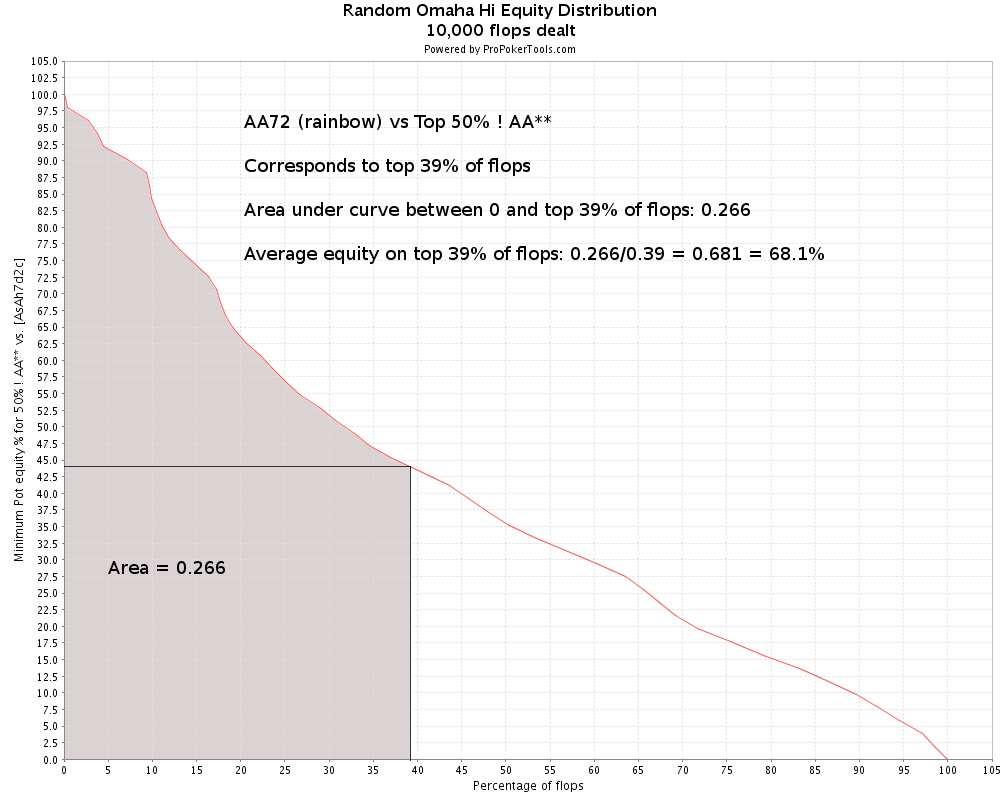
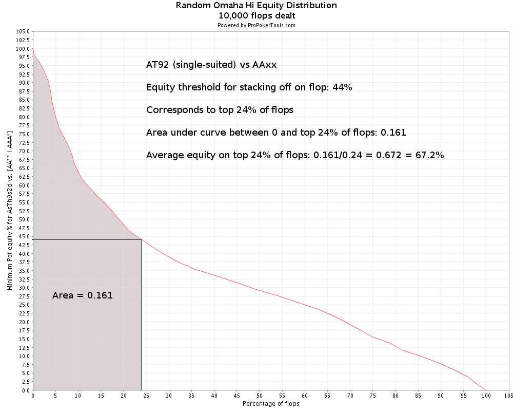

# 第 5 部分：3-bet 和对抗 3-bet

## 5.1 简介

在第 5 部分和第 6 部分中，我们将结束对 PLO 翻牌前玩法原则的讨论，并过渡到翻牌后玩法。在第 4 部分中，我们将 3-bet 引入了翻牌前核心策略，并简要讨论了如何防御 4-bet。第 4 部分重点介绍了这些场景的翻牌前部分，这项工作的目的是定义 3-bet 的可靠范围、如何思考 3-bet 的可靠指南，并介绍如何防御 4-bet。

在第 5 部分和第 6 部分中，我们将深入探讨 3-bet 和 4-bet 底池，同时开始讨论翻牌后玩法。第 5 部分和第 6 部分的目的是系统地处理大底池场景 3-bet 底池和 4-bet 底池，其中我们将翻牌前策略和翻牌后策略结合在一起。第 5 部分和第 6 部分的结构如下：

**第 5 部分**

- 3-bet
- 对抗 3-bet

**第6部分**

- 4-bet
- 对抗 4-bet

（第 5 部分和第 6 部分最初计划作为一篇关于 3-bet / 4-bet 的文章。但在写作过程中材料不断增加，因此有必要将其分成两篇文章）

3-bet 和 4-bet 底池的理论将通过简单示例进行说明。我们还将以一系列示例结束第 6 部分，在这些示例中，我们将训练合理的大底池思维过程，并应用我们学到的理论。

为了简单起见，我们将主要坚持使用 100 BB 筹码的单挑场景作为示例。但是，我们将在以后关于翻牌后玩法的文章（第 7 部分及以后）中回到 3-bet / 4-bet 底池的主题。因此，在本系列文章的后面，我们将有大量机会将我们的知识应用于具有多个对手和不同筹码大小的更复杂的场景。

第 5 部分和第 6 部分的目的不是涵盖 3-bet 和 4-bet 底池的方方面面（关于这个话题可以写厚厚的书），而是教你合理的思维过程和如何玩这些底池的可靠指南。大底池很重要，大底池中的大错误代价高昂。因此，重要的是你要学习：

1. 在准备玩 3-bet / 4-bet 底池之前，如何在翻牌前思考和计划。
2. 在 3-bet / 4-bet 底池中，如何在翻牌后思考和计划。

所以现在我们深入探讨 3-bet / 对抗 3-bet 的主题，在第 6 部分中，我们将对 4-bet / 对抗 4-bet 做同样的事情。

## 5.2 打大底池的一些宏观原则

我们以大底池翻牌前和翻牌后策略的一些宏观想法作为本文的开端。如果我们在参与大底池时始终思考这些原则，那么我们就走上了正确的道路：

### 5.2.1 大底池翻牌前打法的 “总体规划”

在通过翻牌前 3-bet 或 4-bet 建立大底池之前，请先了解这样做的原因。通常，这意味着除了考虑你的 4 张牌之外，还需要考虑许多因素（第 4 部分详细讨论了 3-bet 之前应该考虑的一些事项）。

具体来说，当你 3-bet 或 4-bet 时，应该是因为：

1. 你有一手好牌，翻牌通常能形成不错的牌型，让你继续盈利。
2. 你相信你的再加注将增加你的偷牌权益，无论是翻牌前还是翻牌后。

这两个标准不必同时满足，但要使 3-bet 或 4-bet 有意义，至少必须满足其中一个标准。如果你在这些方面较弱，则需要在另一个方面较强。例如，如果你有一手垃圾牌，你需要良好的偷牌权益，无论是翻牌前还是翻牌后。

### 5.2.2 大底池翻牌后打法的 “总体规划”

当你卷入 3-bet 或 4-bet 底池时，重要的是不要在翻牌后轻易放弃。在任何形式的底池限注或无限注扑克中，你可能犯的最大错误之一是在翻牌前建立大底池，然后在翻牌后轻易放弃。在小底池中不该弃牌时弃牌通常是小错误，但在大底池中可能是大错误。

因此，如果你经常在翻牌后搞砸，那么知道何时在翻牌前 3-bet 和 4-bet 对你没有帮助。如果你的翻牌后实力较弱，那么在翻牌前建立许多大底池很容易成为你的漏洞，即使你的翻牌前游戏在技术上是正确的（单独来看）。

坚持翻牌后谨慎地用边缘牌玩牌的理念是溜入和单次加注底池的良好起点。但是翻牌前的底池越大，翻牌后积极进攻以获得翻牌前大笔投资的价值就变得越重要。

因此，*在 3-bet 和 4-bet 底池中，我们根本不能 “坚果兜售”* （即耐心等待坚果或接近坚果的东西）。如果你在大底池中使用这种策略，你将被击败。大底池中正确的翻牌后打法通常要求你轻度地全押，有时只用顶对或非坚果对子 + 听牌组合。

大底池中的翻牌后打法围绕翻牌打法展开，剩余的筹码通常会在那里被推入。决策通常由简单的数学决定（底池赔率和对手范围的假设）。这意味着翻牌前底池越大，阅读、交牌记录和几条街的计划就变得不那么重要。这并不一定意味着大底池中的翻牌后决策很容易，但翻牌前投入底池的筹码越多，我们在翻牌后需要考虑的变量就越少。

由于 3-bet 和 4-bet 底池中的大部分翻牌后打法都是自动的并且基于数学，因此我们会在这里找到一些 “唾手可得的成果” （例如，易于学习的策略）。将大底池中的翻牌后策略视为一门手艺而不是一门艺术是一个很好的起点。原因之一是，当底池相对于剩余筹码较大时，高层次思维（例如，复杂的多街诈唬）的可能性有限。

第 5 部分和第 6 部分中的很多内容都是关于 “打大底池的技巧”。当我们了解基本原理时，我们总会发现一些可以施展技巧的地方。但是，如果我们不了解基本原理，并且经常在大底池中犯下大错误，那么偶尔的灵光一现也救不了我们。

我们已经多次讨论过 PLO 中翻牌前和翻牌后之间的联系。因此，听到可靠的翻牌前打法是玩大底池的重要组成部分，任何人都不会感到惊讶。我们在翻牌前播种什么，在翻牌后收获什么。这将在本文的讨论和示例中变得清晰，例如在第 5.3.4 节中，我们研究了单挑用优质牌和垃圾牌 A-A-x-x 进行 3-bet。

### 5.2.3 使用 SPR 定义 “大底池” 和 “小底池”

为了阐明我们在谈论大底池和小底池时的意思，我们将使用筹码与底池比率（SPR）这个概念工具。简而言之，这是翻牌时剩余筹码与底池大小之间的比率。

例如：

如果你在 UTG 加注底池到 3.5 BB，后面的玩家 3-bet，然后你跟注单挑，翻牌时底池将为 25.5 BB。如果你们两人都以 100 BB 筹码开始，那么翻牌后你们将剩下 88 BB 可以玩。那么筹码与底池比率 SPR = 88 / 25.5 = 3.5。

但是，如果你后面的玩家跟注，而盲注玩家弃牌，那么底池将是 8.5 BB，而翻牌后还有 96.5 BB可以玩。这样，SPR = 96.5 / 8.5 = 11。如果你和你后面的玩家都跟注，SB 玩家弃牌，BB 玩家过牌，那么底池将是 3.5 BB，而翻牌后还有 99 BB可以玩。现在，SPR = 99 / 3.5 = 28。

**定义**

*当我们谈论大底池时，我们指的是 SPR 较低的底池。当我们谈论小底池时，我们指的是 SPR 较高的底池。*

换句话说，底池有多大取决于翻牌时底池相对于剩余筹码的大小。那么什么是高 SPR 值，什么是低 SPR 值？我们将使用一个简单的分类方案：

- 超低 SPR：< 1
- 低 SPR：< 4
- 中等 SPR：4-13
- 高 SPR：> 13

这些并不是确切的定义，而是旨在帮助我们正确思考各种规模底池的打法的概念工具。SPR 和翻牌后打法之间的关系围绕以下宏观原则：

*SPR 越低，我们在翻牌时愿意继续玩的牌就越多，我们考虑反向隐含赔率、与坚果牌发生冲突的风险以及在后续回合中被诈唬的风险就越少。*

*SPR 越高，我们在没有坚果牌时就越需要谨慎，我们越需要考虑反向隐含赔率、与坚果牌发生冲突的风险以及在后续回合中被诈唬的风险。*

因此，当我们准备玩低 SPR 底池时，我们应该有一手适合此目的的起手牌。请记住，对于任何起手牌来说，用高 SPR 玩总是一种可接受的情况（如果需要，我们随时可以采取 “不中或弃牌” / “坚果兜售” 策略）。但 SPR 越低，拥有一手经常与翻牌相关联的牌就越重要。

翻牌后，在 SPR 极低的情况下，游戏通常归结为简单的底池赔率决策（跟注或弃牌），这对于 4-bet 单挑底池（当我们以 100 BB筹码开始）而言很常见。在 SPR 极低的情况下，我们必须愿意在单挑底池中很轻度地全押筹码。

在 SPR 较低的情况下，我们处于加注或弃牌区域。如果有人在我们面前下注，我们通常会选择弃牌或承诺完全跟注到底（通常会加注全押）。假设 100 BB 起始筹码和底池大小的加注，3-bet 单挑底池的 SPR 较低。因此，当我们的对手在翻牌时向我们下注时，我们将进行大量的加注或弃牌。

在中等或较高的 SPR，我们就有更多的空间在几条街上进行翻牌后游戏。这些区域是 100 BB 筹码的跟注和单次加注底池。当我们用非常深的筹码玩时，我们也可以在这里进行 3-bet 或 4-bet。

以下是两个示例，用于说明在 SPR 低和高的底池中合理思维过程：

**示例 5.2.1：低 SPR 下打超对**

$10PLO 6-max

CO（$2.80）加注到 $0.35，你（$10）持有 A♣A♥9♣8♠ 在 BTN 位置 3-bet 底池到 $1.20，盲注弃牌，CO 跟注。

**Flop：**T♠T♥2♣（$2.55）

CO（$1.60）将其余筹码推入。你的计划是什么？

这是跟注。原因是我们处于超低 SPR 场景中，我们有一个简单的底池赔率决定。翻牌时有效筹码为 $1.60，底池为 $2.55。我们有 SPR = 1.60 / 2.55 = 0.6，换句话说，SPR 超低，这是一个大底池场景，我们必须愿意轻度地进行全押。

CO 当然可能有三条，但他也可能很容易诈唬，或者用我们能击败的牌来争取价值。使用简单的逻辑，他的下注看起来就像他想让我们退出底池。在这种筹码量的情况下，他没有理由用一手强牌来全押。还剩下 3 条街可以玩，CO 可以随时下注。有了强牌，他应该简单地过牌给我们，并希望我们 c-bet。

我们有一手强牌，适合超低 SPR 场景，所以我们应该跟注适当的底池赔率，看看谁赢。我们的底池赔率为 4.15 : 1.60 = 2.59 : 1，所以我们需要 1 / (2.59 + 1) = 0.28 = 28% 的权益才能进行有利可图的跟注。如果我们落后，我们有 2-4 个补牌（2 个补牌组成葫芦，2 个补牌组成后门同花或后门顺子），具体取决于 CO 是否有三条或葫芦。2-4 个补牌给我们 8-16% 的权益。而且由于我们还预计 CO 会推一些我们能击败的牌，包括一些纯粹的诈唬牌，这应该是一次有利可图的跟注。

**示例 5.2.2：高 SPR 下打超对**

$10PLO 6-max

你（$26）持有 A♣A♥9♣8♠ 在 BTN 位置加注到 $0.35，BB（$22.50）跟注。

**Flop：**T♠T♥2♣ （$0.75）

BB（$22.15）下注 $0.50。你的计划是什么？

起手牌和翻牌与示例 5.2.1 相同，但此处底池是单次加注而不是 3-bet。此外，起始筹码要深得多。这导致 SPR = 22.15 / 0.75 = 30。换句话说，我们的 SPR 非常高，所以我们处于小底池的情况。

在翻牌后愿意用超对投入约 220 BB 的筹码，这无异于自杀。原因是，在面对对手愿意投入全部筹码的牌时，我们会被碾压。此外，在这种极其干燥的牌面上，对手手中没有很差的听牌可以与我们对抗。所以我们没有理由采取激进的策略，我们的翻牌后计划应该围绕在小到中等底池打到摊牌。

但我们还没有决定是否要打到摊牌。我们可以从翻牌时的跟注开始，但我们需要仔细考虑对手的范围，以及如果他继续下注该怎么办。跟注翻牌下注，然后弃牌以应对未知对手，这是合理的策略。

前面两个例子的目的是为了说明，在极低 SPR 的情况下，很容易做出的决定（跟注就好），在高 SPR 的情况下变得困难起来（我们不应该投入全部筹码，但也不应该在翻牌圈弃牌，那么如果对手继续下注，我们应该愿意走多远？）

我们将把低和高 SPR 的宏观原则带到 3-bet 和 4-bet 底池的翻牌后玩法讨论中。我们将养成在翻牌后计划打法时始终考虑 SPR 的习惯。

## 5.3 3-bet

我们在第 4 部分中彻底讨论了 3-bet 的一般原则。因此，在讨论更具体的 3-bet 场景之前，我们只会在这里简要地重复这些原则。

为了概念简单起见，我们定义了 3 种 3-bet 类别：

- 价值 3-bet
- 投机 3-bet
- 诈唬 3-bet

这些类别有些重叠，我们主要将这些定义用作概念工具。通过思考我们进行哪种 3-bet，我们也会自动思考我们进行 3-bet 的原因。这使得手牌规划更容易，因为我们会知道我们主要是为了摊牌权益还是主要是为了偷牌权益。我们还会考虑我们想要用 3-bet 创建哪些翻牌后场景。

### 5.3.1 价值 3-bet

在第 4 部分中，我们定义了价值 3-bet 的核心策略范围：

- 优质 A-A-x-x，至少是单同花，带有一对、2 张百老汇牌或连张。
- 优质百老汇包牌，至少是单同花，最好有一张 A。
- 优质 K-K-x-x、Q-Q-x-x、J-J-x-x，至少是单同花，带有连张边牌或另一高对。

换句话说，像这样的牌：

A♦A♠Q♦Q♣

A♣A♥K♣J♥

A♥A♦T♠9♦

A♣Q♠J♠T♥

K♠Q♥J♠T♥

K♦Q♦Q♣J♠

Q♥J♣J♥9♣

K♠K♦Q♠Q♥

我们在这里要做的唯一补充是，如果我们能在翻牌前投入至少 1/3 的筹码，我们也可以 3-bet 任何 A-A-x-x （包括垃圾 A-A）。从第 3 部分我们记得我们可以用 100 BB 的起始筹码 4-bet 所有 A-A-x-x。原因是我们在翻牌前投入了 > 1/3 的筹码（假设所有加注都是底池大小），因此翻牌后剩下的下注少于 1 个底池大小。

如果翻牌时剩余的筹码为 1 个底池或更少，我们单挑可以用 A-A-x-x 在任何翻牌全押，而我们的对手无法剥削利用这一点（我们在第 3 部分进行了计算，证实了这一点）。就 SPR 而言，我们正在创建一个极低 SPR 场景，因为当翻牌圈后手的筹码少于 1 个底池大小时，我们的 SPR 小于 1。

当我们对短筹码进行 3-bet 时，同样的数学论证也有效，因为我们可以在翻牌前投入超过 1/3 的筹码。例如，如果一个拥有 30 BB 筹码的对手在 UTG 加注到 3.5 BB，而你在 BB 有一手垃圾 A-A-x-x 比如 A♠A♦9♣6♦，你可以 3-bet 底池到 11 BB，并投入超过 1/3 的筹码。当你被跟注时，你只需在翻牌圈将剩余的筹码推入即可。

以下是两个价值 3-bet 的示例，分别是在不利位置和有利位置，包括翻牌后玩法：

**示例 5.3.1：不利位置价值 3-bet 翻牌击中顶对 + 弱听牌对抗激进对手**

$10PLO 6-max

BTN （$8.50）加注到 $0.35，你（$11.20）持有 A♣Q♥J♣9♥ 在 SB 位置 3-bet 到 $1.15，BTN 跟注。你知道 BTN 在有利位置会用各种牌加注。你还多次看到他单挑在翻牌有利位置加注 c-bet，而且他似乎在翻牌后用边缘牌 / 听牌在大底池中打的激进。

**Flop：**J♥7♠3♣（$2.40）

你（$10.05）下注 $2.40，BTN（$7.35）加注全押。你的计划是什么？

让我们首先找到 SPR 值，然后评估我们手牌的强度，然后做出决定。翻牌时底池为 $2.40，后手筹码 $7.35，因此 SPR = 7.35 / 2.40 = 3.1。这是一个低 SPR，我们应该准备好在翻牌用各种成牌和听牌进行全押。因此，当我们用一手不错的牌对抗激进的对手时，应该以跟注全押为目标。

这意味着跟注加注是我们在 c-bet 之前应该计划的事情。但让我们使用底池赔率和补牌来评估加注后的情况，看看为什么这样做是合理的。

我们翻牌击中顶对 + 2 张后门同花听牌（红心和梅花）+ 2 张后门顺子听牌（两个转牌 / 河牌组合，8 / T 和 T / K 给我们一个顺子）。因此，如果当对手加注时我们落后，我们有以下可能的补牌（记住：后门听牌算作 ~ 1 个补牌）：

- 两对 / 三条：9 + 2 = 11
- 后门同花：1 + 1 = 2
- 后门顺子：1 + 1 = 2

因此，当我们落后时，我们有最多 11 + 2 + 2 = 15 张两对 / 三条、同花或顺子的补牌。当然，并非所有这些补牌都是干净的，尤其是两对 / 三条的补牌。例如，如果对手有 J-T-9-7 顶两对 + 卡顺，我们有 6 张更好的两对补牌（A、Q），2 张平分底池的两对补牌（9），以及 0 张三条补牌。

请注意，我们的顶对可以作为顶暗三条的阻挡牌，而且对手的范围似乎不太可能有很多 3-3-x-x。所以我们并不特别担心被暗三条击败。这手牌对手以很宽的范围开池，我们知道他也以很宽的范围在翻牌圈加注。所以他不需要碾压我们就可以在这里全押，而且我们领先的可能性也很大（例如，如果对手用占优势的顶对 + 听牌组合加注）。但如果我们落后，我们平均应该有 8-10 张补牌。这是一个粗略的估计，但似乎是合理的（从上面对 J-T-9-7 的补牌计数可以看出）。仅后门听牌就提供了 4 张相当干净的补牌，所以我们不需要太多其他东西就能得到我们想要的东西。

对手加注全押将底池增加到 $12.15，而跟注金额为 $4.95，因此我们的底池赔率为 12.15 : 4.95 = 2.45 : 1。因此，我们需要 1 / (2.45 + 1) = 0.29 = 29% 的权益才能跟注。如果我们总是落后，这相当于翻牌时大约有29 / 4 = 7.2 个补牌。

因此，即使我们总是落后，我们似乎也拥有所需的权益。考虑到对手的激进倾向，我们有时会领先，因此我们可以轻松跟注。

**Flop：**J♥7♠3♣（$2.40）

你（$10.05）下注 $2.40，BTN（$7.35）加注全押，你跟注。

**Turn：**J♥7♠3♣K♠（$17.10）

**River：**J♥7♠3♣K♠7♦（$17.10）
你以两对获胜。BTN 持有 Q♠J♦T♣8♠ 在翻牌时拥有顶对 + 卡顺听牌 + 后门同花听牌。

我们在翻牌前拿到一手优势牌，并以 60% 的翻牌前权益进行了 3-bet。翻牌圈双方都拿到了顶对，但我们的牌力更强，于是用权益是 62%的剩余筹码全押。

**示例 5.3.2：有利位置价值 3-bet 翻牌击中超对在非常协调的牌面上对抗扎实的玩家**

$10PLO 6-max

MP（$11.10）加注到 $0.35，你（$15.60）持有 A♥A♠6♥5♠ 在 BTN  位置 3-bet 底池到 $1.20，MP 跟注。

这是使用优质 A-A-x-x 进行的标准 3-bet 价值下注。MP 是实力强劲的紧凶玩家，你认为他跟注你的 3-bet 的范围偏向于好的百老汇牌和好的连牌。

**Flop：**Q♣T♣8♦（$2.55）

MP（$9.90）过牌。你的计划是什么？

这几乎是你最糟糕的翻牌，因为你完全错过了它（我们甚至没有后门听牌），而且它可能与对手的范围很契合。是时候踩刹车并保住筹码了。

从技术上讲，通常在翻牌时我们的裸超对会是 “最好手牌”。但在奥马哈的翻牌中，“最好手牌” 一词通常没有什么意义。原因是听牌通常会在权益方面压倒当前最好的手牌。例如面对 A♣K♦Q♦J♥（顶对 + 包牌顺子听牌 + 后门同花听牌），我们的手牌在翻牌时技术上被 “击败”，我们有 45% 的权益。

我们最担心的是面对翻牌击中顺子时可能听死牌的风险，或者面对一手更好的成手牌 + 一手好听牌的组合时可能听到近乎死牌的风险。例如，我们在对抗 K♣Q♦9♦8♣（两对 + 同花听牌 + 卡顺听牌）时只有可怜的 14% 权益，并且我们发现在对手的范围内有很多像这样的牌。

所以我们知道：

- 我们对抗对手在翻牌的整体牌型范围权益很低（因为我们假设它与翻牌的牌型配合良好）。
- 我们在对抗他在这个翻牌继续的范围的权益非常低

所以我们必须假设 c-bet 通常会被跟注或（更可能）被加注。当对手继续对抗时，他的范围将碾压我们。

但有一线希望。我们有位置优势，而对手已经过牌，所以至少我们得到了一张免费牌。在（非常）好运的时候这手牌会被过牌到摊牌。无论如何，我们随后过牌，计划不再投入任何筹码。

**Flop：**Q♣T♣8♦（$2.55）

MP（$9.90）过牌，你（$14.40）随后过牌。

**Turn：**Q♣T♣8♦4♠（$2.55）

MP（$9.90）下注（$2.55），你（$14.40）弃牌。

对手在转牌时下注底池，很可能权益很高，我们按计划弃牌。在这种情况下，我们手握一手勉强成牌且在牌面非常协调的情况下没有补牌，重要的是不要疑神疑鬼或固执己见。当翻牌的结构和对手的预期范围让我们处于绝对劣势时，我们只能选择弃牌，不要再冒险投入更多筹码。

### 5.3.2 投机 3-bet

在第 4 部分中，我们定义了投机 3-bet 的以下核心策略范围：

- 良好、同花的连牌
- A 同花和良好的连牌

换句话说，像这样的牌：

Q♥J♠T♥9♣

9♣8♥7♣6♥

Q♥T♠9♥8♠

J♠9♠8♥7♣

T♦8♦7♠5♠

A♣T♣9♠8♥

A♥9♣8♥7♣

A♠J♠9♥8♥

A♦8♠7♦6♥

请注意，价值 3-bet 和投机 3-bet 之间的界限是 “模糊的”。我们选择将价值 3-bet 定义为使用优质同花和协调高牌手牌进行的 3-bet。但（根据我们的定义）投机 3-bet 手牌（如 Q♥J♠T♥9♠）肯定也可以归类为优质牌。

如前所述，“价值 3-bet”、“投机 3-bet” 和 “诈唬 3-bet” 的这种分类主要是我们用来促进合理思维过程的概念工具。

对于优质高牌手牌（例如，优质 A-A-x-x），我们更经常独立于情景进行 3-bet。对于投机 3-bet 手牌（例如 A♣8♣7♠5♠ ），其高牌强度低于价值范围内的手牌，我们在 3-bet 之前往往会对情景更加挑剔。对于非常投机的诈唬 3-bet 牌（例如 K♦Q♠T♥6♦），我们总是要求在 3-bet 之前有有利条件（最有利位置和良好的偷牌权益）。

以下是有利位置投机 3-bet 的示例：

**示例 5.3.3：有利位置投机 3-bet 翻牌边缘对子 + 听牌**

$10PLO 6-max

UTG（$10）加注到 $0.35。UTG 是一名扎实的玩家，但当他被 3-bet 时，他似乎打得非常直接。你持有 A♣9♠8♣7♣ 在 BTN 位置 3-bet 到 $1.20。盲注弃牌，UTG 跟注。

**Flop：**J♣7♦4♦ （$2.55）

UTG（$8.80）过牌。你的计划是什么？

翻牌你在一个协调性较好的牌面击中第二对 + 坚果卡听牌 + 后门坚果同花听牌，牌面可能有内嵌顺子包牌和同花听牌。我们必须假设这个翻牌与扎实的玩家可以在不利位置跟注 3-bet 范围非常吻合（范围中应该有很多好的高牌和好的连牌）。这不是世界上最协调的翻牌，但对手的范围中应该有很多对子 + 听牌的合理组合。所以我们必须考虑在 c-bet 时被跟注或加注的可能性（就像我们在示例 5.3.2 中所做的那样）。

很明显，如果我们被加注，我们就无法继续。所以如果我们下注，我们计划对加注弃牌。另一方面，虽然我们的手牌不是很好，但我们确实有一些权益，有两对、三条、坚果顺子和后门坚果同花听牌的补牌。这意味着有很多转牌可以大大提高我们的权益。

因此，在这种情况下，我们有充分的理由接受免费牌并保留我们的权益。我们当然也可以 c-bet，但我们必须假设对手经常击中翻牌，并且我们期望对他范围内不弃牌的部分没有很好的权益。如果我们被加注，我们绝对不能继续。

为了防止被过牌 - 加注打得落花流水，我们可以随后过牌并希望在决定是否要投入更多筹码之前获得有利的转牌。请注意，这种过牌（持有不会总是在转牌放弃的牌）将平衡我们在翻牌没有击中牌并放弃时所做的弱的过牌（就像我们在示例 5.3.2 中所做的那样）。

逻辑是：

在翻牌随后过牌且拥有不错权益的牌通常会在转牌得到足够的改进，从而跟注下注（如果对手决定诈唬），或下注以获得价值 / 保护（如果对手再次过牌）。当我们没有改进时，我们有时会得到机会，在对手第二次过牌以示弱时，下注将他从底池中赶出去。通过同时过牌一些权益不错但不是很好牌来平衡我们翻牌弱的过牌，可以保护我们，并使对手难以每次我们在翻牌过牌时都自动在转牌诈唬。

一个积极且不善观察的对手，不注意我们的平衡，通常会在转牌诈唬我们已经改进的无法被诈唬掉的牌。一个善于观察的对手会注意到我们的平衡，他通常会在转牌诚实地过牌，让我们有机会通过转牌下注获胜，或者拿另一张免费牌，如果我们想要的话。

这两种情况都对我们有利，它们很好地说明了在翻牌后玩边缘牌时位置的重要性。请注意，你不必每次都过牌。c-bet 也可以，但为了平衡，你有时应该过牌，特别是当你有理由相信对手经常过牌 - 加注时。

有机会在翻牌拿一张免费牌是拥有位置的最大优势之一。所以你不应该在被过牌时自动下注，即使你在翻牌前进行了最后一次加注，而且你预计会很多下注。

**Flop：**J♣7♦4♦（$2.55）

UTG（$8.80）过牌，你（$8.80）随后过牌。

**Turn：** J♣7♦4♦A♥（$2.55）

UTG（$8.80）过牌。你的计划是什么？

我们改进成两对，而对手第二次过牌。这里我们有一个典型的例子，说明位置如何让我们自信地在翻牌后玩边缘牌。我们的牌不错，但远非出色。然而，我们可以非常肯定，在对手过牌两次后，我们拥有最好的牌。现在，除非他非常狡猾，否则他几乎不可能拥有一手强牌。他可能拥有一手成手牌 + 听牌组合，并且对我们的两对具有不错的权益，但他绝对不代表一手强牌。

现在我们已经收集了足够的信息，可以自信地在转牌圈下注，并且假设权益不错。我们计划对过牌 - 加注弃牌，因为我们不认为他会用任何我们可以继续获利的牌过牌 - 加注。

请注意，即使我们领先，我们也希望较差的牌弃牌。即使我们在转牌被更差的牌跟注而赚钱，他们弃牌可能更好。如果他们跟注，我们通常不得不在可怕的牌面上用边缘的两对牌打河牌。大多数河牌都可以打败我们，或者给对手一个机会来代表一手击败我们的牌。如果对手决定在危险的河牌诈唬，我们将陷入困境。

这是 PLO 与 NLHE 不同的地方。在 NLHE 中，我们经常会发现自己处于要么遥遥领先要么遥遥落后的情况（例如，当我们在 A-x-x 翻牌上持有 K-K 时）。在这些情况下，我们倾向于用边缘牌过牌很多。这背后的逻辑是，我们不能希望更好的牌弃牌或更差的牌跟注，我们也不指望一张免费牌能改变局面。

这种思维方式并不适用于 PLO。一个原因是，即使下注不会让更差的牌跟注或更好的牌弃牌，*我们大多也不介意更差的牌弃牌，因为它们通常对我们的边缘牌有相当的权益，而且有机会在后面的几条街上击败我们。* 例如，让一手有 25% 权益的牌来对抗我们，让我们在正确的转牌弃牌或错误的转牌跟注之间做出选择，通常比让这手牌免费看到河牌圈更好。

因此，在 PLO 单挑场景中，我们倾向于用边缘牌下注 - 弃牌，而不是试图偷偷地摊牌或用它们诱导诈唬。我们将在以后的翻牌后打法文章中更多地讨论这个话题。

**Turn：**J♣7♦4♦A♥（$2.55）

UTG（$8.80）过牌，你（$8.80）下注 $2.55，UTG 弃牌。

这对我们来说可能是最好的结果。这就是位置的力量。

### 5.3.3 诈唬 3-bet

当我们把 3-bet 的范围扩大到包括像 Q♠T♦8♦3♠ 这样的半垃圾牌时，我们就进入了诈唬 3-bet 的领域。这并不比大幅放宽起手牌要求更复杂，目的是为了利用我们预期拥有良好偷盲权益的有利局面。

以下是一个例子：

**示例 5.3.4：有位置诈唬 3-bet 在干燥翻牌上没有成牌 / 没有听牌**

$10PLO 6-max

CO（$14.35）加注到 $0.35，你（$12.50）持有 K♦J♦8♣3♣ 在 BTN 位置。CO 加注范围很宽，他也用很宽的范围跟注 3-bet，但他在 3-bet 后打得紧而直白。盲注位置的玩家似乎很紧。你决定用一手非常投机的牌进行 3-bet 诈唬，并且 3-bet 底池到 $1.20。CO 跟注。

**Flop：**A♠7♠3♥（$2.55）

CO（$13.15）过牌。你的计划是什么？

显而易见的选择是翻牌 c-bet ，计划弃牌面对过牌 - 加注。这种情况与示例 5.3.3 有点相似，因为我们击中了翻牌的一部分，并且不能跟注过牌 - 加注。但这是否意味着我们也应该在这里过牌？

不。这在这里没有什么意义，因为没有任何转牌（除了 3♦）可以让我们在转牌获得强牌或强听牌。因此，与示例 5.3.3 不同，过牌这个翻牌不会为我们带来许多有利可图的转牌场景，因为没有任何转牌可以让我们有信心继续下去。此外，当我们拥有这么少的权益时，被过牌 - 加注退出这个底池对我们来说不是问题。

如果我们过牌并在转牌改进，我们大部分情况下都会有弱的两对牌和内嵌顺子听牌（请注意，翻牌的 2 张同花牌使任何改进都比平常弱）。因此，这是一个我们的权益较差且几乎没有机会提升的翻牌。而且，由于在这种翻牌结构上，c-bet 本身就应该有利可图（对手很难在 A 高牌和杂乱的翻牌上继续对抗），因此我们没有任何理由在翻牌后过牌。如果我们能在翻牌上赢得这个底池（而且我们相信这通常是这样的），我们应该简单地在翻牌上下注并拿走它。

对抗过牌 - 加注放弃这手糟糕的牌对我们来说不是问题，因为在这种情况下我们的权益非常低。所以我们只是在翻牌上下注，然后对过牌 - 加注弃牌。翻牌结构是 A 高牌且不协调，我们预计对手会过牌 - 弃牌他的大多数牌。

换句话说，我们不在乎我们拥有的那点权益，我们只是下注我们的牌，纯粹是诈唬，而且大多数时候，当对手不弃牌时，我们就会放弃（在好运日子里，他会跟注，我们在转牌时改进，然后他让我们免费用一手边缘牌赢得摊牌）。这与示例 5.3.3 不同，在示例 5.3.3 中，我们选择玩我们的边缘牌（但好得多），更多地关注摊牌权益，而不是偷牌权益。

**Flop：**A♠7♠3♥（$2.55）

CO（$13.15）过牌，你（$11.30）下注 $1.75，CO 弃牌。

正如预期的那样。注意下注大小（大约 2/3 底池）。在像这样的 A 高且不协调的翻牌中，对手要么弃牌（多数与下注大小无关）要么跟注 / 过牌 - 加注（多数与下注大小无关）。因此，你不需要下注满底池来迫使他在此翻牌上放弃他的牌。

如果你在像这样的翻牌中诈唬时使用较小的下注，你应该通过较小的价值下注来平衡这一点（例如，如果你用 A-A-x-x 进行了 3-bet，并在这个翻牌击中顶暗三条）。

### 5.3.4 用垃圾 A-A-x-x 进行 3-bet 的弊端（尤其在不利位置）

在我们结束 3-bet 这个话题之前，我们将仔细研究一个经常发生的特殊情况，即用 A-A-x-x 进行 3-bet。

在本系列文章的前面部分（参见第 2 部分和第 4 部分），我们曾警告不要用坏的 A-A-x-x 进行 3-bet。坏的 A-A-x-x 是没有同花的 A-A-x-x，或者只有一种同花和很差边牌的 A-A-x-x。例如：

A♠A♥9♠3♣

A♦A♣6♠2♥

A♦A♠T♦4♥

在不利位置时，用坏的 A-A-x-x 进行 3-bet 尤其成问题。原因是*翻牌后平均权益较差 + 牌型明确 + 使我们陷入 “被迫” 进行大量 c-bet 的场景。*

当我们进行 3-bet 时，大多数对手会首先猜到我们是 A-A-x-x。如果我们只有 A-A（也就是说，如果我们手中的 x-x 部分很差，几乎可以忽略不计），那么我们很容易被用各种牌来对抗我们的 3-bet 并从中获利。这种效果在不利位置时被放大，因为我们现在必须对很多翻牌进行 c-bet。由于坏牌遇到很多坏翻牌，这意味着我们不得不在权益较差的翻牌上下注很多。而这反过来又给了我们的对手很好的隐含赔率。

当我们用坏的 A-A-x-x 进行 3-bet 时，对手知道了我们手牌的大部分信息，而且他的位置使他更容易在翻牌后充分利用这些信息。但是当我们有好的 A-A-x-x 时，我们发送给对手的信息对他来说就没那么有用了，而且他会在翻牌后犯更多的错误，即使他有位置优势。

为了说明 3-bet 优质和坏的 A-A-x-x 之间的巨大差异，我们将使用翻牌权益分布进行模型研究。我们使用的理论（翻牌权益分布和数值积分）在第 3 部分中进行了详尽的讨论，因此如有必要，请重读本文。

我们对这个 3-bet 场景的模型是：

- 对手在 BTN 加注底池到 3.5 BB，其范围由前 50% 的牌减去所有 A-A-x-x 组成。
- 我们在 BB 持有 A♠A♥J♠T♥（优质牌）或 A♠A♥7♦2♣（垃圾牌），对手知道我们的牌。
- 我们 3-bet 底池到 11 BB，计划 c-bet 所有翻牌并跟注全押加注。
- 对手用其整个范围跟注 3-bet。
- 我们 c-bet 所有翻牌，对手在有足够权益的所有翻牌上加注全押，否则他弃牌。

我们想要回答的问题是：

*对手能否利用其完全掌握的信息，在翻牌前加注，然后用包含前 50% 牌型（不包括所有 A-A-x-x 牌型）的宽范围跟注 3-bet，从而获利？*

请注意，我们已从他的范围中移除 A-A-x-x，以使事情更简单。当对手有 A-A-x-x 时，这手牌无论如何都会以翻牌前全押对抗结束，而且大部分底池都会被平分。此外，我们从对手将第一枚筹码放入底池的那一刻起计算他的 EV，因为他知道我们有 A-A-x-x，并且他会被 3-bet。然后，他跟注我们的 3-bet，假设我们会在所有翻牌上下注，并计划跟注加注。

翻牌时底池为 11 + 11 + 0.5 = 22.5 BB，而筹码还剩下 89 BB，SPR 为 89 / 22.5 = 4.0（因此我们处于加注或弃牌区域）。当对手在翻牌上加注时，他冒着 89 BB 的风险赢得 22.5 + 89 = 111.5 BB。因此，他获得的有效底池赔率为 112.5 : 89 = 1.25 : 1，并且他至少需要 1 / (1.25 + 1) = 0.44 = 44% 的权益才能有利可图地加注全押。

因此，对手将在他拥有 44% 或更多权益的 top_x% 翻牌上加注全押，否则他将弃牌并失去 11 BB 翻牌前的投资。当他加注全押时，他的平均权益是 av_equity，然后他将在 200.5 BB 的底池中全押，而他总共投资了 100 BB。

我们从翻牌权益分布图中找到了 top_x 和 av_equity。对手在 BTN 加注对抗我们已知的 A-A-x-x 牌的平均总 EV 是：

EV（总的）= (1 - top_x)(-11 BB) + top_x(av_equity(200.5 BB) - 100 BB)

以下是对手在面对我们的牌 A♠A♥J♠T♥ 和 A♠A♥7♦2♣ 时的前 50% 范围的翻牌权益分布图和计算。对于这两手牌，我们首先计算了对手加注时的总 EV。然后，我们还计算了对手跟注 3-bet 时的总 EV（对手在翻牌前冒 7.5 BB 的风险，总共冒 96.5 BB 的风险，因为 3.5 BB 的加注现在属于底池，而不是他）。

**前 50% vs A-A-J-T（双同花）**

EV（总的）
= (1 - 0.23)(-11 BB) + 0.23(0.654(200.5 BB) - 100 BB) 
= -1.32 BB

EV（跟注 3-bet）
= (1 - 0.23)(-7.5 BB) + 0.23(0.654(200.5 BB) - 96.5 BB) 
= +2.18 BB

**前 50% vs A-A-7-2（彩虹牌）**

EV（总的）
= (1 - 0.39)(-11 BB) + 0.39(0.681(200.5 BB) - 100 BB)
= +7.54 BB

EV（跟注 3-bet）
= (1 - 0.39)(-7.5 BB) + 0.39(0.681(200.5 BB) - 96.5 BB)
= +11.04 BB

**一个有趣的结论**

我们的模型首先告诉我们，对手不能通过参与对抗我们的优质 A♠A♥J♠T♥ 而获利（总体而言）。即使拥有完美的信息、完美的翻牌打法和最大的隐含赔率，当他选择加注对抗我们的优质 A-A-x-x 牌时，他也会损失 -1.32 BB。

但是当我们 3-bet 垃圾 A♠A♥7♦2♣ 时，对手实际上在加注时赚了 +7.54 BB，即使他知道我们有 A-A-x-x，即使他知道他每次都会被 3-bet！

我们还看到，对手跟注对抗 A♠A♥J♠T♥ 的 3-bet 是有利可图的，即使他总体上输掉了这手牌的筹码。他从翻牌前加注的那一刻起就输了，但是当他被 3-bet 时，他跟注并继续这手牌的损失比翻牌前弃牌的损失要小。

我们可以从这些数据中得出什么结论？

首先，当我们在不利位置用 A-A-x-x 建立一个大翻牌前底池时，很明显优质边牌的价值是巨大的。我们必须记住，当我们在现实世界中 3-bet A-A-x-x 时，A-A-x-x 和未知（暂时不关心的）边牌是对手首先会想到我们的手牌。当我们手中的 A-A 部分是唯一有价值的部分时，泄露这些信息会对我们造成严重伤害。

换句话说：当两张边牌很差（例如不同花的 7-2）时，像我们只有两张 A-A 牌一样对抗我们的 3-bet 是一个小错误。但当我们的边牌很有价值时（例如双同花的 J-T），对手忽略它们是一个大错误。

此外，我们发现，对于糟糕的 A-A-x-x 来说，让自己不得不在很多翻牌上 c-bet（当我们在不利位置时 3-bet 单挑时，我们必须这样做）是一个问题。实际上，我们当然不会像在模型中那样在任何翻牌上弃牌，但在不利位置时，我们仍然必须 c-bet 很多翻牌，包括很多我们权益较差的翻牌。

对于优质 A-A-x-x 来说，“被迫” 在不利位置时 c-bet 翻牌并不是什么问题，因为这些牌经常击中翻牌的一部分，因此通常给我们足够的权益来有利可图地下注并把剩下的筹码都押上。但是对于糟糕的边牌，我们通常权益较差，因此我们经常不得不在下注 - 弃牌和在权益不足的情况下押上筹码之间做出选择。

最后，我们观察到完美信息的价值是巨大的。对手在对抗我们时使用了非常广泛的前 50% 范围，但他仍然设法在对抗垃圾 A-A-x-x 时获得了可观的利润。前 50% 范围包括许多粗糙的牌，例如 Q♣9♣6♠5♥，但仍然有可能在拥有完美信息的情况下在对抗垃圾 A-A-x-x 时获利。此外，我们看到对手可以有利可图地跟注 3-bet，无论是对抗优质 A-A-x-x 还是垃圾 A-A-x-x，尽管他总体上输给了 A♠A♥J♠T♥（但他跟注 3-bet 的损失比弃牌的损失要少）。

因此我们得出结论：

*习惯性地在 100 BB 筹码的情况下 3-bet 垃圾 A-A-x-x 牌对你不利！*

*告诉对手你手中有 A-A-x-x，而位置不佳，这样他就可以很容易地用各种弱牌来与你对抗，即使你在翻牌前 3-bet，即使他在翻牌前处于劣势。*

细心的读者当然会发现，拥有明确 3-bet 范围的问题也可以通过 3-bet 非 A-A-x-x 牌来解决。但这并不能解决当我们拥有 A-A-x-x 和坏边牌时找不到足够好的翻牌来全押的问题。

即使我们用一系列牌型进行 3-bet，对手通常也会认为我们只有 A-A-x-x（而且他会忽略边牌）。而当我们实际只有 A-A 加上一些毫无价值的边牌时，翻牌后他就能很好地对抗我们。

## 5.4 对抗 3-bet

到目前为止，我们已经看到了几个翻牌前和翻牌后我们 3-bet 的例子。现在是时候换个角度，研究一下我们加注并被 3-bet 的情况了。我们首先想知道的是：

*我们应该用哪些牌跟注 3-bet？*

在拥有 100 BB 筹码的情况下，我们已经得出结论，我们可以 4-bet 所有 A-A-x-x（请参阅第 3 部分中关于 A-A-x-x 4-bet 不可被剥削利用的的讨论）。在第 6 部分中，我们还将研究如何用非 A-A-x-x 对抗用宽范围 3-bet 的对手。因此，剩下的就是我们在被 3-bet 后跟注并弃牌的非 A-A-x-x 牌。这将是本文其余部分的主题。

我们首先看看应该弃牌的两种 3-bet 牌。然后，我们将讨论如何对抗紧的 3-bet 范围和松的 3-bet 范围。

### 5.4.1 3-bet 底池中的问题牌：干燥对子和投机性 A-x-x-x 牌

我们来谈谈 3-bet 时表现不佳的两种牌：干燥对子和投机性 A-x-x-x 牌。

带有坏边牌的对子（例如 K♠K♥7♦2♣）和投机性 A-x-x-x 牌（例如 A♠T♥9♠2♦）在 3-bet 底池中表现不佳。原因如下：

- 随着翻牌前底池的规模不断扩大，这些牌很难找到更多好翻牌来全押。
- 它们与 A-A-x-x 对抗表现不佳，因为被 A-A 压制。
- 它们与其他优质 3-bet 牌对抗时也表现不佳

请记住，我们在翻牌前建立的底池越大，找到可以有利可图地继续玩的好翻牌就越重要。因此，在大底池场景中表现良好的牌是很好地击中很多翻牌的牌，而不是在很少的翻牌击中很好的牌。

因此，当我们建立大底池时，我们更喜欢经常击中翻牌的同花和协调的牌。在大底池中表现不佳的牌是在争夺摊牌权益时更依赖隐含赔率的牌。K♠K♥7♦2♣ 或者 A♠T♥9♠2♦ 就是这种牌的例子。

如果我们没有太多的偷牌权益（而且我们通常在被 3-bet 后没有），我们需要好的摊牌权益来弥补。并且在大底池中，我们希望手牌能够快速组成足够好的牌继续玩下去。相反，我们不想用非此即彼的牌，如干燥对子（通常翻牌击中暗三条或什么都没有）和投机性 A-x-x-x（大多翻牌击中弱的一对，偶尔是同花听牌如果是 A 同花）来玩基于摊牌权益的 3-bet 底池，因为这些牌大多会错过翻牌。

为了说明这些原则（以防你们中的一些人仍然想用像 K♠K♥7♦2♣ 这样的牌跟注 3-bet 来击中三条），我们将对翻牌权益分布进行模型研究。我们假设我们加注干燥对子或投机性 A-x-x-x 并被 3-bet，然后我们跟注在翻牌上玩不中牌就弃牌。

我们的模型如下：

- 你用 K♠K♥7♦2♣ 或 A♠T♥9♠2♦ 在 CO 加注底池到 3.5 BB。
- BTN 用 A-A-x-x 3-bet 加注底池到 12 BB，盲注玩家弃牌。
- 如果我们知道 BTN 持有 A-A-x-x 并且他会在每次翻牌时下注 - 跟注，我们是否可以从隐含赔率中获利？

假设我们跟注 3-bet（再跟注 8.5 BB）。翻牌时底池现在为 25.5 BB。双方都以 100 BB 的筹码开始，还剩下 88 BB 可以玩。我们知道 BTN 持有 A-A-x-x，我们也知道他在翻牌后承诺完全投入。如果我们过牌，他会在所有翻牌时 c-bet，然后他总是跟注过牌 - 加注全押。

因此，我们的翻牌后计划是永远不要诈唬，而是在翻牌时过牌 -加注全押 BTN 玩家。我们冒着 88 BB 的风险赢得 25.5 BB + 对手的 88 BB = 113.5 BB。有效底池赔率为 113.5 : 88 = 1.29 : 2，因此我们需要 1 / (1.29 + 1) = 0.44 = 44% 翻牌圈的权益才能有利可图地全押。

因此，我们在 top_x% 上全押，其中我们的平均权益为 av_equity。然后我们在 201.5 BB 的底池中全押，从我们决定跟注 3-bet 的那一刻起，我们已经投入了 8.5 BB + 88 BB = 96.5 BB

在此模型中跟注 3-bet 的 EV 为：

EV（跟注 3-bet）
= (1 - top_x)(-8.5 BB) + top_x(av_equity(201.5 BB) - 96.5 BB)

以下是使用 K♠K♥7♦2♣ 和 A♠T♥9♠2♦ 对抗 A-A-x-x 跟注 3-bet 的翻牌权益分布和 EV 计算。请注意，我们在 ProPokerTools 计算中对手的手牌使用符号 AA** ! AAA*（这排除了对手可能不会 3-bet 的 A-A-A-x）：

**K-K-7-2（彩虹牌）vs A-A-x-x**

EV（跟注 3-bet）
= (1 - 0.15)(-8.5 BB) + 0.15(0.803(201.5 BB) - 96.5 BB) 
= +2.58 BB

**A-T-9-2（A 同花）vs A-A-x-x**

EV（跟注 3-bet）
= (1 - 0.24)(-8.5 BB) + 0.24(0.672(201.5 BB) - 96.5 BB) 
= +2.86 BB

**模型研究结果**

我们观察到，在模型描述的条件下，K♠K♥7♦2♣（+2.58 BB）和 A♠T♥9♠2♦（+2.86 BB）都可以跟注 3-bet，获利不大。这是否意味着这些牌在被 3-bet 时适合跟注并在翻牌圈玩不中就弃牌？

事实上，不是。原因如下：

- 该模型假设对手的范围完全准确（他只 3-bet A-A-x-x）
- 该模型假设最大隐含赔率
- 即使在理想条件下，跟注也只能获得微薄利润。

例如，当你翻牌圈表现非常好并且他的权益很差时，有能力的对手有时会正确地下注 - 弃牌他的 A-A-x-x。如果他在翻牌圈下注底池（25.5 BB）并对你的加注全押弃牌，他将带着一半以上的筹码逃脱。这会降低你的隐含赔率（如果对手在某些翻牌圈下注 - 弃牌，他当然也会增加你的偷牌权益，但我们假设你在这里使用的是 “不中就弃牌” 策略）。其他时候，他会利用位置，在翻牌圈随后过牌，并以此方式节省筹码。

该模型没有考虑到的另一件事是玩家用一系列牌进行 3-bet。完美的翻牌游戏只有在拥有完美信息的情况下才有可能。如果我们不能高度确定地将对手是 A-A-x-x，那么当我们使用 “不中就弃牌” 策略时，我们将不可避免地在翻牌后犯下重大错误。例如，我们会在很多翻牌上过牌 - 弃牌，而我们本应该过牌 - 加注（例如，我们持有 K-K-7-2 在 A-J-4 翻牌上，当对手用 J-T-9-8 等一手弱牌对我们进行 3-bet 时）。我们有时也会跟注翻牌前本应该弃牌的 3-bet（例如，当我们持有 K-K-7-2 而对手用 A-K-K-Q 3-bet  并完全碾压我们时）。

**模型研究的结论**

当你用对子带坏边牌（K♠K♥7♦2♣、J♠T♦T♠4♣ 等）或投机性 A-x-x-x （A♠T♥9♠2♦、A♦K♦9♠5♥ 等）加注时，无论是在有利位置还是不利位置，都应对 3-bet 弃牌。

继续翻牌，计划玩 “不中就弃牌”，在理想情况下可能会略有盈利，但更可能是一个大错误。拿着这些问题牌，你将不可避免地在翻牌后做出许多棘手的决定，而当你被迫想办法摆脱棘手的情况时，你通常会犯错误。

现在我们已经解决了这两个常见的弃牌情况，让我们更笼统地讨论一下被 3-bet 时跟注或弃牌的决定。

### 5.4.2 跟注 3-bet 的一些一般原则

在评估手牌质量之前，我们应该考虑一下当时的情况：

**在有利位置时比在不利位置时跟注更频繁**

有利位置增加了所有起手牌的盈利能力。一些在不利位置时无利可图的跟注在有利位置时会有利可图。部分原因如下：

- 在有利位置时更容易控制底池大小（控制底池大小对于边缘手牌很重要）。领先时我们赢得更多，落后时输得更少。
- 有利位置为我们提供了更多更好的偷取底池的机会。

与位置相关的一个重要概念是，不利位置的 3-bet 者会让自己不得不盲目地 c-bet 很多翻牌。这会增加有利位置玩家的隐含赔率。我们在本文前面的模型研究中谈到了这个话题，当时我们 3-bet 优质和垃圾 A-A-x-x。

**更频繁地跟注差的对手**

如果对手牌技不佳，经常在翻牌后犯错，那么就应该跟他玩更多手牌（反之，面对水平较高的对手时，则应该弃掉更多牌）。一个典型的例子是，有些玩家在翻牌后过度玩一些较差的 A-A-x-x 牌，并且经常只用一个超对和很差的边牌就贸然全押。

当我们在翻牌前用垃圾 A-A-x-x 3-bet 时，这是模型研究的重要组成部分。用坏的 A-A-x-x 3-bet 本身就是一个错误，而我们通过在所有翻牌上承诺全押加剧了错误。这使得对手跟注我们的 3-bet 非常有利可图。

**更频繁地跟注明确的 3-bet 范围**

关于对手范围的可靠信息使与他打牌更容易获利。极端情况是，一名玩家只会用 A-A-x-x 3-bet。

这是用 A-A-x-x 3-bet 的模型研究中最重要的组成部分。对手对我们的范围有完美的信息（我们的范围只有一手牌），因此，他能够完美地打翻牌。这让他能够用非常宽范围的牌跟注 3-bet，即使我们 3-bet 的是一手好牌。我们还观察到，泄露关于我们手牌的信息对于弱牌来说比对于好牌来说更成问题。

### 5.4.3 当我们被一个紧范围玩家 3-bet 时

所谓紧范围，是指被一个偏向 A-A-x-x 牌的范围的玩家 3-bet。面对一个紧的 3-bet 玩家，我们的第一反应可能是大量弃牌，因为他的范围很强，但让我们来思考一下紧的 3-bet 意味着什么。

首先，即使对手的范围很紧，我们仍然会凭借一系列弱牌获得不错的权益。这是奥马哈，不是德州扑克，一手起手牌很少能有超过 60% 的翻牌前权益来对抗另一手牌。此外，PLO 起手牌最重要的属性不是全押翻牌前权益，而是翻牌后的权益分布（即翻牌后的权益分布图）。

例如，K♠K♥7♦2♣ 从技术上讲，在与 J♠T♥9♠8♥ 的对抗中，是 51% 翻牌前权益的热门。但 K♠K♥7♦2♣ 在 3-bet 底池中表现不佳，而 J♠T♥9♠8♥ 在单挑大底池场景中表现非常出色，因为它击中了很多翻牌。

然后想想这样一个事实：紧的 3-bet 可以让我们了解对手的范围。最极端的情况是对手只 3-bet A-A-x-x。拿到任何 A-A-x-x 牌的概率为 2.5%，如下面的 ProPokerTools 计算所示：

（请注意，我们已使用 ProPokerTools 符号 AA** ! AAA* 排除了不可玩的组合 AAAx 和 AAAA。）

因此，面对 2.5% 或更低的 3-bet%（我们在 HUD 中找到此统计数据），我们很可能是对抗 A-A-x-x。这使得用各种投机牌轻松获利，尤其是在有利位置上，因为这迫使对手向我们 c-bet 很多翻牌，这给了我们隐含赔率。

如前所述，我们将对子带有较差边牌和投机 A-x-x-x 牌面对 3-bet弃牌。但除了这些牌之外，当我们怀疑对手只对 A-A-x-x 进行 3-bet 时，我们可以用各种投机牌跟注紧的 3-bet。所有具有最低协调性的同花牌都是候选牌。

对手紧的另一种方式是翻牌后轻易放弃，或翻牌后线路不平衡。例如，如果他过牌并在错过很多翻牌时放弃，我们将获得更多偷牌机会。而且，他使用不平衡的线路使情况变得更糟，我们可以在翻牌后不看牌偷取底池。

例如，与一个认为自己有良好权益时下注翻牌，否则过牌（并且几乎从不过牌 - 加注）的对手对战，就像从婴儿那里偷糖果一样。

**如何制定计划对抗紧的 3-bet 玩家**

面对一个紧的 3-bet 范围，且偏重于 A-A-x-x，我们可以用大量投机牌跟注，前提是假设对手的明确范围在翻牌后很容易对抗（如本文前面对 3-bet 优质和垃圾 A-A 的模型研究所示）。

这在对抗只 3-bet A-A-x-x 的对手时尤其适用，特别是如果他在翻牌后也过度玩这些牌。因为这样我们就知道我们必须击败什么，而且我们试图在翻牌后击败他的 A-A，会获得很好的隐含赔率。我们放弃坏对子和坏 A-x-x-x 牌，用我们范围中的几乎所有其他投机牌跟注，计划在翻牌时主要玩不中就弃牌。

面对一个紧的 3-bet 玩家，而且他在翻牌后也紧且容易被解读，我们更有理由用很多弱牌跟注，特别是在有利位置上。我们现在还可以制定计划来偷取权益，而不仅仅是玩 “不中就弃牌”。因此，我们跟注不仅是为了寻找好的翻牌，而且是为了在对手过牌并在翻牌上放弃时进行一些诈唬。这在有利位置上显然更容易实现。

一般来说，当我们错过翻牌时，我们不会做太多诈唬，尤其是在不利位置的情况下。例外情况是当对手在翻牌后玩得很弱并给我们偷牌机会时。例如，如果我们知道他在过牌时总是很弱，那么当他过牌时，我们可以诈唬。如果没有这种具体信息，我们大多会在完全错过的翻牌上放弃。以下是两个跟注紧手（可能持有 A-A-x-x）的 3-bet 的例子：

**示例 5.4.1：在有利位置跟注 3-bet 对抗可能的 A-A-x-x，我们应该在翻牌圈诈唬吗？**

$10PLO 6-max

你（$12.50）持有 J♠7♠6♥4♥ 在 BTN 位置加注底池到 $0.35，SB（$9.95）3-bet 底池到 $1.15，你跟注。SB 的 3-bet% 为 1.8，你之前曾看到他在单挑底池中用 A-A-x-x 在翻牌圈下注 - 跟注加注。

**Flop：**T♠2♥2♣（$2.40）

SB（$8.85）过牌。你的计划是什么？

翻牌前的打法很简单。我们怀疑 SB 是只 3-bet A-A-x-x 的玩家群体中的一员，而且在不利位置时他可能持有优质 A-A-x-x。但我们有一手双同花投机牌，很少被对手的牌压制，而且我们会发现很多翻牌，我们可以承诺全押从中获利（如果我们愿意，我们可以使用翻牌权益分布数据来 “证明” 这一点）。

翻牌是干燥彩虹牌，SB 过牌。我们显然什么都没有，但对手也表明了自己的弱点。这是诈唬的好时机吗？

可能不是。对手的过牌可能正是为诱骗诈唬而做的。他经常在这里持有 A-A-x-x，在这种翻牌上他不担心被击败。翻牌中有一对，但这是一对小牌，所以我们不太可能翻牌击中三条（我们的范围中没有那么多 2-x-x-x 牌，即使我们在 BTN 加注范围很广）。而且我们也很少有 T-T-x-x，所以对手应该假设他几乎总是在这个翻牌上领先。

但他也知道我们会对 c-bet 弃牌。所以他的过牌可能意味着他想让我们诈唬，这样他就可以跟注（或过牌 - 加注）从我们毫无价值的牌中榨取一些价值。这不是一个坏计划，因为我们可以跟注的更差的牌并不多，而且这是少数几个较弱的牌远远落后于对手的 A-A-x-x 的翻牌之一。

所以如果我们在这个翻牌上诈唬，我们可能会被跟注。在一个 100 BB 筹码的 3-bet 底池中，我们几乎没有任何杠杆，只剩下 2 个底池下注，因此几乎没有偷牌权益。为了在翻牌诈唬对手的 A-A-x-x，我们需要深筹码（即使是在像这样的安全翻牌，也很难用未改进的 A-A-x-x 过牌 - 跟注 3 条街的下注）。如果翻牌给我们一个更好的机会来可靠地代表一手强牌（例如，在 T-T-2 翻牌上代表三条比在 T-2-2 翻牌上更容易），这也会有所帮助。

所以我们随后过牌。

**Flop：**T♠2♥2♣（$2.40）

SB（$8.85）过牌，你（$11.35）过牌。

**Turn：**T♠2♥2♣Q♦（$2.40）

SB（$8.85）下注 $1.50，你（$11.35）弃牌。

转牌没有任何变化。对手现在可能用他的 A-A-x-x 下注以获得价值，我们让他拿下底池。

**示例 5.4.2：在不利位置用投机牌跟注对抗可能的 A-A-x-x，翻牌后击中两对 + 听牌的打法**

$10PLO 6-max

你（$10）持有 9♠8♥7♦5♠ 在 UTG 加注底池到 $0.35，CO（$10）3-bet 底池到 $1.20。他的 3-bet% 为 2.1%，而且他似乎在每次翻牌单挑时都 c-bet。我们的计划是什么？

我们有一手不错的投机牌，所以无论如何我们都会跟注。在这里我们有额外的动机去参与一手不错的手牌，因为我们预计对手大多数时候都有 A-A-x-x。而且我们的牌对抗 A-A-x-x 非常好。所以我们跟注，计划在翻牌时主要玩 “不中就弃牌” 的游戏。

我们对对手单挑时 c-bet 频率的解读可以派上用场。如果我们可以指望他在翻牌下注，我们可以进行加注，并在翻牌时投入所有筹码（或者如果他对加注弃牌，我们可以拿下底池）。这对我们有好处，因为我们可以避免在后面的回合中在有筹码可玩的情况下做出棘手的决定。

请注意，即使我们翻牌击中了一手不错的牌，我们也经常会发现自己在翻牌后处于困境，原因很简单因为我们在不利位置。在有利位置的单挑中，我们通常有机会加注 c-bet 全押，但在不利位置的情况下，有能力的对手也会经常随后过牌。

有机会过牌可以让对手在落后时损失更少，而且他还会让我们在转牌用边缘牌做出艰难的决定。我们从示例 5.3.3 中记得，如果对手用一个包括一些不错的牌的平衡过牌范围，那么在转牌时对手会很难对付，即使他已经通过过牌表明了自己的弱点（我们不能毫无顾忌地每轮都诈唬）。无论如何，我们跟注 3-bet，然后单挑看到翻牌。

**Flop：**K♦8♣5♦（$2.55）

你的计划是什么？

我们先来估算一下我们的权益。我们手握底两对 + 卡顺听牌。如果对手持有 A-A-x-x，我们通常会凭借两对领先。对手有 5 张补牌（2 张 A，3 张 K）可以组成顶暗三条或更好的两对。如果转牌是空白牌，他还能再获得 3 张补牌，组成更好的两对。此外，他的边牌也能给他带来一些权益，如果他有同花听牌，那就更有利了。

很难准确估计我们在面对随机 A-A-x-x 时有多少权益，但凭借不错的成手牌和极弱的听牌，我们应该在翻牌时拥有可观的权益。ProPokerTools 的计算证实了这一点，我们在面对随机 A-A-x-x 时，在翻牌拥有 65% 的权益。

我们绝对想在这个翻牌上投入我们的筹码，问题是如何实现这一点。在有利位置时，我们可以加注对手的 c-bet 全押或当对手过牌时下注。但在不利位置时，我们必须做出决定，我们必须在下注和过牌 - 加注之间做出选择。

幸运的是，我们有一个可以帮助我们的阅读。我们知道对手单挑时 c-bet 很多，所以最好是过牌给他，然后过牌 - 加注全押。

**Flop：**K♦8♣5♦（$2.55）

你（$8.80）过牌，CO（$8.80）下注 $2，你过牌 - 加注底池到 $8.55，CO 弃牌。

结果不错，我们肯定不会对在翻牌赢得底池感到不高兴（底两对 + 卡顺听牌对跟注我们的牌来说并不是强牌）。如果对手下注 - 弃牌 A-A-x-x，他可能犯了一个错误，因为如果他全押剩余的筹码，他几乎有 2:1 的有效底池赔率。凭借略高于 33% 的权益，他应该跟注，我们看到随机 A-A-x-x 在这个翻牌有 35% 的权益。

### 5.4.4 当我们被松散范围的对手 3-bet 时

松散 3-bet 指的是用坚实且平衡的范围（主要是 A-A-x-x 和其他好牌，比如我们的 3-bet 范围）进行 3-bet。然后，我们用 A-A-x-x（但不是全部 A-A-x-x）、优质百老汇牌和好的投机牌（连牌和 A 同花 + 连牌）进行 3-bet。有时，我们会用半垃圾牌 3-bet，主要是诈唬。

坚实且平衡的 3-bet 范围很难被剥削利用，因为它几乎可以击中任何翻牌，而且它压制了许多试图在翻牌后试图击败它的弱投机牌。如果我们用非常宽且弱的范围跟注 3-bet，那么在有能力的玩家手中，坚实且平衡的 3-bet 范围会给我们翻牌后带来严重问题。

例如，面对一个只用 A-A-x-x 3-bet、总是在翻牌单挑时 c-bet、下注 - 跟注加注过于频繁的对手，你可以用像 T♦8♠7♠4♦ 这样的牌跟注 3-bet，并在 J♠T♠6♥ 翻牌上全押，而不会在对手跟注时感到恶心。你对抗随机 A-A-x-x 有 59% 的权益，并且你预计随机 A-A-x-x 会构成对手范围的大部分。

但是面对一个有能力的对手，他会用一个平衡范围的好的 A-A-x-x、同花且协调的高牌手牌和优质投机手牌 3-bet，当他在这种翻牌上下注跟注你的非坚果牌和听牌时，你的处境会更糟。

首先，有能力的玩家不会经常在听牌较多的翻牌上用 A-A-x-x 下注 - 跟注加注，除非他有其他东西可以配合。而且由于他只用好 A-A-x-x 3-bet，因此除了超对牌外，他通常还会有额外的权益。如果他在听牌较多的翻牌上用非 A-A-x-x 下注 - 跟注加注，你可以预期他至少会像你一样击中翻牌。

因此，与范围中只有 A-A-x-x 的差的对手相比，具有坚实且平衡的 3-bet 范围的有能力的对手在 c-bet 时会拥有更好的平均权益，在跟注你的全押加注时也会拥有更好的平均权益。这是因为：

- 有能力的对手对翻牌的 c-bet 更加挑剔，并且不会经常用较差的权益下注。
- 他的下注 - 跟注加注范围将包含更多好的投机牌，这些投机牌会压制你的弱投机牌，即使你的弱投机牌能很好地对抗他范围中的 A-A-x-x 部分。

因此，面对松散但坚实且平衡的 3-bet 范围，我们应该稍微收紧我们的跟注标准，以避免在翻牌后抛硬币时处于不利地位。当我们在单挑 3-bet 底池中全押时，我们将主要发现自己处于 55 / 45 类型的抛硬币场景中，如果幸运的话，则是 60 / 40。

通常，获得这些冲突的 45 或 40 一方是代价昂贵的。为了避免这种情况，我们必须从根本上解决问题，当我们怀疑自己面对的是坚实且平衡的 3-bet 范围时，翻牌前少玩一些弱牌和投机牌。此外，如前所述，有能力的对手是收紧一点的另一个原因。我们以两个例子结束第 5 部分，在这些例子中，我们被一个有能力的对手 3-bet，对手的下注范围很松，但被认为是坚实且平衡的：

**示例 5.4.3：在有利位置用优质高对跟注对抗松散的 3-bet 范围，在翻牌上超对 + 弱听牌的打法**

$10PLO 6-max

你（$10）持有 K♦K♣Q♦J♣ 在 BTN 位置加注底池到 $0.35，BB（$9.90）3-bet 到 $1.10。对手是一个扎实、激进的玩家，在有利位置上有宽的 3-bet 范围，并且他还在单挑中用优质非 A-A-x-x 牌 3-bet。你的计划是什么？

在本文的前面部分，我们指出我们应该放弃坏对子和投机性 A-x-x-x 牌来对抗 3-bet。对子牌一般来说，在 3-bet 底池中很难玩（手中有一对牌会降低我们在翻牌中牌的可能性），但这里我们有一个优质对子，带有同花和连接的边牌，而且我们在有利位置。此外，我们知道对手在单挑时 3-bet 的范围很广，包括一些我们有很好权益对抗的投机牌（如 Q-J-T-9）。

所以在这种情况下，我们绝对不会对 3-bet 弃掉优质高对。此外，面对非常宽的 3-bet 范围，好的 K-K-x-x 是轻度 4-bet 的候选牌（我们将在第 6 部分讨论这个问题）。但在这里，我们做了显而易见的打法，在有利位置上跟注，等待有利可图的翻牌后场景出现。

**Flop：**J♠6♣6♦（$2.25）

BB（$8.90）下注 $1。你的计划是什么？

如果对手没有 A-A-x-x，这是一个干燥且不协调的翻牌，这对你的超对有利。这也是一个对手预计会 c-bet 其范围中大部分牌的翻牌，因此他的翻牌下注不会缩小他的范围。

我们对抗对手的范围应该有不错的权益（我们有超对 + 顶对 + 2 个后门同花听牌 + 后门顺子听牌），而且转牌的很多牌都会提升我们的权益。但是加注可能对我们帮助不大。毕竟，对手的范围里有很多 A-A-x-x 这样的牌（这些牌碾压我们），而且我们无法指望能对那些跟注我们加注的牌有很高的权益。此外，我们远远领先于对手范围内那些会弃牌的牌，所以这些牌看到转牌圈对我们来说影响不大。

**Flop：**J♠6♣6♦（$2.25）

BB（$8.90）下注 $1，你（$8.90）跟注。

**Turn：** J♠6♣6♦A♦（$4.25）

BB（$7.90）过牌。你的计划是什么？

这是一张有趣的转牌，因为它既将我们的超对降为低对子，又给了我们同花听牌。如果对手慢玩 A-A-x-x，我们听牌就没戏了。如果他用顶对牌控制底池，我们可能有 11 个补牌。如果他有比顶对弱的牌，我们就遥遥领先。

这意味着我们处于这样一种情况，即我们对抗对手的许多牌具有良好的权益，但下注以求得价值并没有多大意义（我们没有强牌，如果我们被跟注，我们可能会被击败）。下注作为诈唬也没有多大意义，因为我们不能希望更好的牌弃牌，而且我们远远领先于会过牌 - 弃牌的牌。

由于存在对手慢打强牌或用稍好一点的牌来控制底池的风险，而且我们不想在有补牌时被过牌 - 加注，所以我们可以拿一张免费牌，然后玩河牌。我们目前没有在河牌上进行英雄跟注（用边缘牌抓诈唬）的计划，但我们可能会这样做。

**Turn：**J♠6♣6♦A♦（$4.25）

BB（$7.90）过牌，你（$7.90）过牌。

**River：**J♠6♣6♦A♦8♦（$4.25）

BB（$7.90）过牌。你的计划是什么？

一张非常有趣的河牌。我们现在在对子牌面上拿到了同花，而且对手不太可能在转牌和河牌上都慢打葫芦。所以我们几乎总是领先，我们必须考虑价值下注。

河牌下注的价值取决于一件事：*当对手跟注时，我们领先的可能？*

我们需要在被跟注的情况下赢下超过 50% 的时候才能从下注中获利。对手的牌型范围里可能没有多少可以过牌 - 跟注的牌，但由于我们非常确定自己领先，我们可以让对手去操心找跟注的牌。我们并不担心诈唬 - 加注（至少我们没有理由担心），因此价值下注不会让我们陷入困境。

我们进行适度的价值下注，让对手有机会用他的顶对牌和低同花来跟注可能的诈唬。

**River：**J♠6♣6♦A♦8♦（$4.25）

BB（$7.90）过牌，你（$7.90）下注 $2，对手弃牌。

好吧，至少我们给了他用一些牌跟注的机会。

**示例 5.4.4：不利位置非常投机牌面对一个松散的 3-bet 范围**

$10PLO 6-max

你（$14.70）持有 K♦J♦8♠7♥ 在 CO 加注底池到 $0.35，BTN（$13.20）3-bet 底池到 $1.20。BTN 是一个扎实、激进的玩家，他 3-bet 范围很广（包括偶尔的诈唬 3-bet），但他的大多数 3-bet 都是优质高牌和好的投机牌。你的计划是什么？

你在后位冒险松散地开池加注，被一个位置比你好的玩家 3-bet，所以立即弃牌这手半垃圾牌。你有一套同花和一些连接性，但你没有太多的坚果潜力。更糟糕的是，你的牌在对抗对手范围内的 A-A-x-x、优质百老汇牌和优质投机牌时表现不佳。

在不利位置用弱牌跟注打成手牌扑克只会让你在翻牌后头疼。此外，你的起始筹码深度为 130 BB，这是在不利位置用弱牌谨慎打牌的另一个理由。因此，将这个底池让给对手，然后继续下一手牌。

请注意，如果对手经常在 BTN 对你的 CO 加注进行 3-bet，你应该进行调整。你可以收紧你的加注或你可以更多地开始 4-bet（你用优质的非 A-A-x-x 牌开始 4-bet）。

此示例为第 6 部分提供了一个方便的过渡点，我们将在该部分讨论如何对持有 A-A-x-x 和优质同花且协调的百老汇牌（例如优质 A-K-K-x 和 A-Q-Q-x）的松散 3-bet 者进行 4-bet。因此，这是结束第 5 部分的一个好地方。

### 5.5 总结

在本文中，我们继续了第 4 部分开始的 3-bet 讨论，并且还开始讨论翻牌后的玩法。

现在，我们已经彻底讨论了 3-bet，并且定义了 3-bet 的范围，并讨论了在翻牌前和翻牌后玩 3-bet 底池的良好思维过程。我们使用了 100 BB 筹码的单挑场景来说明重要的翻牌后概念。

在第 6 部分中，我们将对 4-bet 和对抗 4-bet 进行相同的系统处理。这是一个比玩 100 BB 筹码时的 3-bet 稍微简单一些的主题，我们将看到 100 BB 筹码的 4-bet 策略主要基于数学和对手范围的假设（换句话说，它不是一种艺术形式，而是一种可以轻松教授的东西）。

在第 6 部分快结束时，我们将通过一系列 3-bet 和 4-bet 的示例来练习运用我们所学到的概念。