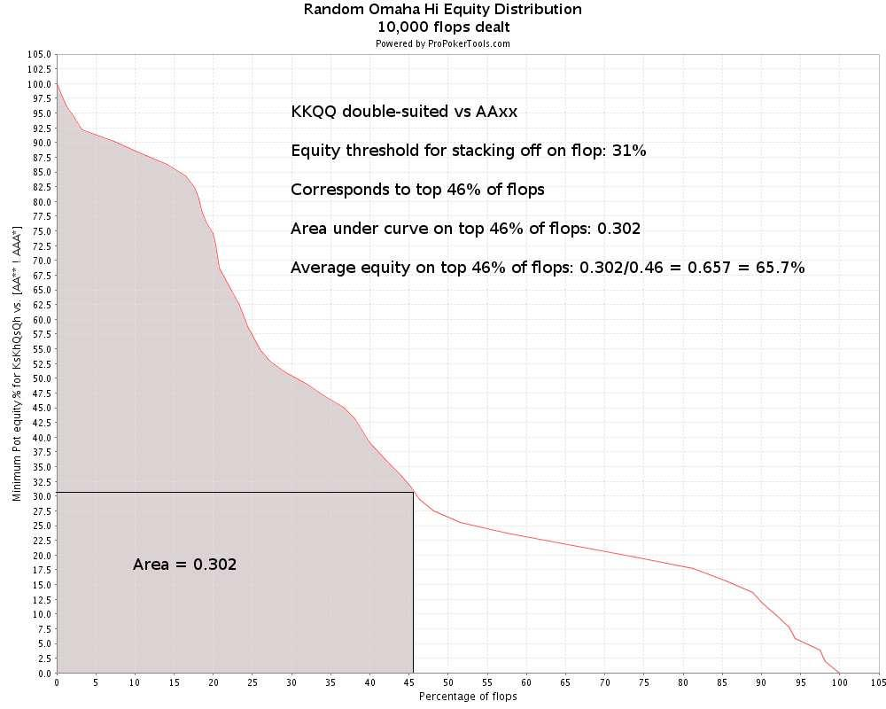
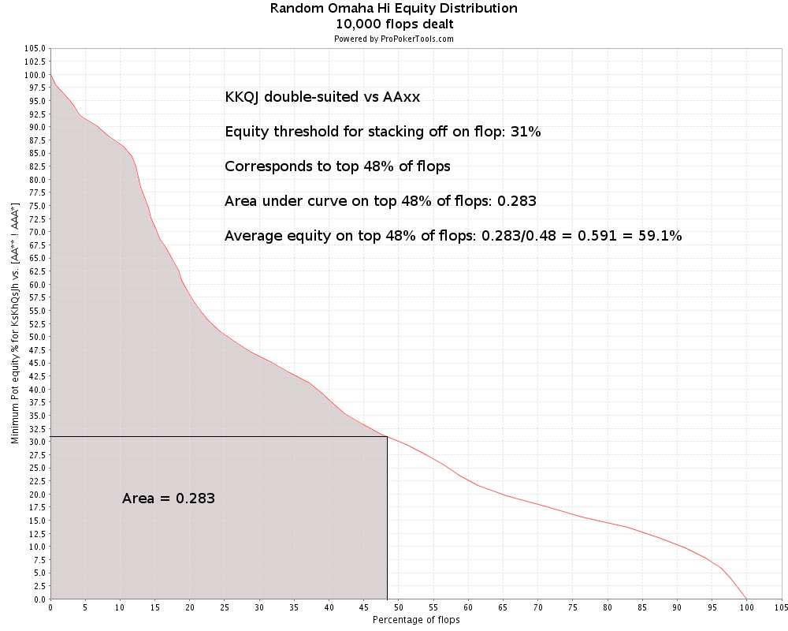
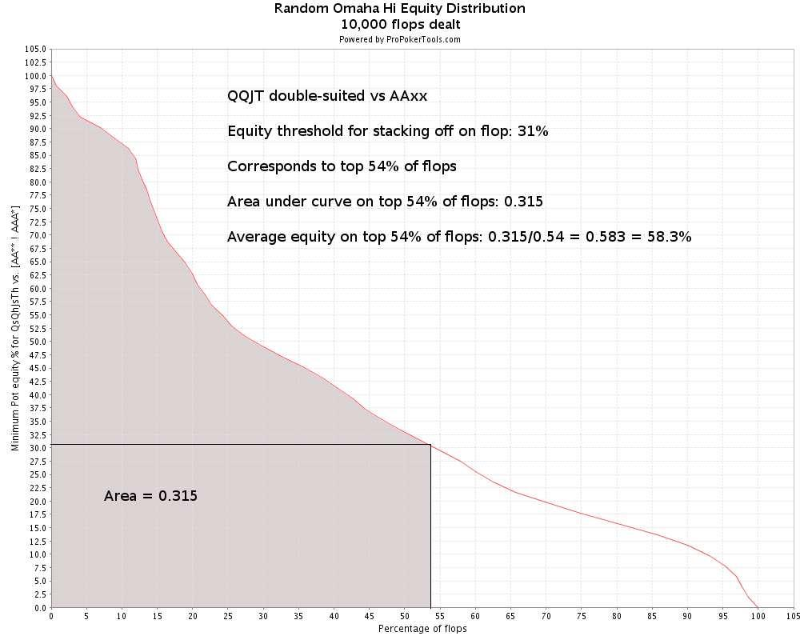
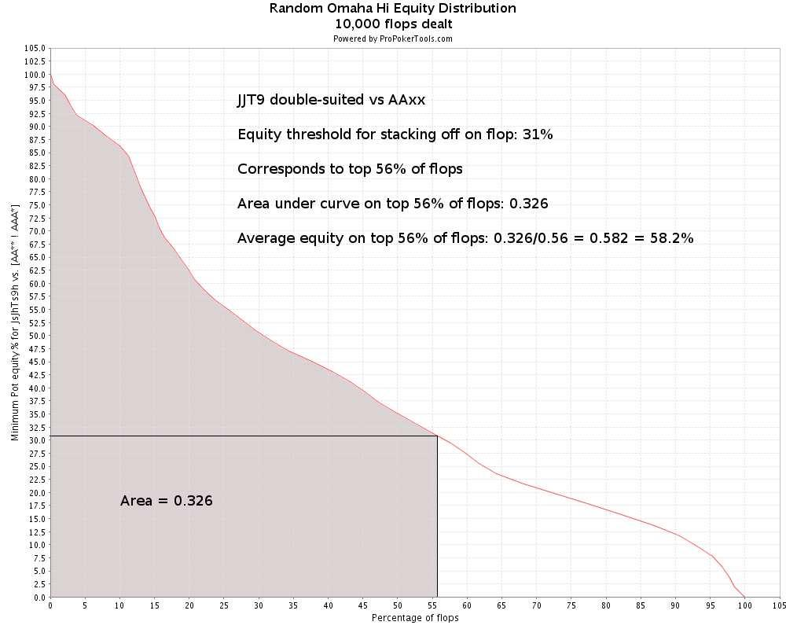
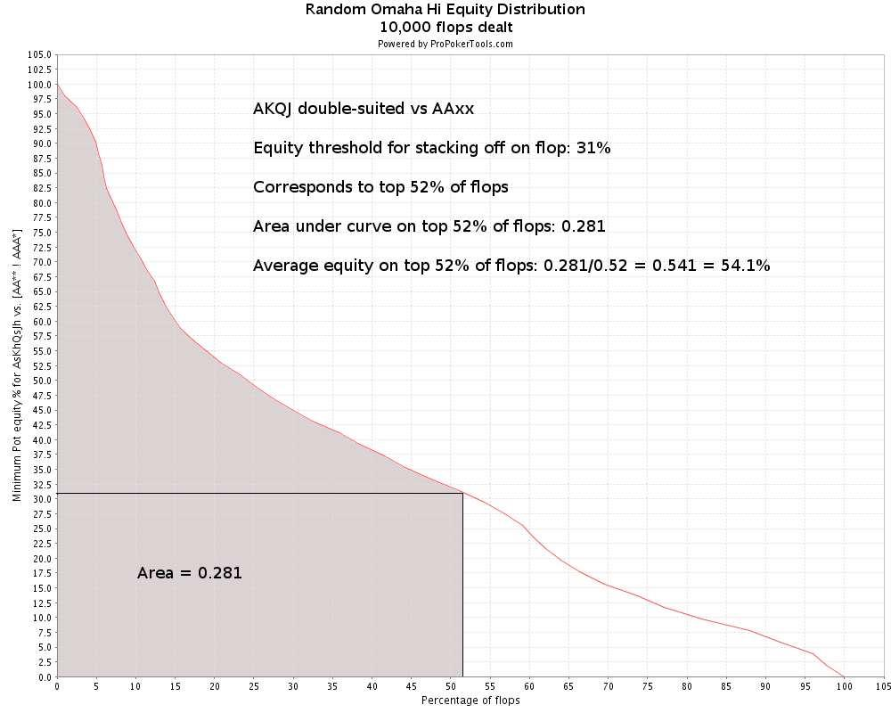
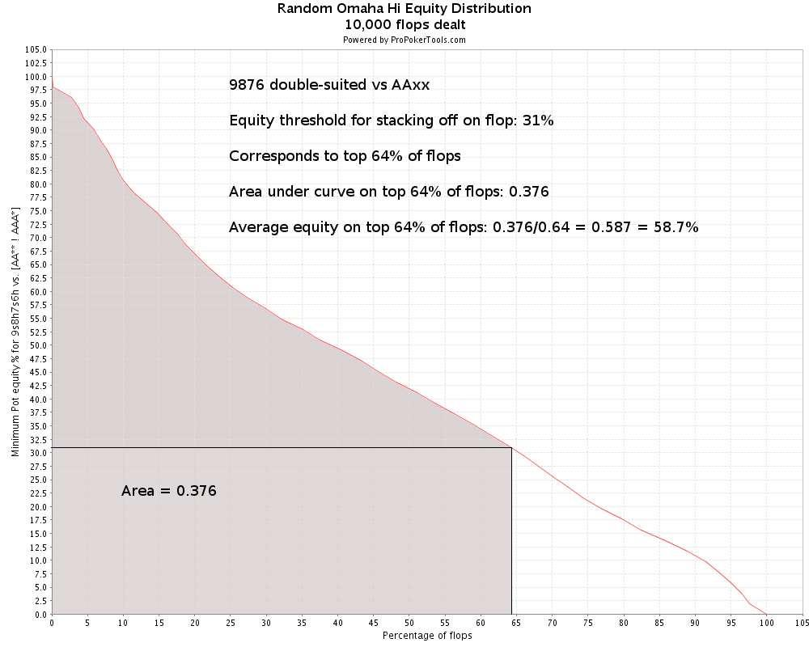
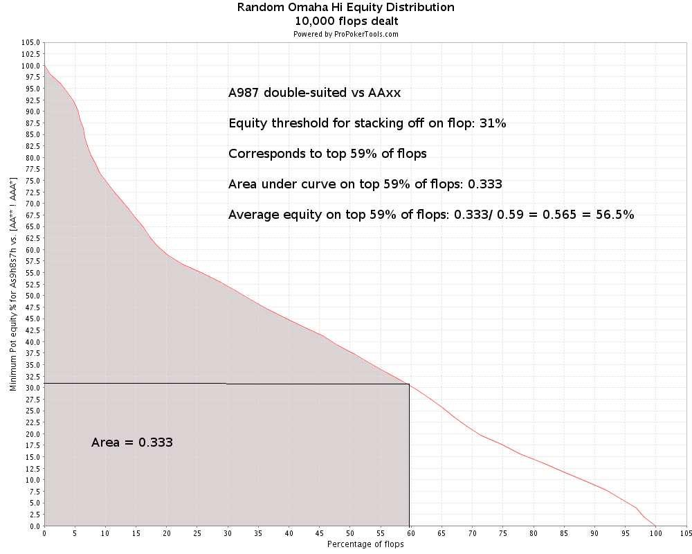
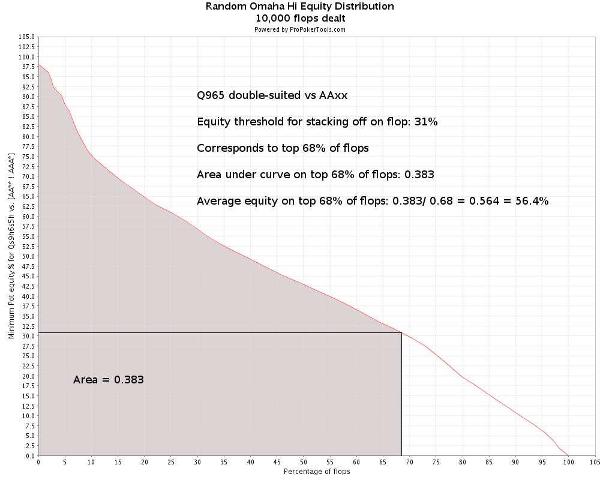
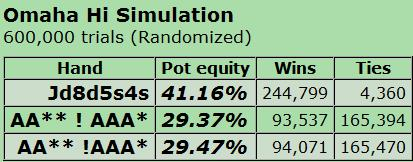

## 6.1 简介

第 6 部分是一篇相当技术性的文章，我们将在其中彻底研究一个狭窄的主题：

- 4-bet
- 对抗 4-bet

当我们说 “技术性” 时，我们的意思是讨论将围绕数学、翻牌权益分布和对手范围的简单假设展开。原因是在 100 BB 起始筹码的情况下，我们在 4-bet 后还剩下 1 个底池大小的下注（假设到目前为止的所有加注都是底池大小）。因此翻牌后的玩法（如果有的话）归结为范围 / 底池赔率的决定。

这对我们来说意味着两件事：

1. 100 BB 筹码的 4-bet 底池是大底池，大底池是重要的底池。
2. 100 BB 筹码的 4-bet 底池的正确玩法可以用（相对）简单的数学很好地描述。

技术性和一成不变的策略很容易学习。因此，4-bet / 对抗 4-bet 的主题为我们提供了大量 “唾手可得的成果”，并且该领域的漏洞（例如，在单挑 4-bet 底池中翻牌时太轻易弃牌）通常很容易修复。

我们已经拥有必要的工具（翻牌权益分布、底池赔率 / 权益、ProPokerTools），并且我们在本文中所做的一切都已在之前的文章中讨论过。那些需要复习翻牌权益分布的人可以重读第 3 部分。

为了使讨论简单并集中于最重要的概念，我们将假设我们在整篇文章中都使用 100 BB 筹码进行游戏，并且我们将研究不是盲注对抗的单挑游戏。换句话说，我们将研究单挑场景，其中：

- 我们加注并被有利位置的玩家 3-bet
- 我们在有利位置对加注者 3-bet，而他 4-bet 我们。

我们首先讨论 4-bet，然后对抗 4-bet。我们将在整个过程中用示例说明该理论。

## 6.2 4-bet

作为本主题的介绍，让我们看一个示例场景：

### 6.2.1 被松散范围的 3-bet 示例

$10PLO 6-max

你（$10）持有 A♠️K♥️K♠️J♥️ 在 CO 加注到 3.5 BB，BTN（$15.20）3-bet 到 12 BB，其他对手弃牌。你只与 BTN 打了 60 手牌，但你已经看到他在有利位置用投机牌 3-bet 4 次，并打到摊牌。你怀疑他用宽范围的牌投机 3-bet 和诈唬 3-bet。你的计划是什么？

首先，让我们想想如何对抗对手只 3-bet A-A-x-x 这种情况：

面对只 3-bet A-A-x-x 的对手，手牌中有一对和一张 A，我们最多有 34% 的翻牌前权益来对抗随机 A-A-x-x。因此 4-bet 是不可行的，因为我们将被 5-bet，并被迫以很大劣势跟注剩余的筹码（我们必须跟注，因为我们将获得 > 2 : 1  的底池赔率，而劣势则低于 2 : 1）。

如果对手 3-bet 所有 A-A-x-x，然后在翻牌后过度玩它们，从数学上讲，通过跟注并在翻牌后玩 “不中就弃牌” 来玩这个优质对子是可能的（我们可以使用翻牌权益分布建模来展示这一点），在这种情况下，我们可以考虑跟注。但如果对手只用好的 A-A-x-x 进行 3-bet，并且在翻牌后玩得很好，他就会将我们的隐含赔率保持在最低水平，而我们将很难让这笔跟注对我们有利可图。

因此，无论我们的手牌看起来有多好，如果另一种选择是跟注并在不利位置打 “不中就弃牌”，那么我们都有充分的理由在面对只用好 A-A-x-x 进行 3-bet 的优秀玩家时弃牌。无论如何，如果我们被 A-A-x-x 3-bet，无论对手的倾向如何，我们都必须用我们的优质手牌做出一个接近且棘手的决定。但是当对手 3 -bet 范围很宽时会发生什么？

面对一个利用位置优势，用各种非 A-A-x-x 牌型进行 3-bet 很宽范围的对手，我们显然不能弃牌。我们的牌型能够很好地压制对手的大部分牌型，而且我们经常会在翻牌拿到最佳牌型、最佳听牌，或者两者兼得。所以我们至少应该跟注。

跟注是最好的选择吗？不一定，因为跟注使我们在不利位置打翻牌后几乎 90% 的剩余筹码。这给了对手更多机会在翻牌后利用他的位置优势。

但是如果我们 4-bet 底池到 $3.75 怎么样？现在我们消除了对手的隐含赔率，因为如果我们的筹码中只剩下不到一个底池大小的下注，他的跟注将使我们至少翻牌获得一个超对。请注意，如果他 5-bet 全押，我们必须跟注，因为我们将获得底池赔率 $13.9 : $6.25 = 2.22 : 1（我们需要 31% 的权益，而我们有 34%）。但是由于对手的 3-bet 范围很宽，而且我们手中有一张 A（这使对手拥有 A-A-x-x 的可能性降低了一半），他通常不会拥有 A-A-x-x。在这种情况下，他会弃牌或跟注。如果他弃牌，那太好了！如果他跟注，我们在翻牌前拥有最好的手牌，我们可以像拥有 A-A-x-x 一样玩剩下的手牌。换句话说，我们可以有利可图地全押任何翻牌，而对手对此无能为力。

因此，最重要的因素是：

- 对手很少有 A-A-x-x，因为他 3-bet 范围很广，而我们手里有一张 A。
- 我们的 K-K-x-x 在对抗对手的非 A-A-x-x 牌时几乎和 A-A-x-x 一样好。

**结论：**

我们 4-bet 底池到 $3.75。对手跟注。

**Flop：**T♠️6♣️3♥️（$7.50）

你的筹码剩下 $6.25。你的计划是什么？

你已经做好了有利可图地全押任何翻牌的准备，而对手无法剥削利用这一点，这是对你来说很好的翻牌之一。它不协调，你有一个超对 + 更好的对子的补牌 + 两个后门同花听牌和一个后门顺子听牌。

**Flop：**T♠️6♣️3♥️（$7.50）

你（$6.25）全押，BTN（$11.45）跟注。

**Turn：**T♠️6♣️3♥️7♠️（$20.15）

**River：**T♠️6♣️3♥️7♠️2♠️（$20.15）

你凭借坚果同花获胜。BTN 是 T♥️9♦️8♥️6♥️。他翻牌击中了两对，在转牌时改进为顺子，但输给了我们的后门同花。

哇哦！看起来我们在这里很幸运，但真的是这样吗？我们在翻牌前有 65% 的权益，并且作为大幅领先押上了大部分筹码。

然后对手以两对的翻牌领先了我们，其余筹码在翻牌押上时有 34% 的权益。但我们的翻牌玩法在数学上是正确的，即使我们看到对手的手牌，我们也会全押，因为我们的底池赔率 > 2 : 1，劣势小于 2 : 1。

请注意，我们翻牌权益的很大一部分（3 张后门听牌 = 3 张补牌）来自我们以优质协调手牌开始的结果。这次，正是后门听牌之一拯救了我们。对于某些人来说，这看起来像是运气，但这是我们在以优质手牌开始时经常期望发生的事情。优质起手牌通常会在翻牌时除了手牌的主要强度成分外，还带来额外的权益，这让我们有更多的翻牌我们可以承诺全押获利并实现所有权益。

我们将从这个例子中汲取见解，并更深入地研究轻度 4-bet（即用非 A-A-x-x 牌进行 4-bet）对抗松散的 3-bet 对手。

### 6.2.2 什么是松散的 3-bet 范围？

在我们决定用哪些牌对松散的 3-bet 进行 4-bet 之前，让我们首先就什么是松散的 3-bet 范围达成一致。

我们首先分析我们自己的 3-bet 单挑范围，然后将百分比分配给此范围内的不同类型的牌。对于此任务，我们使用 ProPokerTools 中的 “组合数” 功能。

从第 4 部分我们记得我们核心策略 3-bet 范围的价值部分是：

- 优质 A-A-x-x，至少是单同花，边牌有一对、两张百老汇牌或一个连张。
- 优质百老汇包牌，至少是单同花，最好是 A 同花。
- 优质 K-K-x-x、Q-Q-x-x、J-J-x-x，至少是单同花，有连张边牌或另一个高对。

例如：

A♦️A♠️Q♦️Q♣️

A♣️A♥️K♣️J♥️

A♥️A♦️T♠️9♦️

A♣️Q♠️J♠️T♥️

K♠️Q♥️J♠️T♥️

K♥️K♠️Q♦️J♠️

K♦️Q♦️Q♣️J♠️

Q♥️J♣️J♥️9♣️

K♠️K♦️Q♠️Q♥️

而投机性的 3-bet 范围是：

- 好的同花连牌
- A 同花带好的连牌

例如：

Q♥️J♠️T♥️9♣️

9♣️8♥️7♣️6♥️

Q♥️T♠️9♥️8♠️

J♠️9♠️8♥️7♣️

T♦️8♦️7♠️5♠️

A♣️T♣️9♠️8♥️

A♥️9♣️8♥️7♣️

A♠️J♠️9♥️8♥️

A♦️8♠️7♦️6♥️

让我们非常具体地定义一个总的 3-bet 范围，并根据这些定义用 ProPokerTools 符号表示。我们首先将总范围分成不重叠的子范围（不重叠 = 每手牌都位于一个且只有一个子范围内）。

对于每个子范围，我们计算组合数以及它们占所有起手牌的百分比（通过除以奥马哈手牌总数，即 270725）。最后，我们通过将所有子范围的百分比相加来计算总的 3-bet 百分比（我们可以进行此求和，因为子范围不重叠）。

**6.2.2.1 优质 A-A-x-x 牌**

我们的起点是所有 A-A-x-x 牌（但不包括 A-A-A-x）的范围：

AA** ! AAA*

= 6768 / 270725（2.50%）

然后我们将优质 A-A-x-x 牌的范围定义为所有双同花 A-A-x-x 的范围，加上所有单同花 A-A-x-x 的范围，其中有两张百老汇牌、一对或一个连张带一个缺口，范围低至 7-6 / 8-6：

(AA** & (*s*s*h*h,*s*s*d*d,*s*s*c*c,*h*h*d*d,*h*h*c*c,*d*d*c*c)),
((AABB,AABT,AATT,AA99,AA88,AA77,AA66,AA55,AA44,AA33,AA22,AAT9,AAJ9,AA98,AAT8,AA87,AA97,AA76,AA86) & (*s*s**,*h*h**,*d*d**,*c*c**)) ! AAA*
= 2160 / 270725（0.80%）

根据此定义，2160 / 6768 = 0.32 = 32% 的 A-A-x-x 手牌为优质手牌。

**6.2.2.2 优质百老汇牌**

我们将其定义为任意 4 张 T 或更高牌，或任意 4 张 9 或更高牌（带有一张 A）的范围（但不包括 A-A-x-x、T-T-x-x、9-9-x-x 或三条）。我们将此范围写为两个子范围：

四张 T 或更高点数的牌：

(BBBB,BBBT) & (*s*s**,*h*h**,*d*d**,*c*c**) ! (AA**,KKK*,QQQ*,JJJ*,TT**)
= 2762 / 270725（1.02%）

四张 9 或更高点数且带有一张 A 的牌：

(A9BB,A9BT) & (*s*s**,*h*h**,*d*d**,*c*c**) ! (AA**,TT**)
= 1644 / 270725（0.61%）

请注意，这些范围不重叠，并且它们也不与先前定义的 A-A-x-x 范围重叠。你可以通过合并范围来检查这一点。然后，你将看到合并范围包含的手牌数量与子范围中手牌数量的总和完全相同。

无论如何，优质百老汇手牌的子范围构成了 2762 + 1644 = 4406 种组合，占所有奥马哈手牌的 1.02% + 0.61% = 1.63%。

**6.2.2.3 投机牌**

我们将好的连牌的子范围定义为所有从 x-x-x-9 到 x-x-x-5 的连牌的范围，至少是单同花并且结构中最多只有一个缺口：

(QJT9,KJT9,KQT9,KQJ9,JT98,QT98,QJ98,QJT8,T987,J987,JT87,JT97,9876,T876,T976,T986,8765,9765,9865,9875) & (*s*s**,*h*h**,*d*d**,*c*c**)
= 4640 / 270725（1.71%）

具有好的连牌的 A 同花的范围定义为从 A-x-x-8 到 A-x-x-5 的 A 同花的范围，最多有一个缺口的连牌：

(AT98,AJ98,AJT8,A987,AT87,AT97,A876,A976,A986,A765,A865,A875) & (As*s**,Ah*h**,Ad*d**,Ac*c**)
= 1776 / 270725（0.66%）

根据这些定义，投机性 3-bet 牌型的子范围总共构成 4640 + 1776 = 6416 种组合，占所有奥马哈手牌的 1.71% + 0.66% = 2.37%。

**6.2.2.4 总范围**

- 优质 A-A-x-x 牌：2160 / 270725（0.80%）
- 优质百老汇牌：4406 / 270725（1.63%）
- 投机牌：6416 / 270725（2.37%）
- 总计：12982 / 270725（4.80%）

因此，我们最终得出 3-bet% 为 4.80%。我们将此数字四舍五入为 5%，并将其用作在有利位置上用优质高牌和优质投机牌单挑进行 3-bet 的基准。

此 3-bet 范围中的 A-A-x-x / 百老汇牌部分占所有手牌的 0.80% + 1.63% = 2.43%。这些牌占总 3-bet 范围的 2160 / 12982 + 4406 / 12982 = 0.166 + 0.339 = 16.6% + 33.9% = 50.5%。因此，3-bet 范围大约在优质高牌和优质投机牌之间各占一半（我们选择以此方式定义这些类别），并且范围的 1/6 是 A-A-x-x。

请注意，优质 A-A-x-x + 优质百老汇牌的数量（占所有奥马哈手牌的 2.43%）几乎等于所有 A-A-x-x 牌的百分比（占所有奥马哈手牌的 2.50%）。因此，如果你被 3-bet% 约为 2.5% 的玩家 3-bet，这并不一定意味着他只用 A-A-x-x 3-bet。这也可能意味着用范围很紧的优质 A-A-x-x 和优质百老汇牌。无论如何，这种紧的 3-bet 范围不是你想用轻度 4-bet 攻击的，即使对手并不总是有 A-A-x-x。

还有一点需要评论：我们在这里整理的 3-bet 范围大约是我们在有利位置上单挑进行 3-bet 时使用的核心策略范围。但这并不意味着每次出现这种情况时，我们都会用所有这些投机牌 3-bet（我们还必须评估情况，而不仅仅是我们的手牌）。这意味着我们 3-bet 后范围内的牌型分布不一定与可能的 3-bet 牌型范围内的牌型分布相同。

无论如何，这个范围包括优质同花和协调的高牌手牌和投机牌，它们在与加注者单挑的 3-bet 底池中都发挥良好。我们将使用相关的 3-bet% ~5% 作为基准来评估其他 3-bet 范围。

现在我们问：

*3-bet% 必须有多大才能让我们确信对手在进行各种投机性 3-bet？*

我们首先假设一个激进的 3-bet 者在有利位置对我们会用较松的 A-A-x-x 3-bet。所以让我们将所有 A-A-x-x 都纳入范围，看看我们得到什么：

- 所有 A-A-x-x：6768 / 270725（2.50%）
- 优质百老汇牌：4406 / 270725（1.63%）
- 投机牌：6416 / 270725（2.37%）
- 总计：17590 / 270725（6.50%）

3-bet% 增加到 6.5%。请注意，A-A-x-x 牌在范围内的相对百分比增加到 6768 / 17590 = 0.385 = 38.5%，因此这不一定是我们想要用轻度 4-bet 攻击的范围。

但我们可以得出这样的结论：当我们计算了所有 A-A-x-x 加上其他牌类中剩余的最佳牌时，3-bet% 仍然 < 7%。

现在，假设我们遇到一个非常松散激进的玩家， BTN 的 3-bet% 为 12%。根据上述范围分析，我们知道他的范围必须包含大量中 / 低质量的牌。例如，质量一般的连牌 T♣️8♣️6♠️5♠️。

因此，你可以从范围分析工作中得出的结论是，价值 3-bet 和用好的投机手牌 3-bet 的阈值在 5-7% 左右（取决于我们包括了多少 A-A-x-x 手牌）。我们还看到，仅用优质 A-A-x-x 和优质百老汇手牌进行 3-bet 的阈值约为 2.5%。最后，对所有 A-A-x-x 和仅对 A-A-x-x 进行 3-bet 的玩家的 3-bet% 为 2.5%。

有了这些百分比，你现在可以使用玩家统计数据 + 阅读 + 摊牌时看到的手牌来决定是否应该用轻度 4-bet 来对抗 3-bet 者。

“轻度 4-bet” 在这里意味着对所有 A-A-x-x + 选定的优质非 A-A-x-x 牌进行 4-bet。确定我们可以 4-bet 哪些非 A-A-x-x 牌是该过程的下一步。

### 6.2.3 面对松散的 3-bet 者，合理的核心策略 4-bet 范围是什么？

当我们从只用 A-A-x-x 牌 4-bet 转变为在单挑 3-bet 场景中用 A-A-x-x 牌和优质非 A-A-x-x 牌 4-bet 范围时，我们基于对手用很宽的范围 3-bet 这一事实。因此，他很少有 A-A-x-x，而且他的许多非 A-A-x-x 牌质量都令人生疑。

在这种情况下，优质高牌（例如 K♠️K♥️Q♠️Q♥️、A♠️K♦️K♠️J♦️、A♠️K♥️Q♠️J♥️）的权益将增加，原因有两个：

- 我们很少对抗 A-A-x-x
- 我们对抗对手的非 A-A-x-x 牌有很好的权益

后者基于这样一个事实：当对手持有一些中 / 低手牌（例如 9♠️8♥️6♦️4♠️）时，我们的高对子的表现几乎与 A-A-x-x 一样好。

例如，对手持有 9♠️8♥️6♦️4♠️ 对抗 A-A-x-x 的权益为 40.32%，对抗 K-K-x-x 的权益为 39.84%，因此当我们 4-bet 时，持有哪手牌并不重要。

为了进一步降低对手持有 A-A-x-x 的概率，我们还可以要求自己持有一张 A。这将对手持有 A-A-x-x 的概率降低到 50%，如下所示：

我们首先计算所有 A-A-x-x 组合，然后从牌堆中移除一张 A 牌后计算所有 A-A-x-x。可能的 A-A-x-x 牌数从 6768 减少到 3384，正好是原来的一半。

现在我们将优质核心策略 4-bet 范围定义为：

- A-K-K-x + A-Q-Q-x，至少 A 单同花和百老汇边牌。
- A-K-x-x，至少带 A 单同花和两张百老汇边牌。

换句话说，像这样的牌：

A♠️K♠️K♦️Q♥️

A♠️K♥️Q♠️Q♥️

A♠️K♠️Q♦️T♦️

这个范围当然不是一成不变的，如果我们愿意，我们可以包含更多优质 A-K-K-x / A-Q-Q-x / A-K-x-x 牌。例如，我们可以取消关于 A 同花标准，并接受任何同花的组合。我们还可以通过包括最佳的连牌来给范围增加一些欺骗性，例如双同花的 K-Q-J-T、Q-J-T-9 和 J-T-9-8（这些牌在对抗松散的 3-bet 的范围内诸如 J-9-7-6 之类的各种粗糙连牌时表现良好）。

因此，随着经验的积累，你可以尝试使用更广泛的 4-bet 范围来对抗非常松散的 3-bet 者。但是，使用我们在此处定义的范围作为核心策略组件，以便在有疑问时可以依靠。

画一个德州扑克的类比，这个 4-bet 范围大致相当于 4-bet K-K、Q-Q 和 A-K，而不仅仅是 A-A。为了找到非 A-A-x-x 4-bet 牌组合的数量，我们用 ProPokerTools 符号表示范围并计算：

(AKKQ,AKKJ,AKKT,AKQQ,AQQJ,AQQT,AKQJ,AKQT,AKJT) & (As*s**,Ah*h**,Ad*d**,Ac*c**)
= 804 / 270725（0.30%）

由任何 A-A-x-x 牌加上上面的 A-K-K-x / A-Q-Q-x / A-K-x-x 牌组成的总 4-bet 范围变为：

(AA** ! AAA*), ((AKKQ,AKKJ,AKKT,AKQQ,AQQJ,AQQT,AKQJ,AKQT,AKJT) & (As*s**,Ah*h**,Ad*d**,Ac*c**))
= 7572 / 270725（2.80%）

这给了我们一个占所有手牌 2.80% 的 4-bet 范围。该范围主要偏向 A-A-x-x，但有 804 / 7572 = 0.11 = 11% 的优质非 A-A-x-x 牌。然而，在我们开始使用这个范围之前，我们需要回答最后一个问题：

*我们如何用非 A-A-x-x 牌对抗 5-bet？*

这是一个简单的底池赔率问题（记住：我们讨论的是使用 100 BB 筹码的玩法）。假设我们在 CO 加注到 3.5 BB，对手在 BTN 位置 3-bet 到 12 BB，我们 4-bet 到 37.5 BB，对手全押。底池现在为 139 BB，而我们有 62.55 BB。底池赔率是 139 : 62.5 = 2.22 : 1，我们需要 1 / (2.22 + 1) = 0.31 = 31% 的权益才能有利可图地跟注全押。

以下是我们 4-bet 范围中的 3 个双同花版本的 A-K-K-x、A-Q-Q-x 和 A-K-x-x 对抗随机 A-A-x-x 的权益。单同花版本的权益（我们将最后一张牌变成梅花）在括号中：

- A♠️K♠️K♥️Q♥️：33.99%（29.80%）
- A♠️Q♠️Q♥️J♥️：35.69%（31.62%）
- A♠️K♠️Q♥️J♥️：34.49%（30.64%）

我们得出结论，单同花的牌是盈亏平衡或略微 -EV，而双同花的牌是略微 +EV。在这种情况下，如果对手只用 A-A-x-x 5-bet，无论我们做什么，我们都不会犯大错误。

但请注意，面对只用优质 A-A-x-x 牌下注 3-bet 的对手，我们更有理由在他 5-bet 时弃牌。原因是我们现在面对的是一系列更好的 A-A-x-x 牌，这些牌也是同花的且协调性很好。为确保万无一失，我们通过重复上述计算来测试一下，其中我们用之前定义的优质 A-A-x-x 范围替换任何 A-A-x-x：

(AA** & (*s*s*h*h,*s*s*d*d,*s*s*c*c,*h*h*d*d,*h*h*c*c,*d*d*c*c)),((AABB,AABT,AATT,AA99,AA88,AA77,AA66,AA55,AA44,AA33,AA22,AAT9,AAJ9,AA98,AAT8,AA87,AA97,AA76,AA86) & (*s*s**,***h*h,*d*d**,***c*c)) ! AAA*
= 2160 / 270725（0.80%）

- A♠️K♠️K♥️Q♥️ ：32.36%（28.87%）
- A♠️Q♠️Q♥️J♥️ ：33.81%（30.37%）
- A♠️K♠️Q♥️J♥️ ：32.24%（29.00%）

影响不大，但现在所有单同花牌都是 -EV，而双同花牌则更加边缘化。

但无论我们选择什么，在面对 A-A-x-x 的 5-bet 时仍然不可能犯下大错误。因此，如果你有理由相信对手可以 5-bet 非 A-A-x-x 牌，请务必用所有这些牌跟注。做出略微 -EV 的跟注也可以对你的牌桌形象产生积极影响。我们告诉对手，我们愿意为我们已经投入大量资金的底池而努力奋斗，这可能会让他们更直接地与我们对抗（这对我们有好处）。

### 6.2.4 轻度 4-bet 的效果

为了说明轻度 4-bet 对我们有什么作用，让我们通过一个示例来说明，在这个示例中，我们对一个松散的 3-bet 者进行 4-bet。我们知道对手的牌，而我们的牌未知（但我们有一个已知范围）。

$10PLO 6-max

你（$10）在 CO 用宽范围开池加注到 $0.35，BTN（$10）用 J♠️9♥️7♣️6♠️ 3-bet 到 $1.20。你 4-bet 到 $3.75。对手现在认为他面对的是 A-A-x-x，他可以轻松跟注，手牌是一手不错的同花连牌（在本文后面我们将看到为什么这是自动跟注）。

**Flop：**K♠️9♦️2♣️（$7.50）

你（$6.25）将其余筹码推入。对手（$6.25）应该怎么做？

对手现在需要决定底池赔率。他得到 13.75 : 6.25 = 2.2 : 1，因此他需要 1 / (2.2 + 1) = 0.31 = 31% 的权益。

他翻牌击中第二对 + 后门同花听牌 + 后门顺子听牌。如果你有 A-A-x-x（他假设），他现在有：

- 2 张三条的干净补牌
- 9 张两对的脏补牌（不保证能领先）
- 2 张后门同花或后门顺子几乎干净的补牌

对手决定将三条和后门补牌算作干净的补牌。两对的 9 张补牌并非全部干净，应该稍微打折。当对手在转牌拿到两对时，我们推测的 A-A-x-x 牌有 8 张补牌（2 张 A、3 张 K、3 张 2）可以拿到顶三条或更好的两对。

转牌有 8 张补牌的概率大约是 1/5，因此对手将他的 9 张两对补牌减少到 9(4 / 5) = 7.2 = 7 张补牌。然后他保守地再去掉 1 张补牌，以估算我们的 A-A-x-x 牌也能从边牌中获得一些权益。

对手现在估计他有：

- 2 张干净的三条补牌
- 6 张干净的两对补牌
- 2 张干净的后门同花或后门顺子补牌

总共有 10 张干净的牌，因此翻牌的权益为 3 x 10 + 9 = 39%。因此，他的权益超过了所需的 31%，他很高兴跟注我们的全押 c-bet。为了检查他的计算，我们进行了计算，我们发现对手在翻牌有 38.91% 的权益。因此，他的权益估计与我们推测的牌完全一致。

但是对手在我们实际的 4-bet 范围（由 A-A-x-x + 优质 A-K-K-x、A-Q-Q-x 和 A-K-x-x 组成）中表现如何？不太好，因为他现在有 37.71% 的权益。

虽然没有太大差别，但我们确实成功降低了他跟注我们 4-bet 的盈利能力。我们还通过展示愿意 4-bet 非 A-A-x-x 牌来 “蒙蔽” 对手。很难说这种做法在未来的牌局中会产生什么结果（如果有的话），但无论对手做出什么调整，都可能对我们有利。例如，如果他们开始轻度 5-bet ，他们将受到严厉惩罚，因为我们 4-bet 时 9 次中有 8 次是 A-A-x-x（请记住：我们 4-bet 的牌中只有 11% 是非 A-A-x-x 牌）。或者如果他们调整为减少 3-bet（因为我们现在更频繁地 4-bet），这也对我们有利。我们从 4-bet 中获得的另一个优势是使牌局更容易玩。我们不必在不利位置跟注，筹码还剩下 $8.80，需要做出重要的翻牌后决定，而是可以自动全押任何翻牌，从而使翻牌后玩牌成为一种定式。这大大降低了对手的位置优势，这是一个不容小觑的因素。

让我们通过打出这手牌来结束这个例子。转牌和河牌并不重要，因为我们在翻牌全押，拥有巨大的 +EV，但让我们来下点狠手，让转牌和河牌如下：

**Turn：**K♠️9♦️2♣️Q♠️（$20.15）

**River：**K♠️9♦️2♣️Q♠️2♠️（$20.15）

对手 J♠️9♥️7♣️6♠️ 在看到转牌和河牌后欣喜若狂，直到他看到你的强牌 A♦️K♦️K♣️J♥️。对手现在痛苦地尖叫，并愤怒地 3-bet 接下来的 7 手牌。

## 6.3 防御可能的 A-A-x-x 的 4-bet

本文的后半部分是关于比轻度 4-bet 更频繁出现的场景，即防御可能的 A-A-x-x 的 4-bet。

这是翻牌前游戏的一部分，对于经常利用自己的位置进行轻度 3-bet 的玩家来说，正确应对这一部分非常重要（我们在第 4 部分和第 5 部分中对此进行了详细讨论）。我们 3-bet 的次数越多，我们给 A-A-x-x 的 4-bet 机会就越多，因此，知道如何正确防御这些 4-bet 非常重要。

### 6.3.1 防御 4-bet 的核心策略

如第 4 部分简要讨论的那样，我们防御 100 BB 筹码的 4-bet 单挑的核心策略包括：

1. 假设对手有 A-A-x-x 并据此对抗
2. 5-bet A-A-x-x 全押
3. 用足以对抗 A-A-x-x 的牌跟注 4-bet，并且你的翻牌后计划是在拥有最低所需权益的翻牌上全押。

第 1 点通常成立，尤其是在较低级别时，如果你错了，通常平均不会有太大偏差。

第 2 点显然是正确的，因为我们现在通常会与另一个 A-A-x-x 进行翻硬币）。我们可能在垃圾牌 A-A-x-x 上处于劣势（例如，垃圾牌 A♠️A♥️7♦️2♣️ 在与优质牌 A♦️A♣️K♦️Q♣️ 的对抗中处于 41.5% 劣势，但底池足够大，我们不必担心这一点。另外，请注意，我们很少 3-bet 垃圾牌 A-A-x-x，因此这种情况不太可能发生。

需要改进的是第 3 点。我们现在想找到以下问题的答案：

*哪些牌在对抗 A-A-x-x 时表现足够好，可以用 100 BB 筹码跟注可能的 A-A-x-x 的 4-bet？*

我们在第 4 部分中对这个主题做了一些一般性评论，我们假设我们想要同花和协调的牌经常击中翻牌。击中大量翻牌使我们经常能够在翻牌时可以 +EV 全押，从而获得翻牌前大笔投资的回报。类似这样的 9♠️8♥️7♠️6♦️ 同花连牌显然适合于此目的，但我们在这里还能玩什么其他牌？哪些牌绝对不能跟注 4-bet？

为了弄清这个问题，我们需要进行一些实验。在之前的文章中，我们已经使用翻牌权益分布进行了大量数学建模，我们将再次使用这个 “方法”。

### 6.3.2 持有 100 BB 对抗 A-A-x-x 4-bet 的模型

以下是我们的模型：

- 对手在 CO 加注到 3.5 BB
- 我们在 BTN 3-bet 到 12 BB
- 对手用 A-A-x-x 4-bet 到 37.5 BB，我们跟注。
- 对手在翻牌 c-bet 全押
- 当我们在翻牌有足够的权益（31%）时跟注

跟注 4-bet（37.5 BB）花费我们 25.5 BB。翻牌底池现在有 75 BB，剩余筹码为 62.5 BB。对手现在 c-bet 最后 62.5 BB 全押。我们的底池赔率为 (75 + 62.5) : 62.5 = 137.5 : 62.5 = 2.2 : 1。我们需要 1 / (2.2 + 1) = 0.31 = 31% 的权益才能获利。

现在我们确定跟注翻牌前 4-bet 的 EV：

我们在翻牌前 31% 的翻牌中跟注对手的全押 c-bet，其中我们至少有 31% 的权益。否则我们弃牌并损失我们跟注的金额（25.5 BB）。当我们跟注全押时，我们在 201.5 BB 底池中平均拥有翻牌权益 *av_equity*，截至我们跟注 4-bet 时，我们已经投入了 88 BB。

我们从翻牌权益分布图中找到 *top_x* 和 *av_equity*，然后根据以下公式计算跟注 4-bet 的 EV：

EV（跟注 4-bet）
= (1 - top_x)(-25.5 BB) + top_x(av_equity(201.5 BB) - 88 BB)

现在我们挑选一些有代表性的 3-bet 牌型用于我们的模型。我们记得，我们 3-bet 的核心策略在概念上区分了 3 种类型的 3-bet：

- 价值 3-bet
- 投机 3-bet
- 诈唬 3-bet

### 6.3.3 当我们价值 3-bet 被 A-A-x-x 4-bet

我们价值 3-bet 的核心策略是：

- 优质 A-A-x-x，至少是单同花，有一对、两张百老汇牌或一个连张。
- 优质百老汇包牌，至少是单同花，最好是 A 同花。
- 优质 K-K-x-x、Q-Q-x-x、J-J-x-x，至少是单同花，有连张的边牌或另一个高对。

持有 A-A-x-x 我们 5-bet 全押，因此有趣的情况是百老汇包牌和优质对子。我们首先从此类别中挑选 5 手非常优质双同花牌（即我们的最佳情况）：

- K♠️K♥️Q♠️Q♥️
- K♠️K♥️Q♠️J♥️
- Q♠️Q♥️J♠️T♥️
- J♠️J♥️T♠️9♥️
- A♠️K♥️Q♠️J♥️

以下是每手牌的翻牌权益分布，以及计算跟注 4-bet 的 EV：

**6.3.3.1 优质双同花两对（K♠️K♥️Q♠️Q♥️）vs A-A-x-x**

EV（跟注 4-bet）
= (1 - 0.46)(-25.5 BB) + 0.46(0.657(201.5 BB) - 88 BB)
= +6.66 BB

**6.3.3.2 优质双同花 + 连张 K-K-x-x（K♠️K♥️Q♠️J♥️）vs A-A-x-x**

EV（跟注 4-bet）
= (1 - 0.48)(-25.5 BB) + 0.48(0.591(201.5 BB) - 88 BB)
= +1.61 BB

**6.3.3.3 优质双同花 + 连张 Q-Q-x-x（Q♠️Q♥️J♠️T♥️）vs A-A-x-x**

EV（跟注 4-bet）
= (1 - 0.54)(-25.5 BB) + 0.54(0.583(201.5 BB) - 88 BB)
= +4.19 BB

**6.3.3.4 优质双同花 + 连张 J-J-x-x（J♠️J♥️T♠️9♥️）vs A-A-x-x**

EV（跟注 4-bet）
= (1 - 0.56)(-25.5 BB) + 0.56(0.582(201.5 BB) - 88 BB)
= +5.20 BB

**6.3.3.5 优质双同花 A 高百老汇包牌（A♠️K♥️Q♠️J♥️）vs A-A-x-x**

EV（跟注 4-bet）
= (1 - 0.52)(-25.5 BB) + 0.52(0.541(201.5 BB) - 88 BB)
= -1.34 BB

**6.3.3.6 价值 3-bet 范围中优质双同花牌的 EV 总结**

- K♠️K♥️Q♠️Q♥️：+6.66 BB
- K♠️K♥️Q♠️J♥️：+1.61 BB
- Q♠️Q♥️J♠️T♥️：+4.19 BB
- J♠️J♥️T♠️9♥️：+5.20 BB
- A♠️K♥️Q♠️J♥️：-1.34 BB

我们观察到，我们可以用具有双花色和相连边牌的高对子有利可图地跟注，但即使是双同花，A 高百老汇包牌也应该弃牌。

我们注意到 Q-Q-x-x 和 J-J-x-x 的表现优于 K-K-x-x。原因是对手的 A-A-x-x 手牌阻挡了 K-K-x-x 可以形成的许多顺子，而较小的对子形成更多不涉及 A 的顺子。为了调查这种趋势是否会在更小的对子中继续，我们还将对具有双同花和相连边牌的低对子进行模拟。

- 7♠️7♥️6♠️5♥️

我们还将对价值 3-bet 范围中的 A-x-x-x 牌进行更多研究，为此，我们还包括带有 A 的双同花对子：

- A♠️K♥️K♠️J♥️
- A♠️Q♥️Q♠️J♥️
- A♠️J♥️J♠️T♥️

最后，我们将通过计算上述所有单同花牌型的 EV 来研究双同花的影响。然后，我们将其中一张牌变成梅花（K♠️K♥️Q♠️Q♣️，K♠️K♥️Q♠️J♣️ 等），并进行另一轮翻牌权益分布模拟。

我们不会在这里包含所有图表和计算，我们只是列出结果：

**6.3.3.7 价值 3-bet 范围手牌的最终数据集**

以下是迄今为止讨论的所有牌跟注 4-bet 的 EV。我们列出了双同花版本，按类型排序（成对 / 非成对以及有 / 无 A）。单同花牌的 EV 在括号中：

- K♠️K♥️Q♠️Q♥️：+6.66 BB（+2.63 BB）
- K♠️K♥️Q♠️J♥️：+1.61 BB（-2.74 BB）
- Q♠️Q♥️J♠️T♥️：+4.19 BB（+0.03 BB）
- J♠️J♥️T♠️9♥️ ：+5.20 BB（+1.14 BB）
- 7♠️7♥️6♠️5♥️：+6.01 BB（+2.02 BB）
- A♠️K♥️K♠️J♥️：-1.04 BB（-3.83 BB）
- A♠️Q♥️Q♠️J♥️：+0.21 BB（-3.37 BB）
- A♠️J♥️J♠️T♥️：+1.31 BB（-2.61 BB）
- A♠️K♥️Q♠️J♥️：-1.34 BB（-5.79 BB）

**6.3.3.8 价值 3-bet 范围手牌跟注 4-bet 的结论**

我们可以从上面的数据集得出一些结论：

高两对可以有利可图地跟注 A-A-x-x，无论是单同花还是双同花。如果我们做过模拟，我们可能会看到 J-J-T-T 表现优于 K-K-Q-Q，因为它有更好的顺子潜力（A-A-x-x 阻挡了更多 K-K-Q-Q 的顺子）。我们还可以用双同花和相连边牌的单对跟注，并弃掉所有没有对子的 A 高牌。

对于高对来说，拥有 2 种同花非常重要，你可以弃掉单同花的 K-K-x-x 和 Q-Q-x-x。但你可以用单同花和相连边牌的 J-J-x-x 及更低的对子牌跟注。我们不会默认 3-bet  7♠️7♥️6♠️5♥️ 那样低对，但有趣的是，这些对子对抗 A-A-x-x 的表现优于 K-K-x-x 和 Q-Q-x-x（因为顺子阻挡效应）。

我们注意到所有 A-x-x-x 牌对抗 A-A-x-x 都很吃力。这是显而易见的，因为这些牌实际上只有 3 张牌在玩。没有对子的 A 高百老汇包牌应该始终弃牌，无论花色如何。A-K-K-x 也是如此，而双同花的 A-Q-Q-x 和 A-J-J-x 是边缘跟注（同样是因为顺子阻挡效应）。

### 6.3.4 当我们投机 3-bet 被 A-A-x-x 4-bet

我们进行投机性 3-bet 的核心策略是：

- 良好的同花连牌
- 良好的 A 同花和连牌

我们从两个同花最佳候选牌开始：

- 9♠️8♥️7♠️6♥️
- A♠️9♥️8♠️7♥️

以下是两手牌的翻牌权益分布图，以及计算跟注 4-bet 的 EV：

**6.3.4.1 优质双同花连牌（9♠️8♥️7♠️6♥️）vs A-A-x-x**

EV（跟注 4-bet）
= (1 - 0.64)(-25.5 BB) + 0.64(0.587(201.5 BB) - 88 BB)
= +10.25 BB

**6.3.4.2 优质 A 双同花 + 连牌（A♠️9♥️8♠️7♥️）vs A-A-x-x**

EV（跟注 4-bet）
= (1 - 0.59)(-25.5 BB) + 0.59(0.565(201.5 BB) - 88 BB)
= +4.74 BB

**6.3.4.3 投机 3-bet 范围中优质双同花牌的 EV 总结**

- 9♠️8♥️7♠️6♥️：+10.25 BB
- A♠️9♥️8♠️7♥️：+4.74 BB

我们已经看到（第 3 部分和第 4 部分）完美的双同花连牌在 4-bet 底池中对抗 A-A-x-x 时表现非常好。然而，有趣的是，A 双同花 + 连牌的表现也很好，即使它实际上是 3 张牌对抗 A-A-x-x 。如前所述，拥有不被 A-A-x-x 阻挡的顺子潜力很重要。

为了研究顺子结构中缺口的影响，我们还将进行模拟

- T♠️8♥️7♠️5♥️

我们还将对所有这些牌的单同花版本进行模拟（9♠️8♥️7♠️6♣️，等等）。

**6.3.4.4 投机 3-bet 范围手牌的最终数据集**

以下是迄今为止讨论的所有牌的 EV（括号中为单花色牌的 EV）：

- 9♠️8♥️7♠️6♥️：+10.25 BB（+6.75 BB）
- T♠️8♥️7♠️5♥️：+10.19 BB（+6.05 BB）
- A♠️9♥️8♠️7♥️：+4.74 BB（+0.81 BB）

**6.3.4.5 投机 3-bet 范围手牌跟注 4-bet 的结论**

我们立即得出结论，同花连牌对抗 A-A-x-x 是强牌。从完美的连牌到具有顶部 + 底部缺口的连牌牌几乎没有改变 EV。双同花连牌更有利，但单同花的连牌也明显有利可图。

对于 A 同花 + 连牌，我们发现这些牌非常依赖于第二种同花。单同花的牌略微 +EV，但弃牌不会让我们损失太多。

### 6.3.5 当我们诈唬 3-bet 被 A-A-x-x 4-bet

很难对这一类别做出概括，我们也没有在这里定义任何核心策略范围。相反，我们定义了何时考虑诈唬性 3-bet 的指导方针。我们还指出，我们应该避免纯粹的垃圾牌，并坚持至少使用有潜力的同花牌。

现在我们来看看一个 4-bet 场景，在这个场景中，我们用 3-bet 一个双同花和非常粗糙的连牌并被 4-bet。在第 4 部分的示例 4.4.11 中，我们用 Q♠️9♥️6♠️5♥️ 进行了诈唬性 3-bet。我们没有计算跟注 4-bet 的 EV，但表示我们将在本文中更详细地研究这种情况。

这意味着我们正在对以下顶部有两个双缺口的双同花连牌进行模拟：

- Q♠️9♥️6♠️5♥️

**6.3.5.1 诈唬 3-bet 双同花（Q♠️9♥️6♠️5♥️）vs A-A-x-x**

EV（跟注 4-bet）
= (1 - 0.68)(-25.5 BB) + 0.68(0.564(201.5 BB) - 88 BB)
= +9.23 BB

**6.3.5.2 诈唬 3-bet 范围的最终数据集**

我们只挑选了一手牌来说明诈唬 3-bet。我们还对单同花版本（Q♠️9♥️6♠️5♣️）进行了模拟，结果为：

- Q♠️9♥️6♠️5♥️：+9.23 BB (+4.60 BB)

**6.3.5.3 诈唬 3-bet 范围手牌跟注 4-bet 的结论**

我们在此研究的一手牌的结论证实了我们对投机性 3-bet 牌的发现：连牌是对抗 A-A-x-x 的非常强的牌！“强” 的意思是，只要牌具有一定的协调性并且是同花，结构缺陷就无关紧要。一两个缺口变化很小，甚至顶部有多个缺口也是如此。

但在我们过于迷恋这些同花半垃圾牌之前，请记住，我们现在只将它们与 A-A-x-x 对抗。在这种情况下，它们表现良好，但如果我们以某种方式用这些牌参与多人底池，我们通常会因为它们有限的坚果潜力而陷入困境。

因此，这里重要的是要考虑翻牌前打法和翻牌后打法之间的关系，以及我们试图通过 3-bet 设置的翻牌后场景。在 3-bet 这些牌之前，我们必须仔细评估情况。我们想要弃牌权益，并且我们想要在翻牌前偷走底池，或者在有利位置与我们可以很好地控制的加注者单挑。

如果我们在翻牌前做对了，我们很少会发现自己在翻牌后处于棘手的位置。如果我们正确评估了情况，我们通常会单挑。如果我们被 4-bet，我们很容易防御可能的 A-A-x-x。这项工作在我们具备以下条件时会变得容易：

- 位置
- 关于对手手牌的可靠信息（他只 4-bet A-A-x-x）
- 一手对抗 A-A-x-x 表现良好的手牌

我们通过以下方式确保了这些事情：

- 利用有利位置进行诈唬 3-bet
- 了解对手是一个直截了当的玩家
- 选择一手同花的手牌并有一定的协调性。

这部分最后我们举两个例子来说明如何防御 4-bet。第一个例子是一个比较常见的情况，我们用投机性连牌对抗可能的 A-A-x-x，但翻牌对手很可能已经击中了顶暗三条，所以我们需要比平时更巧妙地计算出剩余的补牌。

在第二个例子中，我们用一手非常粗糙的双同花牌进行 3-bet 诈唬，并在 3 人底池中被 4-bet 和 5-bet 全押。我们将会看到，在假设双方对手打法都很直接的情况下，这种情况是细微的（并且有利可图）。

### 6.3.6 防御可能被 A-A-x-x 4-bet 的示例：在翻牌圈对抗顶三条时计算补牌数

$10PLO 6-max

CO（$10）加注到 $0.35。他很直接，在被 3-bet 后在不利位置打得很紧，因此你在 BTN 持有 J♥️9♥️7♠️5♠️ 选择投机 3-bet 到 $1.20。盲注弃牌，CO 4-bet 到 $3.75。

正如我们所见，这是用一手不错的同花且协调良好的牌对抗可能被 A-A-x-x 的常规跟注。你跟注，计划在你有足够权益的所有翻牌全押。正如我们已经多次看到的那样，权益门槛是 31%。因此，你需要翻牌拿到两对或更好的牌，或者至少有 8 张干净补牌的对子 / 听牌组合（这将给我们 4 x 8 = 32% 的权益）。

**Flop：**A♥️T♥️7♣️（$7.50）

CO（$6.25）全押。你有足够的权益跟注吗？

在对抗可能的 A-A-x-x 翻牌击中一对 + 同花听牌 + 卡顺听牌通常值得庆贺和快速跟注。但在这里我们需要谨慎。对手可能拥有顶暗三条，在这种情况下，我们所有的两对 / 三条补牌都已死了。

那么让我们看看我们有什么：

- 8 张好同花（第三坚果同花）补牌
- 3 张非同花补牌，形成坚果顺子。

但如果我们在转牌圈击中补牌，对手就有 9 张四条 / 葫芦补牌（1 张 A、3 张 T、2 张 7，加上 3 张与转牌配对的补牌）。转牌圈的 9 张补牌对应于 ~ 1/5 的机会（我们在进行这些粗略估计时对小数点不太在意），因此我们可以将 11 张补牌减少到 11(4/5) = ~ 9。

在之前我们计算补牌数的例子中，我们保守地去掉了 1 张额外的补牌数，以说明对手从他的边牌中获得的额外权益。但在这里，我们所有的补牌数都是最少排第 3 坚果牌（记住：我们所有的两对和三条补牌都是死牌），所以我们假设这里不需要进一步减少。

我们推测的 9 张干净的补牌让我们在翻牌时获得 4 x 9 = 36%。检查显示，对抗随机 A-A-x-x 的实际权益为 34.98%，我们的估计相当不错。

所以我们跟注，让扑克之神决定我们的命运。

**Turn：**A♥️T♥️7♣️2♠️（$20.15）

**River：**A♥️T♥️7♣️2♠️K♠️（$20.15）

这次输了。对手摊牌 A♣️A♦️K♣️9♣️ 用顶暗三条拿下底池。我们对抗他的实际手牌有 35.98% 的权益，并且完美防御了他的翻牌前 4-bet。

在这样的全押冲突之后，重要的是放下肩膀，冷静、冷静地继续下一手牌。松散激进的 PLO 游戏，翻牌前大量加注和 3-bet，不可避免地会让我们陷入许多像这样的边缘全押局面。我们会输掉很多。这不应该困扰我们，我们唯一需要关心的是，我们投入的资金是否有足够的权益。

如果我们始终设法在 55/45 掷硬币和边缘底池赔率决策如上面情况中处于正确位置，我们的任务就完成了。长远来看，剩下的事情将会解决（尽管如果 PLO 方差决定折磨我们，我们可能不得不等待很长时间才能获得应有的利润）。

### 6.3.7 防御 4-bet 的示例：防御多人底池 4-bet + 5-bet

$10PLO 6-max

CO（$17.20）加注到 $0.35。他很紧 / 稳健，在有利位置很容易通过 3-bet 击败他。你持有 J♦️8♦️5♠️4♠️ 评估情况并选择在 BTN 位置 3-bet 到 $1.20 进行诈唬。SB（$15.30）是一个稳健而直率的紧凶玩家，现在 4-bet 到 $4.05，CO 全押。你有什么计划？

哎呀！你遇到了两手强牌，所以你必须放弃你那手非常投机的牌，对吗？

不完全是。在你做任何事情之前，利用可用的时间思考一下到目前为止这手牌发生了什么。CO（紧 / 稳健）加注，他将有广泛的范围来采取这一行动。然后你 3-bet，另一位紧 / 稳健的玩家在 150 BB 深的筹码在不利位置 4-bet 对抗 CO 。

除非 SB 完全不合常理，否则他只能拿一手牌，那就是 A-A-x-x。CO 可能也知道这一点，当他全押时，我们可以假设他也持有 A-A-x-x。因此，如果我们跟注，我们预计 SB 会在我们后面跟注，这样我们就可以在 $30.10 的三人底池中全押（请注意，我们的对手筹码已经超过了我们，所以我们的有效筹码为 $10）。

当我们被 5-bet 时，用 $8.80 跟注，可以赢得净 $21.30（假设 SB 在我们后面跟注）。有效底池赔率为 21.30 : 8.80 = 2.42 : 1，我们需要 1 / (2.42 + 1) = 29% 的权益才能跟注。

我们有这么多权益吗？是的，如果他们都有 A-A-x-x，我们甚至可能是有利可图的。这是因为他们现在互相阻挡（即他们有彼此的补牌）。我们将我们的手牌与 2 手随机 A-A-x-x 手牌对抗，并输入 ProPokerTools 并获得：

我们不仅是有利可图（我们需要在 3 人底池中超过 33% 的权益），而且还是领先很多。因此，我们不仅 “防守性地” 跟注底池赔率，而且对于翻牌前投入底池的每个额外筹码，我们都有 +EV。

通过跟注，我们将在预期 $30.10 的主底池中投资 $8.80，其中我们有 41.6% 的权益。我们跟注的 EV 为：

EV（全押）
= 0.4116($30.10) - $8.80
= +$3.59

因此，弃牌（EV = 0）是一个大错误，其代价超过 1/3 的买入。所以我们跟注，很高兴看到 SB 在我们后面跟注。

**Flop：**Q♥️J♠️4♥️（主底池：$30.10）

**Turn：**Q♥️J♠️4♥️7♦️（主底池：$30.10）

**River：**Q♥️J♠️4♥️7♦️2♦️（主底池：$30.10）

你用翻牌击中底两对拿下底池。CO 是 A♦️A♠️K♠️9♥️，而 SB 是 A♥️A♣️8♥️8♣️。他们都痛苦地尖叫，CO 威胁要向管理人员举报你作弊。

你在翻牌前有 37% 的权益来对抗实际的手牌，并且你在 3 人底池中以明显优势全押你的筹码。不错！

我们从这个例子中可以得出以下结论：当你在 3 人底池中面对两手 A-A-x-x 牌时，你可以用范围极广的投机牌全押获利（尤其是当你已经在底池中投入资金时）。而有些牌太难看了，我们不敢在这里提及它们，不要害怕起手牌范围标准。请注意，要使这种全押场景有利可图，你希望所有玩家的筹码大致相等。你不希望在与 A-A-x-x 牌之一的单挑中全押大边池。

## 6.4 总结

我们已经讨论了 4-bet / 对抗 4-bet，使用数学分析的方法。我们的目标是为数学上合理的 4-bet 策略奠定基础，从而正确处理重要事项。

由于此资料（像往常一样）在编写过程中有所扩展，因此我选择使用一些详尽的示例，而不是许多较短的示例。100 BB 筹码的 4-bet 和对抗  4-bet 策略在概念上很简单，而翻牌后打法主要归结为在翻牌时全押。玩好这些场景更像是一门手艺，而不是一门艺术形式。而且，要正确处理这些事情，你不一定非要成为天才扑克玩家。你需要的是重复、重复、再重复。

通过本文，我们已经了解了我计划讨论的翻牌前概念列表的末尾。我们还讨论了翻牌后打法，但到目前为止，还不够细致和巧妙。

下一阶段将讨论更高级的翻牌后概念，计划让本系列文章的其余部分都与翻牌后打法有关。