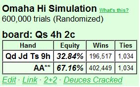
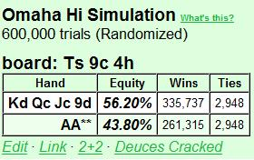
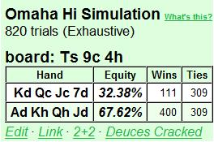
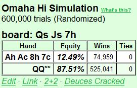
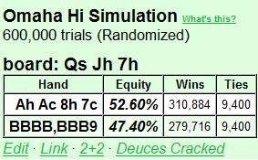
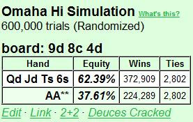
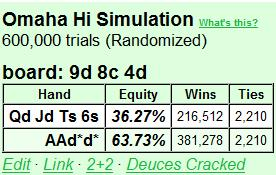
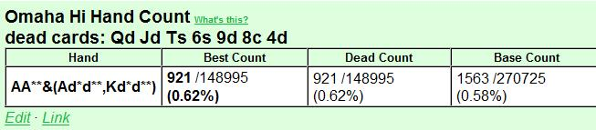
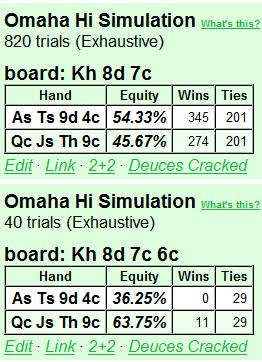
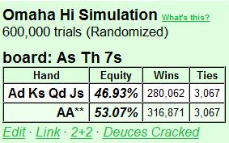

## 9.1 简介

在第 9 部分中，我们将继续讨论基于 4 个重要因素的翻牌后规划简单模型：

1. 对手数量
2. 位置
3. SPR
4. 权益（由我们手中的牌、桌上的牌以及我们对对手范围的假设决定）

在第 8 部分中，我们讨论了与牌无关的因素（1-3），现在到了第 4 个因素，即权益。

能够快速准确地估计翻牌时的权益绝对是一门手艺，而不是一门神秘的艺术。我们的估计是基于我们看到的牌 + 对手范围的假设。其余部分来自数学。我们首先计算补牌数，然后通过考虑击中补牌数但仍然输掉的概率来估计 “干净” 补牌数。最后，我们使用 “4 x” 和 “3 x + 9” 规则将补牌数转换为权益（稍后会详细介绍）。

本文将详细讲解这一过程。估算权益是游戏中非常重要的一部分，而且相对容易学习。在低 SPR 的情况下，玩家如果估算权益不够严谨，往往也能侥幸过关，因为这种情况下容错空间更大。但在高 SPR 的情况下，精准的判断就显得尤为重要。在高 SPR 情况下，草率的打法会导致我们比预期更频繁地在 55-45 的掷硬币落后的一方。

因此，即使处理补牌数和权益有点乏味，甚至有点无聊，我们也必须学会如何去做。当你学会了这种方法，就像骑自行车一样，过一段时间你就会开始或多或少地自动地做这件事。那些在激烈的战斗中很难计算大包牌补牌数的人会在这里找到有用的东西，因为我们将为这些补牌数定义一个容易记住的符号。

当所有的技术工作都完成后，我们的翻牌后模型就可以使用了，我们将从第 10 部分开始使用它。我们将从第 10 部分开始，使用一系列示例进行翻牌后分析和规划，使用我们的模型框架（对手数量 / 位置 / SPR / 权益）。我们将选择一些典型的翻牌后场景，并讨论我们在处理这些场景时应该如何评估、规划和思考。我们还将有机会重复以前文章中的一些重要概念。

PLO 是一种在每种可能情况下都有无限变化的游戏，因此在分析手牌时我们不会过于纠结于细节。我们首先将尝试使用合理的 PLO 思维过程正确处理大问题。如果我们从 PLO 游戏的合理总体框架开始，并且我们还了解底池赔率和补牌背后的数学原理，那么我们就拥有了在出现特定翻牌后情况时处理它们所需的一切。

当一般翻牌后规划的讨论结束时（在第 10 部分的开头），我们将转到一些特定的翻牌后情况，并将我们的模型用作分析它们的工具。例如，我们将在第 10 部分结束时彻底讨论 c-bet，我们将看到我们的 c-bet 决策如何根据对手数量、我们的位置、SPR 和我们估计的权益而变化。

## 9.2 我们估算翻牌后权益的方法

现在我们将系统地处理 PLO 中的补牌 / 权益估算，我们将主要关注我们正在听牌并且我们知道必须击中补牌才能获胜的情况。我们首先定义流程，然后介绍各种听牌类型，并在此过程中举例说明。

要学习这些技巧，需要做一些记忆，但这是值得的。这里没有什么神秘的东西，这是一个简单的过程。但是有一些 PLO 特定的 “怪癖” 使这个过程与德州扑克中的权益估算略有不同，这就是我们专门写这篇文章来学习它的原因。

### 9.2.1 估计听牌权益的一般程序

我们使用 3 步流程：

1. 计算所有补牌
2. 估计 “干净” 补牌的数量
3. 将干净补牌转换为权益

第一步就是计算我们拥有的赢牌的所有补牌。这当然取决于我们认为我们必须击败什么。例如，如果你有一个低对，而翻牌中没有其他牌，那么你对抗顶对时会有一些补牌，但对抗顶三条时你就没戏了。

在第二步中，我们减少补牌数量，以考虑以下情况：

1. 我们可能击中补牌，但仍然落后。
2. 我们可能击中补牌并提升到最佳牌型，但下一张牌我们的对手会拿到更好的牌。

例如，如果持有 K 高同花听牌，而没有其他牌，我们有 9 张补牌可以组成同花。但是如果某个对手有坚果同花听牌，我们就听死牌了。因此，我们通常不能将所有补牌都算作干净的，我们必须估计击中和输掉的可能性。正如我们将在本文后面看到的那样，我们是否应该听 “脏” 补牌与 SPR 密切相关。

在 SPR 极低的底池中，听脏补牌通常不会造成问题，因为我们往往能从底池中获得可观的价格补偿。但在 SPR 较高的情况下，我们必须小心谨慎，因为我们的许多补牌都是不干净的，因为我们现在有反向隐含赔率和糟糕的风险 / 回报率。因此，在 SPR 较高的情况下，我们通常会避免用非坚果听牌玩大底池。

另一种击中并输掉的情况是，在翻牌有获胜的补牌，但在我们击中后，我们的对手可以在河牌击中更好的听牌。例如，如果你在非对子翻牌（例如 A♥️J♥️9♠️8♣️ 在翻牌 K♥️7♥️2♠️）上有同花听牌，而对手有顶暗三条，则你有 8 张干净的补牌（除 2♥️ 外的所有红心）。但如果你在转牌击中同花，对手有 10 张牌面配对的补牌，可以击中葫芦或四条。因此，你在翻牌的干净补牌实际上少于 8 张。我们将学习使用简单的数学 + 关于对手手牌的假设，将补牌减少为干净补牌。

当我们估计出干净补牌的数量时，我们将其转换为权益。在翻牌，我们有两张牌要发，我们使用两个简单的数值近似值（请注意，当 x = 9 张补牌时，它们给出的答案相同）：

- 当 x < 9 张补牌时：权益 = 4 x
- 当 x = 9 张或更多补牌时：权益 = 3 x + 9
例如，当 x = 4 张补牌时，我们在翻牌有 4 x 4 = 16% 的权益。当 x = 14 张补牌时，我们在翻牌有 3 x 14 + 9 = 51% 的权益。这些规则是对确切权益的数值近似，但正如我们从下面的精确计算中看到的那样，它们效果很好：

**翻牌有 4 张补牌的准确权益**

我们知道 7 张牌（手牌中的 4 张 + 翻牌的 3 张牌），因此有 52 - 7 = 45 张未知牌，其中 4 张是我们的补牌。在转牌或河牌击中的机会等于 1 减去在转牌和河牌都未击中的机会：

P = 1 - (41 / 45)(40 / 44) = 0.17 = 17%

接近 4 x 规则给出的估计值（16%）。

**翻牌有 14 张补牌的准确权益**

我们使用与上述相同的逻辑，得到：

P = 1 - (31 / 45)(30 / 44) = 0.53 = 53%

接近 3 x + 9 规则给出的估计值（51%）。

我们经常会得到一到两个百分点的误差，但重要的是要意识到整个过程都是近似的。我们经常会在估计补牌数时引入误差，然后在补牌到权益转换中多出的几个百分点很少是有意义的。例如，如果我们多算了 1 张补牌或少算了 1 张补牌，我们已经在权益估计中引入了约 4% 的误差，这比 4 x 和 3 x + 9 规则中的数值误差还要大。

最后，如果我们想估计转牌的权益，这只是最后一张牌击中的概率。我们通过将补牌数除以未见牌数来计算这个数字。例如，如果有 4 张补牌，我们在转牌上有 4 / 44 = 0.09 = 9% 的权益。如果有 14 张补牌，我们在转牌上有 14 / 44 = 0.32 = 32% 的权益。

现在我们已经定义了我们的程序，我们继续计算各种类型的听牌。对于每种类型的听牌我们还将简要讨论听牌的价值如何根据 SPR 而变化。

请注意，在 PLO 中，成手牌和听牌之间的区别比在德州扑克中更 “模糊”，并且通常将成手牌和听牌牌视为没有意义。在本文中，我们将松散地使用符号 “听牌” 来表示需要改进才能获胜的手牌。这包括也具有成手牌的价值，但不足以在遇到攻击时不改进就进入摊牌的手牌。

## 9.3 击中对子听牌两对 / 三条

当你翻牌击中对子时，例如 K♦️Q♠️J♦️9♠️ 在翻牌 K♥️8♠️4♦️ 时，你有两对 / 三条的听牌。在高 SPR 场景中，这是一种弱听牌（例如跟注和加注底池），但在低 SPR 场景中（例如 3-bet 和 4-bet 底池）可能是一种强听牌。

两对 / 三条听牌的强度在很大程度上取决于对手的数量、SPR 和翻牌结构。你必须考虑你面对的牌、你的即时底池赔率、改进和输掉的机会以及未来的下注（如果筹码很深，这可能会给你带来严重的反向隐含赔率）。

将两对 / 三条听牌作为主要听牌的经典例子是在 4-bet 底池中与 A-A-x-x 单挑。在干燥翻牌，很容易估计出牌的数量，如下例所示：

**示例 9.3.1：在 4-bet 底池中，两对 / 三条牌听牌对抗假定的 A-A-x-x**

$10PLO 6-max

CO（$10）加注到 $0.35，你（$10）持有 Q♦️J♦️T♠️9♥️ 在 BTN 位置 3-bet 到 $1.20，盲注弃牌，CO 4-bet 到 $3.75，你跟注。你假设 CO 持有 A-A-x-x，因此你的计划是全下所有你有足够权益对抗 A-A-x-x 的翻牌。

让我们看看两个不同的翻牌：

**Flop 1：**A♣️9♥️4♣️（$7.65）

CO（$6.25）全下，你会怎么做？

你的底池赔率为 13.9 : 6.25 = 2.22 : 1，并且你需要 1 / (2.22 + 1) = 31% 的权益才能有利可图地跟注。你翻牌时击中了一对，你假设对手没有 A-A-x-x，因此你将所有翻牌对子视为两对 / 三条听牌。因此，你有 9 + 2 = 11 个两对 / 三条补牌。这很好，但如果 CO 是 A-A-x-x，你在这个特定的翻牌中面对顶三条就听死牌了。因此，你被迫在这个假设下弃牌。

**Flop 2：**Q♠️4♥️2♣️（$7.65）

CO（$6.25）全下，你怎么做？

你需要像以前一样拥有 31% 的权益，而现在你在干燥翻牌圈击中一对，A-A-x-x 通常不会获得任何额外的权益。因此，你可以假设一对未改进的 A-A 是你必须击败的牌。你首先计算 9 + 2 = 11 张两对 / 三条的补牌。三条几乎总是能为你赢得底池，因此你将这 2 张补牌算作干净的。

但是，两对的补牌需要稍微打折，以考虑到 A-A-x-x 在我们击中后重新听到顶暗三条或更好的两对。当我们在转牌圈击中 9 张两对补牌中的一张时，CO 有 8 张补牌（2 张 A、3 张 4、3 张 2）可以在河牌圈击中顶暗三条或 A 两对。在转牌，我们知道 10 张牌（我们手上的 4 张牌、CO 手上的 2 张 A 牌和公共牌上的 4 张牌），所以有 42 张未知牌。这让 CO 有 8 / 42 的机会对抗我们的转牌两对，我们可以将其四舍五入为 1 / 5。

因此，我们减去两对补牌的 1 / 5，得到 9(4 / 5) = 7.2 干净的两对补牌，我们将其四舍五入为 7。然后，我们保守地再减去 1 张补牌，以说明 CO 从他的 2 张未知边牌中获得的权益。所以我们的最终估计是 6 张干净的两对补牌。

这让我们在这个干燥翻牌上得到 6 + 2 = 8 张干净的两对 / 三条补牌，我们将其转换为 4 x 8 = 32% 的翻牌权益。这仅略高于 31% 的门槛，我们有边缘跟注。但是，如果我们想降低方差，并且调整佣金的影响（可以将略微 + EV 的跟注变成收支平衡或略微 - EV 的跟注），那么弃牌是完全没问题的。但是，如果我们有几张后门听牌，配合我们的两对 / 三条听牌，那么这将会是自动跟注。

从下面的计算中，我们看到，在干燥翻牌上，我们对 A-A-x-x 的 32% 权益估计接近：

在高 SPR 或多个对手的情况下，我们很少玩两对 / 三条听牌，除非它是其他主要听牌的备用牌。主要原因是，在这些情况下，两对 / 三条听牌并非我们成牌后一定能打到摊牌的牌型，而且一旦成牌，我们很可能遭遇激进的打法。在高 SPR 的情况下，如果我们固执地用边缘牌跟注，会有非常大的反向隐含赔率，因此我们必须谨慎。所以，在高 SPR 的情况下，我们需要更有把握的牌型才能安心地玩大底池。以下是一个高 SPR 多人底池中，你持有裸两对 / 三条听牌的例子：

**示例 9.3.2：在多人溜入底池中的两对 / 三条听牌**

$10PLO 6-max

BTN（$10）率先溜入，SB（$10）溜入，你（$10）持有 K♠️J♦️9♠️2♣️ 在 BB 位置过牌。

**Flop：**A♥️K♦️8♣️（$0.30）

SB（$9.90）下注 $0.20。你怎么做？

你弃牌。翻牌你几乎不可能拿到最好的牌，而且这是多人底池中 SPR 很高的情况，这意味着在玩大底池之前，你想有坚果牌 / 坚果听牌。你的风险回报比很差，你几乎没有补牌机会（更别提干净的补牌了），只剩下一个玩家未行动，而 SB 下注时通常代表着一手强牌，所以弃牌，弃牌，弃牌。

在结束对两对 / 三条听牌的讨论之前，我们将看看我们翻牌后得到一对作为另一个主要听牌的备用牌的情况。如果我们用一副强听牌 + 一对单挑，这通常对我们来说是个好情况，因为我们现在可以处于一场压制性的听牌对听牌的对决中。如果我们对抗另一手与我们类似但没有一对的听牌，我们就有较大的优势。原因很简单，当两手听牌都失败时，我们的一对通常会获胜。下面是一个例子：

**示例 9.3.3：一对 + 听牌对抗没有对子的听牌**

$10PLO 6-max

你（$10）持有 K♦️Q♣️J♣️9♦️ 在 BTN 加注到 $0.35，SB（$10）3-bet 到 $1.15，你跟注。SB 是众所周知的紧凶玩家，其 3-bet 范围主要由 A-A-x-x、好的百老汇牌和一些优质投机牌组成。

**Flop：**T♠️9♣️4♥️（$2.40）

SB（$8.85）下注 $2.40。你怎么做？

你被紧凶玩家 3-bet，他在翻牌上下注，翻牌给了你一个强听牌。你翻牌时击中了一个非常好的包牌顺子听牌（本文后面会详细介绍），并且你有 13 张坚果补牌（4 张 8、3 张 J、3 张 Q、3 张 K）来组成顺子。我们将所有这些都视为干净的，因为我们在干燥翻牌上听坚果牌，并且我们估计对手 3-bet 的牌在这个翻牌上不会有很多暗三条。

你还有一对和后门同花听牌。击中你的一个踢脚牌会让你获得顺子，因此你不会从获得两对的补牌中获得任何额外的收益。但是你有 2 张额外的三条补牌，以及 1 张额外的后门同花补牌。你保守估计，这两个弱听牌会给你带来 2 张干净的补牌，以配合你的包牌。

因此，你估计翻牌上有 13 + 2 = 15 张干净的补牌。这使我们在翻牌时对抗一手在我们击中后没有再听牌的更好的牌（例如 A-A-x-x 带有无用的边牌）时有 3 x 15 + 9 = 54% 的权益。下面的计算证实了我们的估计：

因此，我们绝对可以用我们的对子 + 包牌来对抗对手范围中的 A-A-x-x 部分，以获得价值。由于他也用其他牌 3-bet，因此他也可能翻牌时拿到听牌，或者他可能完全错过了翻牌。如果他有听牌，那不可能比我们的听牌更好，除非他有相同的包牌 + 更好的对子。这种情况很少发生，因此我们也可以对他的听牌加注以获得价值。如果他用空气牌 c-bet，我们当然是大幅领先，因此我们加注（我们不介意他在大底池中弃掉他的空气牌）。

我们得出结论，对对手范围中的所有牌型加注似乎都是正确的，因此我们只需在翻牌时全下：

**Flop：**T♠️9♣️4♥️（$2.40）

SB（$8.85）下注 $2.40，我们（$8.85）加注全下，SB 跟注。

**Turn：**T♠️9♣️4♥️K♠️（$20.10）

**River：**T♠️9♣️4♥️K♠️7♥️（$20.10）

SB 持有 A♦️K♥️Q♥️J♦️ 的牌型与我们相同，但没有对子。翻牌时我们的权益为 66%，如下所示：

在 PLO 中，翻牌 66% 的优势是巨大的。但如果我们有相同的包牌但没有一对（例如 K♦️Q♣️J♣️7♦️），对手将大幅领先。他现在拥有与我们相同的包牌，并且拥有翻牌 A 高牌的最佳手牌：

因此，我们看到，除了强大的听牌外，拥有一对的效果可能非常巨大。请注意，当我们拥有一对 + 包牌组合时，对子很少会给我们额外的补牌机会，因为踢脚牌是补牌的一部分。我们获得了一些额外的三条补牌机会，但最大的效果是我们的对子是翻牌时最好的成手牌。如果对手没有一对，但有听牌，我们现在可以赢得大量转牌和河牌都是空白牌的底池。一对还可以作为阻止对手在翻牌时再听牌的手段，当他翻牌击中三条或两对时（我们在转牌听牌后，河牌上可以让他拿到葫芦的补牌就少了一张）。

我们得出结论，一对牌可以成为强力主听牌（例如包牌或坚果同花听牌）的宝贵补充。正是这些额外的优势让我们在翻牌 55-45 的掷硬币下更有可能获胜，或者将原本微弱的 +EV 转化为更强的 +EV。

## 9.4 同花听牌

翻牌出现彩虹牌的概率为：

P（彩虹翻牌）= (52 / 52)(39 / 51)(26 / 50) = 0.40 = 40%

因此，在 60% 的翻牌中，存在翻牌同花听牌的可能性。这使得同花性成为 PLO 起手牌的极其重要的属性。每次你玩没有同花的起手牌时，你都会在翻牌后做出棘手的决定，这就是为什么我们在将起手牌标记为 “优质” 之前要求有同花。在从《零开始学习 PLO》第 2 部分中关于起手牌的讨论中，我们最多将彩虹牌归类为 “边缘”，这就是原因。

当你翻牌时，手牌类型不错但不是很好，没有太多改进潜力，当翻牌可能出现同花听牌时，你通常必须在翻牌后采取防守策略。但是，如果你有同花听牌作为成手牌的备用牌，那么你可以玩得更激进，尤其是坚果同花听牌（它可以让你的手牌变成真正的怪兽牌）。

在 PLO 中估计同花听牌的补牌比在德州扑克中更复杂，因为坚果同花听牌和低同花听牌之间的差异更大（当你有低同花听牌时，在 PLO 中其他人有更大的同花听牌的可能性比在德州扑克中更大）。因此，我们不会计算同花补牌，而是更 “全面” 地考虑手牌，并根据我们拥有的其他东西、对手数量和 SPR 来评估同花听牌的强度。

无论如何，一手坚果同花听牌在翻牌给了我们 8 张坚果牌补牌（有 8 张同花牌没有配对牌面），但有时如果我们怀疑还有其他同花听牌或我们怀疑有人有暗三条（是一手对抗我们坚果同花的好牌），我们就必须稍微打折扣。这些考虑在多人底池的高 SPR 下尤其重要，因为在大底池中犯错的代价会上升。

非坚果同花听牌的价值远低于坚果同花听牌，因为翻牌我们总是面临着与坚果同花听牌对决的风险。非坚果同花听牌的价值也高度依赖于 SPR 和对手人数。在 SPR 较高的多人底池中，只听非坚果同花而没有其他牌力，无异于自杀。但在 SPR 较低的单挑中，例如在 SPR 约为 1 的 4-bet 底池中，非坚果同花听牌可能成为重要的权益组成部分。

我们还可以利用后门同花听牌获得有价值的额外权益，例如 A♠️K♥️J♠️T♥️ 在 Q♥️9♠️2♣️ 翻牌上，我们有 13 张补牌加上 2 张后门同花听牌。我们通常将后门同花听牌算作 1 张补牌，但当我们有很多对手和听牌较低时，我们可以稍微减少一点（例如减少到 1/2 张补牌）。

以下是一个热身示例，说明坚果同花听牌对翻牌上手牌价值的巨大影响：

**示例 9.4.1 裸超对对抗超对 + 坚果同花听牌**

$10PLO 6-max

BTN（$10）加注到 $0.35，你（$10）持有 A♥️A♣️8♥️7♣️ 在 SB 位置 3-bet 到 $1.15，BTN 跟注。BTN 是一个稳健的紧凶玩家。

**Flop 1：**Q♠️J♠️7♥️（$2.40）

你还剩下 $8.85。你的计划是什么？

如果你在这种类型的翻牌上 c-bet 并被加注，你显然会完蛋。因此，如果你下注，你就是在下注 - 弃牌。翻牌非常 “湿”，有大量可能的听牌。我们估计这也是与 BTN 用于开池加注然后跟注 3-bet（他的范围应该包含很多同花高 / 中牌）范围很好地协调的翻牌。

例如，如果 BTN 手上有 4 张从 A 到 9 的随机百老汇牌，那么即使他并不总是有同花听牌，我们也几乎被击败了：

而面对坚果牌，我们完全完蛋了：

因此，我们预计翻牌与对手的范围有很好的关联，而当他的牌关联很好时，我们的权益就很差。因此，你的选择是过牌并放弃，或者下注并弃牌以应对加注（如果你被跟注，大多数转牌都会输）。现在让我们看看当你翻牌拿到坚果同花听牌时，情况会如何变化：

**Flop 2：**Q♠️J♥️7♥️（$2.40）

你还剩下 $8.85。你的计划是什么？

在这里，如果我们被加注，下注并全下筹码是显而易见的。有了坚果同花听牌，我们的权益就会大幅增加，而且面对一手随机的百老汇牌，有 4 张 A 到 9 之间的牌，我们现在是领先的：

我们甚至在对抗坚果牌时也有不错的权益：

在 PLO 中，有同花听牌或没有同花听牌就像是两个不同的世界。在两张同色翻牌中没有同花听牌时，我们经常被迫过牌并放弃或用我们的边缘牌下注 - 弃牌。SPR 越高，当其他人完全有可能拥有同花听牌时，越难从没有同花听牌的牌中获利。但是有了同花听牌，尤其是坚果同花听牌，我们可以下注更多，而 SPR 较低时，我们的决定通常会变得自动（例如，我们很高兴地用一个超对 + 坚果同花听牌在 3-bet 底池中用 100 BB 筹码全下我们的筹码）。

但是初学者很容易在 PLO 中高估裸同花听牌。因此，这里有一些指导原则：

- 坚果同花听牌如果搭配另一个听牌或者配合一个不错的成手牌，往往具有很高的价值。
- 裸坚果同花听牌的价值有限
- 非坚果同花听牌与另一个好听牌或一手不错的成手牌组合时可以具有不错的价值
- 裸非坚果同花听牌几乎毫无价值（例外是 SPR 极低的单挑）

我们首先来看看裸坚果同花听牌。在翻牌继续使用这种听牌总是很诱人，这可能是正确的。但我们始终要考虑到：

- 当两张同色翻牌有很多行动时，我们的某些同花补牌很可能在其他对手手里。
- 当我们击中坚果同花时，很难从中获得很多价值，尤其是在不利位置时。

因此，裸坚果同花听牌不是一手足够强到可以打到河牌的牌，而且它通常不是我们在翻牌下注的听牌（除非我们预计有很好的弃牌权益）。如果你被动地玩裸坚果同花听牌以获得隐含赔率，那么准确评估我们击中时预期能赚多少钱就很重要了。

我们已经在示例 9.4.1 中研究了成手牌 + 坚果同花听牌的组合。下面是另外 4 个使用不同 SPR 组合和对手数量玩同花听牌的例子。前 3 个例子是裸坚果同花听牌，然后是一个将非坚果同花听牌作为强组合听牌的一部分来玩的例子：

**示例 9.4.2：在多人溜入的底池中拿到裸坚果同花听牌**

$10PLO 6-max

CO（$10）溜入，BTN（$10）溜入，SB（$10）溜入，你（$10）持有 A♥️8♠️7♥️4♣️ 在 BB 位置过牌。

**Flop：**K♥️J♥️6♠️（$0.40）

SB（$9.90）下注 $0.40，你的计划是什么？

由于以下不利情况的组合，你不得不弃牌：

- 你只有一手裸同花听牌，最多有 9 张补牌（请注意，我们估计 A 不会成为我们在这个翻牌上的补牌）。
- 你只获得 2 : 1 的即时底池赔率，而你需要 > 4 : 1。
- 你的隐含赔率很低（对手不会给你太多行动，因为当你击中并开始下注以争取价值时，你的手牌很明显）
- 你没有结束行动，如果你跟注，你可能会被加注。
- SB 在翻牌时面对 3 个对手时领先下注，他自己通常有同花听牌作为手牌 / 听牌的一部分。如果是这种情况，你的补牌比你想象的要少。

所以弃牌，简单明了。

**示例 9.4.3：在多人加注底池中裸同花听牌**

$10PLO 6-max

CO（$10）溜入，你（$10）持有 A♣️9♠️8♠️7♣️ 在 BTN 加注到 $0.45，SB（$10）跟注，BB（$10）跟注，CO 跟注。

**Flop：**K♣️J♣️6♠️（$1.80）

SB（$9.55）下注 $0.50，BB（$9.55）跟注，CO 弃牌，你的计划是什么？

我们首先注意到，如果每个人都向你过牌，你应该在 4 人底池中用裸同花听牌随后过牌。你有一些同花听牌的补牌，但你的实力不足以下注以获得价值，并且在有 3 个对手和一个协调良好的翻牌的情况下，用弱听牌半诈唬下注通常不是一个好主意。

在实战中，在这里你可以用裸同花听牌跟注，因为：

- 你获得的即时底池赔率是 2.80 : 0.50 = 5.6 : 1（而你需要 4 : 1）
- 你正在结束行动
- 你在有利位置，击中后你将更容易赚钱。

因此，即使你的一些补牌有时在对手手中，你也可以在这里有利可图地跟注。与示例 9.4.2 不同你在这里有足够的即时底池赔率，而且由于你的位置，你还拥有更好的隐含赔率。

假设你在转牌击中同花，两个对手都过牌。你当然会下注，他们不得不坐在那里怀疑你是否在诈唬（与示例 9.4.2 不同，在示例 9.4.2 中，你必须从不利位置下注并暴露你的实力）。每当有人怀疑诈唬时，他都会更频繁地支付。而当你没有被过牌时，这意味着有人在向你下注，并以这种方式捐出隐含赔率。

所以，以底池赔率 + 隐含赔率跟注。当然，如果双方都过牌给你，你也有机会在转牌上偷走底池。翻牌小的下注和你面前的跟注看起来很弱，而且两个对手都很可能计划在转牌上放弃没有改进的牌。从理论上讲，当你击中 A 时，你也可以用顶对赢得摊牌。

顶对显然不是一手值得价值下注的牌，但如果对手足够被动，让你能一直过牌摊牌，有时也能用它赢下底池。另一种选择是，如果对手对你过牌，你可以把顶对转变成诈唬，因为此时你可以大额下注，假装自己持有坚果顺子。无论如何，无论是后续偷池的可能性，还是用顶对摊牌获胜的机会，都可以加到坚果同花听牌本身的摊牌权益中。

请注意，当我们在有利位置结束行动时，做出这种跟注是多么容易。我们可以坐下来悠闲地思考我们的替代方案，对底池赔率和隐含赔率进行出色的控制，并且有比击中坚果更多的方法来赢得底池。

**示例 4.4：在单挑 3-bet 底池中拿到裸同花听牌**

$10PLO 6-max

CO（$10）加注到 $0.25，你（$10）持有 A♦️Q♠️J♠️T♦️ 在 BTN 位置的 3-bet 到 $1.20，盲注弃牌，CO 跟注。CO 看起来紧而直接。

**Flop：**8♦️4♦️3♠️（$2.55）

CO（$8.80）过牌，你的计划是什么？

你的 3-bet 为你设置了一个非常有利可图的场景，即在有利位置上与一个直截了当的玩家单挑，而该玩家告诉你他没有 A-A-x-x（因为他没有 4-bet）。在这种情况下，你应该在几乎任何翻牌上 c-bet注，尤其是这样的翻牌，因为：

- 翻牌牌面低且干燥，CO 通常没有击中翻牌。
- 你可以可靠地代表 A-A-x-x，而 CO 的范围对此的权益较差。
- 如果你被跟注，你可以依靠同花听牌。
- 如果你被跟注并且 CO 在转牌上过牌，你可以再次在各种转牌惊悚牌上下注（例如比翻牌大的牌），并对他的边缘牌施加很大压力。

就像在示例 9.4.3 中一样，我们在有利位置，因此有更多的选择。但与前面的例子不同，我们的玩法主要不是基于听牌的价值，而是基于在单挑底池中与直接对手对抗时的位置 + 主动性的价值。你可以在这里下注任何随机手牌并从中获利，因为我们预计 CO 通常会过牌 - 弃牌。拥有同花听牌作为后备只会让 c-bet 更加有利可图。

因此，在这种情况下，听牌的价值不如我们正在考虑的其他一些因素重要。请注意我们在多人底池和单挑底池中使用的不同心态。即使我们拥有相同的牌，坐在有利位置和主动性的单挑与坐在多人底池中不利位置相比完全是两个世界。

**示例 9.4.5：在单挑 3-bet 底池中组合听牌和非坚果同花听牌**

$10PLO 6-max

你（$10）持有 Q♦️J♦️T♠️6♠️ 在 BTN 位置加注到 $0.35，SB（$10）3-bet 到 $1.15，BB 弃牌，你跟注。SB 在不利位置 3-bet 范围很紧，并且你假设 A-A-x-x 占其范围的很大一部分。

**Flop：**9♦️8♣️4♦️（$2.40）

SB（$8.85）下注 $2.40，你的计划是什么？

自动全下。你有强大的 13 补牌坚果包牌加上第三坚果同花听牌，对手很难将你击败。如果他有随机 A-A-x-x，你是遥遥领先：

然而，如果他有 A-A + 坚果同花听牌，我们就会有点挣扎：

但这只是他的 A-A-x-x 牌的一小部分，我们可以使用 ProPokerTools 的 “计数” 功能来确认这一点。根据我们手中和翻牌中已知的牌，A-A-x-x 有 5085 种组合：

但其中只有 921 手牌具有更高的同花听牌（为了完整起见，我们还计算了具有 K 高同花听牌的 A-A-x-x 牌）：

因此，对手用 A-A-x-x 牌拿到更好的同花听牌的机会只有 921 / 5085 = 18%，而我们在这种情况下仍有大约 36% 的权益，所以这对我们来说不是一场灾难。

对手可能还拥有各种其他优质高牌组合，但我们平均对抗这些牌还算不错，因为都是需要更好的同花听牌才能在对抗我们时获得良好的权益。因此，根据我们对 SB 的解读和对我们翻牌权益的估计，在 3-bet 底池中，这是一个直接的全下。

在有多个对手且 SPR 较高的情况下，我们必须对具有非坚果同花成分的强组合听牌更加谨慎。例如，如果在单次加注的 3 人底池翻牌时我们面对一个下注和加注，则上述示例中的听牌价值将大幅降低。现在，我们很有可能遇到更好的同花听牌或与我们类似的包牌。我们的风险 / 回报率也会更差（因为 SPR 更高），并且翻牌时不再自动跟注到底。

这种在翻牌时灵活思考的方式，即根据对手数量、位置、SPR 和权益估计来评估我们的手牌强度，正是我们翻牌后规划模型的全部内容。当我们讨论完权益后，我们将在第 10 部分中通过一系列详尽的示例将所有部分放在一起，我们将重点关注整体。

现在我们转到我们将在这里考虑的最后一种听牌类型，即顺子听牌，重点关注强包牌顺子听牌：

## 9.5 顺子听牌

当翻牌后建立大底池时，权益对决经常围绕顺子听牌展开。这意味着当 2 个或更多玩家愿意在翻牌后建立大底池时，这通常涉及至少一个大顺子听牌。要了解为什么会出现这种情况，请查看下面的两个翻牌，并假设底池从小开始：

**Flop 1：**K♠️7♦️2♣️
**Flop 2：**A♠️8♠️3♠️

要在翻牌 1 形成一个大底池，我们需要两名玩家都击中暗三条，但这种情况极为罕见。即便真的发生这种情况，当其中一方在这张极度干燥的牌面上持续激进下注时，持有较小暗三条的玩家（理应）会意识到对方也击中了暗三条，这将会（或者说应该会）减缓下注节奏。

在翻牌 2 上，坚果同花会从较低的同花中获得一些行动，但持有低同花的有能力的玩家在看到他面对另一个同花时会放慢速度。他并不总是愿意拿着他的低同花打到摊牌，如果坚果同花在所有街上都下大注。

现在考虑下面的翻牌结构：

**Flop 3：**J♠️T♦️6♣️

这是一个动作翻牌，有大量可能的顺子听牌，其中许多都是强听牌：

- 9-7-x-x / 8-7-x-x = 4 张补牌卡顺听牌
- K-Q-x-x / Q-9-x-x / 9-8-x-x = 8 张补牌两头顺子听牌
- A-K-Q-x / 9-8-7-x = 13 张补牌包牌
- A-K-Q-9 = 16 张补牌包牌（都是坚果补牌）
- K-Q-9-x / Q-9-8-x = 17 张补牌包牌
- K-Q-9-8 = 20 张补牌包牌

我们可以得出 3 个重要结论：

1. 翻牌 3 是一个动作翻牌，有很多顺子听牌。
2. 这些听牌有些是听坚果牌，有些则不是。
3. 因此，翻牌 3 为差的玩家提供了很多犯大错的机会！

带有顺子听牌的动作翻牌会引发激进的听牌玩法。当两手牌发生冲突时，优秀的玩家有机会利用自己对翻牌前起手牌强度 / 可玩性和翻牌后权益的出色理解击败差的玩家。在可能出现同花听牌的翻牌（差的玩家犯错的机会更多）和 SPR 较高（深筹码会放大错误的影响）时，优秀的玩家的优势会更大。

顺子听牌在 PLO 中的重要性在我们对起手牌强度的分类中得到了清晰的体现（《从零开始学习 PLO》- 第 3 部分）。例如：

K♠️K♦️Q♠️J♥️

A♥️T♠️9♥️8♠️

A♦️K♦️Q♥️J♠️

都是优质 / 接近优质起手牌，而

K♠️K♦️8♥️3♣️

A♠️J♥️6♠️2♣️

都是边缘牌，不适合玩翻牌前大底池（我们更喜欢在翻牌前保持较小的底池，等到在翻牌时击中大牌时再建立大底池）。前三手牌除了各种其他强度成分（分别是一个高对、 A 同花和高牌强度）外，都具有出色的顺子潜力。最后两手牌只有单一（坚果潜力）的强度成分，并且没有或几乎没有顺子潜力。

我们将把对顺子听牌的讨论分为两部分：

- 弱顺子听牌（卡顺听牌、两头顺听牌）
- 包牌（定义为有 > 8 张补牌的顺子听牌）

我认为有必要分别处理弱顺子听牌（例如，德州扑克中也有的标准顺子听牌），因为高估它们是 PLO 初学者的常见错误。我们将看到为什么这些听牌在 PLO 中比在德州扑克中弱得多，当我们获得看似非常好的底池赔率时也是如此。但我们还将看到，当条件合适时，它们可以成为有价值的权益组成部分，例如，当它们在中 / 低 SPR 场景中作为另一手主要手牌 / 听牌的备用牌时。

然后我们将进入有趣的部分，即大包牌顺子听牌。我们将学习如何快速计算它们的补牌数，并学习如何区分坚果补牌和非坚果补牌。当我们在高 SPR 场景中建立大底池时，这种区别很重要，而差的玩家在这方面会犯很多大错误。

### 9.5.1 弱顺子听牌

对于许多 PLO 新手来说，他们很容易就写下以下内容，然后就完事了：

**卡顺听牌**

- 4 张补牌
- 例如：K♥️Q♠️9♠️8♥️ 在翻牌 7♦️5♥️2♣️。

**两头顺听牌**

- 8 张补牌
- 例如：A♠️J♣️J♥️T♥️ 在翻牌 9♠️8♦️3♥️。

但这会非常具有误导性。其理由与我们讨论的非坚果同花听牌类似。听牌的价值在很大程度上取决于具体情况（对手数量、位置、SPR），我们不能简单地计算出 4 张补牌或 8 张补牌，然后就完事了。我们必须仔细考虑我们面对的是哪些牌，我们是否会被占主导优势的顺子听牌免费改进反超，击中和输掉的几率，以及发生这种情况时我们的反向隐含赔率。

换句话说：4 张补牌或 8 张补牌的顺子听牌很少会有 4 或 8 张干净的补牌，即使我们在翻牌时有 4 或 8 个即时补牌。请记住，干净的补牌总是能为我们赢得整个底池，当我们在翻牌时有很多动作时，我们很少会用弱顺子听牌获得很多干净的补牌。

以下是两个示例，说明弱顺子听牌的强度如何随情况而变化，以及它们在哪些情况下表现良好：

**示例 9.5.1.1：两头顺听牌在一个溜入的多人底池中**

$10PLO 6-max

UTG（$10）溜入，CO（$10）溜入，你（$10）持有 A♠️T♠️9♦️4♣️ 在 BTN 位置溜入，SB（$10）溜入，BB（$10）过牌。

**Flop：**K♥️8♦️7♣️（$0.50）

SB（$9.90）下注 $0.50，UTG（$9.90）跟注，CO（$9.90）跟注，你的计划是什么？

弃牌。你在 4 人底池中有一个两头顺听牌，你必须假设你经常被更好的顺子听牌（例如，包牌）所压制。弱玩家可能会认为他几乎获得了他需要的即时底池赔率（获得 4 : 1，需要 5 : 1）和少量隐含赔率，但实际上他正在向对手提供显着的反向隐含赔率。

为了看到这一点，让我们像乐观的鱼一样打完我们的牌：

**Flop：** K♥️8♦️7♣️（$0.50）

SB（$9.90）下注 $0.50，UTG（$9.90）跟注，CO（$9.90）跟注，乐观先生（$9.90）跟注。

**Turn：**K♥️8♦️7♣️6♣️（$2.50）

SB（$9.40）下注 $2.50，UTG（$9.40）弃牌，CO（$9.40）弃牌，乐观先生（$9.40）加注全下，SB 跟注。

**River：** K♥️8♦️7♣️6♣️9♥️（$21.30）

SB 持有 Q♣️J♠️T♥️9♣️ 获胜，乐观先生 A♠️T♠️9♦️4♣️ 被反超，他现在认为被（ 爆冷输掉）。

真的吗？不是真的。让我们看看他在翻牌和转牌上对抗 SB 的权益：

他在翻牌的权益似乎还不错（54%）。从数学上讲，这是因为我们拥有最好的 A 高牌，这意味着当转牌和河牌为空气牌或我们升级为顶对时，我们将赢得很多底池。然而，这种权益优势是一种假象，因为如果 SB 继续半诈唬他的大牌（当然，这正是半诈唬大牌如此有效的原因），我们将不可能用 A 高牌或顶对进行摊牌。

所以实际上我们只有顺子补牌。但现在我们的问题是，这些补牌能为我们做的最好的事情就是平分底池。因此，SB 正在免费与我们竞争（他不能输掉底池，只能平分或全赢）。如果我们更仔细地查看转牌权益的计算，我们会发现 SB 有 11 张补牌改进成赢牌（全部的梅花和 9），剩下的 29 张牌他与我们平分底池。

使用这些数字，我们可以计算出在转牌用我们的裸的坚果顺子对抗 SB 的裸的坚果顺子 + 再听牌的 EV。11 次我们输了 $9.40，29 次我们拿回了我们的 $9.40 加上初始转牌底池的一半（0.5 x $2.50 = $1.25），净收益为 +$1.25。

EV（转牌加注）
= (11 / 40)(-$9.40) + (29 / 40)(+$1.25)
= -$1.68

因此，在这种情况下，我们在转牌有坚果牌，但我们仍然无法通过全下加注赚到一分钱，即使初始转牌底池中有很多死钱。哪里出了问题？

这手牌中最大的错误是在 SB 选择向 3 名对手下注后，在多人底池中翻牌时用裸的两头顺听牌跟注。他的翻牌下注表明他有一手强牌或强听牌，当 UTG 和 CO 都在他后面跟注时，我们必须假设我们经常面对的是占统治地位的顺子听牌。因此，在翻牌时跟注会让我们面临许多免费反超的情况，这意味着最好的情况是我们平分底池。

在 SPR 较低的单挑底池中，这不一定是那么糟糕，但在 SPR 高 / 多人底池的情况下，这可能是一场灾难。因此，我们必须在这些场合挑剔我们的听牌质量，如果我们看到免费听牌反超的威胁迫在眉睫，就早点退出。当我们面对许多对手并且筹码很深时，拥有一些坚果牌是不够的。我们真正想要的是，先击中坚果牌，然后再听牌到更好的坚果牌。这正是 SB 所拥有的。

SB 以 13 张补牌的坚果顺子 + 后门同花听牌开始，他选择半诈唬入池。此策略将迫使许多更好的牌在翻牌或转牌再次下注时退出（当底池变大时，用边缘牌继续跟注将变得越来越困难）。如果他没有成功偷走底池，他有一手听牌，这将使他大约有 3 x 13 + 9 = 48% 的时间击中坚果顺子，以及后门同花（大约 1 补牌 = 4% 额外的翻牌权益）。

然后 SB 在转牌击中坚果顺子，他得到了一个翻牌跟注者，后者所做的正是 SB 所希望的，即用裸的坚果加注全下。请注意，对于 SB 来说，被加注全下比在转牌赢得底池更好。弃掉裸坚果的 EV = 0，而被加注全下给我们 EV = -$1.68。

细心的读者会发现，当 Hero 怀疑自己面对的是同样的坚果顺子听牌 + 再听牌（改进为更好的牌）时，他的困境有两种解决方案：

- 在翻牌弃牌
- 不要在转牌全下

第一种解决方案很明显。但是，当我们陷入这种特殊的转牌困境时，可以通过只跟注 SB 的转牌下注来节省筹码，计划在空白的河牌下注其余筹码。这将是对付弱紧型 SB 玩家的好计划（他将会用坚果牌在河牌下注，但用非坚果牌过牌）。

面对这种类型的对手，我们可以得出结论，如果他在河牌危险牌上全下，我们就落后了，我们可以节省一大笔赌注。如果他河牌面对危险牌（例如，一张公共牌配对牌）过牌，我们将有机会通过将我们的顺子变成诈唬并希望 SB 弃掉相同的顺子来赢得整个底池。

但是，即使我们在这种坚果对抗坚果 + 再听牌的场景中在转牌上有选择，特别是面对弱对手时，通常最好从一开始就避免这些情况。有时这是不可避免的（例如，如果我们用一手弱顺子听牌作为另一手牌 / 听牌的备用牌偶然碰到顺子），但通常我们可以在翻牌时很好地控制它。

所以请记住：

*在 SPR 高且对手众多的情况下，我们希望顺子听牌是坚果，并且还有再听牌来获得更好的坚果。换句话说，我们想要强大而坚果潜力的包牌。*

我们以一个在 SPR 低的单挑底池中将弱顺子听牌作为备用听牌的示例来结束本节：

**示例 9.5.1.2：卡顺听牌在单挑 3-bet 底池**

$10PLO 6-max

BTN（$10）加注到 $0.35，你（$10）持有 A♦️A♣️9♦️8♠️ 3-bet 到 $1.15，BTN 跟注。

**Flop：**J♥️6♦️5♣️（$2.40）

你后手还有 $8.85。你打算怎么做？

这是一个明显的下注并争取全下的场合。翻牌非常干燥，因此除非 BTN 的范围中有许多神奇的 J-J-x-x / 5-5-x-x / 4-4-x-x / J-5-x-x / J-4-x-x / 5-4-x-x 组合（不太可能），否则你几乎总是领先。如果你落后，你有 6 张坚果补牌听卡顺或顶三条，还有一张后门同花听牌（1 张补牌）。

因此，你处于一种情况，即你大多数时候都希望通过 c-bet 赢得底池。而当你没有这样做时，你有 ~7 个补牌，所以你在这里的情况永远不会很糟糕。因此，你的计划是下注并跟注加注。

### 9.5.2 包牌顺子听牌

我们将包牌顺子听牌定义为任何比标准两头顺子听牌有更多补牌的顺子听牌。换句话说，任何有 9 张或更多补牌的顺子听牌。我们可以将包牌顺子分为两类：

- 中等强度包牌（最多 13 个补牌）
- 超强包牌（16、17 和 20 个补牌）

请记住，我们需要 ~14 张干净的补牌才能单挑在翻牌时领先（3 x 14 + 9 = 51% 的权益）。因此，13 张补牌的包牌接近超强抽牌的门槛，可以在翻牌时下注和加注以获得价值，无论对手数量有多少。因此，从概念上讲，将 13 张或更少补牌的包牌视为中等强度是有合理的，而更多补牌的包牌则是超强包牌。

但包牌的强度不仅仅由出牌数量决定。我们必须区分出坚果补牌和非坚果补牌，尤其是当我们在对手众多且 SPR 较高的情况下开始翻牌后游戏时。因此，当你在多人底池中击中大包牌时，能够快速计算坚果补牌至关重要。

让我们首先解决最简单和最弱的包牌问题。这是 9 补牌内嵌包牌。此包牌由 3 张牌内嵌包牌在 3 缺口牌面组成，如下所示：

A♣️8♠️7♠️6♥️ 在 9♥️5♣️2♠️ 的翻牌上。

上面的内嵌包牌的所有 9 个补牌（3 张 8、3 张 7、3 张 6）都是坚果牌，所以即使它不是强包牌，也是坚果听牌。在单挑超低 SPR 的情况下，内嵌包牌可能就是我们所需要的。如果它还带有一对或其他额外的权益，那么在翻牌时以中等 SPR 全下就足够了（例如在单挑 3-bet 底池中）。

现在我们继续讨论具有 13+ 补牌的包牌。我们将系统地计算 3 类包牌的总补牌数和坚果补牌数：

1. 在翻牌上包牌包裹连张
2. 在翻牌上包牌包裹 1 张缺口连张
3. 在翻牌上包牌包裹 2 张缺口连张

当牌面上有连张（例如 9♠️8♦️2♣️）、1 张缺口连张（例如 J♣️9♠️4♥️）或 2 张缺口连张（例如 A♣️9♠️6♥️）时，就会产生这些情况，而且我们有一些以某种方式包裹牌面的连牌（因此称为 “包牌” ）。

现在我们使用通用符号列出这些包牌顺子听牌。我们让 “x” 表示我们手上的牌，而 “y” 表示一张牌面牌。对于每种听牌类型，我们写下我们拥有的听牌类型，后面跟着一个数字，告诉我们手中有多少张牌在牌面牌上方或下方。然后我们写下总补牌数，然后在括号中写下坚果补牌数，然后是一个例子。

下面是这种符号的一个例子，使事情变得一目了然：

**3 - 0 包牌包裹连张**

一般形式：x-x-x-y-y

补牌：13（13）

示例：Q♠️J♠️T♣️2♥️ 在 9♣️8♥️5♠️ 翻牌。

牌桌上有一个 9-8 连张，我们用包牌包裹住连张，上面有 3 张牌，下面有 0 张牌。结果是 13 张补牌包牌（所有Q、J、T 和 7），所有 13 张补牌都是坚果牌。

现在我们咬紧牙关，按此顺序对所有包牌包裹连张、1 张缺口连张和 2 张缺口连张进行同样的操作。我们从每个类别中最大的包牌开始，然后向下移动到最弱的包牌。

**包牌包裹连张**

**2 - 2 包牌包裹连张**
一般形式：x-x-y-y-x-x
补牌：20（14）

示例：K♣️Q♠️9♣️8♠️ 在 J♠️T♥️4♣️ 翻牌。

**2 - 1 包牌包裹连张**
一般形式：x-x-y-y-x
补牌：17（11）

示例：8♦️7♠️4♥️2♣️ 在 J♣️6♥️5♠️ 翻牌。

**1 - 2 包牌包裹连张**
一般形式：x-y-y-x-x
补牌：17（7）

示例：J♠️8♥️7♥️5♠️ 在 A♥️T♣️9♦️ 翻牌。

**3 - 1 包牌包裹连张**
一般形式：x-x-x-y-y-x
补牌：16（16）

示例：K♣️Q♠️J♠️8♥️ 在 T♣️9♥️2♠️ 翻牌。

**3 - 0 包牌包裹连张**
一般形式：x-x-x-y-y
补牌：13（13）

示例：A♥️K♣️Q♠️5♦️ 在 J♥️T♠️7♣️ 翻牌。

**0 - 3 包牌包裹连张**
一般形式：y-y-x-x-x
补牌：13（3）

示例：7♠️6♠️5♥️4♥️ 在 A♦️9♠️8♥️ 翻牌。

**包牌包裹 1 张缺口连张**

对于这些包牌，我们的一张牌总是会填补缺口，而其余的牌则分布在它周围。

**1 - 1 包牌包裹 1 张缺口连张**
一般形式：x-y-x-y-x
补牌：17（11）

示例：J♥️9♠️7♣️5♣️ 在 K♥️8♣️6♠️ 翻牌。

**2 - 1 包牌包裹 1 张缺口连张**
一般形式：x-x-y-x-y-x
补牌：16（16）

示例：J♥️T♠️8♥️6♠️ 在 A♦️9♥️7♠️ 翻牌。

**2 - 0 包牌包裹 1 张缺口连张**
一般形式：x-x-y-x-y
补牌：13（13）

示例：A♠️8♠️7♣️5♣️ 在 K♥️6♠️4♦️ 翻牌。

**0 - 2 包牌包裹 1 张缺口连张**
一般形式：y-x-y-x-x
补牌：13（3）

示例：A♦️J♥️9♥️8♠️ 在 Q♦️T♠️5♥️ 翻牌。

**包牌包裹 2 张缺口连张**
对于这些包牌，我们的 2 张牌总是填补缺口，而剩余的 2 张牌则分布在缺口周围。显然，只有两种方法可以做到这一点：

**1 - 0 包牌包裹 2 张缺口连张**
一般形式：x-y-x-x-y
出牌：13（13）

例如：J♠️9♣️8♥️2♠️ 在 T♥️7♣️4♠️ 翻牌。

**0 - 1 包牌包裹 2 张缺口连张**
一般形式：y-x-x-y-x
出局数：13（7）

示例：A♠️7♦️6♦️4♥️ 在 K♦️8♠️5♥️ 翻牌。

**包牌包裹连张、1 张缺口连张和 2 张缺口连张的总结**

首先，下面是上述信息的更紧凑版本。听牌按结构排序，右侧列出了补牌和坚果补牌：

包牌包裹连张：

| 包牌位置  | 组合 | 顺子数（坚果数） |
| --- | --- | --- |
| 2 - 2 | x-x-y-y-x-x | 20（14） |
| 2 - 1 | x-x-y-y-x | 17（11） |
| 1 - 2 | x-y-y-x-x | 17（7） |
| 3 - 1 | x-x-x-y-y-x | 16（16） |
| 3 - 0 | x-x-x-y-y | 13（13） |
| 0 - 3 | y-y-x-x-x  | 13（3） |

包牌包裹 1 张缺口连张：

| 包牌位置  | 组合 | 顺子数（坚果数） |
| --- | --- | --- |
| 1 - 1 | x-y-x-y-x | 17（11） |
| 2 - 1 | x-x-y-x-y-x | 16（16） |
| 2 - 0 | x-x-y-x-y | 13（13） |
| 0 - 2 | y-x-y-x-x | 13（3） |

包牌包裹 2 张缺口连张：

| 包牌位置  | 组合 | 顺子数（坚果数） |
| --- | --- | --- |
| 1 - 0 | x-y-x-x-y | 13（13） |
| 0 - 1 | y-x-x-y-x | 13（7） |

这些信息很容易记住，因此是 “唾手可得的果实”。了解这些补牌，以便自动计算补牌数。例如，如果你持有 9♣️8♣️7♠️6♠️ 在 A♣️5♦️4♠️ 翻牌，你的思维过程应该是 “叮！我有一个 3 - 0 包牌包裹连张，有 13 张补牌和 13 张坚果补牌”。我可以向你保证，大多数低限额 PLO 玩家对这些事情的了解程度不够。当然，这就是为什么他们经常过度玩非坚果牌，结果却在大底池中惨败。

值得注意的是，这些包裹的质量差异很大。最大的可能组合是 20 补牌的 2 - 2 包牌包裹连张，但这种听牌只有 14 坚果补牌。实际上，如果在高 SPR 情况下正在酝酿大底池，我们宁愿有 16 仅由坚果补牌组成的组合，换句话说，3 - 1 包牌包裹连张或 2 - 1 包牌包裹 1 张缺口连张。

在包牌组合的另一端，我们有非坚果 13 补牌听牌（0 - 3 包牌包裹连张、0 - 2 包牌包裹 1 张缺口连张和 0 - 1 包牌包裹 2 张缺口连张）。后者（7 张坚果补牌）的表现略好于前两个（3 张坚果补牌），但一般来说，这些听牌是垃圾包牌，我们不想用它们与许多对手或高 SPR 打大底池。但它们当然可以在低 SPR 下表现良好，或者作为其他手牌 / 听牌的备用牌。

我们以两个计算包牌补牌并在翻牌上玩它们的例子结束第 9 部分。在这两个例子中，我们不仅根据补牌来评估手牌的价值，还根据其他情景因素（对手数量、位置和 SPR）来评估，并且每次看到翻牌并必须做出翻牌后决策时，我们都会养成这种快速、初始翻牌后分析的习惯。

**示例 9.5.2.1：包牌在多人加注底池**

$10PLO 6-max

你（$10）持有 9♣️8♠️7♠️6♣️ 在 MP 加注到 $0.35，CO（$10）跟注，BTN（$10）跟注，SB（$10）跟注，BB（$10）跟注。

**Flop：**J♣️T♠️5♥️（$1.75）

SB（$9.65）过牌，BB（$9.65）下注 $1.75，你的计划是什么？

我们从 MP 加注了一张双同花的连牌，最后有 5 人跟注的底池，我们有一个包牌和 2 张后门同花听牌。翻牌后的情况是：

- 4 名对手
- 位置不佳
- SPR = 5.5（低 / 中）
- 0 - 3 包裹连张，有 13（3）张补牌 + 2 张后门同花听牌补牌。

当 BB 在翻牌下注时，我们的位置会变得更糟，因为我们现在被迫在两个未知牌力（CO 和 BTN 手牌）的情况下做出决定。

因此，我们有 3 张坚果顺子补牌、10 张非坚果顺子补牌和 2 张非坚果同花补牌。这些足以让我们参与这个底池吗？当 BB 下注入场，后面有 3 名玩家（包括翻牌前加注者）时，答案当然是否定的。如果 BB 知道自己在做什么，他需要一手非常强的牌，而在这种翻牌结构下，他的范围将偏向优质包牌（我们的非坚果包牌被压制）。即使 BB 在乱打，这个翻牌经常会击中 CO 或 BTN，有时 SB 也会有一手强牌，希望过牌 - 加注。

这种情况对我们来说相当糟糕，如果我们继续，我们大部分情况下都会投入大量筹码，但权益不足。我们注意到，记住包牌补牌可以让我们很好地控制局面。我们立即知道补牌的数量和坚果补牌的数量，正是坚果潜力的缺乏迫使我们在多人底池中弃牌。我们的对手太多了，关于他们手牌的信息太少，而且 SPR 太高，以至于无法用不是坚果的听牌来押注。

**示例 9.5.2.2：对子 + 内嵌包牌 + 同花听牌在多人加注底池**

$10PLO 6-max

CO（$10）跟注，BTN（$10）跟注，SB（$10）跟注，你（$10）持有 A♦️K♠️Q♦️J♠️ 在 BB 位置加注到 $0.50，CO 跟注，BTN 跟注，SB 跟注。

**Flop：**A♠️T♥️7♠️（$2）

SB（$9.50）过牌，你的计划是什么？

这看起来比前面的例子好多了。翻牌后的情形是：

- 3 个对手
- 位置不佳
- SPR = 4.8（低 / 中）
- 顶对 / 顶踢脚 + 坚果同花听牌 + 内嵌包牌

换句话说，与前面的例子非常相似，只是我们的权益要好得多。这里我们有一个真正的怪兽牌。我们的顶对在多路底池中当然价值有限，但我们用两个强听牌来支持它。坚果同花听牌给了我们 8 个坚果补牌（T♠️ 会成对子不是坚果了），我们还有 8 个额外的非黑桃内嵌包牌补牌。这给了我们在翻牌上总共 16 个坚果补牌。

所以让我们做一个最坏情况下的权益估计，看看我们面对当前的坚果（顶暗三条）的表现如何：

然后我们在翻牌上有 16 个补牌，可以拿到坚果顺子或坚果同花。但是如果我们在转牌圈击中，对手的顶三条有 9 张葫芦的补牌（请注意，他没有 1 张四条补牌，因为我们手上有一张 A）。这意味着他在 43 次中有 9 次会击败我们听牌（牌堆中有 43 张未知牌，因为我们知道自己的牌、牌桌上的牌，而对手有两张 A）。我们将其四舍五入为 1/5。

因此，我们减去 1/5 的补牌，将 16 张补牌减少为 16(4/5) = 12.8 张翻牌的干净补牌。我们保守地将其四舍五入为 12 张干净补牌，以说明对手从他的边牌中获得的未知权益。这给了我们 3 x 12 + 9 = 45% 的权益来对抗翻牌坚果。

如果我们在翻牌全下，与坚果牌对决，那么我们将以 45% 的权益全下，底池价值为 $2 + 2 x $9.5 = $21，而我们在翻牌的投资为 $9.50。那么全下的 EV 为：

EV = 0.45($21) - $9.50 = -$0.05

换句话说：在最坏的情况下，即使我们全下，我们也能收支平衡。ProPokerTools 模拟证实了我们的权益估计：

当然，在这里计算我们面对坚果牌的权益有些过头了，因为很明显，我们拥有足够强大的听牌能力可以全下任何牌。但是，即使这些权益计算很明显，不时进行这些计算也是一种很好的做法。这可以训练我们快速准确地估计翻牌圈面对各种可能遇到的牌的权益的能力。

无论如何，在这个翻牌，我们可以与任何牌，甚至是顶暗三条单挑对抗。这是个好消息，但不是最好的消息。最好的消息是，翻牌是一个动作翻牌，我们期望从各种成手牌和听牌中获得行动并且我们有压倒优势！

当我们在这个翻牌下注时，我们可以期望从许多百老汇牌（两对、顶对 + 顺子听牌、顶对 + 同花听牌等）中获得行动，而所有这些都被我们极其坚果的顶对 + 听牌组合所压制。我们可能还会从具有一些非坚果对子 + 听牌组合（涉及牌面上的 T-7 组合）的牌中获得动作。

在多人底池中下注并被跟注或加注对我们来说将是一个极好的结果，因此我们 c-bet 底池并希望获得大量动作。这是我们在参与多人底池时梦想拥有的坚果手牌 / 听牌类型，它们不会给我们带来太多棘手的决定。

## 9.6 总结

在第 9 部分中，我们系统地讨论了各种听牌的权益。我们学会了估计补牌数，并且我们已经看到听牌的价值可能非常依赖于其他情境因素。

评估听牌质量的最佳方法不是在真空中计算出局数，而是着眼于整体。我们估计补牌数，然后我们查看其他因素并思考我们需要哪种类型的牌才能轻松地玩大底池。

这就结束了我们对翻牌后规划的简单模型的研究，在这个模型中，我们系统地研究了以下因素：

- 对手数量
- 位置
- SPR
- 权益

从这里开始，每次看到翻牌时，我们都会仔细考虑这些因素，就像我们在最后两个例子中所做的那样。如果你养成习惯，这种结构化思维最终会成为自动化的。当然，你仍然会面临棘手的翻牌后决策，但这种结构化的翻牌后规划模型将阻止你犯下许多明显和愚蠢的错误。换句话说：它提供了很多唾手可得的成果。

我们将从使用模型的一系列翻牌后规划示例开始第 10 部分。所有示例都将是 “真实牌局” 中并且取自我自己玩过的牌或我在培训视频或论坛上发现的特别有趣的牌。这将提供有价值的培训，以适应不同类型的对手、各种筹码大小（= 翻牌上的多个 SPR 值）以及我们必须处理和适应的各种其他信息。

第 10 部分的其余部分将介绍翻牌上的 c-bet。第 10 部分之后，将至少有 1 篇，可能还有 2 篇关于翻牌后打法的文章。之后将有一篇总结性文章，我们将在其中总结我们的工作并讨论实际的资金建设项目（$5PLO 到 $200PLO）。