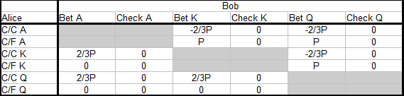
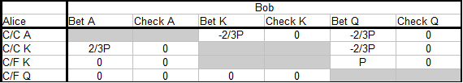

第 13A 部分和第 13B 部分是网络存档的版本，有很多图片丢失，也有一些笔误。《从零开始学习 PLO》前面的主要部分基本讲完了。

## 13A.1 简介

第 12 部分之后停顿了很长时间，但我们继续之前的内容。第 13 部分和接下来几篇文章的主题是单挑底池中的翻牌后打法。我们将采用自上而下的方法，首先讨论合理打法的原则，有时基于理论，有时基于良好的扑克意识和逻辑。然后我们用例子说明这些概念，并讨论如何偏离默认打法来对抗我们有阅读的玩家。

我们将讨论有利位置和不利位置的打法。在这两种情况下，我们都希望有好的默认策略来保护我们免受好的激进对手的剥削利用。换句话说，我们希望以平衡的方式打牌，这样好的对手就不能轻易发现和利用我们游戏中的弱点。当我们训练了这种可靠的默认策略时，我们可以用它们来对抗好的玩家和未知的玩家。

这是一种思考扑克策略的好方法。面对能够快速识别和利用漏洞的好的对手，我们必须考虑如何防御他们的攻击。如果我们不能发现其他玩家的漏洞，那么唯一有意义的事情就是保护自己不被他剥削利用，同时我们试图从桌上较弱的玩家那里赚钱。

当与未知玩家打牌时，可以假设他们在最低级别时打得不好，但在中级别和更高级别时则不能这样，因为那里有很多强手。因此，明智的做法是先对未知玩家采用平衡策略，然后我们可以稍后进行调整，以利用通过阅读发现的漏洞。

因此，我们将受益于训练稳健而平衡的默认策略，这些策略部分基于防御，而不是总是试图剥削利用可能存在也可能不存在的弱点（例如，通过大量诈唬，假设我们的对手弃牌太多）。我们应该记住，当我们调整以剥削利用其他玩家的错误时，我们正在偏离平衡的玩法，从而在我们自己的策略中制造了漏洞。一个善于观察和思考的对手可以通过这些漏洞攻击我们。大致了解平衡策略是什么样的，使我们能够在情况需要时在剥削性打法和平衡打法之间进行切换。

第 13 部分将讨论有利位置单挑 c-bet 决策。由于我们将涵盖大量内容，我们将把第 13 部分分成多个部分（13A、13B、13C 等）。第 13A 部分将讨论一些基本理论，我们将使用这些理论来构建关于有利位置单挑 c-bet 的思考。然后，我们将在以后的文章中应用该理论，并逐渐加深对这种情况下价值下注、诈唬和随后过牌范围的理解。当我们对在有利位置上 c-bet 翻牌有了很好的理解后，我们在连续开枪（c-bet 并计划在后续回合继续下注）时也有了基础。连续开枪始于良好的 c-bet！

由于好的玩家通常会在有利位置打大部分加注牌，因此这是需要认真对待的重要场景。在翻牌 c-bet 太多或用错误类型的牌下注是一种常见的漏洞，会让我们陷入翻牌或后续回合的问题中。在第 12 部分中，我们讨论了如何在 PLO 中中等强牌（例如，在 T♦️6♣️2♠️ 翻牌上，Q♥️Q♦️7♠️5♦️ 这样的牌）下注并对过牌 - 加注弃牌这通常比随后过牌和玩转牌更好。但是，中等强牌有不同类型，在本文中，我们将使用更细致入微的观点。一些中等强牌最好作为下注 - 弃牌的牌来玩，而其他牌则在翻牌我们随后过牌时玩得更好。

以下两个例子说明了如果我们使用不平衡和静态的 c-bet 策略而不注意对手如何适应我们，我们可能会遇到哪些问题：

**示例 13A.1.1 针对假定的紧手玩家进行激进的 c-bet**

$50PLO 6-max

**Preflop**

你（$50）在 BTN 用 Q♣️9♥️7♣️3♦️ 加注到 $1.50，BB（$50）跟注。

你尚未收集任何对手的具体解读，但到目前为止，桌上的玩家都打得相当紧，翻牌前和翻牌时都有很多弃牌。因此，你决定在 BTN 以非常宽的范围加注。你弃掉最糟糕的垃圾牌，如 7♦️3♥️2♣️2♠️，但当对手弃牌到你时，你加注大约底池的 80%。在被跟注后，你也非常频繁地 c-bet，并且你已经拿下了很多底池，而对手在翻牌时都过牌 - 弃牌。

**Flop：**4♥️4♦️2♣️（$3）

BB（$48.50） 过牌，你需要做出 c-bet 决定。你完全错过了翻牌，但你的对手可能也错过了，并且你假设他会对你的 c-bet 采取谨慎和直接的打法。因此，你进行了 $1.50 c-bet 诈唬，BB 过牌 - 加注到 $4.50，然后你弃牌。

如果你现在不停下来评估手牌，你可能会在未来的牌局中遇到麻烦。你在一手非常干 / 低的翻牌上 c-bet 一手垃圾牌，这手牌几乎同时错过了你的范围和对手的范围。在这些翻牌上，我们预计我们的诈唬会很成功，因此面对过牌时，通常要进行大量 c-bet 诈唬，尤其是面对谨慎的对手时。

但这次 BB 过牌 - 加注。这应该会触发警报，因为他翻牌前打得很紧（他不太可能有 4 或 2-2-x-x），而且到目前为止翻牌后他打得很紧）。我们现在应该考虑他可能已经厌倦了我们松散激进的 BTN 打法，并决定反击。像这样的过牌 - 加注难以击中的翻牌是一种方法。

如果 BB 针对我们在 BTN 的激进加注和 c-bet 的策略做出了这种和其他合理的调整，那么继续这样做将使我们被剥削利用。我们现在的问题是，当我们翻牌前开池一个宽范围，然后在翻牌后 c-bet 大部分范围时，我们最终会得到一个宽而弱的 c-bet 范围，BB 可以通过各种方式剥削利用这个范围。例如：

- 经常诈唬过牌 - 加注（可能在干燥翻牌上用任何 4 张牌）
- 用宽范围翻牌过牌 - 跟注，计划诈唬一些转牌惊悚牌，在转牌后过牌时诈唬一些河牌，在转牌和河牌上过牌时赢得一些未改善的摊牌。

如果我们根据这手牌和未来的牌得出结论，BB 确实对我们做出了调整，我们应该换个方式，收紧。我们应该更紧地开池加注，也少用 c-bet 诈唬。首先，我们不想让自己处于一个非常宽、不平衡和弱的范围，诈唬过多的境地。因为这是我们的对手可以剥削利用的情况，他现在已经决定这么做了。

假设我们考虑到这些因素并改变策略。但由于我们感觉有些脆弱，调整得过头了。我们只用最好的牌 c-bet，然后对所有无法对抗过牌 - 加注的牌都选择过牌，例如中等强牌和所有空气牌。如果对手注意到我们的举动，后果会是什么？

**示例 13A.1.2 紧的 c-bet 对抗假定的松凶玩家**

$50PLO 6-max

**Preflop**

你（$50）在 BTN 位置用 Q♠️Q♥️6♣️3♦️ 加注到 $1.50，BB（$50）跟注。BB 是上例中的玩家，我们假设他已经调整以对抗我们之前的松凶型打法。我们通过在翻牌前和翻牌时打得更紧来反击调整，如上所述。这是因为我们担心当我们诈唬或用边缘牌下注时被过牌 - 加注诈唬。

**Flop：**J♠️7♦️2♣️（$3）

BB（$48.50）过牌，并且你有一个 c-bet 的决定。你在一个相当干的翻牌上击中了一个平庸的超对，而你通常应该在这里拥有最好的牌。但是由于你害怕被过牌 - 加注，你决定用这手牌和类似的牌随后过牌。你主要希望让这手牌过牌并在小底池中赢得摊牌。

**Turn：**J♠️7♦️2♣️9♦️（$3）

BB（$48.50）下注 $2，你现在要怎么做？

转牌对我们不利，因为它使得顺子、各种可能的两对组合、同花听牌和顺子听牌成为可能。由于只有一个超对且没有补牌，我们不能跟注，因此你弃牌。

但是你应该再次考虑继续使用你选择的策略的后果。对已经开始反击你的 BB 进行紧缩是合理的。但是如果你现在开始在错过的每一个翻牌上随后过牌，生活对你来说不会更轻松。

一个善于观察的对手很快就知道，翻牌后你过牌意味着你很弱。而当你下注时，你很强。所以他不必反击你的 c-bet。他可以安坐其位，只用他最好的牌来防御你强的 c-bet，然后他弃掉所有的垃圾牌。当你过牌后，他可以用垃圾牌诈唬，尤其是那些惊悚牌，偷走很多底池。他的强牌也很容易对抗你的弱牌范围。

我们再次看到，极端和静态的策略会制造 “漏洞”，善于观察和思考的对手可以通过这些漏洞进行攻击。所以现在我们可以问：

*如果极端松散激进的 c-bet 策略和极端紧缩被动的 c-bet 策略都无法对抗迅速适应我们的对手，那么我们应该如何考虑我们在有利位置的 c-bet 决策？我们能否找到一种无论对手是谁都能发挥良好作用的强大的策略，并可将其作为对抗优秀或未知对手的默认策略。*

事实证明，这些强大的策略确实存在，在本文的剩余部分，我们将讨论在单挑且处于有利位置的情况下如何运用这种策略。

到目前为止，我们通过合理的扑克意识和逻辑将寻找强大 c-bet 策略的问题缩小到以下几点：

- 对抗一个善于调整的对手，我们不可能 100% c-bet。
- 所以我们需要在一些翻牌选择过牌
- 但如果我们只用最弱的牌过牌，我们很容易被阅读和剥削利用。
- 那么，一个强大的 c-bet 和过牌的默认策略是什么样的呢？

我们的下一步是转向 A-K-Q 游戏，这是一个简单的一条街扑克模型，然后我们求解游戏的底池限注变体，以阐明有利位置单挑强大的 c-bet 和过牌策略的一般形式。然后我们将在未来的文章中使用该策略的一般形式，并使用它来设计我们在 PLO c-bet 中的范围。

以下部分是为了完整性和将来参考而包含的。除非你对数学细节感兴趣，否则你可以跳到本节末尾的解决方案（第 13A.2.3 小节）。

## 13A.2 有利位置以 A-K-Q 游戏为模型，以底池限注方式单挑进行 PLO  c-bet

MISS PIC 图片丢失

- 我们有两名玩家：Alice（不利位置）和 Bob（有利位置）
- 底池大小为 P
- 两名玩家都从 A-K-Q 牌堆中得到一张牌
- Alice 在黑暗中过牌（不看牌过牌）
- Bob 现在可以过牌并摊牌，或者他 c-bet 2/3 底池。
- 如果 Bob 下注，Alice 可以弃牌，或者她可以跟注并摊牌。
- 下注回合结束时，如果无人弃牌，则最好牌摊牌获胜。

我们只关注 Bob c-bet 决策的 EV，我们不关心谁为起始底池做出了贡献。我们将 Bob 的 c-bet 大小设置为 2/3 x 底池，以使其代表 PLO 中的 c-bet 或过牌决策。在实践中，我们有时下注较少，有时下注较多，但 2/3 x 底池是单挑和有利位置时平均 c-bet 大小的良好估计。

如果 Bob 从不下注，翻牌后不会有资金换手，双方的 EV 都为 0。但是当 Bob 有时下注时，情况会发生变化。我们在第 12 部分（我们研究了此模型的固定限制变体）中看到，由于 Bob 的位置和迫使 Alice 以过牌开始的规则，Bob 处于 +EV 情况。我们将在这里看到同样的事情，但由于我们选择的下注大小，游戏的解决方案不同。

现在，我们根据选定的规则来求解这个模型游戏。求解游戏意味着找到双方玩家的完整策略以及他们的 EV。我们计算相对于 Bob 的 EV，由于游戏是零和游戏（没有佣金），Alice 的 EV 必须与 Bob 相反 （EV（Alice）= -EV（Bob））。

### 13A.2.1 构建一个简化的支付矩阵

我们首先为游戏构建一个支付矩阵。这是一个包含所有可能结果以及玩家在每个结果下的赢利和损失的表格。我们只看摊牌前的价值（仅看因下注而易手的筹码），并计算相对于 Bob 的 EV。

完整的支付矩阵是：

我们使用这些缩写来表示 Alice 的策略

- C/C = 过牌 - 跟注
- C/F = 过牌 - 弃牌

例如，当 Bob 诈唬下注 Q 时，他要么输掉 2/3 x 底池的 c-bet（当 Alice 用 A 或 K 跟注时），要么赢得底池 P（当 Alice 弃牌 A 或 K 时），这是他通过过牌无法赢得的。完整的支付矩阵只是 Bob 在游戏中所有可能结果的完整值列表，无论所涉及的策略是好是坏。下一步是消除玩家没有理由选择的被主导策略。然后我们减少支付矩阵。

如果我们有两个策略 S1 和 S2，其中 S1 永远不会比 S2 差，有时甚至更好，我们说 S1 主导 S2。我们通过消除试图最大化利润的玩家从未使用的被主导策略来简化支付矩阵。我们从 Alice 开始，消除她用 A 过牌 - 弃牌和用 Q 过牌 - 跟注。这些策略分别由 A 过牌 - 跟注和 Q 过牌 - 弃牌主导。

然后我们消除 Bob 的主导策略，即下注 K 和过牌 A：

MISS PIC 图片丢失

最后，我们通过消除既自动又不影响 EV 的策略进行最后一次简化。这些是 Alice 用 Q 的过牌 - 弃牌和 Bob 用 K 的过牌。因此，当我们解决 Alice 和 Bob 的最佳策略的游戏时，我们只需考虑以下子集：

MISS PIC 图片丢失

### 13A.2.2 求解 A-K-Q 游戏

我们现在通过从数学方程式中推导出 Alice 和 Bob 的最佳策略来求解游戏。Bob 总是下注 A，而 Alice 总是过牌 - 跟注 A，因此，为了完全指定两位玩家的策略，我们需要找出以下内容：

- Bob 用 Q 诈唬的频率是多少？
- Alice 用 K 抓诈唬跟注的频率是多少？

我们还需要一个定义：

**最佳策略**

我们称一种策略为最优策略，当对手无法通过改变其应对策略来改变她的 EV。此时，她对策略选择将持无差别态度，因为所有选择带来的 EV 均相同，她已处于策略无差别点。

**Bob 用 Q 诈唬的最佳频率**

当 Bob 用 Q 诈唬时，Alice 当然总是用 A 过牌 - 跟注，但她要用 K 做出选择。她可能拿到最好的牌，也可能被击败，那么她应该跟注还是弃牌？当 Bob 的 c-bet 策略达到最优时，Alice 应该对跟注或弃牌无差别，我们有：

EV_Alice（跟注 K）= EV_Alice（弃牌 K）

Bob 总是下注 A。此外，他有时用 Q 诈唬。让 b 为 Bob 有 Q 时诈唬的概率。Alice 用 K 跟注的 EV 为：

EV_Alice（跟注 K）= EV（Bob 下注 A）+ EV（Bob 诈唬 Q）

Bob 有一半时间有 A，当 Alice 遇到 A 时，她输掉 -2/3P（请注意，此符号应读作 (-2/3)P 而不是 -2(/3P)）的赌注。Bob 有一半时间有 Q，但只有 b% 的时间下注他有 Q。因此，Bob 诈唬 Q 的概率为 1/2 x b = b/2，Alice 跟注时获胜 +2/3P。

那么 Alice 用 K 跟注的 EV 表达式为：

EV_Alice（跟注 K）
= EV（Bob 下注 A）+ EV（Bob 诈唬 Q）
= (1/2)(-2/3P) + (b/2)(+2/3P)
= -P/3 + bP/3

同样的推理告诉我们 Alice 用 K 弃牌的 EV 表达式（当她让自己被诈唬输掉底池 P 时，如果 Bob 过牌她本可以赢得底池）为：

EV_Alice（弃牌 K）= (b/2)(-P) = -bP/2

现在我们通过将 Alice 用 K 跟注的 EV 设置为等于她弃牌的 EV（这样她就处于无差异点）来找到 Bob 的最佳诈唬频率：

EV_Alice（跟注 K）= EV_Alice（弃牌 K）
-P/3 + bP/3 = -bP/2
-1/3 + b/3 = -b/2
-1 + b = -3b/2
b + 3b/2 = 1
b(1 + 3/2) = 1
b(5/2) = 1
b = 1/(5/2)
b = 2/5

我们得出结论，当 Bob 有 Q 时，他应该在 2/5 = 40% 的时间诈唬。

**Alice 用 K 的最佳跟注频率**

我们对 Alice 使用类似的方法。当 Alice 发挥最佳水平时，她跟注的频率如此之高，以至于 Bob 对用 Q 过牌或诈唬变得没有差别。这为 Bob 定义了一个无差异点，我们有：

EV_Bob（诈唬 Q）= EV_Bob（过牌 Q）

Bob 用 Q 过牌的 EV 为 0，因此我们只需要找到 Bob 用 Q 诈唬时的 EV 表达式：

EV_Bob（诈唬 Q）
= EV（Alice 跟注 A）+ EV（Alice 跟注 K）+ EV（Alice 弃牌 K）

此表达式中的第一个项只是 Alice 有 A 的概率（50%）乘以 Bob 被跟注时的损失（-2/3P）。

EV（Alice 跟注 A）= (1/2)(-2/3P)

对于涉及 Alice 用 K 跟注和弃牌的两个项，我们让 c 表示她跟注的概率。那么她弃牌的概率为 (1-c)。当 Alice 用 K 跟注时，Bobby输掉 -2/3P。当 Alice 弃牌 K 时，Bob 用他的诈唬赢得了 P 底池。EV 表达式中的最后两个项变为：

EV（Alice 跟注 K）= (1/2)(c)(-2/3P)

EV（Alice 弃牌 K）= (1/2)(1 - c)(P)

我们得到：

EV_Bob（诈唬 Q）
= EV（Alice 跟注 A）+ EV（Alice 跟注 K）+ EV（Alice 弃牌 K）
= (1/2)(-2/3P) + (1/2)(c)(-2/3P) + (1/2)(1 - c)(P)
= -P/3 - Pc/3 + P/2 - Pc/2
= -2P/6 - 2Pc/6 + 3P/6 - 3Pc/6
= -2P/6 + 3P/6 - 2Pc/6 - 3Pc/6
= P/6 - 5Pc/6
= (1/6)(P - 5Pc)

最后，我们通过将 Bob 诈唬的 EV 设置为等于他的过牌 EV（为 0）来找到 Alice 的最佳跟注频率：

EV_Bob（诈唬 Q）= EV_Bob（过牌Q）
(1/6)(P - 5Pc) = 0
P - 5Pc = 0
1 - 5c = 0
5c = 1
c = 1/5

我们得出结论，Alice 应该在她有 K 的 1/5 = 20% 的时间里跟注。

### 13A.2.3 A-K-Q 游戏的完整解决方案

**Alice**

- 总是用 A 过牌 - 跟注
- 1/5 = 20% 的时间用 K 过牌 - 跟注
- 总是用 Q 过牌 - 弃牌

**Bob**

- 总是用 A 下注以获得价值
- 总是用 K 过牌
- 2/5 = 40% 的时间用 Q 诈唬

最后一步是计算我们刚刚找到的最佳策略对的 Bob 的 EV：

### 13.2.4 A-K-Q 游戏的价值（Bob 的 EV）

现在我们让 Alice 和 Bob 使用他们的最佳策略对抗对方，然后我们计算 Bob 的 EV。问题可以分为六个部分，我们计算以下每种情况下 Bob 的摊牌前价值：

- Alice 有 A 而 Bob 有 K
- Alice 有 A 而 Bob 有 Q
- Alice 有 K 而 Bob 有 A
- Alice 有 K 而 Bob 有 Q
- Alice 有 Q 而 Bob 有 A
- Alice 有 Q 而 Bob 有 K

所有情况都同样可能，概率为 1/6。我们首先计算每种情况对 Bob EV 的贡献，然后通过将所有贡献相加来找到他的总 EV：

**情况 1：Alice 有 A 而 Bob 有 K**

EV1 = (1/6)(0) = 0

Bob 总是在后面过牌，并且没有下注。

**场景 2：Alice 有 A，Bob 有 Q**

EV2
= (1/6)(EV（Bob 诈唬）+ EV（Bob 过牌）)
= (1/6)((2/5)(-2/3P) + (3/5)(0))
= (1/6)(-4P/15)

Bob 2/5 的时间都在诈唬，剩下的 3/5 的时间都在过牌。当他对 A 诈唬时，他总是输掉 -2/3P。当他过牌时，他什么都不输。

**场景 3：Alice 有 K，Bob 有 A**

EV3
= (1/6)(EV（Alice 跟注）+ EV（Alice 弃牌）)
= (1/6)((1/5)(2/3P) + (4/5)(0))
= (1/6)(2P/15)

Bob 总是下注。Alice 有 1/5 的时间跟注，Bob 赢得 2/3P。她有剩余的 4/5 的时间弃牌，Bob 一无所获。

**场景 4：Alice 有 K，Bob 有 Q**

EV4
= (1/6)(EV（Bob 诈唬）+ EV（Bob 过牌）)
= (1/6)((2/5)((1/5)(-2/3P) + (4/5)(P)) + (3/5)(0))
= (1/6)(-4P/75 + 4P/5)
= (1/6)(-4P/75 + 60P/75)
= (1/6)(56P/75)

Bob 2/5 的时间诈唬，其余 3/5 的时间过牌。在他诈唬的那些时间里，Alice 有 1/5 的时间跟注，Bob 输掉 -2/3P。她有 4/5 的时间弃牌，Bob 赢得底池 P。当 Bob 过牌时，他既不赢也不输。

**场景 5：Alice 有 Q 而 Bob 有 A**

EV5 = (1/6)(0) =0

Bob 总是下注，Alice 弃牌 Q，没有资金易手。

**场景 6：Alice 有 Q 而 Bob 有 K**

EV6 = (1/6)(0) = 0

Bob 总是随后过牌他的 K，没有资金易手。

**Bob 在本场比赛中的总 EV**

我们将 6 个 EV 贡献相加，得出 Bob 的总 EV：

Bob 的 EV
= EV1 + EV2 + EV3 + EV4 + EV5 + EV6
= 0 + (1/6)(-4P/15) + (1/6)(2P/15) + (1/6)(56P/75) + 0 + 0
= (1/6)(-4P/15 + 2P/15 + 56P/75)
= (1/6)(-2P/15 + 56P/75)
= (1/6)(-10P/75 + 56P/75)
= (1/6)(46P/75)
= 23P/225

Bob 从其最佳 c-bet 策略中赚取了 23P/225 =0.102P。他的 EV 随着底池大小 P 线性增长，因此起始底池越大，对 Bob 越有利。

这种情况的一个明显类比是，当实力较弱且被动的玩家在不利位置参与大量大底池时，例如频繁跟注 3-bet。在不利位置用较弱的跟注范围对抗高手非常困难，底池越大，情况就越糟糕（如果翻牌后筹码仍然较深）。尤其当不利位置的玩家习惯性地对翻牌前激进的玩家过牌，并让其主导游戏时，情况更是如此。

然后，处于有利位置的玩家可以轻松地建立一个 c-bet 范围，其中价值下注（对应于 A-K-Q 游戏中的 A）和诈唬（对应于 A-K-Q 游戏中的 Q）的比例保持平衡，然后他过牌并用中等强度的牌（对应于 A-K-Q 游戏中的 K）拿一张免费牌，这些牌太弱而无法进行价值下注，但又太强而无法变成诈唬。

我们将在以后的文章中看到，处于不利位置的玩家有时可以通过在翻牌下注来让自己更轻松，但处于不利位置的玩家仍然很难打好。

### 13A.2.3 A-K-Q 游戏的 PLO 解释

我们引入了一个模型，用于在翻牌有利位置单挑的情况下，被过牌时进行 c-bet，该模型的最优解为：

**Alice**

- 总是用 A 过牌 - 跟注
- 1/5 = 20% 的时候用 K 过牌 - 跟注
- 总是用 Q 过牌 - 弃牌

**Bob**

- 总是用 A 下注以获得价值
- 总是用 K 过牌
- 2/5 = 40% 的时间用 Q 诈唬

EV（Bob）= 23P/225

请注意，在我们的模型中，Alice 必须以过牌开始下注回合。将此模型应用于真实扑克时，如果处于不利位置的玩家通常选择过牌，则效果最佳。由于 Alice 不能选择过牌 - 加注，因此当处于不利位置的玩家很少选择过牌 - 加注时，该模型效果最佳。

该模型的另一个限制是，只有一条下注街（或者说是 1/2 条街，因为 Alice 不能下注），手牌价值是固定的。在真正的扑克游戏中，我们还必须担心被过牌 - 加注，并且必须考虑手牌价值发生变化的未来几条街的玩法。

但是我们可以从这个简单的模型中提取一些基本概念：

- Bob 有三个范围：一个强价值下注范围，一个中等强的过牌范围，以及一个弱的空气牌范围，他从中挑选诈唬牌。
- Bob 使用的价值下注 / 诈唬比率是下注大小与底池大小的函数。确切地说，Bob 的 c-bet 的价值 / 诈唬比率与 Alice 跟注的底池赔率相同，即 5 : 2。他下注 100% 的价值牌和 40% 的空气牌，比率为 100 : 40 = 5 : 2。他诈唬的概率与 Alice 因抓诈唬而获得的底池赔率相同，她对用她的抓诈唬牌（K）跟注或弃牌变得没有差异。
- Alice 用她的抓诈牌进行足够多的跟注，以防止 Bob 用所有空气牌（无摊牌价值的牌）作为诈唬 c-bet 时有利可图，而 Bob 此时在诈唬与否之间无差别（因为他的诈唬刚好盈亏平衡）。但同时，Alice 也会弃掉足够多的抓诈牌，以避免被 Bob 的价值下注牌剥削至死。

Bob 的下注策略遵循扑克中众所周知的强度原则：

- 用你最好的牌下注以获得价值
- 过牌那些太弱而不能下注以获得价值的牌
- 用你最弱的牌，有时诈唬，否则过牌。

因此，当我们玩 PLO 并想使用平衡的 c-bet 策略对抗优秀或未知的玩家时，我们可以从将我们的总范围分成三组开始，从上到下：

- 价值牌
- 随后过牌的牌
- 空气牌

**价值牌**

我们下注的最好的牌，期望从被过牌 - 加注或跟注中获利。当你尝试建立强大的默认 c-bet 策略时，让大多数价值牌成为你计划 3-bet 或跟注以对抗 c-bet 的牌。简单来说：你的价值牌是你乐于用其打大底池的牌。

以下是一些在单次加注且有 100 bb 筹码的单挑中明显的价值牌：

J♠️J♣️7♠️2♦️ 在翻牌 J♥️9♥️6♦️（顶暗三条）
A♥️K♦️Q♠️T♦️ 在翻牌 A♠️K♦️J♠️（坚果顺子 + 顶两对）
K♠️T♦️9♦️8♠️ 在翻牌 K♦️7♥️6♦️（顶对 + 13 个补牌的坚果包牌 + 非坚果同花听牌）

所有这些牌都很容易对抗过牌 - 加注。顶暗三条总是可以高兴地全下，同样，对于有再听牌的坚果顺子也是如此（即使我们有时会遇到有更好再听牌的相同顺子）。而对子 + 顺子 + 同花的组合听牌也将对对手向我们全下的所有牌（包括我们压制的一些听牌）具有很高的权益。

**跟注手牌**

你通常会在翻牌持有中等强度的手牌 / 听牌，这些手牌可能是最好的，或者至少在落后时有一些不错的补牌，但它们不足以在翻牌全下或跟注过牌 - 加注。由于这些手牌可以通过看转牌获得价值，因此它们是适合随后过牌的好手牌。我们有更好的诈唬候选者（较弱的手牌，在下注 - 弃牌以对抗加注时不会放弃太多权益）。我们有更好的手牌可以全下或下注跟注对抗过牌 - 加注。

但是，我们需要在中等强度的手牌组中做出重要区分。一些中等强度的手牌更适合作为下注手牌，我们下注主要是为了让对手弃牌（我们下注以保护我们的手牌）。其他中等强度的手牌最好我们随后过牌并用它们打转牌。

以下是一些在翻牌圈随后过牌的候选牌：

T♠️9♥️8♦️3♠️ 在翻牌 J♠️7♦️2♣️（内嵌坚果包牌 + 后门同花听牌）
J♣️9♦️7♦️4♥️ 在翻牌 Q♠️8♦️4♣️（坚果卡顺听牌 + 对子）
6♥️5♥️4♦️3♦️ 在翻牌 Q♥️9♥️8♥️（低同花）

上面两个顺子听牌是与对手愿意用来玩大底池的牌对抗时会很吃力的牌。最好的牌（内嵌坚果包牌）可以下注，计划是跟注过牌 - 加注并打转牌（如果筹码相当深，并且我们也会在未来的几轮中诈唬），而弱卡顺 + 对子组合面对过牌 - 加注应该默认弃牌。

对于这些类型的牌（手牌 / 听牌组合，带有少量好牌），重要的是，当我们下注 - 弃牌时，我们会放弃很大一部分权益。我们不想继续对抗过牌 - 加注，但很多转牌会帮助我们，要么让我们获得最好的牌，要么给我们很好的诈唬机会（通常是当一张惊悚牌出现并且对手再次过牌时）。我们希望看到这种牌的转牌，而过牌翻牌可以让我们到达那里。

对于同花，下注以获得价值可能很诱人，但在这样做之前，我们必须考虑当对手愿意玩大底池时，他能给我们什么行动。这主要是更大的同花。即使我们现在几乎总是有最好的牌，这也不足以成为下注以获得价值、计划投入筹码的好理由。我们还必须考虑当筹码投入时谁拥有最好的牌，不幸的是，这主要是对手。

我们可以不价值下注，而是用同花听牌过牌，计划跟注转牌下注。如果对手不下注，我们可以选择价值下注，或者再次使用过牌线路，计划跟注河牌下注。坐在过牌的玩家后面，我们都有很好的选择。

请注意，我们随后过牌的牌是可以在很多转牌上继续的牌，如果对手下注的话。这是一个重要的观点，我们稍后会详细讨论。当我们在翻牌上过牌时，我们是在告诉对手我们的范围很弱。一个激进和投机取巧的玩家经常会利用这些信息来对付我们，并在很多转牌上诈唬，期望经常成功。

我们不能让如此有价值的信息就这样泄露，因此，重要的是我们要考虑用可以打转牌的牌过牌。根据定义，这些牌是具有许多补牌的牌（如果我们有一手在翻牌时很少是最好的牌或听牌）或不惧怕许多转牌的牌（如果我们有一手在翻牌时可能最好的牌，但我们不一定想用它打大底池）。

**空气牌**

无法下注以获得价值且从转牌中获利不多的牌是空气牌。空气牌是诈唬的候选牌。任何让你一眼就 “吓到” 的牌都可以用作诈唬，但重要的是，我们不要默认对所有候选牌都诈唬（尽管有些玩家让我们在某些翻牌上侥幸逃脱）。当我们使用平衡的默认策略时，我们希望诈唬的力度刚好足以让对手意识到我们下注时可能在诈唬，但不要太多以至于他会立即从大量跟注或反击中获利。

如果他现在试图通过弃掉大量抓诈牌来逃避我们的价值牌，他会因为我们的诈唬而失去更多底池。如果他试图通过大量跟注或反诈唬来惩罚我们的诈唬，他会因为我们的价值牌而失去更多价值。由于我们的价值下注和诈唬范围是平衡的，因此对手几乎无法阻止我们通过下注获利。他所能做的就是用自己合理平衡的范围来保护自己，将损失降至最低。

以下是一些诈唬的候选者：

Q♣️J♥️T♦️9♦️ 在翻牌 K♠️7♦️5♣️（干燥牌面的空气牌）
A♦️K♥️J♣️9♣️ 在翻牌 T♦️6♦️2♦️（三同花牌上的坚果同花阻挡牌）
6♠️6♦️5♠️5♣️ 在翻牌 9♦️7♦️2♠️（非坚果卡顺 + 后门同花听牌）

当我们诈唬时，原则上我们可以使用任何无价值的牌，但使用最差牌中最好的牌永远不会有坏处。这也有助于关注翻牌结构以及对手的范围如何可能击中翻牌。

第一翻牌我们什么都没有，只有一手更差的牌，但翻牌很干燥，很难击中。在第二个翻牌上，我们有坚果同花阻挡牌，这给了我们一些有趣的机会。首先，对手现在不能有坚果同花，所以被过牌 - 加注的概率已经降低了（即使有低同花，对手也应该小心过牌 - 加注）。如果他跟注，我们就可以考虑未来几轮的选择。我们可以继续诈唬，希望他放弃他的低同花和任何更弱的牌，或者我们可以过牌并放弃。如果对手继续过牌给我们，这对他来说很谨慎，因为他没有坚果牌或坚果听牌，我们在有利位置上有很多好的选择。

在最后一个翻牌上，我们的听牌很弱。当我们看到中等强牌时，我们过牌了很多听牌，那么我们在这里应该按照同样的方式思考吗？不，因为我们这里的听牌太弱了，无法玩转牌。当我们击中顺子时，我们并不是坚果牌，而且我们还可以凭借同花牌组成顺子（或者河牌上可能出现同花）。

当你的听牌很弱，以至于即使击中了也不想跟注转牌下注时，你就没有适合在翻牌过牌以获得价值的牌。另一方面，即使是最弱的听牌，在翻牌跟注时也会赢得一些底池。因此，在翻牌 9♦️7♦️2♠️ 上如果你可以选择用 6♠️6♦️5♠️5♣️ 诈唬和用 T♣️5♣️3♠️3♥️ 等完全垃圾牌诈唬，你会更喜欢前者。这为你在跟注时提供了一些逃生通道，你将赢得更多的底池。换句话说，用非常弱的听牌诈唬比用完全垃圾的诈唬更占优势。

如果对手弃牌或过牌 - 加注，你有什么牌并不重要，而且无论如何，你也不会因为对过牌 - 加注弃掉这种弱听牌而感到不高兴。如果你的听牌很弱，无法跟注或价值下注，那么在下注 - 弃牌时你不会牺牲太多的价值，因为即使你击中了期望的牌，也很难通过摊牌赚钱。但是当你的牌力提高时，你会赢得一些小底池，所以当你被跟注时，这手牌还是有一点价值的。

## 13A.3 关于 PLO 中等强牌的重要概念

最后，我们将稍微扩展一下与 PLO 中等强牌的定义有关的概念，以及它与 NLHE 中相应的定义有何不同。

我们在第 12 部分中讨论了这个问题，我们使用建模来说明在 PLO 中，遥遥领先 / 遥遥落后的牌对我们的影响比在 NLHE 中小。例如，在 A♠️9♥️2♥️ 翻牌上用 K♠️K♥️4♣️3♦️ 随后过牌。

在 NLHE 中，我们可以在这样的翻牌上用 K-K 过牌，计划在小底池中摊牌（过牌到底或者如果对手在转牌和河牌下注，则至少跟注一次）。这个计划称为 “WA / WB 线路”。

在 PLO 中，这种做法效果不佳，原因如下：

- 有了 4 张起手牌，对手已经领先的可能性很大，因此翻牌后过牌的诱惑力较小。
- 如果他没有打败我们，如果我们在翻牌时给他一张免费牌，他很有可能会拿到听牌或拿到好牌反超我们。
- 即使我们手握最好的牌，对手的范围中也有很多第二好的牌，如果我们下注且他知道我们的牌型，他应该用这些牌跟注。但由于他不知道我们的牌型，他往往会弃牌。这是扑克基本定理中的一个错误，而我们正是利用了这一点。例如，6♠️5♦️4♦️2♠️ 在翻牌 A♠️9♥️2♥️ 上，他有 11 张三条 / 两对的补牌，还有一些后门可能性。因此，如果他知道我们只有一对中等的低对，他将有足够的底池赔率来跟注并听到更好的牌。

对于我们稍好一些的牌，例如 A♣️7♦️6♦️4♣️ 在 A♠️9♥️2♥️ 翻牌上的情况也是如此。在 NLHE 中，我们会在这些干翻牌上用 A-3 这样的牌过牌，因为我们是 WA / WB，几乎没有被反超的风险。NLHE 中的翻牌过牌可以控制底池大小，并让我们轻松赢得小 / 中等底池，这是这种翻牌最适合的打法。

但是在 PLO 中，如果 A♣️7♦️6♦️4♣️ 在 A♠️9♥️2♥️ 翻牌上，这手牌太弱了，无法过牌并打转牌，即使它在翻牌上通常是最好的。干燥翻牌上顶对似乎有点自相矛盾，所以让我们运用逻辑：

如果我们在翻牌后过牌，计划玩转牌（包括在面对下注时跟注），我们乐意看到哪些牌？任何 7、6 或 4 的两对牌都会改善我们的牌力，但只是轻微的改善。我们仍然落后于三条和顶两对，我们所有的两对牌补牌都在牌面上形成了顺子听牌，有时还有我们没有的同花听牌。所以在改进到两对后，我们不能乐意打大底池。我们可以改进为三条，但我们仍然落后于葫芦和更好的三条，所以我们在那里有同样的问题。大多数其他不能改进我们的转牌要么牌面上有听牌，要么让较弱的牌领先。

所以如果我们在翻牌后过牌，而对手在转牌后下注，我们几乎永远不会高兴。当我们至少在某些转牌上不能用我们的过牌的牌愉快地打大底池时，我们几乎没有理由过牌。通常，我们最好将这手牌视为 “PLO 空气牌”。然后，我们将 A♣️ 更多地视为对抗其他顶对 / 两对牌的阻挡牌，而不是对抗对手范围给我们行动的价值牌。

因此，我们可以在 A♠️9♥️2♥️ 翻牌上下注 A♣️7♦️6♦️4♣️ 来保护我们的手牌，并让对手放弃一些他本应该继续的牌，如果他知道我们手中的牌的话。这是一个典型的下注 - 弃牌边缘手牌情况，我们在 PLO 中经常看到。如果你想在这个翻牌上用顶对过牌，你有许多更好的候选牌可供选择。

你可以用类似的思路来思考，比如 J♦️8♦️4♣️ 翻牌上的 K♠️Q♠️Q♥️2♦️，以及 9♦️7♦️4♣️ 翻牌上的 A♣️8♣️7♥️4♥️ 等平庸的两对牌。下注并希望对手弃牌。如果他过牌 - 加注，请毫不后悔地弃牌，如果他跟注，你必须在后面的回合中仔细应对。

## 13A.4 总结

在第 13A 部分中，我们为理解翻牌有利位置平衡的 c-bet 策略奠定了理论基础。我们讨论了基于良好扑克意识 + 逻辑和情况数学模型的 c-bet 原则。我们还简要讨论了如何在实践中设计价值下注、过牌和诈唬的范围。

在第 13B 部分中，我们将从更实际的角度看待 c-bet，并定义一个流程来训练我们在各种翻牌结构上建立合理范围的能力。