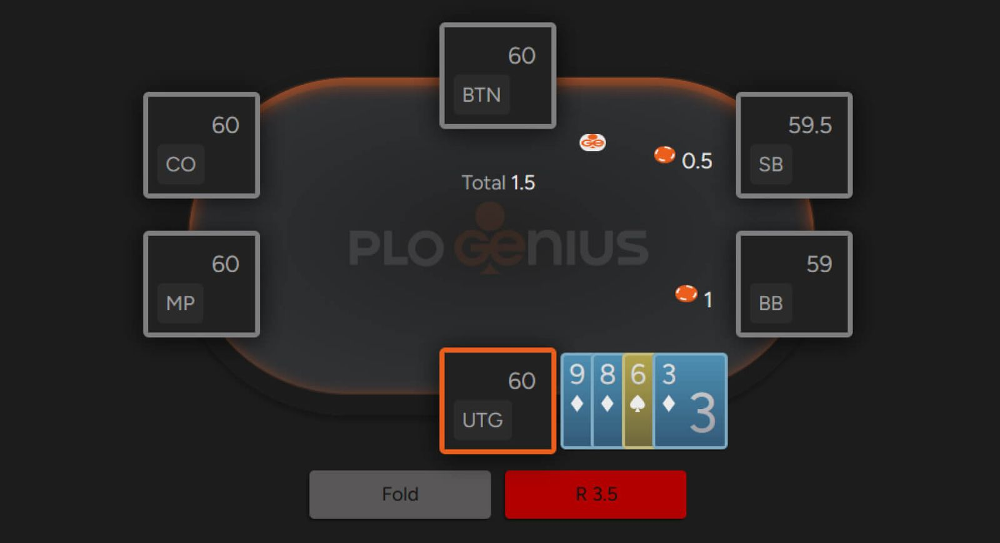

# 体验 PLO，最酷的游戏！

奥马哈采用四张底牌、底池限注下注和无休止的战斗，为每位扑克玩家带来新鲜刺激的挑战。

**无限注德州扑克长期以来一直是 - 而且很可能仍将是 - 世界上最受欢迎的扑克游戏。**

然而，PLO 近期的火爆势头不容忽视。越来越多的玩家将奥马哈视为一种全新的选择，它能带来不间断的刺激和巨额底池。

正如扑克界一贯的规律，玩家去哪儿，钱就跟到哪儿。

如果你正在考虑 PLO 是否值得一试，那么你来对地方了 - 本指南将带你了解奥马哈的基本规则。

## PLO 的基本规则与无限注德州扑克类似

奥马哈的独特之处在于细节。

虽然游戏的整体流程与 NLHE 类似，但最大的区别在于每位玩家会拿到四张底牌，而不是两张。这一规则的改变对游戏的数学计算产生了巨大的影响。在德州扑克中，起始手牌组合共有 1326 种；在 PLO 中，牌面数量高达 270,725 种 - 是 NLHE 的 200 多倍。

如此巨大的差异显著改变了翻牌前策略，尽管它们的下注结构与 NLHE 完全相同。在 PLO 中，翻牌前只有一轮下注，没有公共牌。翻牌后，还有最多三轮下注：翻牌圈（第一轮下注）、转牌圈（第二轮下注）和河牌圈（最后一轮下注），这与德州扑克相同。

## 你必须使用两张底牌组成一手牌

这或许是奥马哈与 NLHE 最重要的区别 - 也是新手经常会因此损失真金白银的规则。在奥马哈中，你总是会拿到四张底牌，但你必须使用其中的两张底牌以及三张公共牌组成最终的牌型。

这会带来以下几个实际后果：

**无法单张同花：** 你不能仅仅因为公共牌是同花色就拿到一张 A，从而组成坚果同花。你至少还需要一张同花色的牌。

**五张同花公共牌并非自动组成同花：** 即使公共牌是五张同花的牌，你仍然需要两张同花的牌才能组成同花。

**葫芦误判：** 在像 A-A-T-T-2 这样的双对公共牌上，你需要一张 A 和一张 10 或一张 2 才能组成葫芦。

总的来说，“从手中拿出两张牌” 的要求很直观，你很快就会习惯，但我们建议你在开始奥马哈之旅时要谨慎，因为忽略它可能会付出高昂的代价。

虽然它们看起来 “不错”，但许多四张牌的牌型都有更高的可玩性要求。

## 奥马哈通常以底池限注的形式进行，因此也称为底池限注奥马哈（PLO）

奥马哈与德州扑克的最后一个主要区别在于，奥马哈通常采用底池限注的下注结构。这显著改变了游戏的数学原理和动态。

在 PLO 中，底池的大小决定了你的最大下注额。简单来说，底池限注游戏中的 “底池” 等于：

> （当前底池大小）+（上次下注的金额）× 2
（或者换句话说：下注前的底池大小 + 上次下注金额的三倍）
> 

## 奥马哈的流行变体

扑克玩家喜欢在他们喜爱的游戏中加入一些新花样，奥马哈也不例外。经典的四张底牌版本仍然是最受欢迎的，但也有一些令人兴奋的变体，玩家会收到五张甚至六张底牌。在这些玩法中，五张牌奥马哈（5-Card Omaha）最受欢迎。额外的牌为经验丰富的玩家提供了更多选择，也为休闲玩家带来了更多刺激。

另一个著名的变体是奥马哈高低（Omaha Hi-Lo，也称奥马哈 8 或更好），底池由最高牌型和最低牌型平分。

所有这些游戏都以传统 PLO 为基础，提供了更多动作和复杂性。但由于每种游戏都有其独特的战略考量，我们将在另一篇文章中进行深入分析 - 敬请期待。

## PLO 入门介绍到此结束

这是我们即将推出的系列文章的第一篇。虽然 PLO 与 NLHE 有很多相似之处，但其独特的魅力使其在众多扑克玩家心中占据了特殊的地位。我们的目标是帮助你深入了解 PLO 的迷人之处，并为你提供坚实策略基础。