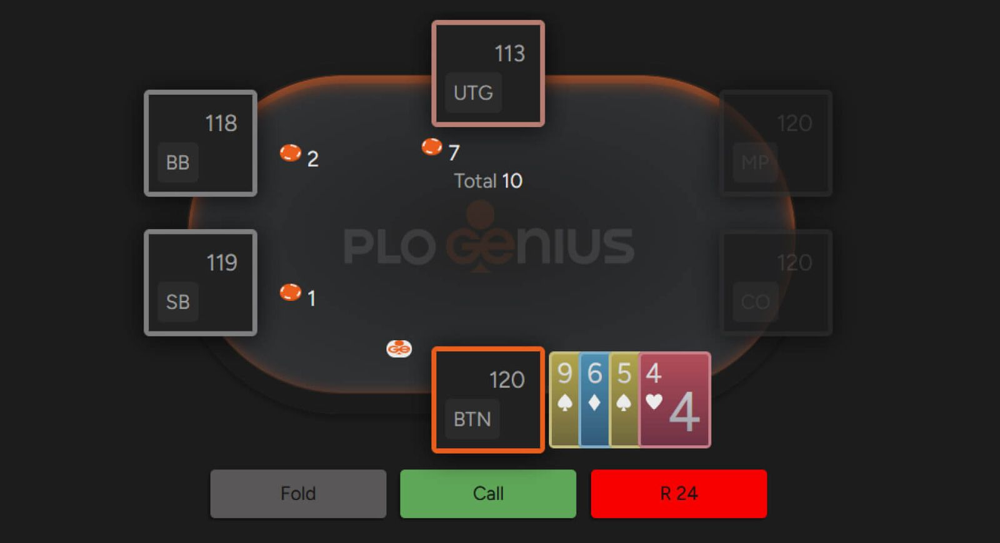
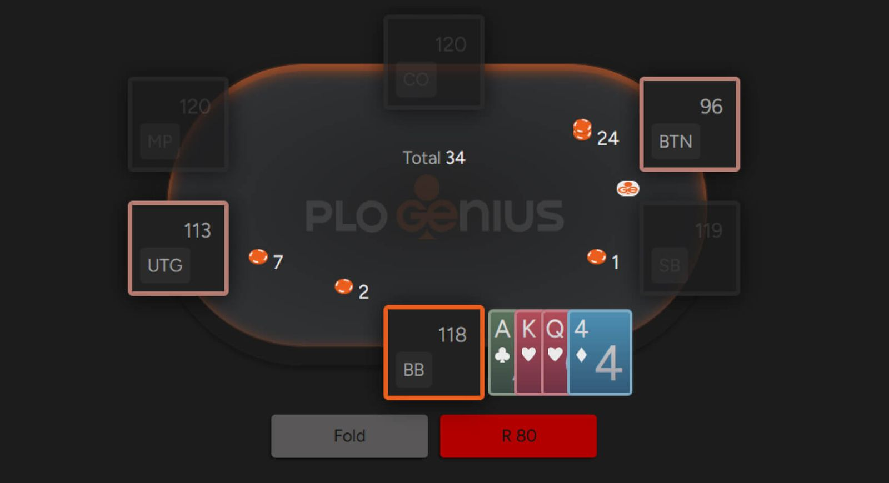

# PLO - 底池限注意味着什么

PLO 采用独特的下注系统，你的最大加注额取决于底池大小 - 轻松学习如何在翻牌前和翻牌后计算最大加注额。无论你是 NLHE 老手还是 PLO 新手，“底池限注” 都是你必须掌握的奥马哈扑克规则中最重要的细节之一。四张底牌以及不能只使用一张底牌是奥马哈另外值得了解的特点 - 我们在介绍文章中已简要解释了这些基础知识。

在本文中，我们将重点讨论下注额度的限制，这是决定游戏流程的关键因素。那么，事不宜迟，让我们来解答这个关键问题：

## 如何在 PLO 中计算底池大小？

在无限注游戏中，你可以随时下注一个大盲注、半个底池、整个底池，或者任何你能想到的金额。但在 PLO 中，情况并非如此。

底池限注游戏是如何运作的？在 PLO 中，你的下注额度受限于当前底池的大小。以下是 PLO 下注机制的简要概述。

## 如何计算 PLO 翻牌前底池大小

如果你在 \$1/\$2 的牌局中第一个行动，你最多可以下注 \$7。这 \$7 包括：跟注前一个玩家的 \$2（在本例中为大盲注），以及跟注后剩余的底池大小（即：\$1 小盲注 + \$2 大盲注 + 跟注大盲注的 \$2 = \$5）。

将这两项加起来（\$5 + \$2 = \$7），我们得到 \$7，这就是 \$1/\$2 牌局中的最大加注额。

那么，3-bet 呢？我们继续之前的例子，假设有人在 UTG 加注到 \$7，你想 3-bet。你能下注的最大金额是多少？

上次下注是 \$7，还有两个盲注，分别是 \$1 的小盲注和 \$2 的大盲注。根据上面提到的计算方法，底池大小的下注额为：

\$7（上次下注）+ \$17（跟注后底池的大小）= \$24

## 如何计算 PLO 翻牌后的底池大小

我们先来看翻牌圈（以及后续的下注轮）。

如果翻牌圈的底池是 \$20，那么第一个行动的玩家可以选择下注，从最小的 1 个大盲注（\$2）到底池的全部大小（\$20）。假设有人下注 \$10，底池达到 \$20，那么我们可以计算一下，如果你想加注到全部底池，你可以选择下注多少。计算方法如下：

底池加注额：\$10（跟注上一个下注的金额）+ \$40（上一个下注被跟注后的底池大小）= \$50

PLO 中还有一种计算底池加注额的简便方法。方法是：将上一个下注的金额乘以 3，再加上下注前的底池大小。在最后一个例子中，就是 3 × \$10 + \$20 = \$50。

一开始估算底池大小可能有点困难，但就像几乎所有扑克游戏一样，随着时间的推移，计算就会变得越来越容易。另外，请记住，在线玩扑克时，你可以看到可以下注的范围；而在赌场玩扑克时，你可以说你想要 “底池（pot）”，荷官会告诉你具体的下注金额。

::: info 附注：
奥马哈规则允许无限注或固定限注玩法，但这些玩法并不流行，如果你是新手，不必过于关注。绝大多数奥马哈游戏都采用底池限注。
:::

## 理解 PLO 的核心数学原理

相信我们，了解 PLO 牌局中任何时刻的最大加注额至关重要。虽然最大下注额限制可以防止你过度下注（这与 NLHE 有很大区别），但 PLO 领域还有其他值得探索的内容。