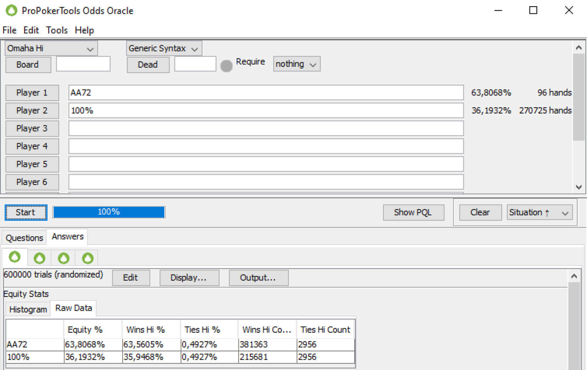

# 奥马哈策略：常见错误及避免方法

刚接触 PLO？这些策略技巧可以避免一些常见错误，例如高估牌力、错误处理 A-A 以及在多人底池中陷入困境。

学习新游戏需要时间，而且通常是一个充满错误的过程。大多数开始尝试 PLO 的人都有德州扑克 的背景，所以他们带着一些不利甚至有害的习惯开始玩奥马哈也就不足为奇了。

即使 PLO 是你尝试掌握的第一种扑克游戏，你也可能会犯一些与经验丰富的扑克玩家类似的错误。

在本文中，我们希望向你介绍一些技巧，帮助你避免许多新手常犯的错误。

## 为什么高估你的牌会让你在奥马哈中付出代价

首先，让我们来看一个显而易见的事实：PLO 中的牌型大小与德州扑克完全相同（除非我们讨论的是奥马哈高低扑克，它有一些细微的差别）。

这个事实既方便又具有欺骗性。在 NLHE 中，一个强对子加上一张强踢牌通常都能赢牌。因此，当你拿到一手强牌，比如三条、顺子或同花时，你很可能赢得底池。

在 PLO 中，牌的平均强度要高得多，因此，你应该非常谨慎，不要在没有充分理由的情况下投入大量筹码。

在翻牌前评估牌型潜力和强度时，判断牌型是否坚果性至关重要。经验不足的玩家往往玩得太宽，经常拿到低顺子、中等三条和中等的同花。在你奥马哈生涯的初期，很容易高估这些牌，从而成为那些更有纪律、更了解正确奥马哈策略的玩家的猎物。

在德州扑克中，仅仅因为牌力足够就用平庸的牌全押，这是一种常见的、容易纠正的漏洞。

如果你花些心思制定一个稳健的翻牌前策略，就能减少翻牌后遇到的棘手情况。

## 避免在 PLO 中过度游戏 A-A

新手扑克玩家最先学到的一点就是，A-A 是目前为止最强的牌，可以碾压其他所有牌型。虽然这在 NLHE 中确实如此，而且 A-A 通常也比较容易玩，但在奥马哈中，正确地玩 A-A 却要困难得多。

首先需要指出的是，在 PLO 中，A-A-x-x 面对随机牌型的权益约为 65%，这与NLHE 中类似的 A-A（权益接近 85%）相比，差距非常大。

在 PLO 中，谈到 A-A 时，有两点需要牢记：首先，即使你在翻牌前拿到 A-A，你的权益也不太可能超过 60%（这在翻牌前仍然足够，但远不及 NLHE）那样在翻牌前拥有显著的权益优势）。

其次，你会在翻牌后更频繁地游戏 A-A，而且通常是在高 SPR 的情况下。因此，你必须格外注意 A-A 的边牌，因为它们会严重影响你的牌力。当你拿到一对高牌，并且有一些补牌可以提升牌力时，不要过于执着 - 你的裸的 A-A 不太可能在第三轮下注后进入摊牌并成为最佳牌型。

所以，虽然像 A-A-7-2-r 这样的牌在 PLO 中仍然算是权益最高的牌型之一，但想要盈利却很难，而且大多数情况下，他们的主要目标都是赢下底池。记住，“好的” A-A 指的是那些有 A 高同花听牌（尤其是双同花）且底牌之间有互动关系。

## PLO 中多人底池很常见

经验丰富的玩家可能知道，NLHE 中多人底池的最优策略与单挑策略截然不同，尤其是在位置不利的情况下。即使只增加一名玩家，也会极大地增加策略树的大小。因此，即使你是翻牌前加注者，GTO 策略也比单挑时要被动得多。

在 PLO 中，这一点尤为明显。PLO 最大的卖点之一就是很容易组成一手相对强的牌（毕竟，几乎总能找到听牌的机会）。仅凭这一点就吸引了许多渴望刺激的玩家。因此，在低级别游戏中，多人底池是常态。如果你曾经尝试过在线玩奥马哈，你肯定体验过这种情况。

线下游戏也是如此。好消息是，因此，PLO 牌桌通常比其他扑克游戏要容易得多。略微糟糕的是，PLO 在多人底池中的策略包含大量的过牌。

在 PLO 中，当你身处多人底池时，你需要一个非常充分的理由才能向多人下注。通常，这个理由是一手强牌，拥有很高的权益，能够压制其他玩家的范围。即使你拥有非常稳健的翻牌前策略，你也很少会遇到这种情况。更多时候，你会拿到一手中等牌，这手牌需要看到转牌和河牌，以实现一些权益，并且不希望被过牌 - 加注。这意味着你需要一个以过牌为主的策略。

举例来说：在德州扑克中，当你用强超对加注并进入 4 人或 5 人翻牌圈时，牌面通常比较安全（例如出现对子或低牌面）。但在 PLO 中，当你面对 4 位其他玩家时，他们手中有 16 张未知牌，有人拿到三条或更好牌型的概率要高得多。

## 避免翻牌后困境始于翻牌前决策

以上只是 PLO 游戏中众多陷阱中的几个。别担心，游戏环境是公平的，你的对手也面临着同样的风险。

稳健的翻牌前策略是避免翻牌后灾难的最佳方法。而培养稳健策略的最佳途径就是反复练习。借助 GTO 解算器，你将培养肌肉记忆，从而帮助你识别在特定情况下应该玩哪些牌。

而这正是建立稳固优势的坚实基础。