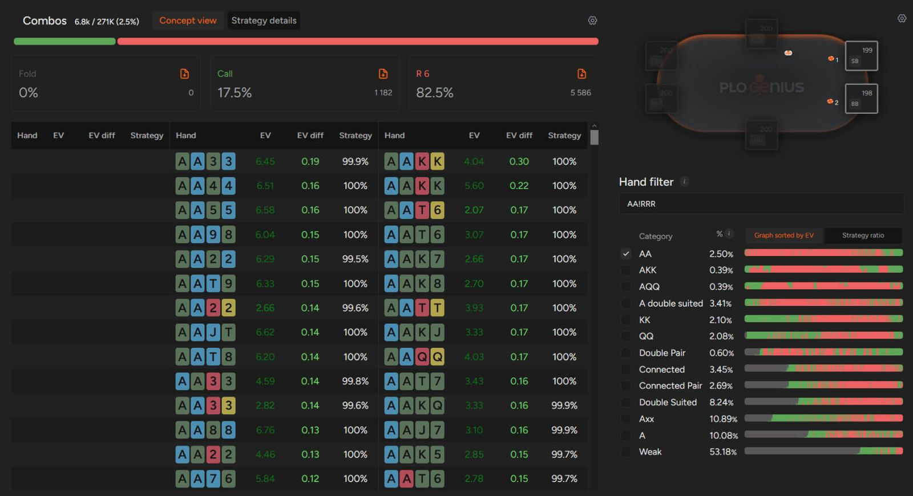
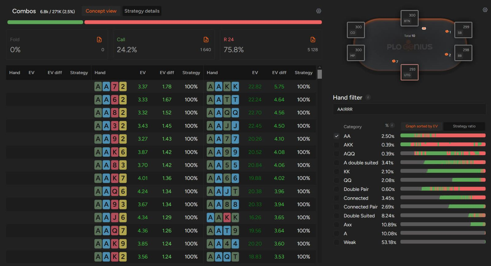

口袋 A-A 在奥马哈中看起来很强，但如果没有正确的翻牌前策略，它们可能会让你损失惨重 - 了解如何在 PLO 中盈利地玩转它们。

与 NLHE 类似，A-A 在 PLO 中是翻牌前最强的牌。然而，相似之处仅限于此。PLO 中，每手牌由 4 张牌组成，而非 2 张，这彻底改变了你看待 A-A 的方式。

在德州扑克中，共有 1326 种不同的牌型组合，其中只有 6 种包含 A-A，并且所有组合都遵循相同的翻牌前策略。而 PLO 则有 270,725 种不同的翻牌前牌型组合，其中 6961 种包含 A-A（以及另外两张牌）。

## 并非所有 A-A 在 PLO 中都一样

在这超过 6000 种牌型组合中，你会发现像 A-A-A-A、A-A-A-2 或 A-A-7-2-r 这样弱的牌型，以及像 A-A-K-K 双同花、A-A-J-T-ds 或 A-A-8-7-ds 这样强的牌型。正如你所想，尽管它们的核心牌型相似，但它们的 EV 和可玩性却大相径庭。

本文旨在分享一些提升 A-A-x-x 翻牌前策略的技巧（假设你的筹码量约为 100 BB）！

## PLO 中，除了 SB 之外，切勿溜入口袋 A-A

PLO 主要以现金游戏的形式进行。这一事实从多个方面影响着最佳策略，其中最重要的是抽水的存在。由于抽水是底池的一部分，会从牌桌上 “消失”，因此会产生两个主要后果。

首先，你必须打得更紧 - 如果牌局进入翻牌圈，可玩的筹码就会减少。因此，你在任何位置的最差牌都将不再有利可图，因为抽水会吞噬掉它们原本就微薄的潜在利润。

其次，你需要更激进一些。每次加注或 3-bet，你都有机会在翻牌前拿下底池，从而避免被抽水。一手牌赢 1.5 BB 看似微不足道，但让我们把它和整体胜率的衡量标准进行比较。

根据级别不同，每百手牌赢 5-10 个大盲注（BB/100）都是非常不错的成绩。每百手牌只赢盲注，就相当于赢了 150 BB/100！当然，玩家弃牌的频率不会高到足以达到这样的胜率，但这足以说明为什么在几乎所有情况下，加注都比溜入更好。

就像在德州扑克中一样，许多 PLO 新手喜欢 “欺骗性地” 玩口袋 A-A，在翻牌前溜入。为了你自己，千万不要这样做。除非你处于 SB，否则在底池无人加注时，要么加注，要么弃牌。在 PLO 中，玩 A-A 牌的这一部分很简单；无论你的牌型或位置如何，你都应该向未开池的底池加注。

## 为什么在 PLO 中不应该总是用口袋 A-A 进行 3-bet？

虽然理论上来说，PLO 中的任何 A-A 都应该比其他牌型略微占优势，但你不应该对所有 A-A 组合都进行 3-bet，尤其是在筹码较深的情况下。原因有很多，但最重要的一点是，这样做可以保护你免受后面玩家的挤压，避免被挤出底池。

如果你用 A-A-x-x 平跟 UTG 的开池，你就有机会跟注甚至 4-bet 来对抗挤压。通过用一些 A-A 的组合来增强你的跟注范围，你可以降低其他玩家不断 3-bet 你的概率，从而让你的弱牌也能发挥出更大的优势。此外，由于你偶尔会拿到顶三条，你也会让对手更难在 A 公共牌型上与你对战。

## PLO 通用规则：不利位置时，A-A 一定要 4-bet

在 PLO 中，位置是最关键的因素之一，远比 NLHE 重要。因此，很多强牌在翻牌前，如果在翻牌圈及之后的几轮处于不利位置，就会变得非常棘手。这就是为什么我们 - 遵循算法建议 - 建议你在不利位置时，所有 A-A 都要 4-bet。

这样做可以扩大底池，降低对手的位置优势，同时提升你的胜率。每当你在不利位置 4-bet 你的 A-A 时，你都有机会立即赢得底池。即使对手跟注，你的 SPR 也会更小，让你更容易选择正确的打法（通常是全押，但并非总是如此）。

## 了解奥马哈翻牌前策略的细微差别

尽管乍看之下与德州扑克相似，但奥马哈的复杂程度远超其本身。这种复杂性能让你建立起对对手的绝对优势。

所有有效的奥马哈策略都始于翻牌前，而这正是 GTO 解算器的用武之地。