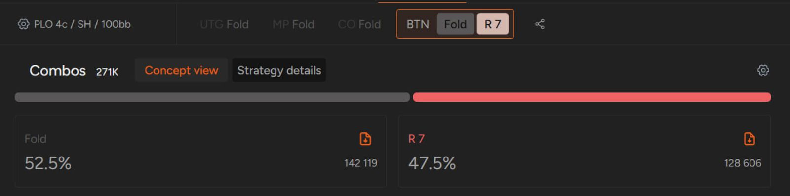
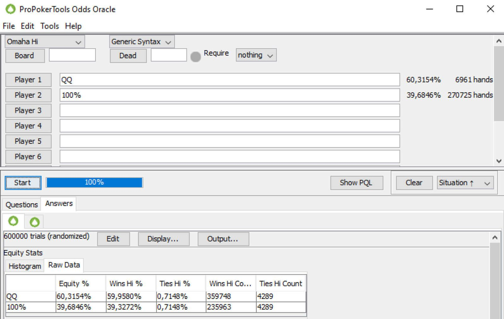

学习 PLO 策略中玩 K-K 和其他高对子的最佳方法。

我们最近的文章探讨了 [“新手玩家最常犯的错误”](pg03.md)，包括在多人底池中过于激进以及过度玩 A-A。这次，我们想提供更多建议，重点讲解包含其他高对子的牌型策略。

首先，我们给出一条适用于大多数扑克游戏类型和形式的建议：

## 不要在 PLO 游戏中跛入

**无论你是想便宜看翻牌还是设陷阱，都不要溜入！**

奥马哈几乎全部以现金游戏的形式进行。这带来了两个最重要的后果：

- 没有独立筹码模型（ICM）因素（因为所有决策都由现金价值驱动）
- 抽水会影响你的游戏范围。

由于大多数 PLO 的注额都在中低级别，抽水是你必须关注的一个因素。正因为抽水的存在，在抽水较高的扑克游戏中，你很难盈利地玩很多边缘牌型。打得更紧是降低高抽水影响的有效方法。如果你打得紧，通常就没有太多理由在可以开池的情况下选择溜入。

虽然在某些特殊情况下溜入也是可行的选择，但一般来说，你可以将溜入从你的奥马哈策略中剔除，尤其是在你还在学习这款游戏的时候。

## 不要过分看重底牌中的高对子

拥有双同花对子（例如 J-J-8-7-ds）的底牌固然令人兴奋，但这样的牌虽然漂亮，却也可能充满欺骗性。

我们之前已经强调过， PLO 的平均赢牌牌型比 NLHE 强得多，因此你必须谨慎，不要过度玩那些看起来比实际更强的牌。

我们在关于最常见的翻牌前错误的文章中讨论过这个问题，并在关于 [“翻牌前如何玩 A-A”](pg04.md) 的文章中也简要提及过。

在此背景下，我们也应该深入探讨一下在 PLO 中如何处理其他高对子。更重要的是要考虑：

## 好的边牌决定着大多数牌型的价值

这一点在翻牌前尤为重要 - 如果你开始玩 PLO，这是你必须牢记的最重要的事情之一。在德州扑克中，翻牌前弃掉 K-K 很少是明智之举，因为除了 A-A 之外，K-K 几乎可以碾压对手的所有其他牌型。你手持 K-K 而对手手持 A-A 的情况非常罕见，通常被认为是 “爆冷”（cooler），即双方牌力都非常强，谁都不能弃牌。

在 PLO 中，双方的权益要接近得多，因此你必须采用不同的翻牌前策略。一般来说，在单挑底池中，在公共牌发出前用 A-A 全押不会让你陷入困境（你几乎总是领先，最坏情况下权益也接近 50%）。但对于 K-K-x-x 组合来说，情况就大不相同了。

由于翻牌前全押的动力远低于其他牌型（你很少能指望拥有超过约 66% 的权益），大多数奥马哈玩家在一般牌局中都会非常被动，除非他们手牌只有 A-A-x-x，否则不会持续底池下注。

当然，A-A-x-x 组合是 K-K-x-x 牌型的克星。因此，当你的被动对手变得非常活跃时，你很少应该在翻牌前用 K-K 投入大量筹码。K-K 在 3-bet 或 4-bet 时最为有效，主要针对那些过于激进、可能高估自己牌力的玩家。面对所谓的 “疯子”，围绕 K-K 组合的最佳牌型也能应对自如；你的下注大部分筹码多数都是领先的，而且在较低的 SPR 下，翻牌后的游戏也会相对容易。

K-K-x-x 牌型需要满足的另一个重要条件是必须包含一张 A。底牌中有 A 会大幅降低对手持有 A-A-x-x 的概率，并且在公共牌中有 A 时，你的可玩性也会大大增加。

说到手牌中某张牌的重要性，关于 K-K 还有另一个需要注意的地方。当你选择一手牌进行 4-bet 诈唬时（这种情况虽然少见，但并非不可能），务必选择不包含 K-K 的牌。这样一来，对手持有 K-K-x-x 的概率就会增加，而 K-K-x-x 的牌型更倾向于弃牌，从而提升你的弃牌权益。

## K-K、Q-Q、J-J 最强大的优势之一在于能够击中大三条压制小三条击败对手

像 Q-Q、J-J 这样的高对子原生权益不错，但如果只是一手超对，那么在摊牌时很少能赢牌。这就引出了另一个重点。

你的对子等级越小，边牌就越重要。在静态牌面的情况下，如果你有超对，而边牌又没什么亮点，那么 A-A（以及在某种程度上还有 K-K）仍然有一定的可玩性。

同时，如果没有可靠的后备，Q-Q 和 J-J 的表现会很差，尤其是在奥马哈游戏中，玩家通常都喜欢跟注，导致大多数翻牌圈都会出现多人跟注的情况。

## 奥马哈牌型可能具有欺骗性

一开始，区分好牌和坏牌可能比较棘手，但只要稍加练习，并非不可能。

GTO 解算器在让你的游戏体验更加轻松，帮助你了解好的起手牌应该具备哪些特质，以及如何制定你的翻牌前奥马哈策略！