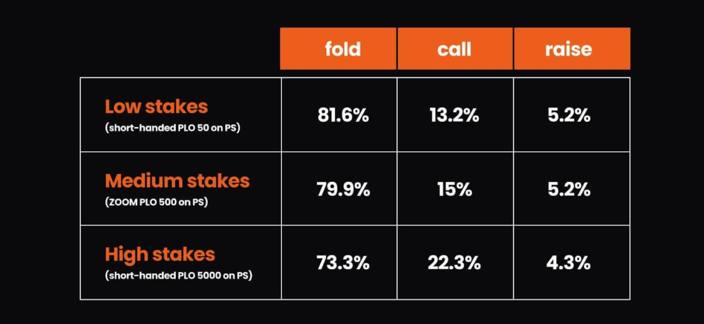

# 在 PLO 中，你应该冷跟注吗？

了解在 PLO 中，何时适合冷跟注，其风险，以及抽水和对手的影响。

关于冷跟注是否合理的争论在扑克界由来已久。一些玩家坚信冷跟注是稳健扑克策略不可或缺的一部分，而另一些玩家则认为应该只采取加注 - 弃牌策略。

究竟哪一方的观点才是正确的？答案很大程度上取决于你所玩的游戏形式，因为在德州扑克锦标赛中行之有效的策略往往在现金游戏中效果不佳，更不用说在奥马哈中了。

因此，本文将着重探讨 PLO 中的冷跟注策略。

## 什么是冷跟注？

我们先从基础说起 - 什么才算是冷跟注？冷跟注指的是在你前面至少有一个加注，而你选择跟注（而不是加注或弃牌）的情况。通常情况下，你不会结束行动，所以后面至少还有一位玩家可以加注之前的下注。

那么，在 PLO 中，冷跟注开池是否合适呢？

简而言之，答案是肯定的。与溜入（根据解算器的输出，我们通常不建议溜入）不同，冷跟注在某些情况下是有意义的。

为什么呢？如果你正确选择冷跟注的牌型：

- 你可以用有潜力赢得大底池的牌，以较低的成本看到翻牌
- 你通常会在接下来的牌局中占据有利位置
- 你可以让盲注位上的弱手玩家用他们不应该（如果你加注的话他们也不会）的牌进入底池

当然，凡事都有两面性，冷跟注也存在一些风险，例如：

- 即使对手底牌很差，公共牌也可能改善他们的底牌。
- 冷跟注后，如果对手加注，你有时可能被迫弃牌。
- 翻牌前你无法赢得底池，因此你肯定要支付抽水。

*值得一提的是，抽水是 PLO 中影响最佳策略的重要因素。它对策略的影响如此之大，以至于 GTO 解算器 - 可以针对三种不同的抽水结构生成解决方案。*

抽水应该对你的范围产生多大的影响？

在 100 BB 深度的 PLO4 游戏中，BTN 对抗 UTG 开池的范围如下所示（针对不同的抽水结构）：

这些差异在不同情况下会有所不同，但这并非重点，因为具体数字并不重要。最重要的是，你需要大致了解抽水高低变化时情况会发生怎样的变化。

## 考虑冷跟注时需要考虑的因素

与扑克中的许多概念一样，选择冷跟注而不是加注或弃牌的有效性很大程度上取决于具体情况。在权衡各种选择的利弊时，你需要考虑以下几点：

**你后面的玩家是谁？**

你后面的玩家越激进，他们就越有可能进行 3-bet，从而取得下注主动性，并很可能将你挤出底池。在这种情况下，你应该更倾向于 3-bet 或弃牌的策略。

**谁坐在 BB 和 SB？**

盲注位的玩家越弱，你就越应该与他们对战。如果对手很可能在 3-bet 时弃牌，但却乐于跟注一次加注，那么不妨考虑冷跟注你的牌，以期在面对实力较弱的对手时获得优势。

一般来说，如果你经常玩线上扑克，你应该更加自律，减少冷跟注的次数；但在线下游戏中，你可以更灵活地跟注 - 只要你清楚自己为什么选择跟注而不是相对 3-bet 或弃牌。

## 最后一点需要强调

在德州扑克中，制定冷跟注范围相对容易。毕竟，牌型组合只有 1,326 种（如果忽略花色则为 169 种），将范围缩小到适合冷跟注的组合也相对简单。

而奥马哈则不同，它有 270,725 种牌型组合（如果不考虑花色则为 16,432 种），情况就复杂得多。如此庞大的数字几乎无法直观理解，因此你必须更多地从类别而非具体的牌型角度来思考。

GTO 解算器正是在这种情况下派上用场 - 它的输入功能可以让你轻松浏览哪些牌型更适合特定的行动，从而帮助你了解哪些特征至关重要。