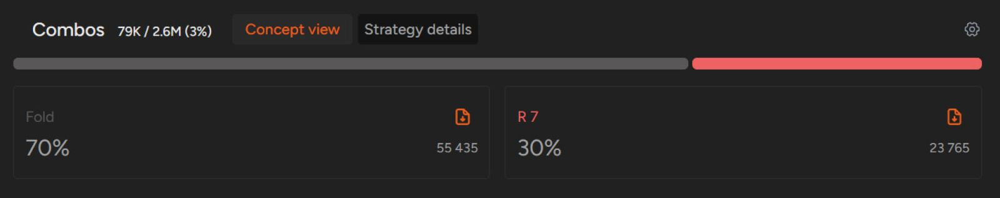
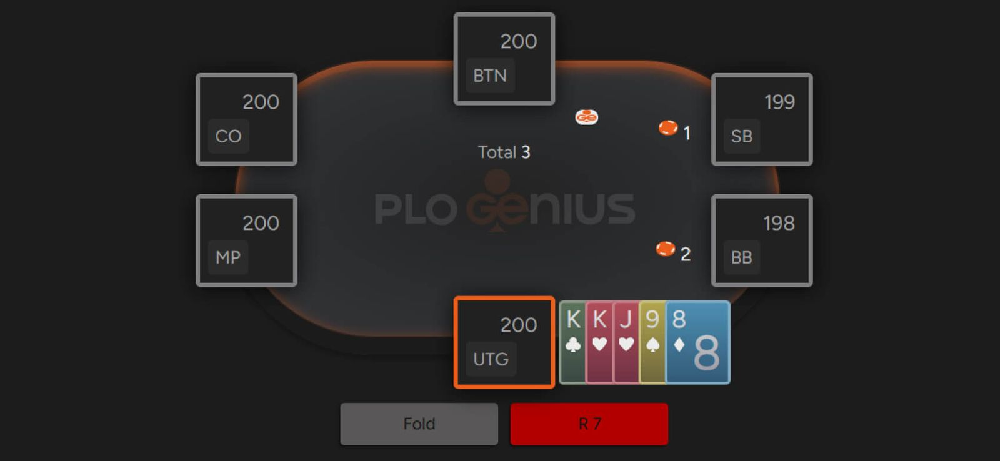

PLO5 越来越火 - 值得一试吗？

如果你很少玩扑克，或者德州扑克一直是你的最爱，你可能会问自己：为什么要费心去玩 PLO5？事实证明，这款底 PLO 的 “小弟” 正受到越来越多的关注，而我们今天就来为你揭开它的神秘面纱。

虽然 PLO5 在主流在线扑克平台上并不流行，但它却成为了许多赌徒，尤其是线下玩家的新宠。如今，许多 PLO 现金游戏都包含五张底牌的 PLO5 版本，有时甚至会取代 PLO4。

原因很简单：五张底牌保证了比 “常规” PLO 更刺激的游戏体验。

## PLO 的升级版

乍一看，PLO5 和 PLO 的唯一区别似乎只是底牌的数量。这在很大程度上是正确的；然而，这张额外的底牌对游戏进程的影响远超你的想象。

例如，我们来看看翻牌前的组合数量 - 多出的一张底牌极大地增加了组合的可能性。 PLO4 有超过 27 万种组合，而 PLO5 则拥有惊人的 280 万种组合。与 NLHE 的 1326 种组合相比，这简直是一个天文数字！

尽管 PLO5 和 PLO4 的底池限注规则和公共牌规则相同，但魔鬼藏在细节里。第五张牌增加了游戏的复杂性，也进一步凸显了翻牌前正确策略的重要性。

现在你应该已经意识到在 PLO4 中很容易沉迷其中；由于很多牌型对业余玩家来说都很有吸引力，所以非常松散的打法是常态。这种现象在 PLO5 中更为明显，因为你拿到的每一手牌都至少有两张花色相同的牌，而且它们往往是部分相连的。

不过，不要被表象迷惑；平均而言，你在 PLO5 中愿意玩的牌应该是 PLO4 牌型的改进版。例如，在100 BB 的中级别 PLO 游戏中，你几乎可以用 64% 的 K-K 组合在 UTG 开池盈利。而在 PLO5 中，同样的情况下，这个数字会显著下降到 30% 左右。

像这样的差异还有很多，例如两对牌型，如果你想更深入地了解 PLO5，这些都值得探索。虽然特定位置的总体手牌使用频率与常规 PLO 相似，但魔鬼藏在细节里。

## 5 张 PLO的禁忌

与 PLO 一样，在 PLO5 中，持有 A-A 的牌型并非总是翻牌前必须加注 / 再加注。由于 PLO5 的权益变化比 PLO 更加平滑，这种差异尤为明显。因此，你很少能在翻牌前以显著的权益优势加注（然而，一手优质 A-A，例如 A-A-J-J-T 双同花，相对于一手垃圾 A-A，例如 A-A-2-T-7 单同花，权益优势约为 60 / 40）。

正确的翻牌前策略会影响翻牌后策略，在筹码较深的情况下，正确的翻牌前选择会在翻牌后阶段为你带来回报。

例如，在 NLHE 中，翻牌圈拿到顶对通常足以让你把相当一部分甚至全部筹码投入底池。但在 PLO 中，这种情况却很少见 - 只有那些拥有良好连接牌的顶对才能被激进地玩，或者能够抵挡住对手的激进攻势。在 PLO5 中，顶对更加脆弱，这意味着大多数情况下，只有那些拥有完美边牌的绝对最佳牌型才能在面对对手的激进攻势时继续游戏。

你需要明白，PLO5 比其他游戏更注重玩家的自律；很多时候，你不得不弃掉一些非常强的牌，因为你的实际权益会远低于你预想的水平。

另一个简单粗暴的例子就是用 “坚果牌” 全押。对于没有 PLO 经验的玩家来说，在任何一轮都用最好的牌把所有筹码都押上底池似乎很自然。

但在 PLO5 中，这可能是一个代价高昂的习惯。比如说，在 6-5-4 的牌面上，你拿着 8-7，没有任何后备（意味着没有对子、顺子听牌或同花听牌），就全押，而对手却有三条或同花听牌，即使你手握最佳成牌，权益也可能低于 30%！

PLO5 迫使你更加关注手牌的整体可玩性以及接下来几轮的发牌，因为这些都会影响公共牌的结构。

好消息是，这种游戏机制吸引了许多渴望刺激、不愿弃掉底 / 中三条或较弱同花的玩家。翻牌前有如此多的潜在组合，很容易让人迷失在特定情况下哪些牌应该或不应该作为主动进入底池（VPIP）的判断上。

如今，即使是水平较弱的玩家也对德州扑克的翻牌前策略有所了解。但对于五张 PLO 来说，情况则截然不同。考虑到所有因素，我们认为五张 PLO 是所有主流扑克游戏中玩家水平最低的；如果你对此有所怀疑，不妨去附近的现金局试试 - 你或许会感到惊讶。

由于游戏的复杂性，目前还没有公开可用的解算器，这使得制定正确的 PLO5 策略更加困难。不过，好消息是，这种情况即将改变。

## PLO5 是一款有趣且有利可图的游戏

你将能够从中获利。事实上，你现在就可以开始。

GTO 解算器为你提供 PLO 和 PLO5 的翻牌前策略解决方案，也在定期更新翻牌后策略库！