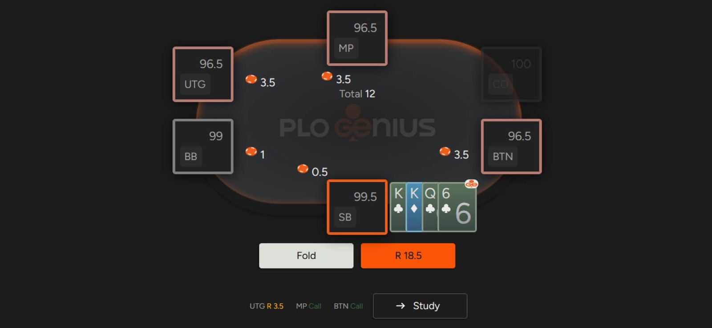
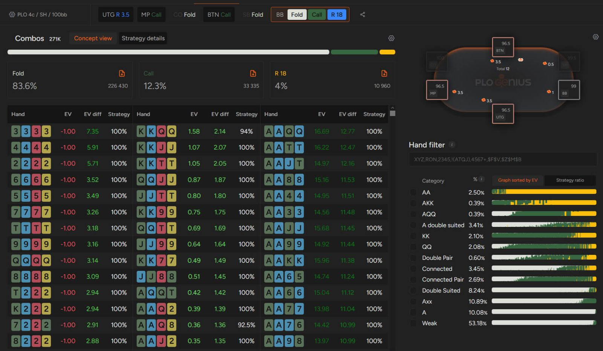

# 在 PLO 中，如何应对多人底池？

掌握在 PLO 中应对多人底池的技巧，将大幅提升你的胜率！

如果要说低级别或中级别扑克游戏的一个特点，那就是玩家们都讨厌弃牌。这一点在现场现金游戏中尤为明显，因为这类游戏中充斥着休闲玩家，他们很快就会对自己的底牌产生依赖。

由于四张牌的组合提供了更多与公共牌配合的机会，PLO 中的多人底池比 NLHE 更为常见。任何玩过$2/2 或 $5/5 休闲游戏的人都会认同，在这些游戏中，几乎没有人会在翻牌前弃牌，几乎每个人都想看到翻牌。

这样的环境为你提供了获得高胜率的绝佳机会；毕竟，如果玩家过于激进，最终都会输钱，但如何巧妙地处理多人底池则需要技巧。

在本文中，我们将分享一些与多人底池对战的技巧。

## 不要被平庸的牌型冲昏头脑

有人说，PLO 是 “坚果牌” 游戏。虽然这未必完全正确，但不可否认的是，在多人底池中，你需要比单挑时更高的牌力才能继续游戏。对于像第二大顺子、第二大同花听牌或中等三条这样的中等牌型，这一点尤为重要。

这类牌型通常足以让你在面对单个对手时投入更多筹码 - 因为你的补牌机会相当多。但当面对两个或更多对手时，这一原则会发生显著变化。当你听非坚果顺子或更小的同花听牌时，很可能已经没有胜算了。

面对多名对手时，要谨慎对待没有坚果潜力的牌型；通常情况下，最好放弃较弱的组合，因为它们的权益不足以继续游戏。

由于权益被定义为玩家在底池中所占的份额（假设摊牌前不再有任何行动），因此在多人底池中，尝试在翻牌圈评估你的牌的权益。如果你认为你的权益高于平均底池份额，也就是说，高于三人底池的 33%、四人底池的 25% 或五人底池的 20%，那么这很可能是一手值得你投入更多筹码的牌。

额外提示：在高 SPR 的多人底池中，要谨慎对待 [“A-A组合”](pg04.md)。虽然它们在翻牌前通常权益很高，但公共牌发出后往往会发生变化。通常情况下，如果你只在翻牌圈击中一对超对而没有其他牌型，那么面对多名对手时，你应该格外谨慎。在多人对局中，如果你的牌型是 A-A 没有后备的组合，那么在翻牌圈弃牌通常是更好的选择，因为你几乎没有机会提升牌力。

估算多人对局的权益并不容易，但如果你能正确地选择手牌，将会对你大有帮助。

## 在 BB 不要盲目跟注垃圾牌

在 NLHE 中，盲注位跟注很诱人，在 PLO 中则更具诱惑力，但千万不要这样做。你很容易陷入这样的境地：一个错误的翻牌前决策会导致翻牌、转牌或河牌圈的进一步失误。拿着没有翻牌后可玩性的底牌跟注开池，会造成代价高昂的漏洞，即使是经验丰富的玩家也常常意识不到这一点。

正确的翻牌前 PLO 策略至关重要，它可以避免你陷入困境，损失大量资金。在 PLO 中，过于松散的翻牌前打法比在德州扑克中惩罚更重，因为你经常会发现自己拿着看似很强的牌，但这些牌不足以对抗多个对手。

例如，在 NLHE 中，用底三条或中三条全押很少会出错，但在 PLO 中，同样的逻辑会严重降低你的胜率。

## 位置至关重要

在扑克中，位置不利通常不是你想要的。在 PLO 中，位置的重要性比其他游戏更为突出。如果你面对多个对手且位置不利，那就更难扭转局面；因此，你不仅在 BB，在前位和中位也应该格外谨慎。

即使同桌的玩家不会用 3-bet 惩罚你，你也不应该在前位打得过于松散。即使翻牌的看牌的价格很低，你也无法从多人底池中用平庸的牌型获利。

## 考虑激进地玩你的（坚果）听牌

如果你的选牌精准，你通常会拿到所有可能听牌中最好的那一手。如果你的对手乐于用较差的听牌或较弱的摊牌价值投入更多筹码，你应该让他们付出代价。

通过积极主动地玩你的听牌，你更有可能实现未成牌的牌力。我们已经强调过，在多人底池中拿着平庸的听牌或成牌是不明智的选择；当你积极主动地玩，并且有很多机会拿到最强牌时，你就是在惩罚对手的这种做法。

他们要么用更差的听牌投入更多筹码，冒着被 “爆冷” 的风险，要么弃牌，让你无需摊牌就能赢牌。

## GTO 解算器将提升你对多人底池的理解

当你研究单挑局面时，解算器尤为有用。不仅能帮助你处理一对一底池，还能提示你在多人底池的情况下应该如何行动。

这能为你带来巨大的优势；你还可以选择不同的筹码量、游戏模式和范围结构 - 所有设置都便捷地存储在一个应用程序中。