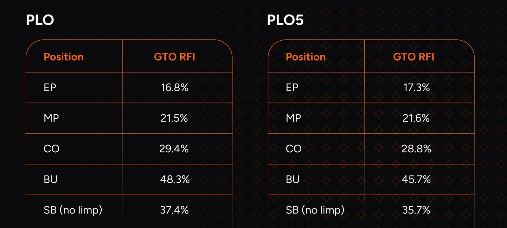

# PLO5 翻牌前策略与 PLO4 有何不同？

了解 PLO5 翻牌前策略与四张牌奥马哈有何不同，以及你需要做出哪些调整。

如果你对 PLO 感兴趣，也不要忽略它的 “小兄弟” -  PLO5。正如我们在介绍文章中提到的，PLO5 值得一试，尤其适合线下扑克玩家。然而，鉴于其日益增长的人气，即使你只玩线上扑克，学习一些 PLO5 的基本策略也绝不会错。

由于许多休闲玩家都喜欢 PLO5，这款游戏对职业玩家的吸引力也越来越大。不过，切勿贸然入局；在欺负实力较弱的玩家之前，务必做好充分的准备；如果没有对 PLO5 的基本特性有所了解，你的结果可能会与预期大相径庭。

然而，目前市面上关于 PLO5 的内容和可靠的扑克工具并不多，这意味着许多玩家只能依靠直觉来制定策略。但有了 GTO 解算器，你就不必再为此烦恼了。

由于 PLO5 主要在赌场和扑克 App 上进行，你的对手通常对常规 PLO 的概念都不太了解，更不用说五张牌奥马哈的变体了。因此，PLO5 比 PLO4 更松散，平均 VPIP 更高，底池更大（通常有多人参与），而且筹码进入底池的情况也更频繁。

如何才能不迷失在这种疯狂的局面中呢？

## 关于 PLO5 你需要知道的事

我们先来看看它与其他游戏的相似之处。由于 PLO5 的基本机制与 PLO4 类似（你拿到自己的底牌，最多会有五张公共牌），你应该熟悉一些通用概念，例如范围优势、范围感知和权益估算。

关键在于如何将这些概念从 PLO4 应用到 PLO5。

玩 PLO5 时，你应该培养的首要技能之一是识别翻牌前 VPIP（即跟注或加注）的组合。

对于许多读者来说，尤其是考虑到游戏的特性，PLO4 和 PLO5 的翻牌前率先加注进池（RFI）频率可能会让他们感到惊讶。

正如你所见，第五张牌并不能证明松散打法的合理性，尽管你在几乎所有 PLO5 游戏中都会遇到这种情况。魔鬼藏在细节里，因为开池范围的百分比其实很相似。

## PLO4 和 PLO5 的策略有什么区别？

在继续之前，有一些数据值得了解。超过 46% 的牌型组合是双同花（在常规 PLO 中，这个比例只有13%！），这意味着双同花的优势并没有你想象的那么大。

由于 PLO5 中你拿到的每手牌至少都是单花色，大约 25% 的牌型是 A 高同花。如此高的比例大幅降低了 K、Q 或 J 高同花听牌的 EV，因为它们被压制的概率远高于常规 PLO。这也说明了在 PLO5 中，拿到坚果听牌有多么重要（我们将在后续文章中更深入地探讨这一点）。

奥马哈 GTO 的开池范围在 PLO4 和 PLO5 之间有何不同？让我们来分析几种最重要牌型的开池差异。以下假设筹码深度为 100 BB。

首先来看最常见的牌型 A-A。这两个游戏最大的区别在于 A-A 的出现频率。在 PLO4 中，A-A（不包括三条和四条）的出现频率为 2.57%；而在 PLO5 中，这一比例上升至 4%（同样不包括 A-A-A+ 组合）。因此，UTG 的开池范围几乎有 1/4 包含 A-A。不出所料，所有 A-A 组合在任何位置都是全部开池。

那么 K-K 组合呢？如果我们排除 A-K-K 和 K-K-K 组合，在 PLO4 中，UTG 的 K-K 组合大约有 64% 可以开池。这个比例在 PLO5 中显著下降，只有 30% 的 K-K 组合会在 UTG 开池。令人惊讶的是，即使是一些同花组合，在 PLO5 中也会被弃牌！

如果我们移到 BTN，即使在 PLO5 中，最差的 K-K 组合（接近 4%）也会被弃牌。

对于 Q-Q 组合，你必须更加谨慎。如果我们考虑不含 A 的组合，根据 GTO 理论，在 PLO4 中，UTG 有 23% 的组合会被加注；而在 PLO5 中，这个比例下降到 15%。BTN 的差异更加明显。在 PLO 中，你可以开池的 Q-Q 组合大约有 96%，但在 PLO5 中只有 74%。

最后，我们来比较一下两对牌型的一些数据，这些数据最有意思。在 PLO4 游戏中，超过 75% 的两对牌型都可以在 UTG 开池；而且你很可能轻松猜对大多数组合。但在 BTN，只有两种组合在特定情况下需要弃牌：7-7-2-2 和 8-8-3-3。

PLO5 的情况则大不相同，你需要更加谨慎。在 UTG，只有 11.7% 的两对牌型应该开池。而在 BTN，这个比例高达 47%，这意味着你仍然需要放弃超过 50% 的两对牌型！

正如你所见，多一张牌可以极大地改变许多情况下的开池策略。因此，在 PLO5 和 PLO4 中使用相同的策略是错误的，这一点你在现场扑克牌桌上会经常看到。

## 自己去发现更多差异

我们将在后续文章中探讨其他与 PLO5 相关的主题，因为还有更多翻牌前策略的细微差别值得挖掘。我们邀请你亲自探索。

借助 GTO 解算器，你可以快速找到正确的翻牌前策略，同时还能修正从 PLO4 转换过来的漏洞！